cola Report for Hierarchical Partitioning - 'LawlorPancreas'
==================

**Date**: 2021-07-26 10:50:21 CEST, **cola version**: 1.9.4

----------------------------------------------------------------

<style type='text/css'>

body, td, th {
   font-family: Arial,Helvetica,sans-serif;
   background-color: white;
   font-size: 13px;
  max-width: 800px;
  margin: auto;
  margin-left:210px;
  padding: 0px 10px 0px 10px;
  border-left: 1px solid #EEEEEE;
  line-height: 150%;
}

tt, code, pre {
   font-family: 'DejaVu Sans Mono', 'Droid Sans Mono', 'Lucida Console', Consolas, Monaco, 

monospace;
}

h1 {
   font-size:2.2em;
}

h2 {
   font-size:1.8em;
}

h3 {
   font-size:1.4em;
}

h4 {
   font-size:1.0em;
}

h5 {
   font-size:0.9em;
}

h6 {
   font-size:0.8em;
}

a {
  text-decoration: none;
  color: #0366d6;
}

a:hover {
  text-decoration: underline;
}

a:visited {
   color: #0366d6;
}

pre, img {
  max-width: 100%;
}
pre {
  overflow-x: auto;
}
pre code {
   display: block; padding: 0.5em;
}

code {
  font-size: 92%;
  border: 1px solid #ccc;
}

code[class] {
  background-color: #F8F8F8;
}

table, td, th {
  border: 1px solid #ccc;
}

blockquote {
   color:#666666;
   margin:0;
   padding-left: 1em;
   border-left: 0.5em #EEE solid;
}

hr {
   height: 0px;
   border-bottom: none;
   border-top-width: thin;
   border-top-style: dotted;
   border-top-color: #999999;
}

@media print {
   * {
      background: transparent !important;
      color: black !important;
      filter:none !important;
      -ms-filter: none !important;
   }

   body {
      font-size:12pt;
      max-width:100%;
   }

   a, a:visited {
      text-decoration: underline;
   }

   hr {
      visibility: hidden;
      page-break-before: always;
   }

   pre, blockquote {
      padding-right: 1em;
      page-break-inside: avoid;
   }

   tr, img {
      page-break-inside: avoid;
   }

   img {
      max-width: 100% !important;
   }

   @page :left {
      margin: 15mm 20mm 15mm 10mm;
   }

   @page :right {
      margin: 15mm 10mm 15mm 20mm;
   }

   p, h2, h3 {
      orphans: 3; widows: 3;
   }

   h2, h3 {
      page-break-after: avoid;
   }
}
</style>


## Summary


First the variable is renamed to `res_rh`.


```r
res_rh = rh
```


The partition hierarchy and all available functions which can be applied to `res_rh` object.


```r
res_rh
```

```
#> A 'HierarchicalPartition' object with 'ATC:skmeans' method.
#>   On a matrix with 14607 rows and 638 columns.
#>   Performed in total 5400 partitions.
#>   There are 22 groups under the following parameters:
#>     - min_samples: 6
#>     - mean_silhouette_cutoff: 0.9
#>     - min_n_signatures: 143 (signatures are selected based on:)
#>       - fdr_cutoff: 0.05
#>       - group_diff (scaled values): 0.5
#> 
#> Hierarchy of the partition:
#>   0, 638 cols
#>   |-- 01, 377 cols, 1587 signatures
#>   |   |-- 011, 207 cols, 2764 signatures
#>   |   |   |-- 0111, 73 cols, 256 signatures
#>   |   |   |   |-- 01111, 38 cols, 3 signatures (c)
#>   |   |   |   `-- 01112, 35 cols (a)
#>   |   |   |-- 0112, 71 cols, 388 signatures
#>   |   |   |   |-- 01121, 32 cols, 37 signatures (c)
#>   |   |   |   `-- 01122, 39 cols, 1 signatures (c)
#>   |   |   `-- 0113, 63 cols, 249 signatures
#>   |   |       |-- 01131, 39 cols (a)
#>   |   |       `-- 01132, 24 cols, 181 signatures
#>   |   |           |-- 011321, 16 cols, 0 signatures (c)
#>   |   |           `-- 011322, 8 cols (b)
#>   |   `-- 012, 170 cols, 4252 signatures
#>   |       |-- 0121, 59 cols, 79 signatures (c)
#>   |       |-- 0122, 40 cols, 545 signatures
#>   |       |   |-- 01221, 15 cols, 16 signatures (c)
#>   |       |   |-- 01222, 15 cols, 71 signatures (c)
#>   |       |   `-- 01223, 10 cols (b)
#>   |       |-- 0123, 36 cols, 373 signatures
#>   |       |   |-- 01231, 18 cols, 0 signatures (c)
#>   |       |   `-- 01232, 18 cols, 0 signatures (c)
#>   |       `-- 0124, 35 cols, 13 signatures (c)
#>   `-- 02, 261 cols, 5379 signatures
#>       |-- 021, 90 cols, 1013 signatures
#>       |   |-- 0211, 48 cols, 2 signatures (c)
#>       |   `-- 0212, 42 cols, 13 signatures (c)
#>       |-- 022, 76 cols, 903 signatures
#>       |   |-- 0221, 34 cols, 80 signatures (c)
#>       |   `-- 0222, 42 cols, 56 signatures (c)
#>       |-- 023, 43 cols, 507 signatures
#>       |   |-- 0231, 17 cols, 1 signatures (c)
#>       |   |-- 0232, 12 cols, 46 signatures (c)
#>       |   `-- 0233, 14 cols, 0 signatures (c)
#>       `-- 024, 52 cols, 36 signatures (c)
#> Stop reason:
#>   a) Mean silhouette score was too small
#>   b) Subgroup had too few columns.
#>   c) There were too few signatures.
#> 
#> Following methods can be applied to this 'HierarchicalPartition' object:
#>  [1] "all_leaves"            "all_nodes"             "cola_report"           "collect_classes"      
#>  [5] "colnames"              "compare_signatures"    "dimension_reduction"   "functional_enrichment"
#>  [9] "get_anno_col"          "get_anno"              "get_children_nodes"    "get_classes"          
#> [13] "get_matrix"            "get_signatures"        "is_leaf_node"          "max_depth"            
#> [17] "merge_node"            "ncol"                  "node_info"             "node_level"           
#> [21] "nrow"                  "rownames"              "show"                  "split_node"           
#> [25] "suggest_best_k"        "test_to_known_factors" "top_rows_heatmap"      "top_rows_overlap"     
#> 
#> You can get result for a single node by e.g. object["01"]
```

The call of `hierarchical_partition()` was:


```
#> hierarchical_partition(data = lt$mat, anno = lt$anno, subset = 500, cores = 4)
```

Dimension of the input matrix:


```r
mat = get_matrix(res_rh)
dim(mat)
```

```
#> [1] 14607   638
```

All the methods that were tried:


```r
res_rh@param$combination_method
```

```
#> [[1]]
#> [1] "ATC"     "skmeans"
```

### Density distribution

The density distribution for each sample is visualized as one column in the following heatmap.
The clustering is based on the distance which is the Kolmogorov-Smirnov statistic between two distributions.


```r
library(ComplexHeatmap)
densityHeatmap(mat, top_annotation = HeatmapAnnotation(df = get_anno(res_rh), 
    col = get_anno_col(res_rh)), ylab = "value", cluster_columns = TRUE, show_column_names = FALSE,
    mc.cores = 1)
```


Some values about the hierarchy:


```r
all_nodes(res_rh)
```

```
#>  [1] "0"      "01"     "011"    "0111"   "01111"  "01112"  "0112"   "01121"  "01122"  "0113"  
#> [11] "01131"  "01132"  "011321" "011322" "012"    "0121"   "0122"   "01221"  "01222"  "01223" 
#> [21] "0123"   "01231"  "01232"  "0124"   "02"     "021"    "0211"   "0212"   "022"    "0221"  
#> [31] "0222"   "023"    "0231"   "0232"   "0233"   "024"
```

```r
all_leaves(res_rh)
```

```
#>  [1] "01111"  "01112"  "01121"  "01122"  "01131"  "011321" "011322" "0121"   "01221"  "01222" 
#> [11] "01223"  "01231"  "01232"  "0124"   "0211"   "0212"   "0221"   "0222"   "0231"   "0232"  
#> [21] "0233"   "024"
```

```r
node_info(res_rh)
```

```
#>        id best_method depth best_k n_columns n_signatures p_signatures is_leaf
#> 1       0 ATC:skmeans     1      2       638         2868     1.96e-01   FALSE
#> 2      01 ATC:skmeans     2      2       377         1587     1.09e-01   FALSE
#> 3     011 ATC:skmeans     3      3       207         2764     1.89e-01   FALSE
#> 4    0111 ATC:skmeans     4      2        73          256     1.75e-02   FALSE
#> 5   01111 ATC:skmeans     5      2        38            3     2.05e-04    TRUE
#> 6   01112 ATC:skmeans     5      2        35           NA           NA    TRUE
#> 7    0112 ATC:skmeans     4      2        71          388     2.66e-02   FALSE
#> 8   01121 ATC:skmeans     5      2        32           37     2.53e-03    TRUE
#> 9   01122 ATC:skmeans     5      2        39            1     6.85e-05    TRUE
#> 10   0113 ATC:skmeans     4      2        63          249     1.70e-02   FALSE
#> 11  01131 ATC:skmeans     5      2        39           NA           NA    TRUE
#> 12  01132 ATC:skmeans     5      2        24          181     1.24e-02   FALSE
#> 13 011321 ATC:skmeans     6      2        16            0     0.00e+00    TRUE
#> 14 011322 not applied     6     NA         8           NA           NA    TRUE
#> 15    012 ATC:skmeans     3      4       170         4252     2.91e-01   FALSE
#> 16   0121 ATC:skmeans     4      2        59           79     5.41e-03    TRUE
#> 17   0122 ATC:skmeans     4      3        40          545     3.73e-02   FALSE
#> 18  01221 ATC:skmeans     5      2        15           16     1.10e-03    TRUE
#> 19  01222 ATC:skmeans     5      2        15           71     4.86e-03    TRUE
#> 20  01223 not applied     5     NA        10           NA           NA    TRUE
#> 21   0123 ATC:skmeans     4      2        36          373     2.55e-02   FALSE
#> 22  01231 ATC:skmeans     5      2        18            0     0.00e+00    TRUE
#> 23  01232 ATC:skmeans     5      2        18            0     0.00e+00    TRUE
#> 24   0124 ATC:skmeans     4      2        35           13     8.90e-04    TRUE
#> 25     02 ATC:skmeans     2      4       261         5379     3.68e-01   FALSE
#> 26    021 ATC:skmeans     3      2        90         1013     6.94e-02   FALSE
#> 27   0211 ATC:skmeans     4      2        48            2     1.37e-04    TRUE
#> 28   0212 ATC:skmeans     4      2        42           13     8.90e-04    TRUE
#> 29    022 ATC:skmeans     3      2        76          903     6.18e-02   FALSE
#> 30   0221 ATC:skmeans     4      3        34           80     5.48e-03    TRUE
#> 31   0222 ATC:skmeans     4      2        42           56     3.83e-03    TRUE
#> 32    023 ATC:skmeans     3      3        43          507     3.47e-02   FALSE
#> 33   0231 ATC:skmeans     4      2        17            1     6.85e-05    TRUE
#> 34   0232 ATC:skmeans     4      3        12           46     3.15e-03    TRUE
#> 35   0233 ATC:skmeans     4      2        14            0     0.00e+00    TRUE
#> 36    024 ATC:skmeans     3      2        52           36     2.46e-03    TRUE
```

In the output from `node_info()`, there are the following columns:

- `id`: The node id.
- `best_method`: The best method selected.
- `depth`: Depth of the node in the hierarchy.
- `best_k`: Best number of groups of the partition on that node.
- `n_columns`: Number of columns in the submatrix.
- `n_signatures`: Number of signatures with the `best_k`.
- `p_signatures`: Proportion of hte signatures in total number of rows in the matrix.
- `is_leaf`: Whether the node is a leaf.

Labels of nodes are encoded in a special way. The number of digits
correspond to the depth of the node in the hierarchy and the value of the
digits correspond to the index of the subgroup in the current node, E.g. a label
of “012” means the node is the second subgroup of the partition which is the
first subgroup of the root node.

### Suggest the best k


Following table shows the best `k` (number of partitions) for each node in the
partition hierarchy. Clicking on the node name in the table goes to the
corresponding section for the partitioning on that node.

[The cola vignette](https://jokergoo.github.io/cola_vignettes/cola.html#toc_13)
explains the definition of the metrics used for determining the best
number of partitions.


```r
suggest_best_k(res_rh)
```


|Node                    |Best method                                         |Is leaf   |Best k |1-PAC |Mean silhouette |Concordance | #samples|   |
|:-----------------------|:---------------------------------------------------|:---------|:------|:-----|:---------------|:-----------|--------:|:--|
|[Node0](#Node0)         |ATC:skmeans                                         |          |4      |0.94  |0.90            |0.96        |      638|*  |
|[Node01](#Node01)       |ATC:skmeans                                         |          |4      |0.98  |0.94            |0.97        |      377|** |
|[Node011](#Node011)     |ATC:skmeans                                         |          |4      |0.92  |0.90            |0.95        |      207|*  |
|[Node0111](#Node0111)   |ATC:skmeans                                         |          |2      |1.00  |0.96            |0.98        |       73|** |
|Node01111-leaf          |ATC:skmeans                                         |✓ (&#99;) |2      |0.86  |0.93            |0.96        |       38|   |
|Node01112-leaf          |ATC:skmeans                                         |✓ (a)     |2      |0.67  |0.83            |0.93        |       35|   |
|[Node0112](#Node0112)   |ATC:skmeans                                         |          |2      |1.00  |0.97            |0.99        |       71|** |
|Node01121-leaf          |ATC:skmeans                                         |✓ (&#99;) |2      |1.00  |1.00            |1.00        |       32|** |
|Node01122-leaf          |ATC:skmeans                                         |✓ (&#99;) |2      |0.84  |0.92            |0.97        |       39|   |
|[Node0113](#Node0113)   |ATC:skmeans                                         |          |2      |1.00  |0.99            |0.99        |       63|** |
|Node01131-leaf          |ATC:skmeans                                         |✓ (a)     |2      |0.38  |0.80            |0.90        |       39|   |
|[Node01132](#Node01132) |ATC:skmeans                                         |          |2      |1.00  |0.99            |1.00        |       24|** |
|Node011321-leaf         |ATC:skmeans                                         |✓ (&#99;) |2      |0.88  |0.95            |0.98        |       16|   |
|Node011322-leaf         |<span style='color:grey;'><i>not applied</i></span> |✓ (b)     |       |      |                |            |        8|   |
|[Node012](#Node012)     |ATC:skmeans                                         |          |4      |1.00  |0.98            |0.99        |      170|** |
|Node0121-leaf           |ATC:skmeans                                         |✓ (&#99;) |2      |0.96  |0.95            |0.98        |       59|** |
|[Node0122](#Node0122)   |ATC:skmeans                                         |          |3      |1.00  |0.97            |0.99        |       40|** |
|Node01221-leaf          |ATC:skmeans                                         |✓ (&#99;) |2      |0.87  |0.97            |0.99        |       15|   |
|Node01222-leaf          |ATC:skmeans                                         |✓ (&#99;) |3      |1.00  |0.99            |0.99        |       15|** |
|Node01223-leaf          |<span style='color:grey;'><i>not applied</i></span> |✓ (b)     |       |      |                |            |       10|   |
|[Node0123](#Node0123)   |ATC:skmeans                                         |          |4      |0.97  |0.95            |0.97        |       36|** |
|Node01231-leaf          |ATC:skmeans                                         |✓ (&#99;) |2      |1.00  |1.00            |1.00        |       18|** |
|Node01232-leaf          |ATC:skmeans                                         |✓ (&#99;) |2      |1.00  |1.00            |1.00        |       18|** |
|Node0124-leaf           |ATC:skmeans                                         |✓ (&#99;) |2      |1.00  |0.98            |0.99        |       35|** |
|[Node02](#Node02)       |ATC:skmeans                                         |          |4      |1.00  |0.98            |0.99        |      261|** |
|[Node021](#Node021)     |ATC:skmeans                                         |          |2      |1.00  |0.97            |0.99        |       90|** |
|Node0211-leaf           |ATC:skmeans                                         |✓ (&#99;) |2      |0.96  |0.96            |0.98        |       48|** |
|Node0212-leaf           |ATC:skmeans                                         |✓ (&#99;) |2      |0.95  |0.90            |0.96        |       42|*  |
|[Node022](#Node022)     |ATC:skmeans                                         |          |2      |1.00  |1.00            |1.00        |       76|** |
|Node0221-leaf           |ATC:skmeans                                         |✓ (&#99;) |3      |1.00  |0.98            |0.99        |       34|** |
|Node0222-leaf           |ATC:skmeans                                         |✓ (&#99;) |3      |0.96  |0.93            |0.97        |       42|** |
|[Node023](#Node023)     |ATC:skmeans                                         |          |3      |0.94  |0.96            |0.98        |       43|*  |
|Node0231-leaf           |ATC:skmeans                                         |✓ (&#99;) |2      |1.00  |0.99            |0.99        |       17|** |
|Node0232-leaf           |ATC:skmeans                                         |✓ (&#99;) |3      |0.83  |0.94            |0.97        |       12|   |
|Node0233-leaf           |ATC:skmeans                                         |✓ (&#99;) |3      |1.00  |0.95            |0.96        |       14|** |
|Node024-leaf            |ATC:skmeans                                         |✓ (&#99;) |2      |0.92  |0.95            |0.98        |       52|*  |


Stop reason: a) Mean silhouette score was too small b) Subgroup had too few columns. c) There were too few signatures. 

\*\*: 1-PAC > 0.95, \*: 1-PAC > 0.9


### Partition hierarchy

The nodes of the hierarchy can be merged by setting the `merge_node` parameters. Here we 
control the hierarchy with the `min_n_signatures` parameter. The value of `min_n_signatures` is
from `node_info()`.


<style type='text/css'>


.ui-helper-hidden {
	display: none;
}
.ui-helper-hidden-accessible {
	border: 0;
	clip: rect(0 0 0 0);
	height: 1px;
	margin: -1px;
	overflow: hidden;
	padding: 0;
	position: absolute;
	width: 1px;
}
.ui-helper-reset {
	margin: 0;
	padding: 0;
	border: 0;
	outline: 0;
	line-height: 1.3;
	text-decoration: none;
	font-size: 100%;
	list-style: none;
}
.ui-helper-clearfix:before,
.ui-helper-clearfix:after {
	content: "";
	display: table;
	border-collapse: collapse;
}
.ui-helper-clearfix:after {
	clear: both;
}
.ui-helper-zfix {
	width: 100%;
	height: 100%;
	top: 0;
	left: 0;
	position: absolute;
	opacity: 0;
	filter:Alpha(Opacity=0); 
}

.ui-front {
	z-index: 100;
}


.ui-state-disabled {
	cursor: default !important;
	pointer-events: none;
}


.ui-icon {
	display: inline-block;
	vertical-align: middle;
	margin-top: -.25em;
	position: relative;
	text-indent: -99999px;
	overflow: hidden;
	background-repeat: no-repeat;
}

.ui-widget-icon-block {
	left: 50%;
	margin-left: -8px;
	display: block;
}


.ui-widget-overlay {
	position: fixed;
	top: 0;
	left: 0;
	width: 100%;
	height: 100%;
}
.ui-accordion .ui-accordion-header {
	display: block;
	cursor: pointer;
	position: relative;
	margin: 2px 0 0 0;
	padding: .5em .5em .5em .7em;
	font-size: 100%;
}
.ui-accordion .ui-accordion-content {
	padding: 1em 2.2em;
	border-top: 0;
	overflow: auto;
}
.ui-autocomplete {
	position: absolute;
	top: 0;
	left: 0;
	cursor: default;
}
.ui-menu {
	list-style: none;
	padding: 0;
	margin: 0;
	display: block;
	outline: 0;
}
.ui-menu .ui-menu {
	position: absolute;
}
.ui-menu .ui-menu-item {
	margin: 0;
	cursor: pointer;
	
	list-style-image: url("data:image/gif;base64,R0lGODlhAQABAIAAAAAAAP///yH5BAEAAAAALAAAAAABAAEAAAIBRAA7");
}
.ui-menu .ui-menu-item-wrapper {
	position: relative;
	padding: 3px 1em 3px .4em;
}
.ui-menu .ui-menu-divider {
	margin: 5px 0;
	height: 0;
	font-size: 0;
	line-height: 0;
	border-width: 1px 0 0 0;
}
.ui-menu .ui-state-focus,
.ui-menu .ui-state-active {
	margin: -1px;
}


.ui-menu-icons {
	position: relative;
}
.ui-menu-icons .ui-menu-item-wrapper {
	padding-left: 2em;
}


.ui-menu .ui-icon {
	position: absolute;
	top: 0;
	bottom: 0;
	left: .2em;
	margin: auto 0;
}


.ui-menu .ui-menu-icon {
	left: auto;
	right: 0;
}
.ui-button {
	padding: .4em 1em;
	display: inline-block;
	position: relative;
	line-height: normal;
	margin-right: .1em;
	cursor: pointer;
	vertical-align: middle;
	text-align: center;
	-webkit-user-select: none;
	-moz-user-select: none;
	-ms-user-select: none;
	user-select: none;

	
	overflow: visible;
}

.ui-button,
.ui-button:link,
.ui-button:visited,
.ui-button:hover,
.ui-button:active {
	text-decoration: none;
}


.ui-button-icon-only {
	width: 2em;
	box-sizing: border-box;
	text-indent: -9999px;
	white-space: nowrap;
}


input.ui-button.ui-button-icon-only {
	text-indent: 0;
}


.ui-button-icon-only .ui-icon {
	position: absolute;
	top: 50%;
	left: 50%;
	margin-top: -8px;
	margin-left: -8px;
}

.ui-button.ui-icon-notext .ui-icon {
	padding: 0;
	width: 2.1em;
	height: 2.1em;
	text-indent: -9999px;
	white-space: nowrap;

}

input.ui-button.ui-icon-notext .ui-icon {
	width: auto;
	height: auto;
	text-indent: 0;
	white-space: normal;
	padding: .4em 1em;
}


input.ui-button::-moz-focus-inner,
button.ui-button::-moz-focus-inner {
	border: 0;
	padding: 0;
}
.ui-controlgroup {
	vertical-align: middle;
	display: inline-block;
}
.ui-controlgroup > .ui-controlgroup-item {
	float: left;
	margin-left: 0;
	margin-right: 0;
}
.ui-controlgroup > .ui-controlgroup-item:focus,
.ui-controlgroup > .ui-controlgroup-item.ui-visual-focus {
	z-index: 9999;
}
.ui-controlgroup-vertical > .ui-controlgroup-item {
	display: block;
	float: none;
	width: 100%;
	margin-top: 0;
	margin-bottom: 0;
	text-align: left;
}
.ui-controlgroup-vertical .ui-controlgroup-item {
	box-sizing: border-box;
}
.ui-controlgroup .ui-controlgroup-label {
	padding: .4em 1em;
}
.ui-controlgroup .ui-controlgroup-label span {
	font-size: 80%;
}
.ui-controlgroup-horizontal .ui-controlgroup-label + .ui-controlgroup-item {
	border-left: none;
}
.ui-controlgroup-vertical .ui-controlgroup-label + .ui-controlgroup-item {
	border-top: none;
}
.ui-controlgroup-horizontal .ui-controlgroup-label.ui-widget-content {
	border-right: none;
}
.ui-controlgroup-vertical .ui-controlgroup-label.ui-widget-content {
	border-bottom: none;
}


.ui-controlgroup-vertical .ui-spinner-input {

	
	width: 75%;
	width: calc( 100% - 2.4em );
}
.ui-controlgroup-vertical .ui-spinner .ui-spinner-up {
	border-top-style: solid;
}

.ui-checkboxradio-label .ui-icon-background {
	box-shadow: inset 1px 1px 1px #ccc;
	border-radius: .12em;
	border: none;
}
.ui-checkboxradio-radio-label .ui-icon-background {
	width: 16px;
	height: 16px;
	border-radius: 1em;
	overflow: visible;
	border: none;
}
.ui-checkboxradio-radio-label.ui-checkboxradio-checked .ui-icon,
.ui-checkboxradio-radio-label.ui-checkboxradio-checked:hover .ui-icon {
	background-image: none;
	width: 8px;
	height: 8px;
	border-width: 4px;
	border-style: solid;
}
.ui-checkboxradio-disabled {
	pointer-events: none;
}
.ui-datepicker {
	width: 17em;
	padding: .2em .2em 0;
	display: none;
}
.ui-datepicker .ui-datepicker-header {
	position: relative;
	padding: .2em 0;
}
.ui-datepicker .ui-datepicker-prev,
.ui-datepicker .ui-datepicker-next {
	position: absolute;
	top: 2px;
	width: 1.8em;
	height: 1.8em;
}
.ui-datepicker .ui-datepicker-prev-hover,
.ui-datepicker .ui-datepicker-next-hover {
	top: 1px;
}
.ui-datepicker .ui-datepicker-prev {
	left: 2px;
}
.ui-datepicker .ui-datepicker-next {
	right: 2px;
}
.ui-datepicker .ui-datepicker-prev-hover {
	left: 1px;
}
.ui-datepicker .ui-datepicker-next-hover {
	right: 1px;
}
.ui-datepicker .ui-datepicker-prev span,
.ui-datepicker .ui-datepicker-next span {
	display: block;
	position: absolute;
	left: 50%;
	margin-left: -8px;
	top: 50%;
	margin-top: -8px;
}
.ui-datepicker .ui-datepicker-title {
	margin: 0 2.3em;
	line-height: 1.8em;
	text-align: center;
}
.ui-datepicker .ui-datepicker-title select {
	font-size: 1em;
	margin: 1px 0;
}
.ui-datepicker select.ui-datepicker-month,
.ui-datepicker select.ui-datepicker-year {
	width: 45%;
}
.ui-datepicker table {
	width: 100%;
	font-size: .9em;
	border-collapse: collapse;
	margin: 0 0 .4em;
}
.ui-datepicker th {
	padding: .7em .3em;
	text-align: center;
	font-weight: bold;
	border: 0;
}
.ui-datepicker td {
	border: 0;
	padding: 1px;
}
.ui-datepicker td span,
.ui-datepicker td a {
	display: block;
	padding: .2em;
	text-align: right;
	text-decoration: none;
}
.ui-datepicker .ui-datepicker-buttonpane {
	background-image: none;
	margin: .7em 0 0 0;
	padding: 0 .2em;
	border-left: 0;
	border-right: 0;
	border-bottom: 0;
}
.ui-datepicker .ui-datepicker-buttonpane button {
	float: right;
	margin: .5em .2em .4em;
	cursor: pointer;
	padding: .2em .6em .3em .6em;
	width: auto;
	overflow: visible;
}
.ui-datepicker .ui-datepicker-buttonpane button.ui-datepicker-current {
	float: left;
}


.ui-datepicker.ui-datepicker-multi {
	width: auto;
}
.ui-datepicker-multi .ui-datepicker-group {
	float: left;
}
.ui-datepicker-multi .ui-datepicker-group table {
	width: 95%;
	margin: 0 auto .4em;
}
.ui-datepicker-multi-2 .ui-datepicker-group {
	width: 50%;
}
.ui-datepicker-multi-3 .ui-datepicker-group {
	width: 33.3%;
}
.ui-datepicker-multi-4 .ui-datepicker-group {
	width: 25%;
}
.ui-datepicker-multi .ui-datepicker-group-last .ui-datepicker-header,
.ui-datepicker-multi .ui-datepicker-group-middle .ui-datepicker-header {
	border-left-width: 0;
}
.ui-datepicker-multi .ui-datepicker-buttonpane {
	clear: left;
}
.ui-datepicker-row-break {
	clear: both;
	width: 100%;
	font-size: 0;
}


.ui-datepicker-rtl {
	direction: rtl;
}
.ui-datepicker-rtl .ui-datepicker-prev {
	right: 2px;
	left: auto;
}
.ui-datepicker-rtl .ui-datepicker-next {
	left: 2px;
	right: auto;
}
.ui-datepicker-rtl .ui-datepicker-prev:hover {
	right: 1px;
	left: auto;
}
.ui-datepicker-rtl .ui-datepicker-next:hover {
	left: 1px;
	right: auto;
}
.ui-datepicker-rtl .ui-datepicker-buttonpane {
	clear: right;
}
.ui-datepicker-rtl .ui-datepicker-buttonpane button {
	float: left;
}
.ui-datepicker-rtl .ui-datepicker-buttonpane button.ui-datepicker-current,
.ui-datepicker-rtl .ui-datepicker-group {
	float: right;
}
.ui-datepicker-rtl .ui-datepicker-group-last .ui-datepicker-header,
.ui-datepicker-rtl .ui-datepicker-group-middle .ui-datepicker-header {
	border-right-width: 0;
	border-left-width: 1px;
}


.ui-datepicker .ui-icon {
	display: block;
	text-indent: -99999px;
	overflow: hidden;
	background-repeat: no-repeat;
	left: .5em;
	top: .3em;
}
.ui-dialog {
	position: absolute;
	top: 0;
	left: 0;
	padding: .2em;
	outline: 0;
}
.ui-dialog .ui-dialog-titlebar {
	padding: .4em 1em;
	position: relative;
}
.ui-dialog .ui-dialog-title {
	float: left;
	margin: .1em 0;
	white-space: nowrap;
	width: 90%;
	overflow: hidden;
	text-overflow: ellipsis;
}
.ui-dialog .ui-dialog-titlebar-close {
	position: absolute;
	right: .3em;
	top: 50%;
	width: 20px;
	margin: -10px 0 0 0;
	padding: 1px;
	height: 20px;
}
.ui-dialog .ui-dialog-content {
	position: relative;
	border: 0;
	padding: .5em 1em;
	background: none;
	overflow: auto;
}
.ui-dialog .ui-dialog-buttonpane {
	text-align: left;
	border-width: 1px 0 0 0;
	background-image: none;
	margin-top: .5em;
	padding: .3em 1em .5em .4em;
}
.ui-dialog .ui-dialog-buttonpane .ui-dialog-buttonset {
	float: right;
}
.ui-dialog .ui-dialog-buttonpane button {
	margin: .5em .4em .5em 0;
	cursor: pointer;
}
.ui-dialog .ui-resizable-n {
	height: 2px;
	top: 0;
}
.ui-dialog .ui-resizable-e {
	width: 2px;
	right: 0;
}
.ui-dialog .ui-resizable-s {
	height: 2px;
	bottom: 0;
}
.ui-dialog .ui-resizable-w {
	width: 2px;
	left: 0;
}
.ui-dialog .ui-resizable-se,
.ui-dialog .ui-resizable-sw,
.ui-dialog .ui-resizable-ne,
.ui-dialog .ui-resizable-nw {
	width: 7px;
	height: 7px;
}
.ui-dialog .ui-resizable-se {
	right: 0;
	bottom: 0;
}
.ui-dialog .ui-resizable-sw {
	left: 0;
	bottom: 0;
}
.ui-dialog .ui-resizable-ne {
	right: 0;
	top: 0;
}
.ui-dialog .ui-resizable-nw {
	left: 0;
	top: 0;
}
.ui-draggable .ui-dialog-titlebar {
	cursor: move;
}
.ui-draggable-handle {
	-ms-touch-action: none;
	touch-action: none;
}
.ui-resizable {
	position: relative;
}
.ui-resizable-handle {
	position: absolute;
	font-size: 0.1px;
	display: block;
	-ms-touch-action: none;
	touch-action: none;
}
.ui-resizable-disabled .ui-resizable-handle,
.ui-resizable-autohide .ui-resizable-handle {
	display: none;
}
.ui-resizable-n {
	cursor: n-resize;
	height: 7px;
	width: 100%;
	top: -5px;
	left: 0;
}
.ui-resizable-s {
	cursor: s-resize;
	height: 7px;
	width: 100%;
	bottom: -5px;
	left: 0;
}
.ui-resizable-e {
	cursor: e-resize;
	width: 7px;
	right: -5px;
	top: 0;
	height: 100%;
}
.ui-resizable-w {
	cursor: w-resize;
	width: 7px;
	left: -5px;
	top: 0;
	height: 100%;
}
.ui-resizable-se {
	cursor: se-resize;
	width: 12px;
	height: 12px;
	right: 1px;
	bottom: 1px;
}
.ui-resizable-sw {
	cursor: sw-resize;
	width: 9px;
	height: 9px;
	left: -5px;
	bottom: -5px;
}
.ui-resizable-nw {
	cursor: nw-resize;
	width: 9px;
	height: 9px;
	left: -5px;
	top: -5px;
}
.ui-resizable-ne {
	cursor: ne-resize;
	width: 9px;
	height: 9px;
	right: -5px;
	top: -5px;
}
.ui-progressbar {
	height: 2em;
	text-align: left;
	overflow: hidden;
}
.ui-progressbar .ui-progressbar-value {
	margin: -1px;
	height: 100%;
}
.ui-progressbar .ui-progressbar-overlay {
	background: url("data:image/gif;base64,R0lGODlhKAAoAIABAAAAAP///yH/C05FVFNDQVBFMi4wAwEAAAAh+QQJAQABACwAAAAAKAAoAAACkYwNqXrdC52DS06a7MFZI+4FHBCKoDeWKXqymPqGqxvJrXZbMx7Ttc+w9XgU2FB3lOyQRWET2IFGiU9m1frDVpxZZc6bfHwv4c1YXP6k1Vdy292Fb6UkuvFtXpvWSzA+HycXJHUXiGYIiMg2R6W459gnWGfHNdjIqDWVqemH2ekpObkpOlppWUqZiqr6edqqWQAAIfkECQEAAQAsAAAAACgAKAAAApSMgZnGfaqcg1E2uuzDmmHUBR8Qil95hiPKqWn3aqtLsS18y7G1SzNeowWBENtQd+T1JktP05nzPTdJZlR6vUxNWWjV+vUWhWNkWFwxl9VpZRedYcflIOLafaa28XdsH/ynlcc1uPVDZxQIR0K25+cICCmoqCe5mGhZOfeYSUh5yJcJyrkZWWpaR8doJ2o4NYq62lAAACH5BAkBAAEALAAAAAAoACgAAAKVDI4Yy22ZnINRNqosw0Bv7i1gyHUkFj7oSaWlu3ovC8GxNso5fluz3qLVhBVeT/Lz7ZTHyxL5dDalQWPVOsQWtRnuwXaFTj9jVVh8pma9JjZ4zYSj5ZOyma7uuolffh+IR5aW97cHuBUXKGKXlKjn+DiHWMcYJah4N0lYCMlJOXipGRr5qdgoSTrqWSq6WFl2ypoaUAAAIfkECQEAAQAsAAAAACgAKAAAApaEb6HLgd/iO7FNWtcFWe+ufODGjRfoiJ2akShbueb0wtI50zm02pbvwfWEMWBQ1zKGlLIhskiEPm9R6vRXxV4ZzWT2yHOGpWMyorblKlNp8HmHEb/lCXjcW7bmtXP8Xt229OVWR1fod2eWqNfHuMjXCPkIGNileOiImVmCOEmoSfn3yXlJWmoHGhqp6ilYuWYpmTqKUgAAIfkECQEAAQAsAAAAACgAKAAAApiEH6kb58biQ3FNWtMFWW3eNVcojuFGfqnZqSebuS06w5V80/X02pKe8zFwP6EFWOT1lDFk8rGERh1TTNOocQ61Hm4Xm2VexUHpzjymViHrFbiELsefVrn6XKfnt2Q9G/+Xdie499XHd2g4h7ioOGhXGJboGAnXSBnoBwKYyfioubZJ2Hn0RuRZaflZOil56Zp6iioKSXpUAAAh+QQJAQABACwAAAAAKAAoAAACkoQRqRvnxuI7kU1a1UU5bd5tnSeOZXhmn5lWK3qNTWvRdQxP8qvaC+/yaYQzXO7BMvaUEmJRd3TsiMAgswmNYrSgZdYrTX6tSHGZO73ezuAw2uxuQ+BbeZfMxsexY35+/Qe4J1inV0g4x3WHuMhIl2jXOKT2Q+VU5fgoSUI52VfZyfkJGkha6jmY+aaYdirq+lQAACH5BAkBAAEALAAAAAAoACgAAAKWBIKpYe0L3YNKToqswUlvznigd4wiR4KhZrKt9Upqip61i9E3vMvxRdHlbEFiEXfk9YARYxOZZD6VQ2pUunBmtRXo1Lf8hMVVcNl8JafV38aM2/Fu5V16Bn63r6xt97j09+MXSFi4BniGFae3hzbH9+hYBzkpuUh5aZmHuanZOZgIuvbGiNeomCnaxxap2upaCZsq+1kAACH5BAkBAAEALAAAAAAoACgAAAKXjI8By5zf4kOxTVrXNVlv1X0d8IGZGKLnNpYtm8Lr9cqVeuOSvfOW79D9aDHizNhDJidFZhNydEahOaDH6nomtJjp1tutKoNWkvA6JqfRVLHU/QUfau9l2x7G54d1fl995xcIGAdXqMfBNadoYrhH+Mg2KBlpVpbluCiXmMnZ2Sh4GBqJ+ckIOqqJ6LmKSllZmsoq6wpQAAAh+QQJAQABACwAAAAAKAAoAAAClYx/oLvoxuJDkU1a1YUZbJ59nSd2ZXhWqbRa2/gF8Gu2DY3iqs7yrq+xBYEkYvFSM8aSSObE+ZgRl1BHFZNr7pRCavZ5BW2142hY3AN/zWtsmf12p9XxxFl2lpLn1rseztfXZjdIWIf2s5dItwjYKBgo9yg5pHgzJXTEeGlZuenpyPmpGQoKOWkYmSpaSnqKileI2FAAACH5BAkBAAEALAAAAAAoACgAAAKVjB+gu+jG4kORTVrVhRlsnn2dJ3ZleFaptFrb+CXmO9OozeL5VfP99HvAWhpiUdcwkpBH3825AwYdU8xTqlLGhtCosArKMpvfa1mMRae9VvWZfeB2XfPkeLmm18lUcBj+p5dnN8jXZ3YIGEhYuOUn45aoCDkp16hl5IjYJvjWKcnoGQpqyPlpOhr3aElaqrq56Bq7VAAAOw==");
	height: 100%;
	filter: alpha(opacity=25); 
	opacity: 0.25;
}
.ui-progressbar-indeterminate .ui-progressbar-value {
	background-image: none;
}
.ui-selectable {
	-ms-touch-action: none;
	touch-action: none;
}
.ui-selectable-helper {
	position: absolute;
	z-index: 100;
	border: 1px dotted black;
}
.ui-selectmenu-menu {
	padding: 0;
	margin: 0;
	position: absolute;
	top: 0;
	left: 0;
	display: none;
}
.ui-selectmenu-menu .ui-menu {
	overflow: auto;
	overflow-x: hidden;
	padding-bottom: 1px;
}
.ui-selectmenu-menu .ui-menu .ui-selectmenu-optgroup {
	font-size: 1em;
	font-weight: bold;
	line-height: 1.5;
	padding: 2px 0.4em;
	margin: 0.5em 0 0 0;
	height: auto;
	border: 0;
}
.ui-selectmenu-open {
	display: block;
}
.ui-selectmenu-text {
	display: block;
	margin-right: 20px;
	overflow: hidden;
	text-overflow: ellipsis;
}
.ui-selectmenu-button.ui-button {
	text-align: left;
	white-space: nowrap;
	width: 14em;
}
.ui-selectmenu-icon.ui-icon {
	float: right;
	margin-top: 0;
}
.ui-slider {
	position: relative;
	text-align: left;
}
.ui-slider .ui-slider-handle {
	position: absolute;
	z-index: 2;
	width: 1.2em;
	height: 1.2em;
	cursor: default;
	-ms-touch-action: none;
	touch-action: none;
}
.ui-slider .ui-slider-range {
	position: absolute;
	z-index: 1;
	font-size: .7em;
	display: block;
	border: 0;
	background-position: 0 0;
}


.ui-slider.ui-state-disabled .ui-slider-handle,
.ui-slider.ui-state-disabled .ui-slider-range {
	filter: inherit;
}

.ui-slider-horizontal {
	height: .8em;
}
.ui-slider-horizontal .ui-slider-handle {
	top: -.3em;
	margin-left: -.6em;
}
.ui-slider-horizontal .ui-slider-range {
	top: 0;
	height: 100%;
}
.ui-slider-horizontal .ui-slider-range-min {
	left: 0;
}
.ui-slider-horizontal .ui-slider-range-max {
	right: 0;
}

.ui-slider-vertical {
	width: .8em;
	height: 100px;
}
.ui-slider-vertical .ui-slider-handle {
	left: -.3em;
	margin-left: 0;
	margin-bottom: -.6em;
}
.ui-slider-vertical .ui-slider-range {
	left: 0;
	width: 100%;
}
.ui-slider-vertical .ui-slider-range-min {
	bottom: 0;
}
.ui-slider-vertical .ui-slider-range-max {
	top: 0;
}
.ui-sortable-handle {
	-ms-touch-action: none;
	touch-action: none;
}
.ui-spinner {
	position: relative;
	display: inline-block;
	overflow: hidden;
	padding: 0;
	vertical-align: middle;
}
.ui-spinner-input {
	border: none;
	background: none;
	color: inherit;
	padding: .222em 0;
	margin: .2em 0;
	vertical-align: middle;
	margin-left: .4em;
	margin-right: 2em;
}
.ui-spinner-button {
	width: 1.6em;
	height: 50%;
	font-size: .5em;
	padding: 0;
	margin: 0;
	text-align: center;
	position: absolute;
	cursor: default;
	display: block;
	overflow: hidden;
	right: 0;
}

.ui-spinner a.ui-spinner-button {
	border-top-style: none;
	border-bottom-style: none;
	border-right-style: none;
}
.ui-spinner-up {
	top: 0;
}
.ui-spinner-down {
	bottom: 0;
}
.ui-tabs {
	position: relative;
	padding: .2em;
}
.ui-tabs .ui-tabs-nav {
	margin: 0;
	padding: .2em .2em 0;
}
.ui-tabs .ui-tabs-nav li {
	list-style: none;
	float: left;
	position: relative;
	top: 0;
	margin: 1px .2em 0 0;
	border-bottom-width: 0;
	padding: 0;
	white-space: nowrap;
}
.ui-tabs .ui-tabs-nav .ui-tabs-anchor {
	float: left;
	padding: .5em 1em;
	text-decoration: none;
}
.ui-tabs .ui-tabs-nav li.ui-tabs-active {
	margin-bottom: -1px;
	padding-bottom: 1px;
}
.ui-tabs .ui-tabs-nav li.ui-tabs-active .ui-tabs-anchor,
.ui-tabs .ui-tabs-nav li.ui-state-disabled .ui-tabs-anchor,
.ui-tabs .ui-tabs-nav li.ui-tabs-loading .ui-tabs-anchor {
	cursor: text;
}
.ui-tabs-collapsible .ui-tabs-nav li.ui-tabs-active .ui-tabs-anchor {
	cursor: pointer;
}
.ui-tabs .ui-tabs-panel {
	display: block;
	border-width: 0;
	padding: 1em 1.4em;
	background: none;
}
.ui-tooltip {
	padding: 8px;
	position: absolute;
	z-index: 9999;
	max-width: 300px;
}
body .ui-tooltip {
	border-width: 2px;
}

.ui-widget {
	font-family: Arial,Helvetica,sans-serif;
	font-size: 1em;
}
.ui-widget .ui-widget {
	font-size: 1em;
}
.ui-widget input,
.ui-widget select,
.ui-widget textarea,
.ui-widget button {
	font-family: Arial,Helvetica,sans-serif;
	font-size: 1em;
}
.ui-widget.ui-widget-content {
	border: 1px solid #c5c5c5;
}
.ui-widget-content {
	border: 1px solid #dddddd;
	background: #ffffff;
	color: #333333;
}
.ui-widget-content a {
	color: #333333;
}
.ui-widget-header {
	border: 1px solid #dddddd;
	background: #e9e9e9;
	color: #333333;
	font-weight: bold;
}
.ui-widget-header a {
	color: #333333;
}


.ui-state-default,
.ui-widget-content .ui-state-default,
.ui-widget-header .ui-state-default,
.ui-button,


html .ui-button.ui-state-disabled:hover,
html .ui-button.ui-state-disabled:active {
	border: 1px solid #c5c5c5;
	background: #f6f6f6;
	font-weight: normal;
	color: #454545;
}
.ui-state-default a,
.ui-state-default a:link,
.ui-state-default a:visited,
a.ui-button,
a:link.ui-button,
a:visited.ui-button,
.ui-button {
	color: #454545;
	text-decoration: none;
}
.ui-state-hover,
.ui-widget-content .ui-state-hover,
.ui-widget-header .ui-state-hover,
.ui-state-focus,
.ui-widget-content .ui-state-focus,
.ui-widget-header .ui-state-focus,
.ui-button:hover,
.ui-button:focus {
	border: 1px solid #cccccc;
	background: #ededed;
	font-weight: normal;
	color: #2b2b2b;
}
.ui-state-hover a,
.ui-state-hover a:hover,
.ui-state-hover a:link,
.ui-state-hover a:visited,
.ui-state-focus a,
.ui-state-focus a:hover,
.ui-state-focus a:link,
.ui-state-focus a:visited,
a.ui-button:hover,
a.ui-button:focus {
	color: #2b2b2b;
	text-decoration: none;
}

.ui-visual-focus {
	box-shadow: 0 0 3px 1px rgb(94, 158, 214);
}
.ui-state-active,
.ui-widget-content .ui-state-active,
.ui-widget-header .ui-state-active,
a.ui-button:active,
.ui-button:active,
.ui-button.ui-state-active:hover {
	border: 1px solid #003eff;
	background: #007fff;
	font-weight: normal;
	color: #ffffff;
}
.ui-icon-background,
.ui-state-active .ui-icon-background {
	border: #003eff;
	background-color: #ffffff;
}
.ui-state-active a,
.ui-state-active a:link,
.ui-state-active a:visited {
	color: #ffffff;
	text-decoration: none;
}


.ui-state-highlight,
.ui-widget-content .ui-state-highlight,
.ui-widget-header .ui-state-highlight {
	border: 1px solid #dad55e;
	background: #fffa90;
	color: #777620;
}
.ui-state-checked {
	border: 1px solid #dad55e;
	background: #fffa90;
}
.ui-state-highlight a,
.ui-widget-content .ui-state-highlight a,
.ui-widget-header .ui-state-highlight a {
	color: #777620;
}
.ui-state-error,
.ui-widget-content .ui-state-error,
.ui-widget-header .ui-state-error {
	border: 1px solid #f1a899;
	background: #fddfdf;
	color: #5f3f3f;
}
.ui-state-error a,
.ui-widget-content .ui-state-error a,
.ui-widget-header .ui-state-error a {
	color: #5f3f3f;
}
.ui-state-error-text,
.ui-widget-content .ui-state-error-text,
.ui-widget-header .ui-state-error-text {
	color: #5f3f3f;
}
.ui-priority-primary,
.ui-widget-content .ui-priority-primary,
.ui-widget-header .ui-priority-primary {
	font-weight: bold;
}
.ui-priority-secondary,
.ui-widget-content .ui-priority-secondary,
.ui-widget-header .ui-priority-secondary {
	opacity: .7;
	filter:Alpha(Opacity=70); 
	font-weight: normal;
}
.ui-state-disabled,
.ui-widget-content .ui-state-disabled,
.ui-widget-header .ui-state-disabled {
	opacity: .35;
	filter:Alpha(Opacity=35); 
	background-image: none;
}
.ui-state-disabled .ui-icon {
	filter:Alpha(Opacity=35); 
}


.ui-icon {
	width: 16px;
	height: 16px;
}
.ui-icon,
.ui-widget-content .ui-icon {
	background-image: url("images/ui-icons_444444_256x240.png");
}
.ui-widget-header .ui-icon {
	background-image: url("images/ui-icons_444444_256x240.png");
}
.ui-state-hover .ui-icon,
.ui-state-focus .ui-icon,
.ui-button:hover .ui-icon,
.ui-button:focus .ui-icon {
	background-image: url("images/ui-icons_555555_256x240.png");
}
.ui-state-active .ui-icon,
.ui-button:active .ui-icon {
	background-image: url("images/ui-icons_ffffff_256x240.png");
}
.ui-state-highlight .ui-icon,
.ui-button .ui-state-highlight.ui-icon {
	background-image: url("images/ui-icons_777620_256x240.png");
}
.ui-state-error .ui-icon,
.ui-state-error-text .ui-icon {
	background-image: url("images/ui-icons_cc0000_256x240.png");
}
.ui-button .ui-icon {
	background-image: url("images/ui-icons_777777_256x240.png");
}


.ui-icon-blank { background-position: 16px 16px; }
.ui-icon-caret-1-n { background-position: 0 0; }
.ui-icon-caret-1-ne { background-position: -16px 0; }
.ui-icon-caret-1-e { background-position: -32px 0; }
.ui-icon-caret-1-se { background-position: -48px 0; }
.ui-icon-caret-1-s { background-position: -65px 0; }
.ui-icon-caret-1-sw { background-position: -80px 0; }
.ui-icon-caret-1-w { background-position: -96px 0; }
.ui-icon-caret-1-nw { background-position: -112px 0; }
.ui-icon-caret-2-n-s { background-position: -128px 0; }
.ui-icon-caret-2-e-w { background-position: -144px 0; }
.ui-icon-triangle-1-n { background-position: 0 -16px; }
.ui-icon-triangle-1-ne { background-position: -16px -16px; }
.ui-icon-triangle-1-e { background-position: -32px -16px; }
.ui-icon-triangle-1-se { background-position: -48px -16px; }
.ui-icon-triangle-1-s { background-position: -65px -16px; }
.ui-icon-triangle-1-sw { background-position: -80px -16px; }
.ui-icon-triangle-1-w { background-position: -96px -16px; }
.ui-icon-triangle-1-nw { background-position: -112px -16px; }
.ui-icon-triangle-2-n-s { background-position: -128px -16px; }
.ui-icon-triangle-2-e-w { background-position: -144px -16px; }
.ui-icon-arrow-1-n { background-position: 0 -32px; }
.ui-icon-arrow-1-ne { background-position: -16px -32px; }
.ui-icon-arrow-1-e { background-position: -32px -32px; }
.ui-icon-arrow-1-se { background-position: -48px -32px; }
.ui-icon-arrow-1-s { background-position: -65px -32px; }
.ui-icon-arrow-1-sw { background-position: -80px -32px; }
.ui-icon-arrow-1-w { background-position: -96px -32px; }
.ui-icon-arrow-1-nw { background-position: -112px -32px; }
.ui-icon-arrow-2-n-s { background-position: -128px -32px; }
.ui-icon-arrow-2-ne-sw { background-position: -144px -32px; }
.ui-icon-arrow-2-e-w { background-position: -160px -32px; }
.ui-icon-arrow-2-se-nw { background-position: -176px -32px; }
.ui-icon-arrowstop-1-n { background-position: -192px -32px; }
.ui-icon-arrowstop-1-e { background-position: -208px -32px; }
.ui-icon-arrowstop-1-s { background-position: -224px -32px; }
.ui-icon-arrowstop-1-w { background-position: -240px -32px; }
.ui-icon-arrowthick-1-n { background-position: 1px -48px; }
.ui-icon-arrowthick-1-ne { background-position: -16px -48px; }
.ui-icon-arrowthick-1-e { background-position: -32px -48px; }
.ui-icon-arrowthick-1-se { background-position: -48px -48px; }
.ui-icon-arrowthick-1-s { background-position: -64px -48px; }
.ui-icon-arrowthick-1-sw { background-position: -80px -48px; }
.ui-icon-arrowthick-1-w { background-position: -96px -48px; }
.ui-icon-arrowthick-1-nw { background-position: -112px -48px; }
.ui-icon-arrowthick-2-n-s { background-position: -128px -48px; }
.ui-icon-arrowthick-2-ne-sw { background-position: -144px -48px; }
.ui-icon-arrowthick-2-e-w { background-position: -160px -48px; }
.ui-icon-arrowthick-2-se-nw { background-position: -176px -48px; }
.ui-icon-arrowthickstop-1-n { background-position: -192px -48px; }
.ui-icon-arrowthickstop-1-e { background-position: -208px -48px; }
.ui-icon-arrowthickstop-1-s { background-position: -224px -48px; }
.ui-icon-arrowthickstop-1-w { background-position: -240px -48px; }
.ui-icon-arrowreturnthick-1-w { background-position: 0 -64px; }
.ui-icon-arrowreturnthick-1-n { background-position: -16px -64px; }
.ui-icon-arrowreturnthick-1-e { background-position: -32px -64px; }
.ui-icon-arrowreturnthick-1-s { background-position: -48px -64px; }
.ui-icon-arrowreturn-1-w { background-position: -64px -64px; }
.ui-icon-arrowreturn-1-n { background-position: -80px -64px; }
.ui-icon-arrowreturn-1-e { background-position: -96px -64px; }
.ui-icon-arrowreturn-1-s { background-position: -112px -64px; }
.ui-icon-arrowrefresh-1-w { background-position: -128px -64px; }
.ui-icon-arrowrefresh-1-n { background-position: -144px -64px; }
.ui-icon-arrowrefresh-1-e { background-position: -160px -64px; }
.ui-icon-arrowrefresh-1-s { background-position: -176px -64px; }
.ui-icon-arrow-4 { background-position: 0 -80px; }
.ui-icon-arrow-4-diag { background-position: -16px -80px; }
.ui-icon-extlink { background-position: -32px -80px; }
.ui-icon-newwin { background-position: -48px -80px; }
.ui-icon-refresh { background-position: -64px -80px; }
.ui-icon-shuffle { background-position: -80px -80px; }
.ui-icon-transfer-e-w { background-position: -96px -80px; }
.ui-icon-transferthick-e-w { background-position: -112px -80px; }
.ui-icon-folder-collapsed { background-position: 0 -96px; }
.ui-icon-folder-open { background-position: -16px -96px; }
.ui-icon-document { background-position: -32px -96px; }
.ui-icon-document-b { background-position: -48px -96px; }
.ui-icon-note { background-position: -64px -96px; }
.ui-icon-mail-closed { background-position: -80px -96px; }
.ui-icon-mail-open { background-position: -96px -96px; }
.ui-icon-suitcase { background-position: -112px -96px; }
.ui-icon-comment { background-position: -128px -96px; }
.ui-icon-person { background-position: -144px -96px; }
.ui-icon-print { background-position: -160px -96px; }
.ui-icon-trash { background-position: -176px -96px; }
.ui-icon-locked { background-position: -192px -96px; }
.ui-icon-unlocked { background-position: -208px -96px; }
.ui-icon-bookmark { background-position: -224px -96px; }
.ui-icon-tag { background-position: -240px -96px; }
.ui-icon-home { background-position: 0 -112px; }
.ui-icon-flag { background-position: -16px -112px; }
.ui-icon-calendar { background-position: -32px -112px; }
.ui-icon-cart { background-position: -48px -112px; }
.ui-icon-pencil { background-position: -64px -112px; }
.ui-icon-clock { background-position: -80px -112px; }
.ui-icon-disk { background-position: -96px -112px; }
.ui-icon-calculator { background-position: -112px -112px; }
.ui-icon-zoomin { background-position: -128px -112px; }
.ui-icon-zoomout { background-position: -144px -112px; }
.ui-icon-search { background-position: -160px -112px; }
.ui-icon-wrench { background-position: -176px -112px; }
.ui-icon-gear { background-position: -192px -112px; }
.ui-icon-heart { background-position: -208px -112px; }
.ui-icon-star { background-position: -224px -112px; }
.ui-icon-link { background-position: -240px -112px; }
.ui-icon-cancel { background-position: 0 -128px; }
.ui-icon-plus { background-position: -16px -128px; }
.ui-icon-plusthick { background-position: -32px -128px; }
.ui-icon-minus { background-position: -48px -128px; }
.ui-icon-minusthick { background-position: -64px -128px; }
.ui-icon-close { background-position: -80px -128px; }
.ui-icon-closethick { background-position: -96px -128px; }
.ui-icon-key { background-position: -112px -128px; }
.ui-icon-lightbulb { background-position: -128px -128px; }
.ui-icon-scissors { background-position: -144px -128px; }
.ui-icon-clipboard { background-position: -160px -128px; }
.ui-icon-copy { background-position: -176px -128px; }
.ui-icon-contact { background-position: -192px -128px; }
.ui-icon-image { background-position: -208px -128px; }
.ui-icon-video { background-position: -224px -128px; }
.ui-icon-script { background-position: -240px -128px; }
.ui-icon-alert { background-position: 0 -144px; }
.ui-icon-info { background-position: -16px -144px; }
.ui-icon-notice { background-position: -32px -144px; }
.ui-icon-help { background-position: -48px -144px; }
.ui-icon-check { background-position: -64px -144px; }
.ui-icon-bullet { background-position: -80px -144px; }
.ui-icon-radio-on { background-position: -96px -144px; }
.ui-icon-radio-off { background-position: -112px -144px; }
.ui-icon-pin-w { background-position: -128px -144px; }
.ui-icon-pin-s { background-position: -144px -144px; }
.ui-icon-play { background-position: 0 -160px; }
.ui-icon-pause { background-position: -16px -160px; }
.ui-icon-seek-next { background-position: -32px -160px; }
.ui-icon-seek-prev { background-position: -48px -160px; }
.ui-icon-seek-end { background-position: -64px -160px; }
.ui-icon-seek-start { background-position: -80px -160px; }

.ui-icon-seek-first { background-position: -80px -160px; }
.ui-icon-stop { background-position: -96px -160px; }
.ui-icon-eject { background-position: -112px -160px; }
.ui-icon-volume-off { background-position: -128px -160px; }
.ui-icon-volume-on { background-position: -144px -160px; }
.ui-icon-power { background-position: 0 -176px; }
.ui-icon-signal-diag { background-position: -16px -176px; }
.ui-icon-signal { background-position: -32px -176px; }
.ui-icon-battery-0 { background-position: -48px -176px; }
.ui-icon-battery-1 { background-position: -64px -176px; }
.ui-icon-battery-2 { background-position: -80px -176px; }
.ui-icon-battery-3 { background-position: -96px -176px; }
.ui-icon-circle-plus { background-position: 0 -192px; }
.ui-icon-circle-minus { background-position: -16px -192px; }
.ui-icon-circle-close { background-position: -32px -192px; }
.ui-icon-circle-triangle-e { background-position: -48px -192px; }
.ui-icon-circle-triangle-s { background-position: -64px -192px; }
.ui-icon-circle-triangle-w { background-position: -80px -192px; }
.ui-icon-circle-triangle-n { background-position: -96px -192px; }
.ui-icon-circle-arrow-e { background-position: -112px -192px; }
.ui-icon-circle-arrow-s { background-position: -128px -192px; }
.ui-icon-circle-arrow-w { background-position: -144px -192px; }
.ui-icon-circle-arrow-n { background-position: -160px -192px; }
.ui-icon-circle-zoomin { background-position: -176px -192px; }
.ui-icon-circle-zoomout { background-position: -192px -192px; }
.ui-icon-circle-check { background-position: -208px -192px; }
.ui-icon-circlesmall-plus { background-position: 0 -208px; }
.ui-icon-circlesmall-minus { background-position: -16px -208px; }
.ui-icon-circlesmall-close { background-position: -32px -208px; }
.ui-icon-squaresmall-plus { background-position: -48px -208px; }
.ui-icon-squaresmall-minus { background-position: -64px -208px; }
.ui-icon-squaresmall-close { background-position: -80px -208px; }
.ui-icon-grip-dotted-vertical { background-position: 0 -224px; }
.ui-icon-grip-dotted-horizontal { background-position: -16px -224px; }
.ui-icon-grip-solid-vertical { background-position: -32px -224px; }
.ui-icon-grip-solid-horizontal { background-position: -48px -224px; }
.ui-icon-gripsmall-diagonal-se { background-position: -64px -224px; }
.ui-icon-grip-diagonal-se { background-position: -80px -224px; }


.ui-corner-all,
.ui-corner-top,
.ui-corner-left,
.ui-corner-tl {
	border-top-left-radius: 3px;
}
.ui-corner-all,
.ui-corner-top,
.ui-corner-right,
.ui-corner-tr {
	border-top-right-radius: 3px;
}
.ui-corner-all,
.ui-corner-bottom,
.ui-corner-left,
.ui-corner-bl {
	border-bottom-left-radius: 3px;
}
.ui-corner-all,
.ui-corner-bottom,
.ui-corner-right,
.ui-corner-br {
	border-bottom-right-radius: 3px;
}


.ui-widget-overlay {
	background: #aaaaaa;
	opacity: .3;
	filter: Alpha(Opacity=30); 
}
.ui-widget-shadow {
	-webkit-box-shadow: 0px 0px 5px #666666;
	box-shadow: 0px 0px 5px #666666;
} 
</style>
<script src='js/jquery-1.12.4.js'></script>
<script src='js/jquery-ui.js'></script>

<script>
$( function() {
	$( '#tabs-collect-classes-from-hierarchical-partition' ).tabs();
} );
</script>
<div id='tabs-collect-classes-from-hierarchical-partition'>
<ul>
<li><a href='#tab-collect-classes-from-hierarchical-partition-1'>n_signatures ≥ 181</a></li>
<li><a href='#tab-collect-classes-from-hierarchical-partition-2'>n_signatures ≥ 249</a></li>
<li><a href='#tab-collect-classes-from-hierarchical-partition-3'>n_signatures ≥ 256</a></li>
<li><a href='#tab-collect-classes-from-hierarchical-partition-4'>n_signatures ≥ 373</a></li>
<li><a href='#tab-collect-classes-from-hierarchical-partition-5'>n_signatures ≥ 388</a></li>
<li><a href='#tab-collect-classes-from-hierarchical-partition-6'>n_signatures ≥ 507</a></li>
<li><a href='#tab-collect-classes-from-hierarchical-partition-7'>n_signatures ≥ 545</a></li>
<li><a href='#tab-collect-classes-from-hierarchical-partition-8'>n_signatures ≥ 903</a></li>
<li><a href='#tab-collect-classes-from-hierarchical-partition-9'>n_signatures ≥ 1013</a></li>
<li><a href='#tab-collect-classes-from-hierarchical-partition-10'>n_signatures ≥ 1587</a></li>
<li><a href='#tab-collect-classes-from-hierarchical-partition-11'>n_signatures ≥ 2764</a></li>
<li><a href='#tab-collect-classes-from-hierarchical-partition-12'>n_signatures ≥ 2868</a></li>
<li><a href='#tab-collect-classes-from-hierarchical-partition-13'>n_signatures ≥ 4252</a></li>
<li><a href='#tab-collect-classes-from-hierarchical-partition-14'>n_signatures ≥ 5379</a></li>
</ul>
<div id='tab-collect-classes-from-hierarchical-partition-1'>
<pre><code class="r">collect_classes(res_rh, merge_node = merge_node_param(min_n_signatures = 181))
</code></pre>

<pre><code>#&gt; Error in dimnames(x) &lt;- dn: length of &#39;dimnames&#39; [2] not equal to array extent
</code></pre>

</div>
<div id='tab-collect-classes-from-hierarchical-partition-2'>
<pre><code class="r">collect_classes(res_rh, merge_node = merge_node_param(min_n_signatures = 249))
</code></pre>

<pre><code>#&gt; Error in dimnames(x) &lt;- dn: length of &#39;dimnames&#39; [2] not equal to array extent
</code></pre>

</div>
<div id='tab-collect-classes-from-hierarchical-partition-3'>
<pre><code class="r">collect_classes(res_rh, merge_node = merge_node_param(min_n_signatures = 256))
</code></pre>

<pre><code>#&gt; Error in dimnames(x) &lt;- dn: length of &#39;dimnames&#39; [2] not equal to array extent
</code></pre>

</div>
<div id='tab-collect-classes-from-hierarchical-partition-4'>
<pre><code class="r">collect_classes(res_rh, merge_node = merge_node_param(min_n_signatures = 373))
</code></pre>

<pre><code>#&gt; Error in dimnames(x) &lt;- dn: length of &#39;dimnames&#39; [2] not equal to array extent
</code></pre>

</div>
<div id='tab-collect-classes-from-hierarchical-partition-5'>
<pre><code class="r">collect_classes(res_rh, merge_node = merge_node_param(min_n_signatures = 388))
</code></pre>

<pre><code>#&gt; Error in dimnames(x) &lt;- dn: length of &#39;dimnames&#39; [2] not equal to array extent
</code></pre>

</div>
<div id='tab-collect-classes-from-hierarchical-partition-6'>
<pre><code class="r">collect_classes(res_rh, merge_node = merge_node_param(min_n_signatures = 507))
</code></pre>

<pre><code>#&gt; Error in dimnames(x) &lt;- dn: length of &#39;dimnames&#39; [2] not equal to array extent
</code></pre>

</div>
<div id='tab-collect-classes-from-hierarchical-partition-7'>
<pre><code class="r">collect_classes(res_rh, merge_node = merge_node_param(min_n_signatures = 545))
</code></pre>

<pre><code>#&gt; Error in dimnames(x) &lt;- dn: length of &#39;dimnames&#39; [2] not equal to array extent
</code></pre>

</div>
<div id='tab-collect-classes-from-hierarchical-partition-8'>
<pre><code class="r">collect_classes(res_rh, merge_node = merge_node_param(min_n_signatures = 903))
</code></pre>

<pre><code>#&gt; Error in dimnames(x) &lt;- dn: length of &#39;dimnames&#39; [2] not equal to array extent
</code></pre>

</div>
<div id='tab-collect-classes-from-hierarchical-partition-9'>
<pre><code class="r">collect_classes(res_rh, merge_node = merge_node_param(min_n_signatures = 1013))
</code></pre>

<pre><code>#&gt; Error in dimnames(x) &lt;- dn: length of &#39;dimnames&#39; [2] not equal to array extent
</code></pre>

</div>
<div id='tab-collect-classes-from-hierarchical-partition-10'>
<pre><code class="r">collect_classes(res_rh, merge_node = merge_node_param(min_n_signatures = 1587))
</code></pre>

<pre><code>#&gt; Error in dimnames(x) &lt;- dn: length of &#39;dimnames&#39; [2] not equal to array extent
</code></pre>

</div>
<div id='tab-collect-classes-from-hierarchical-partition-11'>
<pre><code class="r">collect_classes(res_rh, merge_node = merge_node_param(min_n_signatures = 2764))
</code></pre>

<pre><code>#&gt; Error in dimnames(x) &lt;- dn: length of &#39;dimnames&#39; [2] not equal to array extent
</code></pre>

</div>
<div id='tab-collect-classes-from-hierarchical-partition-12'>
<pre><code class="r">collect_classes(res_rh, merge_node = merge_node_param(min_n_signatures = 2868))
</code></pre>

<pre><code>#&gt; Error in dimnames(x) &lt;- dn: length of &#39;dimnames&#39; [2] not equal to array extent
</code></pre>

</div>
<div id='tab-collect-classes-from-hierarchical-partition-13'>
<pre><code class="r">collect_classes(res_rh, merge_node = merge_node_param(min_n_signatures = 4252))
</code></pre>

<pre><code>#&gt; Error in dimnames(x) &lt;- dn: length of &#39;dimnames&#39; [2] not equal to array extent
</code></pre>

</div>
<div id='tab-collect-classes-from-hierarchical-partition-14'>
<pre><code class="r">collect_classes(res_rh, merge_node = merge_node_param(min_n_signatures = 5379))
</code></pre>

<pre><code>#&gt; Error in dimnames(x) &lt;- dn: length of &#39;dimnames&#39; [2] not equal to array extent
</code></pre>

</div>
</div>

Following shows the table of the partitions (You need to click the **show/hide
code output** link to see it).


<script>
$( function() {
	$( '#tabs-get-classes-from-hierarchical-partition' ).tabs();
} );
</script>
<div id='tabs-get-classes-from-hierarchical-partition'>
<ul>
<li><a href='#tab-get-classes-from-hierarchical-partition-1'>n_signatures ≥ 181</a></li>
<li><a href='#tab-get-classes-from-hierarchical-partition-2'>n_signatures ≥ 249</a></li>
<li><a href='#tab-get-classes-from-hierarchical-partition-3'>n_signatures ≥ 256</a></li>
<li><a href='#tab-get-classes-from-hierarchical-partition-4'>n_signatures ≥ 373</a></li>
<li><a href='#tab-get-classes-from-hierarchical-partition-5'>n_signatures ≥ 388</a></li>
<li><a href='#tab-get-classes-from-hierarchical-partition-6'>n_signatures ≥ 507</a></li>
<li><a href='#tab-get-classes-from-hierarchical-partition-7'>n_signatures ≥ 545</a></li>
<li><a href='#tab-get-classes-from-hierarchical-partition-8'>n_signatures ≥ 903</a></li>
<li><a href='#tab-get-classes-from-hierarchical-partition-9'>n_signatures ≥ 1013</a></li>
<li><a href='#tab-get-classes-from-hierarchical-partition-10'>n_signatures ≥ 1587</a></li>
<li><a href='#tab-get-classes-from-hierarchical-partition-11'>n_signatures ≥ 2764</a></li>
<li><a href='#tab-get-classes-from-hierarchical-partition-12'>n_signatures ≥ 2868</a></li>
<li><a href='#tab-get-classes-from-hierarchical-partition-13'>n_signatures ≥ 4252</a></li>
<li><a href='#tab-get-classes-from-hierarchical-partition-14'>n_signatures ≥ 5379</a></li>
</ul>

<div id='tab-get-classes-from-hierarchical-partition-1'>
<p><a id='tab-get-classes-from-hierarchical-partition-1-a' style='color:#0366d6' href='#'>show/hide code output</a></p>
<pre><code class="r">get_classes(res_rh, merge_node = merge_node_param(min_n_signatures = 181))
</code></pre>

<pre><code>#&gt; 10th_C10_S104  10th_C11_S96  10th_C13_S61  10th_C14_S53 10th_C16_S105  10th_C17_S97  10th_C19_S62 
#&gt;       &quot;01231&quot;        &quot;0211&quot;       &quot;01112&quot;        &quot;0124&quot;       &quot;01231&quot;        &quot;0211&quot;      &quot;011322&quot; 
#&gt;   10th_C1_S59  10th_C20_S54  10th_C23_S98  10th_C24_S90  10th_C28_S91 10th_C30_S107  10th_C31_S48 
#&gt;        &quot;0124&quot;        &quot;0124&quot;       &quot;01232&quot;       &quot;01231&quot;        &quot;0222&quot;        &quot;0121&quot;        &quot;0121&quot; 
#&gt;  10th_C32_S56  10th_C33_S64  10th_C34_S92  10th_C37_S49 10th_C41_S101 10th_C42_S109  10th_C43_S50 
#&gt;        &quot;0211&quot;        &quot;0211&quot;         &quot;024&quot;        &quot;0211&quot;       &quot;01232&quot;        &quot;0231&quot;        &quot;0221&quot; 
#&gt;  10th_C45_S66  10th_C46_S94  10th_C4_S103  10th_C50_S73  10th_C51_S80 10th_C52_S110 10th_C53_S118 
#&gt;        &quot;0121&quot;       &quot;01222&quot;       &quot;01221&quot;         &quot;024&quot;        &quot;0221&quot;         &quot;024&quot;        &quot;0221&quot; 
#&gt; 10th_C54_S124  10th_C56_S74  10th_C57_S81 10th_C58_S111   10th_C5_S95  10th_C61_S68  10th_C63_S82 
#&gt;       &quot;01231&quot;       &quot;01222&quot;        &quot;0222&quot;        &quot;0222&quot;        &quot;0221&quot;        &quot;0211&quot;        &quot;0231&quot; 
#&gt; 10th_C64_S112 10th_C66_S126  10th_C68_S75   10th_C6_S88  10th_C73_S84  10th_C74_S76 10th_C76_S128 
#&gt;        &quot;0211&quot;        &quot;0211&quot;       &quot;01231&quot;        &quot;0222&quot;       &quot;01221&quot;        &quot;0121&quot;        &quot;0124&quot; 
#&gt; 10th_C77_S120 10th_C78_S114   10th_C7_S60  10th_C80_S77  10th_C81_S70 10th_C84_S115  10th_C85_S86 
#&gt;        &quot;0232&quot;        &quot;0222&quot;       &quot;01221&quot;        &quot;0233&quot;       &quot;01131&quot;       &quot;01131&quot;        &quot;0124&quot; 
#&gt;  10th_C86_S78  10th_C87_S71 10th_C88_S130   10th_C8_S52 10th_C90_S116 10th_C95_S123 10th_C96_S117 
#&gt;        &quot;0231&quot;        &quot;0231&quot;       &quot;01221&quot;       &quot;01232&quot;        &quot;0121&quot;         &quot;024&quot;        &quot;0121&quot; 
#&gt;  11th-C10_S63  11th-C12_S47  11th-C16_S64   11th-C21_S4  11th-C22_S65  11th-C24_S49  11th-C26_S12 
#&gt;        &quot;0222&quot;         &quot;024&quot;       &quot;01231&quot;        &quot;0212&quot;        &quot;0211&quot;       &quot;01221&quot;        &quot;0233&quot; 
#&gt;  11th-C27_S19    11th-C2_S8  11th-C30_S66  11th-C33_S20  11th-C36_S67   11th-C37_S6  11th-C39_S21 
#&gt;        &quot;0212&quot;        &quot;0232&quot;        &quot;0222&quot;       &quot;01231&quot;       &quot;01232&quot;        &quot;0221&quot;       &quot;01232&quot; 
#&gt;  11th-C40_S52  11th-C41_S60   11th-C43_S7  11th-C44_S15  11th-C49_S23   11th-C4_S62  11th-C51_S39 
#&gt;       &quot;01222&quot;      &quot;011321&quot;        &quot;0233&quot;       &quot;01131&quot;       &quot;01131&quot;        &quot;0233&quot;       &quot;01131&quot; 
#&gt;  11th-C53_S78  11th-C54_S86  11th-C55_S24  11th-C56_S32  11th-C57_S40  11th-C58_S71   11th-C5_S54 
#&gt;       &quot;01131&quot;        &quot;0212&quot;        &quot;0233&quot;        &quot;0232&quot;         &quot;024&quot;       &quot;01221&quot;        &quot;0121&quot; 
#&gt;  11th-C61_S25  11th-C62_S33  11th-C64_S72  11th-C66_S88  11th-C67_S26  11th-C68_S34  11th-C77_S82 
#&gt;       &quot;01232&quot;        &quot;0222&quot;        &quot;0231&quot;       &quot;01112&quot;        &quot;0221&quot;       &quot;01221&quot;        &quot;0232&quot; 
#&gt;   11th-C7_S16  11th-C93_S30 12th-C10_S155 12th-C11_S147 12th-C12_S139 12th-C14_S190 12th-C15_S183 
#&gt;      &quot;011322&quot;        &quot;0222&quot;        &quot;0211&quot;        &quot;0121&quot;        &quot;0124&quot;       &quot;01131&quot;        &quot;0211&quot; 
#&gt;  12th-C1_S195 12th-C20_S191 12th-C21_S184 12th-C23_S149 12th-C24_S141 12th-C25_S185 12th-C26_S192 
#&gt;        &quot;0221&quot;       &quot;01232&quot;        &quot;0211&quot;        &quot;0221&quot;       &quot;01131&quot;        &quot;0124&quot;        &quot;0124&quot; 
#&gt; 12th-C28_S142 12th-C29_S150 12th-C30_S157 12th-C33_S200 12th-C35_S151 12th-C36_S158 12th-C37_S187 
#&gt;        &quot;0121&quot;       &quot;01122&quot;        &quot;0124&quot;        &quot;0124&quot;        &quot;0211&quot;        &quot;0232&quot;        &quot;0222&quot; 
#&gt; 12th-C38_S194 12th-C39_S201  12th-C3_S181 12th-C40_S144 12th-C42_S159 12th-C46_S145 12th-C47_S153 
#&gt;        &quot;0211&quot;        &quot;0221&quot;        &quot;0211&quot;        &quot;0221&quot;       &quot;01131&quot;       &quot;01222&quot;        &quot;0211&quot; 
#&gt; 12th-C48_S160  12th-C4_S154 12th-C50_S210 12th-C51_S217 12th-C53_S168 12th-C55_S203 12th-C56_S211 
#&gt;        &quot;0124&quot;        &quot;0221&quot;         &quot;024&quot;        &quot;0124&quot;        &quot;0231&quot;      &quot;011321&quot;        &quot;0233&quot; 
#&gt; 12th-C57_S218 12th-C58_S162 12th-C59_S169 12th-C60_S176 12th-C63_S219 12th-C64_S163 12th-C65_S170 
#&gt;         &quot;024&quot;       &quot;01121&quot;       &quot;01112&quot;       &quot;01112&quot;        &quot;0121&quot;       &quot;01112&quot;       &quot;01131&quot; 
#&gt; 12th-C67_S205 12th-C69_S135 12th-C71_S171 12th-C74_S214 12th-C75_S206 12th-C76_S177  12th-C7_S196 
#&gt;        &quot;0212&quot;       &quot;01222&quot;        &quot;0221&quot;       &quot;01112&quot;        &quot;0221&quot;       &quot;01112&quot;       &quot;01131&quot; 
#&gt; 12th-C80_S215 12th-C81_S207 12th-C84_S165 12th-C85_S137  12th-C8_S189 12th-C90_S166 12th-C93_S209 
#&gt;        &quot;0121&quot;        &quot;0121&quot;       &quot;01112&quot;       &quot;01232&quot;        &quot;0221&quot;       &quot;01131&quot;        &quot;0212&quot; 
#&gt; 12th-C94_S180 12th-C95_S174 12th-C96_S167 13th_C12_S178 13th_C13_S149 13th_C15_S134 13th_C16_S193 
#&gt;       &quot;01222&quot;       &quot;01121&quot;       &quot;01112&quot;        &quot;0124&quot;        &quot;0121&quot;        &quot;0212&quot;        &quot;0124&quot; 
#&gt; 13th_C17_S186 13th_C18_S179  13th_C1_S147 13th_C20_S142 13th_C21_S135 13th_C23_S187 13th_C27_S151 
#&gt;        &quot;0222&quot;        &quot;0222&quot;        &quot;0221&quot;        &quot;0221&quot;        &quot;0222&quot;       &quot;01222&quot;        &quot;0231&quot; 
#&gt; 13th_C29_S188 13th_C31_S137 13th_C34_S181 13th_C36_S196 13th_C38_S145 13th_C39_S153  13th_C3_S132 
#&gt;        &quot;0221&quot;        &quot;0222&quot;       &quot;01131&quot;        &quot;0232&quot;        &quot;0221&quot;        &quot;0124&quot;        &quot;0221&quot; 
#&gt; 13th_C46_S183 13th_C49_S155  13th_C4_S191 13th_C51_S170 13th_C52_S198 13th_C53_S205 13th_C54_S212 
#&gt;        &quot;0221&quot;        &quot;0233&quot;        &quot;0221&quot;        &quot;0222&quot;        &quot;0222&quot;        &quot;0221&quot;        &quot;0221&quot; 
#&gt; 13th_C55_S156 13th_C57_S171  13th_C5_S184 13th_C60_S213 13th_C63_S172 13th_C66_S214 13th_C68_S165 
#&gt;        &quot;0222&quot;        &quot;0211&quot;        &quot;0222&quot;        &quot;0121&quot;        &quot;0222&quot;       &quot;01122&quot;        &quot;0222&quot; 
#&gt; 13th_C69_S173  13th_C6_S177 13th_C70_S201 13th_C71_S208 13th_C72_S215 13th_C75_S159 13th_C76_S216 
#&gt;        &quot;0222&quot;        &quot;0221&quot;        &quot;0222&quot;        &quot;0222&quot;        &quot;0232&quot;        &quot;0211&quot;       &quot;01122&quot; 
#&gt; 13th_C77_S209 13th_C79_S174 13th_C80_S167 13th_C81_S160 13th_C86_S168 13th_C88_S218 13th_C89_S211 
#&gt;        &quot;0221&quot;        &quot;0222&quot;        &quot;0212&quot;        &quot;0212&quot;        &quot;0221&quot;        &quot;0222&quot;        &quot;0222&quot; 
#&gt;  13th_C8_S140 13th_C92_S169 13th_C93_S162 13th_C94_S219 13th_C96_S204    1st-61_S27   1st-C11_S58 
#&gt;        &quot;0233&quot;        &quot;0221&quot;        &quot;0221&quot;        &quot;0124&quot;        &quot;0124&quot;       &quot;01111&quot;       &quot;01112&quot; 
#&gt;   1st-C13_S19    1st-C15_S3   1st-C18_S51   1st-C19_S20   1st-C20_S12    1st-C21_S4   1st-C32_S14 
#&gt;        &quot;0212&quot;        &quot;0222&quot;         &quot;024&quot;       &quot;01122&quot;         &quot;024&quot;        &quot;0121&quot;      &quot;011321&quot; 
#&gt;   1st-C34_S54   1st-C39_S23   1st-C42_S71   1st-C50_S33   1st-C51_S41   1st-C53_S74   1st-C56_S34 
#&gt;       &quot;01222&quot;        &quot;0212&quot;      &quot;011322&quot;       &quot;01122&quot;         &quot;024&quot;         &quot;024&quot;       &quot;01121&quot; 
#&gt;   1st-C57_S42   1st-C58_S76   1st-C59_S77   1st-C62_S35   1st-C64_S79   1st-C68_S36   1st-C69_S44 
#&gt;       &quot;01122&quot;       &quot;01111&quot;         &quot;024&quot;         &quot;024&quot;       &quot;01112&quot;       &quot;01121&quot;        &quot;0124&quot; 
#&gt;   1st-C71_S83   1st-C73_S45   1st-C74_S37   1st-C75_S29   1st-C77_S86   1st-C78_S85   1st-C79_S46 
#&gt;        &quot;0121&quot;       &quot;01122&quot;         &quot;024&quot;       &quot;01122&quot;      &quot;011321&quot;       &quot;01122&quot;        &quot;0212&quot; 
#&gt;   1st-C80_S38    1st-C8_S10   1st-C90_S91   1st-C96_S94   2nd-C11_S20   2nd-C15_S25   2nd-C16_S33 
#&gt;       &quot;01121&quot;         &quot;024&quot;       &quot;01112&quot;        &quot;0211&quot;       &quot;01121&quot;       &quot;01112&quot;       &quot;01121&quot; 
#&gt;   2nd-C17_S32   2nd-C19_S39     2nd-C1_S3   2nd-C21_S37   2nd-C25_S49   2nd-C26_S50   2nd-C27_S51 
#&gt;       &quot;01112&quot;        &quot;0212&quot;        &quot;0222&quot;      &quot;011322&quot;       &quot;01232&quot;       &quot;01121&quot;        &quot;0212&quot; 
#&gt;   2nd-C28_S55   2nd-C29_S56     2nd-C2_S2   2nd-C31_S61   2nd-C32_S62   2nd-C36_S69   2nd-C37_S73 
#&gt;         &quot;024&quot;        &quot;0121&quot;        &quot;0232&quot;        &quot;0121&quot;       &quot;01112&quot;         &quot;024&quot;        &quot;0211&quot; 
#&gt;   2nd-C38_S74   2nd-C39_S75     2nd-C3_S1   2nd-C47_S92    2nd-C49_S4     2nd-C4_S9    2nd-C51_S6 
#&gt;       &quot;01112&quot;       &quot;01121&quot;         &quot;024&quot;        &quot;0121&quot;        &quot;0211&quot;         &quot;024&quot;        &quot;0212&quot; 
#&gt;   2nd-C52_S10   2nd-C54_S12   2nd-C57_S18   2nd-C58_S22     2nd-C5_S8   2nd-C62_S29   2nd-C67_S40 
#&gt;        &quot;0212&quot;       &quot;01222&quot;        &quot;0121&quot;         &quot;024&quot;        &quot;0212&quot;       &quot;01111&quot;       &quot;01122&quot; 
#&gt;   2nd-C69_S42     2nd-C6_S7   2nd-C72_S48   2nd-C74_S53   2nd-C75_S52   2nd-C76_S60   2nd-C77_S59 
#&gt;        &quot;0222&quot;        &quot;0121&quot;       &quot;01112&quot;        &quot;0121&quot;       &quot;01121&quot;       &quot;01232&quot;       &quot;01122&quot; 
#&gt;    2nd-C7_S15   2nd-C80_S65   2nd-C81_S64   2nd-C83_S71   2nd-C86_S77   2nd-C87_S76   2nd-C88_S84 
#&gt;        &quot;0212&quot;       &quot;01121&quot;        &quot;0124&quot;        &quot;0121&quot;      &quot;011321&quot;        &quot;0211&quot;       &quot;01112&quot; 
#&gt;    2nd-C8_S14   2nd-C93_S88   2nd-C94_S96   2nd-C95_S95   3rd-C11_S58   3rd-C12_S68   3rd-C18_S80 
#&gt;       &quot;01122&quot;       &quot;01112&quot;        &quot;0222&quot;      &quot;011321&quot;       &quot;01111&quot;       &quot;01122&quot;        &quot;0121&quot; 
#&gt;    3rd-C1_S39   3rd-C20_S22   3rd-C21_S11   3rd-C23_S94   3rd-C25_S15   3rd-C26_S28   3rd-C27_S49 
#&gt;       &quot;01232&quot;       &quot;01231&quot;        &quot;0121&quot;         &quot;024&quot;        &quot;0212&quot;        &quot;0121&quot;       &quot;01122&quot; 
#&gt;   3rd-C32_S31   3rd-C33_S50   3rd-C35_S23    3rd-C36_S2     3rd-C3_S2   3rd-C40_S57   3rd-C42_S74 
#&gt;         &quot;024&quot;       &quot;01111&quot;      &quot;011322&quot;       &quot;01111&quot;         &quot;024&quot;        &quot;0124&quot;       &quot;01222&quot; 
#&gt;   3rd-C44_S32   3rd-C46_S93   3rd-C47_S35   3rd-C49_S60    3rd-C4_S25   3rd-C51_S87   3rd-C52_S86 
#&gt;         &quot;024&quot;       &quot;01232&quot;       &quot;01122&quot;       &quot;01122&quot;       &quot;01111&quot;        &quot;0232&quot;         &quot;024&quot; 
#&gt;   3rd-C53_S67   3rd-C56_S90    3rd-C57_S5    3rd-C58_S3   3rd-C59_S91   3rd-C60_S10   3rd-C61_S64 
#&gt;       &quot;01112&quot;        &quot;0212&quot;       &quot;01121&quot;       &quot;01111&quot;       &quot;01111&quot;        &quot;0211&quot;         &quot;024&quot; 
#&gt;   3rd-C63_S54   3rd-C65_S20   3rd-C67_S69   3rd-C68_S13   3rd-C69_S78    3rd-C6_S44   3rd-C71_S80 
#&gt;         &quot;024&quot;      &quot;011321&quot;        &quot;0121&quot;        &quot;0124&quot;         &quot;024&quot;      &quot;011322&quot;       &quot;01111&quot; 
#&gt;   3rd-C76_S22   3rd-C79_S67    3rd-C7_S40   3rd-C82_S11   3rd-C84_S75   3rd-C85_S79   3rd-C85_S83 
#&gt;        &quot;0121&quot;       &quot;01121&quot;         &quot;024&quot;       &quot;01111&quot;       &quot;01111&quot;       &quot;01121&quot;         &quot;024&quot; 
#&gt;   3rd-C86_S85   3rd-C87_S88   3rd-C88_S24   3rd-C91_S91   3rd-C92_S86   3rd-C95_S81   3rd-C96_S79 
#&gt;        &quot;0124&quot;       &quot;01232&quot;       &quot;01111&quot;       &quot;01121&quot;       &quot;01111&quot;       &quot;01121&quot;        &quot;0212&quot; 
#&gt;     3rd-C9_S5    4th-61_S28   4th-C12_S19   4th-C14_S26   4th-C18_S31   4th-C22_S45   4th-C23_S44 
#&gt;      &quot;011322&quot;       &quot;01111&quot;        &quot;0121&quot;       &quot;01111&quot;       &quot;01122&quot;         &quot;024&quot;        &quot;0121&quot; 
#&gt;   4th-C24_S43   4th-C26_S50   4th-C27_S51   4th-C28_S55   4th-C29_S56   4th-C32_S62   4th-C33_S63 
#&gt;       &quot;01112&quot;       &quot;01111&quot;        &quot;0233&quot;        &quot;0124&quot;        &quot;0121&quot;        &quot;0124&quot;        &quot;0121&quot; 
#&gt;   4th-C35_S68   4th-C36_S69   4th-C37_S73     4th-C3_S1   4th-C40_S79   4th-C43_S85   4th-C45_S87 
#&gt;         &quot;024&quot;      &quot;011322&quot;         &quot;024&quot;         &quot;024&quot;       &quot;01121&quot;       &quot;01231&quot;        &quot;0212&quot; 
#&gt;    4th-C49_S4     4th-C4_S9    4th-C50_S5    4th-C51_S6   4th-C56_S17   4th-C57_S18   4th-C59_S23 
#&gt;        &quot;0124&quot;       &quot;01122&quot;         &quot;024&quot;        &quot;0121&quot;       &quot;01122&quot;         &quot;024&quot;        &quot;0121&quot; 
#&gt;     4th-C5_S8   4th-C62_S29   4th-C63_S30   4th-C64_S34   4th-C66_S36   4th-C67_S40   4th-C68_S41 
#&gt;       &quot;01112&quot;       &quot;01121&quot;        &quot;0121&quot;       &quot;01121&quot;       &quot;01121&quot;       &quot;01131&quot;        &quot;0222&quot; 
#&gt;   4th-C69_S42   4th-C70_S46   4th-C73_S54   4th-C75_S52   4th-C78_S58   4th-C79_S66    4th-C7_S15 
#&gt;        &quot;0121&quot;       &quot;01231&quot;       &quot;01122&quot;       &quot;01122&quot;       &quot;01222&quot;       &quot;01122&quot;       &quot;01111&quot; 
#&gt;   4th-C80_S65   4th-C81_S64   4th-C82_S72   4th-C83_S71   4th-C85_S78   4th-C86_S77   4th-C87_S76 
#&gt;       &quot;01121&quot;       &quot;01221&quot;       &quot;01121&quot;       &quot;01122&quot;       &quot;01112&quot;       &quot;01121&quot;        &quot;0124&quot; 
#&gt;   4th-C88_S84   4th-C89_S83    4th-C8_S14   4th-C92_S89   4th-C93_S88   4th-C94_S96   4th-C95_S95 
#&gt;       &quot;01121&quot;       &quot;01112&quot;        &quot;0124&quot;       &quot;01121&quot;        &quot;0212&quot;       &quot;01122&quot;       &quot;01221&quot; 
#&gt;   4th-C96_S94    4th-C9_S13   5th-C10_S92   5th-C11_S91   5th-C12_S90   5th-C14_S97   5th-C16_S98 
#&gt;       &quot;01122&quot;         &quot;024&quot;        &quot;0231&quot;        &quot;0231&quot;       &quot;01231&quot;        &quot;0211&quot;        &quot;0233&quot; 
#&gt;   5th-C18_S96  5th-C19_S104  5th-C21_S102  5th-C25_S108  5th-C30_S105  5th-C34_S108  5th-C35_S109 
#&gt;        &quot;0211&quot;       &quot;01221&quot;        &quot;0121&quot;        &quot;0233&quot;       &quot;01221&quot;       &quot;01121&quot;       &quot;01131&quot; 
#&gt;  5th-C40_S112  5th-C41_S113  5th-C42_S114  5th-C43_S121  5th-C45_S123  5th-C47_S118   5th-C49_S89 
#&gt;        &quot;0231&quot;        &quot;0222&quot;        &quot;0231&quot;        &quot;0233&quot;        &quot;0231&quot;       &quot;01222&quot;       &quot;01111&quot; 
#&gt;   5th-C50_S90   5th-C54_S89   5th-C56_S95   5th-C57_S96   5th-C58_S93   5th-C59_S94    5th-C5_S85 
#&gt;       &quot;01221&quot;       &quot;01221&quot;        &quot;0231&quot;       &quot;01223&quot;        &quot;0231&quot;       &quot;01223&quot;       &quot;01111&quot; 
#&gt;   5th-C64_S99  5th-C66_S101  5th-C67_S105  5th-C68_S106  5th-C69_S107    5th-C6_S84  5th-C70_S103 
#&gt;       &quot;01223&quot;       &quot;01223&quot;        &quot;0232&quot;       &quot;01223&quot;       &quot;01223&quot;         &quot;024&quot;         &quot;024&quot; 
#&gt;  5th-C73_S111  5th-C74_S110  5th-C77_S107    5th-C7_S93  5th-C80_S116  5th-C81_S115  5th-C83_S111 
#&gt;        &quot;0231&quot;       &quot;01223&quot;       &quot;01223&quot;       &quot;01111&quot;        &quot;0212&quot;        &quot;0231&quot;        &quot;0222&quot; 
#&gt;  5th-C87_S119  5th-C88_S117  5th-C90_S115  5th-C92_S124    5th-C9_S92   6th-C12_S18   6th-C15_S22 
#&gt;         &quot;024&quot;        &quot;0231&quot;       &quot;01131&quot;       &quot;01223&quot;       &quot;01121&quot;       &quot;01111&quot;        &quot;0211&quot; 
#&gt;   6th-C16_S29   6th-C19_S35     6th-C1_S3   6th-C20_S34   6th-C21_S33   6th-C22_S39   6th-C23_S38 
#&gt;        &quot;0124&quot;        &quot;0212&quot;        &quot;0211&quot;       &quot;01131&quot;       &quot;01122&quot;       &quot;01131&quot;       &quot;01111&quot; 
#&gt;   6th-C24_S37   6th-C25_S43   6th-C28_S49   6th-C29_S50     6th-C2_S2   6th-C30_S51   6th-C34_S61 
#&gt;      &quot;011321&quot;        &quot;0212&quot;        &quot;0212&quot;       &quot;01112&quot;      &quot;011321&quot;      &quot;011321&quot;        &quot;0221&quot; 
#&gt;   6th-C40_S73   6th-C42_S75   6th-C45_S81    6th-C51_S6   6th-C53_S10   6th-C54_S11   6th-C57_S17 
#&gt;       &quot;01131&quot;       &quot;01131&quot;        &quot;0221&quot;      &quot;011321&quot;       &quot;01231&quot;       &quot;01111&quot;        &quot;0211&quot; 
#&gt;   6th-C58_S20   6th-C59_S21     6th-C5_S8   6th-C62_S25   6th-C63_S26   6th-C64_S30   6th-C65_S31 
#&gt;        &quot;0211&quot;       &quot;01111&quot;        &quot;0121&quot;        &quot;0212&quot;       &quot;01111&quot;        &quot;0211&quot;        &quot;0121&quot; 
#&gt;   6th-C66_S32   6th-C67_S36   6th-C71_S41   6th-C73_S48   6th-C75_S46   6th-C77_S53   6th-C79_S60 
#&gt;       &quot;01131&quot;        &quot;0212&quot;       &quot;01112&quot;      &quot;011321&quot;      &quot;011321&quot;       &quot;01111&quot;       &quot;01112&quot; 
#&gt;   6th-C80_S59   6th-C82_S66   6th-C83_S65   6th-C84_S64   6th-C85_S72   6th-C87_S70   6th-C89_S77 
#&gt;       &quot;01131&quot;        &quot;0211&quot;         &quot;024&quot;        &quot;0211&quot;       &quot;01112&quot;       &quot;01122&quot;        &quot;0212&quot; 
#&gt;   6th-C90_S76   6th-C91_S84   6th-C93_S82    6th-C9_S12   7th-C10_S19   7th-C11_S18   7th-C12_S17 
#&gt;        &quot;0211&quot;        &quot;0124&quot;        &quot;0124&quot;        &quot;0221&quot;      &quot;011321&quot;       &quot;01122&quot;        &quot;0212&quot; 
#&gt;   7th-C14_S24   7th-C15_S23   7th-C17_S29   7th-C19_S36     7th-C1_S3   7th-C20_S35   7th-C21_S34 
#&gt;       &quot;01121&quot;        &quot;0124&quot;       &quot;01231&quot;        &quot;0211&quot;        &quot;0211&quot;        &quot;0212&quot;        &quot;0211&quot; 
#&gt;   7th-C24_S40   7th-C25_S43   7th-C28_S48     7th-C2_S2   7th-C31_S53   7th-C32_S54   7th-C34_S59 
#&gt;       &quot;01121&quot;       &quot;01111&quot;        &quot;0212&quot;        &quot;0212&quot;       &quot;01131&quot;        &quot;0121&quot;        &quot;0121&quot; 
#&gt;   7th-C36_S61     7th-C3_S1   7th-C40_S70   7th-C44_S76   7th-C45_S77   7th-C47_S81    7th-C49_S4 
#&gt;       &quot;01122&quot;        &quot;0212&quot;       &quot;01222&quot;       &quot;01231&quot;       &quot;01112&quot;        &quot;0222&quot;        &quot;0222&quot; 
#&gt;     7th-C4_S8    7th-C50_S5    7th-C52_S9   7th-C53_S10   7th-C56_S15   7th-C57_S16   7th-C58_S20 
#&gt;        &quot;0212&quot;       &quot;01131&quot;        &quot;0212&quot;       &quot;01111&quot;       &quot;01231&quot;        &quot;0212&quot;       &quot;01121&quot; 
#&gt;   7th-C59_S21   7th-C60_S22   7th-C62_S27   7th-C64_S31   7th-C65_S32   7th-C66_S33   7th-C68_S38 
#&gt;       &quot;01111&quot;        &quot;0212&quot;       &quot;01112&quot;       &quot;01111&quot;        &quot;0211&quot;       &quot;01131&quot;       &quot;01231&quot; 
#&gt;   7th-C69_S39   7th-C72_S42   7th-C73_S47   7th-C76_S52   7th-C77_S51   7th-C79_S58   7th-C80_S57 
#&gt;        &quot;0121&quot;        &quot;0124&quot;      &quot;011321&quot;        &quot;0232&quot;       &quot;01111&quot;       &quot;01122&quot;      &quot;011321&quot; 
#&gt;   7th-C81_S56   7th-C82_S64   7th-C84_S62   7th-C85_S69   7th-C88_S75   7th-C89_S74    7th-C8_S13 
#&gt;        &quot;0233&quot;       &quot;01122&quot;       &quot;01111&quot;        &quot;0221&quot;       &quot;01231&quot;       &quot;01131&quot;       &quot;01111&quot; 
#&gt;   7th-C90_S73   7th-C94_S83   7th-C96_S82  8th-C10_S100   8th-C11_S99  8th-C18_S110  8th-C20_S116 
#&gt;       &quot;01111&quot;        &quot;0211&quot;       &quot;01111&quot;       &quot;01111&quot;        &quot;0121&quot;        &quot;0222&quot;       &quot;01232&quot; 
#&gt;  8th-C21_S115  8th-C23_S121  8th-C24_S120  8th-C26_S126  8th-C28_S131    8th-C2_S85  8th-C34_S141 
#&gt;        &quot;0222&quot;         &quot;024&quot;       &quot;01112&quot;        &quot;0221&quot;         &quot;024&quot;       &quot;01111&quot;        &quot;0121&quot; 
#&gt;  8th-C37_S146  8th-C38_S147  8th-C44_S155  8th-C47_S160   8th-C55_S96   8th-C57_S98  8th-C58_S101 
#&gt;        &quot;0222&quot;        &quot;0211&quot;       &quot;01131&quot;        &quot;0211&quot;       &quot;01122&quot;       &quot;01122&quot;       &quot;01121&quot; 
#&gt;  8th-C59_S102  8th-C61_S107  8th-C64_S112  8th-C65_S113  8th-C67_S117  8th-C69_S119    8th-C6_S88 
#&gt;        &quot;0121&quot;        &quot;0124&quot;        &quot;0121&quot;       &quot;01112&quot;       &quot;01122&quot;        &quot;0222&quot;       &quot;01232&quot; 
#&gt;  8th-C70_S123  8th-C73_S130  8th-C74_S129  8th-C75_S128  8th-C79_S140    8th-C7_S95  8th-C84_S143 
#&gt;        &quot;0211&quot;       &quot;01221&quot;       &quot;01122&quot;        &quot;0211&quot;         &quot;024&quot;        &quot;0121&quot;        &quot;0211&quot; 
#&gt;  8th-C85_S150  8th-C87_S148  8th-C90_S152  8th-C91_S158  8th-C92_S157  8th-C94_S162  8th-C95_S161 
#&gt;       &quot;01122&quot;       &quot;01112&quot;         &quot;024&quot;        &quot;0222&quot;       &quot;01232&quot;         &quot;024&quot;        &quot;0121&quot; 
#&gt;   9th-C10_S18   9th-C11_S17   9th-C13_S24   9th-C14_S23   9th-C15_S22   9th-C16_S30   9th-C17_S29 
#&gt;       &quot;01131&quot;       &quot;01131&quot;        &quot;0211&quot;        &quot;0211&quot;        &quot;0121&quot;        &quot;0124&quot;        &quot;0121&quot; 
#&gt;   9th-C19_S36     9th-C1_S3   9th-C20_S35   9th-C22_S41   9th-C25_S45   9th-C28_S50   9th-C29_S51 
#&gt;        &quot;0121&quot;       &quot;01131&quot;        &quot;0222&quot;        &quot;0233&quot;        &quot;0211&quot;       &quot;01232&quot;        &quot;0121&quot; 
#&gt;     9th-C2_S2   9th-C30_S52   9th-C36_S59   9th-C38_S64     9th-C3_S1   9th-C40_S69   9th-C41_S70 
#&gt;        &quot;0232&quot;        &quot;0121&quot;       &quot;01222&quot;       &quot;01131&quot;       &quot;01131&quot;       &quot;01231&quot;       &quot;01112&quot; 
#&gt;   9th-C46_S79    9th-C49_S4    9th-C51_S6   9th-C52_S10   9th-C57_S16   9th-C59_S20     9th-C5_S8 
#&gt;       &quot;01131&quot;         &quot;024&quot;        &quot;0211&quot;         &quot;024&quot;       &quot;01122&quot;        &quot;0212&quot;        &quot;0121&quot; 
#&gt;   9th-C61_S25   9th-C62_S26   9th-C64_S31   9th-C65_S32   9th-C66_S33   9th-C67_S37   9th-C69_S39 
#&gt;       &quot;01221&quot;        &quot;0121&quot;        &quot;0121&quot;        &quot;0124&quot;       &quot;01232&quot;        &quot;0121&quot;        &quot;0212&quot; 
#&gt;     9th-C6_S7   9th-C70_S42   9th-C74_S48   9th-C75_S47   9th-C77_S53   9th-C79_S57   9th-C80_S56 
#&gt;       &quot;01131&quot;       &quot;01112&quot;        &quot;0121&quot;         &quot;024&quot;        &quot;0121&quot;         &quot;024&quot;       &quot;01122&quot; 
#&gt;   9th-C81_S55   9th-C83_S61   9th-C84_S60   9th-C85_S68   9th-C86_S67   9th-C87_S66   9th-C88_S73 
#&gt;       &quot;01131&quot;       &quot;01121&quot;       &quot;01223&quot;        &quot;0222&quot;       &quot;01131&quot;        &quot;0221&quot;        &quot;0211&quot; 
#&gt;   9th-C89_S72    9th-C8_S14   9th-C91_S78   9th-C92_S77   9th-C93_S76   9th-C94_S83   9th-C96_S81 
#&gt;       &quot;01131&quot;       &quot;01131&quot;        &quot;0212&quot;         &quot;024&quot;       &quot;01131&quot;        &quot;0212&quot;       &quot;01222&quot; 
#&gt;    9th-C9_S13 
#&gt;       &quot;01122&quot;
</code></pre>

<script>
$('#tab-get-classes-from-hierarchical-partition-1-a').parent().next().next().hide();
$('#tab-get-classes-from-hierarchical-partition-1-a').click(function(){
  $('#tab-get-classes-from-hierarchical-partition-1-a').parent().next().next().toggle();
  return(false);
});
</script>
</div>

<div id='tab-get-classes-from-hierarchical-partition-2'>
<p><a id='tab-get-classes-from-hierarchical-partition-2-a' style='color:#0366d6' href='#'>show/hide code output</a></p>
<pre><code class="r">get_classes(res_rh, merge_node = merge_node_param(min_n_signatures = 249))
</code></pre>

<pre><code>#&gt; 10th_C10_S104  10th_C11_S96  10th_C13_S61  10th_C14_S53 10th_C16_S105  10th_C17_S97  10th_C19_S62 
#&gt;       &quot;01231&quot;        &quot;0211&quot;       &quot;01112&quot;        &quot;0124&quot;       &quot;01231&quot;        &quot;0211&quot;       &quot;01132&quot; 
#&gt;   10th_C1_S59  10th_C20_S54  10th_C23_S98  10th_C24_S90  10th_C28_S91 10th_C30_S107  10th_C31_S48 
#&gt;        &quot;0124&quot;        &quot;0124&quot;       &quot;01232&quot;       &quot;01231&quot;        &quot;0222&quot;        &quot;0121&quot;        &quot;0121&quot; 
#&gt;  10th_C32_S56  10th_C33_S64  10th_C34_S92  10th_C37_S49 10th_C41_S101 10th_C42_S109  10th_C43_S50 
#&gt;        &quot;0211&quot;        &quot;0211&quot;         &quot;024&quot;        &quot;0211&quot;       &quot;01232&quot;        &quot;0231&quot;        &quot;0221&quot; 
#&gt;  10th_C45_S66  10th_C46_S94  10th_C4_S103  10th_C50_S73  10th_C51_S80 10th_C52_S110 10th_C53_S118 
#&gt;        &quot;0121&quot;       &quot;01222&quot;       &quot;01221&quot;         &quot;024&quot;        &quot;0221&quot;         &quot;024&quot;        &quot;0221&quot; 
#&gt; 10th_C54_S124  10th_C56_S74  10th_C57_S81 10th_C58_S111   10th_C5_S95  10th_C61_S68  10th_C63_S82 
#&gt;       &quot;01231&quot;       &quot;01222&quot;        &quot;0222&quot;        &quot;0222&quot;        &quot;0221&quot;        &quot;0211&quot;        &quot;0231&quot; 
#&gt; 10th_C64_S112 10th_C66_S126  10th_C68_S75   10th_C6_S88  10th_C73_S84  10th_C74_S76 10th_C76_S128 
#&gt;        &quot;0211&quot;        &quot;0211&quot;       &quot;01231&quot;        &quot;0222&quot;       &quot;01221&quot;        &quot;0121&quot;        &quot;0124&quot; 
#&gt; 10th_C77_S120 10th_C78_S114   10th_C7_S60  10th_C80_S77  10th_C81_S70 10th_C84_S115  10th_C85_S86 
#&gt;        &quot;0232&quot;        &quot;0222&quot;       &quot;01221&quot;        &quot;0233&quot;       &quot;01131&quot;       &quot;01131&quot;        &quot;0124&quot; 
#&gt;  10th_C86_S78  10th_C87_S71 10th_C88_S130   10th_C8_S52 10th_C90_S116 10th_C95_S123 10th_C96_S117 
#&gt;        &quot;0231&quot;        &quot;0231&quot;       &quot;01221&quot;       &quot;01232&quot;        &quot;0121&quot;         &quot;024&quot;        &quot;0121&quot; 
#&gt;  11th-C10_S63  11th-C12_S47  11th-C16_S64   11th-C21_S4  11th-C22_S65  11th-C24_S49  11th-C26_S12 
#&gt;        &quot;0222&quot;         &quot;024&quot;       &quot;01231&quot;        &quot;0212&quot;        &quot;0211&quot;       &quot;01221&quot;        &quot;0233&quot; 
#&gt;  11th-C27_S19    11th-C2_S8  11th-C30_S66  11th-C33_S20  11th-C36_S67   11th-C37_S6  11th-C39_S21 
#&gt;        &quot;0212&quot;        &quot;0232&quot;        &quot;0222&quot;       &quot;01231&quot;       &quot;01232&quot;        &quot;0221&quot;       &quot;01232&quot; 
#&gt;  11th-C40_S52  11th-C41_S60   11th-C43_S7  11th-C44_S15  11th-C49_S23   11th-C4_S62  11th-C51_S39 
#&gt;       &quot;01222&quot;       &quot;01132&quot;        &quot;0233&quot;       &quot;01131&quot;       &quot;01131&quot;        &quot;0233&quot;       &quot;01131&quot; 
#&gt;  11th-C53_S78  11th-C54_S86  11th-C55_S24  11th-C56_S32  11th-C57_S40  11th-C58_S71   11th-C5_S54 
#&gt;       &quot;01131&quot;        &quot;0212&quot;        &quot;0233&quot;        &quot;0232&quot;         &quot;024&quot;       &quot;01221&quot;        &quot;0121&quot; 
#&gt;  11th-C61_S25  11th-C62_S33  11th-C64_S72  11th-C66_S88  11th-C67_S26  11th-C68_S34  11th-C77_S82 
#&gt;       &quot;01232&quot;        &quot;0222&quot;        &quot;0231&quot;       &quot;01112&quot;        &quot;0221&quot;       &quot;01221&quot;        &quot;0232&quot; 
#&gt;   11th-C7_S16  11th-C93_S30 12th-C10_S155 12th-C11_S147 12th-C12_S139 12th-C14_S190 12th-C15_S183 
#&gt;       &quot;01132&quot;        &quot;0222&quot;        &quot;0211&quot;        &quot;0121&quot;        &quot;0124&quot;       &quot;01131&quot;        &quot;0211&quot; 
#&gt;  12th-C1_S195 12th-C20_S191 12th-C21_S184 12th-C23_S149 12th-C24_S141 12th-C25_S185 12th-C26_S192 
#&gt;        &quot;0221&quot;       &quot;01232&quot;        &quot;0211&quot;        &quot;0221&quot;       &quot;01131&quot;        &quot;0124&quot;        &quot;0124&quot; 
#&gt; 12th-C28_S142 12th-C29_S150 12th-C30_S157 12th-C33_S200 12th-C35_S151 12th-C36_S158 12th-C37_S187 
#&gt;        &quot;0121&quot;       &quot;01122&quot;        &quot;0124&quot;        &quot;0124&quot;        &quot;0211&quot;        &quot;0232&quot;        &quot;0222&quot; 
#&gt; 12th-C38_S194 12th-C39_S201  12th-C3_S181 12th-C40_S144 12th-C42_S159 12th-C46_S145 12th-C47_S153 
#&gt;        &quot;0211&quot;        &quot;0221&quot;        &quot;0211&quot;        &quot;0221&quot;       &quot;01131&quot;       &quot;01222&quot;        &quot;0211&quot; 
#&gt; 12th-C48_S160  12th-C4_S154 12th-C50_S210 12th-C51_S217 12th-C53_S168 12th-C55_S203 12th-C56_S211 
#&gt;        &quot;0124&quot;        &quot;0221&quot;         &quot;024&quot;        &quot;0124&quot;        &quot;0231&quot;       &quot;01132&quot;        &quot;0233&quot; 
#&gt; 12th-C57_S218 12th-C58_S162 12th-C59_S169 12th-C60_S176 12th-C63_S219 12th-C64_S163 12th-C65_S170 
#&gt;         &quot;024&quot;       &quot;01121&quot;       &quot;01112&quot;       &quot;01112&quot;        &quot;0121&quot;       &quot;01112&quot;       &quot;01131&quot; 
#&gt; 12th-C67_S205 12th-C69_S135 12th-C71_S171 12th-C74_S214 12th-C75_S206 12th-C76_S177  12th-C7_S196 
#&gt;        &quot;0212&quot;       &quot;01222&quot;        &quot;0221&quot;       &quot;01112&quot;        &quot;0221&quot;       &quot;01112&quot;       &quot;01131&quot; 
#&gt; 12th-C80_S215 12th-C81_S207 12th-C84_S165 12th-C85_S137  12th-C8_S189 12th-C90_S166 12th-C93_S209 
#&gt;        &quot;0121&quot;        &quot;0121&quot;       &quot;01112&quot;       &quot;01232&quot;        &quot;0221&quot;       &quot;01131&quot;        &quot;0212&quot; 
#&gt; 12th-C94_S180 12th-C95_S174 12th-C96_S167 13th_C12_S178 13th_C13_S149 13th_C15_S134 13th_C16_S193 
#&gt;       &quot;01222&quot;       &quot;01121&quot;       &quot;01112&quot;        &quot;0124&quot;        &quot;0121&quot;        &quot;0212&quot;        &quot;0124&quot; 
#&gt; 13th_C17_S186 13th_C18_S179  13th_C1_S147 13th_C20_S142 13th_C21_S135 13th_C23_S187 13th_C27_S151 
#&gt;        &quot;0222&quot;        &quot;0222&quot;        &quot;0221&quot;        &quot;0221&quot;        &quot;0222&quot;       &quot;01222&quot;        &quot;0231&quot; 
#&gt; 13th_C29_S188 13th_C31_S137 13th_C34_S181 13th_C36_S196 13th_C38_S145 13th_C39_S153  13th_C3_S132 
#&gt;        &quot;0221&quot;        &quot;0222&quot;       &quot;01131&quot;        &quot;0232&quot;        &quot;0221&quot;        &quot;0124&quot;        &quot;0221&quot; 
#&gt; 13th_C46_S183 13th_C49_S155  13th_C4_S191 13th_C51_S170 13th_C52_S198 13th_C53_S205 13th_C54_S212 
#&gt;        &quot;0221&quot;        &quot;0233&quot;        &quot;0221&quot;        &quot;0222&quot;        &quot;0222&quot;        &quot;0221&quot;        &quot;0221&quot; 
#&gt; 13th_C55_S156 13th_C57_S171  13th_C5_S184 13th_C60_S213 13th_C63_S172 13th_C66_S214 13th_C68_S165 
#&gt;        &quot;0222&quot;        &quot;0211&quot;        &quot;0222&quot;        &quot;0121&quot;        &quot;0222&quot;       &quot;01122&quot;        &quot;0222&quot; 
#&gt; 13th_C69_S173  13th_C6_S177 13th_C70_S201 13th_C71_S208 13th_C72_S215 13th_C75_S159 13th_C76_S216 
#&gt;        &quot;0222&quot;        &quot;0221&quot;        &quot;0222&quot;        &quot;0222&quot;        &quot;0232&quot;        &quot;0211&quot;       &quot;01122&quot; 
#&gt; 13th_C77_S209 13th_C79_S174 13th_C80_S167 13th_C81_S160 13th_C86_S168 13th_C88_S218 13th_C89_S211 
#&gt;        &quot;0221&quot;        &quot;0222&quot;        &quot;0212&quot;        &quot;0212&quot;        &quot;0221&quot;        &quot;0222&quot;        &quot;0222&quot; 
#&gt;  13th_C8_S140 13th_C92_S169 13th_C93_S162 13th_C94_S219 13th_C96_S204    1st-61_S27   1st-C11_S58 
#&gt;        &quot;0233&quot;        &quot;0221&quot;        &quot;0221&quot;        &quot;0124&quot;        &quot;0124&quot;       &quot;01111&quot;       &quot;01112&quot; 
#&gt;   1st-C13_S19    1st-C15_S3   1st-C18_S51   1st-C19_S20   1st-C20_S12    1st-C21_S4   1st-C32_S14 
#&gt;        &quot;0212&quot;        &quot;0222&quot;         &quot;024&quot;       &quot;01122&quot;         &quot;024&quot;        &quot;0121&quot;       &quot;01132&quot; 
#&gt;   1st-C34_S54   1st-C39_S23   1st-C42_S71   1st-C50_S33   1st-C51_S41   1st-C53_S74   1st-C56_S34 
#&gt;       &quot;01222&quot;        &quot;0212&quot;       &quot;01132&quot;       &quot;01122&quot;         &quot;024&quot;         &quot;024&quot;       &quot;01121&quot; 
#&gt;   1st-C57_S42   1st-C58_S76   1st-C59_S77   1st-C62_S35   1st-C64_S79   1st-C68_S36   1st-C69_S44 
#&gt;       &quot;01122&quot;       &quot;01111&quot;         &quot;024&quot;         &quot;024&quot;       &quot;01112&quot;       &quot;01121&quot;        &quot;0124&quot; 
#&gt;   1st-C71_S83   1st-C73_S45   1st-C74_S37   1st-C75_S29   1st-C77_S86   1st-C78_S85   1st-C79_S46 
#&gt;        &quot;0121&quot;       &quot;01122&quot;         &quot;024&quot;       &quot;01122&quot;       &quot;01132&quot;       &quot;01122&quot;        &quot;0212&quot; 
#&gt;   1st-C80_S38    1st-C8_S10   1st-C90_S91   1st-C96_S94   2nd-C11_S20   2nd-C15_S25   2nd-C16_S33 
#&gt;       &quot;01121&quot;         &quot;024&quot;       &quot;01112&quot;        &quot;0211&quot;       &quot;01121&quot;       &quot;01112&quot;       &quot;01121&quot; 
#&gt;   2nd-C17_S32   2nd-C19_S39     2nd-C1_S3   2nd-C21_S37   2nd-C25_S49   2nd-C26_S50   2nd-C27_S51 
#&gt;       &quot;01112&quot;        &quot;0212&quot;        &quot;0222&quot;       &quot;01132&quot;       &quot;01232&quot;       &quot;01121&quot;        &quot;0212&quot; 
#&gt;   2nd-C28_S55   2nd-C29_S56     2nd-C2_S2   2nd-C31_S61   2nd-C32_S62   2nd-C36_S69   2nd-C37_S73 
#&gt;         &quot;024&quot;        &quot;0121&quot;        &quot;0232&quot;        &quot;0121&quot;       &quot;01112&quot;         &quot;024&quot;        &quot;0211&quot; 
#&gt;   2nd-C38_S74   2nd-C39_S75     2nd-C3_S1   2nd-C47_S92    2nd-C49_S4     2nd-C4_S9    2nd-C51_S6 
#&gt;       &quot;01112&quot;       &quot;01121&quot;         &quot;024&quot;        &quot;0121&quot;        &quot;0211&quot;         &quot;024&quot;        &quot;0212&quot; 
#&gt;   2nd-C52_S10   2nd-C54_S12   2nd-C57_S18   2nd-C58_S22     2nd-C5_S8   2nd-C62_S29   2nd-C67_S40 
#&gt;        &quot;0212&quot;       &quot;01222&quot;        &quot;0121&quot;         &quot;024&quot;        &quot;0212&quot;       &quot;01111&quot;       &quot;01122&quot; 
#&gt;   2nd-C69_S42     2nd-C6_S7   2nd-C72_S48   2nd-C74_S53   2nd-C75_S52   2nd-C76_S60   2nd-C77_S59 
#&gt;        &quot;0222&quot;        &quot;0121&quot;       &quot;01112&quot;        &quot;0121&quot;       &quot;01121&quot;       &quot;01232&quot;       &quot;01122&quot; 
#&gt;    2nd-C7_S15   2nd-C80_S65   2nd-C81_S64   2nd-C83_S71   2nd-C86_S77   2nd-C87_S76   2nd-C88_S84 
#&gt;        &quot;0212&quot;       &quot;01121&quot;        &quot;0124&quot;        &quot;0121&quot;       &quot;01132&quot;        &quot;0211&quot;       &quot;01112&quot; 
#&gt;    2nd-C8_S14   2nd-C93_S88   2nd-C94_S96   2nd-C95_S95   3rd-C11_S58   3rd-C12_S68   3rd-C18_S80 
#&gt;       &quot;01122&quot;       &quot;01112&quot;        &quot;0222&quot;       &quot;01132&quot;       &quot;01111&quot;       &quot;01122&quot;        &quot;0121&quot; 
#&gt;    3rd-C1_S39   3rd-C20_S22   3rd-C21_S11   3rd-C23_S94   3rd-C25_S15   3rd-C26_S28   3rd-C27_S49 
#&gt;       &quot;01232&quot;       &quot;01231&quot;        &quot;0121&quot;         &quot;024&quot;        &quot;0212&quot;        &quot;0121&quot;       &quot;01122&quot; 
#&gt;   3rd-C32_S31   3rd-C33_S50   3rd-C35_S23    3rd-C36_S2     3rd-C3_S2   3rd-C40_S57   3rd-C42_S74 
#&gt;         &quot;024&quot;       &quot;01111&quot;       &quot;01132&quot;       &quot;01111&quot;         &quot;024&quot;        &quot;0124&quot;       &quot;01222&quot; 
#&gt;   3rd-C44_S32   3rd-C46_S93   3rd-C47_S35   3rd-C49_S60    3rd-C4_S25   3rd-C51_S87   3rd-C52_S86 
#&gt;         &quot;024&quot;       &quot;01232&quot;       &quot;01122&quot;       &quot;01122&quot;       &quot;01111&quot;        &quot;0232&quot;         &quot;024&quot; 
#&gt;   3rd-C53_S67   3rd-C56_S90    3rd-C57_S5    3rd-C58_S3   3rd-C59_S91   3rd-C60_S10   3rd-C61_S64 
#&gt;       &quot;01112&quot;        &quot;0212&quot;       &quot;01121&quot;       &quot;01111&quot;       &quot;01111&quot;        &quot;0211&quot;         &quot;024&quot; 
#&gt;   3rd-C63_S54   3rd-C65_S20   3rd-C67_S69   3rd-C68_S13   3rd-C69_S78    3rd-C6_S44   3rd-C71_S80 
#&gt;         &quot;024&quot;       &quot;01132&quot;        &quot;0121&quot;        &quot;0124&quot;         &quot;024&quot;       &quot;01132&quot;       &quot;01111&quot; 
#&gt;   3rd-C76_S22   3rd-C79_S67    3rd-C7_S40   3rd-C82_S11   3rd-C84_S75   3rd-C85_S79   3rd-C85_S83 
#&gt;        &quot;0121&quot;       &quot;01121&quot;         &quot;024&quot;       &quot;01111&quot;       &quot;01111&quot;       &quot;01121&quot;         &quot;024&quot; 
#&gt;   3rd-C86_S85   3rd-C87_S88   3rd-C88_S24   3rd-C91_S91   3rd-C92_S86   3rd-C95_S81   3rd-C96_S79 
#&gt;        &quot;0124&quot;       &quot;01232&quot;       &quot;01111&quot;       &quot;01121&quot;       &quot;01111&quot;       &quot;01121&quot;        &quot;0212&quot; 
#&gt;     3rd-C9_S5    4th-61_S28   4th-C12_S19   4th-C14_S26   4th-C18_S31   4th-C22_S45   4th-C23_S44 
#&gt;       &quot;01132&quot;       &quot;01111&quot;        &quot;0121&quot;       &quot;01111&quot;       &quot;01122&quot;         &quot;024&quot;        &quot;0121&quot; 
#&gt;   4th-C24_S43   4th-C26_S50   4th-C27_S51   4th-C28_S55   4th-C29_S56   4th-C32_S62   4th-C33_S63 
#&gt;       &quot;01112&quot;       &quot;01111&quot;        &quot;0233&quot;        &quot;0124&quot;        &quot;0121&quot;        &quot;0124&quot;        &quot;0121&quot; 
#&gt;   4th-C35_S68   4th-C36_S69   4th-C37_S73     4th-C3_S1   4th-C40_S79   4th-C43_S85   4th-C45_S87 
#&gt;         &quot;024&quot;       &quot;01132&quot;         &quot;024&quot;         &quot;024&quot;       &quot;01121&quot;       &quot;01231&quot;        &quot;0212&quot; 
#&gt;    4th-C49_S4     4th-C4_S9    4th-C50_S5    4th-C51_S6   4th-C56_S17   4th-C57_S18   4th-C59_S23 
#&gt;        &quot;0124&quot;       &quot;01122&quot;         &quot;024&quot;        &quot;0121&quot;       &quot;01122&quot;         &quot;024&quot;        &quot;0121&quot; 
#&gt;     4th-C5_S8   4th-C62_S29   4th-C63_S30   4th-C64_S34   4th-C66_S36   4th-C67_S40   4th-C68_S41 
#&gt;       &quot;01112&quot;       &quot;01121&quot;        &quot;0121&quot;       &quot;01121&quot;       &quot;01121&quot;       &quot;01131&quot;        &quot;0222&quot; 
#&gt;   4th-C69_S42   4th-C70_S46   4th-C73_S54   4th-C75_S52   4th-C78_S58   4th-C79_S66    4th-C7_S15 
#&gt;        &quot;0121&quot;       &quot;01231&quot;       &quot;01122&quot;       &quot;01122&quot;       &quot;01222&quot;       &quot;01122&quot;       &quot;01111&quot; 
#&gt;   4th-C80_S65   4th-C81_S64   4th-C82_S72   4th-C83_S71   4th-C85_S78   4th-C86_S77   4th-C87_S76 
#&gt;       &quot;01121&quot;       &quot;01221&quot;       &quot;01121&quot;       &quot;01122&quot;       &quot;01112&quot;       &quot;01121&quot;        &quot;0124&quot; 
#&gt;   4th-C88_S84   4th-C89_S83    4th-C8_S14   4th-C92_S89   4th-C93_S88   4th-C94_S96   4th-C95_S95 
#&gt;       &quot;01121&quot;       &quot;01112&quot;        &quot;0124&quot;       &quot;01121&quot;        &quot;0212&quot;       &quot;01122&quot;       &quot;01221&quot; 
#&gt;   4th-C96_S94    4th-C9_S13   5th-C10_S92   5th-C11_S91   5th-C12_S90   5th-C14_S97   5th-C16_S98 
#&gt;       &quot;01122&quot;         &quot;024&quot;        &quot;0231&quot;        &quot;0231&quot;       &quot;01231&quot;        &quot;0211&quot;        &quot;0233&quot; 
#&gt;   5th-C18_S96  5th-C19_S104  5th-C21_S102  5th-C25_S108  5th-C30_S105  5th-C34_S108  5th-C35_S109 
#&gt;        &quot;0211&quot;       &quot;01221&quot;        &quot;0121&quot;        &quot;0233&quot;       &quot;01221&quot;       &quot;01121&quot;       &quot;01131&quot; 
#&gt;  5th-C40_S112  5th-C41_S113  5th-C42_S114  5th-C43_S121  5th-C45_S123  5th-C47_S118   5th-C49_S89 
#&gt;        &quot;0231&quot;        &quot;0222&quot;        &quot;0231&quot;        &quot;0233&quot;        &quot;0231&quot;       &quot;01222&quot;       &quot;01111&quot; 
#&gt;   5th-C50_S90   5th-C54_S89   5th-C56_S95   5th-C57_S96   5th-C58_S93   5th-C59_S94    5th-C5_S85 
#&gt;       &quot;01221&quot;       &quot;01221&quot;        &quot;0231&quot;       &quot;01223&quot;        &quot;0231&quot;       &quot;01223&quot;       &quot;01111&quot; 
#&gt;   5th-C64_S99  5th-C66_S101  5th-C67_S105  5th-C68_S106  5th-C69_S107    5th-C6_S84  5th-C70_S103 
#&gt;       &quot;01223&quot;       &quot;01223&quot;        &quot;0232&quot;       &quot;01223&quot;       &quot;01223&quot;         &quot;024&quot;         &quot;024&quot; 
#&gt;  5th-C73_S111  5th-C74_S110  5th-C77_S107    5th-C7_S93  5th-C80_S116  5th-C81_S115  5th-C83_S111 
#&gt;        &quot;0231&quot;       &quot;01223&quot;       &quot;01223&quot;       &quot;01111&quot;        &quot;0212&quot;        &quot;0231&quot;        &quot;0222&quot; 
#&gt;  5th-C87_S119  5th-C88_S117  5th-C90_S115  5th-C92_S124    5th-C9_S92   6th-C12_S18   6th-C15_S22 
#&gt;         &quot;024&quot;        &quot;0231&quot;       &quot;01131&quot;       &quot;01223&quot;       &quot;01121&quot;       &quot;01111&quot;        &quot;0211&quot; 
#&gt;   6th-C16_S29   6th-C19_S35     6th-C1_S3   6th-C20_S34   6th-C21_S33   6th-C22_S39   6th-C23_S38 
#&gt;        &quot;0124&quot;        &quot;0212&quot;        &quot;0211&quot;       &quot;01131&quot;       &quot;01122&quot;       &quot;01131&quot;       &quot;01111&quot; 
#&gt;   6th-C24_S37   6th-C25_S43   6th-C28_S49   6th-C29_S50     6th-C2_S2   6th-C30_S51   6th-C34_S61 
#&gt;       &quot;01132&quot;        &quot;0212&quot;        &quot;0212&quot;       &quot;01112&quot;       &quot;01132&quot;       &quot;01132&quot;        &quot;0221&quot; 
#&gt;   6th-C40_S73   6th-C42_S75   6th-C45_S81    6th-C51_S6   6th-C53_S10   6th-C54_S11   6th-C57_S17 
#&gt;       &quot;01131&quot;       &quot;01131&quot;        &quot;0221&quot;       &quot;01132&quot;       &quot;01231&quot;       &quot;01111&quot;        &quot;0211&quot; 
#&gt;   6th-C58_S20   6th-C59_S21     6th-C5_S8   6th-C62_S25   6th-C63_S26   6th-C64_S30   6th-C65_S31 
#&gt;        &quot;0211&quot;       &quot;01111&quot;        &quot;0121&quot;        &quot;0212&quot;       &quot;01111&quot;        &quot;0211&quot;        &quot;0121&quot; 
#&gt;   6th-C66_S32   6th-C67_S36   6th-C71_S41   6th-C73_S48   6th-C75_S46   6th-C77_S53   6th-C79_S60 
#&gt;       &quot;01131&quot;        &quot;0212&quot;       &quot;01112&quot;       &quot;01132&quot;       &quot;01132&quot;       &quot;01111&quot;       &quot;01112&quot; 
#&gt;   6th-C80_S59   6th-C82_S66   6th-C83_S65   6th-C84_S64   6th-C85_S72   6th-C87_S70   6th-C89_S77 
#&gt;       &quot;01131&quot;        &quot;0211&quot;         &quot;024&quot;        &quot;0211&quot;       &quot;01112&quot;       &quot;01122&quot;        &quot;0212&quot; 
#&gt;   6th-C90_S76   6th-C91_S84   6th-C93_S82    6th-C9_S12   7th-C10_S19   7th-C11_S18   7th-C12_S17 
#&gt;        &quot;0211&quot;        &quot;0124&quot;        &quot;0124&quot;        &quot;0221&quot;       &quot;01132&quot;       &quot;01122&quot;        &quot;0212&quot; 
#&gt;   7th-C14_S24   7th-C15_S23   7th-C17_S29   7th-C19_S36     7th-C1_S3   7th-C20_S35   7th-C21_S34 
#&gt;       &quot;01121&quot;        &quot;0124&quot;       &quot;01231&quot;        &quot;0211&quot;        &quot;0211&quot;        &quot;0212&quot;        &quot;0211&quot; 
#&gt;   7th-C24_S40   7th-C25_S43   7th-C28_S48     7th-C2_S2   7th-C31_S53   7th-C32_S54   7th-C34_S59 
#&gt;       &quot;01121&quot;       &quot;01111&quot;        &quot;0212&quot;        &quot;0212&quot;       &quot;01131&quot;        &quot;0121&quot;        &quot;0121&quot; 
#&gt;   7th-C36_S61     7th-C3_S1   7th-C40_S70   7th-C44_S76   7th-C45_S77   7th-C47_S81    7th-C49_S4 
#&gt;       &quot;01122&quot;        &quot;0212&quot;       &quot;01222&quot;       &quot;01231&quot;       &quot;01112&quot;        &quot;0222&quot;        &quot;0222&quot; 
#&gt;     7th-C4_S8    7th-C50_S5    7th-C52_S9   7th-C53_S10   7th-C56_S15   7th-C57_S16   7th-C58_S20 
#&gt;        &quot;0212&quot;       &quot;01131&quot;        &quot;0212&quot;       &quot;01111&quot;       &quot;01231&quot;        &quot;0212&quot;       &quot;01121&quot; 
#&gt;   7th-C59_S21   7th-C60_S22   7th-C62_S27   7th-C64_S31   7th-C65_S32   7th-C66_S33   7th-C68_S38 
#&gt;       &quot;01111&quot;        &quot;0212&quot;       &quot;01112&quot;       &quot;01111&quot;        &quot;0211&quot;       &quot;01131&quot;       &quot;01231&quot; 
#&gt;   7th-C69_S39   7th-C72_S42   7th-C73_S47   7th-C76_S52   7th-C77_S51   7th-C79_S58   7th-C80_S57 
#&gt;        &quot;0121&quot;        &quot;0124&quot;       &quot;01132&quot;        &quot;0232&quot;       &quot;01111&quot;       &quot;01122&quot;       &quot;01132&quot; 
#&gt;   7th-C81_S56   7th-C82_S64   7th-C84_S62   7th-C85_S69   7th-C88_S75   7th-C89_S74    7th-C8_S13 
#&gt;        &quot;0233&quot;       &quot;01122&quot;       &quot;01111&quot;        &quot;0221&quot;       &quot;01231&quot;       &quot;01131&quot;       &quot;01111&quot; 
#&gt;   7th-C90_S73   7th-C94_S83   7th-C96_S82  8th-C10_S100   8th-C11_S99  8th-C18_S110  8th-C20_S116 
#&gt;       &quot;01111&quot;        &quot;0211&quot;       &quot;01111&quot;       &quot;01111&quot;        &quot;0121&quot;        &quot;0222&quot;       &quot;01232&quot; 
#&gt;  8th-C21_S115  8th-C23_S121  8th-C24_S120  8th-C26_S126  8th-C28_S131    8th-C2_S85  8th-C34_S141 
#&gt;        &quot;0222&quot;         &quot;024&quot;       &quot;01112&quot;        &quot;0221&quot;         &quot;024&quot;       &quot;01111&quot;        &quot;0121&quot; 
#&gt;  8th-C37_S146  8th-C38_S147  8th-C44_S155  8th-C47_S160   8th-C55_S96   8th-C57_S98  8th-C58_S101 
#&gt;        &quot;0222&quot;        &quot;0211&quot;       &quot;01131&quot;        &quot;0211&quot;       &quot;01122&quot;       &quot;01122&quot;       &quot;01121&quot; 
#&gt;  8th-C59_S102  8th-C61_S107  8th-C64_S112  8th-C65_S113  8th-C67_S117  8th-C69_S119    8th-C6_S88 
#&gt;        &quot;0121&quot;        &quot;0124&quot;        &quot;0121&quot;       &quot;01112&quot;       &quot;01122&quot;        &quot;0222&quot;       &quot;01232&quot; 
#&gt;  8th-C70_S123  8th-C73_S130  8th-C74_S129  8th-C75_S128  8th-C79_S140    8th-C7_S95  8th-C84_S143 
#&gt;        &quot;0211&quot;       &quot;01221&quot;       &quot;01122&quot;        &quot;0211&quot;         &quot;024&quot;        &quot;0121&quot;        &quot;0211&quot; 
#&gt;  8th-C85_S150  8th-C87_S148  8th-C90_S152  8th-C91_S158  8th-C92_S157  8th-C94_S162  8th-C95_S161 
#&gt;       &quot;01122&quot;       &quot;01112&quot;         &quot;024&quot;        &quot;0222&quot;       &quot;01232&quot;         &quot;024&quot;        &quot;0121&quot; 
#&gt;   9th-C10_S18   9th-C11_S17   9th-C13_S24   9th-C14_S23   9th-C15_S22   9th-C16_S30   9th-C17_S29 
#&gt;       &quot;01131&quot;       &quot;01131&quot;        &quot;0211&quot;        &quot;0211&quot;        &quot;0121&quot;        &quot;0124&quot;        &quot;0121&quot; 
#&gt;   9th-C19_S36     9th-C1_S3   9th-C20_S35   9th-C22_S41   9th-C25_S45   9th-C28_S50   9th-C29_S51 
#&gt;        &quot;0121&quot;       &quot;01131&quot;        &quot;0222&quot;        &quot;0233&quot;        &quot;0211&quot;       &quot;01232&quot;        &quot;0121&quot; 
#&gt;     9th-C2_S2   9th-C30_S52   9th-C36_S59   9th-C38_S64     9th-C3_S1   9th-C40_S69   9th-C41_S70 
#&gt;        &quot;0232&quot;        &quot;0121&quot;       &quot;01222&quot;       &quot;01131&quot;       &quot;01131&quot;       &quot;01231&quot;       &quot;01112&quot; 
#&gt;   9th-C46_S79    9th-C49_S4    9th-C51_S6   9th-C52_S10   9th-C57_S16   9th-C59_S20     9th-C5_S8 
#&gt;       &quot;01131&quot;         &quot;024&quot;        &quot;0211&quot;         &quot;024&quot;       &quot;01122&quot;        &quot;0212&quot;        &quot;0121&quot; 
#&gt;   9th-C61_S25   9th-C62_S26   9th-C64_S31   9th-C65_S32   9th-C66_S33   9th-C67_S37   9th-C69_S39 
#&gt;       &quot;01221&quot;        &quot;0121&quot;        &quot;0121&quot;        &quot;0124&quot;       &quot;01232&quot;        &quot;0121&quot;        &quot;0212&quot; 
#&gt;     9th-C6_S7   9th-C70_S42   9th-C74_S48   9th-C75_S47   9th-C77_S53   9th-C79_S57   9th-C80_S56 
#&gt;       &quot;01131&quot;       &quot;01112&quot;        &quot;0121&quot;         &quot;024&quot;        &quot;0121&quot;         &quot;024&quot;       &quot;01122&quot; 
#&gt;   9th-C81_S55   9th-C83_S61   9th-C84_S60   9th-C85_S68   9th-C86_S67   9th-C87_S66   9th-C88_S73 
#&gt;       &quot;01131&quot;       &quot;01121&quot;       &quot;01223&quot;        &quot;0222&quot;       &quot;01131&quot;        &quot;0221&quot;        &quot;0211&quot; 
#&gt;   9th-C89_S72    9th-C8_S14   9th-C91_S78   9th-C92_S77   9th-C93_S76   9th-C94_S83   9th-C96_S81 
#&gt;       &quot;01131&quot;       &quot;01131&quot;        &quot;0212&quot;         &quot;024&quot;       &quot;01131&quot;        &quot;0212&quot;       &quot;01222&quot; 
#&gt;    9th-C9_S13 
#&gt;       &quot;01122&quot;
</code></pre>

<script>
$('#tab-get-classes-from-hierarchical-partition-2-a').parent().next().next().hide();
$('#tab-get-classes-from-hierarchical-partition-2-a').click(function(){
  $('#tab-get-classes-from-hierarchical-partition-2-a').parent().next().next().toggle();
  return(false);
});
</script>
</div>

<div id='tab-get-classes-from-hierarchical-partition-3'>
<p><a id='tab-get-classes-from-hierarchical-partition-3-a' style='color:#0366d6' href='#'>show/hide code output</a></p>
<pre><code class="r">get_classes(res_rh, merge_node = merge_node_param(min_n_signatures = 256))
</code></pre>

<pre><code>#&gt; 10th_C10_S104  10th_C11_S96  10th_C13_S61  10th_C14_S53 10th_C16_S105  10th_C17_S97  10th_C19_S62 
#&gt;       &quot;01231&quot;        &quot;0211&quot;       &quot;01112&quot;        &quot;0124&quot;       &quot;01231&quot;        &quot;0211&quot;        &quot;0113&quot; 
#&gt;   10th_C1_S59  10th_C20_S54  10th_C23_S98  10th_C24_S90  10th_C28_S91 10th_C30_S107  10th_C31_S48 
#&gt;        &quot;0124&quot;        &quot;0124&quot;       &quot;01232&quot;       &quot;01231&quot;        &quot;0222&quot;        &quot;0121&quot;        &quot;0121&quot; 
#&gt;  10th_C32_S56  10th_C33_S64  10th_C34_S92  10th_C37_S49 10th_C41_S101 10th_C42_S109  10th_C43_S50 
#&gt;        &quot;0211&quot;        &quot;0211&quot;         &quot;024&quot;        &quot;0211&quot;       &quot;01232&quot;        &quot;0231&quot;        &quot;0221&quot; 
#&gt;  10th_C45_S66  10th_C46_S94  10th_C4_S103  10th_C50_S73  10th_C51_S80 10th_C52_S110 10th_C53_S118 
#&gt;        &quot;0121&quot;       &quot;01222&quot;       &quot;01221&quot;         &quot;024&quot;        &quot;0221&quot;         &quot;024&quot;        &quot;0221&quot; 
#&gt; 10th_C54_S124  10th_C56_S74  10th_C57_S81 10th_C58_S111   10th_C5_S95  10th_C61_S68  10th_C63_S82 
#&gt;       &quot;01231&quot;       &quot;01222&quot;        &quot;0222&quot;        &quot;0222&quot;        &quot;0221&quot;        &quot;0211&quot;        &quot;0231&quot; 
#&gt; 10th_C64_S112 10th_C66_S126  10th_C68_S75   10th_C6_S88  10th_C73_S84  10th_C74_S76 10th_C76_S128 
#&gt;        &quot;0211&quot;        &quot;0211&quot;       &quot;01231&quot;        &quot;0222&quot;       &quot;01221&quot;        &quot;0121&quot;        &quot;0124&quot; 
#&gt; 10th_C77_S120 10th_C78_S114   10th_C7_S60  10th_C80_S77  10th_C81_S70 10th_C84_S115  10th_C85_S86 
#&gt;        &quot;0232&quot;        &quot;0222&quot;       &quot;01221&quot;        &quot;0233&quot;        &quot;0113&quot;        &quot;0113&quot;        &quot;0124&quot; 
#&gt;  10th_C86_S78  10th_C87_S71 10th_C88_S130   10th_C8_S52 10th_C90_S116 10th_C95_S123 10th_C96_S117 
#&gt;        &quot;0231&quot;        &quot;0231&quot;       &quot;01221&quot;       &quot;01232&quot;        &quot;0121&quot;         &quot;024&quot;        &quot;0121&quot; 
#&gt;  11th-C10_S63  11th-C12_S47  11th-C16_S64   11th-C21_S4  11th-C22_S65  11th-C24_S49  11th-C26_S12 
#&gt;        &quot;0222&quot;         &quot;024&quot;       &quot;01231&quot;        &quot;0212&quot;        &quot;0211&quot;       &quot;01221&quot;        &quot;0233&quot; 
#&gt;  11th-C27_S19    11th-C2_S8  11th-C30_S66  11th-C33_S20  11th-C36_S67   11th-C37_S6  11th-C39_S21 
#&gt;        &quot;0212&quot;        &quot;0232&quot;        &quot;0222&quot;       &quot;01231&quot;       &quot;01232&quot;        &quot;0221&quot;       &quot;01232&quot; 
#&gt;  11th-C40_S52  11th-C41_S60   11th-C43_S7  11th-C44_S15  11th-C49_S23   11th-C4_S62  11th-C51_S39 
#&gt;       &quot;01222&quot;        &quot;0113&quot;        &quot;0233&quot;        &quot;0113&quot;        &quot;0113&quot;        &quot;0233&quot;        &quot;0113&quot; 
#&gt;  11th-C53_S78  11th-C54_S86  11th-C55_S24  11th-C56_S32  11th-C57_S40  11th-C58_S71   11th-C5_S54 
#&gt;        &quot;0113&quot;        &quot;0212&quot;        &quot;0233&quot;        &quot;0232&quot;         &quot;024&quot;       &quot;01221&quot;        &quot;0121&quot; 
#&gt;  11th-C61_S25  11th-C62_S33  11th-C64_S72  11th-C66_S88  11th-C67_S26  11th-C68_S34  11th-C77_S82 
#&gt;       &quot;01232&quot;        &quot;0222&quot;        &quot;0231&quot;       &quot;01112&quot;        &quot;0221&quot;       &quot;01221&quot;        &quot;0232&quot; 
#&gt;   11th-C7_S16  11th-C93_S30 12th-C10_S155 12th-C11_S147 12th-C12_S139 12th-C14_S190 12th-C15_S183 
#&gt;        &quot;0113&quot;        &quot;0222&quot;        &quot;0211&quot;        &quot;0121&quot;        &quot;0124&quot;        &quot;0113&quot;        &quot;0211&quot; 
#&gt;  12th-C1_S195 12th-C20_S191 12th-C21_S184 12th-C23_S149 12th-C24_S141 12th-C25_S185 12th-C26_S192 
#&gt;        &quot;0221&quot;       &quot;01232&quot;        &quot;0211&quot;        &quot;0221&quot;        &quot;0113&quot;        &quot;0124&quot;        &quot;0124&quot; 
#&gt; 12th-C28_S142 12th-C29_S150 12th-C30_S157 12th-C33_S200 12th-C35_S151 12th-C36_S158 12th-C37_S187 
#&gt;        &quot;0121&quot;       &quot;01122&quot;        &quot;0124&quot;        &quot;0124&quot;        &quot;0211&quot;        &quot;0232&quot;        &quot;0222&quot; 
#&gt; 12th-C38_S194 12th-C39_S201  12th-C3_S181 12th-C40_S144 12th-C42_S159 12th-C46_S145 12th-C47_S153 
#&gt;        &quot;0211&quot;        &quot;0221&quot;        &quot;0211&quot;        &quot;0221&quot;        &quot;0113&quot;       &quot;01222&quot;        &quot;0211&quot; 
#&gt; 12th-C48_S160  12th-C4_S154 12th-C50_S210 12th-C51_S217 12th-C53_S168 12th-C55_S203 12th-C56_S211 
#&gt;        &quot;0124&quot;        &quot;0221&quot;         &quot;024&quot;        &quot;0124&quot;        &quot;0231&quot;        &quot;0113&quot;        &quot;0233&quot; 
#&gt; 12th-C57_S218 12th-C58_S162 12th-C59_S169 12th-C60_S176 12th-C63_S219 12th-C64_S163 12th-C65_S170 
#&gt;         &quot;024&quot;       &quot;01121&quot;       &quot;01112&quot;       &quot;01112&quot;        &quot;0121&quot;       &quot;01112&quot;        &quot;0113&quot; 
#&gt; 12th-C67_S205 12th-C69_S135 12th-C71_S171 12th-C74_S214 12th-C75_S206 12th-C76_S177  12th-C7_S196 
#&gt;        &quot;0212&quot;       &quot;01222&quot;        &quot;0221&quot;       &quot;01112&quot;        &quot;0221&quot;       &quot;01112&quot;        &quot;0113&quot; 
#&gt; 12th-C80_S215 12th-C81_S207 12th-C84_S165 12th-C85_S137  12th-C8_S189 12th-C90_S166 12th-C93_S209 
#&gt;        &quot;0121&quot;        &quot;0121&quot;       &quot;01112&quot;       &quot;01232&quot;        &quot;0221&quot;        &quot;0113&quot;        &quot;0212&quot; 
#&gt; 12th-C94_S180 12th-C95_S174 12th-C96_S167 13th_C12_S178 13th_C13_S149 13th_C15_S134 13th_C16_S193 
#&gt;       &quot;01222&quot;       &quot;01121&quot;       &quot;01112&quot;        &quot;0124&quot;        &quot;0121&quot;        &quot;0212&quot;        &quot;0124&quot; 
#&gt; 13th_C17_S186 13th_C18_S179  13th_C1_S147 13th_C20_S142 13th_C21_S135 13th_C23_S187 13th_C27_S151 
#&gt;        &quot;0222&quot;        &quot;0222&quot;        &quot;0221&quot;        &quot;0221&quot;        &quot;0222&quot;       &quot;01222&quot;        &quot;0231&quot; 
#&gt; 13th_C29_S188 13th_C31_S137 13th_C34_S181 13th_C36_S196 13th_C38_S145 13th_C39_S153  13th_C3_S132 
#&gt;        &quot;0221&quot;        &quot;0222&quot;        &quot;0113&quot;        &quot;0232&quot;        &quot;0221&quot;        &quot;0124&quot;        &quot;0221&quot; 
#&gt; 13th_C46_S183 13th_C49_S155  13th_C4_S191 13th_C51_S170 13th_C52_S198 13th_C53_S205 13th_C54_S212 
#&gt;        &quot;0221&quot;        &quot;0233&quot;        &quot;0221&quot;        &quot;0222&quot;        &quot;0222&quot;        &quot;0221&quot;        &quot;0221&quot; 
#&gt; 13th_C55_S156 13th_C57_S171  13th_C5_S184 13th_C60_S213 13th_C63_S172 13th_C66_S214 13th_C68_S165 
#&gt;        &quot;0222&quot;        &quot;0211&quot;        &quot;0222&quot;        &quot;0121&quot;        &quot;0222&quot;       &quot;01122&quot;        &quot;0222&quot; 
#&gt; 13th_C69_S173  13th_C6_S177 13th_C70_S201 13th_C71_S208 13th_C72_S215 13th_C75_S159 13th_C76_S216 
#&gt;        &quot;0222&quot;        &quot;0221&quot;        &quot;0222&quot;        &quot;0222&quot;        &quot;0232&quot;        &quot;0211&quot;       &quot;01122&quot; 
#&gt; 13th_C77_S209 13th_C79_S174 13th_C80_S167 13th_C81_S160 13th_C86_S168 13th_C88_S218 13th_C89_S211 
#&gt;        &quot;0221&quot;        &quot;0222&quot;        &quot;0212&quot;        &quot;0212&quot;        &quot;0221&quot;        &quot;0222&quot;        &quot;0222&quot; 
#&gt;  13th_C8_S140 13th_C92_S169 13th_C93_S162 13th_C94_S219 13th_C96_S204    1st-61_S27   1st-C11_S58 
#&gt;        &quot;0233&quot;        &quot;0221&quot;        &quot;0221&quot;        &quot;0124&quot;        &quot;0124&quot;       &quot;01111&quot;       &quot;01112&quot; 
#&gt;   1st-C13_S19    1st-C15_S3   1st-C18_S51   1st-C19_S20   1st-C20_S12    1st-C21_S4   1st-C32_S14 
#&gt;        &quot;0212&quot;        &quot;0222&quot;         &quot;024&quot;       &quot;01122&quot;         &quot;024&quot;        &quot;0121&quot;        &quot;0113&quot; 
#&gt;   1st-C34_S54   1st-C39_S23   1st-C42_S71   1st-C50_S33   1st-C51_S41   1st-C53_S74   1st-C56_S34 
#&gt;       &quot;01222&quot;        &quot;0212&quot;        &quot;0113&quot;       &quot;01122&quot;         &quot;024&quot;         &quot;024&quot;       &quot;01121&quot; 
#&gt;   1st-C57_S42   1st-C58_S76   1st-C59_S77   1st-C62_S35   1st-C64_S79   1st-C68_S36   1st-C69_S44 
#&gt;       &quot;01122&quot;       &quot;01111&quot;         &quot;024&quot;         &quot;024&quot;       &quot;01112&quot;       &quot;01121&quot;        &quot;0124&quot; 
#&gt;   1st-C71_S83   1st-C73_S45   1st-C74_S37   1st-C75_S29   1st-C77_S86   1st-C78_S85   1st-C79_S46 
#&gt;        &quot;0121&quot;       &quot;01122&quot;         &quot;024&quot;       &quot;01122&quot;        &quot;0113&quot;       &quot;01122&quot;        &quot;0212&quot; 
#&gt;   1st-C80_S38    1st-C8_S10   1st-C90_S91   1st-C96_S94   2nd-C11_S20   2nd-C15_S25   2nd-C16_S33 
#&gt;       &quot;01121&quot;         &quot;024&quot;       &quot;01112&quot;        &quot;0211&quot;       &quot;01121&quot;       &quot;01112&quot;       &quot;01121&quot; 
#&gt;   2nd-C17_S32   2nd-C19_S39     2nd-C1_S3   2nd-C21_S37   2nd-C25_S49   2nd-C26_S50   2nd-C27_S51 
#&gt;       &quot;01112&quot;        &quot;0212&quot;        &quot;0222&quot;        &quot;0113&quot;       &quot;01232&quot;       &quot;01121&quot;        &quot;0212&quot; 
#&gt;   2nd-C28_S55   2nd-C29_S56     2nd-C2_S2   2nd-C31_S61   2nd-C32_S62   2nd-C36_S69   2nd-C37_S73 
#&gt;         &quot;024&quot;        &quot;0121&quot;        &quot;0232&quot;        &quot;0121&quot;       &quot;01112&quot;         &quot;024&quot;        &quot;0211&quot; 
#&gt;   2nd-C38_S74   2nd-C39_S75     2nd-C3_S1   2nd-C47_S92    2nd-C49_S4     2nd-C4_S9    2nd-C51_S6 
#&gt;       &quot;01112&quot;       &quot;01121&quot;         &quot;024&quot;        &quot;0121&quot;        &quot;0211&quot;         &quot;024&quot;        &quot;0212&quot; 
#&gt;   2nd-C52_S10   2nd-C54_S12   2nd-C57_S18   2nd-C58_S22     2nd-C5_S8   2nd-C62_S29   2nd-C67_S40 
#&gt;        &quot;0212&quot;       &quot;01222&quot;        &quot;0121&quot;         &quot;024&quot;        &quot;0212&quot;       &quot;01111&quot;       &quot;01122&quot; 
#&gt;   2nd-C69_S42     2nd-C6_S7   2nd-C72_S48   2nd-C74_S53   2nd-C75_S52   2nd-C76_S60   2nd-C77_S59 
#&gt;        &quot;0222&quot;        &quot;0121&quot;       &quot;01112&quot;        &quot;0121&quot;       &quot;01121&quot;       &quot;01232&quot;       &quot;01122&quot; 
#&gt;    2nd-C7_S15   2nd-C80_S65   2nd-C81_S64   2nd-C83_S71   2nd-C86_S77   2nd-C87_S76   2nd-C88_S84 
#&gt;        &quot;0212&quot;       &quot;01121&quot;        &quot;0124&quot;        &quot;0121&quot;        &quot;0113&quot;        &quot;0211&quot;       &quot;01112&quot; 
#&gt;    2nd-C8_S14   2nd-C93_S88   2nd-C94_S96   2nd-C95_S95   3rd-C11_S58   3rd-C12_S68   3rd-C18_S80 
#&gt;       &quot;01122&quot;       &quot;01112&quot;        &quot;0222&quot;        &quot;0113&quot;       &quot;01111&quot;       &quot;01122&quot;        &quot;0121&quot; 
#&gt;    3rd-C1_S39   3rd-C20_S22   3rd-C21_S11   3rd-C23_S94   3rd-C25_S15   3rd-C26_S28   3rd-C27_S49 
#&gt;       &quot;01232&quot;       &quot;01231&quot;        &quot;0121&quot;         &quot;024&quot;        &quot;0212&quot;        &quot;0121&quot;       &quot;01122&quot; 
#&gt;   3rd-C32_S31   3rd-C33_S50   3rd-C35_S23    3rd-C36_S2     3rd-C3_S2   3rd-C40_S57   3rd-C42_S74 
#&gt;         &quot;024&quot;       &quot;01111&quot;        &quot;0113&quot;       &quot;01111&quot;         &quot;024&quot;        &quot;0124&quot;       &quot;01222&quot; 
#&gt;   3rd-C44_S32   3rd-C46_S93   3rd-C47_S35   3rd-C49_S60    3rd-C4_S25   3rd-C51_S87   3rd-C52_S86 
#&gt;         &quot;024&quot;       &quot;01232&quot;       &quot;01122&quot;       &quot;01122&quot;       &quot;01111&quot;        &quot;0232&quot;         &quot;024&quot; 
#&gt;   3rd-C53_S67   3rd-C56_S90    3rd-C57_S5    3rd-C58_S3   3rd-C59_S91   3rd-C60_S10   3rd-C61_S64 
#&gt;       &quot;01112&quot;        &quot;0212&quot;       &quot;01121&quot;       &quot;01111&quot;       &quot;01111&quot;        &quot;0211&quot;         &quot;024&quot; 
#&gt;   3rd-C63_S54   3rd-C65_S20   3rd-C67_S69   3rd-C68_S13   3rd-C69_S78    3rd-C6_S44   3rd-C71_S80 
#&gt;         &quot;024&quot;        &quot;0113&quot;        &quot;0121&quot;        &quot;0124&quot;         &quot;024&quot;        &quot;0113&quot;       &quot;01111&quot; 
#&gt;   3rd-C76_S22   3rd-C79_S67    3rd-C7_S40   3rd-C82_S11   3rd-C84_S75   3rd-C85_S79   3rd-C85_S83 
#&gt;        &quot;0121&quot;       &quot;01121&quot;         &quot;024&quot;       &quot;01111&quot;       &quot;01111&quot;       &quot;01121&quot;         &quot;024&quot; 
#&gt;   3rd-C86_S85   3rd-C87_S88   3rd-C88_S24   3rd-C91_S91   3rd-C92_S86   3rd-C95_S81   3rd-C96_S79 
#&gt;        &quot;0124&quot;       &quot;01232&quot;       &quot;01111&quot;       &quot;01121&quot;       &quot;01111&quot;       &quot;01121&quot;        &quot;0212&quot; 
#&gt;     3rd-C9_S5    4th-61_S28   4th-C12_S19   4th-C14_S26   4th-C18_S31   4th-C22_S45   4th-C23_S44 
#&gt;        &quot;0113&quot;       &quot;01111&quot;        &quot;0121&quot;       &quot;01111&quot;       &quot;01122&quot;         &quot;024&quot;        &quot;0121&quot; 
#&gt;   4th-C24_S43   4th-C26_S50   4th-C27_S51   4th-C28_S55   4th-C29_S56   4th-C32_S62   4th-C33_S63 
#&gt;       &quot;01112&quot;       &quot;01111&quot;        &quot;0233&quot;        &quot;0124&quot;        &quot;0121&quot;        &quot;0124&quot;        &quot;0121&quot; 
#&gt;   4th-C35_S68   4th-C36_S69   4th-C37_S73     4th-C3_S1   4th-C40_S79   4th-C43_S85   4th-C45_S87 
#&gt;         &quot;024&quot;        &quot;0113&quot;         &quot;024&quot;         &quot;024&quot;       &quot;01121&quot;       &quot;01231&quot;        &quot;0212&quot; 
#&gt;    4th-C49_S4     4th-C4_S9    4th-C50_S5    4th-C51_S6   4th-C56_S17   4th-C57_S18   4th-C59_S23 
#&gt;        &quot;0124&quot;       &quot;01122&quot;         &quot;024&quot;        &quot;0121&quot;       &quot;01122&quot;         &quot;024&quot;        &quot;0121&quot; 
#&gt;     4th-C5_S8   4th-C62_S29   4th-C63_S30   4th-C64_S34   4th-C66_S36   4th-C67_S40   4th-C68_S41 
#&gt;       &quot;01112&quot;       &quot;01121&quot;        &quot;0121&quot;       &quot;01121&quot;       &quot;01121&quot;        &quot;0113&quot;        &quot;0222&quot; 
#&gt;   4th-C69_S42   4th-C70_S46   4th-C73_S54   4th-C75_S52   4th-C78_S58   4th-C79_S66    4th-C7_S15 
#&gt;        &quot;0121&quot;       &quot;01231&quot;       &quot;01122&quot;       &quot;01122&quot;       &quot;01222&quot;       &quot;01122&quot;       &quot;01111&quot; 
#&gt;   4th-C80_S65   4th-C81_S64   4th-C82_S72   4th-C83_S71   4th-C85_S78   4th-C86_S77   4th-C87_S76 
#&gt;       &quot;01121&quot;       &quot;01221&quot;       &quot;01121&quot;       &quot;01122&quot;       &quot;01112&quot;       &quot;01121&quot;        &quot;0124&quot; 
#&gt;   4th-C88_S84   4th-C89_S83    4th-C8_S14   4th-C92_S89   4th-C93_S88   4th-C94_S96   4th-C95_S95 
#&gt;       &quot;01121&quot;       &quot;01112&quot;        &quot;0124&quot;       &quot;01121&quot;        &quot;0212&quot;       &quot;01122&quot;       &quot;01221&quot; 
#&gt;   4th-C96_S94    4th-C9_S13   5th-C10_S92   5th-C11_S91   5th-C12_S90   5th-C14_S97   5th-C16_S98 
#&gt;       &quot;01122&quot;         &quot;024&quot;        &quot;0231&quot;        &quot;0231&quot;       &quot;01231&quot;        &quot;0211&quot;        &quot;0233&quot; 
#&gt;   5th-C18_S96  5th-C19_S104  5th-C21_S102  5th-C25_S108  5th-C30_S105  5th-C34_S108  5th-C35_S109 
#&gt;        &quot;0211&quot;       &quot;01221&quot;        &quot;0121&quot;        &quot;0233&quot;       &quot;01221&quot;       &quot;01121&quot;        &quot;0113&quot; 
#&gt;  5th-C40_S112  5th-C41_S113  5th-C42_S114  5th-C43_S121  5th-C45_S123  5th-C47_S118   5th-C49_S89 
#&gt;        &quot;0231&quot;        &quot;0222&quot;        &quot;0231&quot;        &quot;0233&quot;        &quot;0231&quot;       &quot;01222&quot;       &quot;01111&quot; 
#&gt;   5th-C50_S90   5th-C54_S89   5th-C56_S95   5th-C57_S96   5th-C58_S93   5th-C59_S94    5th-C5_S85 
#&gt;       &quot;01221&quot;       &quot;01221&quot;        &quot;0231&quot;       &quot;01223&quot;        &quot;0231&quot;       &quot;01223&quot;       &quot;01111&quot; 
#&gt;   5th-C64_S99  5th-C66_S101  5th-C67_S105  5th-C68_S106  5th-C69_S107    5th-C6_S84  5th-C70_S103 
#&gt;       &quot;01223&quot;       &quot;01223&quot;        &quot;0232&quot;       &quot;01223&quot;       &quot;01223&quot;         &quot;024&quot;         &quot;024&quot; 
#&gt;  5th-C73_S111  5th-C74_S110  5th-C77_S107    5th-C7_S93  5th-C80_S116  5th-C81_S115  5th-C83_S111 
#&gt;        &quot;0231&quot;       &quot;01223&quot;       &quot;01223&quot;       &quot;01111&quot;        &quot;0212&quot;        &quot;0231&quot;        &quot;0222&quot; 
#&gt;  5th-C87_S119  5th-C88_S117  5th-C90_S115  5th-C92_S124    5th-C9_S92   6th-C12_S18   6th-C15_S22 
#&gt;         &quot;024&quot;        &quot;0231&quot;        &quot;0113&quot;       &quot;01223&quot;       &quot;01121&quot;       &quot;01111&quot;        &quot;0211&quot; 
#&gt;   6th-C16_S29   6th-C19_S35     6th-C1_S3   6th-C20_S34   6th-C21_S33   6th-C22_S39   6th-C23_S38 
#&gt;        &quot;0124&quot;        &quot;0212&quot;        &quot;0211&quot;        &quot;0113&quot;       &quot;01122&quot;        &quot;0113&quot;       &quot;01111&quot; 
#&gt;   6th-C24_S37   6th-C25_S43   6th-C28_S49   6th-C29_S50     6th-C2_S2   6th-C30_S51   6th-C34_S61 
#&gt;        &quot;0113&quot;        &quot;0212&quot;        &quot;0212&quot;       &quot;01112&quot;        &quot;0113&quot;        &quot;0113&quot;        &quot;0221&quot; 
#&gt;   6th-C40_S73   6th-C42_S75   6th-C45_S81    6th-C51_S6   6th-C53_S10   6th-C54_S11   6th-C57_S17 
#&gt;        &quot;0113&quot;        &quot;0113&quot;        &quot;0221&quot;        &quot;0113&quot;       &quot;01231&quot;       &quot;01111&quot;        &quot;0211&quot; 
#&gt;   6th-C58_S20   6th-C59_S21     6th-C5_S8   6th-C62_S25   6th-C63_S26   6th-C64_S30   6th-C65_S31 
#&gt;        &quot;0211&quot;       &quot;01111&quot;        &quot;0121&quot;        &quot;0212&quot;       &quot;01111&quot;        &quot;0211&quot;        &quot;0121&quot; 
#&gt;   6th-C66_S32   6th-C67_S36   6th-C71_S41   6th-C73_S48   6th-C75_S46   6th-C77_S53   6th-C79_S60 
#&gt;        &quot;0113&quot;        &quot;0212&quot;       &quot;01112&quot;        &quot;0113&quot;        &quot;0113&quot;       &quot;01111&quot;       &quot;01112&quot; 
#&gt;   6th-C80_S59   6th-C82_S66   6th-C83_S65   6th-C84_S64   6th-C85_S72   6th-C87_S70   6th-C89_S77 
#&gt;        &quot;0113&quot;        &quot;0211&quot;         &quot;024&quot;        &quot;0211&quot;       &quot;01112&quot;       &quot;01122&quot;        &quot;0212&quot; 
#&gt;   6th-C90_S76   6th-C91_S84   6th-C93_S82    6th-C9_S12   7th-C10_S19   7th-C11_S18   7th-C12_S17 
#&gt;        &quot;0211&quot;        &quot;0124&quot;        &quot;0124&quot;        &quot;0221&quot;        &quot;0113&quot;       &quot;01122&quot;        &quot;0212&quot; 
#&gt;   7th-C14_S24   7th-C15_S23   7th-C17_S29   7th-C19_S36     7th-C1_S3   7th-C20_S35   7th-C21_S34 
#&gt;       &quot;01121&quot;        &quot;0124&quot;       &quot;01231&quot;        &quot;0211&quot;        &quot;0211&quot;        &quot;0212&quot;        &quot;0211&quot; 
#&gt;   7th-C24_S40   7th-C25_S43   7th-C28_S48     7th-C2_S2   7th-C31_S53   7th-C32_S54   7th-C34_S59 
#&gt;       &quot;01121&quot;       &quot;01111&quot;        &quot;0212&quot;        &quot;0212&quot;        &quot;0113&quot;        &quot;0121&quot;        &quot;0121&quot; 
#&gt;   7th-C36_S61     7th-C3_S1   7th-C40_S70   7th-C44_S76   7th-C45_S77   7th-C47_S81    7th-C49_S4 
#&gt;       &quot;01122&quot;        &quot;0212&quot;       &quot;01222&quot;       &quot;01231&quot;       &quot;01112&quot;        &quot;0222&quot;        &quot;0222&quot; 
#&gt;     7th-C4_S8    7th-C50_S5    7th-C52_S9   7th-C53_S10   7th-C56_S15   7th-C57_S16   7th-C58_S20 
#&gt;        &quot;0212&quot;        &quot;0113&quot;        &quot;0212&quot;       &quot;01111&quot;       &quot;01231&quot;        &quot;0212&quot;       &quot;01121&quot; 
#&gt;   7th-C59_S21   7th-C60_S22   7th-C62_S27   7th-C64_S31   7th-C65_S32   7th-C66_S33   7th-C68_S38 
#&gt;       &quot;01111&quot;        &quot;0212&quot;       &quot;01112&quot;       &quot;01111&quot;        &quot;0211&quot;        &quot;0113&quot;       &quot;01231&quot; 
#&gt;   7th-C69_S39   7th-C72_S42   7th-C73_S47   7th-C76_S52   7th-C77_S51   7th-C79_S58   7th-C80_S57 
#&gt;        &quot;0121&quot;        &quot;0124&quot;        &quot;0113&quot;        &quot;0232&quot;       &quot;01111&quot;       &quot;01122&quot;        &quot;0113&quot; 
#&gt;   7th-C81_S56   7th-C82_S64   7th-C84_S62   7th-C85_S69   7th-C88_S75   7th-C89_S74    7th-C8_S13 
#&gt;        &quot;0233&quot;       &quot;01122&quot;       &quot;01111&quot;        &quot;0221&quot;       &quot;01231&quot;        &quot;0113&quot;       &quot;01111&quot; 
#&gt;   7th-C90_S73   7th-C94_S83   7th-C96_S82  8th-C10_S100   8th-C11_S99  8th-C18_S110  8th-C20_S116 
#&gt;       &quot;01111&quot;        &quot;0211&quot;       &quot;01111&quot;       &quot;01111&quot;        &quot;0121&quot;        &quot;0222&quot;       &quot;01232&quot; 
#&gt;  8th-C21_S115  8th-C23_S121  8th-C24_S120  8th-C26_S126  8th-C28_S131    8th-C2_S85  8th-C34_S141 
#&gt;        &quot;0222&quot;         &quot;024&quot;       &quot;01112&quot;        &quot;0221&quot;         &quot;024&quot;       &quot;01111&quot;        &quot;0121&quot; 
#&gt;  8th-C37_S146  8th-C38_S147  8th-C44_S155  8th-C47_S160   8th-C55_S96   8th-C57_S98  8th-C58_S101 
#&gt;        &quot;0222&quot;        &quot;0211&quot;        &quot;0113&quot;        &quot;0211&quot;       &quot;01122&quot;       &quot;01122&quot;       &quot;01121&quot; 
#&gt;  8th-C59_S102  8th-C61_S107  8th-C64_S112  8th-C65_S113  8th-C67_S117  8th-C69_S119    8th-C6_S88 
#&gt;        &quot;0121&quot;        &quot;0124&quot;        &quot;0121&quot;       &quot;01112&quot;       &quot;01122&quot;        &quot;0222&quot;       &quot;01232&quot; 
#&gt;  8th-C70_S123  8th-C73_S130  8th-C74_S129  8th-C75_S128  8th-C79_S140    8th-C7_S95  8th-C84_S143 
#&gt;        &quot;0211&quot;       &quot;01221&quot;       &quot;01122&quot;        &quot;0211&quot;         &quot;024&quot;        &quot;0121&quot;        &quot;0211&quot; 
#&gt;  8th-C85_S150  8th-C87_S148  8th-C90_S152  8th-C91_S158  8th-C92_S157  8th-C94_S162  8th-C95_S161 
#&gt;       &quot;01122&quot;       &quot;01112&quot;         &quot;024&quot;        &quot;0222&quot;       &quot;01232&quot;         &quot;024&quot;        &quot;0121&quot; 
#&gt;   9th-C10_S18   9th-C11_S17   9th-C13_S24   9th-C14_S23   9th-C15_S22   9th-C16_S30   9th-C17_S29 
#&gt;        &quot;0113&quot;        &quot;0113&quot;        &quot;0211&quot;        &quot;0211&quot;        &quot;0121&quot;        &quot;0124&quot;        &quot;0121&quot; 
#&gt;   9th-C19_S36     9th-C1_S3   9th-C20_S35   9th-C22_S41   9th-C25_S45   9th-C28_S50   9th-C29_S51 
#&gt;        &quot;0121&quot;        &quot;0113&quot;        &quot;0222&quot;        &quot;0233&quot;        &quot;0211&quot;       &quot;01232&quot;        &quot;0121&quot; 
#&gt;     9th-C2_S2   9th-C30_S52   9th-C36_S59   9th-C38_S64     9th-C3_S1   9th-C40_S69   9th-C41_S70 
#&gt;        &quot;0232&quot;        &quot;0121&quot;       &quot;01222&quot;        &quot;0113&quot;        &quot;0113&quot;       &quot;01231&quot;       &quot;01112&quot; 
#&gt;   9th-C46_S79    9th-C49_S4    9th-C51_S6   9th-C52_S10   9th-C57_S16   9th-C59_S20     9th-C5_S8 
#&gt;        &quot;0113&quot;         &quot;024&quot;        &quot;0211&quot;         &quot;024&quot;       &quot;01122&quot;        &quot;0212&quot;        &quot;0121&quot; 
#&gt;   9th-C61_S25   9th-C62_S26   9th-C64_S31   9th-C65_S32   9th-C66_S33   9th-C67_S37   9th-C69_S39 
#&gt;       &quot;01221&quot;        &quot;0121&quot;        &quot;0121&quot;        &quot;0124&quot;       &quot;01232&quot;        &quot;0121&quot;        &quot;0212&quot; 
#&gt;     9th-C6_S7   9th-C70_S42   9th-C74_S48   9th-C75_S47   9th-C77_S53   9th-C79_S57   9th-C80_S56 
#&gt;        &quot;0113&quot;       &quot;01112&quot;        &quot;0121&quot;         &quot;024&quot;        &quot;0121&quot;         &quot;024&quot;       &quot;01122&quot; 
#&gt;   9th-C81_S55   9th-C83_S61   9th-C84_S60   9th-C85_S68   9th-C86_S67   9th-C87_S66   9th-C88_S73 
#&gt;        &quot;0113&quot;       &quot;01121&quot;       &quot;01223&quot;        &quot;0222&quot;        &quot;0113&quot;        &quot;0221&quot;        &quot;0211&quot; 
#&gt;   9th-C89_S72    9th-C8_S14   9th-C91_S78   9th-C92_S77   9th-C93_S76   9th-C94_S83   9th-C96_S81 
#&gt;        &quot;0113&quot;        &quot;0113&quot;        &quot;0212&quot;         &quot;024&quot;        &quot;0113&quot;        &quot;0212&quot;       &quot;01222&quot; 
#&gt;    9th-C9_S13 
#&gt;       &quot;01122&quot;
</code></pre>

<script>
$('#tab-get-classes-from-hierarchical-partition-3-a').parent().next().next().hide();
$('#tab-get-classes-from-hierarchical-partition-3-a').click(function(){
  $('#tab-get-classes-from-hierarchical-partition-3-a').parent().next().next().toggle();
  return(false);
});
</script>
</div>

<div id='tab-get-classes-from-hierarchical-partition-4'>
<p><a id='tab-get-classes-from-hierarchical-partition-4-a' style='color:#0366d6' href='#'>show/hide code output</a></p>
<pre><code class="r">get_classes(res_rh, merge_node = merge_node_param(min_n_signatures = 373))
</code></pre>

<pre><code>#&gt; 10th_C10_S104  10th_C11_S96  10th_C13_S61  10th_C14_S53 10th_C16_S105  10th_C17_S97  10th_C19_S62 
#&gt;       &quot;01231&quot;        &quot;0211&quot;        &quot;0111&quot;        &quot;0124&quot;       &quot;01231&quot;        &quot;0211&quot;        &quot;0113&quot; 
#&gt;   10th_C1_S59  10th_C20_S54  10th_C23_S98  10th_C24_S90  10th_C28_S91 10th_C30_S107  10th_C31_S48 
#&gt;        &quot;0124&quot;        &quot;0124&quot;       &quot;01232&quot;       &quot;01231&quot;        &quot;0222&quot;        &quot;0121&quot;        &quot;0121&quot; 
#&gt;  10th_C32_S56  10th_C33_S64  10th_C34_S92  10th_C37_S49 10th_C41_S101 10th_C42_S109  10th_C43_S50 
#&gt;        &quot;0211&quot;        &quot;0211&quot;         &quot;024&quot;        &quot;0211&quot;       &quot;01232&quot;        &quot;0231&quot;        &quot;0221&quot; 
#&gt;  10th_C45_S66  10th_C46_S94  10th_C4_S103  10th_C50_S73  10th_C51_S80 10th_C52_S110 10th_C53_S118 
#&gt;        &quot;0121&quot;       &quot;01222&quot;       &quot;01221&quot;         &quot;024&quot;        &quot;0221&quot;         &quot;024&quot;        &quot;0221&quot; 
#&gt; 10th_C54_S124  10th_C56_S74  10th_C57_S81 10th_C58_S111   10th_C5_S95  10th_C61_S68  10th_C63_S82 
#&gt;       &quot;01231&quot;       &quot;01222&quot;        &quot;0222&quot;        &quot;0222&quot;        &quot;0221&quot;        &quot;0211&quot;        &quot;0231&quot; 
#&gt; 10th_C64_S112 10th_C66_S126  10th_C68_S75   10th_C6_S88  10th_C73_S84  10th_C74_S76 10th_C76_S128 
#&gt;        &quot;0211&quot;        &quot;0211&quot;       &quot;01231&quot;        &quot;0222&quot;       &quot;01221&quot;        &quot;0121&quot;        &quot;0124&quot; 
#&gt; 10th_C77_S120 10th_C78_S114   10th_C7_S60  10th_C80_S77  10th_C81_S70 10th_C84_S115  10th_C85_S86 
#&gt;        &quot;0232&quot;        &quot;0222&quot;       &quot;01221&quot;        &quot;0233&quot;        &quot;0113&quot;        &quot;0113&quot;        &quot;0124&quot; 
#&gt;  10th_C86_S78  10th_C87_S71 10th_C88_S130   10th_C8_S52 10th_C90_S116 10th_C95_S123 10th_C96_S117 
#&gt;        &quot;0231&quot;        &quot;0231&quot;       &quot;01221&quot;       &quot;01232&quot;        &quot;0121&quot;         &quot;024&quot;        &quot;0121&quot; 
#&gt;  11th-C10_S63  11th-C12_S47  11th-C16_S64   11th-C21_S4  11th-C22_S65  11th-C24_S49  11th-C26_S12 
#&gt;        &quot;0222&quot;         &quot;024&quot;       &quot;01231&quot;        &quot;0212&quot;        &quot;0211&quot;       &quot;01221&quot;        &quot;0233&quot; 
#&gt;  11th-C27_S19    11th-C2_S8  11th-C30_S66  11th-C33_S20  11th-C36_S67   11th-C37_S6  11th-C39_S21 
#&gt;        &quot;0212&quot;        &quot;0232&quot;        &quot;0222&quot;       &quot;01231&quot;       &quot;01232&quot;        &quot;0221&quot;       &quot;01232&quot; 
#&gt;  11th-C40_S52  11th-C41_S60   11th-C43_S7  11th-C44_S15  11th-C49_S23   11th-C4_S62  11th-C51_S39 
#&gt;       &quot;01222&quot;        &quot;0113&quot;        &quot;0233&quot;        &quot;0113&quot;        &quot;0113&quot;        &quot;0233&quot;        &quot;0113&quot; 
#&gt;  11th-C53_S78  11th-C54_S86  11th-C55_S24  11th-C56_S32  11th-C57_S40  11th-C58_S71   11th-C5_S54 
#&gt;        &quot;0113&quot;        &quot;0212&quot;        &quot;0233&quot;        &quot;0232&quot;         &quot;024&quot;       &quot;01221&quot;        &quot;0121&quot; 
#&gt;  11th-C61_S25  11th-C62_S33  11th-C64_S72  11th-C66_S88  11th-C67_S26  11th-C68_S34  11th-C77_S82 
#&gt;       &quot;01232&quot;        &quot;0222&quot;        &quot;0231&quot;        &quot;0111&quot;        &quot;0221&quot;       &quot;01221&quot;        &quot;0232&quot; 
#&gt;   11th-C7_S16  11th-C93_S30 12th-C10_S155 12th-C11_S147 12th-C12_S139 12th-C14_S190 12th-C15_S183 
#&gt;        &quot;0113&quot;        &quot;0222&quot;        &quot;0211&quot;        &quot;0121&quot;        &quot;0124&quot;        &quot;0113&quot;        &quot;0211&quot; 
#&gt;  12th-C1_S195 12th-C20_S191 12th-C21_S184 12th-C23_S149 12th-C24_S141 12th-C25_S185 12th-C26_S192 
#&gt;        &quot;0221&quot;       &quot;01232&quot;        &quot;0211&quot;        &quot;0221&quot;        &quot;0113&quot;        &quot;0124&quot;        &quot;0124&quot; 
#&gt; 12th-C28_S142 12th-C29_S150 12th-C30_S157 12th-C33_S200 12th-C35_S151 12th-C36_S158 12th-C37_S187 
#&gt;        &quot;0121&quot;       &quot;01122&quot;        &quot;0124&quot;        &quot;0124&quot;        &quot;0211&quot;        &quot;0232&quot;        &quot;0222&quot; 
#&gt; 12th-C38_S194 12th-C39_S201  12th-C3_S181 12th-C40_S144 12th-C42_S159 12th-C46_S145 12th-C47_S153 
#&gt;        &quot;0211&quot;        &quot;0221&quot;        &quot;0211&quot;        &quot;0221&quot;        &quot;0113&quot;       &quot;01222&quot;        &quot;0211&quot; 
#&gt; 12th-C48_S160  12th-C4_S154 12th-C50_S210 12th-C51_S217 12th-C53_S168 12th-C55_S203 12th-C56_S211 
#&gt;        &quot;0124&quot;        &quot;0221&quot;         &quot;024&quot;        &quot;0124&quot;        &quot;0231&quot;        &quot;0113&quot;        &quot;0233&quot; 
#&gt; 12th-C57_S218 12th-C58_S162 12th-C59_S169 12th-C60_S176 12th-C63_S219 12th-C64_S163 12th-C65_S170 
#&gt;         &quot;024&quot;       &quot;01121&quot;        &quot;0111&quot;        &quot;0111&quot;        &quot;0121&quot;        &quot;0111&quot;        &quot;0113&quot; 
#&gt; 12th-C67_S205 12th-C69_S135 12th-C71_S171 12th-C74_S214 12th-C75_S206 12th-C76_S177  12th-C7_S196 
#&gt;        &quot;0212&quot;       &quot;01222&quot;        &quot;0221&quot;        &quot;0111&quot;        &quot;0221&quot;        &quot;0111&quot;        &quot;0113&quot; 
#&gt; 12th-C80_S215 12th-C81_S207 12th-C84_S165 12th-C85_S137  12th-C8_S189 12th-C90_S166 12th-C93_S209 
#&gt;        &quot;0121&quot;        &quot;0121&quot;        &quot;0111&quot;       &quot;01232&quot;        &quot;0221&quot;        &quot;0113&quot;        &quot;0212&quot; 
#&gt; 12th-C94_S180 12th-C95_S174 12th-C96_S167 13th_C12_S178 13th_C13_S149 13th_C15_S134 13th_C16_S193 
#&gt;       &quot;01222&quot;       &quot;01121&quot;        &quot;0111&quot;        &quot;0124&quot;        &quot;0121&quot;        &quot;0212&quot;        &quot;0124&quot; 
#&gt; 13th_C17_S186 13th_C18_S179  13th_C1_S147 13th_C20_S142 13th_C21_S135 13th_C23_S187 13th_C27_S151 
#&gt;        &quot;0222&quot;        &quot;0222&quot;        &quot;0221&quot;        &quot;0221&quot;        &quot;0222&quot;       &quot;01222&quot;        &quot;0231&quot; 
#&gt; 13th_C29_S188 13th_C31_S137 13th_C34_S181 13th_C36_S196 13th_C38_S145 13th_C39_S153  13th_C3_S132 
#&gt;        &quot;0221&quot;        &quot;0222&quot;        &quot;0113&quot;        &quot;0232&quot;        &quot;0221&quot;        &quot;0124&quot;        &quot;0221&quot; 
#&gt; 13th_C46_S183 13th_C49_S155  13th_C4_S191 13th_C51_S170 13th_C52_S198 13th_C53_S205 13th_C54_S212 
#&gt;        &quot;0221&quot;        &quot;0233&quot;        &quot;0221&quot;        &quot;0222&quot;        &quot;0222&quot;        &quot;0221&quot;        &quot;0221&quot; 
#&gt; 13th_C55_S156 13th_C57_S171  13th_C5_S184 13th_C60_S213 13th_C63_S172 13th_C66_S214 13th_C68_S165 
#&gt;        &quot;0222&quot;        &quot;0211&quot;        &quot;0222&quot;        &quot;0121&quot;        &quot;0222&quot;       &quot;01122&quot;        &quot;0222&quot; 
#&gt; 13th_C69_S173  13th_C6_S177 13th_C70_S201 13th_C71_S208 13th_C72_S215 13th_C75_S159 13th_C76_S216 
#&gt;        &quot;0222&quot;        &quot;0221&quot;        &quot;0222&quot;        &quot;0222&quot;        &quot;0232&quot;        &quot;0211&quot;       &quot;01122&quot; 
#&gt; 13th_C77_S209 13th_C79_S174 13th_C80_S167 13th_C81_S160 13th_C86_S168 13th_C88_S218 13th_C89_S211 
#&gt;        &quot;0221&quot;        &quot;0222&quot;        &quot;0212&quot;        &quot;0212&quot;        &quot;0221&quot;        &quot;0222&quot;        &quot;0222&quot; 
#&gt;  13th_C8_S140 13th_C92_S169 13th_C93_S162 13th_C94_S219 13th_C96_S204    1st-61_S27   1st-C11_S58 
#&gt;        &quot;0233&quot;        &quot;0221&quot;        &quot;0221&quot;        &quot;0124&quot;        &quot;0124&quot;        &quot;0111&quot;        &quot;0111&quot; 
#&gt;   1st-C13_S19    1st-C15_S3   1st-C18_S51   1st-C19_S20   1st-C20_S12    1st-C21_S4   1st-C32_S14 
#&gt;        &quot;0212&quot;        &quot;0222&quot;         &quot;024&quot;       &quot;01122&quot;         &quot;024&quot;        &quot;0121&quot;        &quot;0113&quot; 
#&gt;   1st-C34_S54   1st-C39_S23   1st-C42_S71   1st-C50_S33   1st-C51_S41   1st-C53_S74   1st-C56_S34 
#&gt;       &quot;01222&quot;        &quot;0212&quot;        &quot;0113&quot;       &quot;01122&quot;         &quot;024&quot;         &quot;024&quot;       &quot;01121&quot; 
#&gt;   1st-C57_S42   1st-C58_S76   1st-C59_S77   1st-C62_S35   1st-C64_S79   1st-C68_S36   1st-C69_S44 
#&gt;       &quot;01122&quot;        &quot;0111&quot;         &quot;024&quot;         &quot;024&quot;        &quot;0111&quot;       &quot;01121&quot;        &quot;0124&quot; 
#&gt;   1st-C71_S83   1st-C73_S45   1st-C74_S37   1st-C75_S29   1st-C77_S86   1st-C78_S85   1st-C79_S46 
#&gt;        &quot;0121&quot;       &quot;01122&quot;         &quot;024&quot;       &quot;01122&quot;        &quot;0113&quot;       &quot;01122&quot;        &quot;0212&quot; 
#&gt;   1st-C80_S38    1st-C8_S10   1st-C90_S91   1st-C96_S94   2nd-C11_S20   2nd-C15_S25   2nd-C16_S33 
#&gt;       &quot;01121&quot;         &quot;024&quot;        &quot;0111&quot;        &quot;0211&quot;       &quot;01121&quot;        &quot;0111&quot;       &quot;01121&quot; 
#&gt;   2nd-C17_S32   2nd-C19_S39     2nd-C1_S3   2nd-C21_S37   2nd-C25_S49   2nd-C26_S50   2nd-C27_S51 
#&gt;        &quot;0111&quot;        &quot;0212&quot;        &quot;0222&quot;        &quot;0113&quot;       &quot;01232&quot;       &quot;01121&quot;        &quot;0212&quot; 
#&gt;   2nd-C28_S55   2nd-C29_S56     2nd-C2_S2   2nd-C31_S61   2nd-C32_S62   2nd-C36_S69   2nd-C37_S73 
#&gt;         &quot;024&quot;        &quot;0121&quot;        &quot;0232&quot;        &quot;0121&quot;        &quot;0111&quot;         &quot;024&quot;        &quot;0211&quot; 
#&gt;   2nd-C38_S74   2nd-C39_S75     2nd-C3_S1   2nd-C47_S92    2nd-C49_S4     2nd-C4_S9    2nd-C51_S6 
#&gt;        &quot;0111&quot;       &quot;01121&quot;         &quot;024&quot;        &quot;0121&quot;        &quot;0211&quot;         &quot;024&quot;        &quot;0212&quot; 
#&gt;   2nd-C52_S10   2nd-C54_S12   2nd-C57_S18   2nd-C58_S22     2nd-C5_S8   2nd-C62_S29   2nd-C67_S40 
#&gt;        &quot;0212&quot;       &quot;01222&quot;        &quot;0121&quot;         &quot;024&quot;        &quot;0212&quot;        &quot;0111&quot;       &quot;01122&quot; 
#&gt;   2nd-C69_S42     2nd-C6_S7   2nd-C72_S48   2nd-C74_S53   2nd-C75_S52   2nd-C76_S60   2nd-C77_S59 
#&gt;        &quot;0222&quot;        &quot;0121&quot;        &quot;0111&quot;        &quot;0121&quot;       &quot;01121&quot;       &quot;01232&quot;       &quot;01122&quot; 
#&gt;    2nd-C7_S15   2nd-C80_S65   2nd-C81_S64   2nd-C83_S71   2nd-C86_S77   2nd-C87_S76   2nd-C88_S84 
#&gt;        &quot;0212&quot;       &quot;01121&quot;        &quot;0124&quot;        &quot;0121&quot;        &quot;0113&quot;        &quot;0211&quot;        &quot;0111&quot; 
#&gt;    2nd-C8_S14   2nd-C93_S88   2nd-C94_S96   2nd-C95_S95   3rd-C11_S58   3rd-C12_S68   3rd-C18_S80 
#&gt;       &quot;01122&quot;        &quot;0111&quot;        &quot;0222&quot;        &quot;0113&quot;        &quot;0111&quot;       &quot;01122&quot;        &quot;0121&quot; 
#&gt;    3rd-C1_S39   3rd-C20_S22   3rd-C21_S11   3rd-C23_S94   3rd-C25_S15   3rd-C26_S28   3rd-C27_S49 
#&gt;       &quot;01232&quot;       &quot;01231&quot;        &quot;0121&quot;         &quot;024&quot;        &quot;0212&quot;        &quot;0121&quot;       &quot;01122&quot; 
#&gt;   3rd-C32_S31   3rd-C33_S50   3rd-C35_S23    3rd-C36_S2     3rd-C3_S2   3rd-C40_S57   3rd-C42_S74 
#&gt;         &quot;024&quot;        &quot;0111&quot;        &quot;0113&quot;        &quot;0111&quot;         &quot;024&quot;        &quot;0124&quot;       &quot;01222&quot; 
#&gt;   3rd-C44_S32   3rd-C46_S93   3rd-C47_S35   3rd-C49_S60    3rd-C4_S25   3rd-C51_S87   3rd-C52_S86 
#&gt;         &quot;024&quot;       &quot;01232&quot;       &quot;01122&quot;       &quot;01122&quot;        &quot;0111&quot;        &quot;0232&quot;         &quot;024&quot; 
#&gt;   3rd-C53_S67   3rd-C56_S90    3rd-C57_S5    3rd-C58_S3   3rd-C59_S91   3rd-C60_S10   3rd-C61_S64 
#&gt;        &quot;0111&quot;        &quot;0212&quot;       &quot;01121&quot;        &quot;0111&quot;        &quot;0111&quot;        &quot;0211&quot;         &quot;024&quot; 
#&gt;   3rd-C63_S54   3rd-C65_S20   3rd-C67_S69   3rd-C68_S13   3rd-C69_S78    3rd-C6_S44   3rd-C71_S80 
#&gt;         &quot;024&quot;        &quot;0113&quot;        &quot;0121&quot;        &quot;0124&quot;         &quot;024&quot;        &quot;0113&quot;        &quot;0111&quot; 
#&gt;   3rd-C76_S22   3rd-C79_S67    3rd-C7_S40   3rd-C82_S11   3rd-C84_S75   3rd-C85_S79   3rd-C85_S83 
#&gt;        &quot;0121&quot;       &quot;01121&quot;         &quot;024&quot;        &quot;0111&quot;        &quot;0111&quot;       &quot;01121&quot;         &quot;024&quot; 
#&gt;   3rd-C86_S85   3rd-C87_S88   3rd-C88_S24   3rd-C91_S91   3rd-C92_S86   3rd-C95_S81   3rd-C96_S79 
#&gt;        &quot;0124&quot;       &quot;01232&quot;        &quot;0111&quot;       &quot;01121&quot;        &quot;0111&quot;       &quot;01121&quot;        &quot;0212&quot; 
#&gt;     3rd-C9_S5    4th-61_S28   4th-C12_S19   4th-C14_S26   4th-C18_S31   4th-C22_S45   4th-C23_S44 
#&gt;        &quot;0113&quot;        &quot;0111&quot;        &quot;0121&quot;        &quot;0111&quot;       &quot;01122&quot;         &quot;024&quot;        &quot;0121&quot; 
#&gt;   4th-C24_S43   4th-C26_S50   4th-C27_S51   4th-C28_S55   4th-C29_S56   4th-C32_S62   4th-C33_S63 
#&gt;        &quot;0111&quot;        &quot;0111&quot;        &quot;0233&quot;        &quot;0124&quot;        &quot;0121&quot;        &quot;0124&quot;        &quot;0121&quot; 
#&gt;   4th-C35_S68   4th-C36_S69   4th-C37_S73     4th-C3_S1   4th-C40_S79   4th-C43_S85   4th-C45_S87 
#&gt;         &quot;024&quot;        &quot;0113&quot;         &quot;024&quot;         &quot;024&quot;       &quot;01121&quot;       &quot;01231&quot;        &quot;0212&quot; 
#&gt;    4th-C49_S4     4th-C4_S9    4th-C50_S5    4th-C51_S6   4th-C56_S17   4th-C57_S18   4th-C59_S23 
#&gt;        &quot;0124&quot;       &quot;01122&quot;         &quot;024&quot;        &quot;0121&quot;       &quot;01122&quot;         &quot;024&quot;        &quot;0121&quot; 
#&gt;     4th-C5_S8   4th-C62_S29   4th-C63_S30   4th-C64_S34   4th-C66_S36   4th-C67_S40   4th-C68_S41 
#&gt;        &quot;0111&quot;       &quot;01121&quot;        &quot;0121&quot;       &quot;01121&quot;       &quot;01121&quot;        &quot;0113&quot;        &quot;0222&quot; 
#&gt;   4th-C69_S42   4th-C70_S46   4th-C73_S54   4th-C75_S52   4th-C78_S58   4th-C79_S66    4th-C7_S15 
#&gt;        &quot;0121&quot;       &quot;01231&quot;       &quot;01122&quot;       &quot;01122&quot;       &quot;01222&quot;       &quot;01122&quot;        &quot;0111&quot; 
#&gt;   4th-C80_S65   4th-C81_S64   4th-C82_S72   4th-C83_S71   4th-C85_S78   4th-C86_S77   4th-C87_S76 
#&gt;       &quot;01121&quot;       &quot;01221&quot;       &quot;01121&quot;       &quot;01122&quot;        &quot;0111&quot;       &quot;01121&quot;        &quot;0124&quot; 
#&gt;   4th-C88_S84   4th-C89_S83    4th-C8_S14   4th-C92_S89   4th-C93_S88   4th-C94_S96   4th-C95_S95 
#&gt;       &quot;01121&quot;        &quot;0111&quot;        &quot;0124&quot;       &quot;01121&quot;        &quot;0212&quot;       &quot;01122&quot;       &quot;01221&quot; 
#&gt;   4th-C96_S94    4th-C9_S13   5th-C10_S92   5th-C11_S91   5th-C12_S90   5th-C14_S97   5th-C16_S98 
#&gt;       &quot;01122&quot;         &quot;024&quot;        &quot;0231&quot;        &quot;0231&quot;       &quot;01231&quot;        &quot;0211&quot;        &quot;0233&quot; 
#&gt;   5th-C18_S96  5th-C19_S104  5th-C21_S102  5th-C25_S108  5th-C30_S105  5th-C34_S108  5th-C35_S109 
#&gt;        &quot;0211&quot;       &quot;01221&quot;        &quot;0121&quot;        &quot;0233&quot;       &quot;01221&quot;       &quot;01121&quot;        &quot;0113&quot; 
#&gt;  5th-C40_S112  5th-C41_S113  5th-C42_S114  5th-C43_S121  5th-C45_S123  5th-C47_S118   5th-C49_S89 
#&gt;        &quot;0231&quot;        &quot;0222&quot;        &quot;0231&quot;        &quot;0233&quot;        &quot;0231&quot;       &quot;01222&quot;        &quot;0111&quot; 
#&gt;   5th-C50_S90   5th-C54_S89   5th-C56_S95   5th-C57_S96   5th-C58_S93   5th-C59_S94    5th-C5_S85 
#&gt;       &quot;01221&quot;       &quot;01221&quot;        &quot;0231&quot;       &quot;01223&quot;        &quot;0231&quot;       &quot;01223&quot;        &quot;0111&quot; 
#&gt;   5th-C64_S99  5th-C66_S101  5th-C67_S105  5th-C68_S106  5th-C69_S107    5th-C6_S84  5th-C70_S103 
#&gt;       &quot;01223&quot;       &quot;01223&quot;        &quot;0232&quot;       &quot;01223&quot;       &quot;01223&quot;         &quot;024&quot;         &quot;024&quot; 
#&gt;  5th-C73_S111  5th-C74_S110  5th-C77_S107    5th-C7_S93  5th-C80_S116  5th-C81_S115  5th-C83_S111 
#&gt;        &quot;0231&quot;       &quot;01223&quot;       &quot;01223&quot;        &quot;0111&quot;        &quot;0212&quot;        &quot;0231&quot;        &quot;0222&quot; 
#&gt;  5th-C87_S119  5th-C88_S117  5th-C90_S115  5th-C92_S124    5th-C9_S92   6th-C12_S18   6th-C15_S22 
#&gt;         &quot;024&quot;        &quot;0231&quot;        &quot;0113&quot;       &quot;01223&quot;       &quot;01121&quot;        &quot;0111&quot;        &quot;0211&quot; 
#&gt;   6th-C16_S29   6th-C19_S35     6th-C1_S3   6th-C20_S34   6th-C21_S33   6th-C22_S39   6th-C23_S38 
#&gt;        &quot;0124&quot;        &quot;0212&quot;        &quot;0211&quot;        &quot;0113&quot;       &quot;01122&quot;        &quot;0113&quot;        &quot;0111&quot; 
#&gt;   6th-C24_S37   6th-C25_S43   6th-C28_S49   6th-C29_S50     6th-C2_S2   6th-C30_S51   6th-C34_S61 
#&gt;        &quot;0113&quot;        &quot;0212&quot;        &quot;0212&quot;        &quot;0111&quot;        &quot;0113&quot;        &quot;0113&quot;        &quot;0221&quot; 
#&gt;   6th-C40_S73   6th-C42_S75   6th-C45_S81    6th-C51_S6   6th-C53_S10   6th-C54_S11   6th-C57_S17 
#&gt;        &quot;0113&quot;        &quot;0113&quot;        &quot;0221&quot;        &quot;0113&quot;       &quot;01231&quot;        &quot;0111&quot;        &quot;0211&quot; 
#&gt;   6th-C58_S20   6th-C59_S21     6th-C5_S8   6th-C62_S25   6th-C63_S26   6th-C64_S30   6th-C65_S31 
#&gt;        &quot;0211&quot;        &quot;0111&quot;        &quot;0121&quot;        &quot;0212&quot;        &quot;0111&quot;        &quot;0211&quot;        &quot;0121&quot; 
#&gt;   6th-C66_S32   6th-C67_S36   6th-C71_S41   6th-C73_S48   6th-C75_S46   6th-C77_S53   6th-C79_S60 
#&gt;        &quot;0113&quot;        &quot;0212&quot;        &quot;0111&quot;        &quot;0113&quot;        &quot;0113&quot;        &quot;0111&quot;        &quot;0111&quot; 
#&gt;   6th-C80_S59   6th-C82_S66   6th-C83_S65   6th-C84_S64   6th-C85_S72   6th-C87_S70   6th-C89_S77 
#&gt;        &quot;0113&quot;        &quot;0211&quot;         &quot;024&quot;        &quot;0211&quot;        &quot;0111&quot;       &quot;01122&quot;        &quot;0212&quot; 
#&gt;   6th-C90_S76   6th-C91_S84   6th-C93_S82    6th-C9_S12   7th-C10_S19   7th-C11_S18   7th-C12_S17 
#&gt;        &quot;0211&quot;        &quot;0124&quot;        &quot;0124&quot;        &quot;0221&quot;        &quot;0113&quot;       &quot;01122&quot;        &quot;0212&quot; 
#&gt;   7th-C14_S24   7th-C15_S23   7th-C17_S29   7th-C19_S36     7th-C1_S3   7th-C20_S35   7th-C21_S34 
#&gt;       &quot;01121&quot;        &quot;0124&quot;       &quot;01231&quot;        &quot;0211&quot;        &quot;0211&quot;        &quot;0212&quot;        &quot;0211&quot; 
#&gt;   7th-C24_S40   7th-C25_S43   7th-C28_S48     7th-C2_S2   7th-C31_S53   7th-C32_S54   7th-C34_S59 
#&gt;       &quot;01121&quot;        &quot;0111&quot;        &quot;0212&quot;        &quot;0212&quot;        &quot;0113&quot;        &quot;0121&quot;        &quot;0121&quot; 
#&gt;   7th-C36_S61     7th-C3_S1   7th-C40_S70   7th-C44_S76   7th-C45_S77   7th-C47_S81    7th-C49_S4 
#&gt;       &quot;01122&quot;        &quot;0212&quot;       &quot;01222&quot;       &quot;01231&quot;        &quot;0111&quot;        &quot;0222&quot;        &quot;0222&quot; 
#&gt;     7th-C4_S8    7th-C50_S5    7th-C52_S9   7th-C53_S10   7th-C56_S15   7th-C57_S16   7th-C58_S20 
#&gt;        &quot;0212&quot;        &quot;0113&quot;        &quot;0212&quot;        &quot;0111&quot;       &quot;01231&quot;        &quot;0212&quot;       &quot;01121&quot; 
#&gt;   7th-C59_S21   7th-C60_S22   7th-C62_S27   7th-C64_S31   7th-C65_S32   7th-C66_S33   7th-C68_S38 
#&gt;        &quot;0111&quot;        &quot;0212&quot;        &quot;0111&quot;        &quot;0111&quot;        &quot;0211&quot;        &quot;0113&quot;       &quot;01231&quot; 
#&gt;   7th-C69_S39   7th-C72_S42   7th-C73_S47   7th-C76_S52   7th-C77_S51   7th-C79_S58   7th-C80_S57 
#&gt;        &quot;0121&quot;        &quot;0124&quot;        &quot;0113&quot;        &quot;0232&quot;        &quot;0111&quot;       &quot;01122&quot;        &quot;0113&quot; 
#&gt;   7th-C81_S56   7th-C82_S64   7th-C84_S62   7th-C85_S69   7th-C88_S75   7th-C89_S74    7th-C8_S13 
#&gt;        &quot;0233&quot;       &quot;01122&quot;        &quot;0111&quot;        &quot;0221&quot;       &quot;01231&quot;        &quot;0113&quot;        &quot;0111&quot; 
#&gt;   7th-C90_S73   7th-C94_S83   7th-C96_S82  8th-C10_S100   8th-C11_S99  8th-C18_S110  8th-C20_S116 
#&gt;        &quot;0111&quot;        &quot;0211&quot;        &quot;0111&quot;        &quot;0111&quot;        &quot;0121&quot;        &quot;0222&quot;       &quot;01232&quot; 
#&gt;  8th-C21_S115  8th-C23_S121  8th-C24_S120  8th-C26_S126  8th-C28_S131    8th-C2_S85  8th-C34_S141 
#&gt;        &quot;0222&quot;         &quot;024&quot;        &quot;0111&quot;        &quot;0221&quot;         &quot;024&quot;        &quot;0111&quot;        &quot;0121&quot; 
#&gt;  8th-C37_S146  8th-C38_S147  8th-C44_S155  8th-C47_S160   8th-C55_S96   8th-C57_S98  8th-C58_S101 
#&gt;        &quot;0222&quot;        &quot;0211&quot;        &quot;0113&quot;        &quot;0211&quot;       &quot;01122&quot;       &quot;01122&quot;       &quot;01121&quot; 
#&gt;  8th-C59_S102  8th-C61_S107  8th-C64_S112  8th-C65_S113  8th-C67_S117  8th-C69_S119    8th-C6_S88 
#&gt;        &quot;0121&quot;        &quot;0124&quot;        &quot;0121&quot;        &quot;0111&quot;       &quot;01122&quot;        &quot;0222&quot;       &quot;01232&quot; 
#&gt;  8th-C70_S123  8th-C73_S130  8th-C74_S129  8th-C75_S128  8th-C79_S140    8th-C7_S95  8th-C84_S143 
#&gt;        &quot;0211&quot;       &quot;01221&quot;       &quot;01122&quot;        &quot;0211&quot;         &quot;024&quot;        &quot;0121&quot;        &quot;0211&quot; 
#&gt;  8th-C85_S150  8th-C87_S148  8th-C90_S152  8th-C91_S158  8th-C92_S157  8th-C94_S162  8th-C95_S161 
#&gt;       &quot;01122&quot;        &quot;0111&quot;         &quot;024&quot;        &quot;0222&quot;       &quot;01232&quot;         &quot;024&quot;        &quot;0121&quot; 
#&gt;   9th-C10_S18   9th-C11_S17   9th-C13_S24   9th-C14_S23   9th-C15_S22   9th-C16_S30   9th-C17_S29 
#&gt;        &quot;0113&quot;        &quot;0113&quot;        &quot;0211&quot;        &quot;0211&quot;        &quot;0121&quot;        &quot;0124&quot;        &quot;0121&quot; 
#&gt;   9th-C19_S36     9th-C1_S3   9th-C20_S35   9th-C22_S41   9th-C25_S45   9th-C28_S50   9th-C29_S51 
#&gt;        &quot;0121&quot;        &quot;0113&quot;        &quot;0222&quot;        &quot;0233&quot;        &quot;0211&quot;       &quot;01232&quot;        &quot;0121&quot; 
#&gt;     9th-C2_S2   9th-C30_S52   9th-C36_S59   9th-C38_S64     9th-C3_S1   9th-C40_S69   9th-C41_S70 
#&gt;        &quot;0232&quot;        &quot;0121&quot;       &quot;01222&quot;        &quot;0113&quot;        &quot;0113&quot;       &quot;01231&quot;        &quot;0111&quot; 
#&gt;   9th-C46_S79    9th-C49_S4    9th-C51_S6   9th-C52_S10   9th-C57_S16   9th-C59_S20     9th-C5_S8 
#&gt;        &quot;0113&quot;         &quot;024&quot;        &quot;0211&quot;         &quot;024&quot;       &quot;01122&quot;        &quot;0212&quot;        &quot;0121&quot; 
#&gt;   9th-C61_S25   9th-C62_S26   9th-C64_S31   9th-C65_S32   9th-C66_S33   9th-C67_S37   9th-C69_S39 
#&gt;       &quot;01221&quot;        &quot;0121&quot;        &quot;0121&quot;        &quot;0124&quot;       &quot;01232&quot;        &quot;0121&quot;        &quot;0212&quot; 
#&gt;     9th-C6_S7   9th-C70_S42   9th-C74_S48   9th-C75_S47   9th-C77_S53   9th-C79_S57   9th-C80_S56 
#&gt;        &quot;0113&quot;        &quot;0111&quot;        &quot;0121&quot;         &quot;024&quot;        &quot;0121&quot;         &quot;024&quot;       &quot;01122&quot; 
#&gt;   9th-C81_S55   9th-C83_S61   9th-C84_S60   9th-C85_S68   9th-C86_S67   9th-C87_S66   9th-C88_S73 
#&gt;        &quot;0113&quot;       &quot;01121&quot;       &quot;01223&quot;        &quot;0222&quot;        &quot;0113&quot;        &quot;0221&quot;        &quot;0211&quot; 
#&gt;   9th-C89_S72    9th-C8_S14   9th-C91_S78   9th-C92_S77   9th-C93_S76   9th-C94_S83   9th-C96_S81 
#&gt;        &quot;0113&quot;        &quot;0113&quot;        &quot;0212&quot;         &quot;024&quot;        &quot;0113&quot;        &quot;0212&quot;       &quot;01222&quot; 
#&gt;    9th-C9_S13 
#&gt;       &quot;01122&quot;
</code></pre>

<script>
$('#tab-get-classes-from-hierarchical-partition-4-a').parent().next().next().hide();
$('#tab-get-classes-from-hierarchical-partition-4-a').click(function(){
  $('#tab-get-classes-from-hierarchical-partition-4-a').parent().next().next().toggle();
  return(false);
});
</script>
</div>

<div id='tab-get-classes-from-hierarchical-partition-5'>
<p><a id='tab-get-classes-from-hierarchical-partition-5-a' style='color:#0366d6' href='#'>show/hide code output</a></p>
<pre><code class="r">get_classes(res_rh, merge_node = merge_node_param(min_n_signatures = 388))
</code></pre>

<pre><code>#&gt; 10th_C10_S104  10th_C11_S96  10th_C13_S61  10th_C14_S53 10th_C16_S105  10th_C17_S97  10th_C19_S62 
#&gt;        &quot;0123&quot;        &quot;0211&quot;        &quot;0111&quot;        &quot;0124&quot;        &quot;0123&quot;        &quot;0211&quot;        &quot;0113&quot; 
#&gt;   10th_C1_S59  10th_C20_S54  10th_C23_S98  10th_C24_S90  10th_C28_S91 10th_C30_S107  10th_C31_S48 
#&gt;        &quot;0124&quot;        &quot;0124&quot;        &quot;0123&quot;        &quot;0123&quot;        &quot;0222&quot;        &quot;0121&quot;        &quot;0121&quot; 
#&gt;  10th_C32_S56  10th_C33_S64  10th_C34_S92  10th_C37_S49 10th_C41_S101 10th_C42_S109  10th_C43_S50 
#&gt;        &quot;0211&quot;        &quot;0211&quot;         &quot;024&quot;        &quot;0211&quot;        &quot;0123&quot;        &quot;0231&quot;        &quot;0221&quot; 
#&gt;  10th_C45_S66  10th_C46_S94  10th_C4_S103  10th_C50_S73  10th_C51_S80 10th_C52_S110 10th_C53_S118 
#&gt;        &quot;0121&quot;       &quot;01222&quot;       &quot;01221&quot;         &quot;024&quot;        &quot;0221&quot;         &quot;024&quot;        &quot;0221&quot; 
#&gt; 10th_C54_S124  10th_C56_S74  10th_C57_S81 10th_C58_S111   10th_C5_S95  10th_C61_S68  10th_C63_S82 
#&gt;        &quot;0123&quot;       &quot;01222&quot;        &quot;0222&quot;        &quot;0222&quot;        &quot;0221&quot;        &quot;0211&quot;        &quot;0231&quot; 
#&gt; 10th_C64_S112 10th_C66_S126  10th_C68_S75   10th_C6_S88  10th_C73_S84  10th_C74_S76 10th_C76_S128 
#&gt;        &quot;0211&quot;        &quot;0211&quot;        &quot;0123&quot;        &quot;0222&quot;       &quot;01221&quot;        &quot;0121&quot;        &quot;0124&quot; 
#&gt; 10th_C77_S120 10th_C78_S114   10th_C7_S60  10th_C80_S77  10th_C81_S70 10th_C84_S115  10th_C85_S86 
#&gt;        &quot;0232&quot;        &quot;0222&quot;       &quot;01221&quot;        &quot;0233&quot;        &quot;0113&quot;        &quot;0113&quot;        &quot;0124&quot; 
#&gt;  10th_C86_S78  10th_C87_S71 10th_C88_S130   10th_C8_S52 10th_C90_S116 10th_C95_S123 10th_C96_S117 
#&gt;        &quot;0231&quot;        &quot;0231&quot;       &quot;01221&quot;        &quot;0123&quot;        &quot;0121&quot;         &quot;024&quot;        &quot;0121&quot; 
#&gt;  11th-C10_S63  11th-C12_S47  11th-C16_S64   11th-C21_S4  11th-C22_S65  11th-C24_S49  11th-C26_S12 
#&gt;        &quot;0222&quot;         &quot;024&quot;        &quot;0123&quot;        &quot;0212&quot;        &quot;0211&quot;       &quot;01221&quot;        &quot;0233&quot; 
#&gt;  11th-C27_S19    11th-C2_S8  11th-C30_S66  11th-C33_S20  11th-C36_S67   11th-C37_S6  11th-C39_S21 
#&gt;        &quot;0212&quot;        &quot;0232&quot;        &quot;0222&quot;        &quot;0123&quot;        &quot;0123&quot;        &quot;0221&quot;        &quot;0123&quot; 
#&gt;  11th-C40_S52  11th-C41_S60   11th-C43_S7  11th-C44_S15  11th-C49_S23   11th-C4_S62  11th-C51_S39 
#&gt;       &quot;01222&quot;        &quot;0113&quot;        &quot;0233&quot;        &quot;0113&quot;        &quot;0113&quot;        &quot;0233&quot;        &quot;0113&quot; 
#&gt;  11th-C53_S78  11th-C54_S86  11th-C55_S24  11th-C56_S32  11th-C57_S40  11th-C58_S71   11th-C5_S54 
#&gt;        &quot;0113&quot;        &quot;0212&quot;        &quot;0233&quot;        &quot;0232&quot;         &quot;024&quot;       &quot;01221&quot;        &quot;0121&quot; 
#&gt;  11th-C61_S25  11th-C62_S33  11th-C64_S72  11th-C66_S88  11th-C67_S26  11th-C68_S34  11th-C77_S82 
#&gt;        &quot;0123&quot;        &quot;0222&quot;        &quot;0231&quot;        &quot;0111&quot;        &quot;0221&quot;       &quot;01221&quot;        &quot;0232&quot; 
#&gt;   11th-C7_S16  11th-C93_S30 12th-C10_S155 12th-C11_S147 12th-C12_S139 12th-C14_S190 12th-C15_S183 
#&gt;        &quot;0113&quot;        &quot;0222&quot;        &quot;0211&quot;        &quot;0121&quot;        &quot;0124&quot;        &quot;0113&quot;        &quot;0211&quot; 
#&gt;  12th-C1_S195 12th-C20_S191 12th-C21_S184 12th-C23_S149 12th-C24_S141 12th-C25_S185 12th-C26_S192 
#&gt;        &quot;0221&quot;        &quot;0123&quot;        &quot;0211&quot;        &quot;0221&quot;        &quot;0113&quot;        &quot;0124&quot;        &quot;0124&quot; 
#&gt; 12th-C28_S142 12th-C29_S150 12th-C30_S157 12th-C33_S200 12th-C35_S151 12th-C36_S158 12th-C37_S187 
#&gt;        &quot;0121&quot;       &quot;01122&quot;        &quot;0124&quot;        &quot;0124&quot;        &quot;0211&quot;        &quot;0232&quot;        &quot;0222&quot; 
#&gt; 12th-C38_S194 12th-C39_S201  12th-C3_S181 12th-C40_S144 12th-C42_S159 12th-C46_S145 12th-C47_S153 
#&gt;        &quot;0211&quot;        &quot;0221&quot;        &quot;0211&quot;        &quot;0221&quot;        &quot;0113&quot;       &quot;01222&quot;        &quot;0211&quot; 
#&gt; 12th-C48_S160  12th-C4_S154 12th-C50_S210 12th-C51_S217 12th-C53_S168 12th-C55_S203 12th-C56_S211 
#&gt;        &quot;0124&quot;        &quot;0221&quot;         &quot;024&quot;        &quot;0124&quot;        &quot;0231&quot;        &quot;0113&quot;        &quot;0233&quot; 
#&gt; 12th-C57_S218 12th-C58_S162 12th-C59_S169 12th-C60_S176 12th-C63_S219 12th-C64_S163 12th-C65_S170 
#&gt;         &quot;024&quot;       &quot;01121&quot;        &quot;0111&quot;        &quot;0111&quot;        &quot;0121&quot;        &quot;0111&quot;        &quot;0113&quot; 
#&gt; 12th-C67_S205 12th-C69_S135 12th-C71_S171 12th-C74_S214 12th-C75_S206 12th-C76_S177  12th-C7_S196 
#&gt;        &quot;0212&quot;       &quot;01222&quot;        &quot;0221&quot;        &quot;0111&quot;        &quot;0221&quot;        &quot;0111&quot;        &quot;0113&quot; 
#&gt; 12th-C80_S215 12th-C81_S207 12th-C84_S165 12th-C85_S137  12th-C8_S189 12th-C90_S166 12th-C93_S209 
#&gt;        &quot;0121&quot;        &quot;0121&quot;        &quot;0111&quot;        &quot;0123&quot;        &quot;0221&quot;        &quot;0113&quot;        &quot;0212&quot; 
#&gt; 12th-C94_S180 12th-C95_S174 12th-C96_S167 13th_C12_S178 13th_C13_S149 13th_C15_S134 13th_C16_S193 
#&gt;       &quot;01222&quot;       &quot;01121&quot;        &quot;0111&quot;        &quot;0124&quot;        &quot;0121&quot;        &quot;0212&quot;        &quot;0124&quot; 
#&gt; 13th_C17_S186 13th_C18_S179  13th_C1_S147 13th_C20_S142 13th_C21_S135 13th_C23_S187 13th_C27_S151 
#&gt;        &quot;0222&quot;        &quot;0222&quot;        &quot;0221&quot;        &quot;0221&quot;        &quot;0222&quot;       &quot;01222&quot;        &quot;0231&quot; 
#&gt; 13th_C29_S188 13th_C31_S137 13th_C34_S181 13th_C36_S196 13th_C38_S145 13th_C39_S153  13th_C3_S132 
#&gt;        &quot;0221&quot;        &quot;0222&quot;        &quot;0113&quot;        &quot;0232&quot;        &quot;0221&quot;        &quot;0124&quot;        &quot;0221&quot; 
#&gt; 13th_C46_S183 13th_C49_S155  13th_C4_S191 13th_C51_S170 13th_C52_S198 13th_C53_S205 13th_C54_S212 
#&gt;        &quot;0221&quot;        &quot;0233&quot;        &quot;0221&quot;        &quot;0222&quot;        &quot;0222&quot;        &quot;0221&quot;        &quot;0221&quot; 
#&gt; 13th_C55_S156 13th_C57_S171  13th_C5_S184 13th_C60_S213 13th_C63_S172 13th_C66_S214 13th_C68_S165 
#&gt;        &quot;0222&quot;        &quot;0211&quot;        &quot;0222&quot;        &quot;0121&quot;        &quot;0222&quot;       &quot;01122&quot;        &quot;0222&quot; 
#&gt; 13th_C69_S173  13th_C6_S177 13th_C70_S201 13th_C71_S208 13th_C72_S215 13th_C75_S159 13th_C76_S216 
#&gt;        &quot;0222&quot;        &quot;0221&quot;        &quot;0222&quot;        &quot;0222&quot;        &quot;0232&quot;        &quot;0211&quot;       &quot;01122&quot; 
#&gt; 13th_C77_S209 13th_C79_S174 13th_C80_S167 13th_C81_S160 13th_C86_S168 13th_C88_S218 13th_C89_S211 
#&gt;        &quot;0221&quot;        &quot;0222&quot;        &quot;0212&quot;        &quot;0212&quot;        &quot;0221&quot;        &quot;0222&quot;        &quot;0222&quot; 
#&gt;  13th_C8_S140 13th_C92_S169 13th_C93_S162 13th_C94_S219 13th_C96_S204    1st-61_S27   1st-C11_S58 
#&gt;        &quot;0233&quot;        &quot;0221&quot;        &quot;0221&quot;        &quot;0124&quot;        &quot;0124&quot;        &quot;0111&quot;        &quot;0111&quot; 
#&gt;   1st-C13_S19    1st-C15_S3   1st-C18_S51   1st-C19_S20   1st-C20_S12    1st-C21_S4   1st-C32_S14 
#&gt;        &quot;0212&quot;        &quot;0222&quot;         &quot;024&quot;       &quot;01122&quot;         &quot;024&quot;        &quot;0121&quot;        &quot;0113&quot; 
#&gt;   1st-C34_S54   1st-C39_S23   1st-C42_S71   1st-C50_S33   1st-C51_S41   1st-C53_S74   1st-C56_S34 
#&gt;       &quot;01222&quot;        &quot;0212&quot;        &quot;0113&quot;       &quot;01122&quot;         &quot;024&quot;         &quot;024&quot;       &quot;01121&quot; 
#&gt;   1st-C57_S42   1st-C58_S76   1st-C59_S77   1st-C62_S35   1st-C64_S79   1st-C68_S36   1st-C69_S44 
#&gt;       &quot;01122&quot;        &quot;0111&quot;         &quot;024&quot;         &quot;024&quot;        &quot;0111&quot;       &quot;01121&quot;        &quot;0124&quot; 
#&gt;   1st-C71_S83   1st-C73_S45   1st-C74_S37   1st-C75_S29   1st-C77_S86   1st-C78_S85   1st-C79_S46 
#&gt;        &quot;0121&quot;       &quot;01122&quot;         &quot;024&quot;       &quot;01122&quot;        &quot;0113&quot;       &quot;01122&quot;        &quot;0212&quot; 
#&gt;   1st-C80_S38    1st-C8_S10   1st-C90_S91   1st-C96_S94   2nd-C11_S20   2nd-C15_S25   2nd-C16_S33 
#&gt;       &quot;01121&quot;         &quot;024&quot;        &quot;0111&quot;        &quot;0211&quot;       &quot;01121&quot;        &quot;0111&quot;       &quot;01121&quot; 
#&gt;   2nd-C17_S32   2nd-C19_S39     2nd-C1_S3   2nd-C21_S37   2nd-C25_S49   2nd-C26_S50   2nd-C27_S51 
#&gt;        &quot;0111&quot;        &quot;0212&quot;        &quot;0222&quot;        &quot;0113&quot;        &quot;0123&quot;       &quot;01121&quot;        &quot;0212&quot; 
#&gt;   2nd-C28_S55   2nd-C29_S56     2nd-C2_S2   2nd-C31_S61   2nd-C32_S62   2nd-C36_S69   2nd-C37_S73 
#&gt;         &quot;024&quot;        &quot;0121&quot;        &quot;0232&quot;        &quot;0121&quot;        &quot;0111&quot;         &quot;024&quot;        &quot;0211&quot; 
#&gt;   2nd-C38_S74   2nd-C39_S75     2nd-C3_S1   2nd-C47_S92    2nd-C49_S4     2nd-C4_S9    2nd-C51_S6 
#&gt;        &quot;0111&quot;       &quot;01121&quot;         &quot;024&quot;        &quot;0121&quot;        &quot;0211&quot;         &quot;024&quot;        &quot;0212&quot; 
#&gt;   2nd-C52_S10   2nd-C54_S12   2nd-C57_S18   2nd-C58_S22     2nd-C5_S8   2nd-C62_S29   2nd-C67_S40 
#&gt;        &quot;0212&quot;       &quot;01222&quot;        &quot;0121&quot;         &quot;024&quot;        &quot;0212&quot;        &quot;0111&quot;       &quot;01122&quot; 
#&gt;   2nd-C69_S42     2nd-C6_S7   2nd-C72_S48   2nd-C74_S53   2nd-C75_S52   2nd-C76_S60   2nd-C77_S59 
#&gt;        &quot;0222&quot;        &quot;0121&quot;        &quot;0111&quot;        &quot;0121&quot;       &quot;01121&quot;        &quot;0123&quot;       &quot;01122&quot; 
#&gt;    2nd-C7_S15   2nd-C80_S65   2nd-C81_S64   2nd-C83_S71   2nd-C86_S77   2nd-C87_S76   2nd-C88_S84 
#&gt;        &quot;0212&quot;       &quot;01121&quot;        &quot;0124&quot;        &quot;0121&quot;        &quot;0113&quot;        &quot;0211&quot;        &quot;0111&quot; 
#&gt;    2nd-C8_S14   2nd-C93_S88   2nd-C94_S96   2nd-C95_S95   3rd-C11_S58   3rd-C12_S68   3rd-C18_S80 
#&gt;       &quot;01122&quot;        &quot;0111&quot;        &quot;0222&quot;        &quot;0113&quot;        &quot;0111&quot;       &quot;01122&quot;        &quot;0121&quot; 
#&gt;    3rd-C1_S39   3rd-C20_S22   3rd-C21_S11   3rd-C23_S94   3rd-C25_S15   3rd-C26_S28   3rd-C27_S49 
#&gt;        &quot;0123&quot;        &quot;0123&quot;        &quot;0121&quot;         &quot;024&quot;        &quot;0212&quot;        &quot;0121&quot;       &quot;01122&quot; 
#&gt;   3rd-C32_S31   3rd-C33_S50   3rd-C35_S23    3rd-C36_S2     3rd-C3_S2   3rd-C40_S57   3rd-C42_S74 
#&gt;         &quot;024&quot;        &quot;0111&quot;        &quot;0113&quot;        &quot;0111&quot;         &quot;024&quot;        &quot;0124&quot;       &quot;01222&quot; 
#&gt;   3rd-C44_S32   3rd-C46_S93   3rd-C47_S35   3rd-C49_S60    3rd-C4_S25   3rd-C51_S87   3rd-C52_S86 
#&gt;         &quot;024&quot;        &quot;0123&quot;       &quot;01122&quot;       &quot;01122&quot;        &quot;0111&quot;        &quot;0232&quot;         &quot;024&quot; 
#&gt;   3rd-C53_S67   3rd-C56_S90    3rd-C57_S5    3rd-C58_S3   3rd-C59_S91   3rd-C60_S10   3rd-C61_S64 
#&gt;        &quot;0111&quot;        &quot;0212&quot;       &quot;01121&quot;        &quot;0111&quot;        &quot;0111&quot;        &quot;0211&quot;         &quot;024&quot; 
#&gt;   3rd-C63_S54   3rd-C65_S20   3rd-C67_S69   3rd-C68_S13   3rd-C69_S78    3rd-C6_S44   3rd-C71_S80 
#&gt;         &quot;024&quot;        &quot;0113&quot;        &quot;0121&quot;        &quot;0124&quot;         &quot;024&quot;        &quot;0113&quot;        &quot;0111&quot; 
#&gt;   3rd-C76_S22   3rd-C79_S67    3rd-C7_S40   3rd-C82_S11   3rd-C84_S75   3rd-C85_S79   3rd-C85_S83 
#&gt;        &quot;0121&quot;       &quot;01121&quot;         &quot;024&quot;        &quot;0111&quot;        &quot;0111&quot;       &quot;01121&quot;         &quot;024&quot; 
#&gt;   3rd-C86_S85   3rd-C87_S88   3rd-C88_S24   3rd-C91_S91   3rd-C92_S86   3rd-C95_S81   3rd-C96_S79 
#&gt;        &quot;0124&quot;        &quot;0123&quot;        &quot;0111&quot;       &quot;01121&quot;        &quot;0111&quot;       &quot;01121&quot;        &quot;0212&quot; 
#&gt;     3rd-C9_S5    4th-61_S28   4th-C12_S19   4th-C14_S26   4th-C18_S31   4th-C22_S45   4th-C23_S44 
#&gt;        &quot;0113&quot;        &quot;0111&quot;        &quot;0121&quot;        &quot;0111&quot;       &quot;01122&quot;         &quot;024&quot;        &quot;0121&quot; 
#&gt;   4th-C24_S43   4th-C26_S50   4th-C27_S51   4th-C28_S55   4th-C29_S56   4th-C32_S62   4th-C33_S63 
#&gt;        &quot;0111&quot;        &quot;0111&quot;        &quot;0233&quot;        &quot;0124&quot;        &quot;0121&quot;        &quot;0124&quot;        &quot;0121&quot; 
#&gt;   4th-C35_S68   4th-C36_S69   4th-C37_S73     4th-C3_S1   4th-C40_S79   4th-C43_S85   4th-C45_S87 
#&gt;         &quot;024&quot;        &quot;0113&quot;         &quot;024&quot;         &quot;024&quot;       &quot;01121&quot;        &quot;0123&quot;        &quot;0212&quot; 
#&gt;    4th-C49_S4     4th-C4_S9    4th-C50_S5    4th-C51_S6   4th-C56_S17   4th-C57_S18   4th-C59_S23 
#&gt;        &quot;0124&quot;       &quot;01122&quot;         &quot;024&quot;        &quot;0121&quot;       &quot;01122&quot;         &quot;024&quot;        &quot;0121&quot; 
#&gt;     4th-C5_S8   4th-C62_S29   4th-C63_S30   4th-C64_S34   4th-C66_S36   4th-C67_S40   4th-C68_S41 
#&gt;        &quot;0111&quot;       &quot;01121&quot;        &quot;0121&quot;       &quot;01121&quot;       &quot;01121&quot;        &quot;0113&quot;        &quot;0222&quot; 
#&gt;   4th-C69_S42   4th-C70_S46   4th-C73_S54   4th-C75_S52   4th-C78_S58   4th-C79_S66    4th-C7_S15 
#&gt;        &quot;0121&quot;        &quot;0123&quot;       &quot;01122&quot;       &quot;01122&quot;       &quot;01222&quot;       &quot;01122&quot;        &quot;0111&quot; 
#&gt;   4th-C80_S65   4th-C81_S64   4th-C82_S72   4th-C83_S71   4th-C85_S78   4th-C86_S77   4th-C87_S76 
#&gt;       &quot;01121&quot;       &quot;01221&quot;       &quot;01121&quot;       &quot;01122&quot;        &quot;0111&quot;       &quot;01121&quot;        &quot;0124&quot; 
#&gt;   4th-C88_S84   4th-C89_S83    4th-C8_S14   4th-C92_S89   4th-C93_S88   4th-C94_S96   4th-C95_S95 
#&gt;       &quot;01121&quot;        &quot;0111&quot;        &quot;0124&quot;       &quot;01121&quot;        &quot;0212&quot;       &quot;01122&quot;       &quot;01221&quot; 
#&gt;   4th-C96_S94    4th-C9_S13   5th-C10_S92   5th-C11_S91   5th-C12_S90   5th-C14_S97   5th-C16_S98 
#&gt;       &quot;01122&quot;         &quot;024&quot;        &quot;0231&quot;        &quot;0231&quot;        &quot;0123&quot;        &quot;0211&quot;        &quot;0233&quot; 
#&gt;   5th-C18_S96  5th-C19_S104  5th-C21_S102  5th-C25_S108  5th-C30_S105  5th-C34_S108  5th-C35_S109 
#&gt;        &quot;0211&quot;       &quot;01221&quot;        &quot;0121&quot;        &quot;0233&quot;       &quot;01221&quot;       &quot;01121&quot;        &quot;0113&quot; 
#&gt;  5th-C40_S112  5th-C41_S113  5th-C42_S114  5th-C43_S121  5th-C45_S123  5th-C47_S118   5th-C49_S89 
#&gt;        &quot;0231&quot;        &quot;0222&quot;        &quot;0231&quot;        &quot;0233&quot;        &quot;0231&quot;       &quot;01222&quot;        &quot;0111&quot; 
#&gt;   5th-C50_S90   5th-C54_S89   5th-C56_S95   5th-C57_S96   5th-C58_S93   5th-C59_S94    5th-C5_S85 
#&gt;       &quot;01221&quot;       &quot;01221&quot;        &quot;0231&quot;       &quot;01223&quot;        &quot;0231&quot;       &quot;01223&quot;        &quot;0111&quot; 
#&gt;   5th-C64_S99  5th-C66_S101  5th-C67_S105  5th-C68_S106  5th-C69_S107    5th-C6_S84  5th-C70_S103 
#&gt;       &quot;01223&quot;       &quot;01223&quot;        &quot;0232&quot;       &quot;01223&quot;       &quot;01223&quot;         &quot;024&quot;         &quot;024&quot; 
#&gt;  5th-C73_S111  5th-C74_S110  5th-C77_S107    5th-C7_S93  5th-C80_S116  5th-C81_S115  5th-C83_S111 
#&gt;        &quot;0231&quot;       &quot;01223&quot;       &quot;01223&quot;        &quot;0111&quot;        &quot;0212&quot;        &quot;0231&quot;        &quot;0222&quot; 
#&gt;  5th-C87_S119  5th-C88_S117  5th-C90_S115  5th-C92_S124    5th-C9_S92   6th-C12_S18   6th-C15_S22 
#&gt;         &quot;024&quot;        &quot;0231&quot;        &quot;0113&quot;       &quot;01223&quot;       &quot;01121&quot;        &quot;0111&quot;        &quot;0211&quot; 
#&gt;   6th-C16_S29   6th-C19_S35     6th-C1_S3   6th-C20_S34   6th-C21_S33   6th-C22_S39   6th-C23_S38 
#&gt;        &quot;0124&quot;        &quot;0212&quot;        &quot;0211&quot;        &quot;0113&quot;       &quot;01122&quot;        &quot;0113&quot;        &quot;0111&quot; 
#&gt;   6th-C24_S37   6th-C25_S43   6th-C28_S49   6th-C29_S50     6th-C2_S2   6th-C30_S51   6th-C34_S61 
#&gt;        &quot;0113&quot;        &quot;0212&quot;        &quot;0212&quot;        &quot;0111&quot;        &quot;0113&quot;        &quot;0113&quot;        &quot;0221&quot; 
#&gt;   6th-C40_S73   6th-C42_S75   6th-C45_S81    6th-C51_S6   6th-C53_S10   6th-C54_S11   6th-C57_S17 
#&gt;        &quot;0113&quot;        &quot;0113&quot;        &quot;0221&quot;        &quot;0113&quot;        &quot;0123&quot;        &quot;0111&quot;        &quot;0211&quot; 
#&gt;   6th-C58_S20   6th-C59_S21     6th-C5_S8   6th-C62_S25   6th-C63_S26   6th-C64_S30   6th-C65_S31 
#&gt;        &quot;0211&quot;        &quot;0111&quot;        &quot;0121&quot;        &quot;0212&quot;        &quot;0111&quot;        &quot;0211&quot;        &quot;0121&quot; 
#&gt;   6th-C66_S32   6th-C67_S36   6th-C71_S41   6th-C73_S48   6th-C75_S46   6th-C77_S53   6th-C79_S60 
#&gt;        &quot;0113&quot;        &quot;0212&quot;        &quot;0111&quot;        &quot;0113&quot;        &quot;0113&quot;        &quot;0111&quot;        &quot;0111&quot; 
#&gt;   6th-C80_S59   6th-C82_S66   6th-C83_S65   6th-C84_S64   6th-C85_S72   6th-C87_S70   6th-C89_S77 
#&gt;        &quot;0113&quot;        &quot;0211&quot;         &quot;024&quot;        &quot;0211&quot;        &quot;0111&quot;       &quot;01122&quot;        &quot;0212&quot; 
#&gt;   6th-C90_S76   6th-C91_S84   6th-C93_S82    6th-C9_S12   7th-C10_S19   7th-C11_S18   7th-C12_S17 
#&gt;        &quot;0211&quot;        &quot;0124&quot;        &quot;0124&quot;        &quot;0221&quot;        &quot;0113&quot;       &quot;01122&quot;        &quot;0212&quot; 
#&gt;   7th-C14_S24   7th-C15_S23   7th-C17_S29   7th-C19_S36     7th-C1_S3   7th-C20_S35   7th-C21_S34 
#&gt;       &quot;01121&quot;        &quot;0124&quot;        &quot;0123&quot;        &quot;0211&quot;        &quot;0211&quot;        &quot;0212&quot;        &quot;0211&quot; 
#&gt;   7th-C24_S40   7th-C25_S43   7th-C28_S48     7th-C2_S2   7th-C31_S53   7th-C32_S54   7th-C34_S59 
#&gt;       &quot;01121&quot;        &quot;0111&quot;        &quot;0212&quot;        &quot;0212&quot;        &quot;0113&quot;        &quot;0121&quot;        &quot;0121&quot; 
#&gt;   7th-C36_S61     7th-C3_S1   7th-C40_S70   7th-C44_S76   7th-C45_S77   7th-C47_S81    7th-C49_S4 
#&gt;       &quot;01122&quot;        &quot;0212&quot;       &quot;01222&quot;        &quot;0123&quot;        &quot;0111&quot;        &quot;0222&quot;        &quot;0222&quot; 
#&gt;     7th-C4_S8    7th-C50_S5    7th-C52_S9   7th-C53_S10   7th-C56_S15   7th-C57_S16   7th-C58_S20 
#&gt;        &quot;0212&quot;        &quot;0113&quot;        &quot;0212&quot;        &quot;0111&quot;        &quot;0123&quot;        &quot;0212&quot;       &quot;01121&quot; 
#&gt;   7th-C59_S21   7th-C60_S22   7th-C62_S27   7th-C64_S31   7th-C65_S32   7th-C66_S33   7th-C68_S38 
#&gt;        &quot;0111&quot;        &quot;0212&quot;        &quot;0111&quot;        &quot;0111&quot;        &quot;0211&quot;        &quot;0113&quot;        &quot;0123&quot; 
#&gt;   7th-C69_S39   7th-C72_S42   7th-C73_S47   7th-C76_S52   7th-C77_S51   7th-C79_S58   7th-C80_S57 
#&gt;        &quot;0121&quot;        &quot;0124&quot;        &quot;0113&quot;        &quot;0232&quot;        &quot;0111&quot;       &quot;01122&quot;        &quot;0113&quot; 
#&gt;   7th-C81_S56   7th-C82_S64   7th-C84_S62   7th-C85_S69   7th-C88_S75   7th-C89_S74    7th-C8_S13 
#&gt;        &quot;0233&quot;       &quot;01122&quot;        &quot;0111&quot;        &quot;0221&quot;        &quot;0123&quot;        &quot;0113&quot;        &quot;0111&quot; 
#&gt;   7th-C90_S73   7th-C94_S83   7th-C96_S82  8th-C10_S100   8th-C11_S99  8th-C18_S110  8th-C20_S116 
#&gt;        &quot;0111&quot;        &quot;0211&quot;        &quot;0111&quot;        &quot;0111&quot;        &quot;0121&quot;        &quot;0222&quot;        &quot;0123&quot; 
#&gt;  8th-C21_S115  8th-C23_S121  8th-C24_S120  8th-C26_S126  8th-C28_S131    8th-C2_S85  8th-C34_S141 
#&gt;        &quot;0222&quot;         &quot;024&quot;        &quot;0111&quot;        &quot;0221&quot;         &quot;024&quot;        &quot;0111&quot;        &quot;0121&quot; 
#&gt;  8th-C37_S146  8th-C38_S147  8th-C44_S155  8th-C47_S160   8th-C55_S96   8th-C57_S98  8th-C58_S101 
#&gt;        &quot;0222&quot;        &quot;0211&quot;        &quot;0113&quot;        &quot;0211&quot;       &quot;01122&quot;       &quot;01122&quot;       &quot;01121&quot; 
#&gt;  8th-C59_S102  8th-C61_S107  8th-C64_S112  8th-C65_S113  8th-C67_S117  8th-C69_S119    8th-C6_S88 
#&gt;        &quot;0121&quot;        &quot;0124&quot;        &quot;0121&quot;        &quot;0111&quot;       &quot;01122&quot;        &quot;0222&quot;        &quot;0123&quot; 
#&gt;  8th-C70_S123  8th-C73_S130  8th-C74_S129  8th-C75_S128  8th-C79_S140    8th-C7_S95  8th-C84_S143 
#&gt;        &quot;0211&quot;       &quot;01221&quot;       &quot;01122&quot;        &quot;0211&quot;         &quot;024&quot;        &quot;0121&quot;        &quot;0211&quot; 
#&gt;  8th-C85_S150  8th-C87_S148  8th-C90_S152  8th-C91_S158  8th-C92_S157  8th-C94_S162  8th-C95_S161 
#&gt;       &quot;01122&quot;        &quot;0111&quot;         &quot;024&quot;        &quot;0222&quot;        &quot;0123&quot;         &quot;024&quot;        &quot;0121&quot; 
#&gt;   9th-C10_S18   9th-C11_S17   9th-C13_S24   9th-C14_S23   9th-C15_S22   9th-C16_S30   9th-C17_S29 
#&gt;        &quot;0113&quot;        &quot;0113&quot;        &quot;0211&quot;        &quot;0211&quot;        &quot;0121&quot;        &quot;0124&quot;        &quot;0121&quot; 
#&gt;   9th-C19_S36     9th-C1_S3   9th-C20_S35   9th-C22_S41   9th-C25_S45   9th-C28_S50   9th-C29_S51 
#&gt;        &quot;0121&quot;        &quot;0113&quot;        &quot;0222&quot;        &quot;0233&quot;        &quot;0211&quot;        &quot;0123&quot;        &quot;0121&quot; 
#&gt;     9th-C2_S2   9th-C30_S52   9th-C36_S59   9th-C38_S64     9th-C3_S1   9th-C40_S69   9th-C41_S70 
#&gt;        &quot;0232&quot;        &quot;0121&quot;       &quot;01222&quot;        &quot;0113&quot;        &quot;0113&quot;        &quot;0123&quot;        &quot;0111&quot; 
#&gt;   9th-C46_S79    9th-C49_S4    9th-C51_S6   9th-C52_S10   9th-C57_S16   9th-C59_S20     9th-C5_S8 
#&gt;        &quot;0113&quot;         &quot;024&quot;        &quot;0211&quot;         &quot;024&quot;       &quot;01122&quot;        &quot;0212&quot;        &quot;0121&quot; 
#&gt;   9th-C61_S25   9th-C62_S26   9th-C64_S31   9th-C65_S32   9th-C66_S33   9th-C67_S37   9th-C69_S39 
#&gt;       &quot;01221&quot;        &quot;0121&quot;        &quot;0121&quot;        &quot;0124&quot;        &quot;0123&quot;        &quot;0121&quot;        &quot;0212&quot; 
#&gt;     9th-C6_S7   9th-C70_S42   9th-C74_S48   9th-C75_S47   9th-C77_S53   9th-C79_S57   9th-C80_S56 
#&gt;        &quot;0113&quot;        &quot;0111&quot;        &quot;0121&quot;         &quot;024&quot;        &quot;0121&quot;         &quot;024&quot;       &quot;01122&quot; 
#&gt;   9th-C81_S55   9th-C83_S61   9th-C84_S60   9th-C85_S68   9th-C86_S67   9th-C87_S66   9th-C88_S73 
#&gt;        &quot;0113&quot;       &quot;01121&quot;       &quot;01223&quot;        &quot;0222&quot;        &quot;0113&quot;        &quot;0221&quot;        &quot;0211&quot; 
#&gt;   9th-C89_S72    9th-C8_S14   9th-C91_S78   9th-C92_S77   9th-C93_S76   9th-C94_S83   9th-C96_S81 
#&gt;        &quot;0113&quot;        &quot;0113&quot;        &quot;0212&quot;         &quot;024&quot;        &quot;0113&quot;        &quot;0212&quot;       &quot;01222&quot; 
#&gt;    9th-C9_S13 
#&gt;       &quot;01122&quot;
</code></pre>

<script>
$('#tab-get-classes-from-hierarchical-partition-5-a').parent().next().next().hide();
$('#tab-get-classes-from-hierarchical-partition-5-a').click(function(){
  $('#tab-get-classes-from-hierarchical-partition-5-a').parent().next().next().toggle();
  return(false);
});
</script>
</div>

<div id='tab-get-classes-from-hierarchical-partition-6'>
<p><a id='tab-get-classes-from-hierarchical-partition-6-a' style='color:#0366d6' href='#'>show/hide code output</a></p>
<pre><code class="r">get_classes(res_rh, merge_node = merge_node_param(min_n_signatures = 507))
</code></pre>

<pre><code>#&gt; 10th_C10_S104  10th_C11_S96  10th_C13_S61  10th_C14_S53 10th_C16_S105  10th_C17_S97  10th_C19_S62 
#&gt;        &quot;0123&quot;        &quot;0211&quot;        &quot;0111&quot;        &quot;0124&quot;        &quot;0123&quot;        &quot;0211&quot;        &quot;0113&quot; 
#&gt;   10th_C1_S59  10th_C20_S54  10th_C23_S98  10th_C24_S90  10th_C28_S91 10th_C30_S107  10th_C31_S48 
#&gt;        &quot;0124&quot;        &quot;0124&quot;        &quot;0123&quot;        &quot;0123&quot;        &quot;0222&quot;        &quot;0121&quot;        &quot;0121&quot; 
#&gt;  10th_C32_S56  10th_C33_S64  10th_C34_S92  10th_C37_S49 10th_C41_S101 10th_C42_S109  10th_C43_S50 
#&gt;        &quot;0211&quot;        &quot;0211&quot;         &quot;024&quot;        &quot;0211&quot;        &quot;0123&quot;        &quot;0231&quot;        &quot;0221&quot; 
#&gt;  10th_C45_S66  10th_C46_S94  10th_C4_S103  10th_C50_S73  10th_C51_S80 10th_C52_S110 10th_C53_S118 
#&gt;        &quot;0121&quot;       &quot;01222&quot;       &quot;01221&quot;         &quot;024&quot;        &quot;0221&quot;         &quot;024&quot;        &quot;0221&quot; 
#&gt; 10th_C54_S124  10th_C56_S74  10th_C57_S81 10th_C58_S111   10th_C5_S95  10th_C61_S68  10th_C63_S82 
#&gt;        &quot;0123&quot;       &quot;01222&quot;        &quot;0222&quot;        &quot;0222&quot;        &quot;0221&quot;        &quot;0211&quot;        &quot;0231&quot; 
#&gt; 10th_C64_S112 10th_C66_S126  10th_C68_S75   10th_C6_S88  10th_C73_S84  10th_C74_S76 10th_C76_S128 
#&gt;        &quot;0211&quot;        &quot;0211&quot;        &quot;0123&quot;        &quot;0222&quot;       &quot;01221&quot;        &quot;0121&quot;        &quot;0124&quot; 
#&gt; 10th_C77_S120 10th_C78_S114   10th_C7_S60  10th_C80_S77  10th_C81_S70 10th_C84_S115  10th_C85_S86 
#&gt;        &quot;0232&quot;        &quot;0222&quot;       &quot;01221&quot;        &quot;0233&quot;        &quot;0113&quot;        &quot;0113&quot;        &quot;0124&quot; 
#&gt;  10th_C86_S78  10th_C87_S71 10th_C88_S130   10th_C8_S52 10th_C90_S116 10th_C95_S123 10th_C96_S117 
#&gt;        &quot;0231&quot;        &quot;0231&quot;       &quot;01221&quot;        &quot;0123&quot;        &quot;0121&quot;         &quot;024&quot;        &quot;0121&quot; 
#&gt;  11th-C10_S63  11th-C12_S47  11th-C16_S64   11th-C21_S4  11th-C22_S65  11th-C24_S49  11th-C26_S12 
#&gt;        &quot;0222&quot;         &quot;024&quot;        &quot;0123&quot;        &quot;0212&quot;        &quot;0211&quot;       &quot;01221&quot;        &quot;0233&quot; 
#&gt;  11th-C27_S19    11th-C2_S8  11th-C30_S66  11th-C33_S20  11th-C36_S67   11th-C37_S6  11th-C39_S21 
#&gt;        &quot;0212&quot;        &quot;0232&quot;        &quot;0222&quot;        &quot;0123&quot;        &quot;0123&quot;        &quot;0221&quot;        &quot;0123&quot; 
#&gt;  11th-C40_S52  11th-C41_S60   11th-C43_S7  11th-C44_S15  11th-C49_S23   11th-C4_S62  11th-C51_S39 
#&gt;       &quot;01222&quot;        &quot;0113&quot;        &quot;0233&quot;        &quot;0113&quot;        &quot;0113&quot;        &quot;0233&quot;        &quot;0113&quot; 
#&gt;  11th-C53_S78  11th-C54_S86  11th-C55_S24  11th-C56_S32  11th-C57_S40  11th-C58_S71   11th-C5_S54 
#&gt;        &quot;0113&quot;        &quot;0212&quot;        &quot;0233&quot;        &quot;0232&quot;         &quot;024&quot;       &quot;01221&quot;        &quot;0121&quot; 
#&gt;  11th-C61_S25  11th-C62_S33  11th-C64_S72  11th-C66_S88  11th-C67_S26  11th-C68_S34  11th-C77_S82 
#&gt;        &quot;0123&quot;        &quot;0222&quot;        &quot;0231&quot;        &quot;0111&quot;        &quot;0221&quot;       &quot;01221&quot;        &quot;0232&quot; 
#&gt;   11th-C7_S16  11th-C93_S30 12th-C10_S155 12th-C11_S147 12th-C12_S139 12th-C14_S190 12th-C15_S183 
#&gt;        &quot;0113&quot;        &quot;0222&quot;        &quot;0211&quot;        &quot;0121&quot;        &quot;0124&quot;        &quot;0113&quot;        &quot;0211&quot; 
#&gt;  12th-C1_S195 12th-C20_S191 12th-C21_S184 12th-C23_S149 12th-C24_S141 12th-C25_S185 12th-C26_S192 
#&gt;        &quot;0221&quot;        &quot;0123&quot;        &quot;0211&quot;        &quot;0221&quot;        &quot;0113&quot;        &quot;0124&quot;        &quot;0124&quot; 
#&gt; 12th-C28_S142 12th-C29_S150 12th-C30_S157 12th-C33_S200 12th-C35_S151 12th-C36_S158 12th-C37_S187 
#&gt;        &quot;0121&quot;        &quot;0112&quot;        &quot;0124&quot;        &quot;0124&quot;        &quot;0211&quot;        &quot;0232&quot;        &quot;0222&quot; 
#&gt; 12th-C38_S194 12th-C39_S201  12th-C3_S181 12th-C40_S144 12th-C42_S159 12th-C46_S145 12th-C47_S153 
#&gt;        &quot;0211&quot;        &quot;0221&quot;        &quot;0211&quot;        &quot;0221&quot;        &quot;0113&quot;       &quot;01222&quot;        &quot;0211&quot; 
#&gt; 12th-C48_S160  12th-C4_S154 12th-C50_S210 12th-C51_S217 12th-C53_S168 12th-C55_S203 12th-C56_S211 
#&gt;        &quot;0124&quot;        &quot;0221&quot;         &quot;024&quot;        &quot;0124&quot;        &quot;0231&quot;        &quot;0113&quot;        &quot;0233&quot; 
#&gt; 12th-C57_S218 12th-C58_S162 12th-C59_S169 12th-C60_S176 12th-C63_S219 12th-C64_S163 12th-C65_S170 
#&gt;         &quot;024&quot;        &quot;0112&quot;        &quot;0111&quot;        &quot;0111&quot;        &quot;0121&quot;        &quot;0111&quot;        &quot;0113&quot; 
#&gt; 12th-C67_S205 12th-C69_S135 12th-C71_S171 12th-C74_S214 12th-C75_S206 12th-C76_S177  12th-C7_S196 
#&gt;        &quot;0212&quot;       &quot;01222&quot;        &quot;0221&quot;        &quot;0111&quot;        &quot;0221&quot;        &quot;0111&quot;        &quot;0113&quot; 
#&gt; 12th-C80_S215 12th-C81_S207 12th-C84_S165 12th-C85_S137  12th-C8_S189 12th-C90_S166 12th-C93_S209 
#&gt;        &quot;0121&quot;        &quot;0121&quot;        &quot;0111&quot;        &quot;0123&quot;        &quot;0221&quot;        &quot;0113&quot;        &quot;0212&quot; 
#&gt; 12th-C94_S180 12th-C95_S174 12th-C96_S167 13th_C12_S178 13th_C13_S149 13th_C15_S134 13th_C16_S193 
#&gt;       &quot;01222&quot;        &quot;0112&quot;        &quot;0111&quot;        &quot;0124&quot;        &quot;0121&quot;        &quot;0212&quot;        &quot;0124&quot; 
#&gt; 13th_C17_S186 13th_C18_S179  13th_C1_S147 13th_C20_S142 13th_C21_S135 13th_C23_S187 13th_C27_S151 
#&gt;        &quot;0222&quot;        &quot;0222&quot;        &quot;0221&quot;        &quot;0221&quot;        &quot;0222&quot;       &quot;01222&quot;        &quot;0231&quot; 
#&gt; 13th_C29_S188 13th_C31_S137 13th_C34_S181 13th_C36_S196 13th_C38_S145 13th_C39_S153  13th_C3_S132 
#&gt;        &quot;0221&quot;        &quot;0222&quot;        &quot;0113&quot;        &quot;0232&quot;        &quot;0221&quot;        &quot;0124&quot;        &quot;0221&quot; 
#&gt; 13th_C46_S183 13th_C49_S155  13th_C4_S191 13th_C51_S170 13th_C52_S198 13th_C53_S205 13th_C54_S212 
#&gt;        &quot;0221&quot;        &quot;0233&quot;        &quot;0221&quot;        &quot;0222&quot;        &quot;0222&quot;        &quot;0221&quot;        &quot;0221&quot; 
#&gt; 13th_C55_S156 13th_C57_S171  13th_C5_S184 13th_C60_S213 13th_C63_S172 13th_C66_S214 13th_C68_S165 
#&gt;        &quot;0222&quot;        &quot;0211&quot;        &quot;0222&quot;        &quot;0121&quot;        &quot;0222&quot;        &quot;0112&quot;        &quot;0222&quot; 
#&gt; 13th_C69_S173  13th_C6_S177 13th_C70_S201 13th_C71_S208 13th_C72_S215 13th_C75_S159 13th_C76_S216 
#&gt;        &quot;0222&quot;        &quot;0221&quot;        &quot;0222&quot;        &quot;0222&quot;        &quot;0232&quot;        &quot;0211&quot;        &quot;0112&quot; 
#&gt; 13th_C77_S209 13th_C79_S174 13th_C80_S167 13th_C81_S160 13th_C86_S168 13th_C88_S218 13th_C89_S211 
#&gt;        &quot;0221&quot;        &quot;0222&quot;        &quot;0212&quot;        &quot;0212&quot;        &quot;0221&quot;        &quot;0222&quot;        &quot;0222&quot; 
#&gt;  13th_C8_S140 13th_C92_S169 13th_C93_S162 13th_C94_S219 13th_C96_S204    1st-61_S27   1st-C11_S58 
#&gt;        &quot;0233&quot;        &quot;0221&quot;        &quot;0221&quot;        &quot;0124&quot;        &quot;0124&quot;        &quot;0111&quot;        &quot;0111&quot; 
#&gt;   1st-C13_S19    1st-C15_S3   1st-C18_S51   1st-C19_S20   1st-C20_S12    1st-C21_S4   1st-C32_S14 
#&gt;        &quot;0212&quot;        &quot;0222&quot;         &quot;024&quot;        &quot;0112&quot;         &quot;024&quot;        &quot;0121&quot;        &quot;0113&quot; 
#&gt;   1st-C34_S54   1st-C39_S23   1st-C42_S71   1st-C50_S33   1st-C51_S41   1st-C53_S74   1st-C56_S34 
#&gt;       &quot;01222&quot;        &quot;0212&quot;        &quot;0113&quot;        &quot;0112&quot;         &quot;024&quot;         &quot;024&quot;        &quot;0112&quot; 
#&gt;   1st-C57_S42   1st-C58_S76   1st-C59_S77   1st-C62_S35   1st-C64_S79   1st-C68_S36   1st-C69_S44 
#&gt;        &quot;0112&quot;        &quot;0111&quot;         &quot;024&quot;         &quot;024&quot;        &quot;0111&quot;        &quot;0112&quot;        &quot;0124&quot; 
#&gt;   1st-C71_S83   1st-C73_S45   1st-C74_S37   1st-C75_S29   1st-C77_S86   1st-C78_S85   1st-C79_S46 
#&gt;        &quot;0121&quot;        &quot;0112&quot;         &quot;024&quot;        &quot;0112&quot;        &quot;0113&quot;        &quot;0112&quot;        &quot;0212&quot; 
#&gt;   1st-C80_S38    1st-C8_S10   1st-C90_S91   1st-C96_S94   2nd-C11_S20   2nd-C15_S25   2nd-C16_S33 
#&gt;        &quot;0112&quot;         &quot;024&quot;        &quot;0111&quot;        &quot;0211&quot;        &quot;0112&quot;        &quot;0111&quot;        &quot;0112&quot; 
#&gt;   2nd-C17_S32   2nd-C19_S39     2nd-C1_S3   2nd-C21_S37   2nd-C25_S49   2nd-C26_S50   2nd-C27_S51 
#&gt;        &quot;0111&quot;        &quot;0212&quot;        &quot;0222&quot;        &quot;0113&quot;        &quot;0123&quot;        &quot;0112&quot;        &quot;0212&quot; 
#&gt;   2nd-C28_S55   2nd-C29_S56     2nd-C2_S2   2nd-C31_S61   2nd-C32_S62   2nd-C36_S69   2nd-C37_S73 
#&gt;         &quot;024&quot;        &quot;0121&quot;        &quot;0232&quot;        &quot;0121&quot;        &quot;0111&quot;         &quot;024&quot;        &quot;0211&quot; 
#&gt;   2nd-C38_S74   2nd-C39_S75     2nd-C3_S1   2nd-C47_S92    2nd-C49_S4     2nd-C4_S9    2nd-C51_S6 
#&gt;        &quot;0111&quot;        &quot;0112&quot;         &quot;024&quot;        &quot;0121&quot;        &quot;0211&quot;         &quot;024&quot;        &quot;0212&quot; 
#&gt;   2nd-C52_S10   2nd-C54_S12   2nd-C57_S18   2nd-C58_S22     2nd-C5_S8   2nd-C62_S29   2nd-C67_S40 
#&gt;        &quot;0212&quot;       &quot;01222&quot;        &quot;0121&quot;         &quot;024&quot;        &quot;0212&quot;        &quot;0111&quot;        &quot;0112&quot; 
#&gt;   2nd-C69_S42     2nd-C6_S7   2nd-C72_S48   2nd-C74_S53   2nd-C75_S52   2nd-C76_S60   2nd-C77_S59 
#&gt;        &quot;0222&quot;        &quot;0121&quot;        &quot;0111&quot;        &quot;0121&quot;        &quot;0112&quot;        &quot;0123&quot;        &quot;0112&quot; 
#&gt;    2nd-C7_S15   2nd-C80_S65   2nd-C81_S64   2nd-C83_S71   2nd-C86_S77   2nd-C87_S76   2nd-C88_S84 
#&gt;        &quot;0212&quot;        &quot;0112&quot;        &quot;0124&quot;        &quot;0121&quot;        &quot;0113&quot;        &quot;0211&quot;        &quot;0111&quot; 
#&gt;    2nd-C8_S14   2nd-C93_S88   2nd-C94_S96   2nd-C95_S95   3rd-C11_S58   3rd-C12_S68   3rd-C18_S80 
#&gt;        &quot;0112&quot;        &quot;0111&quot;        &quot;0222&quot;        &quot;0113&quot;        &quot;0111&quot;        &quot;0112&quot;        &quot;0121&quot; 
#&gt;    3rd-C1_S39   3rd-C20_S22   3rd-C21_S11   3rd-C23_S94   3rd-C25_S15   3rd-C26_S28   3rd-C27_S49 
#&gt;        &quot;0123&quot;        &quot;0123&quot;        &quot;0121&quot;         &quot;024&quot;        &quot;0212&quot;        &quot;0121&quot;        &quot;0112&quot; 
#&gt;   3rd-C32_S31   3rd-C33_S50   3rd-C35_S23    3rd-C36_S2     3rd-C3_S2   3rd-C40_S57   3rd-C42_S74 
#&gt;         &quot;024&quot;        &quot;0111&quot;        &quot;0113&quot;        &quot;0111&quot;         &quot;024&quot;        &quot;0124&quot;       &quot;01222&quot; 
#&gt;   3rd-C44_S32   3rd-C46_S93   3rd-C47_S35   3rd-C49_S60    3rd-C4_S25   3rd-C51_S87   3rd-C52_S86 
#&gt;         &quot;024&quot;        &quot;0123&quot;        &quot;0112&quot;        &quot;0112&quot;        &quot;0111&quot;        &quot;0232&quot;         &quot;024&quot; 
#&gt;   3rd-C53_S67   3rd-C56_S90    3rd-C57_S5    3rd-C58_S3   3rd-C59_S91   3rd-C60_S10   3rd-C61_S64 
#&gt;        &quot;0111&quot;        &quot;0212&quot;        &quot;0112&quot;        &quot;0111&quot;        &quot;0111&quot;        &quot;0211&quot;         &quot;024&quot; 
#&gt;   3rd-C63_S54   3rd-C65_S20   3rd-C67_S69   3rd-C68_S13   3rd-C69_S78    3rd-C6_S44   3rd-C71_S80 
#&gt;         &quot;024&quot;        &quot;0113&quot;        &quot;0121&quot;        &quot;0124&quot;         &quot;024&quot;        &quot;0113&quot;        &quot;0111&quot; 
#&gt;   3rd-C76_S22   3rd-C79_S67    3rd-C7_S40   3rd-C82_S11   3rd-C84_S75   3rd-C85_S79   3rd-C85_S83 
#&gt;        &quot;0121&quot;        &quot;0112&quot;         &quot;024&quot;        &quot;0111&quot;        &quot;0111&quot;        &quot;0112&quot;         &quot;024&quot; 
#&gt;   3rd-C86_S85   3rd-C87_S88   3rd-C88_S24   3rd-C91_S91   3rd-C92_S86   3rd-C95_S81   3rd-C96_S79 
#&gt;        &quot;0124&quot;        &quot;0123&quot;        &quot;0111&quot;        &quot;0112&quot;        &quot;0111&quot;        &quot;0112&quot;        &quot;0212&quot; 
#&gt;     3rd-C9_S5    4th-61_S28   4th-C12_S19   4th-C14_S26   4th-C18_S31   4th-C22_S45   4th-C23_S44 
#&gt;        &quot;0113&quot;        &quot;0111&quot;        &quot;0121&quot;        &quot;0111&quot;        &quot;0112&quot;         &quot;024&quot;        &quot;0121&quot; 
#&gt;   4th-C24_S43   4th-C26_S50   4th-C27_S51   4th-C28_S55   4th-C29_S56   4th-C32_S62   4th-C33_S63 
#&gt;        &quot;0111&quot;        &quot;0111&quot;        &quot;0233&quot;        &quot;0124&quot;        &quot;0121&quot;        &quot;0124&quot;        &quot;0121&quot; 
#&gt;   4th-C35_S68   4th-C36_S69   4th-C37_S73     4th-C3_S1   4th-C40_S79   4th-C43_S85   4th-C45_S87 
#&gt;         &quot;024&quot;        &quot;0113&quot;         &quot;024&quot;         &quot;024&quot;        &quot;0112&quot;        &quot;0123&quot;        &quot;0212&quot; 
#&gt;    4th-C49_S4     4th-C4_S9    4th-C50_S5    4th-C51_S6   4th-C56_S17   4th-C57_S18   4th-C59_S23 
#&gt;        &quot;0124&quot;        &quot;0112&quot;         &quot;024&quot;        &quot;0121&quot;        &quot;0112&quot;         &quot;024&quot;        &quot;0121&quot; 
#&gt;     4th-C5_S8   4th-C62_S29   4th-C63_S30   4th-C64_S34   4th-C66_S36   4th-C67_S40   4th-C68_S41 
#&gt;        &quot;0111&quot;        &quot;0112&quot;        &quot;0121&quot;        &quot;0112&quot;        &quot;0112&quot;        &quot;0113&quot;        &quot;0222&quot; 
#&gt;   4th-C69_S42   4th-C70_S46   4th-C73_S54   4th-C75_S52   4th-C78_S58   4th-C79_S66    4th-C7_S15 
#&gt;        &quot;0121&quot;        &quot;0123&quot;        &quot;0112&quot;        &quot;0112&quot;       &quot;01222&quot;        &quot;0112&quot;        &quot;0111&quot; 
#&gt;   4th-C80_S65   4th-C81_S64   4th-C82_S72   4th-C83_S71   4th-C85_S78   4th-C86_S77   4th-C87_S76 
#&gt;        &quot;0112&quot;       &quot;01221&quot;        &quot;0112&quot;        &quot;0112&quot;        &quot;0111&quot;        &quot;0112&quot;        &quot;0124&quot; 
#&gt;   4th-C88_S84   4th-C89_S83    4th-C8_S14   4th-C92_S89   4th-C93_S88   4th-C94_S96   4th-C95_S95 
#&gt;        &quot;0112&quot;        &quot;0111&quot;        &quot;0124&quot;        &quot;0112&quot;        &quot;0212&quot;        &quot;0112&quot;       &quot;01221&quot; 
#&gt;   4th-C96_S94    4th-C9_S13   5th-C10_S92   5th-C11_S91   5th-C12_S90   5th-C14_S97   5th-C16_S98 
#&gt;        &quot;0112&quot;         &quot;024&quot;        &quot;0231&quot;        &quot;0231&quot;        &quot;0123&quot;        &quot;0211&quot;        &quot;0233&quot; 
#&gt;   5th-C18_S96  5th-C19_S104  5th-C21_S102  5th-C25_S108  5th-C30_S105  5th-C34_S108  5th-C35_S109 
#&gt;        &quot;0211&quot;       &quot;01221&quot;        &quot;0121&quot;        &quot;0233&quot;       &quot;01221&quot;        &quot;0112&quot;        &quot;0113&quot; 
#&gt;  5th-C40_S112  5th-C41_S113  5th-C42_S114  5th-C43_S121  5th-C45_S123  5th-C47_S118   5th-C49_S89 
#&gt;        &quot;0231&quot;        &quot;0222&quot;        &quot;0231&quot;        &quot;0233&quot;        &quot;0231&quot;       &quot;01222&quot;        &quot;0111&quot; 
#&gt;   5th-C50_S90   5th-C54_S89   5th-C56_S95   5th-C57_S96   5th-C58_S93   5th-C59_S94    5th-C5_S85 
#&gt;       &quot;01221&quot;       &quot;01221&quot;        &quot;0231&quot;       &quot;01223&quot;        &quot;0231&quot;       &quot;01223&quot;        &quot;0111&quot; 
#&gt;   5th-C64_S99  5th-C66_S101  5th-C67_S105  5th-C68_S106  5th-C69_S107    5th-C6_S84  5th-C70_S103 
#&gt;       &quot;01223&quot;       &quot;01223&quot;        &quot;0232&quot;       &quot;01223&quot;       &quot;01223&quot;         &quot;024&quot;         &quot;024&quot; 
#&gt;  5th-C73_S111  5th-C74_S110  5th-C77_S107    5th-C7_S93  5th-C80_S116  5th-C81_S115  5th-C83_S111 
#&gt;        &quot;0231&quot;       &quot;01223&quot;       &quot;01223&quot;        &quot;0111&quot;        &quot;0212&quot;        &quot;0231&quot;        &quot;0222&quot; 
#&gt;  5th-C87_S119  5th-C88_S117  5th-C90_S115  5th-C92_S124    5th-C9_S92   6th-C12_S18   6th-C15_S22 
#&gt;         &quot;024&quot;        &quot;0231&quot;        &quot;0113&quot;       &quot;01223&quot;        &quot;0112&quot;        &quot;0111&quot;        &quot;0211&quot; 
#&gt;   6th-C16_S29   6th-C19_S35     6th-C1_S3   6th-C20_S34   6th-C21_S33   6th-C22_S39   6th-C23_S38 
#&gt;        &quot;0124&quot;        &quot;0212&quot;        &quot;0211&quot;        &quot;0113&quot;        &quot;0112&quot;        &quot;0113&quot;        &quot;0111&quot; 
#&gt;   6th-C24_S37   6th-C25_S43   6th-C28_S49   6th-C29_S50     6th-C2_S2   6th-C30_S51   6th-C34_S61 
#&gt;        &quot;0113&quot;        &quot;0212&quot;        &quot;0212&quot;        &quot;0111&quot;        &quot;0113&quot;        &quot;0113&quot;        &quot;0221&quot; 
#&gt;   6th-C40_S73   6th-C42_S75   6th-C45_S81    6th-C51_S6   6th-C53_S10   6th-C54_S11   6th-C57_S17 
#&gt;        &quot;0113&quot;        &quot;0113&quot;        &quot;0221&quot;        &quot;0113&quot;        &quot;0123&quot;        &quot;0111&quot;        &quot;0211&quot; 
#&gt;   6th-C58_S20   6th-C59_S21     6th-C5_S8   6th-C62_S25   6th-C63_S26   6th-C64_S30   6th-C65_S31 
#&gt;        &quot;0211&quot;        &quot;0111&quot;        &quot;0121&quot;        &quot;0212&quot;        &quot;0111&quot;        &quot;0211&quot;        &quot;0121&quot; 
#&gt;   6th-C66_S32   6th-C67_S36   6th-C71_S41   6th-C73_S48   6th-C75_S46   6th-C77_S53   6th-C79_S60 
#&gt;        &quot;0113&quot;        &quot;0212&quot;        &quot;0111&quot;        &quot;0113&quot;        &quot;0113&quot;        &quot;0111&quot;        &quot;0111&quot; 
#&gt;   6th-C80_S59   6th-C82_S66   6th-C83_S65   6th-C84_S64   6th-C85_S72   6th-C87_S70   6th-C89_S77 
#&gt;        &quot;0113&quot;        &quot;0211&quot;         &quot;024&quot;        &quot;0211&quot;        &quot;0111&quot;        &quot;0112&quot;        &quot;0212&quot; 
#&gt;   6th-C90_S76   6th-C91_S84   6th-C93_S82    6th-C9_S12   7th-C10_S19   7th-C11_S18   7th-C12_S17 
#&gt;        &quot;0211&quot;        &quot;0124&quot;        &quot;0124&quot;        &quot;0221&quot;        &quot;0113&quot;        &quot;0112&quot;        &quot;0212&quot; 
#&gt;   7th-C14_S24   7th-C15_S23   7th-C17_S29   7th-C19_S36     7th-C1_S3   7th-C20_S35   7th-C21_S34 
#&gt;        &quot;0112&quot;        &quot;0124&quot;        &quot;0123&quot;        &quot;0211&quot;        &quot;0211&quot;        &quot;0212&quot;        &quot;0211&quot; 
#&gt;   7th-C24_S40   7th-C25_S43   7th-C28_S48     7th-C2_S2   7th-C31_S53   7th-C32_S54   7th-C34_S59 
#&gt;        &quot;0112&quot;        &quot;0111&quot;        &quot;0212&quot;        &quot;0212&quot;        &quot;0113&quot;        &quot;0121&quot;        &quot;0121&quot; 
#&gt;   7th-C36_S61     7th-C3_S1   7th-C40_S70   7th-C44_S76   7th-C45_S77   7th-C47_S81    7th-C49_S4 
#&gt;        &quot;0112&quot;        &quot;0212&quot;       &quot;01222&quot;        &quot;0123&quot;        &quot;0111&quot;        &quot;0222&quot;        &quot;0222&quot; 
#&gt;     7th-C4_S8    7th-C50_S5    7th-C52_S9   7th-C53_S10   7th-C56_S15   7th-C57_S16   7th-C58_S20 
#&gt;        &quot;0212&quot;        &quot;0113&quot;        &quot;0212&quot;        &quot;0111&quot;        &quot;0123&quot;        &quot;0212&quot;        &quot;0112&quot; 
#&gt;   7th-C59_S21   7th-C60_S22   7th-C62_S27   7th-C64_S31   7th-C65_S32   7th-C66_S33   7th-C68_S38 
#&gt;        &quot;0111&quot;        &quot;0212&quot;        &quot;0111&quot;        &quot;0111&quot;        &quot;0211&quot;        &quot;0113&quot;        &quot;0123&quot; 
#&gt;   7th-C69_S39   7th-C72_S42   7th-C73_S47   7th-C76_S52   7th-C77_S51   7th-C79_S58   7th-C80_S57 
#&gt;        &quot;0121&quot;        &quot;0124&quot;        &quot;0113&quot;        &quot;0232&quot;        &quot;0111&quot;        &quot;0112&quot;        &quot;0113&quot; 
#&gt;   7th-C81_S56   7th-C82_S64   7th-C84_S62   7th-C85_S69   7th-C88_S75   7th-C89_S74    7th-C8_S13 
#&gt;        &quot;0233&quot;        &quot;0112&quot;        &quot;0111&quot;        &quot;0221&quot;        &quot;0123&quot;        &quot;0113&quot;        &quot;0111&quot; 
#&gt;   7th-C90_S73   7th-C94_S83   7th-C96_S82  8th-C10_S100   8th-C11_S99  8th-C18_S110  8th-C20_S116 
#&gt;        &quot;0111&quot;        &quot;0211&quot;        &quot;0111&quot;        &quot;0111&quot;        &quot;0121&quot;        &quot;0222&quot;        &quot;0123&quot; 
#&gt;  8th-C21_S115  8th-C23_S121  8th-C24_S120  8th-C26_S126  8th-C28_S131    8th-C2_S85  8th-C34_S141 
#&gt;        &quot;0222&quot;         &quot;024&quot;        &quot;0111&quot;        &quot;0221&quot;         &quot;024&quot;        &quot;0111&quot;        &quot;0121&quot; 
#&gt;  8th-C37_S146  8th-C38_S147  8th-C44_S155  8th-C47_S160   8th-C55_S96   8th-C57_S98  8th-C58_S101 
#&gt;        &quot;0222&quot;        &quot;0211&quot;        &quot;0113&quot;        &quot;0211&quot;        &quot;0112&quot;        &quot;0112&quot;        &quot;0112&quot; 
#&gt;  8th-C59_S102  8th-C61_S107  8th-C64_S112  8th-C65_S113  8th-C67_S117  8th-C69_S119    8th-C6_S88 
#&gt;        &quot;0121&quot;        &quot;0124&quot;        &quot;0121&quot;        &quot;0111&quot;        &quot;0112&quot;        &quot;0222&quot;        &quot;0123&quot; 
#&gt;  8th-C70_S123  8th-C73_S130  8th-C74_S129  8th-C75_S128  8th-C79_S140    8th-C7_S95  8th-C84_S143 
#&gt;        &quot;0211&quot;       &quot;01221&quot;        &quot;0112&quot;        &quot;0211&quot;         &quot;024&quot;        &quot;0121&quot;        &quot;0211&quot; 
#&gt;  8th-C85_S150  8th-C87_S148  8th-C90_S152  8th-C91_S158  8th-C92_S157  8th-C94_S162  8th-C95_S161 
#&gt;        &quot;0112&quot;        &quot;0111&quot;         &quot;024&quot;        &quot;0222&quot;        &quot;0123&quot;         &quot;024&quot;        &quot;0121&quot; 
#&gt;   9th-C10_S18   9th-C11_S17   9th-C13_S24   9th-C14_S23   9th-C15_S22   9th-C16_S30   9th-C17_S29 
#&gt;        &quot;0113&quot;        &quot;0113&quot;        &quot;0211&quot;        &quot;0211&quot;        &quot;0121&quot;        &quot;0124&quot;        &quot;0121&quot; 
#&gt;   9th-C19_S36     9th-C1_S3   9th-C20_S35   9th-C22_S41   9th-C25_S45   9th-C28_S50   9th-C29_S51 
#&gt;        &quot;0121&quot;        &quot;0113&quot;        &quot;0222&quot;        &quot;0233&quot;        &quot;0211&quot;        &quot;0123&quot;        &quot;0121&quot; 
#&gt;     9th-C2_S2   9th-C30_S52   9th-C36_S59   9th-C38_S64     9th-C3_S1   9th-C40_S69   9th-C41_S70 
#&gt;        &quot;0232&quot;        &quot;0121&quot;       &quot;01222&quot;        &quot;0113&quot;        &quot;0113&quot;        &quot;0123&quot;        &quot;0111&quot; 
#&gt;   9th-C46_S79    9th-C49_S4    9th-C51_S6   9th-C52_S10   9th-C57_S16   9th-C59_S20     9th-C5_S8 
#&gt;        &quot;0113&quot;         &quot;024&quot;        &quot;0211&quot;         &quot;024&quot;        &quot;0112&quot;        &quot;0212&quot;        &quot;0121&quot; 
#&gt;   9th-C61_S25   9th-C62_S26   9th-C64_S31   9th-C65_S32   9th-C66_S33   9th-C67_S37   9th-C69_S39 
#&gt;       &quot;01221&quot;        &quot;0121&quot;        &quot;0121&quot;        &quot;0124&quot;        &quot;0123&quot;        &quot;0121&quot;        &quot;0212&quot; 
#&gt;     9th-C6_S7   9th-C70_S42   9th-C74_S48   9th-C75_S47   9th-C77_S53   9th-C79_S57   9th-C80_S56 
#&gt;        &quot;0113&quot;        &quot;0111&quot;        &quot;0121&quot;         &quot;024&quot;        &quot;0121&quot;         &quot;024&quot;        &quot;0112&quot; 
#&gt;   9th-C81_S55   9th-C83_S61   9th-C84_S60   9th-C85_S68   9th-C86_S67   9th-C87_S66   9th-C88_S73 
#&gt;        &quot;0113&quot;        &quot;0112&quot;       &quot;01223&quot;        &quot;0222&quot;        &quot;0113&quot;        &quot;0221&quot;        &quot;0211&quot; 
#&gt;   9th-C89_S72    9th-C8_S14   9th-C91_S78   9th-C92_S77   9th-C93_S76   9th-C94_S83   9th-C96_S81 
#&gt;        &quot;0113&quot;        &quot;0113&quot;        &quot;0212&quot;         &quot;024&quot;        &quot;0113&quot;        &quot;0212&quot;       &quot;01222&quot; 
#&gt;    9th-C9_S13 
#&gt;        &quot;0112&quot;
</code></pre>

<script>
$('#tab-get-classes-from-hierarchical-partition-6-a').parent().next().next().hide();
$('#tab-get-classes-from-hierarchical-partition-6-a').click(function(){
  $('#tab-get-classes-from-hierarchical-partition-6-a').parent().next().next().toggle();
  return(false);
});
</script>
</div>

<div id='tab-get-classes-from-hierarchical-partition-7'>
<p><a id='tab-get-classes-from-hierarchical-partition-7-a' style='color:#0366d6' href='#'>show/hide code output</a></p>
<pre><code class="r">get_classes(res_rh, merge_node = merge_node_param(min_n_signatures = 545))
</code></pre>

<pre><code>#&gt; 10th_C10_S104  10th_C11_S96  10th_C13_S61  10th_C14_S53 10th_C16_S105  10th_C17_S97  10th_C19_S62 
#&gt;        &quot;0123&quot;        &quot;0211&quot;        &quot;0111&quot;        &quot;0124&quot;        &quot;0123&quot;        &quot;0211&quot;        &quot;0113&quot; 
#&gt;   10th_C1_S59  10th_C20_S54  10th_C23_S98  10th_C24_S90  10th_C28_S91 10th_C30_S107  10th_C31_S48 
#&gt;        &quot;0124&quot;        &quot;0124&quot;        &quot;0123&quot;        &quot;0123&quot;        &quot;0222&quot;        &quot;0121&quot;        &quot;0121&quot; 
#&gt;  10th_C32_S56  10th_C33_S64  10th_C34_S92  10th_C37_S49 10th_C41_S101 10th_C42_S109  10th_C43_S50 
#&gt;        &quot;0211&quot;        &quot;0211&quot;         &quot;024&quot;        &quot;0211&quot;        &quot;0123&quot;         &quot;023&quot;        &quot;0221&quot; 
#&gt;  10th_C45_S66  10th_C46_S94  10th_C4_S103  10th_C50_S73  10th_C51_S80 10th_C52_S110 10th_C53_S118 
#&gt;        &quot;0121&quot;       &quot;01222&quot;       &quot;01221&quot;         &quot;024&quot;        &quot;0221&quot;         &quot;024&quot;        &quot;0221&quot; 
#&gt; 10th_C54_S124  10th_C56_S74  10th_C57_S81 10th_C58_S111   10th_C5_S95  10th_C61_S68  10th_C63_S82 
#&gt;        &quot;0123&quot;       &quot;01222&quot;        &quot;0222&quot;        &quot;0222&quot;        &quot;0221&quot;        &quot;0211&quot;         &quot;023&quot; 
#&gt; 10th_C64_S112 10th_C66_S126  10th_C68_S75   10th_C6_S88  10th_C73_S84  10th_C74_S76 10th_C76_S128 
#&gt;        &quot;0211&quot;        &quot;0211&quot;        &quot;0123&quot;        &quot;0222&quot;       &quot;01221&quot;        &quot;0121&quot;        &quot;0124&quot; 
#&gt; 10th_C77_S120 10th_C78_S114   10th_C7_S60  10th_C80_S77  10th_C81_S70 10th_C84_S115  10th_C85_S86 
#&gt;         &quot;023&quot;        &quot;0222&quot;       &quot;01221&quot;         &quot;023&quot;        &quot;0113&quot;        &quot;0113&quot;        &quot;0124&quot; 
#&gt;  10th_C86_S78  10th_C87_S71 10th_C88_S130   10th_C8_S52 10th_C90_S116 10th_C95_S123 10th_C96_S117 
#&gt;         &quot;023&quot;         &quot;023&quot;       &quot;01221&quot;        &quot;0123&quot;        &quot;0121&quot;         &quot;024&quot;        &quot;0121&quot; 
#&gt;  11th-C10_S63  11th-C12_S47  11th-C16_S64   11th-C21_S4  11th-C22_S65  11th-C24_S49  11th-C26_S12 
#&gt;        &quot;0222&quot;         &quot;024&quot;        &quot;0123&quot;        &quot;0212&quot;        &quot;0211&quot;       &quot;01221&quot;         &quot;023&quot; 
#&gt;  11th-C27_S19    11th-C2_S8  11th-C30_S66  11th-C33_S20  11th-C36_S67   11th-C37_S6  11th-C39_S21 
#&gt;        &quot;0212&quot;         &quot;023&quot;        &quot;0222&quot;        &quot;0123&quot;        &quot;0123&quot;        &quot;0221&quot;        &quot;0123&quot; 
#&gt;  11th-C40_S52  11th-C41_S60   11th-C43_S7  11th-C44_S15  11th-C49_S23   11th-C4_S62  11th-C51_S39 
#&gt;       &quot;01222&quot;        &quot;0113&quot;         &quot;023&quot;        &quot;0113&quot;        &quot;0113&quot;         &quot;023&quot;        &quot;0113&quot; 
#&gt;  11th-C53_S78  11th-C54_S86  11th-C55_S24  11th-C56_S32  11th-C57_S40  11th-C58_S71   11th-C5_S54 
#&gt;        &quot;0113&quot;        &quot;0212&quot;         &quot;023&quot;         &quot;023&quot;         &quot;024&quot;       &quot;01221&quot;        &quot;0121&quot; 
#&gt;  11th-C61_S25  11th-C62_S33  11th-C64_S72  11th-C66_S88  11th-C67_S26  11th-C68_S34  11th-C77_S82 
#&gt;        &quot;0123&quot;        &quot;0222&quot;         &quot;023&quot;        &quot;0111&quot;        &quot;0221&quot;       &quot;01221&quot;         &quot;023&quot; 
#&gt;   11th-C7_S16  11th-C93_S30 12th-C10_S155 12th-C11_S147 12th-C12_S139 12th-C14_S190 12th-C15_S183 
#&gt;        &quot;0113&quot;        &quot;0222&quot;        &quot;0211&quot;        &quot;0121&quot;        &quot;0124&quot;        &quot;0113&quot;        &quot;0211&quot; 
#&gt;  12th-C1_S195 12th-C20_S191 12th-C21_S184 12th-C23_S149 12th-C24_S141 12th-C25_S185 12th-C26_S192 
#&gt;        &quot;0221&quot;        &quot;0123&quot;        &quot;0211&quot;        &quot;0221&quot;        &quot;0113&quot;        &quot;0124&quot;        &quot;0124&quot; 
#&gt; 12th-C28_S142 12th-C29_S150 12th-C30_S157 12th-C33_S200 12th-C35_S151 12th-C36_S158 12th-C37_S187 
#&gt;        &quot;0121&quot;        &quot;0112&quot;        &quot;0124&quot;        &quot;0124&quot;        &quot;0211&quot;         &quot;023&quot;        &quot;0222&quot; 
#&gt; 12th-C38_S194 12th-C39_S201  12th-C3_S181 12th-C40_S144 12th-C42_S159 12th-C46_S145 12th-C47_S153 
#&gt;        &quot;0211&quot;        &quot;0221&quot;        &quot;0211&quot;        &quot;0221&quot;        &quot;0113&quot;       &quot;01222&quot;        &quot;0211&quot; 
#&gt; 12th-C48_S160  12th-C4_S154 12th-C50_S210 12th-C51_S217 12th-C53_S168 12th-C55_S203 12th-C56_S211 
#&gt;        &quot;0124&quot;        &quot;0221&quot;         &quot;024&quot;        &quot;0124&quot;         &quot;023&quot;        &quot;0113&quot;         &quot;023&quot; 
#&gt; 12th-C57_S218 12th-C58_S162 12th-C59_S169 12th-C60_S176 12th-C63_S219 12th-C64_S163 12th-C65_S170 
#&gt;         &quot;024&quot;        &quot;0112&quot;        &quot;0111&quot;        &quot;0111&quot;        &quot;0121&quot;        &quot;0111&quot;        &quot;0113&quot; 
#&gt; 12th-C67_S205 12th-C69_S135 12th-C71_S171 12th-C74_S214 12th-C75_S206 12th-C76_S177  12th-C7_S196 
#&gt;        &quot;0212&quot;       &quot;01222&quot;        &quot;0221&quot;        &quot;0111&quot;        &quot;0221&quot;        &quot;0111&quot;        &quot;0113&quot; 
#&gt; 12th-C80_S215 12th-C81_S207 12th-C84_S165 12th-C85_S137  12th-C8_S189 12th-C90_S166 12th-C93_S209 
#&gt;        &quot;0121&quot;        &quot;0121&quot;        &quot;0111&quot;        &quot;0123&quot;        &quot;0221&quot;        &quot;0113&quot;        &quot;0212&quot; 
#&gt; 12th-C94_S180 12th-C95_S174 12th-C96_S167 13th_C12_S178 13th_C13_S149 13th_C15_S134 13th_C16_S193 
#&gt;       &quot;01222&quot;        &quot;0112&quot;        &quot;0111&quot;        &quot;0124&quot;        &quot;0121&quot;        &quot;0212&quot;        &quot;0124&quot; 
#&gt; 13th_C17_S186 13th_C18_S179  13th_C1_S147 13th_C20_S142 13th_C21_S135 13th_C23_S187 13th_C27_S151 
#&gt;        &quot;0222&quot;        &quot;0222&quot;        &quot;0221&quot;        &quot;0221&quot;        &quot;0222&quot;       &quot;01222&quot;         &quot;023&quot; 
#&gt; 13th_C29_S188 13th_C31_S137 13th_C34_S181 13th_C36_S196 13th_C38_S145 13th_C39_S153  13th_C3_S132 
#&gt;        &quot;0221&quot;        &quot;0222&quot;        &quot;0113&quot;         &quot;023&quot;        &quot;0221&quot;        &quot;0124&quot;        &quot;0221&quot; 
#&gt; 13th_C46_S183 13th_C49_S155  13th_C4_S191 13th_C51_S170 13th_C52_S198 13th_C53_S205 13th_C54_S212 
#&gt;        &quot;0221&quot;         &quot;023&quot;        &quot;0221&quot;        &quot;0222&quot;        &quot;0222&quot;        &quot;0221&quot;        &quot;0221&quot; 
#&gt; 13th_C55_S156 13th_C57_S171  13th_C5_S184 13th_C60_S213 13th_C63_S172 13th_C66_S214 13th_C68_S165 
#&gt;        &quot;0222&quot;        &quot;0211&quot;        &quot;0222&quot;        &quot;0121&quot;        &quot;0222&quot;        &quot;0112&quot;        &quot;0222&quot; 
#&gt; 13th_C69_S173  13th_C6_S177 13th_C70_S201 13th_C71_S208 13th_C72_S215 13th_C75_S159 13th_C76_S216 
#&gt;        &quot;0222&quot;        &quot;0221&quot;        &quot;0222&quot;        &quot;0222&quot;         &quot;023&quot;        &quot;0211&quot;        &quot;0112&quot; 
#&gt; 13th_C77_S209 13th_C79_S174 13th_C80_S167 13th_C81_S160 13th_C86_S168 13th_C88_S218 13th_C89_S211 
#&gt;        &quot;0221&quot;        &quot;0222&quot;        &quot;0212&quot;        &quot;0212&quot;        &quot;0221&quot;        &quot;0222&quot;        &quot;0222&quot; 
#&gt;  13th_C8_S140 13th_C92_S169 13th_C93_S162 13th_C94_S219 13th_C96_S204    1st-61_S27   1st-C11_S58 
#&gt;         &quot;023&quot;        &quot;0221&quot;        &quot;0221&quot;        &quot;0124&quot;        &quot;0124&quot;        &quot;0111&quot;        &quot;0111&quot; 
#&gt;   1st-C13_S19    1st-C15_S3   1st-C18_S51   1st-C19_S20   1st-C20_S12    1st-C21_S4   1st-C32_S14 
#&gt;        &quot;0212&quot;        &quot;0222&quot;         &quot;024&quot;        &quot;0112&quot;         &quot;024&quot;        &quot;0121&quot;        &quot;0113&quot; 
#&gt;   1st-C34_S54   1st-C39_S23   1st-C42_S71   1st-C50_S33   1st-C51_S41   1st-C53_S74   1st-C56_S34 
#&gt;       &quot;01222&quot;        &quot;0212&quot;        &quot;0113&quot;        &quot;0112&quot;         &quot;024&quot;         &quot;024&quot;        &quot;0112&quot; 
#&gt;   1st-C57_S42   1st-C58_S76   1st-C59_S77   1st-C62_S35   1st-C64_S79   1st-C68_S36   1st-C69_S44 
#&gt;        &quot;0112&quot;        &quot;0111&quot;         &quot;024&quot;         &quot;024&quot;        &quot;0111&quot;        &quot;0112&quot;        &quot;0124&quot; 
#&gt;   1st-C71_S83   1st-C73_S45   1st-C74_S37   1st-C75_S29   1st-C77_S86   1st-C78_S85   1st-C79_S46 
#&gt;        &quot;0121&quot;        &quot;0112&quot;         &quot;024&quot;        &quot;0112&quot;        &quot;0113&quot;        &quot;0112&quot;        &quot;0212&quot; 
#&gt;   1st-C80_S38    1st-C8_S10   1st-C90_S91   1st-C96_S94   2nd-C11_S20   2nd-C15_S25   2nd-C16_S33 
#&gt;        &quot;0112&quot;         &quot;024&quot;        &quot;0111&quot;        &quot;0211&quot;        &quot;0112&quot;        &quot;0111&quot;        &quot;0112&quot; 
#&gt;   2nd-C17_S32   2nd-C19_S39     2nd-C1_S3   2nd-C21_S37   2nd-C25_S49   2nd-C26_S50   2nd-C27_S51 
#&gt;        &quot;0111&quot;        &quot;0212&quot;        &quot;0222&quot;        &quot;0113&quot;        &quot;0123&quot;        &quot;0112&quot;        &quot;0212&quot; 
#&gt;   2nd-C28_S55   2nd-C29_S56     2nd-C2_S2   2nd-C31_S61   2nd-C32_S62   2nd-C36_S69   2nd-C37_S73 
#&gt;         &quot;024&quot;        &quot;0121&quot;         &quot;023&quot;        &quot;0121&quot;        &quot;0111&quot;         &quot;024&quot;        &quot;0211&quot; 
#&gt;   2nd-C38_S74   2nd-C39_S75     2nd-C3_S1   2nd-C47_S92    2nd-C49_S4     2nd-C4_S9    2nd-C51_S6 
#&gt;        &quot;0111&quot;        &quot;0112&quot;         &quot;024&quot;        &quot;0121&quot;        &quot;0211&quot;         &quot;024&quot;        &quot;0212&quot; 
#&gt;   2nd-C52_S10   2nd-C54_S12   2nd-C57_S18   2nd-C58_S22     2nd-C5_S8   2nd-C62_S29   2nd-C67_S40 
#&gt;        &quot;0212&quot;       &quot;01222&quot;        &quot;0121&quot;         &quot;024&quot;        &quot;0212&quot;        &quot;0111&quot;        &quot;0112&quot; 
#&gt;   2nd-C69_S42     2nd-C6_S7   2nd-C72_S48   2nd-C74_S53   2nd-C75_S52   2nd-C76_S60   2nd-C77_S59 
#&gt;        &quot;0222&quot;        &quot;0121&quot;        &quot;0111&quot;        &quot;0121&quot;        &quot;0112&quot;        &quot;0123&quot;        &quot;0112&quot; 
#&gt;    2nd-C7_S15   2nd-C80_S65   2nd-C81_S64   2nd-C83_S71   2nd-C86_S77   2nd-C87_S76   2nd-C88_S84 
#&gt;        &quot;0212&quot;        &quot;0112&quot;        &quot;0124&quot;        &quot;0121&quot;        &quot;0113&quot;        &quot;0211&quot;        &quot;0111&quot; 
#&gt;    2nd-C8_S14   2nd-C93_S88   2nd-C94_S96   2nd-C95_S95   3rd-C11_S58   3rd-C12_S68   3rd-C18_S80 
#&gt;        &quot;0112&quot;        &quot;0111&quot;        &quot;0222&quot;        &quot;0113&quot;        &quot;0111&quot;        &quot;0112&quot;        &quot;0121&quot; 
#&gt;    3rd-C1_S39   3rd-C20_S22   3rd-C21_S11   3rd-C23_S94   3rd-C25_S15   3rd-C26_S28   3rd-C27_S49 
#&gt;        &quot;0123&quot;        &quot;0123&quot;        &quot;0121&quot;         &quot;024&quot;        &quot;0212&quot;        &quot;0121&quot;        &quot;0112&quot; 
#&gt;   3rd-C32_S31   3rd-C33_S50   3rd-C35_S23    3rd-C36_S2     3rd-C3_S2   3rd-C40_S57   3rd-C42_S74 
#&gt;         &quot;024&quot;        &quot;0111&quot;        &quot;0113&quot;        &quot;0111&quot;         &quot;024&quot;        &quot;0124&quot;       &quot;01222&quot; 
#&gt;   3rd-C44_S32   3rd-C46_S93   3rd-C47_S35   3rd-C49_S60    3rd-C4_S25   3rd-C51_S87   3rd-C52_S86 
#&gt;         &quot;024&quot;        &quot;0123&quot;        &quot;0112&quot;        &quot;0112&quot;        &quot;0111&quot;         &quot;023&quot;         &quot;024&quot; 
#&gt;   3rd-C53_S67   3rd-C56_S90    3rd-C57_S5    3rd-C58_S3   3rd-C59_S91   3rd-C60_S10   3rd-C61_S64 
#&gt;        &quot;0111&quot;        &quot;0212&quot;        &quot;0112&quot;        &quot;0111&quot;        &quot;0111&quot;        &quot;0211&quot;         &quot;024&quot; 
#&gt;   3rd-C63_S54   3rd-C65_S20   3rd-C67_S69   3rd-C68_S13   3rd-C69_S78    3rd-C6_S44   3rd-C71_S80 
#&gt;         &quot;024&quot;        &quot;0113&quot;        &quot;0121&quot;        &quot;0124&quot;         &quot;024&quot;        &quot;0113&quot;        &quot;0111&quot; 
#&gt;   3rd-C76_S22   3rd-C79_S67    3rd-C7_S40   3rd-C82_S11   3rd-C84_S75   3rd-C85_S79   3rd-C85_S83 
#&gt;        &quot;0121&quot;        &quot;0112&quot;         &quot;024&quot;        &quot;0111&quot;        &quot;0111&quot;        &quot;0112&quot;         &quot;024&quot; 
#&gt;   3rd-C86_S85   3rd-C87_S88   3rd-C88_S24   3rd-C91_S91   3rd-C92_S86   3rd-C95_S81   3rd-C96_S79 
#&gt;        &quot;0124&quot;        &quot;0123&quot;        &quot;0111&quot;        &quot;0112&quot;        &quot;0111&quot;        &quot;0112&quot;        &quot;0212&quot; 
#&gt;     3rd-C9_S5    4th-61_S28   4th-C12_S19   4th-C14_S26   4th-C18_S31   4th-C22_S45   4th-C23_S44 
#&gt;        &quot;0113&quot;        &quot;0111&quot;        &quot;0121&quot;        &quot;0111&quot;        &quot;0112&quot;         &quot;024&quot;        &quot;0121&quot; 
#&gt;   4th-C24_S43   4th-C26_S50   4th-C27_S51   4th-C28_S55   4th-C29_S56   4th-C32_S62   4th-C33_S63 
#&gt;        &quot;0111&quot;        &quot;0111&quot;         &quot;023&quot;        &quot;0124&quot;        &quot;0121&quot;        &quot;0124&quot;        &quot;0121&quot; 
#&gt;   4th-C35_S68   4th-C36_S69   4th-C37_S73     4th-C3_S1   4th-C40_S79   4th-C43_S85   4th-C45_S87 
#&gt;         &quot;024&quot;        &quot;0113&quot;         &quot;024&quot;         &quot;024&quot;        &quot;0112&quot;        &quot;0123&quot;        &quot;0212&quot; 
#&gt;    4th-C49_S4     4th-C4_S9    4th-C50_S5    4th-C51_S6   4th-C56_S17   4th-C57_S18   4th-C59_S23 
#&gt;        &quot;0124&quot;        &quot;0112&quot;         &quot;024&quot;        &quot;0121&quot;        &quot;0112&quot;         &quot;024&quot;        &quot;0121&quot; 
#&gt;     4th-C5_S8   4th-C62_S29   4th-C63_S30   4th-C64_S34   4th-C66_S36   4th-C67_S40   4th-C68_S41 
#&gt;        &quot;0111&quot;        &quot;0112&quot;        &quot;0121&quot;        &quot;0112&quot;        &quot;0112&quot;        &quot;0113&quot;        &quot;0222&quot; 
#&gt;   4th-C69_S42   4th-C70_S46   4th-C73_S54   4th-C75_S52   4th-C78_S58   4th-C79_S66    4th-C7_S15 
#&gt;        &quot;0121&quot;        &quot;0123&quot;        &quot;0112&quot;        &quot;0112&quot;       &quot;01222&quot;        &quot;0112&quot;        &quot;0111&quot; 
#&gt;   4th-C80_S65   4th-C81_S64   4th-C82_S72   4th-C83_S71   4th-C85_S78   4th-C86_S77   4th-C87_S76 
#&gt;        &quot;0112&quot;       &quot;01221&quot;        &quot;0112&quot;        &quot;0112&quot;        &quot;0111&quot;        &quot;0112&quot;        &quot;0124&quot; 
#&gt;   4th-C88_S84   4th-C89_S83    4th-C8_S14   4th-C92_S89   4th-C93_S88   4th-C94_S96   4th-C95_S95 
#&gt;        &quot;0112&quot;        &quot;0111&quot;        &quot;0124&quot;        &quot;0112&quot;        &quot;0212&quot;        &quot;0112&quot;       &quot;01221&quot; 
#&gt;   4th-C96_S94    4th-C9_S13   5th-C10_S92   5th-C11_S91   5th-C12_S90   5th-C14_S97   5th-C16_S98 
#&gt;        &quot;0112&quot;         &quot;024&quot;         &quot;023&quot;         &quot;023&quot;        &quot;0123&quot;        &quot;0211&quot;         &quot;023&quot; 
#&gt;   5th-C18_S96  5th-C19_S104  5th-C21_S102  5th-C25_S108  5th-C30_S105  5th-C34_S108  5th-C35_S109 
#&gt;        &quot;0211&quot;       &quot;01221&quot;        &quot;0121&quot;         &quot;023&quot;       &quot;01221&quot;        &quot;0112&quot;        &quot;0113&quot; 
#&gt;  5th-C40_S112  5th-C41_S113  5th-C42_S114  5th-C43_S121  5th-C45_S123  5th-C47_S118   5th-C49_S89 
#&gt;         &quot;023&quot;        &quot;0222&quot;         &quot;023&quot;         &quot;023&quot;         &quot;023&quot;       &quot;01222&quot;        &quot;0111&quot; 
#&gt;   5th-C50_S90   5th-C54_S89   5th-C56_S95   5th-C57_S96   5th-C58_S93   5th-C59_S94    5th-C5_S85 
#&gt;       &quot;01221&quot;       &quot;01221&quot;         &quot;023&quot;       &quot;01223&quot;         &quot;023&quot;       &quot;01223&quot;        &quot;0111&quot; 
#&gt;   5th-C64_S99  5th-C66_S101  5th-C67_S105  5th-C68_S106  5th-C69_S107    5th-C6_S84  5th-C70_S103 
#&gt;       &quot;01223&quot;       &quot;01223&quot;         &quot;023&quot;       &quot;01223&quot;       &quot;01223&quot;         &quot;024&quot;         &quot;024&quot; 
#&gt;  5th-C73_S111  5th-C74_S110  5th-C77_S107    5th-C7_S93  5th-C80_S116  5th-C81_S115  5th-C83_S111 
#&gt;         &quot;023&quot;       &quot;01223&quot;       &quot;01223&quot;        &quot;0111&quot;        &quot;0212&quot;         &quot;023&quot;        &quot;0222&quot; 
#&gt;  5th-C87_S119  5th-C88_S117  5th-C90_S115  5th-C92_S124    5th-C9_S92   6th-C12_S18   6th-C15_S22 
#&gt;         &quot;024&quot;         &quot;023&quot;        &quot;0113&quot;       &quot;01223&quot;        &quot;0112&quot;        &quot;0111&quot;        &quot;0211&quot; 
#&gt;   6th-C16_S29   6th-C19_S35     6th-C1_S3   6th-C20_S34   6th-C21_S33   6th-C22_S39   6th-C23_S38 
#&gt;        &quot;0124&quot;        &quot;0212&quot;        &quot;0211&quot;        &quot;0113&quot;        &quot;0112&quot;        &quot;0113&quot;        &quot;0111&quot; 
#&gt;   6th-C24_S37   6th-C25_S43   6th-C28_S49   6th-C29_S50     6th-C2_S2   6th-C30_S51   6th-C34_S61 
#&gt;        &quot;0113&quot;        &quot;0212&quot;        &quot;0212&quot;        &quot;0111&quot;        &quot;0113&quot;        &quot;0113&quot;        &quot;0221&quot; 
#&gt;   6th-C40_S73   6th-C42_S75   6th-C45_S81    6th-C51_S6   6th-C53_S10   6th-C54_S11   6th-C57_S17 
#&gt;        &quot;0113&quot;        &quot;0113&quot;        &quot;0221&quot;        &quot;0113&quot;        &quot;0123&quot;        &quot;0111&quot;        &quot;0211&quot; 
#&gt;   6th-C58_S20   6th-C59_S21     6th-C5_S8   6th-C62_S25   6th-C63_S26   6th-C64_S30   6th-C65_S31 
#&gt;        &quot;0211&quot;        &quot;0111&quot;        &quot;0121&quot;        &quot;0212&quot;        &quot;0111&quot;        &quot;0211&quot;        &quot;0121&quot; 
#&gt;   6th-C66_S32   6th-C67_S36   6th-C71_S41   6th-C73_S48   6th-C75_S46   6th-C77_S53   6th-C79_S60 
#&gt;        &quot;0113&quot;        &quot;0212&quot;        &quot;0111&quot;        &quot;0113&quot;        &quot;0113&quot;        &quot;0111&quot;        &quot;0111&quot; 
#&gt;   6th-C80_S59   6th-C82_S66   6th-C83_S65   6th-C84_S64   6th-C85_S72   6th-C87_S70   6th-C89_S77 
#&gt;        &quot;0113&quot;        &quot;0211&quot;         &quot;024&quot;        &quot;0211&quot;        &quot;0111&quot;        &quot;0112&quot;        &quot;0212&quot; 
#&gt;   6th-C90_S76   6th-C91_S84   6th-C93_S82    6th-C9_S12   7th-C10_S19   7th-C11_S18   7th-C12_S17 
#&gt;        &quot;0211&quot;        &quot;0124&quot;        &quot;0124&quot;        &quot;0221&quot;        &quot;0113&quot;        &quot;0112&quot;        &quot;0212&quot; 
#&gt;   7th-C14_S24   7th-C15_S23   7th-C17_S29   7th-C19_S36     7th-C1_S3   7th-C20_S35   7th-C21_S34 
#&gt;        &quot;0112&quot;        &quot;0124&quot;        &quot;0123&quot;        &quot;0211&quot;        &quot;0211&quot;        &quot;0212&quot;        &quot;0211&quot; 
#&gt;   7th-C24_S40   7th-C25_S43   7th-C28_S48     7th-C2_S2   7th-C31_S53   7th-C32_S54   7th-C34_S59 
#&gt;        &quot;0112&quot;        &quot;0111&quot;        &quot;0212&quot;        &quot;0212&quot;        &quot;0113&quot;        &quot;0121&quot;        &quot;0121&quot; 
#&gt;   7th-C36_S61     7th-C3_S1   7th-C40_S70   7th-C44_S76   7th-C45_S77   7th-C47_S81    7th-C49_S4 
#&gt;        &quot;0112&quot;        &quot;0212&quot;       &quot;01222&quot;        &quot;0123&quot;        &quot;0111&quot;        &quot;0222&quot;        &quot;0222&quot; 
#&gt;     7th-C4_S8    7th-C50_S5    7th-C52_S9   7th-C53_S10   7th-C56_S15   7th-C57_S16   7th-C58_S20 
#&gt;        &quot;0212&quot;        &quot;0113&quot;        &quot;0212&quot;        &quot;0111&quot;        &quot;0123&quot;        &quot;0212&quot;        &quot;0112&quot; 
#&gt;   7th-C59_S21   7th-C60_S22   7th-C62_S27   7th-C64_S31   7th-C65_S32   7th-C66_S33   7th-C68_S38 
#&gt;        &quot;0111&quot;        &quot;0212&quot;        &quot;0111&quot;        &quot;0111&quot;        &quot;0211&quot;        &quot;0113&quot;        &quot;0123&quot; 
#&gt;   7th-C69_S39   7th-C72_S42   7th-C73_S47   7th-C76_S52   7th-C77_S51   7th-C79_S58   7th-C80_S57 
#&gt;        &quot;0121&quot;        &quot;0124&quot;        &quot;0113&quot;         &quot;023&quot;        &quot;0111&quot;        &quot;0112&quot;        &quot;0113&quot; 
#&gt;   7th-C81_S56   7th-C82_S64   7th-C84_S62   7th-C85_S69   7th-C88_S75   7th-C89_S74    7th-C8_S13 
#&gt;         &quot;023&quot;        &quot;0112&quot;        &quot;0111&quot;        &quot;0221&quot;        &quot;0123&quot;        &quot;0113&quot;        &quot;0111&quot; 
#&gt;   7th-C90_S73   7th-C94_S83   7th-C96_S82  8th-C10_S100   8th-C11_S99  8th-C18_S110  8th-C20_S116 
#&gt;        &quot;0111&quot;        &quot;0211&quot;        &quot;0111&quot;        &quot;0111&quot;        &quot;0121&quot;        &quot;0222&quot;        &quot;0123&quot; 
#&gt;  8th-C21_S115  8th-C23_S121  8th-C24_S120  8th-C26_S126  8th-C28_S131    8th-C2_S85  8th-C34_S141 
#&gt;        &quot;0222&quot;         &quot;024&quot;        &quot;0111&quot;        &quot;0221&quot;         &quot;024&quot;        &quot;0111&quot;        &quot;0121&quot; 
#&gt;  8th-C37_S146  8th-C38_S147  8th-C44_S155  8th-C47_S160   8th-C55_S96   8th-C57_S98  8th-C58_S101 
#&gt;        &quot;0222&quot;        &quot;0211&quot;        &quot;0113&quot;        &quot;0211&quot;        &quot;0112&quot;        &quot;0112&quot;        &quot;0112&quot; 
#&gt;  8th-C59_S102  8th-C61_S107  8th-C64_S112  8th-C65_S113  8th-C67_S117  8th-C69_S119    8th-C6_S88 
#&gt;        &quot;0121&quot;        &quot;0124&quot;        &quot;0121&quot;        &quot;0111&quot;        &quot;0112&quot;        &quot;0222&quot;        &quot;0123&quot; 
#&gt;  8th-C70_S123  8th-C73_S130  8th-C74_S129  8th-C75_S128  8th-C79_S140    8th-C7_S95  8th-C84_S143 
#&gt;        &quot;0211&quot;       &quot;01221&quot;        &quot;0112&quot;        &quot;0211&quot;         &quot;024&quot;        &quot;0121&quot;        &quot;0211&quot; 
#&gt;  8th-C85_S150  8th-C87_S148  8th-C90_S152  8th-C91_S158  8th-C92_S157  8th-C94_S162  8th-C95_S161 
#&gt;        &quot;0112&quot;        &quot;0111&quot;         &quot;024&quot;        &quot;0222&quot;        &quot;0123&quot;         &quot;024&quot;        &quot;0121&quot; 
#&gt;   9th-C10_S18   9th-C11_S17   9th-C13_S24   9th-C14_S23   9th-C15_S22   9th-C16_S30   9th-C17_S29 
#&gt;        &quot;0113&quot;        &quot;0113&quot;        &quot;0211&quot;        &quot;0211&quot;        &quot;0121&quot;        &quot;0124&quot;        &quot;0121&quot; 
#&gt;   9th-C19_S36     9th-C1_S3   9th-C20_S35   9th-C22_S41   9th-C25_S45   9th-C28_S50   9th-C29_S51 
#&gt;        &quot;0121&quot;        &quot;0113&quot;        &quot;0222&quot;         &quot;023&quot;        &quot;0211&quot;        &quot;0123&quot;        &quot;0121&quot; 
#&gt;     9th-C2_S2   9th-C30_S52   9th-C36_S59   9th-C38_S64     9th-C3_S1   9th-C40_S69   9th-C41_S70 
#&gt;         &quot;023&quot;        &quot;0121&quot;       &quot;01222&quot;        &quot;0113&quot;        &quot;0113&quot;        &quot;0123&quot;        &quot;0111&quot; 
#&gt;   9th-C46_S79    9th-C49_S4    9th-C51_S6   9th-C52_S10   9th-C57_S16   9th-C59_S20     9th-C5_S8 
#&gt;        &quot;0113&quot;         &quot;024&quot;        &quot;0211&quot;         &quot;024&quot;        &quot;0112&quot;        &quot;0212&quot;        &quot;0121&quot; 
#&gt;   9th-C61_S25   9th-C62_S26   9th-C64_S31   9th-C65_S32   9th-C66_S33   9th-C67_S37   9th-C69_S39 
#&gt;       &quot;01221&quot;        &quot;0121&quot;        &quot;0121&quot;        &quot;0124&quot;        &quot;0123&quot;        &quot;0121&quot;        &quot;0212&quot; 
#&gt;     9th-C6_S7   9th-C70_S42   9th-C74_S48   9th-C75_S47   9th-C77_S53   9th-C79_S57   9th-C80_S56 
#&gt;        &quot;0113&quot;        &quot;0111&quot;        &quot;0121&quot;         &quot;024&quot;        &quot;0121&quot;         &quot;024&quot;        &quot;0112&quot; 
#&gt;   9th-C81_S55   9th-C83_S61   9th-C84_S60   9th-C85_S68   9th-C86_S67   9th-C87_S66   9th-C88_S73 
#&gt;        &quot;0113&quot;        &quot;0112&quot;       &quot;01223&quot;        &quot;0222&quot;        &quot;0113&quot;        &quot;0221&quot;        &quot;0211&quot; 
#&gt;   9th-C89_S72    9th-C8_S14   9th-C91_S78   9th-C92_S77   9th-C93_S76   9th-C94_S83   9th-C96_S81 
#&gt;        &quot;0113&quot;        &quot;0113&quot;        &quot;0212&quot;         &quot;024&quot;        &quot;0113&quot;        &quot;0212&quot;       &quot;01222&quot; 
#&gt;    9th-C9_S13 
#&gt;        &quot;0112&quot;
</code></pre>

<script>
$('#tab-get-classes-from-hierarchical-partition-7-a').parent().next().next().hide();
$('#tab-get-classes-from-hierarchical-partition-7-a').click(function(){
  $('#tab-get-classes-from-hierarchical-partition-7-a').parent().next().next().toggle();
  return(false);
});
</script>
</div>

<div id='tab-get-classes-from-hierarchical-partition-8'>
<p><a id='tab-get-classes-from-hierarchical-partition-8-a' style='color:#0366d6' href='#'>show/hide code output</a></p>
<pre><code class="r">get_classes(res_rh, merge_node = merge_node_param(min_n_signatures = 903))
</code></pre>

<pre><code>#&gt; 10th_C10_S104  10th_C11_S96  10th_C13_S61  10th_C14_S53 10th_C16_S105  10th_C17_S97  10th_C19_S62 
#&gt;        &quot;0123&quot;        &quot;0211&quot;        &quot;0111&quot;        &quot;0124&quot;        &quot;0123&quot;        &quot;0211&quot;        &quot;0113&quot; 
#&gt;   10th_C1_S59  10th_C20_S54  10th_C23_S98  10th_C24_S90  10th_C28_S91 10th_C30_S107  10th_C31_S48 
#&gt;        &quot;0124&quot;        &quot;0124&quot;        &quot;0123&quot;        &quot;0123&quot;        &quot;0222&quot;        &quot;0121&quot;        &quot;0121&quot; 
#&gt;  10th_C32_S56  10th_C33_S64  10th_C34_S92  10th_C37_S49 10th_C41_S101 10th_C42_S109  10th_C43_S50 
#&gt;        &quot;0211&quot;        &quot;0211&quot;         &quot;024&quot;        &quot;0211&quot;        &quot;0123&quot;         &quot;023&quot;        &quot;0221&quot; 
#&gt;  10th_C45_S66  10th_C46_S94  10th_C4_S103  10th_C50_S73  10th_C51_S80 10th_C52_S110 10th_C53_S118 
#&gt;        &quot;0121&quot;        &quot;0122&quot;        &quot;0122&quot;         &quot;024&quot;        &quot;0221&quot;         &quot;024&quot;        &quot;0221&quot; 
#&gt; 10th_C54_S124  10th_C56_S74  10th_C57_S81 10th_C58_S111   10th_C5_S95  10th_C61_S68  10th_C63_S82 
#&gt;        &quot;0123&quot;        &quot;0122&quot;        &quot;0222&quot;        &quot;0222&quot;        &quot;0221&quot;        &quot;0211&quot;         &quot;023&quot; 
#&gt; 10th_C64_S112 10th_C66_S126  10th_C68_S75   10th_C6_S88  10th_C73_S84  10th_C74_S76 10th_C76_S128 
#&gt;        &quot;0211&quot;        &quot;0211&quot;        &quot;0123&quot;        &quot;0222&quot;        &quot;0122&quot;        &quot;0121&quot;        &quot;0124&quot; 
#&gt; 10th_C77_S120 10th_C78_S114   10th_C7_S60  10th_C80_S77  10th_C81_S70 10th_C84_S115  10th_C85_S86 
#&gt;         &quot;023&quot;        &quot;0222&quot;        &quot;0122&quot;         &quot;023&quot;        &quot;0113&quot;        &quot;0113&quot;        &quot;0124&quot; 
#&gt;  10th_C86_S78  10th_C87_S71 10th_C88_S130   10th_C8_S52 10th_C90_S116 10th_C95_S123 10th_C96_S117 
#&gt;         &quot;023&quot;         &quot;023&quot;        &quot;0122&quot;        &quot;0123&quot;        &quot;0121&quot;         &quot;024&quot;        &quot;0121&quot; 
#&gt;  11th-C10_S63  11th-C12_S47  11th-C16_S64   11th-C21_S4  11th-C22_S65  11th-C24_S49  11th-C26_S12 
#&gt;        &quot;0222&quot;         &quot;024&quot;        &quot;0123&quot;        &quot;0212&quot;        &quot;0211&quot;        &quot;0122&quot;         &quot;023&quot; 
#&gt;  11th-C27_S19    11th-C2_S8  11th-C30_S66  11th-C33_S20  11th-C36_S67   11th-C37_S6  11th-C39_S21 
#&gt;        &quot;0212&quot;         &quot;023&quot;        &quot;0222&quot;        &quot;0123&quot;        &quot;0123&quot;        &quot;0221&quot;        &quot;0123&quot; 
#&gt;  11th-C40_S52  11th-C41_S60   11th-C43_S7  11th-C44_S15  11th-C49_S23   11th-C4_S62  11th-C51_S39 
#&gt;        &quot;0122&quot;        &quot;0113&quot;         &quot;023&quot;        &quot;0113&quot;        &quot;0113&quot;         &quot;023&quot;        &quot;0113&quot; 
#&gt;  11th-C53_S78  11th-C54_S86  11th-C55_S24  11th-C56_S32  11th-C57_S40  11th-C58_S71   11th-C5_S54 
#&gt;        &quot;0113&quot;        &quot;0212&quot;         &quot;023&quot;         &quot;023&quot;         &quot;024&quot;        &quot;0122&quot;        &quot;0121&quot; 
#&gt;  11th-C61_S25  11th-C62_S33  11th-C64_S72  11th-C66_S88  11th-C67_S26  11th-C68_S34  11th-C77_S82 
#&gt;        &quot;0123&quot;        &quot;0222&quot;         &quot;023&quot;        &quot;0111&quot;        &quot;0221&quot;        &quot;0122&quot;         &quot;023&quot; 
#&gt;   11th-C7_S16  11th-C93_S30 12th-C10_S155 12th-C11_S147 12th-C12_S139 12th-C14_S190 12th-C15_S183 
#&gt;        &quot;0113&quot;        &quot;0222&quot;        &quot;0211&quot;        &quot;0121&quot;        &quot;0124&quot;        &quot;0113&quot;        &quot;0211&quot; 
#&gt;  12th-C1_S195 12th-C20_S191 12th-C21_S184 12th-C23_S149 12th-C24_S141 12th-C25_S185 12th-C26_S192 
#&gt;        &quot;0221&quot;        &quot;0123&quot;        &quot;0211&quot;        &quot;0221&quot;        &quot;0113&quot;        &quot;0124&quot;        &quot;0124&quot; 
#&gt; 12th-C28_S142 12th-C29_S150 12th-C30_S157 12th-C33_S200 12th-C35_S151 12th-C36_S158 12th-C37_S187 
#&gt;        &quot;0121&quot;        &quot;0112&quot;        &quot;0124&quot;        &quot;0124&quot;        &quot;0211&quot;         &quot;023&quot;        &quot;0222&quot; 
#&gt; 12th-C38_S194 12th-C39_S201  12th-C3_S181 12th-C40_S144 12th-C42_S159 12th-C46_S145 12th-C47_S153 
#&gt;        &quot;0211&quot;        &quot;0221&quot;        &quot;0211&quot;        &quot;0221&quot;        &quot;0113&quot;        &quot;0122&quot;        &quot;0211&quot; 
#&gt; 12th-C48_S160  12th-C4_S154 12th-C50_S210 12th-C51_S217 12th-C53_S168 12th-C55_S203 12th-C56_S211 
#&gt;        &quot;0124&quot;        &quot;0221&quot;         &quot;024&quot;        &quot;0124&quot;         &quot;023&quot;        &quot;0113&quot;         &quot;023&quot; 
#&gt; 12th-C57_S218 12th-C58_S162 12th-C59_S169 12th-C60_S176 12th-C63_S219 12th-C64_S163 12th-C65_S170 
#&gt;         &quot;024&quot;        &quot;0112&quot;        &quot;0111&quot;        &quot;0111&quot;        &quot;0121&quot;        &quot;0111&quot;        &quot;0113&quot; 
#&gt; 12th-C67_S205 12th-C69_S135 12th-C71_S171 12th-C74_S214 12th-C75_S206 12th-C76_S177  12th-C7_S196 
#&gt;        &quot;0212&quot;        &quot;0122&quot;        &quot;0221&quot;        &quot;0111&quot;        &quot;0221&quot;        &quot;0111&quot;        &quot;0113&quot; 
#&gt; 12th-C80_S215 12th-C81_S207 12th-C84_S165 12th-C85_S137  12th-C8_S189 12th-C90_S166 12th-C93_S209 
#&gt;        &quot;0121&quot;        &quot;0121&quot;        &quot;0111&quot;        &quot;0123&quot;        &quot;0221&quot;        &quot;0113&quot;        &quot;0212&quot; 
#&gt; 12th-C94_S180 12th-C95_S174 12th-C96_S167 13th_C12_S178 13th_C13_S149 13th_C15_S134 13th_C16_S193 
#&gt;        &quot;0122&quot;        &quot;0112&quot;        &quot;0111&quot;        &quot;0124&quot;        &quot;0121&quot;        &quot;0212&quot;        &quot;0124&quot; 
#&gt; 13th_C17_S186 13th_C18_S179  13th_C1_S147 13th_C20_S142 13th_C21_S135 13th_C23_S187 13th_C27_S151 
#&gt;        &quot;0222&quot;        &quot;0222&quot;        &quot;0221&quot;        &quot;0221&quot;        &quot;0222&quot;        &quot;0122&quot;         &quot;023&quot; 
#&gt; 13th_C29_S188 13th_C31_S137 13th_C34_S181 13th_C36_S196 13th_C38_S145 13th_C39_S153  13th_C3_S132 
#&gt;        &quot;0221&quot;        &quot;0222&quot;        &quot;0113&quot;         &quot;023&quot;        &quot;0221&quot;        &quot;0124&quot;        &quot;0221&quot; 
#&gt; 13th_C46_S183 13th_C49_S155  13th_C4_S191 13th_C51_S170 13th_C52_S198 13th_C53_S205 13th_C54_S212 
#&gt;        &quot;0221&quot;         &quot;023&quot;        &quot;0221&quot;        &quot;0222&quot;        &quot;0222&quot;        &quot;0221&quot;        &quot;0221&quot; 
#&gt; 13th_C55_S156 13th_C57_S171  13th_C5_S184 13th_C60_S213 13th_C63_S172 13th_C66_S214 13th_C68_S165 
#&gt;        &quot;0222&quot;        &quot;0211&quot;        &quot;0222&quot;        &quot;0121&quot;        &quot;0222&quot;        &quot;0112&quot;        &quot;0222&quot; 
#&gt; 13th_C69_S173  13th_C6_S177 13th_C70_S201 13th_C71_S208 13th_C72_S215 13th_C75_S159 13th_C76_S216 
#&gt;        &quot;0222&quot;        &quot;0221&quot;        &quot;0222&quot;        &quot;0222&quot;         &quot;023&quot;        &quot;0211&quot;        &quot;0112&quot; 
#&gt; 13th_C77_S209 13th_C79_S174 13th_C80_S167 13th_C81_S160 13th_C86_S168 13th_C88_S218 13th_C89_S211 
#&gt;        &quot;0221&quot;        &quot;0222&quot;        &quot;0212&quot;        &quot;0212&quot;        &quot;0221&quot;        &quot;0222&quot;        &quot;0222&quot; 
#&gt;  13th_C8_S140 13th_C92_S169 13th_C93_S162 13th_C94_S219 13th_C96_S204    1st-61_S27   1st-C11_S58 
#&gt;         &quot;023&quot;        &quot;0221&quot;        &quot;0221&quot;        &quot;0124&quot;        &quot;0124&quot;        &quot;0111&quot;        &quot;0111&quot; 
#&gt;   1st-C13_S19    1st-C15_S3   1st-C18_S51   1st-C19_S20   1st-C20_S12    1st-C21_S4   1st-C32_S14 
#&gt;        &quot;0212&quot;        &quot;0222&quot;         &quot;024&quot;        &quot;0112&quot;         &quot;024&quot;        &quot;0121&quot;        &quot;0113&quot; 
#&gt;   1st-C34_S54   1st-C39_S23   1st-C42_S71   1st-C50_S33   1st-C51_S41   1st-C53_S74   1st-C56_S34 
#&gt;        &quot;0122&quot;        &quot;0212&quot;        &quot;0113&quot;        &quot;0112&quot;         &quot;024&quot;         &quot;024&quot;        &quot;0112&quot; 
#&gt;   1st-C57_S42   1st-C58_S76   1st-C59_S77   1st-C62_S35   1st-C64_S79   1st-C68_S36   1st-C69_S44 
#&gt;        &quot;0112&quot;        &quot;0111&quot;         &quot;024&quot;         &quot;024&quot;        &quot;0111&quot;        &quot;0112&quot;        &quot;0124&quot; 
#&gt;   1st-C71_S83   1st-C73_S45   1st-C74_S37   1st-C75_S29   1st-C77_S86   1st-C78_S85   1st-C79_S46 
#&gt;        &quot;0121&quot;        &quot;0112&quot;         &quot;024&quot;        &quot;0112&quot;        &quot;0113&quot;        &quot;0112&quot;        &quot;0212&quot; 
#&gt;   1st-C80_S38    1st-C8_S10   1st-C90_S91   1st-C96_S94   2nd-C11_S20   2nd-C15_S25   2nd-C16_S33 
#&gt;        &quot;0112&quot;         &quot;024&quot;        &quot;0111&quot;        &quot;0211&quot;        &quot;0112&quot;        &quot;0111&quot;        &quot;0112&quot; 
#&gt;   2nd-C17_S32   2nd-C19_S39     2nd-C1_S3   2nd-C21_S37   2nd-C25_S49   2nd-C26_S50   2nd-C27_S51 
#&gt;        &quot;0111&quot;        &quot;0212&quot;        &quot;0222&quot;        &quot;0113&quot;        &quot;0123&quot;        &quot;0112&quot;        &quot;0212&quot; 
#&gt;   2nd-C28_S55   2nd-C29_S56     2nd-C2_S2   2nd-C31_S61   2nd-C32_S62   2nd-C36_S69   2nd-C37_S73 
#&gt;         &quot;024&quot;        &quot;0121&quot;         &quot;023&quot;        &quot;0121&quot;        &quot;0111&quot;         &quot;024&quot;        &quot;0211&quot; 
#&gt;   2nd-C38_S74   2nd-C39_S75     2nd-C3_S1   2nd-C47_S92    2nd-C49_S4     2nd-C4_S9    2nd-C51_S6 
#&gt;        &quot;0111&quot;        &quot;0112&quot;         &quot;024&quot;        &quot;0121&quot;        &quot;0211&quot;         &quot;024&quot;        &quot;0212&quot; 
#&gt;   2nd-C52_S10   2nd-C54_S12   2nd-C57_S18   2nd-C58_S22     2nd-C5_S8   2nd-C62_S29   2nd-C67_S40 
#&gt;        &quot;0212&quot;        &quot;0122&quot;        &quot;0121&quot;         &quot;024&quot;        &quot;0212&quot;        &quot;0111&quot;        &quot;0112&quot; 
#&gt;   2nd-C69_S42     2nd-C6_S7   2nd-C72_S48   2nd-C74_S53   2nd-C75_S52   2nd-C76_S60   2nd-C77_S59 
#&gt;        &quot;0222&quot;        &quot;0121&quot;        &quot;0111&quot;        &quot;0121&quot;        &quot;0112&quot;        &quot;0123&quot;        &quot;0112&quot; 
#&gt;    2nd-C7_S15   2nd-C80_S65   2nd-C81_S64   2nd-C83_S71   2nd-C86_S77   2nd-C87_S76   2nd-C88_S84 
#&gt;        &quot;0212&quot;        &quot;0112&quot;        &quot;0124&quot;        &quot;0121&quot;        &quot;0113&quot;        &quot;0211&quot;        &quot;0111&quot; 
#&gt;    2nd-C8_S14   2nd-C93_S88   2nd-C94_S96   2nd-C95_S95   3rd-C11_S58   3rd-C12_S68   3rd-C18_S80 
#&gt;        &quot;0112&quot;        &quot;0111&quot;        &quot;0222&quot;        &quot;0113&quot;        &quot;0111&quot;        &quot;0112&quot;        &quot;0121&quot; 
#&gt;    3rd-C1_S39   3rd-C20_S22   3rd-C21_S11   3rd-C23_S94   3rd-C25_S15   3rd-C26_S28   3rd-C27_S49 
#&gt;        &quot;0123&quot;        &quot;0123&quot;        &quot;0121&quot;         &quot;024&quot;        &quot;0212&quot;        &quot;0121&quot;        &quot;0112&quot; 
#&gt;   3rd-C32_S31   3rd-C33_S50   3rd-C35_S23    3rd-C36_S2     3rd-C3_S2   3rd-C40_S57   3rd-C42_S74 
#&gt;         &quot;024&quot;        &quot;0111&quot;        &quot;0113&quot;        &quot;0111&quot;         &quot;024&quot;        &quot;0124&quot;        &quot;0122&quot; 
#&gt;   3rd-C44_S32   3rd-C46_S93   3rd-C47_S35   3rd-C49_S60    3rd-C4_S25   3rd-C51_S87   3rd-C52_S86 
#&gt;         &quot;024&quot;        &quot;0123&quot;        &quot;0112&quot;        &quot;0112&quot;        &quot;0111&quot;         &quot;023&quot;         &quot;024&quot; 
#&gt;   3rd-C53_S67   3rd-C56_S90    3rd-C57_S5    3rd-C58_S3   3rd-C59_S91   3rd-C60_S10   3rd-C61_S64 
#&gt;        &quot;0111&quot;        &quot;0212&quot;        &quot;0112&quot;        &quot;0111&quot;        &quot;0111&quot;        &quot;0211&quot;         &quot;024&quot; 
#&gt;   3rd-C63_S54   3rd-C65_S20   3rd-C67_S69   3rd-C68_S13   3rd-C69_S78    3rd-C6_S44   3rd-C71_S80 
#&gt;         &quot;024&quot;        &quot;0113&quot;        &quot;0121&quot;        &quot;0124&quot;         &quot;024&quot;        &quot;0113&quot;        &quot;0111&quot; 
#&gt;   3rd-C76_S22   3rd-C79_S67    3rd-C7_S40   3rd-C82_S11   3rd-C84_S75   3rd-C85_S79   3rd-C85_S83 
#&gt;        &quot;0121&quot;        &quot;0112&quot;         &quot;024&quot;        &quot;0111&quot;        &quot;0111&quot;        &quot;0112&quot;         &quot;024&quot; 
#&gt;   3rd-C86_S85   3rd-C87_S88   3rd-C88_S24   3rd-C91_S91   3rd-C92_S86   3rd-C95_S81   3rd-C96_S79 
#&gt;        &quot;0124&quot;        &quot;0123&quot;        &quot;0111&quot;        &quot;0112&quot;        &quot;0111&quot;        &quot;0112&quot;        &quot;0212&quot; 
#&gt;     3rd-C9_S5    4th-61_S28   4th-C12_S19   4th-C14_S26   4th-C18_S31   4th-C22_S45   4th-C23_S44 
#&gt;        &quot;0113&quot;        &quot;0111&quot;        &quot;0121&quot;        &quot;0111&quot;        &quot;0112&quot;         &quot;024&quot;        &quot;0121&quot; 
#&gt;   4th-C24_S43   4th-C26_S50   4th-C27_S51   4th-C28_S55   4th-C29_S56   4th-C32_S62   4th-C33_S63 
#&gt;        &quot;0111&quot;        &quot;0111&quot;         &quot;023&quot;        &quot;0124&quot;        &quot;0121&quot;        &quot;0124&quot;        &quot;0121&quot; 
#&gt;   4th-C35_S68   4th-C36_S69   4th-C37_S73     4th-C3_S1   4th-C40_S79   4th-C43_S85   4th-C45_S87 
#&gt;         &quot;024&quot;        &quot;0113&quot;         &quot;024&quot;         &quot;024&quot;        &quot;0112&quot;        &quot;0123&quot;        &quot;0212&quot; 
#&gt;    4th-C49_S4     4th-C4_S9    4th-C50_S5    4th-C51_S6   4th-C56_S17   4th-C57_S18   4th-C59_S23 
#&gt;        &quot;0124&quot;        &quot;0112&quot;         &quot;024&quot;        &quot;0121&quot;        &quot;0112&quot;         &quot;024&quot;        &quot;0121&quot; 
#&gt;     4th-C5_S8   4th-C62_S29   4th-C63_S30   4th-C64_S34   4th-C66_S36   4th-C67_S40   4th-C68_S41 
#&gt;        &quot;0111&quot;        &quot;0112&quot;        &quot;0121&quot;        &quot;0112&quot;        &quot;0112&quot;        &quot;0113&quot;        &quot;0222&quot; 
#&gt;   4th-C69_S42   4th-C70_S46   4th-C73_S54   4th-C75_S52   4th-C78_S58   4th-C79_S66    4th-C7_S15 
#&gt;        &quot;0121&quot;        &quot;0123&quot;        &quot;0112&quot;        &quot;0112&quot;        &quot;0122&quot;        &quot;0112&quot;        &quot;0111&quot; 
#&gt;   4th-C80_S65   4th-C81_S64   4th-C82_S72   4th-C83_S71   4th-C85_S78   4th-C86_S77   4th-C87_S76 
#&gt;        &quot;0112&quot;        &quot;0122&quot;        &quot;0112&quot;        &quot;0112&quot;        &quot;0111&quot;        &quot;0112&quot;        &quot;0124&quot; 
#&gt;   4th-C88_S84   4th-C89_S83    4th-C8_S14   4th-C92_S89   4th-C93_S88   4th-C94_S96   4th-C95_S95 
#&gt;        &quot;0112&quot;        &quot;0111&quot;        &quot;0124&quot;        &quot;0112&quot;        &quot;0212&quot;        &quot;0112&quot;        &quot;0122&quot; 
#&gt;   4th-C96_S94    4th-C9_S13   5th-C10_S92   5th-C11_S91   5th-C12_S90   5th-C14_S97   5th-C16_S98 
#&gt;        &quot;0112&quot;         &quot;024&quot;         &quot;023&quot;         &quot;023&quot;        &quot;0123&quot;        &quot;0211&quot;         &quot;023&quot; 
#&gt;   5th-C18_S96  5th-C19_S104  5th-C21_S102  5th-C25_S108  5th-C30_S105  5th-C34_S108  5th-C35_S109 
#&gt;        &quot;0211&quot;        &quot;0122&quot;        &quot;0121&quot;         &quot;023&quot;        &quot;0122&quot;        &quot;0112&quot;        &quot;0113&quot; 
#&gt;  5th-C40_S112  5th-C41_S113  5th-C42_S114  5th-C43_S121  5th-C45_S123  5th-C47_S118   5th-C49_S89 
#&gt;         &quot;023&quot;        &quot;0222&quot;         &quot;023&quot;         &quot;023&quot;         &quot;023&quot;        &quot;0122&quot;        &quot;0111&quot; 
#&gt;   5th-C50_S90   5th-C54_S89   5th-C56_S95   5th-C57_S96   5th-C58_S93   5th-C59_S94    5th-C5_S85 
#&gt;        &quot;0122&quot;        &quot;0122&quot;         &quot;023&quot;        &quot;0122&quot;         &quot;023&quot;        &quot;0122&quot;        &quot;0111&quot; 
#&gt;   5th-C64_S99  5th-C66_S101  5th-C67_S105  5th-C68_S106  5th-C69_S107    5th-C6_S84  5th-C70_S103 
#&gt;        &quot;0122&quot;        &quot;0122&quot;         &quot;023&quot;        &quot;0122&quot;        &quot;0122&quot;         &quot;024&quot;         &quot;024&quot; 
#&gt;  5th-C73_S111  5th-C74_S110  5th-C77_S107    5th-C7_S93  5th-C80_S116  5th-C81_S115  5th-C83_S111 
#&gt;         &quot;023&quot;        &quot;0122&quot;        &quot;0122&quot;        &quot;0111&quot;        &quot;0212&quot;         &quot;023&quot;        &quot;0222&quot; 
#&gt;  5th-C87_S119  5th-C88_S117  5th-C90_S115  5th-C92_S124    5th-C9_S92   6th-C12_S18   6th-C15_S22 
#&gt;         &quot;024&quot;         &quot;023&quot;        &quot;0113&quot;        &quot;0122&quot;        &quot;0112&quot;        &quot;0111&quot;        &quot;0211&quot; 
#&gt;   6th-C16_S29   6th-C19_S35     6th-C1_S3   6th-C20_S34   6th-C21_S33   6th-C22_S39   6th-C23_S38 
#&gt;        &quot;0124&quot;        &quot;0212&quot;        &quot;0211&quot;        &quot;0113&quot;        &quot;0112&quot;        &quot;0113&quot;        &quot;0111&quot; 
#&gt;   6th-C24_S37   6th-C25_S43   6th-C28_S49   6th-C29_S50     6th-C2_S2   6th-C30_S51   6th-C34_S61 
#&gt;        &quot;0113&quot;        &quot;0212&quot;        &quot;0212&quot;        &quot;0111&quot;        &quot;0113&quot;        &quot;0113&quot;        &quot;0221&quot; 
#&gt;   6th-C40_S73   6th-C42_S75   6th-C45_S81    6th-C51_S6   6th-C53_S10   6th-C54_S11   6th-C57_S17 
#&gt;        &quot;0113&quot;        &quot;0113&quot;        &quot;0221&quot;        &quot;0113&quot;        &quot;0123&quot;        &quot;0111&quot;        &quot;0211&quot; 
#&gt;   6th-C58_S20   6th-C59_S21     6th-C5_S8   6th-C62_S25   6th-C63_S26   6th-C64_S30   6th-C65_S31 
#&gt;        &quot;0211&quot;        &quot;0111&quot;        &quot;0121&quot;        &quot;0212&quot;        &quot;0111&quot;        &quot;0211&quot;        &quot;0121&quot; 
#&gt;   6th-C66_S32   6th-C67_S36   6th-C71_S41   6th-C73_S48   6th-C75_S46   6th-C77_S53   6th-C79_S60 
#&gt;        &quot;0113&quot;        &quot;0212&quot;        &quot;0111&quot;        &quot;0113&quot;        &quot;0113&quot;        &quot;0111&quot;        &quot;0111&quot; 
#&gt;   6th-C80_S59   6th-C82_S66   6th-C83_S65   6th-C84_S64   6th-C85_S72   6th-C87_S70   6th-C89_S77 
#&gt;        &quot;0113&quot;        &quot;0211&quot;         &quot;024&quot;        &quot;0211&quot;        &quot;0111&quot;        &quot;0112&quot;        &quot;0212&quot; 
#&gt;   6th-C90_S76   6th-C91_S84   6th-C93_S82    6th-C9_S12   7th-C10_S19   7th-C11_S18   7th-C12_S17 
#&gt;        &quot;0211&quot;        &quot;0124&quot;        &quot;0124&quot;        &quot;0221&quot;        &quot;0113&quot;        &quot;0112&quot;        &quot;0212&quot; 
#&gt;   7th-C14_S24   7th-C15_S23   7th-C17_S29   7th-C19_S36     7th-C1_S3   7th-C20_S35   7th-C21_S34 
#&gt;        &quot;0112&quot;        &quot;0124&quot;        &quot;0123&quot;        &quot;0211&quot;        &quot;0211&quot;        &quot;0212&quot;        &quot;0211&quot; 
#&gt;   7th-C24_S40   7th-C25_S43   7th-C28_S48     7th-C2_S2   7th-C31_S53   7th-C32_S54   7th-C34_S59 
#&gt;        &quot;0112&quot;        &quot;0111&quot;        &quot;0212&quot;        &quot;0212&quot;        &quot;0113&quot;        &quot;0121&quot;        &quot;0121&quot; 
#&gt;   7th-C36_S61     7th-C3_S1   7th-C40_S70   7th-C44_S76   7th-C45_S77   7th-C47_S81    7th-C49_S4 
#&gt;        &quot;0112&quot;        &quot;0212&quot;        &quot;0122&quot;        &quot;0123&quot;        &quot;0111&quot;        &quot;0222&quot;        &quot;0222&quot; 
#&gt;     7th-C4_S8    7th-C50_S5    7th-C52_S9   7th-C53_S10   7th-C56_S15   7th-C57_S16   7th-C58_S20 
#&gt;        &quot;0212&quot;        &quot;0113&quot;        &quot;0212&quot;        &quot;0111&quot;        &quot;0123&quot;        &quot;0212&quot;        &quot;0112&quot; 
#&gt;   7th-C59_S21   7th-C60_S22   7th-C62_S27   7th-C64_S31   7th-C65_S32   7th-C66_S33   7th-C68_S38 
#&gt;        &quot;0111&quot;        &quot;0212&quot;        &quot;0111&quot;        &quot;0111&quot;        &quot;0211&quot;        &quot;0113&quot;        &quot;0123&quot; 
#&gt;   7th-C69_S39   7th-C72_S42   7th-C73_S47   7th-C76_S52   7th-C77_S51   7th-C79_S58   7th-C80_S57 
#&gt;        &quot;0121&quot;        &quot;0124&quot;        &quot;0113&quot;         &quot;023&quot;        &quot;0111&quot;        &quot;0112&quot;        &quot;0113&quot; 
#&gt;   7th-C81_S56   7th-C82_S64   7th-C84_S62   7th-C85_S69   7th-C88_S75   7th-C89_S74    7th-C8_S13 
#&gt;         &quot;023&quot;        &quot;0112&quot;        &quot;0111&quot;        &quot;0221&quot;        &quot;0123&quot;        &quot;0113&quot;        &quot;0111&quot; 
#&gt;   7th-C90_S73   7th-C94_S83   7th-C96_S82  8th-C10_S100   8th-C11_S99  8th-C18_S110  8th-C20_S116 
#&gt;        &quot;0111&quot;        &quot;0211&quot;        &quot;0111&quot;        &quot;0111&quot;        &quot;0121&quot;        &quot;0222&quot;        &quot;0123&quot; 
#&gt;  8th-C21_S115  8th-C23_S121  8th-C24_S120  8th-C26_S126  8th-C28_S131    8th-C2_S85  8th-C34_S141 
#&gt;        &quot;0222&quot;         &quot;024&quot;        &quot;0111&quot;        &quot;0221&quot;         &quot;024&quot;        &quot;0111&quot;        &quot;0121&quot; 
#&gt;  8th-C37_S146  8th-C38_S147  8th-C44_S155  8th-C47_S160   8th-C55_S96   8th-C57_S98  8th-C58_S101 
#&gt;        &quot;0222&quot;        &quot;0211&quot;        &quot;0113&quot;        &quot;0211&quot;        &quot;0112&quot;        &quot;0112&quot;        &quot;0112&quot; 
#&gt;  8th-C59_S102  8th-C61_S107  8th-C64_S112  8th-C65_S113  8th-C67_S117  8th-C69_S119    8th-C6_S88 
#&gt;        &quot;0121&quot;        &quot;0124&quot;        &quot;0121&quot;        &quot;0111&quot;        &quot;0112&quot;        &quot;0222&quot;        &quot;0123&quot; 
#&gt;  8th-C70_S123  8th-C73_S130  8th-C74_S129  8th-C75_S128  8th-C79_S140    8th-C7_S95  8th-C84_S143 
#&gt;        &quot;0211&quot;        &quot;0122&quot;        &quot;0112&quot;        &quot;0211&quot;         &quot;024&quot;        &quot;0121&quot;        &quot;0211&quot; 
#&gt;  8th-C85_S150  8th-C87_S148  8th-C90_S152  8th-C91_S158  8th-C92_S157  8th-C94_S162  8th-C95_S161 
#&gt;        &quot;0112&quot;        &quot;0111&quot;         &quot;024&quot;        &quot;0222&quot;        &quot;0123&quot;         &quot;024&quot;        &quot;0121&quot; 
#&gt;   9th-C10_S18   9th-C11_S17   9th-C13_S24   9th-C14_S23   9th-C15_S22   9th-C16_S30   9th-C17_S29 
#&gt;        &quot;0113&quot;        &quot;0113&quot;        &quot;0211&quot;        &quot;0211&quot;        &quot;0121&quot;        &quot;0124&quot;        &quot;0121&quot; 
#&gt;   9th-C19_S36     9th-C1_S3   9th-C20_S35   9th-C22_S41   9th-C25_S45   9th-C28_S50   9th-C29_S51 
#&gt;        &quot;0121&quot;        &quot;0113&quot;        &quot;0222&quot;         &quot;023&quot;        &quot;0211&quot;        &quot;0123&quot;        &quot;0121&quot; 
#&gt;     9th-C2_S2   9th-C30_S52   9th-C36_S59   9th-C38_S64     9th-C3_S1   9th-C40_S69   9th-C41_S70 
#&gt;         &quot;023&quot;        &quot;0121&quot;        &quot;0122&quot;        &quot;0113&quot;        &quot;0113&quot;        &quot;0123&quot;        &quot;0111&quot; 
#&gt;   9th-C46_S79    9th-C49_S4    9th-C51_S6   9th-C52_S10   9th-C57_S16   9th-C59_S20     9th-C5_S8 
#&gt;        &quot;0113&quot;         &quot;024&quot;        &quot;0211&quot;         &quot;024&quot;        &quot;0112&quot;        &quot;0212&quot;        &quot;0121&quot; 
#&gt;   9th-C61_S25   9th-C62_S26   9th-C64_S31   9th-C65_S32   9th-C66_S33   9th-C67_S37   9th-C69_S39 
#&gt;        &quot;0122&quot;        &quot;0121&quot;        &quot;0121&quot;        &quot;0124&quot;        &quot;0123&quot;        &quot;0121&quot;        &quot;0212&quot; 
#&gt;     9th-C6_S7   9th-C70_S42   9th-C74_S48   9th-C75_S47   9th-C77_S53   9th-C79_S57   9th-C80_S56 
#&gt;        &quot;0113&quot;        &quot;0111&quot;        &quot;0121&quot;         &quot;024&quot;        &quot;0121&quot;         &quot;024&quot;        &quot;0112&quot; 
#&gt;   9th-C81_S55   9th-C83_S61   9th-C84_S60   9th-C85_S68   9th-C86_S67   9th-C87_S66   9th-C88_S73 
#&gt;        &quot;0113&quot;        &quot;0112&quot;        &quot;0122&quot;        &quot;0222&quot;        &quot;0113&quot;        &quot;0221&quot;        &quot;0211&quot; 
#&gt;   9th-C89_S72    9th-C8_S14   9th-C91_S78   9th-C92_S77   9th-C93_S76   9th-C94_S83   9th-C96_S81 
#&gt;        &quot;0113&quot;        &quot;0113&quot;        &quot;0212&quot;         &quot;024&quot;        &quot;0113&quot;        &quot;0212&quot;        &quot;0122&quot; 
#&gt;    9th-C9_S13 
#&gt;        &quot;0112&quot;
</code></pre>

<script>
$('#tab-get-classes-from-hierarchical-partition-8-a').parent().next().next().hide();
$('#tab-get-classes-from-hierarchical-partition-8-a').click(function(){
  $('#tab-get-classes-from-hierarchical-partition-8-a').parent().next().next().toggle();
  return(false);
});
</script>
</div>

<div id='tab-get-classes-from-hierarchical-partition-9'>
<p><a id='tab-get-classes-from-hierarchical-partition-9-a' style='color:#0366d6' href='#'>show/hide code output</a></p>
<pre><code class="r">get_classes(res_rh, merge_node = merge_node_param(min_n_signatures = 1013))
</code></pre>

<pre><code>#&gt; 10th_C10_S104  10th_C11_S96  10th_C13_S61  10th_C14_S53 10th_C16_S105  10th_C17_S97  10th_C19_S62 
#&gt;        &quot;0123&quot;        &quot;0211&quot;        &quot;0111&quot;        &quot;0124&quot;        &quot;0123&quot;        &quot;0211&quot;        &quot;0113&quot; 
#&gt;   10th_C1_S59  10th_C20_S54  10th_C23_S98  10th_C24_S90  10th_C28_S91 10th_C30_S107  10th_C31_S48 
#&gt;        &quot;0124&quot;        &quot;0124&quot;        &quot;0123&quot;        &quot;0123&quot;         &quot;022&quot;        &quot;0121&quot;        &quot;0121&quot; 
#&gt;  10th_C32_S56  10th_C33_S64  10th_C34_S92  10th_C37_S49 10th_C41_S101 10th_C42_S109  10th_C43_S50 
#&gt;        &quot;0211&quot;        &quot;0211&quot;         &quot;024&quot;        &quot;0211&quot;        &quot;0123&quot;         &quot;023&quot;         &quot;022&quot; 
#&gt;  10th_C45_S66  10th_C46_S94  10th_C4_S103  10th_C50_S73  10th_C51_S80 10th_C52_S110 10th_C53_S118 
#&gt;        &quot;0121&quot;        &quot;0122&quot;        &quot;0122&quot;         &quot;024&quot;         &quot;022&quot;         &quot;024&quot;         &quot;022&quot; 
#&gt; 10th_C54_S124  10th_C56_S74  10th_C57_S81 10th_C58_S111   10th_C5_S95  10th_C61_S68  10th_C63_S82 
#&gt;        &quot;0123&quot;        &quot;0122&quot;         &quot;022&quot;         &quot;022&quot;         &quot;022&quot;        &quot;0211&quot;         &quot;023&quot; 
#&gt; 10th_C64_S112 10th_C66_S126  10th_C68_S75   10th_C6_S88  10th_C73_S84  10th_C74_S76 10th_C76_S128 
#&gt;        &quot;0211&quot;        &quot;0211&quot;        &quot;0123&quot;         &quot;022&quot;        &quot;0122&quot;        &quot;0121&quot;        &quot;0124&quot; 
#&gt; 10th_C77_S120 10th_C78_S114   10th_C7_S60  10th_C80_S77  10th_C81_S70 10th_C84_S115  10th_C85_S86 
#&gt;         &quot;023&quot;         &quot;022&quot;        &quot;0122&quot;         &quot;023&quot;        &quot;0113&quot;        &quot;0113&quot;        &quot;0124&quot; 
#&gt;  10th_C86_S78  10th_C87_S71 10th_C88_S130   10th_C8_S52 10th_C90_S116 10th_C95_S123 10th_C96_S117 
#&gt;         &quot;023&quot;         &quot;023&quot;        &quot;0122&quot;        &quot;0123&quot;        &quot;0121&quot;         &quot;024&quot;        &quot;0121&quot; 
#&gt;  11th-C10_S63  11th-C12_S47  11th-C16_S64   11th-C21_S4  11th-C22_S65  11th-C24_S49  11th-C26_S12 
#&gt;         &quot;022&quot;         &quot;024&quot;        &quot;0123&quot;        &quot;0212&quot;        &quot;0211&quot;        &quot;0122&quot;         &quot;023&quot; 
#&gt;  11th-C27_S19    11th-C2_S8  11th-C30_S66  11th-C33_S20  11th-C36_S67   11th-C37_S6  11th-C39_S21 
#&gt;        &quot;0212&quot;         &quot;023&quot;         &quot;022&quot;        &quot;0123&quot;        &quot;0123&quot;         &quot;022&quot;        &quot;0123&quot; 
#&gt;  11th-C40_S52  11th-C41_S60   11th-C43_S7  11th-C44_S15  11th-C49_S23   11th-C4_S62  11th-C51_S39 
#&gt;        &quot;0122&quot;        &quot;0113&quot;         &quot;023&quot;        &quot;0113&quot;        &quot;0113&quot;         &quot;023&quot;        &quot;0113&quot; 
#&gt;  11th-C53_S78  11th-C54_S86  11th-C55_S24  11th-C56_S32  11th-C57_S40  11th-C58_S71   11th-C5_S54 
#&gt;        &quot;0113&quot;        &quot;0212&quot;         &quot;023&quot;         &quot;023&quot;         &quot;024&quot;        &quot;0122&quot;        &quot;0121&quot; 
#&gt;  11th-C61_S25  11th-C62_S33  11th-C64_S72  11th-C66_S88  11th-C67_S26  11th-C68_S34  11th-C77_S82 
#&gt;        &quot;0123&quot;         &quot;022&quot;         &quot;023&quot;        &quot;0111&quot;         &quot;022&quot;        &quot;0122&quot;         &quot;023&quot; 
#&gt;   11th-C7_S16  11th-C93_S30 12th-C10_S155 12th-C11_S147 12th-C12_S139 12th-C14_S190 12th-C15_S183 
#&gt;        &quot;0113&quot;         &quot;022&quot;        &quot;0211&quot;        &quot;0121&quot;        &quot;0124&quot;        &quot;0113&quot;        &quot;0211&quot; 
#&gt;  12th-C1_S195 12th-C20_S191 12th-C21_S184 12th-C23_S149 12th-C24_S141 12th-C25_S185 12th-C26_S192 
#&gt;         &quot;022&quot;        &quot;0123&quot;        &quot;0211&quot;         &quot;022&quot;        &quot;0113&quot;        &quot;0124&quot;        &quot;0124&quot; 
#&gt; 12th-C28_S142 12th-C29_S150 12th-C30_S157 12th-C33_S200 12th-C35_S151 12th-C36_S158 12th-C37_S187 
#&gt;        &quot;0121&quot;        &quot;0112&quot;        &quot;0124&quot;        &quot;0124&quot;        &quot;0211&quot;         &quot;023&quot;         &quot;022&quot; 
#&gt; 12th-C38_S194 12th-C39_S201  12th-C3_S181 12th-C40_S144 12th-C42_S159 12th-C46_S145 12th-C47_S153 
#&gt;        &quot;0211&quot;         &quot;022&quot;        &quot;0211&quot;         &quot;022&quot;        &quot;0113&quot;        &quot;0122&quot;        &quot;0211&quot; 
#&gt; 12th-C48_S160  12th-C4_S154 12th-C50_S210 12th-C51_S217 12th-C53_S168 12th-C55_S203 12th-C56_S211 
#&gt;        &quot;0124&quot;         &quot;022&quot;         &quot;024&quot;        &quot;0124&quot;         &quot;023&quot;        &quot;0113&quot;         &quot;023&quot; 
#&gt; 12th-C57_S218 12th-C58_S162 12th-C59_S169 12th-C60_S176 12th-C63_S219 12th-C64_S163 12th-C65_S170 
#&gt;         &quot;024&quot;        &quot;0112&quot;        &quot;0111&quot;        &quot;0111&quot;        &quot;0121&quot;        &quot;0111&quot;        &quot;0113&quot; 
#&gt; 12th-C67_S205 12th-C69_S135 12th-C71_S171 12th-C74_S214 12th-C75_S206 12th-C76_S177  12th-C7_S196 
#&gt;        &quot;0212&quot;        &quot;0122&quot;         &quot;022&quot;        &quot;0111&quot;         &quot;022&quot;        &quot;0111&quot;        &quot;0113&quot; 
#&gt; 12th-C80_S215 12th-C81_S207 12th-C84_S165 12th-C85_S137  12th-C8_S189 12th-C90_S166 12th-C93_S209 
#&gt;        &quot;0121&quot;        &quot;0121&quot;        &quot;0111&quot;        &quot;0123&quot;         &quot;022&quot;        &quot;0113&quot;        &quot;0212&quot; 
#&gt; 12th-C94_S180 12th-C95_S174 12th-C96_S167 13th_C12_S178 13th_C13_S149 13th_C15_S134 13th_C16_S193 
#&gt;        &quot;0122&quot;        &quot;0112&quot;        &quot;0111&quot;        &quot;0124&quot;        &quot;0121&quot;        &quot;0212&quot;        &quot;0124&quot; 
#&gt; 13th_C17_S186 13th_C18_S179  13th_C1_S147 13th_C20_S142 13th_C21_S135 13th_C23_S187 13th_C27_S151 
#&gt;         &quot;022&quot;         &quot;022&quot;         &quot;022&quot;         &quot;022&quot;         &quot;022&quot;        &quot;0122&quot;         &quot;023&quot; 
#&gt; 13th_C29_S188 13th_C31_S137 13th_C34_S181 13th_C36_S196 13th_C38_S145 13th_C39_S153  13th_C3_S132 
#&gt;         &quot;022&quot;         &quot;022&quot;        &quot;0113&quot;         &quot;023&quot;         &quot;022&quot;        &quot;0124&quot;         &quot;022&quot; 
#&gt; 13th_C46_S183 13th_C49_S155  13th_C4_S191 13th_C51_S170 13th_C52_S198 13th_C53_S205 13th_C54_S212 
#&gt;         &quot;022&quot;         &quot;023&quot;         &quot;022&quot;         &quot;022&quot;         &quot;022&quot;         &quot;022&quot;         &quot;022&quot; 
#&gt; 13th_C55_S156 13th_C57_S171  13th_C5_S184 13th_C60_S213 13th_C63_S172 13th_C66_S214 13th_C68_S165 
#&gt;         &quot;022&quot;        &quot;0211&quot;         &quot;022&quot;        &quot;0121&quot;         &quot;022&quot;        &quot;0112&quot;         &quot;022&quot; 
#&gt; 13th_C69_S173  13th_C6_S177 13th_C70_S201 13th_C71_S208 13th_C72_S215 13th_C75_S159 13th_C76_S216 
#&gt;         &quot;022&quot;         &quot;022&quot;         &quot;022&quot;         &quot;022&quot;         &quot;023&quot;        &quot;0211&quot;        &quot;0112&quot; 
#&gt; 13th_C77_S209 13th_C79_S174 13th_C80_S167 13th_C81_S160 13th_C86_S168 13th_C88_S218 13th_C89_S211 
#&gt;         &quot;022&quot;         &quot;022&quot;        &quot;0212&quot;        &quot;0212&quot;         &quot;022&quot;         &quot;022&quot;         &quot;022&quot; 
#&gt;  13th_C8_S140 13th_C92_S169 13th_C93_S162 13th_C94_S219 13th_C96_S204    1st-61_S27   1st-C11_S58 
#&gt;         &quot;023&quot;         &quot;022&quot;         &quot;022&quot;        &quot;0124&quot;        &quot;0124&quot;        &quot;0111&quot;        &quot;0111&quot; 
#&gt;   1st-C13_S19    1st-C15_S3   1st-C18_S51   1st-C19_S20   1st-C20_S12    1st-C21_S4   1st-C32_S14 
#&gt;        &quot;0212&quot;         &quot;022&quot;         &quot;024&quot;        &quot;0112&quot;         &quot;024&quot;        &quot;0121&quot;        &quot;0113&quot; 
#&gt;   1st-C34_S54   1st-C39_S23   1st-C42_S71   1st-C50_S33   1st-C51_S41   1st-C53_S74   1st-C56_S34 
#&gt;        &quot;0122&quot;        &quot;0212&quot;        &quot;0113&quot;        &quot;0112&quot;         &quot;024&quot;         &quot;024&quot;        &quot;0112&quot; 
#&gt;   1st-C57_S42   1st-C58_S76   1st-C59_S77   1st-C62_S35   1st-C64_S79   1st-C68_S36   1st-C69_S44 
#&gt;        &quot;0112&quot;        &quot;0111&quot;         &quot;024&quot;         &quot;024&quot;        &quot;0111&quot;        &quot;0112&quot;        &quot;0124&quot; 
#&gt;   1st-C71_S83   1st-C73_S45   1st-C74_S37   1st-C75_S29   1st-C77_S86   1st-C78_S85   1st-C79_S46 
#&gt;        &quot;0121&quot;        &quot;0112&quot;         &quot;024&quot;        &quot;0112&quot;        &quot;0113&quot;        &quot;0112&quot;        &quot;0212&quot; 
#&gt;   1st-C80_S38    1st-C8_S10   1st-C90_S91   1st-C96_S94   2nd-C11_S20   2nd-C15_S25   2nd-C16_S33 
#&gt;        &quot;0112&quot;         &quot;024&quot;        &quot;0111&quot;        &quot;0211&quot;        &quot;0112&quot;        &quot;0111&quot;        &quot;0112&quot; 
#&gt;   2nd-C17_S32   2nd-C19_S39     2nd-C1_S3   2nd-C21_S37   2nd-C25_S49   2nd-C26_S50   2nd-C27_S51 
#&gt;        &quot;0111&quot;        &quot;0212&quot;         &quot;022&quot;        &quot;0113&quot;        &quot;0123&quot;        &quot;0112&quot;        &quot;0212&quot; 
#&gt;   2nd-C28_S55   2nd-C29_S56     2nd-C2_S2   2nd-C31_S61   2nd-C32_S62   2nd-C36_S69   2nd-C37_S73 
#&gt;         &quot;024&quot;        &quot;0121&quot;         &quot;023&quot;        &quot;0121&quot;        &quot;0111&quot;         &quot;024&quot;        &quot;0211&quot; 
#&gt;   2nd-C38_S74   2nd-C39_S75     2nd-C3_S1   2nd-C47_S92    2nd-C49_S4     2nd-C4_S9    2nd-C51_S6 
#&gt;        &quot;0111&quot;        &quot;0112&quot;         &quot;024&quot;        &quot;0121&quot;        &quot;0211&quot;         &quot;024&quot;        &quot;0212&quot; 
#&gt;   2nd-C52_S10   2nd-C54_S12   2nd-C57_S18   2nd-C58_S22     2nd-C5_S8   2nd-C62_S29   2nd-C67_S40 
#&gt;        &quot;0212&quot;        &quot;0122&quot;        &quot;0121&quot;         &quot;024&quot;        &quot;0212&quot;        &quot;0111&quot;        &quot;0112&quot; 
#&gt;   2nd-C69_S42     2nd-C6_S7   2nd-C72_S48   2nd-C74_S53   2nd-C75_S52   2nd-C76_S60   2nd-C77_S59 
#&gt;         &quot;022&quot;        &quot;0121&quot;        &quot;0111&quot;        &quot;0121&quot;        &quot;0112&quot;        &quot;0123&quot;        &quot;0112&quot; 
#&gt;    2nd-C7_S15   2nd-C80_S65   2nd-C81_S64   2nd-C83_S71   2nd-C86_S77   2nd-C87_S76   2nd-C88_S84 
#&gt;        &quot;0212&quot;        &quot;0112&quot;        &quot;0124&quot;        &quot;0121&quot;        &quot;0113&quot;        &quot;0211&quot;        &quot;0111&quot; 
#&gt;    2nd-C8_S14   2nd-C93_S88   2nd-C94_S96   2nd-C95_S95   3rd-C11_S58   3rd-C12_S68   3rd-C18_S80 
#&gt;        &quot;0112&quot;        &quot;0111&quot;         &quot;022&quot;        &quot;0113&quot;        &quot;0111&quot;        &quot;0112&quot;        &quot;0121&quot; 
#&gt;    3rd-C1_S39   3rd-C20_S22   3rd-C21_S11   3rd-C23_S94   3rd-C25_S15   3rd-C26_S28   3rd-C27_S49 
#&gt;        &quot;0123&quot;        &quot;0123&quot;        &quot;0121&quot;         &quot;024&quot;        &quot;0212&quot;        &quot;0121&quot;        &quot;0112&quot; 
#&gt;   3rd-C32_S31   3rd-C33_S50   3rd-C35_S23    3rd-C36_S2     3rd-C3_S2   3rd-C40_S57   3rd-C42_S74 
#&gt;         &quot;024&quot;        &quot;0111&quot;        &quot;0113&quot;        &quot;0111&quot;         &quot;024&quot;        &quot;0124&quot;        &quot;0122&quot; 
#&gt;   3rd-C44_S32   3rd-C46_S93   3rd-C47_S35   3rd-C49_S60    3rd-C4_S25   3rd-C51_S87   3rd-C52_S86 
#&gt;         &quot;024&quot;        &quot;0123&quot;        &quot;0112&quot;        &quot;0112&quot;        &quot;0111&quot;         &quot;023&quot;         &quot;024&quot; 
#&gt;   3rd-C53_S67   3rd-C56_S90    3rd-C57_S5    3rd-C58_S3   3rd-C59_S91   3rd-C60_S10   3rd-C61_S64 
#&gt;        &quot;0111&quot;        &quot;0212&quot;        &quot;0112&quot;        &quot;0111&quot;        &quot;0111&quot;        &quot;0211&quot;         &quot;024&quot; 
#&gt;   3rd-C63_S54   3rd-C65_S20   3rd-C67_S69   3rd-C68_S13   3rd-C69_S78    3rd-C6_S44   3rd-C71_S80 
#&gt;         &quot;024&quot;        &quot;0113&quot;        &quot;0121&quot;        &quot;0124&quot;         &quot;024&quot;        &quot;0113&quot;        &quot;0111&quot; 
#&gt;   3rd-C76_S22   3rd-C79_S67    3rd-C7_S40   3rd-C82_S11   3rd-C84_S75   3rd-C85_S79   3rd-C85_S83 
#&gt;        &quot;0121&quot;        &quot;0112&quot;         &quot;024&quot;        &quot;0111&quot;        &quot;0111&quot;        &quot;0112&quot;         &quot;024&quot; 
#&gt;   3rd-C86_S85   3rd-C87_S88   3rd-C88_S24   3rd-C91_S91   3rd-C92_S86   3rd-C95_S81   3rd-C96_S79 
#&gt;        &quot;0124&quot;        &quot;0123&quot;        &quot;0111&quot;        &quot;0112&quot;        &quot;0111&quot;        &quot;0112&quot;        &quot;0212&quot; 
#&gt;     3rd-C9_S5    4th-61_S28   4th-C12_S19   4th-C14_S26   4th-C18_S31   4th-C22_S45   4th-C23_S44 
#&gt;        &quot;0113&quot;        &quot;0111&quot;        &quot;0121&quot;        &quot;0111&quot;        &quot;0112&quot;         &quot;024&quot;        &quot;0121&quot; 
#&gt;   4th-C24_S43   4th-C26_S50   4th-C27_S51   4th-C28_S55   4th-C29_S56   4th-C32_S62   4th-C33_S63 
#&gt;        &quot;0111&quot;        &quot;0111&quot;         &quot;023&quot;        &quot;0124&quot;        &quot;0121&quot;        &quot;0124&quot;        &quot;0121&quot; 
#&gt;   4th-C35_S68   4th-C36_S69   4th-C37_S73     4th-C3_S1   4th-C40_S79   4th-C43_S85   4th-C45_S87 
#&gt;         &quot;024&quot;        &quot;0113&quot;         &quot;024&quot;         &quot;024&quot;        &quot;0112&quot;        &quot;0123&quot;        &quot;0212&quot; 
#&gt;    4th-C49_S4     4th-C4_S9    4th-C50_S5    4th-C51_S6   4th-C56_S17   4th-C57_S18   4th-C59_S23 
#&gt;        &quot;0124&quot;        &quot;0112&quot;         &quot;024&quot;        &quot;0121&quot;        &quot;0112&quot;         &quot;024&quot;        &quot;0121&quot; 
#&gt;     4th-C5_S8   4th-C62_S29   4th-C63_S30   4th-C64_S34   4th-C66_S36   4th-C67_S40   4th-C68_S41 
#&gt;        &quot;0111&quot;        &quot;0112&quot;        &quot;0121&quot;        &quot;0112&quot;        &quot;0112&quot;        &quot;0113&quot;         &quot;022&quot; 
#&gt;   4th-C69_S42   4th-C70_S46   4th-C73_S54   4th-C75_S52   4th-C78_S58   4th-C79_S66    4th-C7_S15 
#&gt;        &quot;0121&quot;        &quot;0123&quot;        &quot;0112&quot;        &quot;0112&quot;        &quot;0122&quot;        &quot;0112&quot;        &quot;0111&quot; 
#&gt;   4th-C80_S65   4th-C81_S64   4th-C82_S72   4th-C83_S71   4th-C85_S78   4th-C86_S77   4th-C87_S76 
#&gt;        &quot;0112&quot;        &quot;0122&quot;        &quot;0112&quot;        &quot;0112&quot;        &quot;0111&quot;        &quot;0112&quot;        &quot;0124&quot; 
#&gt;   4th-C88_S84   4th-C89_S83    4th-C8_S14   4th-C92_S89   4th-C93_S88   4th-C94_S96   4th-C95_S95 
#&gt;        &quot;0112&quot;        &quot;0111&quot;        &quot;0124&quot;        &quot;0112&quot;        &quot;0212&quot;        &quot;0112&quot;        &quot;0122&quot; 
#&gt;   4th-C96_S94    4th-C9_S13   5th-C10_S92   5th-C11_S91   5th-C12_S90   5th-C14_S97   5th-C16_S98 
#&gt;        &quot;0112&quot;         &quot;024&quot;         &quot;023&quot;         &quot;023&quot;        &quot;0123&quot;        &quot;0211&quot;         &quot;023&quot; 
#&gt;   5th-C18_S96  5th-C19_S104  5th-C21_S102  5th-C25_S108  5th-C30_S105  5th-C34_S108  5th-C35_S109 
#&gt;        &quot;0211&quot;        &quot;0122&quot;        &quot;0121&quot;         &quot;023&quot;        &quot;0122&quot;        &quot;0112&quot;        &quot;0113&quot; 
#&gt;  5th-C40_S112  5th-C41_S113  5th-C42_S114  5th-C43_S121  5th-C45_S123  5th-C47_S118   5th-C49_S89 
#&gt;         &quot;023&quot;         &quot;022&quot;         &quot;023&quot;         &quot;023&quot;         &quot;023&quot;        &quot;0122&quot;        &quot;0111&quot; 
#&gt;   5th-C50_S90   5th-C54_S89   5th-C56_S95   5th-C57_S96   5th-C58_S93   5th-C59_S94    5th-C5_S85 
#&gt;        &quot;0122&quot;        &quot;0122&quot;         &quot;023&quot;        &quot;0122&quot;         &quot;023&quot;        &quot;0122&quot;        &quot;0111&quot; 
#&gt;   5th-C64_S99  5th-C66_S101  5th-C67_S105  5th-C68_S106  5th-C69_S107    5th-C6_S84  5th-C70_S103 
#&gt;        &quot;0122&quot;        &quot;0122&quot;         &quot;023&quot;        &quot;0122&quot;        &quot;0122&quot;         &quot;024&quot;         &quot;024&quot; 
#&gt;  5th-C73_S111  5th-C74_S110  5th-C77_S107    5th-C7_S93  5th-C80_S116  5th-C81_S115  5th-C83_S111 
#&gt;         &quot;023&quot;        &quot;0122&quot;        &quot;0122&quot;        &quot;0111&quot;        &quot;0212&quot;         &quot;023&quot;         &quot;022&quot; 
#&gt;  5th-C87_S119  5th-C88_S117  5th-C90_S115  5th-C92_S124    5th-C9_S92   6th-C12_S18   6th-C15_S22 
#&gt;         &quot;024&quot;         &quot;023&quot;        &quot;0113&quot;        &quot;0122&quot;        &quot;0112&quot;        &quot;0111&quot;        &quot;0211&quot; 
#&gt;   6th-C16_S29   6th-C19_S35     6th-C1_S3   6th-C20_S34   6th-C21_S33   6th-C22_S39   6th-C23_S38 
#&gt;        &quot;0124&quot;        &quot;0212&quot;        &quot;0211&quot;        &quot;0113&quot;        &quot;0112&quot;        &quot;0113&quot;        &quot;0111&quot; 
#&gt;   6th-C24_S37   6th-C25_S43   6th-C28_S49   6th-C29_S50     6th-C2_S2   6th-C30_S51   6th-C34_S61 
#&gt;        &quot;0113&quot;        &quot;0212&quot;        &quot;0212&quot;        &quot;0111&quot;        &quot;0113&quot;        &quot;0113&quot;         &quot;022&quot; 
#&gt;   6th-C40_S73   6th-C42_S75   6th-C45_S81    6th-C51_S6   6th-C53_S10   6th-C54_S11   6th-C57_S17 
#&gt;        &quot;0113&quot;        &quot;0113&quot;         &quot;022&quot;        &quot;0113&quot;        &quot;0123&quot;        &quot;0111&quot;        &quot;0211&quot; 
#&gt;   6th-C58_S20   6th-C59_S21     6th-C5_S8   6th-C62_S25   6th-C63_S26   6th-C64_S30   6th-C65_S31 
#&gt;        &quot;0211&quot;        &quot;0111&quot;        &quot;0121&quot;        &quot;0212&quot;        &quot;0111&quot;        &quot;0211&quot;        &quot;0121&quot; 
#&gt;   6th-C66_S32   6th-C67_S36   6th-C71_S41   6th-C73_S48   6th-C75_S46   6th-C77_S53   6th-C79_S60 
#&gt;        &quot;0113&quot;        &quot;0212&quot;        &quot;0111&quot;        &quot;0113&quot;        &quot;0113&quot;        &quot;0111&quot;        &quot;0111&quot; 
#&gt;   6th-C80_S59   6th-C82_S66   6th-C83_S65   6th-C84_S64   6th-C85_S72   6th-C87_S70   6th-C89_S77 
#&gt;        &quot;0113&quot;        &quot;0211&quot;         &quot;024&quot;        &quot;0211&quot;        &quot;0111&quot;        &quot;0112&quot;        &quot;0212&quot; 
#&gt;   6th-C90_S76   6th-C91_S84   6th-C93_S82    6th-C9_S12   7th-C10_S19   7th-C11_S18   7th-C12_S17 
#&gt;        &quot;0211&quot;        &quot;0124&quot;        &quot;0124&quot;         &quot;022&quot;        &quot;0113&quot;        &quot;0112&quot;        &quot;0212&quot; 
#&gt;   7th-C14_S24   7th-C15_S23   7th-C17_S29   7th-C19_S36     7th-C1_S3   7th-C20_S35   7th-C21_S34 
#&gt;        &quot;0112&quot;        &quot;0124&quot;        &quot;0123&quot;        &quot;0211&quot;        &quot;0211&quot;        &quot;0212&quot;        &quot;0211&quot; 
#&gt;   7th-C24_S40   7th-C25_S43   7th-C28_S48     7th-C2_S2   7th-C31_S53   7th-C32_S54   7th-C34_S59 
#&gt;        &quot;0112&quot;        &quot;0111&quot;        &quot;0212&quot;        &quot;0212&quot;        &quot;0113&quot;        &quot;0121&quot;        &quot;0121&quot; 
#&gt;   7th-C36_S61     7th-C3_S1   7th-C40_S70   7th-C44_S76   7th-C45_S77   7th-C47_S81    7th-C49_S4 
#&gt;        &quot;0112&quot;        &quot;0212&quot;        &quot;0122&quot;        &quot;0123&quot;        &quot;0111&quot;         &quot;022&quot;         &quot;022&quot; 
#&gt;     7th-C4_S8    7th-C50_S5    7th-C52_S9   7th-C53_S10   7th-C56_S15   7th-C57_S16   7th-C58_S20 
#&gt;        &quot;0212&quot;        &quot;0113&quot;        &quot;0212&quot;        &quot;0111&quot;        &quot;0123&quot;        &quot;0212&quot;        &quot;0112&quot; 
#&gt;   7th-C59_S21   7th-C60_S22   7th-C62_S27   7th-C64_S31   7th-C65_S32   7th-C66_S33   7th-C68_S38 
#&gt;        &quot;0111&quot;        &quot;0212&quot;        &quot;0111&quot;        &quot;0111&quot;        &quot;0211&quot;        &quot;0113&quot;        &quot;0123&quot; 
#&gt;   7th-C69_S39   7th-C72_S42   7th-C73_S47   7th-C76_S52   7th-C77_S51   7th-C79_S58   7th-C80_S57 
#&gt;        &quot;0121&quot;        &quot;0124&quot;        &quot;0113&quot;         &quot;023&quot;        &quot;0111&quot;        &quot;0112&quot;        &quot;0113&quot; 
#&gt;   7th-C81_S56   7th-C82_S64   7th-C84_S62   7th-C85_S69   7th-C88_S75   7th-C89_S74    7th-C8_S13 
#&gt;         &quot;023&quot;        &quot;0112&quot;        &quot;0111&quot;         &quot;022&quot;        &quot;0123&quot;        &quot;0113&quot;        &quot;0111&quot; 
#&gt;   7th-C90_S73   7th-C94_S83   7th-C96_S82  8th-C10_S100   8th-C11_S99  8th-C18_S110  8th-C20_S116 
#&gt;        &quot;0111&quot;        &quot;0211&quot;        &quot;0111&quot;        &quot;0111&quot;        &quot;0121&quot;         &quot;022&quot;        &quot;0123&quot; 
#&gt;  8th-C21_S115  8th-C23_S121  8th-C24_S120  8th-C26_S126  8th-C28_S131    8th-C2_S85  8th-C34_S141 
#&gt;         &quot;022&quot;         &quot;024&quot;        &quot;0111&quot;         &quot;022&quot;         &quot;024&quot;        &quot;0111&quot;        &quot;0121&quot; 
#&gt;  8th-C37_S146  8th-C38_S147  8th-C44_S155  8th-C47_S160   8th-C55_S96   8th-C57_S98  8th-C58_S101 
#&gt;         &quot;022&quot;        &quot;0211&quot;        &quot;0113&quot;        &quot;0211&quot;        &quot;0112&quot;        &quot;0112&quot;        &quot;0112&quot; 
#&gt;  8th-C59_S102  8th-C61_S107  8th-C64_S112  8th-C65_S113  8th-C67_S117  8th-C69_S119    8th-C6_S88 
#&gt;        &quot;0121&quot;        &quot;0124&quot;        &quot;0121&quot;        &quot;0111&quot;        &quot;0112&quot;         &quot;022&quot;        &quot;0123&quot; 
#&gt;  8th-C70_S123  8th-C73_S130  8th-C74_S129  8th-C75_S128  8th-C79_S140    8th-C7_S95  8th-C84_S143 
#&gt;        &quot;0211&quot;        &quot;0122&quot;        &quot;0112&quot;        &quot;0211&quot;         &quot;024&quot;        &quot;0121&quot;        &quot;0211&quot; 
#&gt;  8th-C85_S150  8th-C87_S148  8th-C90_S152  8th-C91_S158  8th-C92_S157  8th-C94_S162  8th-C95_S161 
#&gt;        &quot;0112&quot;        &quot;0111&quot;         &quot;024&quot;         &quot;022&quot;        &quot;0123&quot;         &quot;024&quot;        &quot;0121&quot; 
#&gt;   9th-C10_S18   9th-C11_S17   9th-C13_S24   9th-C14_S23   9th-C15_S22   9th-C16_S30   9th-C17_S29 
#&gt;        &quot;0113&quot;        &quot;0113&quot;        &quot;0211&quot;        &quot;0211&quot;        &quot;0121&quot;        &quot;0124&quot;        &quot;0121&quot; 
#&gt;   9th-C19_S36     9th-C1_S3   9th-C20_S35   9th-C22_S41   9th-C25_S45   9th-C28_S50   9th-C29_S51 
#&gt;        &quot;0121&quot;        &quot;0113&quot;         &quot;022&quot;         &quot;023&quot;        &quot;0211&quot;        &quot;0123&quot;        &quot;0121&quot; 
#&gt;     9th-C2_S2   9th-C30_S52   9th-C36_S59   9th-C38_S64     9th-C3_S1   9th-C40_S69   9th-C41_S70 
#&gt;         &quot;023&quot;        &quot;0121&quot;        &quot;0122&quot;        &quot;0113&quot;        &quot;0113&quot;        &quot;0123&quot;        &quot;0111&quot; 
#&gt;   9th-C46_S79    9th-C49_S4    9th-C51_S6   9th-C52_S10   9th-C57_S16   9th-C59_S20     9th-C5_S8 
#&gt;        &quot;0113&quot;         &quot;024&quot;        &quot;0211&quot;         &quot;024&quot;        &quot;0112&quot;        &quot;0212&quot;        &quot;0121&quot; 
#&gt;   9th-C61_S25   9th-C62_S26   9th-C64_S31   9th-C65_S32   9th-C66_S33   9th-C67_S37   9th-C69_S39 
#&gt;        &quot;0122&quot;        &quot;0121&quot;        &quot;0121&quot;        &quot;0124&quot;        &quot;0123&quot;        &quot;0121&quot;        &quot;0212&quot; 
#&gt;     9th-C6_S7   9th-C70_S42   9th-C74_S48   9th-C75_S47   9th-C77_S53   9th-C79_S57   9th-C80_S56 
#&gt;        &quot;0113&quot;        &quot;0111&quot;        &quot;0121&quot;         &quot;024&quot;        &quot;0121&quot;         &quot;024&quot;        &quot;0112&quot; 
#&gt;   9th-C81_S55   9th-C83_S61   9th-C84_S60   9th-C85_S68   9th-C86_S67   9th-C87_S66   9th-C88_S73 
#&gt;        &quot;0113&quot;        &quot;0112&quot;        &quot;0122&quot;         &quot;022&quot;        &quot;0113&quot;         &quot;022&quot;        &quot;0211&quot; 
#&gt;   9th-C89_S72    9th-C8_S14   9th-C91_S78   9th-C92_S77   9th-C93_S76   9th-C94_S83   9th-C96_S81 
#&gt;        &quot;0113&quot;        &quot;0113&quot;        &quot;0212&quot;         &quot;024&quot;        &quot;0113&quot;        &quot;0212&quot;        &quot;0122&quot; 
#&gt;    9th-C9_S13 
#&gt;        &quot;0112&quot;
</code></pre>

<script>
$('#tab-get-classes-from-hierarchical-partition-9-a').parent().next().next().hide();
$('#tab-get-classes-from-hierarchical-partition-9-a').click(function(){
  $('#tab-get-classes-from-hierarchical-partition-9-a').parent().next().next().toggle();
  return(false);
});
</script>
</div>

<div id='tab-get-classes-from-hierarchical-partition-10'>
<p><a id='tab-get-classes-from-hierarchical-partition-10-a' style='color:#0366d6' href='#'>show/hide code output</a></p>
<pre><code class="r">get_classes(res_rh, merge_node = merge_node_param(min_n_signatures = 1587))
</code></pre>

<pre><code>#&gt; 10th_C10_S104  10th_C11_S96  10th_C13_S61  10th_C14_S53 10th_C16_S105  10th_C17_S97  10th_C19_S62 
#&gt;        &quot;0123&quot;         &quot;021&quot;        &quot;0111&quot;        &quot;0124&quot;        &quot;0123&quot;         &quot;021&quot;        &quot;0113&quot; 
#&gt;   10th_C1_S59  10th_C20_S54  10th_C23_S98  10th_C24_S90  10th_C28_S91 10th_C30_S107  10th_C31_S48 
#&gt;        &quot;0124&quot;        &quot;0124&quot;        &quot;0123&quot;        &quot;0123&quot;         &quot;022&quot;        &quot;0121&quot;        &quot;0121&quot; 
#&gt;  10th_C32_S56  10th_C33_S64  10th_C34_S92  10th_C37_S49 10th_C41_S101 10th_C42_S109  10th_C43_S50 
#&gt;         &quot;021&quot;         &quot;021&quot;         &quot;024&quot;         &quot;021&quot;        &quot;0123&quot;         &quot;023&quot;         &quot;022&quot; 
#&gt;  10th_C45_S66  10th_C46_S94  10th_C4_S103  10th_C50_S73  10th_C51_S80 10th_C52_S110 10th_C53_S118 
#&gt;        &quot;0121&quot;        &quot;0122&quot;        &quot;0122&quot;         &quot;024&quot;         &quot;022&quot;         &quot;024&quot;         &quot;022&quot; 
#&gt; 10th_C54_S124  10th_C56_S74  10th_C57_S81 10th_C58_S111   10th_C5_S95  10th_C61_S68  10th_C63_S82 
#&gt;        &quot;0123&quot;        &quot;0122&quot;         &quot;022&quot;         &quot;022&quot;         &quot;022&quot;         &quot;021&quot;         &quot;023&quot; 
#&gt; 10th_C64_S112 10th_C66_S126  10th_C68_S75   10th_C6_S88  10th_C73_S84  10th_C74_S76 10th_C76_S128 
#&gt;         &quot;021&quot;         &quot;021&quot;        &quot;0123&quot;         &quot;022&quot;        &quot;0122&quot;        &quot;0121&quot;        &quot;0124&quot; 
#&gt; 10th_C77_S120 10th_C78_S114   10th_C7_S60  10th_C80_S77  10th_C81_S70 10th_C84_S115  10th_C85_S86 
#&gt;         &quot;023&quot;         &quot;022&quot;        &quot;0122&quot;         &quot;023&quot;        &quot;0113&quot;        &quot;0113&quot;        &quot;0124&quot; 
#&gt;  10th_C86_S78  10th_C87_S71 10th_C88_S130   10th_C8_S52 10th_C90_S116 10th_C95_S123 10th_C96_S117 
#&gt;         &quot;023&quot;         &quot;023&quot;        &quot;0122&quot;        &quot;0123&quot;        &quot;0121&quot;         &quot;024&quot;        &quot;0121&quot; 
#&gt;  11th-C10_S63  11th-C12_S47  11th-C16_S64   11th-C21_S4  11th-C22_S65  11th-C24_S49  11th-C26_S12 
#&gt;         &quot;022&quot;         &quot;024&quot;        &quot;0123&quot;         &quot;021&quot;         &quot;021&quot;        &quot;0122&quot;         &quot;023&quot; 
#&gt;  11th-C27_S19    11th-C2_S8  11th-C30_S66  11th-C33_S20  11th-C36_S67   11th-C37_S6  11th-C39_S21 
#&gt;         &quot;021&quot;         &quot;023&quot;         &quot;022&quot;        &quot;0123&quot;        &quot;0123&quot;         &quot;022&quot;        &quot;0123&quot; 
#&gt;  11th-C40_S52  11th-C41_S60   11th-C43_S7  11th-C44_S15  11th-C49_S23   11th-C4_S62  11th-C51_S39 
#&gt;        &quot;0122&quot;        &quot;0113&quot;         &quot;023&quot;        &quot;0113&quot;        &quot;0113&quot;         &quot;023&quot;        &quot;0113&quot; 
#&gt;  11th-C53_S78  11th-C54_S86  11th-C55_S24  11th-C56_S32  11th-C57_S40  11th-C58_S71   11th-C5_S54 
#&gt;        &quot;0113&quot;         &quot;021&quot;         &quot;023&quot;         &quot;023&quot;         &quot;024&quot;        &quot;0122&quot;        &quot;0121&quot; 
#&gt;  11th-C61_S25  11th-C62_S33  11th-C64_S72  11th-C66_S88  11th-C67_S26  11th-C68_S34  11th-C77_S82 
#&gt;        &quot;0123&quot;         &quot;022&quot;         &quot;023&quot;        &quot;0111&quot;         &quot;022&quot;        &quot;0122&quot;         &quot;023&quot; 
#&gt;   11th-C7_S16  11th-C93_S30 12th-C10_S155 12th-C11_S147 12th-C12_S139 12th-C14_S190 12th-C15_S183 
#&gt;        &quot;0113&quot;         &quot;022&quot;         &quot;021&quot;        &quot;0121&quot;        &quot;0124&quot;        &quot;0113&quot;         &quot;021&quot; 
#&gt;  12th-C1_S195 12th-C20_S191 12th-C21_S184 12th-C23_S149 12th-C24_S141 12th-C25_S185 12th-C26_S192 
#&gt;         &quot;022&quot;        &quot;0123&quot;         &quot;021&quot;         &quot;022&quot;        &quot;0113&quot;        &quot;0124&quot;        &quot;0124&quot; 
#&gt; 12th-C28_S142 12th-C29_S150 12th-C30_S157 12th-C33_S200 12th-C35_S151 12th-C36_S158 12th-C37_S187 
#&gt;        &quot;0121&quot;        &quot;0112&quot;        &quot;0124&quot;        &quot;0124&quot;         &quot;021&quot;         &quot;023&quot;         &quot;022&quot; 
#&gt; 12th-C38_S194 12th-C39_S201  12th-C3_S181 12th-C40_S144 12th-C42_S159 12th-C46_S145 12th-C47_S153 
#&gt;         &quot;021&quot;         &quot;022&quot;         &quot;021&quot;         &quot;022&quot;        &quot;0113&quot;        &quot;0122&quot;         &quot;021&quot; 
#&gt; 12th-C48_S160  12th-C4_S154 12th-C50_S210 12th-C51_S217 12th-C53_S168 12th-C55_S203 12th-C56_S211 
#&gt;        &quot;0124&quot;         &quot;022&quot;         &quot;024&quot;        &quot;0124&quot;         &quot;023&quot;        &quot;0113&quot;         &quot;023&quot; 
#&gt; 12th-C57_S218 12th-C58_S162 12th-C59_S169 12th-C60_S176 12th-C63_S219 12th-C64_S163 12th-C65_S170 
#&gt;         &quot;024&quot;        &quot;0112&quot;        &quot;0111&quot;        &quot;0111&quot;        &quot;0121&quot;        &quot;0111&quot;        &quot;0113&quot; 
#&gt; 12th-C67_S205 12th-C69_S135 12th-C71_S171 12th-C74_S214 12th-C75_S206 12th-C76_S177  12th-C7_S196 
#&gt;         &quot;021&quot;        &quot;0122&quot;         &quot;022&quot;        &quot;0111&quot;         &quot;022&quot;        &quot;0111&quot;        &quot;0113&quot; 
#&gt; 12th-C80_S215 12th-C81_S207 12th-C84_S165 12th-C85_S137  12th-C8_S189 12th-C90_S166 12th-C93_S209 
#&gt;        &quot;0121&quot;        &quot;0121&quot;        &quot;0111&quot;        &quot;0123&quot;         &quot;022&quot;        &quot;0113&quot;         &quot;021&quot; 
#&gt; 12th-C94_S180 12th-C95_S174 12th-C96_S167 13th_C12_S178 13th_C13_S149 13th_C15_S134 13th_C16_S193 
#&gt;        &quot;0122&quot;        &quot;0112&quot;        &quot;0111&quot;        &quot;0124&quot;        &quot;0121&quot;         &quot;021&quot;        &quot;0124&quot; 
#&gt; 13th_C17_S186 13th_C18_S179  13th_C1_S147 13th_C20_S142 13th_C21_S135 13th_C23_S187 13th_C27_S151 
#&gt;         &quot;022&quot;         &quot;022&quot;         &quot;022&quot;         &quot;022&quot;         &quot;022&quot;        &quot;0122&quot;         &quot;023&quot; 
#&gt; 13th_C29_S188 13th_C31_S137 13th_C34_S181 13th_C36_S196 13th_C38_S145 13th_C39_S153  13th_C3_S132 
#&gt;         &quot;022&quot;         &quot;022&quot;        &quot;0113&quot;         &quot;023&quot;         &quot;022&quot;        &quot;0124&quot;         &quot;022&quot; 
#&gt; 13th_C46_S183 13th_C49_S155  13th_C4_S191 13th_C51_S170 13th_C52_S198 13th_C53_S205 13th_C54_S212 
#&gt;         &quot;022&quot;         &quot;023&quot;         &quot;022&quot;         &quot;022&quot;         &quot;022&quot;         &quot;022&quot;         &quot;022&quot; 
#&gt; 13th_C55_S156 13th_C57_S171  13th_C5_S184 13th_C60_S213 13th_C63_S172 13th_C66_S214 13th_C68_S165 
#&gt;         &quot;022&quot;         &quot;021&quot;         &quot;022&quot;        &quot;0121&quot;         &quot;022&quot;        &quot;0112&quot;         &quot;022&quot; 
#&gt; 13th_C69_S173  13th_C6_S177 13th_C70_S201 13th_C71_S208 13th_C72_S215 13th_C75_S159 13th_C76_S216 
#&gt;         &quot;022&quot;         &quot;022&quot;         &quot;022&quot;         &quot;022&quot;         &quot;023&quot;         &quot;021&quot;        &quot;0112&quot; 
#&gt; 13th_C77_S209 13th_C79_S174 13th_C80_S167 13th_C81_S160 13th_C86_S168 13th_C88_S218 13th_C89_S211 
#&gt;         &quot;022&quot;         &quot;022&quot;         &quot;021&quot;         &quot;021&quot;         &quot;022&quot;         &quot;022&quot;         &quot;022&quot; 
#&gt;  13th_C8_S140 13th_C92_S169 13th_C93_S162 13th_C94_S219 13th_C96_S204    1st-61_S27   1st-C11_S58 
#&gt;         &quot;023&quot;         &quot;022&quot;         &quot;022&quot;        &quot;0124&quot;        &quot;0124&quot;        &quot;0111&quot;        &quot;0111&quot; 
#&gt;   1st-C13_S19    1st-C15_S3   1st-C18_S51   1st-C19_S20   1st-C20_S12    1st-C21_S4   1st-C32_S14 
#&gt;         &quot;021&quot;         &quot;022&quot;         &quot;024&quot;        &quot;0112&quot;         &quot;024&quot;        &quot;0121&quot;        &quot;0113&quot; 
#&gt;   1st-C34_S54   1st-C39_S23   1st-C42_S71   1st-C50_S33   1st-C51_S41   1st-C53_S74   1st-C56_S34 
#&gt;        &quot;0122&quot;         &quot;021&quot;        &quot;0113&quot;        &quot;0112&quot;         &quot;024&quot;         &quot;024&quot;        &quot;0112&quot; 
#&gt;   1st-C57_S42   1st-C58_S76   1st-C59_S77   1st-C62_S35   1st-C64_S79   1st-C68_S36   1st-C69_S44 
#&gt;        &quot;0112&quot;        &quot;0111&quot;         &quot;024&quot;         &quot;024&quot;        &quot;0111&quot;        &quot;0112&quot;        &quot;0124&quot; 
#&gt;   1st-C71_S83   1st-C73_S45   1st-C74_S37   1st-C75_S29   1st-C77_S86   1st-C78_S85   1st-C79_S46 
#&gt;        &quot;0121&quot;        &quot;0112&quot;         &quot;024&quot;        &quot;0112&quot;        &quot;0113&quot;        &quot;0112&quot;         &quot;021&quot; 
#&gt;   1st-C80_S38    1st-C8_S10   1st-C90_S91   1st-C96_S94   2nd-C11_S20   2nd-C15_S25   2nd-C16_S33 
#&gt;        &quot;0112&quot;         &quot;024&quot;        &quot;0111&quot;         &quot;021&quot;        &quot;0112&quot;        &quot;0111&quot;        &quot;0112&quot; 
#&gt;   2nd-C17_S32   2nd-C19_S39     2nd-C1_S3   2nd-C21_S37   2nd-C25_S49   2nd-C26_S50   2nd-C27_S51 
#&gt;        &quot;0111&quot;         &quot;021&quot;         &quot;022&quot;        &quot;0113&quot;        &quot;0123&quot;        &quot;0112&quot;         &quot;021&quot; 
#&gt;   2nd-C28_S55   2nd-C29_S56     2nd-C2_S2   2nd-C31_S61   2nd-C32_S62   2nd-C36_S69   2nd-C37_S73 
#&gt;         &quot;024&quot;        &quot;0121&quot;         &quot;023&quot;        &quot;0121&quot;        &quot;0111&quot;         &quot;024&quot;         &quot;021&quot; 
#&gt;   2nd-C38_S74   2nd-C39_S75     2nd-C3_S1   2nd-C47_S92    2nd-C49_S4     2nd-C4_S9    2nd-C51_S6 
#&gt;        &quot;0111&quot;        &quot;0112&quot;         &quot;024&quot;        &quot;0121&quot;         &quot;021&quot;         &quot;024&quot;         &quot;021&quot; 
#&gt;   2nd-C52_S10   2nd-C54_S12   2nd-C57_S18   2nd-C58_S22     2nd-C5_S8   2nd-C62_S29   2nd-C67_S40 
#&gt;         &quot;021&quot;        &quot;0122&quot;        &quot;0121&quot;         &quot;024&quot;         &quot;021&quot;        &quot;0111&quot;        &quot;0112&quot; 
#&gt;   2nd-C69_S42     2nd-C6_S7   2nd-C72_S48   2nd-C74_S53   2nd-C75_S52   2nd-C76_S60   2nd-C77_S59 
#&gt;         &quot;022&quot;        &quot;0121&quot;        &quot;0111&quot;        &quot;0121&quot;        &quot;0112&quot;        &quot;0123&quot;        &quot;0112&quot; 
#&gt;    2nd-C7_S15   2nd-C80_S65   2nd-C81_S64   2nd-C83_S71   2nd-C86_S77   2nd-C87_S76   2nd-C88_S84 
#&gt;         &quot;021&quot;        &quot;0112&quot;        &quot;0124&quot;        &quot;0121&quot;        &quot;0113&quot;         &quot;021&quot;        &quot;0111&quot; 
#&gt;    2nd-C8_S14   2nd-C93_S88   2nd-C94_S96   2nd-C95_S95   3rd-C11_S58   3rd-C12_S68   3rd-C18_S80 
#&gt;        &quot;0112&quot;        &quot;0111&quot;         &quot;022&quot;        &quot;0113&quot;        &quot;0111&quot;        &quot;0112&quot;        &quot;0121&quot; 
#&gt;    3rd-C1_S39   3rd-C20_S22   3rd-C21_S11   3rd-C23_S94   3rd-C25_S15   3rd-C26_S28   3rd-C27_S49 
#&gt;        &quot;0123&quot;        &quot;0123&quot;        &quot;0121&quot;         &quot;024&quot;         &quot;021&quot;        &quot;0121&quot;        &quot;0112&quot; 
#&gt;   3rd-C32_S31   3rd-C33_S50   3rd-C35_S23    3rd-C36_S2     3rd-C3_S2   3rd-C40_S57   3rd-C42_S74 
#&gt;         &quot;024&quot;        &quot;0111&quot;        &quot;0113&quot;        &quot;0111&quot;         &quot;024&quot;        &quot;0124&quot;        &quot;0122&quot; 
#&gt;   3rd-C44_S32   3rd-C46_S93   3rd-C47_S35   3rd-C49_S60    3rd-C4_S25   3rd-C51_S87   3rd-C52_S86 
#&gt;         &quot;024&quot;        &quot;0123&quot;        &quot;0112&quot;        &quot;0112&quot;        &quot;0111&quot;         &quot;023&quot;         &quot;024&quot; 
#&gt;   3rd-C53_S67   3rd-C56_S90    3rd-C57_S5    3rd-C58_S3   3rd-C59_S91   3rd-C60_S10   3rd-C61_S64 
#&gt;        &quot;0111&quot;         &quot;021&quot;        &quot;0112&quot;        &quot;0111&quot;        &quot;0111&quot;         &quot;021&quot;         &quot;024&quot; 
#&gt;   3rd-C63_S54   3rd-C65_S20   3rd-C67_S69   3rd-C68_S13   3rd-C69_S78    3rd-C6_S44   3rd-C71_S80 
#&gt;         &quot;024&quot;        &quot;0113&quot;        &quot;0121&quot;        &quot;0124&quot;         &quot;024&quot;        &quot;0113&quot;        &quot;0111&quot; 
#&gt;   3rd-C76_S22   3rd-C79_S67    3rd-C7_S40   3rd-C82_S11   3rd-C84_S75   3rd-C85_S79   3rd-C85_S83 
#&gt;        &quot;0121&quot;        &quot;0112&quot;         &quot;024&quot;        &quot;0111&quot;        &quot;0111&quot;        &quot;0112&quot;         &quot;024&quot; 
#&gt;   3rd-C86_S85   3rd-C87_S88   3rd-C88_S24   3rd-C91_S91   3rd-C92_S86   3rd-C95_S81   3rd-C96_S79 
#&gt;        &quot;0124&quot;        &quot;0123&quot;        &quot;0111&quot;        &quot;0112&quot;        &quot;0111&quot;        &quot;0112&quot;         &quot;021&quot; 
#&gt;     3rd-C9_S5    4th-61_S28   4th-C12_S19   4th-C14_S26   4th-C18_S31   4th-C22_S45   4th-C23_S44 
#&gt;        &quot;0113&quot;        &quot;0111&quot;        &quot;0121&quot;        &quot;0111&quot;        &quot;0112&quot;         &quot;024&quot;        &quot;0121&quot; 
#&gt;   4th-C24_S43   4th-C26_S50   4th-C27_S51   4th-C28_S55   4th-C29_S56   4th-C32_S62   4th-C33_S63 
#&gt;        &quot;0111&quot;        &quot;0111&quot;         &quot;023&quot;        &quot;0124&quot;        &quot;0121&quot;        &quot;0124&quot;        &quot;0121&quot; 
#&gt;   4th-C35_S68   4th-C36_S69   4th-C37_S73     4th-C3_S1   4th-C40_S79   4th-C43_S85   4th-C45_S87 
#&gt;         &quot;024&quot;        &quot;0113&quot;         &quot;024&quot;         &quot;024&quot;        &quot;0112&quot;        &quot;0123&quot;         &quot;021&quot; 
#&gt;    4th-C49_S4     4th-C4_S9    4th-C50_S5    4th-C51_S6   4th-C56_S17   4th-C57_S18   4th-C59_S23 
#&gt;        &quot;0124&quot;        &quot;0112&quot;         &quot;024&quot;        &quot;0121&quot;        &quot;0112&quot;         &quot;024&quot;        &quot;0121&quot; 
#&gt;     4th-C5_S8   4th-C62_S29   4th-C63_S30   4th-C64_S34   4th-C66_S36   4th-C67_S40   4th-C68_S41 
#&gt;        &quot;0111&quot;        &quot;0112&quot;        &quot;0121&quot;        &quot;0112&quot;        &quot;0112&quot;        &quot;0113&quot;         &quot;022&quot; 
#&gt;   4th-C69_S42   4th-C70_S46   4th-C73_S54   4th-C75_S52   4th-C78_S58   4th-C79_S66    4th-C7_S15 
#&gt;        &quot;0121&quot;        &quot;0123&quot;        &quot;0112&quot;        &quot;0112&quot;        &quot;0122&quot;        &quot;0112&quot;        &quot;0111&quot; 
#&gt;   4th-C80_S65   4th-C81_S64   4th-C82_S72   4th-C83_S71   4th-C85_S78   4th-C86_S77   4th-C87_S76 
#&gt;        &quot;0112&quot;        &quot;0122&quot;        &quot;0112&quot;        &quot;0112&quot;        &quot;0111&quot;        &quot;0112&quot;        &quot;0124&quot; 
#&gt;   4th-C88_S84   4th-C89_S83    4th-C8_S14   4th-C92_S89   4th-C93_S88   4th-C94_S96   4th-C95_S95 
#&gt;        &quot;0112&quot;        &quot;0111&quot;        &quot;0124&quot;        &quot;0112&quot;         &quot;021&quot;        &quot;0112&quot;        &quot;0122&quot; 
#&gt;   4th-C96_S94    4th-C9_S13   5th-C10_S92   5th-C11_S91   5th-C12_S90   5th-C14_S97   5th-C16_S98 
#&gt;        &quot;0112&quot;         &quot;024&quot;         &quot;023&quot;         &quot;023&quot;        &quot;0123&quot;         &quot;021&quot;         &quot;023&quot; 
#&gt;   5th-C18_S96  5th-C19_S104  5th-C21_S102  5th-C25_S108  5th-C30_S105  5th-C34_S108  5th-C35_S109 
#&gt;         &quot;021&quot;        &quot;0122&quot;        &quot;0121&quot;         &quot;023&quot;        &quot;0122&quot;        &quot;0112&quot;        &quot;0113&quot; 
#&gt;  5th-C40_S112  5th-C41_S113  5th-C42_S114  5th-C43_S121  5th-C45_S123  5th-C47_S118   5th-C49_S89 
#&gt;         &quot;023&quot;         &quot;022&quot;         &quot;023&quot;         &quot;023&quot;         &quot;023&quot;        &quot;0122&quot;        &quot;0111&quot; 
#&gt;   5th-C50_S90   5th-C54_S89   5th-C56_S95   5th-C57_S96   5th-C58_S93   5th-C59_S94    5th-C5_S85 
#&gt;        &quot;0122&quot;        &quot;0122&quot;         &quot;023&quot;        &quot;0122&quot;         &quot;023&quot;        &quot;0122&quot;        &quot;0111&quot; 
#&gt;   5th-C64_S99  5th-C66_S101  5th-C67_S105  5th-C68_S106  5th-C69_S107    5th-C6_S84  5th-C70_S103 
#&gt;        &quot;0122&quot;        &quot;0122&quot;         &quot;023&quot;        &quot;0122&quot;        &quot;0122&quot;         &quot;024&quot;         &quot;024&quot; 
#&gt;  5th-C73_S111  5th-C74_S110  5th-C77_S107    5th-C7_S93  5th-C80_S116  5th-C81_S115  5th-C83_S111 
#&gt;         &quot;023&quot;        &quot;0122&quot;        &quot;0122&quot;        &quot;0111&quot;         &quot;021&quot;         &quot;023&quot;         &quot;022&quot; 
#&gt;  5th-C87_S119  5th-C88_S117  5th-C90_S115  5th-C92_S124    5th-C9_S92   6th-C12_S18   6th-C15_S22 
#&gt;         &quot;024&quot;         &quot;023&quot;        &quot;0113&quot;        &quot;0122&quot;        &quot;0112&quot;        &quot;0111&quot;         &quot;021&quot; 
#&gt;   6th-C16_S29   6th-C19_S35     6th-C1_S3   6th-C20_S34   6th-C21_S33   6th-C22_S39   6th-C23_S38 
#&gt;        &quot;0124&quot;         &quot;021&quot;         &quot;021&quot;        &quot;0113&quot;        &quot;0112&quot;        &quot;0113&quot;        &quot;0111&quot; 
#&gt;   6th-C24_S37   6th-C25_S43   6th-C28_S49   6th-C29_S50     6th-C2_S2   6th-C30_S51   6th-C34_S61 
#&gt;        &quot;0113&quot;         &quot;021&quot;         &quot;021&quot;        &quot;0111&quot;        &quot;0113&quot;        &quot;0113&quot;         &quot;022&quot; 
#&gt;   6th-C40_S73   6th-C42_S75   6th-C45_S81    6th-C51_S6   6th-C53_S10   6th-C54_S11   6th-C57_S17 
#&gt;        &quot;0113&quot;        &quot;0113&quot;         &quot;022&quot;        &quot;0113&quot;        &quot;0123&quot;        &quot;0111&quot;         &quot;021&quot; 
#&gt;   6th-C58_S20   6th-C59_S21     6th-C5_S8   6th-C62_S25   6th-C63_S26   6th-C64_S30   6th-C65_S31 
#&gt;         &quot;021&quot;        &quot;0111&quot;        &quot;0121&quot;         &quot;021&quot;        &quot;0111&quot;         &quot;021&quot;        &quot;0121&quot; 
#&gt;   6th-C66_S32   6th-C67_S36   6th-C71_S41   6th-C73_S48   6th-C75_S46   6th-C77_S53   6th-C79_S60 
#&gt;        &quot;0113&quot;         &quot;021&quot;        &quot;0111&quot;        &quot;0113&quot;        &quot;0113&quot;        &quot;0111&quot;        &quot;0111&quot; 
#&gt;   6th-C80_S59   6th-C82_S66   6th-C83_S65   6th-C84_S64   6th-C85_S72   6th-C87_S70   6th-C89_S77 
#&gt;        &quot;0113&quot;         &quot;021&quot;         &quot;024&quot;         &quot;021&quot;        &quot;0111&quot;        &quot;0112&quot;         &quot;021&quot; 
#&gt;   6th-C90_S76   6th-C91_S84   6th-C93_S82    6th-C9_S12   7th-C10_S19   7th-C11_S18   7th-C12_S17 
#&gt;         &quot;021&quot;        &quot;0124&quot;        &quot;0124&quot;         &quot;022&quot;        &quot;0113&quot;        &quot;0112&quot;         &quot;021&quot; 
#&gt;   7th-C14_S24   7th-C15_S23   7th-C17_S29   7th-C19_S36     7th-C1_S3   7th-C20_S35   7th-C21_S34 
#&gt;        &quot;0112&quot;        &quot;0124&quot;        &quot;0123&quot;         &quot;021&quot;         &quot;021&quot;         &quot;021&quot;         &quot;021&quot; 
#&gt;   7th-C24_S40   7th-C25_S43   7th-C28_S48     7th-C2_S2   7th-C31_S53   7th-C32_S54   7th-C34_S59 
#&gt;        &quot;0112&quot;        &quot;0111&quot;         &quot;021&quot;         &quot;021&quot;        &quot;0113&quot;        &quot;0121&quot;        &quot;0121&quot; 
#&gt;   7th-C36_S61     7th-C3_S1   7th-C40_S70   7th-C44_S76   7th-C45_S77   7th-C47_S81    7th-C49_S4 
#&gt;        &quot;0112&quot;         &quot;021&quot;        &quot;0122&quot;        &quot;0123&quot;        &quot;0111&quot;         &quot;022&quot;         &quot;022&quot; 
#&gt;     7th-C4_S8    7th-C50_S5    7th-C52_S9   7th-C53_S10   7th-C56_S15   7th-C57_S16   7th-C58_S20 
#&gt;         &quot;021&quot;        &quot;0113&quot;         &quot;021&quot;        &quot;0111&quot;        &quot;0123&quot;         &quot;021&quot;        &quot;0112&quot; 
#&gt;   7th-C59_S21   7th-C60_S22   7th-C62_S27   7th-C64_S31   7th-C65_S32   7th-C66_S33   7th-C68_S38 
#&gt;        &quot;0111&quot;         &quot;021&quot;        &quot;0111&quot;        &quot;0111&quot;         &quot;021&quot;        &quot;0113&quot;        &quot;0123&quot; 
#&gt;   7th-C69_S39   7th-C72_S42   7th-C73_S47   7th-C76_S52   7th-C77_S51   7th-C79_S58   7th-C80_S57 
#&gt;        &quot;0121&quot;        &quot;0124&quot;        &quot;0113&quot;         &quot;023&quot;        &quot;0111&quot;        &quot;0112&quot;        &quot;0113&quot; 
#&gt;   7th-C81_S56   7th-C82_S64   7th-C84_S62   7th-C85_S69   7th-C88_S75   7th-C89_S74    7th-C8_S13 
#&gt;         &quot;023&quot;        &quot;0112&quot;        &quot;0111&quot;         &quot;022&quot;        &quot;0123&quot;        &quot;0113&quot;        &quot;0111&quot; 
#&gt;   7th-C90_S73   7th-C94_S83   7th-C96_S82  8th-C10_S100   8th-C11_S99  8th-C18_S110  8th-C20_S116 
#&gt;        &quot;0111&quot;         &quot;021&quot;        &quot;0111&quot;        &quot;0111&quot;        &quot;0121&quot;         &quot;022&quot;        &quot;0123&quot; 
#&gt;  8th-C21_S115  8th-C23_S121  8th-C24_S120  8th-C26_S126  8th-C28_S131    8th-C2_S85  8th-C34_S141 
#&gt;         &quot;022&quot;         &quot;024&quot;        &quot;0111&quot;         &quot;022&quot;         &quot;024&quot;        &quot;0111&quot;        &quot;0121&quot; 
#&gt;  8th-C37_S146  8th-C38_S147  8th-C44_S155  8th-C47_S160   8th-C55_S96   8th-C57_S98  8th-C58_S101 
#&gt;         &quot;022&quot;         &quot;021&quot;        &quot;0113&quot;         &quot;021&quot;        &quot;0112&quot;        &quot;0112&quot;        &quot;0112&quot; 
#&gt;  8th-C59_S102  8th-C61_S107  8th-C64_S112  8th-C65_S113  8th-C67_S117  8th-C69_S119    8th-C6_S88 
#&gt;        &quot;0121&quot;        &quot;0124&quot;        &quot;0121&quot;        &quot;0111&quot;        &quot;0112&quot;         &quot;022&quot;        &quot;0123&quot; 
#&gt;  8th-C70_S123  8th-C73_S130  8th-C74_S129  8th-C75_S128  8th-C79_S140    8th-C7_S95  8th-C84_S143 
#&gt;         &quot;021&quot;        &quot;0122&quot;        &quot;0112&quot;         &quot;021&quot;         &quot;024&quot;        &quot;0121&quot;         &quot;021&quot; 
#&gt;  8th-C85_S150  8th-C87_S148  8th-C90_S152  8th-C91_S158  8th-C92_S157  8th-C94_S162  8th-C95_S161 
#&gt;        &quot;0112&quot;        &quot;0111&quot;         &quot;024&quot;         &quot;022&quot;        &quot;0123&quot;         &quot;024&quot;        &quot;0121&quot; 
#&gt;   9th-C10_S18   9th-C11_S17   9th-C13_S24   9th-C14_S23   9th-C15_S22   9th-C16_S30   9th-C17_S29 
#&gt;        &quot;0113&quot;        &quot;0113&quot;         &quot;021&quot;         &quot;021&quot;        &quot;0121&quot;        &quot;0124&quot;        &quot;0121&quot; 
#&gt;   9th-C19_S36     9th-C1_S3   9th-C20_S35   9th-C22_S41   9th-C25_S45   9th-C28_S50   9th-C29_S51 
#&gt;        &quot;0121&quot;        &quot;0113&quot;         &quot;022&quot;         &quot;023&quot;         &quot;021&quot;        &quot;0123&quot;        &quot;0121&quot; 
#&gt;     9th-C2_S2   9th-C30_S52   9th-C36_S59   9th-C38_S64     9th-C3_S1   9th-C40_S69   9th-C41_S70 
#&gt;         &quot;023&quot;        &quot;0121&quot;        &quot;0122&quot;        &quot;0113&quot;        &quot;0113&quot;        &quot;0123&quot;        &quot;0111&quot; 
#&gt;   9th-C46_S79    9th-C49_S4    9th-C51_S6   9th-C52_S10   9th-C57_S16   9th-C59_S20     9th-C5_S8 
#&gt;        &quot;0113&quot;         &quot;024&quot;         &quot;021&quot;         &quot;024&quot;        &quot;0112&quot;         &quot;021&quot;        &quot;0121&quot; 
#&gt;   9th-C61_S25   9th-C62_S26   9th-C64_S31   9th-C65_S32   9th-C66_S33   9th-C67_S37   9th-C69_S39 
#&gt;        &quot;0122&quot;        &quot;0121&quot;        &quot;0121&quot;        &quot;0124&quot;        &quot;0123&quot;        &quot;0121&quot;         &quot;021&quot; 
#&gt;     9th-C6_S7   9th-C70_S42   9th-C74_S48   9th-C75_S47   9th-C77_S53   9th-C79_S57   9th-C80_S56 
#&gt;        &quot;0113&quot;        &quot;0111&quot;        &quot;0121&quot;         &quot;024&quot;        &quot;0121&quot;         &quot;024&quot;        &quot;0112&quot; 
#&gt;   9th-C81_S55   9th-C83_S61   9th-C84_S60   9th-C85_S68   9th-C86_S67   9th-C87_S66   9th-C88_S73 
#&gt;        &quot;0113&quot;        &quot;0112&quot;        &quot;0122&quot;         &quot;022&quot;        &quot;0113&quot;         &quot;022&quot;         &quot;021&quot; 
#&gt;   9th-C89_S72    9th-C8_S14   9th-C91_S78   9th-C92_S77   9th-C93_S76   9th-C94_S83   9th-C96_S81 
#&gt;        &quot;0113&quot;        &quot;0113&quot;         &quot;021&quot;         &quot;024&quot;        &quot;0113&quot;         &quot;021&quot;        &quot;0122&quot; 
#&gt;    9th-C9_S13 
#&gt;        &quot;0112&quot;
</code></pre>

<script>
$('#tab-get-classes-from-hierarchical-partition-10-a').parent().next().next().hide();
$('#tab-get-classes-from-hierarchical-partition-10-a').click(function(){
  $('#tab-get-classes-from-hierarchical-partition-10-a').parent().next().next().toggle();
  return(false);
});
</script>
</div>

<div id='tab-get-classes-from-hierarchical-partition-11'>
<p><a id='tab-get-classes-from-hierarchical-partition-11-a' style='color:#0366d6' href='#'>show/hide code output</a></p>
<pre><code class="r">get_classes(res_rh, merge_node = merge_node_param(min_n_signatures = 2764))
</code></pre>

<pre><code>#&gt; 10th_C10_S104  10th_C11_S96  10th_C13_S61  10th_C14_S53 10th_C16_S105  10th_C17_S97  10th_C19_S62 
#&gt;          &quot;01&quot;         &quot;021&quot;          &quot;01&quot;          &quot;01&quot;          &quot;01&quot;         &quot;021&quot;          &quot;01&quot; 
#&gt;   10th_C1_S59  10th_C20_S54  10th_C23_S98  10th_C24_S90  10th_C28_S91 10th_C30_S107  10th_C31_S48 
#&gt;          &quot;01&quot;          &quot;01&quot;          &quot;01&quot;          &quot;01&quot;         &quot;022&quot;          &quot;01&quot;          &quot;01&quot; 
#&gt;  10th_C32_S56  10th_C33_S64  10th_C34_S92  10th_C37_S49 10th_C41_S101 10th_C42_S109  10th_C43_S50 
#&gt;         &quot;021&quot;         &quot;021&quot;         &quot;024&quot;         &quot;021&quot;          &quot;01&quot;         &quot;023&quot;         &quot;022&quot; 
#&gt;  10th_C45_S66  10th_C46_S94  10th_C4_S103  10th_C50_S73  10th_C51_S80 10th_C52_S110 10th_C53_S118 
#&gt;          &quot;01&quot;          &quot;01&quot;          &quot;01&quot;         &quot;024&quot;         &quot;022&quot;         &quot;024&quot;         &quot;022&quot; 
#&gt; 10th_C54_S124  10th_C56_S74  10th_C57_S81 10th_C58_S111   10th_C5_S95  10th_C61_S68  10th_C63_S82 
#&gt;          &quot;01&quot;          &quot;01&quot;         &quot;022&quot;         &quot;022&quot;         &quot;022&quot;         &quot;021&quot;         &quot;023&quot; 
#&gt; 10th_C64_S112 10th_C66_S126  10th_C68_S75   10th_C6_S88  10th_C73_S84  10th_C74_S76 10th_C76_S128 
#&gt;         &quot;021&quot;         &quot;021&quot;          &quot;01&quot;         &quot;022&quot;          &quot;01&quot;          &quot;01&quot;          &quot;01&quot; 
#&gt; 10th_C77_S120 10th_C78_S114   10th_C7_S60  10th_C80_S77  10th_C81_S70 10th_C84_S115  10th_C85_S86 
#&gt;         &quot;023&quot;         &quot;022&quot;          &quot;01&quot;         &quot;023&quot;          &quot;01&quot;          &quot;01&quot;          &quot;01&quot; 
#&gt;  10th_C86_S78  10th_C87_S71 10th_C88_S130   10th_C8_S52 10th_C90_S116 10th_C95_S123 10th_C96_S117 
#&gt;         &quot;023&quot;         &quot;023&quot;          &quot;01&quot;          &quot;01&quot;          &quot;01&quot;         &quot;024&quot;          &quot;01&quot; 
#&gt;  11th-C10_S63  11th-C12_S47  11th-C16_S64   11th-C21_S4  11th-C22_S65  11th-C24_S49  11th-C26_S12 
#&gt;         &quot;022&quot;         &quot;024&quot;          &quot;01&quot;         &quot;021&quot;         &quot;021&quot;          &quot;01&quot;         &quot;023&quot; 
#&gt;  11th-C27_S19    11th-C2_S8  11th-C30_S66  11th-C33_S20  11th-C36_S67   11th-C37_S6  11th-C39_S21 
#&gt;         &quot;021&quot;         &quot;023&quot;         &quot;022&quot;          &quot;01&quot;          &quot;01&quot;         &quot;022&quot;          &quot;01&quot; 
#&gt;  11th-C40_S52  11th-C41_S60   11th-C43_S7  11th-C44_S15  11th-C49_S23   11th-C4_S62  11th-C51_S39 
#&gt;          &quot;01&quot;          &quot;01&quot;         &quot;023&quot;          &quot;01&quot;          &quot;01&quot;         &quot;023&quot;          &quot;01&quot; 
#&gt;  11th-C53_S78  11th-C54_S86  11th-C55_S24  11th-C56_S32  11th-C57_S40  11th-C58_S71   11th-C5_S54 
#&gt;          &quot;01&quot;         &quot;021&quot;         &quot;023&quot;         &quot;023&quot;         &quot;024&quot;          &quot;01&quot;          &quot;01&quot; 
#&gt;  11th-C61_S25  11th-C62_S33  11th-C64_S72  11th-C66_S88  11th-C67_S26  11th-C68_S34  11th-C77_S82 
#&gt;          &quot;01&quot;         &quot;022&quot;         &quot;023&quot;          &quot;01&quot;         &quot;022&quot;          &quot;01&quot;         &quot;023&quot; 
#&gt;   11th-C7_S16  11th-C93_S30 12th-C10_S155 12th-C11_S147 12th-C12_S139 12th-C14_S190 12th-C15_S183 
#&gt;          &quot;01&quot;         &quot;022&quot;         &quot;021&quot;          &quot;01&quot;          &quot;01&quot;          &quot;01&quot;         &quot;021&quot; 
#&gt;  12th-C1_S195 12th-C20_S191 12th-C21_S184 12th-C23_S149 12th-C24_S141 12th-C25_S185 12th-C26_S192 
#&gt;         &quot;022&quot;          &quot;01&quot;         &quot;021&quot;         &quot;022&quot;          &quot;01&quot;          &quot;01&quot;          &quot;01&quot; 
#&gt; 12th-C28_S142 12th-C29_S150 12th-C30_S157 12th-C33_S200 12th-C35_S151 12th-C36_S158 12th-C37_S187 
#&gt;          &quot;01&quot;          &quot;01&quot;          &quot;01&quot;          &quot;01&quot;         &quot;021&quot;         &quot;023&quot;         &quot;022&quot; 
#&gt; 12th-C38_S194 12th-C39_S201  12th-C3_S181 12th-C40_S144 12th-C42_S159 12th-C46_S145 12th-C47_S153 
#&gt;         &quot;021&quot;         &quot;022&quot;         &quot;021&quot;         &quot;022&quot;          &quot;01&quot;          &quot;01&quot;         &quot;021&quot; 
#&gt; 12th-C48_S160  12th-C4_S154 12th-C50_S210 12th-C51_S217 12th-C53_S168 12th-C55_S203 12th-C56_S211 
#&gt;          &quot;01&quot;         &quot;022&quot;         &quot;024&quot;          &quot;01&quot;         &quot;023&quot;          &quot;01&quot;         &quot;023&quot; 
#&gt; 12th-C57_S218 12th-C58_S162 12th-C59_S169 12th-C60_S176 12th-C63_S219 12th-C64_S163 12th-C65_S170 
#&gt;         &quot;024&quot;          &quot;01&quot;          &quot;01&quot;          &quot;01&quot;          &quot;01&quot;          &quot;01&quot;          &quot;01&quot; 
#&gt; 12th-C67_S205 12th-C69_S135 12th-C71_S171 12th-C74_S214 12th-C75_S206 12th-C76_S177  12th-C7_S196 
#&gt;         &quot;021&quot;          &quot;01&quot;         &quot;022&quot;          &quot;01&quot;         &quot;022&quot;          &quot;01&quot;          &quot;01&quot; 
#&gt; 12th-C80_S215 12th-C81_S207 12th-C84_S165 12th-C85_S137  12th-C8_S189 12th-C90_S166 12th-C93_S209 
#&gt;          &quot;01&quot;          &quot;01&quot;          &quot;01&quot;          &quot;01&quot;         &quot;022&quot;          &quot;01&quot;         &quot;021&quot; 
#&gt; 12th-C94_S180 12th-C95_S174 12th-C96_S167 13th_C12_S178 13th_C13_S149 13th_C15_S134 13th_C16_S193 
#&gt;          &quot;01&quot;          &quot;01&quot;          &quot;01&quot;          &quot;01&quot;          &quot;01&quot;         &quot;021&quot;          &quot;01&quot; 
#&gt; 13th_C17_S186 13th_C18_S179  13th_C1_S147 13th_C20_S142 13th_C21_S135 13th_C23_S187 13th_C27_S151 
#&gt;         &quot;022&quot;         &quot;022&quot;         &quot;022&quot;         &quot;022&quot;         &quot;022&quot;          &quot;01&quot;         &quot;023&quot; 
#&gt; 13th_C29_S188 13th_C31_S137 13th_C34_S181 13th_C36_S196 13th_C38_S145 13th_C39_S153  13th_C3_S132 
#&gt;         &quot;022&quot;         &quot;022&quot;          &quot;01&quot;         &quot;023&quot;         &quot;022&quot;          &quot;01&quot;         &quot;022&quot; 
#&gt; 13th_C46_S183 13th_C49_S155  13th_C4_S191 13th_C51_S170 13th_C52_S198 13th_C53_S205 13th_C54_S212 
#&gt;         &quot;022&quot;         &quot;023&quot;         &quot;022&quot;         &quot;022&quot;         &quot;022&quot;         &quot;022&quot;         &quot;022&quot; 
#&gt; 13th_C55_S156 13th_C57_S171  13th_C5_S184 13th_C60_S213 13th_C63_S172 13th_C66_S214 13th_C68_S165 
#&gt;         &quot;022&quot;         &quot;021&quot;         &quot;022&quot;          &quot;01&quot;         &quot;022&quot;          &quot;01&quot;         &quot;022&quot; 
#&gt; 13th_C69_S173  13th_C6_S177 13th_C70_S201 13th_C71_S208 13th_C72_S215 13th_C75_S159 13th_C76_S216 
#&gt;         &quot;022&quot;         &quot;022&quot;         &quot;022&quot;         &quot;022&quot;         &quot;023&quot;         &quot;021&quot;          &quot;01&quot; 
#&gt; 13th_C77_S209 13th_C79_S174 13th_C80_S167 13th_C81_S160 13th_C86_S168 13th_C88_S218 13th_C89_S211 
#&gt;         &quot;022&quot;         &quot;022&quot;         &quot;021&quot;         &quot;021&quot;         &quot;022&quot;         &quot;022&quot;         &quot;022&quot; 
#&gt;  13th_C8_S140 13th_C92_S169 13th_C93_S162 13th_C94_S219 13th_C96_S204    1st-61_S27   1st-C11_S58 
#&gt;         &quot;023&quot;         &quot;022&quot;         &quot;022&quot;          &quot;01&quot;          &quot;01&quot;          &quot;01&quot;          &quot;01&quot; 
#&gt;   1st-C13_S19    1st-C15_S3   1st-C18_S51   1st-C19_S20   1st-C20_S12    1st-C21_S4   1st-C32_S14 
#&gt;         &quot;021&quot;         &quot;022&quot;         &quot;024&quot;          &quot;01&quot;         &quot;024&quot;          &quot;01&quot;          &quot;01&quot; 
#&gt;   1st-C34_S54   1st-C39_S23   1st-C42_S71   1st-C50_S33   1st-C51_S41   1st-C53_S74   1st-C56_S34 
#&gt;          &quot;01&quot;         &quot;021&quot;          &quot;01&quot;          &quot;01&quot;         &quot;024&quot;         &quot;024&quot;          &quot;01&quot; 
#&gt;   1st-C57_S42   1st-C58_S76   1st-C59_S77   1st-C62_S35   1st-C64_S79   1st-C68_S36   1st-C69_S44 
#&gt;          &quot;01&quot;          &quot;01&quot;         &quot;024&quot;         &quot;024&quot;          &quot;01&quot;          &quot;01&quot;          &quot;01&quot; 
#&gt;   1st-C71_S83   1st-C73_S45   1st-C74_S37   1st-C75_S29   1st-C77_S86   1st-C78_S85   1st-C79_S46 
#&gt;          &quot;01&quot;          &quot;01&quot;         &quot;024&quot;          &quot;01&quot;          &quot;01&quot;          &quot;01&quot;         &quot;021&quot; 
#&gt;   1st-C80_S38    1st-C8_S10   1st-C90_S91   1st-C96_S94   2nd-C11_S20   2nd-C15_S25   2nd-C16_S33 
#&gt;          &quot;01&quot;         &quot;024&quot;          &quot;01&quot;         &quot;021&quot;          &quot;01&quot;          &quot;01&quot;          &quot;01&quot; 
#&gt;   2nd-C17_S32   2nd-C19_S39     2nd-C1_S3   2nd-C21_S37   2nd-C25_S49   2nd-C26_S50   2nd-C27_S51 
#&gt;          &quot;01&quot;         &quot;021&quot;         &quot;022&quot;          &quot;01&quot;          &quot;01&quot;          &quot;01&quot;         &quot;021&quot; 
#&gt;   2nd-C28_S55   2nd-C29_S56     2nd-C2_S2   2nd-C31_S61   2nd-C32_S62   2nd-C36_S69   2nd-C37_S73 
#&gt;         &quot;024&quot;          &quot;01&quot;         &quot;023&quot;          &quot;01&quot;          &quot;01&quot;         &quot;024&quot;         &quot;021&quot; 
#&gt;   2nd-C38_S74   2nd-C39_S75     2nd-C3_S1   2nd-C47_S92    2nd-C49_S4     2nd-C4_S9    2nd-C51_S6 
#&gt;          &quot;01&quot;          &quot;01&quot;         &quot;024&quot;          &quot;01&quot;         &quot;021&quot;         &quot;024&quot;         &quot;021&quot; 
#&gt;   2nd-C52_S10   2nd-C54_S12   2nd-C57_S18   2nd-C58_S22     2nd-C5_S8   2nd-C62_S29   2nd-C67_S40 
#&gt;         &quot;021&quot;          &quot;01&quot;          &quot;01&quot;         &quot;024&quot;         &quot;021&quot;          &quot;01&quot;          &quot;01&quot; 
#&gt;   2nd-C69_S42     2nd-C6_S7   2nd-C72_S48   2nd-C74_S53   2nd-C75_S52   2nd-C76_S60   2nd-C77_S59 
#&gt;         &quot;022&quot;          &quot;01&quot;          &quot;01&quot;          &quot;01&quot;          &quot;01&quot;          &quot;01&quot;          &quot;01&quot; 
#&gt;    2nd-C7_S15   2nd-C80_S65   2nd-C81_S64   2nd-C83_S71   2nd-C86_S77   2nd-C87_S76   2nd-C88_S84 
#&gt;         &quot;021&quot;          &quot;01&quot;          &quot;01&quot;          &quot;01&quot;          &quot;01&quot;         &quot;021&quot;          &quot;01&quot; 
#&gt;    2nd-C8_S14   2nd-C93_S88   2nd-C94_S96   2nd-C95_S95   3rd-C11_S58   3rd-C12_S68   3rd-C18_S80 
#&gt;          &quot;01&quot;          &quot;01&quot;         &quot;022&quot;          &quot;01&quot;          &quot;01&quot;          &quot;01&quot;          &quot;01&quot; 
#&gt;    3rd-C1_S39   3rd-C20_S22   3rd-C21_S11   3rd-C23_S94   3rd-C25_S15   3rd-C26_S28   3rd-C27_S49 
#&gt;          &quot;01&quot;          &quot;01&quot;          &quot;01&quot;         &quot;024&quot;         &quot;021&quot;          &quot;01&quot;          &quot;01&quot; 
#&gt;   3rd-C32_S31   3rd-C33_S50   3rd-C35_S23    3rd-C36_S2     3rd-C3_S2   3rd-C40_S57   3rd-C42_S74 
#&gt;         &quot;024&quot;          &quot;01&quot;          &quot;01&quot;          &quot;01&quot;         &quot;024&quot;          &quot;01&quot;          &quot;01&quot; 
#&gt;   3rd-C44_S32   3rd-C46_S93   3rd-C47_S35   3rd-C49_S60    3rd-C4_S25   3rd-C51_S87   3rd-C52_S86 
#&gt;         &quot;024&quot;          &quot;01&quot;          &quot;01&quot;          &quot;01&quot;          &quot;01&quot;         &quot;023&quot;         &quot;024&quot; 
#&gt;   3rd-C53_S67   3rd-C56_S90    3rd-C57_S5    3rd-C58_S3   3rd-C59_S91   3rd-C60_S10   3rd-C61_S64 
#&gt;          &quot;01&quot;         &quot;021&quot;          &quot;01&quot;          &quot;01&quot;          &quot;01&quot;         &quot;021&quot;         &quot;024&quot; 
#&gt;   3rd-C63_S54   3rd-C65_S20   3rd-C67_S69   3rd-C68_S13   3rd-C69_S78    3rd-C6_S44   3rd-C71_S80 
#&gt;         &quot;024&quot;          &quot;01&quot;          &quot;01&quot;          &quot;01&quot;         &quot;024&quot;          &quot;01&quot;          &quot;01&quot; 
#&gt;   3rd-C76_S22   3rd-C79_S67    3rd-C7_S40   3rd-C82_S11   3rd-C84_S75   3rd-C85_S79   3rd-C85_S83 
#&gt;          &quot;01&quot;          &quot;01&quot;         &quot;024&quot;          &quot;01&quot;          &quot;01&quot;          &quot;01&quot;         &quot;024&quot; 
#&gt;   3rd-C86_S85   3rd-C87_S88   3rd-C88_S24   3rd-C91_S91   3rd-C92_S86   3rd-C95_S81   3rd-C96_S79 
#&gt;          &quot;01&quot;          &quot;01&quot;          &quot;01&quot;          &quot;01&quot;          &quot;01&quot;          &quot;01&quot;         &quot;021&quot; 
#&gt;     3rd-C9_S5    4th-61_S28   4th-C12_S19   4th-C14_S26   4th-C18_S31   4th-C22_S45   4th-C23_S44 
#&gt;          &quot;01&quot;          &quot;01&quot;          &quot;01&quot;          &quot;01&quot;          &quot;01&quot;         &quot;024&quot;          &quot;01&quot; 
#&gt;   4th-C24_S43   4th-C26_S50   4th-C27_S51   4th-C28_S55   4th-C29_S56   4th-C32_S62   4th-C33_S63 
#&gt;          &quot;01&quot;          &quot;01&quot;         &quot;023&quot;          &quot;01&quot;          &quot;01&quot;          &quot;01&quot;          &quot;01&quot; 
#&gt;   4th-C35_S68   4th-C36_S69   4th-C37_S73     4th-C3_S1   4th-C40_S79   4th-C43_S85   4th-C45_S87 
#&gt;         &quot;024&quot;          &quot;01&quot;         &quot;024&quot;         &quot;024&quot;          &quot;01&quot;          &quot;01&quot;         &quot;021&quot; 
#&gt;    4th-C49_S4     4th-C4_S9    4th-C50_S5    4th-C51_S6   4th-C56_S17   4th-C57_S18   4th-C59_S23 
#&gt;          &quot;01&quot;          &quot;01&quot;         &quot;024&quot;          &quot;01&quot;          &quot;01&quot;         &quot;024&quot;          &quot;01&quot; 
#&gt;     4th-C5_S8   4th-C62_S29   4th-C63_S30   4th-C64_S34   4th-C66_S36   4th-C67_S40   4th-C68_S41 
#&gt;          &quot;01&quot;          &quot;01&quot;          &quot;01&quot;          &quot;01&quot;          &quot;01&quot;          &quot;01&quot;         &quot;022&quot; 
#&gt;   4th-C69_S42   4th-C70_S46   4th-C73_S54   4th-C75_S52   4th-C78_S58   4th-C79_S66    4th-C7_S15 
#&gt;          &quot;01&quot;          &quot;01&quot;          &quot;01&quot;          &quot;01&quot;          &quot;01&quot;          &quot;01&quot;          &quot;01&quot; 
#&gt;   4th-C80_S65   4th-C81_S64   4th-C82_S72   4th-C83_S71   4th-C85_S78   4th-C86_S77   4th-C87_S76 
#&gt;          &quot;01&quot;          &quot;01&quot;          &quot;01&quot;          &quot;01&quot;          &quot;01&quot;          &quot;01&quot;          &quot;01&quot; 
#&gt;   4th-C88_S84   4th-C89_S83    4th-C8_S14   4th-C92_S89   4th-C93_S88   4th-C94_S96   4th-C95_S95 
#&gt;          &quot;01&quot;          &quot;01&quot;          &quot;01&quot;          &quot;01&quot;         &quot;021&quot;          &quot;01&quot;          &quot;01&quot; 
#&gt;   4th-C96_S94    4th-C9_S13   5th-C10_S92   5th-C11_S91   5th-C12_S90   5th-C14_S97   5th-C16_S98 
#&gt;          &quot;01&quot;         &quot;024&quot;         &quot;023&quot;         &quot;023&quot;          &quot;01&quot;         &quot;021&quot;         &quot;023&quot; 
#&gt;   5th-C18_S96  5th-C19_S104  5th-C21_S102  5th-C25_S108  5th-C30_S105  5th-C34_S108  5th-C35_S109 
#&gt;         &quot;021&quot;          &quot;01&quot;          &quot;01&quot;         &quot;023&quot;          &quot;01&quot;          &quot;01&quot;          &quot;01&quot; 
#&gt;  5th-C40_S112  5th-C41_S113  5th-C42_S114  5th-C43_S121  5th-C45_S123  5th-C47_S118   5th-C49_S89 
#&gt;         &quot;023&quot;         &quot;022&quot;         &quot;023&quot;         &quot;023&quot;         &quot;023&quot;          &quot;01&quot;          &quot;01&quot; 
#&gt;   5th-C50_S90   5th-C54_S89   5th-C56_S95   5th-C57_S96   5th-C58_S93   5th-C59_S94    5th-C5_S85 
#&gt;          &quot;01&quot;          &quot;01&quot;         &quot;023&quot;          &quot;01&quot;         &quot;023&quot;          &quot;01&quot;          &quot;01&quot; 
#&gt;   5th-C64_S99  5th-C66_S101  5th-C67_S105  5th-C68_S106  5th-C69_S107    5th-C6_S84  5th-C70_S103 
#&gt;          &quot;01&quot;          &quot;01&quot;         &quot;023&quot;          &quot;01&quot;          &quot;01&quot;         &quot;024&quot;         &quot;024&quot; 
#&gt;  5th-C73_S111  5th-C74_S110  5th-C77_S107    5th-C7_S93  5th-C80_S116  5th-C81_S115  5th-C83_S111 
#&gt;         &quot;023&quot;          &quot;01&quot;          &quot;01&quot;          &quot;01&quot;         &quot;021&quot;         &quot;023&quot;         &quot;022&quot; 
#&gt;  5th-C87_S119  5th-C88_S117  5th-C90_S115  5th-C92_S124    5th-C9_S92   6th-C12_S18   6th-C15_S22 
#&gt;         &quot;024&quot;         &quot;023&quot;          &quot;01&quot;          &quot;01&quot;          &quot;01&quot;          &quot;01&quot;         &quot;021&quot; 
#&gt;   6th-C16_S29   6th-C19_S35     6th-C1_S3   6th-C20_S34   6th-C21_S33   6th-C22_S39   6th-C23_S38 
#&gt;          &quot;01&quot;         &quot;021&quot;         &quot;021&quot;          &quot;01&quot;          &quot;01&quot;          &quot;01&quot;          &quot;01&quot; 
#&gt;   6th-C24_S37   6th-C25_S43   6th-C28_S49   6th-C29_S50     6th-C2_S2   6th-C30_S51   6th-C34_S61 
#&gt;          &quot;01&quot;         &quot;021&quot;         &quot;021&quot;          &quot;01&quot;          &quot;01&quot;          &quot;01&quot;         &quot;022&quot; 
#&gt;   6th-C40_S73   6th-C42_S75   6th-C45_S81    6th-C51_S6   6th-C53_S10   6th-C54_S11   6th-C57_S17 
#&gt;          &quot;01&quot;          &quot;01&quot;         &quot;022&quot;          &quot;01&quot;          &quot;01&quot;          &quot;01&quot;         &quot;021&quot; 
#&gt;   6th-C58_S20   6th-C59_S21     6th-C5_S8   6th-C62_S25   6th-C63_S26   6th-C64_S30   6th-C65_S31 
#&gt;         &quot;021&quot;          &quot;01&quot;          &quot;01&quot;         &quot;021&quot;          &quot;01&quot;         &quot;021&quot;          &quot;01&quot; 
#&gt;   6th-C66_S32   6th-C67_S36   6th-C71_S41   6th-C73_S48   6th-C75_S46   6th-C77_S53   6th-C79_S60 
#&gt;          &quot;01&quot;         &quot;021&quot;          &quot;01&quot;          &quot;01&quot;          &quot;01&quot;          &quot;01&quot;          &quot;01&quot; 
#&gt;   6th-C80_S59   6th-C82_S66   6th-C83_S65   6th-C84_S64   6th-C85_S72   6th-C87_S70   6th-C89_S77 
#&gt;          &quot;01&quot;         &quot;021&quot;         &quot;024&quot;         &quot;021&quot;          &quot;01&quot;          &quot;01&quot;         &quot;021&quot; 
#&gt;   6th-C90_S76   6th-C91_S84   6th-C93_S82    6th-C9_S12   7th-C10_S19   7th-C11_S18   7th-C12_S17 
#&gt;         &quot;021&quot;          &quot;01&quot;          &quot;01&quot;         &quot;022&quot;          &quot;01&quot;          &quot;01&quot;         &quot;021&quot; 
#&gt;   7th-C14_S24   7th-C15_S23   7th-C17_S29   7th-C19_S36     7th-C1_S3   7th-C20_S35   7th-C21_S34 
#&gt;          &quot;01&quot;          &quot;01&quot;          &quot;01&quot;         &quot;021&quot;         &quot;021&quot;         &quot;021&quot;         &quot;021&quot; 
#&gt;   7th-C24_S40   7th-C25_S43   7th-C28_S48     7th-C2_S2   7th-C31_S53   7th-C32_S54   7th-C34_S59 
#&gt;          &quot;01&quot;          &quot;01&quot;         &quot;021&quot;         &quot;021&quot;          &quot;01&quot;          &quot;01&quot;          &quot;01&quot; 
#&gt;   7th-C36_S61     7th-C3_S1   7th-C40_S70   7th-C44_S76   7th-C45_S77   7th-C47_S81    7th-C49_S4 
#&gt;          &quot;01&quot;         &quot;021&quot;          &quot;01&quot;          &quot;01&quot;          &quot;01&quot;         &quot;022&quot;         &quot;022&quot; 
#&gt;     7th-C4_S8    7th-C50_S5    7th-C52_S9   7th-C53_S10   7th-C56_S15   7th-C57_S16   7th-C58_S20 
#&gt;         &quot;021&quot;          &quot;01&quot;         &quot;021&quot;          &quot;01&quot;          &quot;01&quot;         &quot;021&quot;          &quot;01&quot; 
#&gt;   7th-C59_S21   7th-C60_S22   7th-C62_S27   7th-C64_S31   7th-C65_S32   7th-C66_S33   7th-C68_S38 
#&gt;          &quot;01&quot;         &quot;021&quot;          &quot;01&quot;          &quot;01&quot;         &quot;021&quot;          &quot;01&quot;          &quot;01&quot; 
#&gt;   7th-C69_S39   7th-C72_S42   7th-C73_S47   7th-C76_S52   7th-C77_S51   7th-C79_S58   7th-C80_S57 
#&gt;          &quot;01&quot;          &quot;01&quot;          &quot;01&quot;         &quot;023&quot;          &quot;01&quot;          &quot;01&quot;          &quot;01&quot; 
#&gt;   7th-C81_S56   7th-C82_S64   7th-C84_S62   7th-C85_S69   7th-C88_S75   7th-C89_S74    7th-C8_S13 
#&gt;         &quot;023&quot;          &quot;01&quot;          &quot;01&quot;         &quot;022&quot;          &quot;01&quot;          &quot;01&quot;          &quot;01&quot; 
#&gt;   7th-C90_S73   7th-C94_S83   7th-C96_S82  8th-C10_S100   8th-C11_S99  8th-C18_S110  8th-C20_S116 
#&gt;          &quot;01&quot;         &quot;021&quot;          &quot;01&quot;          &quot;01&quot;          &quot;01&quot;         &quot;022&quot;          &quot;01&quot; 
#&gt;  8th-C21_S115  8th-C23_S121  8th-C24_S120  8th-C26_S126  8th-C28_S131    8th-C2_S85  8th-C34_S141 
#&gt;         &quot;022&quot;         &quot;024&quot;          &quot;01&quot;         &quot;022&quot;         &quot;024&quot;          &quot;01&quot;          &quot;01&quot; 
#&gt;  8th-C37_S146  8th-C38_S147  8th-C44_S155  8th-C47_S160   8th-C55_S96   8th-C57_S98  8th-C58_S101 
#&gt;         &quot;022&quot;         &quot;021&quot;          &quot;01&quot;         &quot;021&quot;          &quot;01&quot;          &quot;01&quot;          &quot;01&quot; 
#&gt;  8th-C59_S102  8th-C61_S107  8th-C64_S112  8th-C65_S113  8th-C67_S117  8th-C69_S119    8th-C6_S88 
#&gt;          &quot;01&quot;          &quot;01&quot;          &quot;01&quot;          &quot;01&quot;          &quot;01&quot;         &quot;022&quot;          &quot;01&quot; 
#&gt;  8th-C70_S123  8th-C73_S130  8th-C74_S129  8th-C75_S128  8th-C79_S140    8th-C7_S95  8th-C84_S143 
#&gt;         &quot;021&quot;          &quot;01&quot;          &quot;01&quot;         &quot;021&quot;         &quot;024&quot;          &quot;01&quot;         &quot;021&quot; 
#&gt;  8th-C85_S150  8th-C87_S148  8th-C90_S152  8th-C91_S158  8th-C92_S157  8th-C94_S162  8th-C95_S161 
#&gt;          &quot;01&quot;          &quot;01&quot;         &quot;024&quot;         &quot;022&quot;          &quot;01&quot;         &quot;024&quot;          &quot;01&quot; 
#&gt;   9th-C10_S18   9th-C11_S17   9th-C13_S24   9th-C14_S23   9th-C15_S22   9th-C16_S30   9th-C17_S29 
#&gt;          &quot;01&quot;          &quot;01&quot;         &quot;021&quot;         &quot;021&quot;          &quot;01&quot;          &quot;01&quot;          &quot;01&quot; 
#&gt;   9th-C19_S36     9th-C1_S3   9th-C20_S35   9th-C22_S41   9th-C25_S45   9th-C28_S50   9th-C29_S51 
#&gt;          &quot;01&quot;          &quot;01&quot;         &quot;022&quot;         &quot;023&quot;         &quot;021&quot;          &quot;01&quot;          &quot;01&quot; 
#&gt;     9th-C2_S2   9th-C30_S52   9th-C36_S59   9th-C38_S64     9th-C3_S1   9th-C40_S69   9th-C41_S70 
#&gt;         &quot;023&quot;          &quot;01&quot;          &quot;01&quot;          &quot;01&quot;          &quot;01&quot;          &quot;01&quot;          &quot;01&quot; 
#&gt;   9th-C46_S79    9th-C49_S4    9th-C51_S6   9th-C52_S10   9th-C57_S16   9th-C59_S20     9th-C5_S8 
#&gt;          &quot;01&quot;         &quot;024&quot;         &quot;021&quot;         &quot;024&quot;          &quot;01&quot;         &quot;021&quot;          &quot;01&quot; 
#&gt;   9th-C61_S25   9th-C62_S26   9th-C64_S31   9th-C65_S32   9th-C66_S33   9th-C67_S37   9th-C69_S39 
#&gt;          &quot;01&quot;          &quot;01&quot;          &quot;01&quot;          &quot;01&quot;          &quot;01&quot;          &quot;01&quot;         &quot;021&quot; 
#&gt;     9th-C6_S7   9th-C70_S42   9th-C74_S48   9th-C75_S47   9th-C77_S53   9th-C79_S57   9th-C80_S56 
#&gt;          &quot;01&quot;          &quot;01&quot;          &quot;01&quot;         &quot;024&quot;          &quot;01&quot;         &quot;024&quot;          &quot;01&quot; 
#&gt;   9th-C81_S55   9th-C83_S61   9th-C84_S60   9th-C85_S68   9th-C86_S67   9th-C87_S66   9th-C88_S73 
#&gt;          &quot;01&quot;          &quot;01&quot;          &quot;01&quot;         &quot;022&quot;          &quot;01&quot;         &quot;022&quot;         &quot;021&quot; 
#&gt;   9th-C89_S72    9th-C8_S14   9th-C91_S78   9th-C92_S77   9th-C93_S76   9th-C94_S83   9th-C96_S81 
#&gt;          &quot;01&quot;          &quot;01&quot;         &quot;021&quot;         &quot;024&quot;          &quot;01&quot;         &quot;021&quot;          &quot;01&quot; 
#&gt;    9th-C9_S13 
#&gt;          &quot;01&quot;
</code></pre>

<script>
$('#tab-get-classes-from-hierarchical-partition-11-a').parent().next().next().hide();
$('#tab-get-classes-from-hierarchical-partition-11-a').click(function(){
  $('#tab-get-classes-from-hierarchical-partition-11-a').parent().next().next().toggle();
  return(false);
});
</script>
</div>

<div id='tab-get-classes-from-hierarchical-partition-12'>
<p><a id='tab-get-classes-from-hierarchical-partition-12-a' style='color:#0366d6' href='#'>show/hide code output</a></p>
<pre><code class="r">get_classes(res_rh, merge_node = merge_node_param(min_n_signatures = 2868))
</code></pre>

<pre><code>#&gt; 10th_C10_S104  10th_C11_S96  10th_C13_S61  10th_C14_S53 10th_C16_S105  10th_C17_S97  10th_C19_S62 
#&gt;          &quot;01&quot;         &quot;021&quot;          &quot;01&quot;          &quot;01&quot;          &quot;01&quot;         &quot;021&quot;          &quot;01&quot; 
#&gt;   10th_C1_S59  10th_C20_S54  10th_C23_S98  10th_C24_S90  10th_C28_S91 10th_C30_S107  10th_C31_S48 
#&gt;          &quot;01&quot;          &quot;01&quot;          &quot;01&quot;          &quot;01&quot;         &quot;022&quot;          &quot;01&quot;          &quot;01&quot; 
#&gt;  10th_C32_S56  10th_C33_S64  10th_C34_S92  10th_C37_S49 10th_C41_S101 10th_C42_S109  10th_C43_S50 
#&gt;         &quot;021&quot;         &quot;021&quot;         &quot;024&quot;         &quot;021&quot;          &quot;01&quot;         &quot;023&quot;         &quot;022&quot; 
#&gt;  10th_C45_S66  10th_C46_S94  10th_C4_S103  10th_C50_S73  10th_C51_S80 10th_C52_S110 10th_C53_S118 
#&gt;          &quot;01&quot;          &quot;01&quot;          &quot;01&quot;         &quot;024&quot;         &quot;022&quot;         &quot;024&quot;         &quot;022&quot; 
#&gt; 10th_C54_S124  10th_C56_S74  10th_C57_S81 10th_C58_S111   10th_C5_S95  10th_C61_S68  10th_C63_S82 
#&gt;          &quot;01&quot;          &quot;01&quot;         &quot;022&quot;         &quot;022&quot;         &quot;022&quot;         &quot;021&quot;         &quot;023&quot; 
#&gt; 10th_C64_S112 10th_C66_S126  10th_C68_S75   10th_C6_S88  10th_C73_S84  10th_C74_S76 10th_C76_S128 
#&gt;         &quot;021&quot;         &quot;021&quot;          &quot;01&quot;         &quot;022&quot;          &quot;01&quot;          &quot;01&quot;          &quot;01&quot; 
#&gt; 10th_C77_S120 10th_C78_S114   10th_C7_S60  10th_C80_S77  10th_C81_S70 10th_C84_S115  10th_C85_S86 
#&gt;         &quot;023&quot;         &quot;022&quot;          &quot;01&quot;         &quot;023&quot;          &quot;01&quot;          &quot;01&quot;          &quot;01&quot; 
#&gt;  10th_C86_S78  10th_C87_S71 10th_C88_S130   10th_C8_S52 10th_C90_S116 10th_C95_S123 10th_C96_S117 
#&gt;         &quot;023&quot;         &quot;023&quot;          &quot;01&quot;          &quot;01&quot;          &quot;01&quot;         &quot;024&quot;          &quot;01&quot; 
#&gt;  11th-C10_S63  11th-C12_S47  11th-C16_S64   11th-C21_S4  11th-C22_S65  11th-C24_S49  11th-C26_S12 
#&gt;         &quot;022&quot;         &quot;024&quot;          &quot;01&quot;         &quot;021&quot;         &quot;021&quot;          &quot;01&quot;         &quot;023&quot; 
#&gt;  11th-C27_S19    11th-C2_S8  11th-C30_S66  11th-C33_S20  11th-C36_S67   11th-C37_S6  11th-C39_S21 
#&gt;         &quot;021&quot;         &quot;023&quot;         &quot;022&quot;          &quot;01&quot;          &quot;01&quot;         &quot;022&quot;          &quot;01&quot; 
#&gt;  11th-C40_S52  11th-C41_S60   11th-C43_S7  11th-C44_S15  11th-C49_S23   11th-C4_S62  11th-C51_S39 
#&gt;          &quot;01&quot;          &quot;01&quot;         &quot;023&quot;          &quot;01&quot;          &quot;01&quot;         &quot;023&quot;          &quot;01&quot; 
#&gt;  11th-C53_S78  11th-C54_S86  11th-C55_S24  11th-C56_S32  11th-C57_S40  11th-C58_S71   11th-C5_S54 
#&gt;          &quot;01&quot;         &quot;021&quot;         &quot;023&quot;         &quot;023&quot;         &quot;024&quot;          &quot;01&quot;          &quot;01&quot; 
#&gt;  11th-C61_S25  11th-C62_S33  11th-C64_S72  11th-C66_S88  11th-C67_S26  11th-C68_S34  11th-C77_S82 
#&gt;          &quot;01&quot;         &quot;022&quot;         &quot;023&quot;          &quot;01&quot;         &quot;022&quot;          &quot;01&quot;         &quot;023&quot; 
#&gt;   11th-C7_S16  11th-C93_S30 12th-C10_S155 12th-C11_S147 12th-C12_S139 12th-C14_S190 12th-C15_S183 
#&gt;          &quot;01&quot;         &quot;022&quot;         &quot;021&quot;          &quot;01&quot;          &quot;01&quot;          &quot;01&quot;         &quot;021&quot; 
#&gt;  12th-C1_S195 12th-C20_S191 12th-C21_S184 12th-C23_S149 12th-C24_S141 12th-C25_S185 12th-C26_S192 
#&gt;         &quot;022&quot;          &quot;01&quot;         &quot;021&quot;         &quot;022&quot;          &quot;01&quot;          &quot;01&quot;          &quot;01&quot; 
#&gt; 12th-C28_S142 12th-C29_S150 12th-C30_S157 12th-C33_S200 12th-C35_S151 12th-C36_S158 12th-C37_S187 
#&gt;          &quot;01&quot;          &quot;01&quot;          &quot;01&quot;          &quot;01&quot;         &quot;021&quot;         &quot;023&quot;         &quot;022&quot; 
#&gt; 12th-C38_S194 12th-C39_S201  12th-C3_S181 12th-C40_S144 12th-C42_S159 12th-C46_S145 12th-C47_S153 
#&gt;         &quot;021&quot;         &quot;022&quot;         &quot;021&quot;         &quot;022&quot;          &quot;01&quot;          &quot;01&quot;         &quot;021&quot; 
#&gt; 12th-C48_S160  12th-C4_S154 12th-C50_S210 12th-C51_S217 12th-C53_S168 12th-C55_S203 12th-C56_S211 
#&gt;          &quot;01&quot;         &quot;022&quot;         &quot;024&quot;          &quot;01&quot;         &quot;023&quot;          &quot;01&quot;         &quot;023&quot; 
#&gt; 12th-C57_S218 12th-C58_S162 12th-C59_S169 12th-C60_S176 12th-C63_S219 12th-C64_S163 12th-C65_S170 
#&gt;         &quot;024&quot;          &quot;01&quot;          &quot;01&quot;          &quot;01&quot;          &quot;01&quot;          &quot;01&quot;          &quot;01&quot; 
#&gt; 12th-C67_S205 12th-C69_S135 12th-C71_S171 12th-C74_S214 12th-C75_S206 12th-C76_S177  12th-C7_S196 
#&gt;         &quot;021&quot;          &quot;01&quot;         &quot;022&quot;          &quot;01&quot;         &quot;022&quot;          &quot;01&quot;          &quot;01&quot; 
#&gt; 12th-C80_S215 12th-C81_S207 12th-C84_S165 12th-C85_S137  12th-C8_S189 12th-C90_S166 12th-C93_S209 
#&gt;          &quot;01&quot;          &quot;01&quot;          &quot;01&quot;          &quot;01&quot;         &quot;022&quot;          &quot;01&quot;         &quot;021&quot; 
#&gt; 12th-C94_S180 12th-C95_S174 12th-C96_S167 13th_C12_S178 13th_C13_S149 13th_C15_S134 13th_C16_S193 
#&gt;          &quot;01&quot;          &quot;01&quot;          &quot;01&quot;          &quot;01&quot;          &quot;01&quot;         &quot;021&quot;          &quot;01&quot; 
#&gt; 13th_C17_S186 13th_C18_S179  13th_C1_S147 13th_C20_S142 13th_C21_S135 13th_C23_S187 13th_C27_S151 
#&gt;         &quot;022&quot;         &quot;022&quot;         &quot;022&quot;         &quot;022&quot;         &quot;022&quot;          &quot;01&quot;         &quot;023&quot; 
#&gt; 13th_C29_S188 13th_C31_S137 13th_C34_S181 13th_C36_S196 13th_C38_S145 13th_C39_S153  13th_C3_S132 
#&gt;         &quot;022&quot;         &quot;022&quot;          &quot;01&quot;         &quot;023&quot;         &quot;022&quot;          &quot;01&quot;         &quot;022&quot; 
#&gt; 13th_C46_S183 13th_C49_S155  13th_C4_S191 13th_C51_S170 13th_C52_S198 13th_C53_S205 13th_C54_S212 
#&gt;         &quot;022&quot;         &quot;023&quot;         &quot;022&quot;         &quot;022&quot;         &quot;022&quot;         &quot;022&quot;         &quot;022&quot; 
#&gt; 13th_C55_S156 13th_C57_S171  13th_C5_S184 13th_C60_S213 13th_C63_S172 13th_C66_S214 13th_C68_S165 
#&gt;         &quot;022&quot;         &quot;021&quot;         &quot;022&quot;          &quot;01&quot;         &quot;022&quot;          &quot;01&quot;         &quot;022&quot; 
#&gt; 13th_C69_S173  13th_C6_S177 13th_C70_S201 13th_C71_S208 13th_C72_S215 13th_C75_S159 13th_C76_S216 
#&gt;         &quot;022&quot;         &quot;022&quot;         &quot;022&quot;         &quot;022&quot;         &quot;023&quot;         &quot;021&quot;          &quot;01&quot; 
#&gt; 13th_C77_S209 13th_C79_S174 13th_C80_S167 13th_C81_S160 13th_C86_S168 13th_C88_S218 13th_C89_S211 
#&gt;         &quot;022&quot;         &quot;022&quot;         &quot;021&quot;         &quot;021&quot;         &quot;022&quot;         &quot;022&quot;         &quot;022&quot; 
#&gt;  13th_C8_S140 13th_C92_S169 13th_C93_S162 13th_C94_S219 13th_C96_S204    1st-61_S27   1st-C11_S58 
#&gt;         &quot;023&quot;         &quot;022&quot;         &quot;022&quot;          &quot;01&quot;          &quot;01&quot;          &quot;01&quot;          &quot;01&quot; 
#&gt;   1st-C13_S19    1st-C15_S3   1st-C18_S51   1st-C19_S20   1st-C20_S12    1st-C21_S4   1st-C32_S14 
#&gt;         &quot;021&quot;         &quot;022&quot;         &quot;024&quot;          &quot;01&quot;         &quot;024&quot;          &quot;01&quot;          &quot;01&quot; 
#&gt;   1st-C34_S54   1st-C39_S23   1st-C42_S71   1st-C50_S33   1st-C51_S41   1st-C53_S74   1st-C56_S34 
#&gt;          &quot;01&quot;         &quot;021&quot;          &quot;01&quot;          &quot;01&quot;         &quot;024&quot;         &quot;024&quot;          &quot;01&quot; 
#&gt;   1st-C57_S42   1st-C58_S76   1st-C59_S77   1st-C62_S35   1st-C64_S79   1st-C68_S36   1st-C69_S44 
#&gt;          &quot;01&quot;          &quot;01&quot;         &quot;024&quot;         &quot;024&quot;          &quot;01&quot;          &quot;01&quot;          &quot;01&quot; 
#&gt;   1st-C71_S83   1st-C73_S45   1st-C74_S37   1st-C75_S29   1st-C77_S86   1st-C78_S85   1st-C79_S46 
#&gt;          &quot;01&quot;          &quot;01&quot;         &quot;024&quot;          &quot;01&quot;          &quot;01&quot;          &quot;01&quot;         &quot;021&quot; 
#&gt;   1st-C80_S38    1st-C8_S10   1st-C90_S91   1st-C96_S94   2nd-C11_S20   2nd-C15_S25   2nd-C16_S33 
#&gt;          &quot;01&quot;         &quot;024&quot;          &quot;01&quot;         &quot;021&quot;          &quot;01&quot;          &quot;01&quot;          &quot;01&quot; 
#&gt;   2nd-C17_S32   2nd-C19_S39     2nd-C1_S3   2nd-C21_S37   2nd-C25_S49   2nd-C26_S50   2nd-C27_S51 
#&gt;          &quot;01&quot;         &quot;021&quot;         &quot;022&quot;          &quot;01&quot;          &quot;01&quot;          &quot;01&quot;         &quot;021&quot; 
#&gt;   2nd-C28_S55   2nd-C29_S56     2nd-C2_S2   2nd-C31_S61   2nd-C32_S62   2nd-C36_S69   2nd-C37_S73 
#&gt;         &quot;024&quot;          &quot;01&quot;         &quot;023&quot;          &quot;01&quot;          &quot;01&quot;         &quot;024&quot;         &quot;021&quot; 
#&gt;   2nd-C38_S74   2nd-C39_S75     2nd-C3_S1   2nd-C47_S92    2nd-C49_S4     2nd-C4_S9    2nd-C51_S6 
#&gt;          &quot;01&quot;          &quot;01&quot;         &quot;024&quot;          &quot;01&quot;         &quot;021&quot;         &quot;024&quot;         &quot;021&quot; 
#&gt;   2nd-C52_S10   2nd-C54_S12   2nd-C57_S18   2nd-C58_S22     2nd-C5_S8   2nd-C62_S29   2nd-C67_S40 
#&gt;         &quot;021&quot;          &quot;01&quot;          &quot;01&quot;         &quot;024&quot;         &quot;021&quot;          &quot;01&quot;          &quot;01&quot; 
#&gt;   2nd-C69_S42     2nd-C6_S7   2nd-C72_S48   2nd-C74_S53   2nd-C75_S52   2nd-C76_S60   2nd-C77_S59 
#&gt;         &quot;022&quot;          &quot;01&quot;          &quot;01&quot;          &quot;01&quot;          &quot;01&quot;          &quot;01&quot;          &quot;01&quot; 
#&gt;    2nd-C7_S15   2nd-C80_S65   2nd-C81_S64   2nd-C83_S71   2nd-C86_S77   2nd-C87_S76   2nd-C88_S84 
#&gt;         &quot;021&quot;          &quot;01&quot;          &quot;01&quot;          &quot;01&quot;          &quot;01&quot;         &quot;021&quot;          &quot;01&quot; 
#&gt;    2nd-C8_S14   2nd-C93_S88   2nd-C94_S96   2nd-C95_S95   3rd-C11_S58   3rd-C12_S68   3rd-C18_S80 
#&gt;          &quot;01&quot;          &quot;01&quot;         &quot;022&quot;          &quot;01&quot;          &quot;01&quot;          &quot;01&quot;          &quot;01&quot; 
#&gt;    3rd-C1_S39   3rd-C20_S22   3rd-C21_S11   3rd-C23_S94   3rd-C25_S15   3rd-C26_S28   3rd-C27_S49 
#&gt;          &quot;01&quot;          &quot;01&quot;          &quot;01&quot;         &quot;024&quot;         &quot;021&quot;          &quot;01&quot;          &quot;01&quot; 
#&gt;   3rd-C32_S31   3rd-C33_S50   3rd-C35_S23    3rd-C36_S2     3rd-C3_S2   3rd-C40_S57   3rd-C42_S74 
#&gt;         &quot;024&quot;          &quot;01&quot;          &quot;01&quot;          &quot;01&quot;         &quot;024&quot;          &quot;01&quot;          &quot;01&quot; 
#&gt;   3rd-C44_S32   3rd-C46_S93   3rd-C47_S35   3rd-C49_S60    3rd-C4_S25   3rd-C51_S87   3rd-C52_S86 
#&gt;         &quot;024&quot;          &quot;01&quot;          &quot;01&quot;          &quot;01&quot;          &quot;01&quot;         &quot;023&quot;         &quot;024&quot; 
#&gt;   3rd-C53_S67   3rd-C56_S90    3rd-C57_S5    3rd-C58_S3   3rd-C59_S91   3rd-C60_S10   3rd-C61_S64 
#&gt;          &quot;01&quot;         &quot;021&quot;          &quot;01&quot;          &quot;01&quot;          &quot;01&quot;         &quot;021&quot;         &quot;024&quot; 
#&gt;   3rd-C63_S54   3rd-C65_S20   3rd-C67_S69   3rd-C68_S13   3rd-C69_S78    3rd-C6_S44   3rd-C71_S80 
#&gt;         &quot;024&quot;          &quot;01&quot;          &quot;01&quot;          &quot;01&quot;         &quot;024&quot;          &quot;01&quot;          &quot;01&quot; 
#&gt;   3rd-C76_S22   3rd-C79_S67    3rd-C7_S40   3rd-C82_S11   3rd-C84_S75   3rd-C85_S79   3rd-C85_S83 
#&gt;          &quot;01&quot;          &quot;01&quot;         &quot;024&quot;          &quot;01&quot;          &quot;01&quot;          &quot;01&quot;         &quot;024&quot; 
#&gt;   3rd-C86_S85   3rd-C87_S88   3rd-C88_S24   3rd-C91_S91   3rd-C92_S86   3rd-C95_S81   3rd-C96_S79 
#&gt;          &quot;01&quot;          &quot;01&quot;          &quot;01&quot;          &quot;01&quot;          &quot;01&quot;          &quot;01&quot;         &quot;021&quot; 
#&gt;     3rd-C9_S5    4th-61_S28   4th-C12_S19   4th-C14_S26   4th-C18_S31   4th-C22_S45   4th-C23_S44 
#&gt;          &quot;01&quot;          &quot;01&quot;          &quot;01&quot;          &quot;01&quot;          &quot;01&quot;         &quot;024&quot;          &quot;01&quot; 
#&gt;   4th-C24_S43   4th-C26_S50   4th-C27_S51   4th-C28_S55   4th-C29_S56   4th-C32_S62   4th-C33_S63 
#&gt;          &quot;01&quot;          &quot;01&quot;         &quot;023&quot;          &quot;01&quot;          &quot;01&quot;          &quot;01&quot;          &quot;01&quot; 
#&gt;   4th-C35_S68   4th-C36_S69   4th-C37_S73     4th-C3_S1   4th-C40_S79   4th-C43_S85   4th-C45_S87 
#&gt;         &quot;024&quot;          &quot;01&quot;         &quot;024&quot;         &quot;024&quot;          &quot;01&quot;          &quot;01&quot;         &quot;021&quot; 
#&gt;    4th-C49_S4     4th-C4_S9    4th-C50_S5    4th-C51_S6   4th-C56_S17   4th-C57_S18   4th-C59_S23 
#&gt;          &quot;01&quot;          &quot;01&quot;         &quot;024&quot;          &quot;01&quot;          &quot;01&quot;         &quot;024&quot;          &quot;01&quot; 
#&gt;     4th-C5_S8   4th-C62_S29   4th-C63_S30   4th-C64_S34   4th-C66_S36   4th-C67_S40   4th-C68_S41 
#&gt;          &quot;01&quot;          &quot;01&quot;          &quot;01&quot;          &quot;01&quot;          &quot;01&quot;          &quot;01&quot;         &quot;022&quot; 
#&gt;   4th-C69_S42   4th-C70_S46   4th-C73_S54   4th-C75_S52   4th-C78_S58   4th-C79_S66    4th-C7_S15 
#&gt;          &quot;01&quot;          &quot;01&quot;          &quot;01&quot;          &quot;01&quot;          &quot;01&quot;          &quot;01&quot;          &quot;01&quot; 
#&gt;   4th-C80_S65   4th-C81_S64   4th-C82_S72   4th-C83_S71   4th-C85_S78   4th-C86_S77   4th-C87_S76 
#&gt;          &quot;01&quot;          &quot;01&quot;          &quot;01&quot;          &quot;01&quot;          &quot;01&quot;          &quot;01&quot;          &quot;01&quot; 
#&gt;   4th-C88_S84   4th-C89_S83    4th-C8_S14   4th-C92_S89   4th-C93_S88   4th-C94_S96   4th-C95_S95 
#&gt;          &quot;01&quot;          &quot;01&quot;          &quot;01&quot;          &quot;01&quot;         &quot;021&quot;          &quot;01&quot;          &quot;01&quot; 
#&gt;   4th-C96_S94    4th-C9_S13   5th-C10_S92   5th-C11_S91   5th-C12_S90   5th-C14_S97   5th-C16_S98 
#&gt;          &quot;01&quot;         &quot;024&quot;         &quot;023&quot;         &quot;023&quot;          &quot;01&quot;         &quot;021&quot;         &quot;023&quot; 
#&gt;   5th-C18_S96  5th-C19_S104  5th-C21_S102  5th-C25_S108  5th-C30_S105  5th-C34_S108  5th-C35_S109 
#&gt;         &quot;021&quot;          &quot;01&quot;          &quot;01&quot;         &quot;023&quot;          &quot;01&quot;          &quot;01&quot;          &quot;01&quot; 
#&gt;  5th-C40_S112  5th-C41_S113  5th-C42_S114  5th-C43_S121  5th-C45_S123  5th-C47_S118   5th-C49_S89 
#&gt;         &quot;023&quot;         &quot;022&quot;         &quot;023&quot;         &quot;023&quot;         &quot;023&quot;          &quot;01&quot;          &quot;01&quot; 
#&gt;   5th-C50_S90   5th-C54_S89   5th-C56_S95   5th-C57_S96   5th-C58_S93   5th-C59_S94    5th-C5_S85 
#&gt;          &quot;01&quot;          &quot;01&quot;         &quot;023&quot;          &quot;01&quot;         &quot;023&quot;          &quot;01&quot;          &quot;01&quot; 
#&gt;   5th-C64_S99  5th-C66_S101  5th-C67_S105  5th-C68_S106  5th-C69_S107    5th-C6_S84  5th-C70_S103 
#&gt;          &quot;01&quot;          &quot;01&quot;         &quot;023&quot;          &quot;01&quot;          &quot;01&quot;         &quot;024&quot;         &quot;024&quot; 
#&gt;  5th-C73_S111  5th-C74_S110  5th-C77_S107    5th-C7_S93  5th-C80_S116  5th-C81_S115  5th-C83_S111 
#&gt;         &quot;023&quot;          &quot;01&quot;          &quot;01&quot;          &quot;01&quot;         &quot;021&quot;         &quot;023&quot;         &quot;022&quot; 
#&gt;  5th-C87_S119  5th-C88_S117  5th-C90_S115  5th-C92_S124    5th-C9_S92   6th-C12_S18   6th-C15_S22 
#&gt;         &quot;024&quot;         &quot;023&quot;          &quot;01&quot;          &quot;01&quot;          &quot;01&quot;          &quot;01&quot;         &quot;021&quot; 
#&gt;   6th-C16_S29   6th-C19_S35     6th-C1_S3   6th-C20_S34   6th-C21_S33   6th-C22_S39   6th-C23_S38 
#&gt;          &quot;01&quot;         &quot;021&quot;         &quot;021&quot;          &quot;01&quot;          &quot;01&quot;          &quot;01&quot;          &quot;01&quot; 
#&gt;   6th-C24_S37   6th-C25_S43   6th-C28_S49   6th-C29_S50     6th-C2_S2   6th-C30_S51   6th-C34_S61 
#&gt;          &quot;01&quot;         &quot;021&quot;         &quot;021&quot;          &quot;01&quot;          &quot;01&quot;          &quot;01&quot;         &quot;022&quot; 
#&gt;   6th-C40_S73   6th-C42_S75   6th-C45_S81    6th-C51_S6   6th-C53_S10   6th-C54_S11   6th-C57_S17 
#&gt;          &quot;01&quot;          &quot;01&quot;         &quot;022&quot;          &quot;01&quot;          &quot;01&quot;          &quot;01&quot;         &quot;021&quot; 
#&gt;   6th-C58_S20   6th-C59_S21     6th-C5_S8   6th-C62_S25   6th-C63_S26   6th-C64_S30   6th-C65_S31 
#&gt;         &quot;021&quot;          &quot;01&quot;          &quot;01&quot;         &quot;021&quot;          &quot;01&quot;         &quot;021&quot;          &quot;01&quot; 
#&gt;   6th-C66_S32   6th-C67_S36   6th-C71_S41   6th-C73_S48   6th-C75_S46   6th-C77_S53   6th-C79_S60 
#&gt;          &quot;01&quot;         &quot;021&quot;          &quot;01&quot;          &quot;01&quot;          &quot;01&quot;          &quot;01&quot;          &quot;01&quot; 
#&gt;   6th-C80_S59   6th-C82_S66   6th-C83_S65   6th-C84_S64   6th-C85_S72   6th-C87_S70   6th-C89_S77 
#&gt;          &quot;01&quot;         &quot;021&quot;         &quot;024&quot;         &quot;021&quot;          &quot;01&quot;          &quot;01&quot;         &quot;021&quot; 
#&gt;   6th-C90_S76   6th-C91_S84   6th-C93_S82    6th-C9_S12   7th-C10_S19   7th-C11_S18   7th-C12_S17 
#&gt;         &quot;021&quot;          &quot;01&quot;          &quot;01&quot;         &quot;022&quot;          &quot;01&quot;          &quot;01&quot;         &quot;021&quot; 
#&gt;   7th-C14_S24   7th-C15_S23   7th-C17_S29   7th-C19_S36     7th-C1_S3   7th-C20_S35   7th-C21_S34 
#&gt;          &quot;01&quot;          &quot;01&quot;          &quot;01&quot;         &quot;021&quot;         &quot;021&quot;         &quot;021&quot;         &quot;021&quot; 
#&gt;   7th-C24_S40   7th-C25_S43   7th-C28_S48     7th-C2_S2   7th-C31_S53   7th-C32_S54   7th-C34_S59 
#&gt;          &quot;01&quot;          &quot;01&quot;         &quot;021&quot;         &quot;021&quot;          &quot;01&quot;          &quot;01&quot;          &quot;01&quot; 
#&gt;   7th-C36_S61     7th-C3_S1   7th-C40_S70   7th-C44_S76   7th-C45_S77   7th-C47_S81    7th-C49_S4 
#&gt;          &quot;01&quot;         &quot;021&quot;          &quot;01&quot;          &quot;01&quot;          &quot;01&quot;         &quot;022&quot;         &quot;022&quot; 
#&gt;     7th-C4_S8    7th-C50_S5    7th-C52_S9   7th-C53_S10   7th-C56_S15   7th-C57_S16   7th-C58_S20 
#&gt;         &quot;021&quot;          &quot;01&quot;         &quot;021&quot;          &quot;01&quot;          &quot;01&quot;         &quot;021&quot;          &quot;01&quot; 
#&gt;   7th-C59_S21   7th-C60_S22   7th-C62_S27   7th-C64_S31   7th-C65_S32   7th-C66_S33   7th-C68_S38 
#&gt;          &quot;01&quot;         &quot;021&quot;          &quot;01&quot;          &quot;01&quot;         &quot;021&quot;          &quot;01&quot;          &quot;01&quot; 
#&gt;   7th-C69_S39   7th-C72_S42   7th-C73_S47   7th-C76_S52   7th-C77_S51   7th-C79_S58   7th-C80_S57 
#&gt;          &quot;01&quot;          &quot;01&quot;          &quot;01&quot;         &quot;023&quot;          &quot;01&quot;          &quot;01&quot;          &quot;01&quot; 
#&gt;   7th-C81_S56   7th-C82_S64   7th-C84_S62   7th-C85_S69   7th-C88_S75   7th-C89_S74    7th-C8_S13 
#&gt;         &quot;023&quot;          &quot;01&quot;          &quot;01&quot;         &quot;022&quot;          &quot;01&quot;          &quot;01&quot;          &quot;01&quot; 
#&gt;   7th-C90_S73   7th-C94_S83   7th-C96_S82  8th-C10_S100   8th-C11_S99  8th-C18_S110  8th-C20_S116 
#&gt;          &quot;01&quot;         &quot;021&quot;          &quot;01&quot;          &quot;01&quot;          &quot;01&quot;         &quot;022&quot;          &quot;01&quot; 
#&gt;  8th-C21_S115  8th-C23_S121  8th-C24_S120  8th-C26_S126  8th-C28_S131    8th-C2_S85  8th-C34_S141 
#&gt;         &quot;022&quot;         &quot;024&quot;          &quot;01&quot;         &quot;022&quot;         &quot;024&quot;          &quot;01&quot;          &quot;01&quot; 
#&gt;  8th-C37_S146  8th-C38_S147  8th-C44_S155  8th-C47_S160   8th-C55_S96   8th-C57_S98  8th-C58_S101 
#&gt;         &quot;022&quot;         &quot;021&quot;          &quot;01&quot;         &quot;021&quot;          &quot;01&quot;          &quot;01&quot;          &quot;01&quot; 
#&gt;  8th-C59_S102  8th-C61_S107  8th-C64_S112  8th-C65_S113  8th-C67_S117  8th-C69_S119    8th-C6_S88 
#&gt;          &quot;01&quot;          &quot;01&quot;          &quot;01&quot;          &quot;01&quot;          &quot;01&quot;         &quot;022&quot;          &quot;01&quot; 
#&gt;  8th-C70_S123  8th-C73_S130  8th-C74_S129  8th-C75_S128  8th-C79_S140    8th-C7_S95  8th-C84_S143 
#&gt;         &quot;021&quot;          &quot;01&quot;          &quot;01&quot;         &quot;021&quot;         &quot;024&quot;          &quot;01&quot;         &quot;021&quot; 
#&gt;  8th-C85_S150  8th-C87_S148  8th-C90_S152  8th-C91_S158  8th-C92_S157  8th-C94_S162  8th-C95_S161 
#&gt;          &quot;01&quot;          &quot;01&quot;         &quot;024&quot;         &quot;022&quot;          &quot;01&quot;         &quot;024&quot;          &quot;01&quot; 
#&gt;   9th-C10_S18   9th-C11_S17   9th-C13_S24   9th-C14_S23   9th-C15_S22   9th-C16_S30   9th-C17_S29 
#&gt;          &quot;01&quot;          &quot;01&quot;         &quot;021&quot;         &quot;021&quot;          &quot;01&quot;          &quot;01&quot;          &quot;01&quot; 
#&gt;   9th-C19_S36     9th-C1_S3   9th-C20_S35   9th-C22_S41   9th-C25_S45   9th-C28_S50   9th-C29_S51 
#&gt;          &quot;01&quot;          &quot;01&quot;         &quot;022&quot;         &quot;023&quot;         &quot;021&quot;          &quot;01&quot;          &quot;01&quot; 
#&gt;     9th-C2_S2   9th-C30_S52   9th-C36_S59   9th-C38_S64     9th-C3_S1   9th-C40_S69   9th-C41_S70 
#&gt;         &quot;023&quot;          &quot;01&quot;          &quot;01&quot;          &quot;01&quot;          &quot;01&quot;          &quot;01&quot;          &quot;01&quot; 
#&gt;   9th-C46_S79    9th-C49_S4    9th-C51_S6   9th-C52_S10   9th-C57_S16   9th-C59_S20     9th-C5_S8 
#&gt;          &quot;01&quot;         &quot;024&quot;         &quot;021&quot;         &quot;024&quot;          &quot;01&quot;         &quot;021&quot;          &quot;01&quot; 
#&gt;   9th-C61_S25   9th-C62_S26   9th-C64_S31   9th-C65_S32   9th-C66_S33   9th-C67_S37   9th-C69_S39 
#&gt;          &quot;01&quot;          &quot;01&quot;          &quot;01&quot;          &quot;01&quot;          &quot;01&quot;          &quot;01&quot;         &quot;021&quot; 
#&gt;     9th-C6_S7   9th-C70_S42   9th-C74_S48   9th-C75_S47   9th-C77_S53   9th-C79_S57   9th-C80_S56 
#&gt;          &quot;01&quot;          &quot;01&quot;          &quot;01&quot;         &quot;024&quot;          &quot;01&quot;         &quot;024&quot;          &quot;01&quot; 
#&gt;   9th-C81_S55   9th-C83_S61   9th-C84_S60   9th-C85_S68   9th-C86_S67   9th-C87_S66   9th-C88_S73 
#&gt;          &quot;01&quot;          &quot;01&quot;          &quot;01&quot;         &quot;022&quot;          &quot;01&quot;         &quot;022&quot;         &quot;021&quot; 
#&gt;   9th-C89_S72    9th-C8_S14   9th-C91_S78   9th-C92_S77   9th-C93_S76   9th-C94_S83   9th-C96_S81 
#&gt;          &quot;01&quot;          &quot;01&quot;         &quot;021&quot;         &quot;024&quot;          &quot;01&quot;         &quot;021&quot;          &quot;01&quot; 
#&gt;    9th-C9_S13 
#&gt;          &quot;01&quot;
</code></pre>

<script>
$('#tab-get-classes-from-hierarchical-partition-12-a').parent().next().next().hide();
$('#tab-get-classes-from-hierarchical-partition-12-a').click(function(){
  $('#tab-get-classes-from-hierarchical-partition-12-a').parent().next().next().toggle();
  return(false);
});
</script>
</div>

<div id='tab-get-classes-from-hierarchical-partition-13'>
<p><a id='tab-get-classes-from-hierarchical-partition-13-a' style='color:#0366d6' href='#'>show/hide code output</a></p>
<pre><code class="r">get_classes(res_rh, merge_node = merge_node_param(min_n_signatures = 4252))
</code></pre>

<pre><code>#&gt; 10th_C10_S104  10th_C11_S96  10th_C13_S61  10th_C14_S53 10th_C16_S105  10th_C17_S97  10th_C19_S62 
#&gt;            NA            NA            NA            NA            NA            NA            NA 
#&gt;   10th_C1_S59  10th_C20_S54  10th_C23_S98  10th_C24_S90  10th_C28_S91 10th_C30_S107  10th_C31_S48 
#&gt;            NA            NA            NA            NA            NA            NA            NA 
#&gt;  10th_C32_S56  10th_C33_S64  10th_C34_S92  10th_C37_S49 10th_C41_S101 10th_C42_S109  10th_C43_S50 
#&gt;            NA            NA            NA            NA            NA            NA            NA 
#&gt;  10th_C45_S66  10th_C46_S94  10th_C4_S103  10th_C50_S73  10th_C51_S80 10th_C52_S110 10th_C53_S118 
#&gt;            NA            NA            NA            NA            NA            NA            NA 
#&gt; 10th_C54_S124  10th_C56_S74  10th_C57_S81 10th_C58_S111   10th_C5_S95  10th_C61_S68  10th_C63_S82 
#&gt;            NA            NA            NA            NA            NA            NA            NA 
#&gt; 10th_C64_S112 10th_C66_S126  10th_C68_S75   10th_C6_S88  10th_C73_S84  10th_C74_S76 10th_C76_S128 
#&gt;            NA            NA            NA            NA            NA            NA            NA 
#&gt; 10th_C77_S120 10th_C78_S114   10th_C7_S60  10th_C80_S77  10th_C81_S70 10th_C84_S115  10th_C85_S86 
#&gt;            NA            NA            NA            NA            NA            NA            NA 
#&gt;  10th_C86_S78  10th_C87_S71 10th_C88_S130   10th_C8_S52 10th_C90_S116 10th_C95_S123 10th_C96_S117 
#&gt;            NA            NA            NA            NA            NA            NA            NA 
#&gt;  11th-C10_S63  11th-C12_S47  11th-C16_S64   11th-C21_S4  11th-C22_S65  11th-C24_S49  11th-C26_S12 
#&gt;            NA            NA            NA            NA            NA            NA            NA 
#&gt;  11th-C27_S19    11th-C2_S8  11th-C30_S66  11th-C33_S20  11th-C36_S67   11th-C37_S6  11th-C39_S21 
#&gt;            NA            NA            NA            NA            NA            NA            NA 
#&gt;  11th-C40_S52  11th-C41_S60   11th-C43_S7  11th-C44_S15  11th-C49_S23   11th-C4_S62  11th-C51_S39 
#&gt;            NA            NA            NA            NA            NA            NA            NA 
#&gt;  11th-C53_S78  11th-C54_S86  11th-C55_S24  11th-C56_S32  11th-C57_S40  11th-C58_S71   11th-C5_S54 
#&gt;            NA            NA            NA            NA            NA            NA            NA 
#&gt;  11th-C61_S25  11th-C62_S33  11th-C64_S72  11th-C66_S88  11th-C67_S26  11th-C68_S34  11th-C77_S82 
#&gt;            NA            NA            NA            NA            NA            NA            NA 
#&gt;   11th-C7_S16  11th-C93_S30 12th-C10_S155 12th-C11_S147 12th-C12_S139 12th-C14_S190 12th-C15_S183 
#&gt;            NA            NA            NA            NA            NA            NA            NA 
#&gt;  12th-C1_S195 12th-C20_S191 12th-C21_S184 12th-C23_S149 12th-C24_S141 12th-C25_S185 12th-C26_S192 
#&gt;            NA            NA            NA            NA            NA            NA            NA 
#&gt; 12th-C28_S142 12th-C29_S150 12th-C30_S157 12th-C33_S200 12th-C35_S151 12th-C36_S158 12th-C37_S187 
#&gt;            NA            NA            NA            NA            NA            NA            NA 
#&gt; 12th-C38_S194 12th-C39_S201  12th-C3_S181 12th-C40_S144 12th-C42_S159 12th-C46_S145 12th-C47_S153 
#&gt;            NA            NA            NA            NA            NA            NA            NA 
#&gt; 12th-C48_S160  12th-C4_S154 12th-C50_S210 12th-C51_S217 12th-C53_S168 12th-C55_S203 12th-C56_S211 
#&gt;            NA            NA            NA            NA            NA            NA            NA 
#&gt; 12th-C57_S218 12th-C58_S162 12th-C59_S169 12th-C60_S176 12th-C63_S219 12th-C64_S163 12th-C65_S170 
#&gt;            NA            NA            NA            NA            NA            NA            NA 
#&gt; 12th-C67_S205 12th-C69_S135 12th-C71_S171 12th-C74_S214 12th-C75_S206 12th-C76_S177  12th-C7_S196 
#&gt;            NA            NA            NA            NA            NA            NA            NA 
#&gt; 12th-C80_S215 12th-C81_S207 12th-C84_S165 12th-C85_S137  12th-C8_S189 12th-C90_S166 12th-C93_S209 
#&gt;            NA            NA            NA            NA            NA            NA            NA 
#&gt; 12th-C94_S180 12th-C95_S174 12th-C96_S167 13th_C12_S178 13th_C13_S149 13th_C15_S134 13th_C16_S193 
#&gt;            NA            NA            NA            NA            NA            NA            NA 
#&gt; 13th_C17_S186 13th_C18_S179  13th_C1_S147 13th_C20_S142 13th_C21_S135 13th_C23_S187 13th_C27_S151 
#&gt;            NA            NA            NA            NA            NA            NA            NA 
#&gt; 13th_C29_S188 13th_C31_S137 13th_C34_S181 13th_C36_S196 13th_C38_S145 13th_C39_S153  13th_C3_S132 
#&gt;            NA            NA            NA            NA            NA            NA            NA 
#&gt; 13th_C46_S183 13th_C49_S155  13th_C4_S191 13th_C51_S170 13th_C52_S198 13th_C53_S205 13th_C54_S212 
#&gt;            NA            NA            NA            NA            NA            NA            NA 
#&gt; 13th_C55_S156 13th_C57_S171  13th_C5_S184 13th_C60_S213 13th_C63_S172 13th_C66_S214 13th_C68_S165 
#&gt;            NA            NA            NA            NA            NA            NA            NA 
#&gt; 13th_C69_S173  13th_C6_S177 13th_C70_S201 13th_C71_S208 13th_C72_S215 13th_C75_S159 13th_C76_S216 
#&gt;            NA            NA            NA            NA            NA            NA            NA 
#&gt; 13th_C77_S209 13th_C79_S174 13th_C80_S167 13th_C81_S160 13th_C86_S168 13th_C88_S218 13th_C89_S211 
#&gt;            NA            NA            NA            NA            NA            NA            NA 
#&gt;  13th_C8_S140 13th_C92_S169 13th_C93_S162 13th_C94_S219 13th_C96_S204    1st-61_S27   1st-C11_S58 
#&gt;            NA            NA            NA            NA            NA            NA            NA 
#&gt;   1st-C13_S19    1st-C15_S3   1st-C18_S51   1st-C19_S20   1st-C20_S12    1st-C21_S4   1st-C32_S14 
#&gt;            NA            NA            NA            NA            NA            NA            NA 
#&gt;   1st-C34_S54   1st-C39_S23   1st-C42_S71   1st-C50_S33   1st-C51_S41   1st-C53_S74   1st-C56_S34 
#&gt;            NA            NA            NA            NA            NA            NA            NA 
#&gt;   1st-C57_S42   1st-C58_S76   1st-C59_S77   1st-C62_S35   1st-C64_S79   1st-C68_S36   1st-C69_S44 
#&gt;            NA            NA            NA            NA            NA            NA            NA 
#&gt;   1st-C71_S83   1st-C73_S45   1st-C74_S37   1st-C75_S29   1st-C77_S86   1st-C78_S85   1st-C79_S46 
#&gt;            NA            NA            NA            NA            NA            NA            NA 
#&gt;   1st-C80_S38    1st-C8_S10   1st-C90_S91   1st-C96_S94   2nd-C11_S20   2nd-C15_S25   2nd-C16_S33 
#&gt;            NA            NA            NA            NA            NA            NA            NA 
#&gt;   2nd-C17_S32   2nd-C19_S39     2nd-C1_S3   2nd-C21_S37   2nd-C25_S49   2nd-C26_S50   2nd-C27_S51 
#&gt;            NA            NA            NA            NA            NA            NA            NA 
#&gt;   2nd-C28_S55   2nd-C29_S56     2nd-C2_S2   2nd-C31_S61   2nd-C32_S62   2nd-C36_S69   2nd-C37_S73 
#&gt;            NA            NA            NA            NA            NA            NA            NA 
#&gt;   2nd-C38_S74   2nd-C39_S75     2nd-C3_S1   2nd-C47_S92    2nd-C49_S4     2nd-C4_S9    2nd-C51_S6 
#&gt;            NA            NA            NA            NA            NA            NA            NA 
#&gt;   2nd-C52_S10   2nd-C54_S12   2nd-C57_S18   2nd-C58_S22     2nd-C5_S8   2nd-C62_S29   2nd-C67_S40 
#&gt;            NA            NA            NA            NA            NA            NA            NA 
#&gt;   2nd-C69_S42     2nd-C6_S7   2nd-C72_S48   2nd-C74_S53   2nd-C75_S52   2nd-C76_S60   2nd-C77_S59 
#&gt;            NA            NA            NA            NA            NA            NA            NA 
#&gt;    2nd-C7_S15   2nd-C80_S65   2nd-C81_S64   2nd-C83_S71   2nd-C86_S77   2nd-C87_S76   2nd-C88_S84 
#&gt;            NA            NA            NA            NA            NA            NA            NA 
#&gt;    2nd-C8_S14   2nd-C93_S88   2nd-C94_S96   2nd-C95_S95   3rd-C11_S58   3rd-C12_S68   3rd-C18_S80 
#&gt;            NA            NA            NA            NA            NA            NA            NA 
#&gt;    3rd-C1_S39   3rd-C20_S22   3rd-C21_S11   3rd-C23_S94   3rd-C25_S15   3rd-C26_S28   3rd-C27_S49 
#&gt;            NA            NA            NA            NA            NA            NA            NA 
#&gt;   3rd-C32_S31   3rd-C33_S50   3rd-C35_S23    3rd-C36_S2     3rd-C3_S2   3rd-C40_S57   3rd-C42_S74 
#&gt;            NA            NA            NA            NA            NA            NA            NA 
#&gt;   3rd-C44_S32   3rd-C46_S93   3rd-C47_S35   3rd-C49_S60    3rd-C4_S25   3rd-C51_S87   3rd-C52_S86 
#&gt;            NA            NA            NA            NA            NA            NA            NA 
#&gt;   3rd-C53_S67   3rd-C56_S90    3rd-C57_S5    3rd-C58_S3   3rd-C59_S91   3rd-C60_S10   3rd-C61_S64 
#&gt;            NA            NA            NA            NA            NA            NA            NA 
#&gt;   3rd-C63_S54   3rd-C65_S20   3rd-C67_S69   3rd-C68_S13   3rd-C69_S78    3rd-C6_S44   3rd-C71_S80 
#&gt;            NA            NA            NA            NA            NA            NA            NA 
#&gt;   3rd-C76_S22   3rd-C79_S67    3rd-C7_S40   3rd-C82_S11   3rd-C84_S75   3rd-C85_S79   3rd-C85_S83 
#&gt;            NA            NA            NA            NA            NA            NA            NA 
#&gt;   3rd-C86_S85   3rd-C87_S88   3rd-C88_S24   3rd-C91_S91   3rd-C92_S86   3rd-C95_S81   3rd-C96_S79 
#&gt;            NA            NA            NA            NA            NA            NA            NA 
#&gt;     3rd-C9_S5    4th-61_S28   4th-C12_S19   4th-C14_S26   4th-C18_S31   4th-C22_S45   4th-C23_S44 
#&gt;            NA            NA            NA            NA            NA            NA            NA 
#&gt;   4th-C24_S43   4th-C26_S50   4th-C27_S51   4th-C28_S55   4th-C29_S56   4th-C32_S62   4th-C33_S63 
#&gt;            NA            NA            NA            NA            NA            NA            NA 
#&gt;   4th-C35_S68   4th-C36_S69   4th-C37_S73     4th-C3_S1   4th-C40_S79   4th-C43_S85   4th-C45_S87 
#&gt;            NA            NA            NA            NA            NA            NA            NA 
#&gt;    4th-C49_S4     4th-C4_S9    4th-C50_S5    4th-C51_S6   4th-C56_S17   4th-C57_S18   4th-C59_S23 
#&gt;            NA            NA            NA            NA            NA            NA            NA 
#&gt;     4th-C5_S8   4th-C62_S29   4th-C63_S30   4th-C64_S34   4th-C66_S36   4th-C67_S40   4th-C68_S41 
#&gt;            NA            NA            NA            NA            NA            NA            NA 
#&gt;   4th-C69_S42   4th-C70_S46   4th-C73_S54   4th-C75_S52   4th-C78_S58   4th-C79_S66    4th-C7_S15 
#&gt;            NA            NA            NA            NA            NA            NA            NA 
#&gt;   4th-C80_S65   4th-C81_S64   4th-C82_S72   4th-C83_S71   4th-C85_S78   4th-C86_S77   4th-C87_S76 
#&gt;            NA            NA            NA            NA            NA            NA            NA 
#&gt;   4th-C88_S84   4th-C89_S83    4th-C8_S14   4th-C92_S89   4th-C93_S88   4th-C94_S96   4th-C95_S95 
#&gt;            NA            NA            NA            NA            NA            NA            NA 
#&gt;   4th-C96_S94    4th-C9_S13   5th-C10_S92   5th-C11_S91   5th-C12_S90   5th-C14_S97   5th-C16_S98 
#&gt;            NA            NA            NA            NA            NA            NA            NA 
#&gt;   5th-C18_S96  5th-C19_S104  5th-C21_S102  5th-C25_S108  5th-C30_S105  5th-C34_S108  5th-C35_S109 
#&gt;            NA            NA            NA            NA            NA            NA            NA 
#&gt;  5th-C40_S112  5th-C41_S113  5th-C42_S114  5th-C43_S121  5th-C45_S123  5th-C47_S118   5th-C49_S89 
#&gt;            NA            NA            NA            NA            NA            NA            NA 
#&gt;   5th-C50_S90   5th-C54_S89   5th-C56_S95   5th-C57_S96   5th-C58_S93   5th-C59_S94    5th-C5_S85 
#&gt;            NA            NA            NA            NA            NA            NA            NA 
#&gt;   5th-C64_S99  5th-C66_S101  5th-C67_S105  5th-C68_S106  5th-C69_S107    5th-C6_S84  5th-C70_S103 
#&gt;            NA            NA            NA            NA            NA            NA            NA 
#&gt;  5th-C73_S111  5th-C74_S110  5th-C77_S107    5th-C7_S93  5th-C80_S116  5th-C81_S115  5th-C83_S111 
#&gt;            NA            NA            NA            NA            NA            NA            NA 
#&gt;  5th-C87_S119  5th-C88_S117  5th-C90_S115  5th-C92_S124    5th-C9_S92   6th-C12_S18   6th-C15_S22 
#&gt;            NA            NA            NA            NA            NA            NA            NA 
#&gt;   6th-C16_S29   6th-C19_S35     6th-C1_S3   6th-C20_S34   6th-C21_S33   6th-C22_S39   6th-C23_S38 
#&gt;            NA            NA            NA            NA            NA            NA            NA 
#&gt;   6th-C24_S37   6th-C25_S43   6th-C28_S49   6th-C29_S50     6th-C2_S2   6th-C30_S51   6th-C34_S61 
#&gt;            NA            NA            NA            NA            NA            NA            NA 
#&gt;   6th-C40_S73   6th-C42_S75   6th-C45_S81    6th-C51_S6   6th-C53_S10   6th-C54_S11   6th-C57_S17 
#&gt;            NA            NA            NA            NA            NA            NA            NA 
#&gt;   6th-C58_S20   6th-C59_S21     6th-C5_S8   6th-C62_S25   6th-C63_S26   6th-C64_S30   6th-C65_S31 
#&gt;            NA            NA            NA            NA            NA            NA            NA 
#&gt;   6th-C66_S32   6th-C67_S36   6th-C71_S41   6th-C73_S48   6th-C75_S46   6th-C77_S53   6th-C79_S60 
#&gt;            NA            NA            NA            NA            NA            NA            NA 
#&gt;   6th-C80_S59   6th-C82_S66   6th-C83_S65   6th-C84_S64   6th-C85_S72   6th-C87_S70   6th-C89_S77 
#&gt;            NA            NA            NA            NA            NA            NA            NA 
#&gt;   6th-C90_S76   6th-C91_S84   6th-C93_S82    6th-C9_S12   7th-C10_S19   7th-C11_S18   7th-C12_S17 
#&gt;            NA            NA            NA            NA            NA            NA            NA 
#&gt;   7th-C14_S24   7th-C15_S23   7th-C17_S29   7th-C19_S36     7th-C1_S3   7th-C20_S35   7th-C21_S34 
#&gt;            NA            NA            NA            NA            NA            NA            NA 
#&gt;   7th-C24_S40   7th-C25_S43   7th-C28_S48     7th-C2_S2   7th-C31_S53   7th-C32_S54   7th-C34_S59 
#&gt;            NA            NA            NA            NA            NA            NA            NA 
#&gt;   7th-C36_S61     7th-C3_S1   7th-C40_S70   7th-C44_S76   7th-C45_S77   7th-C47_S81    7th-C49_S4 
#&gt;            NA            NA            NA            NA            NA            NA            NA 
#&gt;     7th-C4_S8    7th-C50_S5    7th-C52_S9   7th-C53_S10   7th-C56_S15   7th-C57_S16   7th-C58_S20 
#&gt;            NA            NA            NA            NA            NA            NA            NA 
#&gt;   7th-C59_S21   7th-C60_S22   7th-C62_S27   7th-C64_S31   7th-C65_S32   7th-C66_S33   7th-C68_S38 
#&gt;            NA            NA            NA            NA            NA            NA            NA 
#&gt;   7th-C69_S39   7th-C72_S42   7th-C73_S47   7th-C76_S52   7th-C77_S51   7th-C79_S58   7th-C80_S57 
#&gt;            NA            NA            NA            NA            NA            NA            NA 
#&gt;   7th-C81_S56   7th-C82_S64   7th-C84_S62   7th-C85_S69   7th-C88_S75   7th-C89_S74    7th-C8_S13 
#&gt;            NA            NA            NA            NA            NA            NA            NA 
#&gt;   7th-C90_S73   7th-C94_S83   7th-C96_S82  8th-C10_S100   8th-C11_S99  8th-C18_S110  8th-C20_S116 
#&gt;            NA            NA            NA            NA            NA            NA            NA 
#&gt;  8th-C21_S115  8th-C23_S121  8th-C24_S120  8th-C26_S126  8th-C28_S131    8th-C2_S85  8th-C34_S141 
#&gt;            NA            NA            NA            NA            NA            NA            NA 
#&gt;  8th-C37_S146  8th-C38_S147  8th-C44_S155  8th-C47_S160   8th-C55_S96   8th-C57_S98  8th-C58_S101 
#&gt;            NA            NA            NA            NA            NA            NA            NA 
#&gt;  8th-C59_S102  8th-C61_S107  8th-C64_S112  8th-C65_S113  8th-C67_S117  8th-C69_S119    8th-C6_S88 
#&gt;            NA            NA            NA            NA            NA            NA            NA 
#&gt;  8th-C70_S123  8th-C73_S130  8th-C74_S129  8th-C75_S128  8th-C79_S140    8th-C7_S95  8th-C84_S143 
#&gt;            NA            NA            NA            NA            NA            NA            NA 
#&gt;  8th-C85_S150  8th-C87_S148  8th-C90_S152  8th-C91_S158  8th-C92_S157  8th-C94_S162  8th-C95_S161 
#&gt;            NA            NA            NA            NA            NA            NA            NA 
#&gt;   9th-C10_S18   9th-C11_S17   9th-C13_S24   9th-C14_S23   9th-C15_S22   9th-C16_S30   9th-C17_S29 
#&gt;            NA            NA            NA            NA            NA            NA            NA 
#&gt;   9th-C19_S36     9th-C1_S3   9th-C20_S35   9th-C22_S41   9th-C25_S45   9th-C28_S50   9th-C29_S51 
#&gt;            NA            NA            NA            NA            NA            NA            NA 
#&gt;     9th-C2_S2   9th-C30_S52   9th-C36_S59   9th-C38_S64     9th-C3_S1   9th-C40_S69   9th-C41_S70 
#&gt;            NA            NA            NA            NA            NA            NA            NA 
#&gt;   9th-C46_S79    9th-C49_S4    9th-C51_S6   9th-C52_S10   9th-C57_S16   9th-C59_S20     9th-C5_S8 
#&gt;            NA            NA            NA            NA            NA            NA            NA 
#&gt;   9th-C61_S25   9th-C62_S26   9th-C64_S31   9th-C65_S32   9th-C66_S33   9th-C67_S37   9th-C69_S39 
#&gt;            NA            NA            NA            NA            NA            NA            NA 
#&gt;     9th-C6_S7   9th-C70_S42   9th-C74_S48   9th-C75_S47   9th-C77_S53   9th-C79_S57   9th-C80_S56 
#&gt;            NA            NA            NA            NA            NA            NA            NA 
#&gt;   9th-C81_S55   9th-C83_S61   9th-C84_S60   9th-C85_S68   9th-C86_S67   9th-C87_S66   9th-C88_S73 
#&gt;            NA            NA            NA            NA            NA            NA            NA 
#&gt;   9th-C89_S72    9th-C8_S14   9th-C91_S78   9th-C92_S77   9th-C93_S76   9th-C94_S83   9th-C96_S81 
#&gt;            NA            NA            NA            NA            NA            NA            NA 
#&gt;    9th-C9_S13 
#&gt;            NA
</code></pre>

<script>
$('#tab-get-classes-from-hierarchical-partition-13-a').parent().next().next().hide();
$('#tab-get-classes-from-hierarchical-partition-13-a').click(function(){
  $('#tab-get-classes-from-hierarchical-partition-13-a').parent().next().next().toggle();
  return(false);
});
</script>
</div>

<div id='tab-get-classes-from-hierarchical-partition-14'>
<p><a id='tab-get-classes-from-hierarchical-partition-14-a' style='color:#0366d6' href='#'>show/hide code output</a></p>
<pre><code class="r">get_classes(res_rh, merge_node = merge_node_param(min_n_signatures = 5379))
</code></pre>

<pre><code>#&gt; 10th_C10_S104  10th_C11_S96  10th_C13_S61  10th_C14_S53 10th_C16_S105  10th_C17_S97  10th_C19_S62 
#&gt;            NA            NA            NA            NA            NA            NA            NA 
#&gt;   10th_C1_S59  10th_C20_S54  10th_C23_S98  10th_C24_S90  10th_C28_S91 10th_C30_S107  10th_C31_S48 
#&gt;            NA            NA            NA            NA            NA            NA            NA 
#&gt;  10th_C32_S56  10th_C33_S64  10th_C34_S92  10th_C37_S49 10th_C41_S101 10th_C42_S109  10th_C43_S50 
#&gt;            NA            NA            NA            NA            NA            NA            NA 
#&gt;  10th_C45_S66  10th_C46_S94  10th_C4_S103  10th_C50_S73  10th_C51_S80 10th_C52_S110 10th_C53_S118 
#&gt;            NA            NA            NA            NA            NA            NA            NA 
#&gt; 10th_C54_S124  10th_C56_S74  10th_C57_S81 10th_C58_S111   10th_C5_S95  10th_C61_S68  10th_C63_S82 
#&gt;            NA            NA            NA            NA            NA            NA            NA 
#&gt; 10th_C64_S112 10th_C66_S126  10th_C68_S75   10th_C6_S88  10th_C73_S84  10th_C74_S76 10th_C76_S128 
#&gt;            NA            NA            NA            NA            NA            NA            NA 
#&gt; 10th_C77_S120 10th_C78_S114   10th_C7_S60  10th_C80_S77  10th_C81_S70 10th_C84_S115  10th_C85_S86 
#&gt;            NA            NA            NA            NA            NA            NA            NA 
#&gt;  10th_C86_S78  10th_C87_S71 10th_C88_S130   10th_C8_S52 10th_C90_S116 10th_C95_S123 10th_C96_S117 
#&gt;            NA            NA            NA            NA            NA            NA            NA 
#&gt;  11th-C10_S63  11th-C12_S47  11th-C16_S64   11th-C21_S4  11th-C22_S65  11th-C24_S49  11th-C26_S12 
#&gt;            NA            NA            NA            NA            NA            NA            NA 
#&gt;  11th-C27_S19    11th-C2_S8  11th-C30_S66  11th-C33_S20  11th-C36_S67   11th-C37_S6  11th-C39_S21 
#&gt;            NA            NA            NA            NA            NA            NA            NA 
#&gt;  11th-C40_S52  11th-C41_S60   11th-C43_S7  11th-C44_S15  11th-C49_S23   11th-C4_S62  11th-C51_S39 
#&gt;            NA            NA            NA            NA            NA            NA            NA 
#&gt;  11th-C53_S78  11th-C54_S86  11th-C55_S24  11th-C56_S32  11th-C57_S40  11th-C58_S71   11th-C5_S54 
#&gt;            NA            NA            NA            NA            NA            NA            NA 
#&gt;  11th-C61_S25  11th-C62_S33  11th-C64_S72  11th-C66_S88  11th-C67_S26  11th-C68_S34  11th-C77_S82 
#&gt;            NA            NA            NA            NA            NA            NA            NA 
#&gt;   11th-C7_S16  11th-C93_S30 12th-C10_S155 12th-C11_S147 12th-C12_S139 12th-C14_S190 12th-C15_S183 
#&gt;            NA            NA            NA            NA            NA            NA            NA 
#&gt;  12th-C1_S195 12th-C20_S191 12th-C21_S184 12th-C23_S149 12th-C24_S141 12th-C25_S185 12th-C26_S192 
#&gt;            NA            NA            NA            NA            NA            NA            NA 
#&gt; 12th-C28_S142 12th-C29_S150 12th-C30_S157 12th-C33_S200 12th-C35_S151 12th-C36_S158 12th-C37_S187 
#&gt;            NA            NA            NA            NA            NA            NA            NA 
#&gt; 12th-C38_S194 12th-C39_S201  12th-C3_S181 12th-C40_S144 12th-C42_S159 12th-C46_S145 12th-C47_S153 
#&gt;            NA            NA            NA            NA            NA            NA            NA 
#&gt; 12th-C48_S160  12th-C4_S154 12th-C50_S210 12th-C51_S217 12th-C53_S168 12th-C55_S203 12th-C56_S211 
#&gt;            NA            NA            NA            NA            NA            NA            NA 
#&gt; 12th-C57_S218 12th-C58_S162 12th-C59_S169 12th-C60_S176 12th-C63_S219 12th-C64_S163 12th-C65_S170 
#&gt;            NA            NA            NA            NA            NA            NA            NA 
#&gt; 12th-C67_S205 12th-C69_S135 12th-C71_S171 12th-C74_S214 12th-C75_S206 12th-C76_S177  12th-C7_S196 
#&gt;            NA            NA            NA            NA            NA            NA            NA 
#&gt; 12th-C80_S215 12th-C81_S207 12th-C84_S165 12th-C85_S137  12th-C8_S189 12th-C90_S166 12th-C93_S209 
#&gt;            NA            NA            NA            NA            NA            NA            NA 
#&gt; 12th-C94_S180 12th-C95_S174 12th-C96_S167 13th_C12_S178 13th_C13_S149 13th_C15_S134 13th_C16_S193 
#&gt;            NA            NA            NA            NA            NA            NA            NA 
#&gt; 13th_C17_S186 13th_C18_S179  13th_C1_S147 13th_C20_S142 13th_C21_S135 13th_C23_S187 13th_C27_S151 
#&gt;            NA            NA            NA            NA            NA            NA            NA 
#&gt; 13th_C29_S188 13th_C31_S137 13th_C34_S181 13th_C36_S196 13th_C38_S145 13th_C39_S153  13th_C3_S132 
#&gt;            NA            NA            NA            NA            NA            NA            NA 
#&gt; 13th_C46_S183 13th_C49_S155  13th_C4_S191 13th_C51_S170 13th_C52_S198 13th_C53_S205 13th_C54_S212 
#&gt;            NA            NA            NA            NA            NA            NA            NA 
#&gt; 13th_C55_S156 13th_C57_S171  13th_C5_S184 13th_C60_S213 13th_C63_S172 13th_C66_S214 13th_C68_S165 
#&gt;            NA            NA            NA            NA            NA            NA            NA 
#&gt; 13th_C69_S173  13th_C6_S177 13th_C70_S201 13th_C71_S208 13th_C72_S215 13th_C75_S159 13th_C76_S216 
#&gt;            NA            NA            NA            NA            NA            NA            NA 
#&gt; 13th_C77_S209 13th_C79_S174 13th_C80_S167 13th_C81_S160 13th_C86_S168 13th_C88_S218 13th_C89_S211 
#&gt;            NA            NA            NA            NA            NA            NA            NA 
#&gt;  13th_C8_S140 13th_C92_S169 13th_C93_S162 13th_C94_S219 13th_C96_S204    1st-61_S27   1st-C11_S58 
#&gt;            NA            NA            NA            NA            NA            NA            NA 
#&gt;   1st-C13_S19    1st-C15_S3   1st-C18_S51   1st-C19_S20   1st-C20_S12    1st-C21_S4   1st-C32_S14 
#&gt;            NA            NA            NA            NA            NA            NA            NA 
#&gt;   1st-C34_S54   1st-C39_S23   1st-C42_S71   1st-C50_S33   1st-C51_S41   1st-C53_S74   1st-C56_S34 
#&gt;            NA            NA            NA            NA            NA            NA            NA 
#&gt;   1st-C57_S42   1st-C58_S76   1st-C59_S77   1st-C62_S35   1st-C64_S79   1st-C68_S36   1st-C69_S44 
#&gt;            NA            NA            NA            NA            NA            NA            NA 
#&gt;   1st-C71_S83   1st-C73_S45   1st-C74_S37   1st-C75_S29   1st-C77_S86   1st-C78_S85   1st-C79_S46 
#&gt;            NA            NA            NA            NA            NA            NA            NA 
#&gt;   1st-C80_S38    1st-C8_S10   1st-C90_S91   1st-C96_S94   2nd-C11_S20   2nd-C15_S25   2nd-C16_S33 
#&gt;            NA            NA            NA            NA            NA            NA            NA 
#&gt;   2nd-C17_S32   2nd-C19_S39     2nd-C1_S3   2nd-C21_S37   2nd-C25_S49   2nd-C26_S50   2nd-C27_S51 
#&gt;            NA            NA            NA            NA            NA            NA            NA 
#&gt;   2nd-C28_S55   2nd-C29_S56     2nd-C2_S2   2nd-C31_S61   2nd-C32_S62   2nd-C36_S69   2nd-C37_S73 
#&gt;            NA            NA            NA            NA            NA            NA            NA 
#&gt;   2nd-C38_S74   2nd-C39_S75     2nd-C3_S1   2nd-C47_S92    2nd-C49_S4     2nd-C4_S9    2nd-C51_S6 
#&gt;            NA            NA            NA            NA            NA            NA            NA 
#&gt;   2nd-C52_S10   2nd-C54_S12   2nd-C57_S18   2nd-C58_S22     2nd-C5_S8   2nd-C62_S29   2nd-C67_S40 
#&gt;            NA            NA            NA            NA            NA            NA            NA 
#&gt;   2nd-C69_S42     2nd-C6_S7   2nd-C72_S48   2nd-C74_S53   2nd-C75_S52   2nd-C76_S60   2nd-C77_S59 
#&gt;            NA            NA            NA            NA            NA            NA            NA 
#&gt;    2nd-C7_S15   2nd-C80_S65   2nd-C81_S64   2nd-C83_S71   2nd-C86_S77   2nd-C87_S76   2nd-C88_S84 
#&gt;            NA            NA            NA            NA            NA            NA            NA 
#&gt;    2nd-C8_S14   2nd-C93_S88   2nd-C94_S96   2nd-C95_S95   3rd-C11_S58   3rd-C12_S68   3rd-C18_S80 
#&gt;            NA            NA            NA            NA            NA            NA            NA 
#&gt;    3rd-C1_S39   3rd-C20_S22   3rd-C21_S11   3rd-C23_S94   3rd-C25_S15   3rd-C26_S28   3rd-C27_S49 
#&gt;            NA            NA            NA            NA            NA            NA            NA 
#&gt;   3rd-C32_S31   3rd-C33_S50   3rd-C35_S23    3rd-C36_S2     3rd-C3_S2   3rd-C40_S57   3rd-C42_S74 
#&gt;            NA            NA            NA            NA            NA            NA            NA 
#&gt;   3rd-C44_S32   3rd-C46_S93   3rd-C47_S35   3rd-C49_S60    3rd-C4_S25   3rd-C51_S87   3rd-C52_S86 
#&gt;            NA            NA            NA            NA            NA            NA            NA 
#&gt;   3rd-C53_S67   3rd-C56_S90    3rd-C57_S5    3rd-C58_S3   3rd-C59_S91   3rd-C60_S10   3rd-C61_S64 
#&gt;            NA            NA            NA            NA            NA            NA            NA 
#&gt;   3rd-C63_S54   3rd-C65_S20   3rd-C67_S69   3rd-C68_S13   3rd-C69_S78    3rd-C6_S44   3rd-C71_S80 
#&gt;            NA            NA            NA            NA            NA            NA            NA 
#&gt;   3rd-C76_S22   3rd-C79_S67    3rd-C7_S40   3rd-C82_S11   3rd-C84_S75   3rd-C85_S79   3rd-C85_S83 
#&gt;            NA            NA            NA            NA            NA            NA            NA 
#&gt;   3rd-C86_S85   3rd-C87_S88   3rd-C88_S24   3rd-C91_S91   3rd-C92_S86   3rd-C95_S81   3rd-C96_S79 
#&gt;            NA            NA            NA            NA            NA            NA            NA 
#&gt;     3rd-C9_S5    4th-61_S28   4th-C12_S19   4th-C14_S26   4th-C18_S31   4th-C22_S45   4th-C23_S44 
#&gt;            NA            NA            NA            NA            NA            NA            NA 
#&gt;   4th-C24_S43   4th-C26_S50   4th-C27_S51   4th-C28_S55   4th-C29_S56   4th-C32_S62   4th-C33_S63 
#&gt;            NA            NA            NA            NA            NA            NA            NA 
#&gt;   4th-C35_S68   4th-C36_S69   4th-C37_S73     4th-C3_S1   4th-C40_S79   4th-C43_S85   4th-C45_S87 
#&gt;            NA            NA            NA            NA            NA            NA            NA 
#&gt;    4th-C49_S4     4th-C4_S9    4th-C50_S5    4th-C51_S6   4th-C56_S17   4th-C57_S18   4th-C59_S23 
#&gt;            NA            NA            NA            NA            NA            NA            NA 
#&gt;     4th-C5_S8   4th-C62_S29   4th-C63_S30   4th-C64_S34   4th-C66_S36   4th-C67_S40   4th-C68_S41 
#&gt;            NA            NA            NA            NA            NA            NA            NA 
#&gt;   4th-C69_S42   4th-C70_S46   4th-C73_S54   4th-C75_S52   4th-C78_S58   4th-C79_S66    4th-C7_S15 
#&gt;            NA            NA            NA            NA            NA            NA            NA 
#&gt;   4th-C80_S65   4th-C81_S64   4th-C82_S72   4th-C83_S71   4th-C85_S78   4th-C86_S77   4th-C87_S76 
#&gt;            NA            NA            NA            NA            NA            NA            NA 
#&gt;   4th-C88_S84   4th-C89_S83    4th-C8_S14   4th-C92_S89   4th-C93_S88   4th-C94_S96   4th-C95_S95 
#&gt;            NA            NA            NA            NA            NA            NA            NA 
#&gt;   4th-C96_S94    4th-C9_S13   5th-C10_S92   5th-C11_S91   5th-C12_S90   5th-C14_S97   5th-C16_S98 
#&gt;            NA            NA            NA            NA            NA            NA            NA 
#&gt;   5th-C18_S96  5th-C19_S104  5th-C21_S102  5th-C25_S108  5th-C30_S105  5th-C34_S108  5th-C35_S109 
#&gt;            NA            NA            NA            NA            NA            NA            NA 
#&gt;  5th-C40_S112  5th-C41_S113  5th-C42_S114  5th-C43_S121  5th-C45_S123  5th-C47_S118   5th-C49_S89 
#&gt;            NA            NA            NA            NA            NA            NA            NA 
#&gt;   5th-C50_S90   5th-C54_S89   5th-C56_S95   5th-C57_S96   5th-C58_S93   5th-C59_S94    5th-C5_S85 
#&gt;            NA            NA            NA            NA            NA            NA            NA 
#&gt;   5th-C64_S99  5th-C66_S101  5th-C67_S105  5th-C68_S106  5th-C69_S107    5th-C6_S84  5th-C70_S103 
#&gt;            NA            NA            NA            NA            NA            NA            NA 
#&gt;  5th-C73_S111  5th-C74_S110  5th-C77_S107    5th-C7_S93  5th-C80_S116  5th-C81_S115  5th-C83_S111 
#&gt;            NA            NA            NA            NA            NA            NA            NA 
#&gt;  5th-C87_S119  5th-C88_S117  5th-C90_S115  5th-C92_S124    5th-C9_S92   6th-C12_S18   6th-C15_S22 
#&gt;            NA            NA            NA            NA            NA            NA            NA 
#&gt;   6th-C16_S29   6th-C19_S35     6th-C1_S3   6th-C20_S34   6th-C21_S33   6th-C22_S39   6th-C23_S38 
#&gt;            NA            NA            NA            NA            NA            NA            NA 
#&gt;   6th-C24_S37   6th-C25_S43   6th-C28_S49   6th-C29_S50     6th-C2_S2   6th-C30_S51   6th-C34_S61 
#&gt;            NA            NA            NA            NA            NA            NA            NA 
#&gt;   6th-C40_S73   6th-C42_S75   6th-C45_S81    6th-C51_S6   6th-C53_S10   6th-C54_S11   6th-C57_S17 
#&gt;            NA            NA            NA            NA            NA            NA            NA 
#&gt;   6th-C58_S20   6th-C59_S21     6th-C5_S8   6th-C62_S25   6th-C63_S26   6th-C64_S30   6th-C65_S31 
#&gt;            NA            NA            NA            NA            NA            NA            NA 
#&gt;   6th-C66_S32   6th-C67_S36   6th-C71_S41   6th-C73_S48   6th-C75_S46   6th-C77_S53   6th-C79_S60 
#&gt;            NA            NA            NA            NA            NA            NA            NA 
#&gt;   6th-C80_S59   6th-C82_S66   6th-C83_S65   6th-C84_S64   6th-C85_S72   6th-C87_S70   6th-C89_S77 
#&gt;            NA            NA            NA            NA            NA            NA            NA 
#&gt;   6th-C90_S76   6th-C91_S84   6th-C93_S82    6th-C9_S12   7th-C10_S19   7th-C11_S18   7th-C12_S17 
#&gt;            NA            NA            NA            NA            NA            NA            NA 
#&gt;   7th-C14_S24   7th-C15_S23   7th-C17_S29   7th-C19_S36     7th-C1_S3   7th-C20_S35   7th-C21_S34 
#&gt;            NA            NA            NA            NA            NA            NA            NA 
#&gt;   7th-C24_S40   7th-C25_S43   7th-C28_S48     7th-C2_S2   7th-C31_S53   7th-C32_S54   7th-C34_S59 
#&gt;            NA            NA            NA            NA            NA            NA            NA 
#&gt;   7th-C36_S61     7th-C3_S1   7th-C40_S70   7th-C44_S76   7th-C45_S77   7th-C47_S81    7th-C49_S4 
#&gt;            NA            NA            NA            NA            NA            NA            NA 
#&gt;     7th-C4_S8    7th-C50_S5    7th-C52_S9   7th-C53_S10   7th-C56_S15   7th-C57_S16   7th-C58_S20 
#&gt;            NA            NA            NA            NA            NA            NA            NA 
#&gt;   7th-C59_S21   7th-C60_S22   7th-C62_S27   7th-C64_S31   7th-C65_S32   7th-C66_S33   7th-C68_S38 
#&gt;            NA            NA            NA            NA            NA            NA            NA 
#&gt;   7th-C69_S39   7th-C72_S42   7th-C73_S47   7th-C76_S52   7th-C77_S51   7th-C79_S58   7th-C80_S57 
#&gt;            NA            NA            NA            NA            NA            NA            NA 
#&gt;   7th-C81_S56   7th-C82_S64   7th-C84_S62   7th-C85_S69   7th-C88_S75   7th-C89_S74    7th-C8_S13 
#&gt;            NA            NA            NA            NA            NA            NA            NA 
#&gt;   7th-C90_S73   7th-C94_S83   7th-C96_S82  8th-C10_S100   8th-C11_S99  8th-C18_S110  8th-C20_S116 
#&gt;            NA            NA            NA            NA            NA            NA            NA 
#&gt;  8th-C21_S115  8th-C23_S121  8th-C24_S120  8th-C26_S126  8th-C28_S131    8th-C2_S85  8th-C34_S141 
#&gt;            NA            NA            NA            NA            NA            NA            NA 
#&gt;  8th-C37_S146  8th-C38_S147  8th-C44_S155  8th-C47_S160   8th-C55_S96   8th-C57_S98  8th-C58_S101 
#&gt;            NA            NA            NA            NA            NA            NA            NA 
#&gt;  8th-C59_S102  8th-C61_S107  8th-C64_S112  8th-C65_S113  8th-C67_S117  8th-C69_S119    8th-C6_S88 
#&gt;            NA            NA            NA            NA            NA            NA            NA 
#&gt;  8th-C70_S123  8th-C73_S130  8th-C74_S129  8th-C75_S128  8th-C79_S140    8th-C7_S95  8th-C84_S143 
#&gt;            NA            NA            NA            NA            NA            NA            NA 
#&gt;  8th-C85_S150  8th-C87_S148  8th-C90_S152  8th-C91_S158  8th-C92_S157  8th-C94_S162  8th-C95_S161 
#&gt;            NA            NA            NA            NA            NA            NA            NA 
#&gt;   9th-C10_S18   9th-C11_S17   9th-C13_S24   9th-C14_S23   9th-C15_S22   9th-C16_S30   9th-C17_S29 
#&gt;            NA            NA            NA            NA            NA            NA            NA 
#&gt;   9th-C19_S36     9th-C1_S3   9th-C20_S35   9th-C22_S41   9th-C25_S45   9th-C28_S50   9th-C29_S51 
#&gt;            NA            NA            NA            NA            NA            NA            NA 
#&gt;     9th-C2_S2   9th-C30_S52   9th-C36_S59   9th-C38_S64     9th-C3_S1   9th-C40_S69   9th-C41_S70 
#&gt;            NA            NA            NA            NA            NA            NA            NA 
#&gt;   9th-C46_S79    9th-C49_S4    9th-C51_S6   9th-C52_S10   9th-C57_S16   9th-C59_S20     9th-C5_S8 
#&gt;            NA            NA            NA            NA            NA            NA            NA 
#&gt;   9th-C61_S25   9th-C62_S26   9th-C64_S31   9th-C65_S32   9th-C66_S33   9th-C67_S37   9th-C69_S39 
#&gt;            NA            NA            NA            NA            NA            NA            NA 
#&gt;     9th-C6_S7   9th-C70_S42   9th-C74_S48   9th-C75_S47   9th-C77_S53   9th-C79_S57   9th-C80_S56 
#&gt;            NA            NA            NA            NA            NA            NA            NA 
#&gt;   9th-C81_S55   9th-C83_S61   9th-C84_S60   9th-C85_S68   9th-C86_S67   9th-C87_S66   9th-C88_S73 
#&gt;            NA            NA            NA            NA            NA            NA            NA 
#&gt;   9th-C89_S72    9th-C8_S14   9th-C91_S78   9th-C92_S77   9th-C93_S76   9th-C94_S83   9th-C96_S81 
#&gt;            NA            NA            NA            NA            NA            NA            NA 
#&gt;    9th-C9_S13 
#&gt;            NA
</code></pre>

<script>
$('#tab-get-classes-from-hierarchical-partition-14-a').parent().next().next().hide();
$('#tab-get-classes-from-hierarchical-partition-14-a').click(function(){
  $('#tab-get-classes-from-hierarchical-partition-14-a').parent().next().next().toggle();
  return(false);
});
</script>
</div>
</div>


### Top rows heatmap

Heatmaps of the top rows:


```r
top_rows_heatmap(res_rh)
```


Top rows on each node:


```r
top_rows_overlap(res_rh, method = "upset")
```


### UMAP plot

UMAP plot which shows how samples are separated.


<script>
$( function() {
	$( '#tabs-dimension-reduction-by-depth' ).tabs();
} );
</script>
<div id='tabs-dimension-reduction-by-depth'>
<ul>
<li><a href='#tab-dimension-reduction-by-depth-1'>n_signatures ≥ 181</a></li>
<li><a href='#tab-dimension-reduction-by-depth-2'>n_signatures ≥ 249</a></li>
<li><a href='#tab-dimension-reduction-by-depth-3'>n_signatures ≥ 256</a></li>
<li><a href='#tab-dimension-reduction-by-depth-4'>n_signatures ≥ 373</a></li>
<li><a href='#tab-dimension-reduction-by-depth-5'>n_signatures ≥ 388</a></li>
<li><a href='#tab-dimension-reduction-by-depth-6'>n_signatures ≥ 507</a></li>
<li><a href='#tab-dimension-reduction-by-depth-7'>n_signatures ≥ 545</a></li>
<li><a href='#tab-dimension-reduction-by-depth-8'>n_signatures ≥ 903</a></li>
<li><a href='#tab-dimension-reduction-by-depth-9'>n_signatures ≥ 1013</a></li>
<li><a href='#tab-dimension-reduction-by-depth-10'>n_signatures ≥ 1587</a></li>
<li><a href='#tab-dimension-reduction-by-depth-11'>n_signatures ≥ 2764</a></li>
<li><a href='#tab-dimension-reduction-by-depth-12'>n_signatures ≥ 2868</a></li>
<li><a href='#tab-dimension-reduction-by-depth-13'>n_signatures ≥ 4252</a></li>
<li><a href='#tab-dimension-reduction-by-depth-14'>n_signatures ≥ 5379</a></li>
</ul>
<div id='tab-dimension-reduction-by-depth-1'>
<pre><code class="r">par(mfrow = c(1, 2))
dimension_reduction(res_rh, merge_node = merge_node_param(min_n_signatures = 181),
    method = &quot;UMAP&quot;, top_value_method = &quot;SD&quot;, top_n = 1500, scale_rows = FALSE)
dimension_reduction(res_rh, merge_node = merge_node_param(min_n_signatures = 181),
    method = &quot;UMAP&quot;, top_value_method = &quot;ATC&quot;, top_n = 1500, scale_rows = TRUE)
</code></pre>

<p></p>

</div>
<div id='tab-dimension-reduction-by-depth-2'>
<pre><code class="r">par(mfrow = c(1, 2))
dimension_reduction(res_rh, merge_node = merge_node_param(min_n_signatures = 249),
    method = &quot;UMAP&quot;, top_value_method = &quot;SD&quot;, top_n = 1500, scale_rows = FALSE)
dimension_reduction(res_rh, merge_node = merge_node_param(min_n_signatures = 249),
    method = &quot;UMAP&quot;, top_value_method = &quot;ATC&quot;, top_n = 1500, scale_rows = TRUE)
</code></pre>

<p>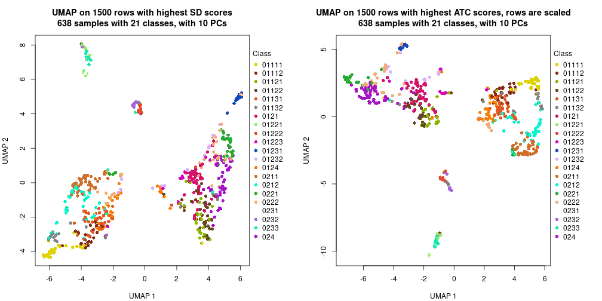</p>

</div>
<div id='tab-dimension-reduction-by-depth-3'>
<pre><code class="r">par(mfrow = c(1, 2))
dimension_reduction(res_rh, merge_node = merge_node_param(min_n_signatures = 256),
    method = &quot;UMAP&quot;, top_value_method = &quot;SD&quot;, top_n = 1500, scale_rows = FALSE)
dimension_reduction(res_rh, merge_node = merge_node_param(min_n_signatures = 256),
    method = &quot;UMAP&quot;, top_value_method = &quot;ATC&quot;, top_n = 1500, scale_rows = TRUE)
</code></pre>

<p></p>

</div>
<div id='tab-dimension-reduction-by-depth-4'>
<pre><code class="r">par(mfrow = c(1, 2))
dimension_reduction(res_rh, merge_node = merge_node_param(min_n_signatures = 373),
    method = &quot;UMAP&quot;, top_value_method = &quot;SD&quot;, top_n = 1500, scale_rows = FALSE)
dimension_reduction(res_rh, merge_node = merge_node_param(min_n_signatures = 373),
    method = &quot;UMAP&quot;, top_value_method = &quot;ATC&quot;, top_n = 1500, scale_rows = TRUE)
</code></pre>

<p></p>

</div>
<div id='tab-dimension-reduction-by-depth-5'>
<pre><code class="r">par(mfrow = c(1, 2))
dimension_reduction(res_rh, merge_node = merge_node_param(min_n_signatures = 388),
    method = &quot;UMAP&quot;, top_value_method = &quot;SD&quot;, top_n = 1500, scale_rows = FALSE)
dimension_reduction(res_rh, merge_node = merge_node_param(min_n_signatures = 388),
    method = &quot;UMAP&quot;, top_value_method = &quot;ATC&quot;, top_n = 1500, scale_rows = TRUE)
</code></pre>

<p></p>

</div>
<div id='tab-dimension-reduction-by-depth-6'>
<pre><code class="r">par(mfrow = c(1, 2))
dimension_reduction(res_rh, merge_node = merge_node_param(min_n_signatures = 507),
    method = &quot;UMAP&quot;, top_value_method = &quot;SD&quot;, top_n = 1500, scale_rows = FALSE)
dimension_reduction(res_rh, merge_node = merge_node_param(min_n_signatures = 507),
    method = &quot;UMAP&quot;, top_value_method = &quot;ATC&quot;, top_n = 1500, scale_rows = TRUE)
</code></pre>

<p></p>

</div>
<div id='tab-dimension-reduction-by-depth-7'>
<pre><code class="r">par(mfrow = c(1, 2))
dimension_reduction(res_rh, merge_node = merge_node_param(min_n_signatures = 545),
    method = &quot;UMAP&quot;, top_value_method = &quot;SD&quot;, top_n = 1500, scale_rows = FALSE)
dimension_reduction(res_rh, merge_node = merge_node_param(min_n_signatures = 545),
    method = &quot;UMAP&quot;, top_value_method = &quot;ATC&quot;, top_n = 1500, scale_rows = TRUE)
</code></pre>

<p>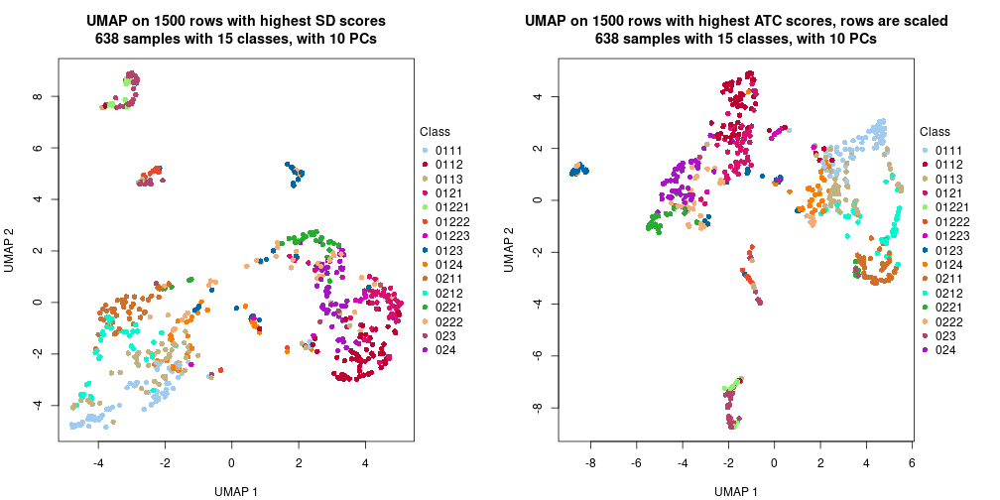</p>

</div>
<div id='tab-dimension-reduction-by-depth-8'>
<pre><code class="r">par(mfrow = c(1, 2))
dimension_reduction(res_rh, merge_node = merge_node_param(min_n_signatures = 903),
    method = &quot;UMAP&quot;, top_value_method = &quot;SD&quot;, top_n = 1500, scale_rows = FALSE)
dimension_reduction(res_rh, merge_node = merge_node_param(min_n_signatures = 903),
    method = &quot;UMAP&quot;, top_value_method = &quot;ATC&quot;, top_n = 1500, scale_rows = TRUE)
</code></pre>

<p></p>

</div>
<div id='tab-dimension-reduction-by-depth-9'>
<pre><code class="r">par(mfrow = c(1, 2))
dimension_reduction(res_rh, merge_node = merge_node_param(min_n_signatures = 1013),
    method = &quot;UMAP&quot;, top_value_method = &quot;SD&quot;, top_n = 1500, scale_rows = FALSE)
dimension_reduction(res_rh, merge_node = merge_node_param(min_n_signatures = 1013),
    method = &quot;UMAP&quot;, top_value_method = &quot;ATC&quot;, top_n = 1500, scale_rows = TRUE)
</code></pre>

<p></p>

</div>
<div id='tab-dimension-reduction-by-depth-10'>
<pre><code class="r">par(mfrow = c(1, 2))
dimension_reduction(res_rh, merge_node = merge_node_param(min_n_signatures = 1587),
    method = &quot;UMAP&quot;, top_value_method = &quot;SD&quot;, top_n = 1500, scale_rows = FALSE)
dimension_reduction(res_rh, merge_node = merge_node_param(min_n_signatures = 1587),
    method = &quot;UMAP&quot;, top_value_method = &quot;ATC&quot;, top_n = 1500, scale_rows = TRUE)
</code></pre>

<p></p>

</div>
<div id='tab-dimension-reduction-by-depth-11'>
<pre><code class="r">par(mfrow = c(1, 2))
dimension_reduction(res_rh, merge_node = merge_node_param(min_n_signatures = 2764),
    method = &quot;UMAP&quot;, top_value_method = &quot;SD&quot;, top_n = 1500, scale_rows = FALSE)
dimension_reduction(res_rh, merge_node = merge_node_param(min_n_signatures = 2764),
    method = &quot;UMAP&quot;, top_value_method = &quot;ATC&quot;, top_n = 1500, scale_rows = TRUE)
</code></pre>

<p></p>

</div>
<div id='tab-dimension-reduction-by-depth-12'>
<pre><code class="r">par(mfrow = c(1, 2))
dimension_reduction(res_rh, merge_node = merge_node_param(min_n_signatures = 2868),
    method = &quot;UMAP&quot;, top_value_method = &quot;SD&quot;, top_n = 1500, scale_rows = FALSE)
dimension_reduction(res_rh, merge_node = merge_node_param(min_n_signatures = 2868),
    method = &quot;UMAP&quot;, top_value_method = &quot;ATC&quot;, top_n = 1500, scale_rows = TRUE)
</code></pre>

<p></p>

</div>
<div id='tab-dimension-reduction-by-depth-13'>
<pre><code class="r">par(mfrow = c(1, 2))
dimension_reduction(res_rh, merge_node = merge_node_param(min_n_signatures = 4252),
    method = &quot;UMAP&quot;, top_value_method = &quot;SD&quot;, top_n = 1500, scale_rows = FALSE)
dimension_reduction(res_rh, merge_node = merge_node_param(min_n_signatures = 4252),
    method = &quot;UMAP&quot;, top_value_method = &quot;ATC&quot;, top_n = 1500, scale_rows = TRUE)
</code></pre>

<p></p>

</div>
<div id='tab-dimension-reduction-by-depth-14'>
<pre><code class="r">par(mfrow = c(1, 2))
dimension_reduction(res_rh, merge_node = merge_node_param(min_n_signatures = 5379),
    method = &quot;UMAP&quot;, top_value_method = &quot;SD&quot;, top_n = 1500, scale_rows = FALSE)
dimension_reduction(res_rh, merge_node = merge_node_param(min_n_signatures = 5379),
    method = &quot;UMAP&quot;, top_value_method = &quot;ATC&quot;, top_n = 1500, scale_rows = TRUE)
</code></pre>

<p></p>

</div>
</div>


### Signature heatmap

Signatures on the heatmap are the union of all signatures found on every node
on the hierarchy. The number of k-means on rows are automatically selected by the function.


<script>
$( function() {
	$( '#tabs-get-signatures-from-hierarchical-partition' ).tabs();
} );
</script>
<div id='tabs-get-signatures-from-hierarchical-partition'>
<ul>
<li><a href='#tab-get-signatures-from-hierarchical-partition-1'>n_signatures ≥ 181</a></li>
<li><a href='#tab-get-signatures-from-hierarchical-partition-2'>n_signatures ≥ 249</a></li>
<li><a href='#tab-get-signatures-from-hierarchical-partition-3'>n_signatures ≥ 256</a></li>
<li><a href='#tab-get-signatures-from-hierarchical-partition-4'>n_signatures ≥ 373</a></li>
<li><a href='#tab-get-signatures-from-hierarchical-partition-5'>n_signatures ≥ 388</a></li>
<li><a href='#tab-get-signatures-from-hierarchical-partition-6'>n_signatures ≥ 507</a></li>
<li><a href='#tab-get-signatures-from-hierarchical-partition-7'>n_signatures ≥ 545</a></li>
<li><a href='#tab-get-signatures-from-hierarchical-partition-8'>n_signatures ≥ 903</a></li>
<li><a href='#tab-get-signatures-from-hierarchical-partition-9'>n_signatures ≥ 1013</a></li>
<li><a href='#tab-get-signatures-from-hierarchical-partition-10'>n_signatures ≥ 1587</a></li>
<li><a href='#tab-get-signatures-from-hierarchical-partition-11'>n_signatures ≥ 2764</a></li>
<li><a href='#tab-get-signatures-from-hierarchical-partition-12'>n_signatures ≥ 2868</a></li>
<li><a href='#tab-get-signatures-from-hierarchical-partition-13'>n_signatures ≥ 4252</a></li>
<li><a href='#tab-get-signatures-from-hierarchical-partition-14'>n_signatures ≥ 5379</a></li>
</ul>
<div id='tab-get-signatures-from-hierarchical-partition-1'>
<pre><code class="r">get_signatures(res_rh, merge_node = merge_node_param(min_n_signatures = 181))
</code></pre>

<p></p>

</div>
<div id='tab-get-signatures-from-hierarchical-partition-2'>
<pre><code class="r">get_signatures(res_rh, merge_node = merge_node_param(min_n_signatures = 249))
</code></pre>

<p></p>

</div>
<div id='tab-get-signatures-from-hierarchical-partition-3'>
<pre><code class="r">get_signatures(res_rh, merge_node = merge_node_param(min_n_signatures = 256))
</code></pre>

<p></p>

</div>
<div id='tab-get-signatures-from-hierarchical-partition-4'>
<pre><code class="r">get_signatures(res_rh, merge_node = merge_node_param(min_n_signatures = 373))
</code></pre>

<p></p>

</div>
<div id='tab-get-signatures-from-hierarchical-partition-5'>
<pre><code class="r">get_signatures(res_rh, merge_node = merge_node_param(min_n_signatures = 388))
</code></pre>

<p></p>

</div>
<div id='tab-get-signatures-from-hierarchical-partition-6'>
<pre><code class="r">get_signatures(res_rh, merge_node = merge_node_param(min_n_signatures = 507))
</code></pre>

<p></p>

</div>
<div id='tab-get-signatures-from-hierarchical-partition-7'>
<pre><code class="r">get_signatures(res_rh, merge_node = merge_node_param(min_n_signatures = 545))
</code></pre>

<p></p>

</div>
<div id='tab-get-signatures-from-hierarchical-partition-8'>
<pre><code class="r">get_signatures(res_rh, merge_node = merge_node_param(min_n_signatures = 903))
</code></pre>

<p></p>

</div>
<div id='tab-get-signatures-from-hierarchical-partition-9'>
<pre><code class="r">get_signatures(res_rh, merge_node = merge_node_param(min_n_signatures = 1013))
</code></pre>

<p></p>

</div>
<div id='tab-get-signatures-from-hierarchical-partition-10'>
<pre><code class="r">get_signatures(res_rh, merge_node = merge_node_param(min_n_signatures = 1587))
</code></pre>

<p></p>

</div>
<div id='tab-get-signatures-from-hierarchical-partition-11'>
<pre><code class="r">get_signatures(res_rh, merge_node = merge_node_param(min_n_signatures = 2764))
</code></pre>

<p></p>

</div>
<div id='tab-get-signatures-from-hierarchical-partition-12'>
<pre><code class="r">get_signatures(res_rh, merge_node = merge_node_param(min_n_signatures = 2868))
</code></pre>

<p></p>

</div>
<div id='tab-get-signatures-from-hierarchical-partition-13'>
<pre><code class="r">get_signatures(res_rh, merge_node = merge_node_param(min_n_signatures = 4252))
</code></pre>

<pre><code>#&gt; Error in names(x) &lt;- value: &#39;names&#39; attribute [1] must be the same length as the vector [0]
</code></pre>

</div>
<div id='tab-get-signatures-from-hierarchical-partition-14'>
<pre><code class="r">get_signatures(res_rh, merge_node = merge_node_param(min_n_signatures = 5379))
</code></pre>

<pre><code>#&gt; Error in names(x) &lt;- value: &#39;names&#39; attribute [1] must be the same length as the vector [0]
</code></pre>

</div>
</div>


Compare signatures from different nodes:


```r
compare_signatures(res_rh, verbose = FALSE)
```


If there are too many signatures, `top_signatures = ...` can be set to only show the 
signatures with the highest FDRs. Note it only works on every node and the final signatures
are the union of all signatures of all nodes.


```r
# code only for demonstration
# e.g. to show the top 500 most significant rows on each node.
tb = get_signature(res_rh, top_signatures = 500)
```


### Test to known annotations

Test correlation between subgroups and known annotations. If the known
annotation is numeric, one-way ANOVA test is applied, and if the known
annotation is discrete, chi-squared contingency table test is applied.


<script>
$( function() {
	$( '#tabs-test-to-known-factors-from-hierarchical-partition' ).tabs();
} );
</script>
<div id='tabs-test-to-known-factors-from-hierarchical-partition'>
<ul>
<li><a href='#tab-test-to-known-factors-from-hierarchical-partition-1'>n_signatures ≥ 181</a></li>
<li><a href='#tab-test-to-known-factors-from-hierarchical-partition-2'>n_signatures ≥ 249</a></li>
<li><a href='#tab-test-to-known-factors-from-hierarchical-partition-3'>n_signatures ≥ 256</a></li>
<li><a href='#tab-test-to-known-factors-from-hierarchical-partition-4'>n_signatures ≥ 373</a></li>
<li><a href='#tab-test-to-known-factors-from-hierarchical-partition-5'>n_signatures ≥ 388</a></li>
<li><a href='#tab-test-to-known-factors-from-hierarchical-partition-6'>n_signatures ≥ 507</a></li>
<li><a href='#tab-test-to-known-factors-from-hierarchical-partition-7'>n_signatures ≥ 545</a></li>
<li><a href='#tab-test-to-known-factors-from-hierarchical-partition-8'>n_signatures ≥ 903</a></li>
<li><a href='#tab-test-to-known-factors-from-hierarchical-partition-9'>n_signatures ≥ 1013</a></li>
<li><a href='#tab-test-to-known-factors-from-hierarchical-partition-10'>n_signatures ≥ 1587</a></li>
<li><a href='#tab-test-to-known-factors-from-hierarchical-partition-11'>n_signatures ≥ 2764</a></li>
<li><a href='#tab-test-to-known-factors-from-hierarchical-partition-12'>n_signatures ≥ 2868</a></li>
<li><a href='#tab-test-to-known-factors-from-hierarchical-partition-13'>n_signatures ≥ 4252</a></li>
<li><a href='#tab-test-to-known-factors-from-hierarchical-partition-14'>n_signatures ≥ 5379</a></li>
</ul>
<div id='tab-test-to-known-factors-from-hierarchical-partition-1'>
<pre><code class="r">test_to_known_factors(res_rh, merge_node = merge_node_param(min_n_signatures = 181))
</code></pre>

<pre><code>#&gt;       cell.type  disease
#&gt; class 1.04e-288 3.71e-10
</code></pre>

</div>
<div id='tab-test-to-known-factors-from-hierarchical-partition-2'>
<pre><code class="r">test_to_known_factors(res_rh, merge_node = merge_node_param(min_n_signatures = 249))
</code></pre>

<pre><code>#&gt;       cell.type disease
#&gt; class 3.61e-285   3e-10
</code></pre>

</div>
<div id='tab-test-to-known-factors-from-hierarchical-partition-3'>
<pre><code class="r">test_to_known_factors(res_rh, merge_node = merge_node_param(min_n_signatures = 256))
</code></pre>

<pre><code>#&gt;       cell.type  disease
#&gt; class 2.03e-286 2.41e-10
</code></pre>

</div>
<div id='tab-test-to-known-factors-from-hierarchical-partition-4'>
<pre><code class="r">test_to_known_factors(res_rh, merge_node = merge_node_param(min_n_signatures = 373))
</code></pre>

<pre><code>#&gt;       cell.type  disease
#&gt; class 4.22e-290 9.46e-10
</code></pre>

</div>
<div id='tab-test-to-known-factors-from-hierarchical-partition-5'>
<pre><code class="r">test_to_known_factors(res_rh, merge_node = merge_node_param(min_n_signatures = 388))
</code></pre>

<pre><code>#&gt;       cell.type  disease
#&gt; class 4.85e-277 4.44e-10
</code></pre>

</div>
<div id='tab-test-to-known-factors-from-hierarchical-partition-6'>
<pre><code class="r">test_to_known_factors(res_rh, merge_node = merge_node_param(min_n_signatures = 507))
</code></pre>

<pre><code>#&gt;       cell.type  disease
#&gt; class 4.55e-281 2.01e-10
</code></pre>

</div>
<div id='tab-test-to-known-factors-from-hierarchical-partition-7'>
<pre><code class="r">test_to_known_factors(res_rh, merge_node = merge_node_param(min_n_signatures = 545))
</code></pre>

<pre><code>#&gt;       cell.type disease
#&gt; class 4.89e-218 7.6e-11
</code></pre>

</div>
<div id='tab-test-to-known-factors-from-hierarchical-partition-8'>
<pre><code class="r">test_to_known_factors(res_rh, merge_node = merge_node_param(min_n_signatures = 903))
</code></pre>

<pre><code>#&gt;       cell.type disease
#&gt; class 4.39e-190 9.2e-10
</code></pre>

</div>
<div id='tab-test-to-known-factors-from-hierarchical-partition-9'>
<pre><code class="r">test_to_known_factors(res_rh, merge_node = merge_node_param(min_n_signatures = 1013))
</code></pre>

<pre><code>#&gt;       cell.type  disease
#&gt; class 7.39e-190 1.08e-09
</code></pre>

</div>
<div id='tab-test-to-known-factors-from-hierarchical-partition-10'>
<pre><code class="r">test_to_known_factors(res_rh, merge_node = merge_node_param(min_n_signatures = 1587))
</code></pre>

<pre><code>#&gt;       cell.type  disease
#&gt; class 6.31e-194 8.73e-10
</code></pre>

</div>
<div id='tab-test-to-known-factors-from-hierarchical-partition-11'>
<pre><code class="r">test_to_known_factors(res_rh, merge_node = merge_node_param(min_n_signatures = 2764))
</code></pre>

<pre><code>#&gt;       cell.type  disease
#&gt; class  1.16e-89 6.44e-09
</code></pre>

</div>
<div id='tab-test-to-known-factors-from-hierarchical-partition-12'>
<pre><code class="r">test_to_known_factors(res_rh, merge_node = merge_node_param(min_n_signatures = 2868))
</code></pre>

<pre><code>#&gt;       cell.type  disease
#&gt; class  1.16e-89 6.44e-09
</code></pre>

</div>
<div id='tab-test-to-known-factors-from-hierarchical-partition-13'>
<pre><code class="r">test_to_known_factors(res_rh, merge_node = merge_node_param(min_n_signatures = 4252))
</code></pre>

<pre><code>#&gt;       cell.type disease
#&gt; class        NA      NA
</code></pre>

</div>
<div id='tab-test-to-known-factors-from-hierarchical-partition-14'>
<pre><code class="r">test_to_known_factors(res_rh, merge_node = merge_node_param(min_n_signatures = 5379))
</code></pre>

<pre><code>#&gt;       cell.type disease
#&gt; class        NA      NA
</code></pre>

</div>
</div>


## Results for each node


---------------------------------------------------


### Node0


Child nodes: 
                [Node01](#Node01)
        ,
                [Node02](#Node02)
        .


The object with results only for a single top-value method and a single partitioning method 
can be extracted as:

```r
res = res_rh["0"]
```

A summary of `res` and all the functions that can be applied to it:

```r
res
```

```
#> A 'DownSamplingConsensusPartition' object with k = 2, 3, 4.
#>   On a matrix with 14607 rows and 500 columns, randomly sampled from 638 columns.
#>   Top rows (1388) are extracted by 'ATC' method.
#>   Subgroups are detected by 'skmeans' method.
#>   Performed in total 150 partitions by row resampling.
#>   Best k for subgroups seems to be 4.
#> 
#> Following methods can be applied to this 'DownSamplingConsensusPartition' object:
#>  [1] "cola_report"             "collect_classes"         "collect_plots"          
#>  [4] "collect_stats"           "colnames"                "compare_partitions"     
#>  [7] "compare_signatures"      "consensus_heatmap"       "dimension_reduction"    
#> [10] "functional_enrichment"   "get_anno_col"            "get_anno"               
#> [13] "get_classes"             "get_consensus"           "get_matrix"             
#> [16] "get_membership"          "get_param"               "get_signatures"         
#> [19] "get_stats"               "is_best_k"               "is_stable_k"            
#> [22] "membership_heatmap"      "ncol"                    "nrow"                   
#> [25] "plot_ecdf"               "predict_classes"         "rownames"               
#> [28] "select_partition_number" "show"                    "suggest_best_k"         
#> [31] "test_to_known_factors"   "top_rows_heatmap"
```

`collect_plots()` function collects all the plots made from `res` for all `k` (number of subgroups)
into one single page to provide an easy and fast comparison between different `k`.

```r
collect_plots(res)
```


The plots are:

- The first row: a plot of the eCDF (empirical cumulative distribution
  function) curves of the consensus matrix for each `k` and the heatmap of
  predicted classes for each `k`.
- The second row: heatmaps of the consensus matrix for each `k`.
- The third row: heatmaps of the membership matrix for each `k`.
- The fouth row: heatmaps of the signatures for each `k`.

All the plots in panels can be made by individual functions and they are
plotted later in this section.

`select_partition_number()` produces several plots showing different
statistics for choosing "optimized" `k`. There are following statistics:

- eCDF curves of the consensus matrix for each `k`;
- 1-PAC. [The PAC score](https://en.wikipedia.org/wiki/Consensus_clustering#Over-interpretation_potential_of_consensus_clustering)
  measures the proportion of the ambiguous subgrouping.
- Mean silhouette score.
- Concordance. The mean probability of fiting the consensus subgroup labels in all
  partitions.
- Area increased. Denote $A_k$ as the area under the eCDF curve for current
  `k`, the area increased is defined as $A_k - A_{k-1}$.
- Rand index. The percent of pairs of samples that are both in a same cluster
  or both are not in a same cluster in the partition of k and k-1.
- Jaccard index. The ratio of pairs of samples are both in a same cluster in
  the partition of k and k-1 and the pairs of samples are both in a same
  cluster in the partition k or k-1.

The detailed explanations of these statistics can be found in [the _cola_
vignette](https://jokergoo.github.io/cola_vignettes/cola.html#toc_13).

Generally speaking, higher 1-PAC score, higher mean silhouette score or higher
concordance corresponds to better partition. Rand index and Jaccard index
measure how similar the current partition is compared to partition with `k-1`.
If they are too similar, we won't accept `k` is better than `k-1`.

```r
select_partition_number(res)
```


The numeric values for all these statistics can be obtained by `get_stats()`.

```r
get_stats(res)
```

```
#>   k 1-PAC mean_silhouette concordance area_increased  Rand Jaccard
#> 2 2 1.000           0.982       0.993         0.4942 0.506   0.506
#> 3 3 0.962           0.936       0.968         0.1957 0.883   0.774
#> 4 4 0.936           0.901       0.962         0.0798 0.904   0.779
```

`suggest_best_k()` suggests the best $k$ based on these statistics. The rules are as follows:

- All $k$ with Jaccard index larger than 0.95 are removed because increasing
  $k$ does not provide enough extra information. If all $k$ are removed, it is
  marked as no subgroup is detected.
- For all $k$ with 1-PAC score larger than 0.9, the maximal $k$ is taken as
  the best $k$, and other $k$ are marked as optional $k$.
- If it does not fit the second rule. The $k$ with the maximal vote of the
  highest 1-PAC score, highest mean silhouette, and highest concordance is
  taken as the best $k$.

```r
suggest_best_k(res)
```

```
#> [1] 4
#> attr(,"optional")
#> [1] 2 3
```

There is also optional best $k$ = 2 3 that is worth to check.

Following is the table of the partitions (You need to click the **show/hide
code output** link to see it). The membership matrix (columns with name `p*`)
is inferred by
[`clue::cl_consensus()`](https://www.rdocumentation.org/link/cl_consensus?package=clue)
function with the `SE` method. Basically the value in the membership matrix
represents the probability to belong to a certain group. The finall subgroup
label for an item is determined with the group with highest probability it
belongs to.

In `get_classes()` function, the entropy is calculated from the membership
matrix and the silhouette score is calculated from the consensus matrix.


<script>
$( function() {
	$( '#tabs-node-0-get-classes' ).tabs();
} );
</script>
<div id='tabs-node-0-get-classes'>
<ul>
<li><a href='#tab-node-0-get-classes-1'>k = 2</a></li>
<li><a href='#tab-node-0-get-classes-2'>k = 3</a></li>
<li><a href='#tab-node-0-get-classes-3'>k = 4</a></li>
</ul>

<div id='tab-node-0-get-classes-1'>
<p><a id='tab-node-0-get-classes-1-a' style='color:#0366d6' href='#'>show/hide code output</a></p>
<pre><code class="r">get_classes(res, k = 2)
</code></pre>

<pre><code>#&gt;               class     p
#&gt; 10th_C10_S104     1 0.249
#&gt; 10th_C11_S96      2 0.000
#&gt; 10th_C13_S61      1 0.000
#&gt; 10th_C14_S53      1 0.747
#&gt; 10th_C16_S105     1 0.000
#&gt; 10th_C17_S97      2 0.000
#&gt; 10th_C19_S62      1 0.502
#&gt; 10th_C1_S59       1 0.000
#&gt; 10th_C20_S54      1 0.000
#&gt; 10th_C23_S98      1 0.751
#&gt; 10th_C24_S90      1 0.000
#&gt; 10th_C28_S91      2 0.000
#&gt; 10th_C30_S107     1 0.000
#&gt; 10th_C31_S48      1 0.000
#&gt; 10th_C32_S56      2 1.000
#&gt; 10th_C33_S64      2 0.000
#&gt; 10th_C34_S92      2 0.747
#&gt; 10th_C37_S49      2 0.000
#&gt; 10th_C41_S101     1 0.249
#&gt; 10th_C42_S109     2 0.000
#&gt; 10th_C43_S50      2 0.249
#&gt; 10th_C45_S66      1 0.249
#&gt; 10th_C46_S94      1 0.747
#&gt; 10th_C4_S103      1 0.249
#&gt; 10th_C50_S73      2 0.000
#&gt; 10th_C51_S80      2 0.249
#&gt; 10th_C52_S110     2 0.253
#&gt; 10th_C53_S118     2 0.000
#&gt; 10th_C54_S124     1 0.000
#&gt; 10th_C56_S74      1 0.253
#&gt; 10th_C57_S81      2 0.000
#&gt; 10th_C58_S111     2 0.751
#&gt; 10th_C5_S95       2 0.000
#&gt; 10th_C61_S68      2 0.502
#&gt; 10th_C63_S82      2 0.498
#&gt; 10th_C64_S112     2 0.000
#&gt; 10th_C66_S126     2 0.000
#&gt; 10th_C68_S75      1 0.000
#&gt; 10th_C6_S88       2 0.498
#&gt; 10th_C73_S84      1 0.751
#&gt; 10th_C74_S76      1 0.000
#&gt; 10th_C76_S128     1 0.000
#&gt; 10th_C77_S120     2 0.000
#&gt; 10th_C78_S114     2 0.498
#&gt; 10th_C7_S60       1 0.000
#&gt; 10th_C80_S77      2 0.000
#&gt; 10th_C81_S70      1 0.000
#&gt; 10th_C84_S115     1 1.000
#&gt; 10th_C85_S86      1 0.249
#&gt; 10th_C86_S78      2 0.000
#&gt; 10th_C87_S71      2 0.000
#&gt; 10th_C88_S130     1 0.249
#&gt; 10th_C8_S52       1 0.249
#&gt; 10th_C90_S116     1 0.000
#&gt; 10th_C95_S123     2 0.000
#&gt; 10th_C96_S117     1 1.000
#&gt; 11th-C10_S63      2 0.253
#&gt; 11th-C12_S47      2 0.249
#&gt; 11th-C16_S64      1 0.000
#&gt; 11th-C21_S4       2 0.000
#&gt; 11th-C22_S65      2 0.000
#&gt; 11th-C24_S49      1 0.249
#&gt; 11th-C26_S12      2 0.000
#&gt; 11th-C27_S19      2 0.000
#&gt; 11th-C2_S8        2 0.000
#&gt; 11th-C30_S66      2 1.000
#&gt; 11th-C33_S20      1 0.000
#&gt; 11th-C36_S67      1 0.000
#&gt; 11th-C37_S6       2 0.000
#&gt; 11th-C39_S21      1 0.000
#&gt; 11th-C40_S52      1 0.000
#&gt; 11th-C41_S60      1 0.747
#&gt; 11th-C43_S7       2 1.000
#&gt; 11th-C44_S15      1 0.502
#&gt; 11th-C49_S23      1 0.751
#&gt; 11th-C4_S62       2 0.751
#&gt; 11th-C51_S39      1 0.751
#&gt; 11th-C53_S78      1 0.000
#&gt; 11th-C54_S86      2 0.000
#&gt; 11th-C55_S24      2 0.498
#&gt; 11th-C56_S32      2 0.000
#&gt; 11th-C57_S40      2 0.000
#&gt; 11th-C58_S71      1 0.000
#&gt; 11th-C5_S54       1 0.253
#&gt; 11th-C61_S25      1 0.000
#&gt; 11th-C62_S33      2 1.000
#&gt; 11th-C64_S72      2 0.000
#&gt; 11th-C66_S88      1 0.000
#&gt; 11th-C67_S26      2 0.249
#&gt; 11th-C68_S34      1 0.000
#&gt; 11th-C77_S82      2 0.000
#&gt; 11th-C7_S16       1 0.751
#&gt; 11th-C93_S30      2 0.000
#&gt; 12th-C10_S155     2 0.000
#&gt; 12th-C11_S147     1 1.000
#&gt; 12th-C12_S139     1 0.000
#&gt; 12th-C14_S190     1 0.249
#&gt; 12th-C15_S183     2 0.000
#&gt; 12th-C1_S195      2 0.000
#&gt; 12th-C20_S191     1 0.000
#&gt; 12th-C21_S184     2 0.000
#&gt; 12th-C23_S149     2 0.000
#&gt; 12th-C24_S141     1 0.000
#&gt; 12th-C25_S185     1 0.249
#&gt; 12th-C26_S192     1 0.249
#&gt; 12th-C28_S142     1 0.000
#&gt; 12th-C29_S150     1 0.249
#&gt; 12th-C30_S157     1 0.000
#&gt; 12th-C33_S200     1 1.000
#&gt; 12th-C35_S151     2 0.000
#&gt; 12th-C36_S158     2 0.000
#&gt; 12th-C37_S187     2 0.249
#&gt; 12th-C38_S194     2 0.000
#&gt; 12th-C39_S201     2 0.000
#&gt; 12th-C3_S181      2 0.000
#&gt; 12th-C40_S144     2 0.000
#&gt; 12th-C42_S159     1 1.000
#&gt; 12th-C46_S145     1 0.249
#&gt; 12th-C47_S153     2 0.000
#&gt; 12th-C48_S160     1 0.000
#&gt; 12th-C4_S154      2 1.000
#&gt; 12th-C50_S210     2 0.249
#&gt; 12th-C51_S217     1 0.000
#&gt; 12th-C53_S168     2 0.000
#&gt; 12th-C55_S203     1 0.249
#&gt; 12th-C56_S211     2 0.751
#&gt; 12th-C57_S218     2 0.000
#&gt; 12th-C58_S162     1 0.000
#&gt; 12th-C59_S169     1 0.000
#&gt; 12th-C60_S176     1 0.000
#&gt; 12th-C63_S219     1 0.249
#&gt; 12th-C64_S163     1 0.000
#&gt; 12th-C65_S170     1 0.502
#&gt; 12th-C67_S205     2 0.249
#&gt; 12th-C69_S135     1 0.502
#&gt; 12th-C71_S171     2 0.000
#&gt; 12th-C74_S214     1 0.000
#&gt; 12th-C75_S206     2 0.000
#&gt; 12th-C76_S177     1 0.253
#&gt; 12th-C7_S196      1 0.249
#&gt; 12th-C80_S215     1 0.253
#&gt; 12th-C81_S207     1 1.000
#&gt; 12th-C84_S165     1 0.000
#&gt; 12th-C85_S137     1 0.249
#&gt; 12th-C8_S189      2 0.253
#&gt; 12th-C90_S166     1 0.253
#&gt; 12th-C93_S209     2 0.000
#&gt; 12th-C94_S180     1 1.000
#&gt; 12th-C95_S174     1 0.000
#&gt; 12th-C96_S167     1 0.000
#&gt; 13th_C12_S178     1 0.751
#&gt; 13th_C13_S149     1 1.000
#&gt; 13th_C15_S134     2 0.000
#&gt; 13th_C16_S193     1 0.502
#&gt; 13th_C17_S186     2 0.747
#&gt; 13th_C18_S179     2 0.000
#&gt; 13th_C1_S147      2 0.000
#&gt; 13th_C20_S142     2 0.000
#&gt; 13th_C21_S135     2 0.000
#&gt; 13th_C23_S187     1 1.000
#&gt; 13th_C27_S151     2 0.000
#&gt; 13th_C29_S188     2 0.000
#&gt; 13th_C31_S137     2 0.000
#&gt; 13th_C34_S181     1 0.253
#&gt; 13th_C36_S196     2 0.253
#&gt; 13th_C38_S145     2 0.000
#&gt; 13th_C39_S153     1 0.249
#&gt; 13th_C3_S132      2 0.000
#&gt; 13th_C46_S183     2 0.000
#&gt; 13th_C49_S155     2 0.000
#&gt; 13th_C4_S191      2 0.000
#&gt; 13th_C51_S170     2 0.000
#&gt; 13th_C52_S198     2 1.000
#&gt; 13th_C53_S205     2 0.249
#&gt; 13th_C54_S212     2 0.000
#&gt; 13th_C55_S156     2 0.747
#&gt; 13th_C57_S171     2 0.000
#&gt; 13th_C5_S184      2 0.751
#&gt; 13th_C60_S213     1 0.502
#&gt; 13th_C63_S172     2 0.249
#&gt; 13th_C66_S214     1 0.000
#&gt; 13th_C68_S165     2 0.249
#&gt; 13th_C69_S173     2 0.249
#&gt; 13th_C6_S177      2 0.000
#&gt; 13th_C70_S201     2 1.000
#&gt; 13th_C71_S208     2 0.000
#&gt; 13th_C72_S215     2 0.751
#&gt; 13th_C75_S159     2 0.249
#&gt; 13th_C76_S216     1 0.249
#&gt; 13th_C77_S209     2 0.000
#&gt; 13th_C79_S174     2 0.000
#&gt; 13th_C80_S167     2 0.000
#&gt; 13th_C81_S160     2 0.502
#&gt; 13th_C86_S168     2 0.000
#&gt; 13th_C88_S218     2 0.253
#&gt; 13th_C89_S211     2 0.000
#&gt; 13th_C8_S140      2 0.000
#&gt; 13th_C92_S169     2 0.000
#&gt; 13th_C93_S162     2 0.000
#&gt; 13th_C94_S219     1 0.498
#&gt; 13th_C96_S204     1 1.000
#&gt; 1st-61_S27        1 0.000
#&gt; 1st-C11_S58       1 0.000
#&gt; 1st-C13_S19       2 0.249
#&gt; 1st-C15_S3        2 0.253
#&gt; 1st-C18_S51       2 0.249
#&gt; 1st-C19_S20       1 0.498
#&gt; 1st-C20_S12       2 0.000
#&gt; 1st-C21_S4        1 0.249
#&gt; 1st-C32_S14       1 1.000
#&gt; 1st-C34_S54       1 0.000
#&gt; 1st-C39_S23       2 0.000
#&gt; 1st-C42_S71       1 0.000
#&gt; 1st-C50_S33       1 0.000
#&gt; 1st-C51_S41       2 0.000
#&gt; 1st-C53_S74       2 0.253
#&gt; 1st-C56_S34       1 0.000
#&gt; 1st-C57_S42       1 0.249
#&gt; 1st-C58_S76       1 0.498
#&gt; 1st-C59_S77       2 0.000
#&gt; 1st-C62_S35       2 0.751
#&gt; 1st-C64_S79       1 0.000
#&gt; 1st-C68_S36       1 0.000
#&gt; 1st-C69_S44       1 0.000
#&gt; 1st-C71_S83       1 0.000
#&gt; 1st-C73_S45       1 0.000
#&gt; 1st-C74_S37       2 0.000
#&gt; 1st-C75_S29       1 0.000
#&gt; 1st-C77_S86       1 1.000
#&gt; 1st-C78_S85       1 0.502
#&gt; 1st-C79_S46       2 0.249
#&gt; 1st-C80_S38       1 0.000
#&gt; 1st-C8_S10        2 0.000
#&gt; 1st-C90_S91       1 0.000
#&gt; 1st-C96_S94       2 0.000
#&gt; 2nd-C11_S20       1 0.502
#&gt; 2nd-C15_S25       1 0.000
#&gt; 2nd-C16_S33       1 0.000
#&gt; 2nd-C17_S32       1 0.000
#&gt; 2nd-C19_S39       2 0.502
#&gt; 2nd-C1_S3         2 0.249
#&gt; 2nd-C21_S37       1 1.000
#&gt; 2nd-C25_S49       1 0.000
#&gt; 2nd-C26_S50       1 0.249
#&gt; 2nd-C27_S51       2 0.000
#&gt; 2nd-C28_S55       2 0.249
#&gt; 2nd-C29_S56       1 0.000
#&gt; 2nd-C2_S2         2 0.000
#&gt; 2nd-C31_S61       1 0.000
#&gt; 2nd-C32_S62       1 0.000
#&gt; 2nd-C36_S69       2 0.000
#&gt; 2nd-C37_S73       2 0.000
#&gt; 2nd-C38_S74       1 0.000
#&gt; 2nd-C39_S75       1 0.000
#&gt; 2nd-C3_S1         2 0.000
#&gt; 2nd-C47_S92       1 0.000
#&gt; 2nd-C49_S4        2 0.751
#&gt; 2nd-C4_S9         2 0.000
#&gt; 2nd-C51_S6        2 0.249
#&gt; 2nd-C52_S10       2 0.249
#&gt; 2nd-C54_S12       1 0.000
#&gt; 2nd-C57_S18       1 0.000
#&gt; 2nd-C58_S22       2 0.000
#&gt; 2nd-C5_S8         2 0.000
#&gt; 2nd-C62_S29       1 0.000
#&gt; 2nd-C67_S40       1 0.000
#&gt; 2nd-C69_S42       2 0.000
#&gt; 2nd-C6_S7         1 0.253
#&gt; 2nd-C72_S48       1 0.000
#&gt; 2nd-C74_S53       1 0.000
#&gt; 2nd-C75_S52       1 0.000
#&gt; 2nd-C76_S60       1 0.000
#&gt; 2nd-C77_S59       1 0.751
#&gt; 2nd-C7_S15        2 0.000
#&gt; 2nd-C80_S65       1 0.000
#&gt; 2nd-C81_S64       1 0.000
#&gt; 2nd-C83_S71       1 0.000
#&gt; 2nd-C86_S77       1 0.000
#&gt; 2nd-C87_S76       2 0.249
#&gt; 2nd-C88_S84       1 0.000
#&gt; 2nd-C8_S14        1 1.000
#&gt; 2nd-C93_S88       1 0.249
#&gt; 2nd-C94_S96       2 0.000
#&gt; 2nd-C95_S95       1 0.000
#&gt; 3rd-C11_S58       1 0.000
#&gt; 3rd-C12_S68       1 1.000
#&gt; 3rd-C18_S80       1 0.000
#&gt; 3rd-C1_S39        1 0.000
#&gt; 3rd-C20_S22       1 0.000
#&gt; 3rd-C21_S11       1 0.000
#&gt; 3rd-C23_S94       2 0.249
#&gt; 3rd-C25_S15       2 0.000
#&gt; 3rd-C26_S28       1 0.000
#&gt; 3rd-C27_S49       1 0.000
#&gt; 3rd-C32_S31       2 0.000
#&gt; 3rd-C33_S50       1 0.498
#&gt; 3rd-C35_S23       1 1.000
#&gt; 3rd-C36_S2        1 0.000
#&gt; 3rd-C3_S2         2 0.000
#&gt; 3rd-C40_S57       1 0.000
#&gt; 3rd-C42_S74       1 0.000
#&gt; 3rd-C44_S32       2 1.000
#&gt; 3rd-C46_S93       1 0.000
#&gt; 3rd-C47_S35       1 0.000
#&gt; 3rd-C49_S60       1 0.000
#&gt; 3rd-C4_S25        1 1.000
#&gt; 3rd-C51_S87       2 0.000
#&gt; 3rd-C52_S86       2 0.000
#&gt; 3rd-C53_S67       1 0.000
#&gt; 3rd-C56_S90       2 0.751
#&gt; 3rd-C57_S5        1 0.000
#&gt; 3rd-C58_S3        1 0.000
#&gt; 3rd-C59_S91       1 0.000
#&gt; 3rd-C60_S10       2 0.000
#&gt; 3rd-C61_S64       2 0.253
#&gt; 3rd-C63_S54       2 0.000
#&gt; 3rd-C65_S20       1 0.000
#&gt; 3rd-C67_S69       1 0.249
#&gt; 3rd-C68_S13       1 0.000
#&gt; 3rd-C69_S78       2 0.249
#&gt; 3rd-C6_S44        1 0.502
#&gt; 3rd-C71_S80       1 0.000
#&gt; 3rd-C76_S22       1 0.000
#&gt; 3rd-C79_S67       1 0.000
#&gt; 3rd-C7_S40        2 0.000
#&gt; 3rd-C82_S11       1 0.249
#&gt; 3rd-C84_S75       1 0.000
#&gt; 3rd-C85_S79       1 0.502
#&gt; 3rd-C85_S83       2 0.000
#&gt; 3rd-C86_S85       1 0.747
#&gt; 3rd-C87_S88       1 0.751
#&gt; 3rd-C88_S24       1 0.000
#&gt; 3rd-C91_S91       1 0.000
#&gt; 3rd-C92_S86       1 0.000
#&gt; 3rd-C95_S81       1 0.000
#&gt; 3rd-C96_S79       2 0.000
#&gt; 3rd-C9_S5         1 1.000
#&gt; 4th-61_S28        1 0.000
#&gt; 4th-C12_S19       1 0.000
#&gt; 4th-C14_S26       1 0.000
#&gt; 4th-C18_S31       1 0.249
#&gt; 4th-C22_S45       2 0.249
#&gt; 4th-C23_S44       1 0.000
#&gt; 4th-C24_S43       1 0.000
#&gt; 4th-C26_S50       1 0.000
#&gt; 4th-C27_S51       2 1.000
#&gt; 4th-C28_S55       1 0.000
#&gt; 4th-C29_S56       1 0.000
#&gt; 4th-C32_S62       1 0.000
#&gt; 4th-C33_S63       1 0.249
#&gt; 4th-C35_S68       2 0.000
#&gt; 4th-C36_S69       1 0.000
#&gt; 4th-C37_S73       2 0.751
#&gt; 4th-C3_S1         2 0.000
#&gt; 4th-C40_S79       1 0.000
#&gt; 4th-C43_S85       1 0.000
#&gt; 4th-C45_S87       2 0.253
#&gt; 4th-C49_S4        1 0.498
#&gt; 4th-C4_S9         1 0.000
#&gt; 4th-C50_S5        2 0.000
#&gt; 4th-C51_S6        1 0.000
#&gt; 4th-C56_S17       1 0.000
#&gt; 4th-C57_S18       2 0.249
#&gt; 4th-C59_S23       1 0.000
#&gt; 4th-C5_S8         1 0.000
#&gt; 4th-C62_S29       1 0.000
#&gt; 4th-C63_S30       1 0.000
#&gt; 4th-C64_S34       1 0.000
#&gt; 4th-C66_S36       1 0.000
#&gt; 4th-C67_S40       1 0.249
#&gt; 4th-C68_S41       2 0.751
#&gt; 4th-C69_S42       1 0.000
#&gt; 4th-C70_S46       1 0.000
#&gt; 4th-C73_S54       1 0.000
#&gt; 4th-C75_S52       1 0.000
#&gt; 4th-C78_S58       1 0.000
#&gt; 4th-C79_S66       1 0.000
#&gt; 4th-C7_S15        1 0.000
#&gt; 4th-C80_S65       1 0.000
#&gt; 4th-C81_S64       1 0.000
#&gt; 4th-C82_S72       1 0.000
#&gt; 4th-C83_S71       1 1.000
#&gt; 4th-C85_S78       1 0.000
#&gt; 4th-C86_S77       1 0.000
#&gt; 4th-C87_S76       1 0.000
#&gt; 4th-C88_S84       1 0.000
#&gt; 4th-C89_S83       1 0.000
#&gt; 4th-C8_S14        1 0.000
#&gt; 4th-C92_S89       1 0.000
#&gt; 4th-C93_S88       2 0.000
#&gt; 4th-C94_S96       1 0.253
#&gt; 4th-C95_S95       1 0.000
#&gt; 4th-C96_S94       1 0.000
#&gt; 4th-C9_S13        2 0.249
#&gt; 5th-C10_S92       2 0.000
#&gt; 5th-C11_S91       2 0.751
#&gt; 5th-C12_S90       1 0.000
#&gt; 5th-C14_S97       2 0.000
#&gt; 5th-C16_S98       2 0.751
#&gt; 5th-C18_S96       2 0.000
#&gt; 5th-C19_S104      1 0.000
#&gt; 5th-C21_S102      1 0.000
#&gt; 5th-C25_S108      2 0.000
#&gt; 5th-C30_S105      1 0.000
#&gt; 5th-C34_S108      1 0.000
#&gt; 5th-C35_S109      1 0.000
#&gt; 5th-C40_S112      2 0.000
#&gt; 5th-C41_S113      2 0.751
#&gt; 5th-C42_S114      2 0.000
#&gt; 5th-C43_S121      2 0.747
#&gt; 5th-C45_S123      2 0.000
#&gt; 5th-C47_S118      1 0.751
#&gt; 5th-C49_S89       1 0.000
#&gt; 5th-C50_S90       1 0.000
#&gt; 5th-C54_S89       1 0.000
#&gt; 5th-C56_S95       2 0.000
#&gt; 5th-C57_S96       1 0.000
#&gt; 5th-C58_S93       2 0.249
#&gt; 5th-C59_S94       1 0.000
#&gt; 5th-C5_S85        1 0.000
#&gt; 5th-C64_S99       1 0.000
#&gt; 5th-C66_S101      1 0.000
#&gt; 5th-C67_S105      2 0.000
#&gt; 5th-C68_S106      1 0.000
#&gt; 5th-C69_S107      1 0.000
#&gt; 5th-C6_S84        2 0.253
#&gt; 5th-C70_S103      2 0.000
#&gt; 5th-C73_S111      2 0.000
#&gt; 5th-C74_S110      1 0.000
#&gt; 5th-C77_S107      1 0.249
#&gt; 5th-C7_S93        1 0.000
#&gt; 5th-C80_S116      2 0.249
#&gt; 5th-C81_S115      2 0.000
#&gt; 5th-C83_S111      2 0.000
#&gt; 5th-C87_S119      2 0.498
#&gt; 5th-C88_S117      2 0.249
#&gt; 5th-C90_S115      1 0.747
#&gt; 5th-C92_S124      1 0.000
#&gt; 5th-C9_S92        1 0.000
#&gt; 6th-C12_S18       1 0.000
#&gt; 6th-C15_S22       2 0.000
#&gt; 6th-C16_S29       1 0.000
#&gt; 6th-C19_S35       2 0.000
#&gt; 6th-C1_S3         2 0.000
#&gt; 6th-C20_S34       1 0.249
#&gt; 6th-C21_S33       1 0.000
#&gt; 6th-C22_S39       1 0.498
#&gt; 6th-C23_S38       1 0.000
#&gt; 6th-C24_S37       1 0.253
#&gt; 6th-C25_S43       2 0.751
#&gt; 6th-C28_S49       2 0.000
#&gt; 6th-C29_S50       1 0.000
#&gt; 6th-C2_S2         1 0.249
#&gt; 6th-C30_S51       1 0.498
#&gt; 6th-C34_S61       2 0.000
#&gt; 6th-C40_S73       1 0.502
#&gt; 6th-C42_S75       1 0.000
#&gt; 6th-C45_S81       2 0.000
#&gt; 6th-C51_S6        1 1.000
#&gt; 6th-C53_S10       1 0.000
#&gt; 6th-C54_S11       1 0.000
#&gt; 6th-C57_S17       2 0.000
#&gt; 6th-C58_S20       2 0.249
#&gt; 6th-C59_S21       1 0.000
#&gt; 6th-C5_S8         1 0.000
#&gt; 6th-C62_S25       2 0.000
#&gt; 6th-C63_S26       1 0.000
#&gt; 6th-C64_S30       2 0.000
#&gt; 6th-C65_S31       1 0.000
#&gt; 6th-C66_S32       1 0.249
#&gt; 6th-C67_S36       2 0.000
#&gt; 6th-C71_S41       1 0.000
#&gt; 6th-C73_S48       1 1.000
#&gt; 6th-C75_S46       1 1.000
#&gt; 6th-C77_S53       1 0.000
#&gt; 6th-C79_S60       1 0.000
#&gt; 6th-C80_S59       1 0.253
#&gt; 6th-C82_S66       2 0.000
#&gt; 6th-C83_S65       2 0.000
#&gt; 6th-C84_S64       2 0.000
#&gt; 6th-C85_S72       1 0.000
#&gt; 6th-C87_S70       1 0.000
#&gt; 6th-C89_S77       2 0.000
#&gt; 6th-C90_S76       2 0.000
#&gt; 6th-C91_S84       1 0.000
#&gt; 6th-C93_S82       1 0.000
#&gt; 6th-C9_S12        2 0.000
#&gt; 7th-C10_S19       1 0.498
#&gt; 7th-C11_S18       1 1.000
#&gt; 7th-C12_S17       2 0.253
#&gt; 7th-C14_S24       1 0.000
#&gt; 7th-C15_S23       1 0.502
#&gt; 7th-C17_S29       1 0.000
#&gt; 7th-C19_S36       2 0.000
#&gt; 7th-C1_S3         2 0.000
#&gt; 7th-C20_S35       2 0.000
#&gt; 7th-C21_S34       2 0.000
#&gt; 7th-C24_S40       1 0.000
#&gt; 7th-C25_S43       1 0.000
#&gt; 7th-C28_S48       2 0.000
#&gt; 7th-C2_S2         2 0.000
#&gt; 7th-C31_S53       1 0.000
#&gt; 7th-C32_S54       1 0.498
#&gt; 7th-C34_S59       1 0.000
#&gt; 7th-C36_S61       1 0.000
#&gt; 7th-C3_S1         2 0.000
#&gt; 7th-C40_S70       1 0.000
#&gt; 7th-C44_S76       1 0.000
#&gt; 7th-C45_S77       1 0.000
#&gt; 7th-C47_S81       2 0.498
#&gt; 7th-C49_S4        2 0.000
#&gt; 7th-C4_S8         2 0.000
#&gt; 7th-C50_S5        1 0.000
#&gt; 7th-C52_S9        2 0.000
#&gt; 7th-C53_S10       1 0.000
#&gt; 7th-C56_S15       1 0.000
#&gt; 7th-C57_S16       2 0.747
#&gt; 7th-C58_S20       1 0.000
#&gt; 7th-C59_S21       1 0.000
#&gt; 7th-C60_S22       2 0.249
#&gt; 7th-C62_S27       1 0.000
#&gt; 7th-C64_S31       1 0.000
#&gt; 7th-C65_S32       2 0.249
#&gt; 7th-C66_S33       1 0.000
#&gt; 7th-C68_S38       1 0.000
#&gt; 7th-C69_S39       1 0.000
#&gt; 7th-C72_S42       1 0.000
#&gt; 7th-C73_S47       1 0.751
#&gt; 7th-C76_S52       2 0.000
#&gt; 7th-C77_S51       1 0.000
#&gt; 7th-C79_S58       1 0.751
#&gt; 7th-C80_S57       1 0.502
#&gt; 7th-C81_S56       2 0.751
#&gt; 7th-C82_S64       1 0.000
#&gt; 7th-C84_S62       1 0.000
#&gt; 7th-C85_S69       2 0.000
#&gt; 7th-C88_S75       1 0.000
#&gt; 7th-C89_S74       1 0.000
#&gt; 7th-C8_S13        1 0.000
#&gt; 7th-C90_S73       1 0.000
#&gt; 7th-C94_S83       2 0.000
#&gt; 7th-C96_S82       1 0.000
#&gt; 8th-C10_S100      1 0.000
#&gt; 8th-C11_S99       1 0.000
#&gt; 8th-C18_S110      2 0.249
#&gt; 8th-C20_S116      1 0.000
#&gt; 8th-C21_S115      2 0.000
#&gt; 8th-C23_S121      2 0.000
#&gt; 8th-C24_S120      1 0.000
#&gt; 8th-C26_S126      2 0.000
#&gt; 8th-C28_S131      2 0.253
#&gt; 8th-C2_S85        1 0.000
#&gt; 8th-C34_S141      1 0.751
#&gt; 8th-C37_S146      2 0.000
#&gt; 8th-C38_S147      2 0.000
#&gt; 8th-C44_S155      1 0.000
#&gt; 8th-C47_S160      2 0.000
#&gt; 8th-C55_S96       1 0.498
#&gt; 8th-C57_S98       1 1.000
#&gt; 8th-C58_S101      1 0.000
#&gt; 8th-C59_S102      1 0.249
#&gt; 8th-C61_S107      1 0.000
#&gt; 8th-C64_S112      1 0.000
#&gt; 8th-C65_S113      1 0.000
#&gt; 8th-C67_S117      1 0.249
#&gt; 8th-C69_S119      2 0.000
#&gt; 8th-C6_S88        1 0.000
#&gt; 8th-C70_S123      2 0.000
#&gt; 8th-C73_S130      1 0.000
#&gt; 8th-C74_S129      1 0.000
#&gt; 8th-C75_S128      2 0.000
#&gt; 8th-C79_S140      2 0.000
#&gt; 8th-C7_S95        1 0.000
#&gt; 8th-C84_S143      2 0.000
#&gt; 8th-C85_S150      1 0.000
#&gt; 8th-C87_S148      1 0.000
#&gt; 8th-C90_S152      2 0.000
#&gt; 8th-C91_S158      2 1.000
#&gt; 8th-C92_S157      1 0.000
#&gt; 8th-C94_S162      2 0.000
#&gt; 8th-C95_S161      1 0.000
#&gt; 9th-C10_S18       1 0.000
#&gt; 9th-C11_S17       1 0.000
#&gt; 9th-C13_S24       2 0.249
#&gt; 9th-C14_S23       2 0.000
#&gt; 9th-C15_S22       1 0.000
#&gt; 9th-C16_S30       1 0.000
#&gt; 9th-C17_S29       1 0.498
#&gt; 9th-C19_S36       1 0.000
#&gt; 9th-C1_S3         1 0.000
#&gt; 9th-C20_S35       2 0.000
#&gt; 9th-C22_S41       2 0.000
#&gt; 9th-C25_S45       2 0.000
#&gt; 9th-C28_S50       1 0.000
#&gt; 9th-C29_S51       1 0.000
#&gt; 9th-C2_S2         2 0.000
#&gt; 9th-C30_S52       1 0.000
#&gt; 9th-C36_S59       1 0.000
#&gt; 9th-C38_S64       1 1.000
#&gt; 9th-C3_S1         1 0.000
#&gt; 9th-C40_S69       1 0.253
#&gt; 9th-C41_S70       1 0.000
#&gt; 9th-C46_S79       1 0.249
#&gt; 9th-C49_S4        2 0.000
#&gt; 9th-C51_S6        2 0.000
#&gt; 9th-C52_S10       2 0.747
#&gt; 9th-C57_S16       1 0.249
#&gt; 9th-C59_S20       2 0.000
#&gt; 9th-C5_S8         1 0.000
#&gt; 9th-C61_S25       1 0.751
#&gt; 9th-C62_S26       1 0.000
#&gt; 9th-C64_S31       1 0.000
#&gt; 9th-C65_S32       1 0.000
#&gt; 9th-C66_S33       1 0.000
#&gt; 9th-C67_S37       1 0.000
#&gt; 9th-C69_S39       2 0.000
#&gt; 9th-C6_S7         1 0.253
#&gt; 9th-C70_S42       1 0.249
#&gt; 9th-C74_S48       1 0.000
#&gt; 9th-C75_S47       2 0.000
#&gt; 9th-C77_S53       1 0.000
#&gt; 9th-C79_S57       2 0.000
#&gt; 9th-C80_S56       1 0.502
#&gt; 9th-C81_S55       1 0.253
#&gt; 9th-C83_S61       1 0.000
#&gt; 9th-C84_S60       1 0.000
#&gt; 9th-C85_S68       2 1.000
#&gt; 9th-C86_S67       1 0.000
#&gt; 9th-C87_S66       2 0.000
#&gt; 9th-C88_S73       2 0.000
#&gt; 9th-C89_S72       1 0.000
#&gt; 9th-C8_S14        1 0.253
#&gt; 9th-C91_S78       2 0.000
#&gt; 9th-C92_S77       2 0.000
#&gt; 9th-C93_S76       1 0.249
#&gt; 9th-C94_S83       2 0.000
#&gt; 9th-C96_S81       1 0.000
#&gt; 9th-C9_S13        1 0.502
</code></pre>

<script>
$('#tab-node-0-get-classes-1-a').parent().next().next().hide();
$('#tab-node-0-get-classes-1-a').click(function(){
  $('#tab-node-0-get-classes-1-a').parent().next().next().toggle();
  return(false);
});
</script>
</div>

<div id='tab-node-0-get-classes-2'>
<p><a id='tab-node-0-get-classes-2-a' style='color:#0366d6' href='#'>show/hide code output</a></p>
<pre><code class="r">get_classes(res, k = 3)
</code></pre>

<pre><code>#&gt;               class     p
#&gt; 10th_C10_S104     3 0.000
#&gt; 10th_C11_S96      2 0.000
#&gt; 10th_C13_S61      1 0.000
#&gt; 10th_C14_S53      1 0.249
#&gt; 10th_C16_S105     1 0.253
#&gt; 10th_C17_S97      2 0.000
#&gt; 10th_C19_S62      3 0.000
#&gt; 10th_C1_S59       1 0.000
#&gt; 10th_C20_S54      1 0.000
#&gt; 10th_C23_S98      3 0.000
#&gt; 10th_C24_S90      3 0.502
#&gt; 10th_C28_S91      3 1.000
#&gt; 10th_C30_S107     1 0.502
#&gt; 10th_C31_S48      3 0.000
#&gt; 10th_C32_S56      2 0.253
#&gt; 10th_C33_S64      2 0.000
#&gt; 10th_C34_S92      3 1.000
#&gt; 10th_C37_S49      2 0.000
#&gt; 10th_C41_S101     3 0.249
#&gt; 10th_C42_S109     2 0.000
#&gt; 10th_C43_S50      2 0.000
#&gt; 10th_C45_S66      3 0.000
#&gt; 10th_C46_S94      3 0.498
#&gt; 10th_C4_S103      3 0.000
#&gt; 10th_C50_S73      2 0.000
#&gt; 10th_C51_S80      2 0.249
#&gt; 10th_C52_S110     2 0.498
#&gt; 10th_C53_S118     2 0.000
#&gt; 10th_C54_S124     1 1.000
#&gt; 10th_C56_S74      1 1.000
#&gt; 10th_C57_S81      2 0.249
#&gt; 10th_C58_S111     3 0.253
#&gt; 10th_C5_S95       2 0.000
#&gt; 10th_C61_S68      2 0.249
#&gt; 10th_C63_S82      2 1.000
#&gt; 10th_C64_S112     2 0.000
#&gt; 10th_C66_S126     2 0.000
#&gt; 10th_C68_S75      3 0.000
#&gt; 10th_C6_S88       3 0.249
#&gt; 10th_C73_S84      3 0.000
#&gt; 10th_C74_S76      1 0.253
#&gt; 10th_C76_S128     1 0.253
#&gt; 10th_C77_S120     2 0.249
#&gt; 10th_C78_S114     2 0.249
#&gt; 10th_C7_S60       1 1.000
#&gt; 10th_C80_S77      2 0.000
#&gt; 10th_C81_S70      3 0.000
#&gt; 10th_C84_S115     1 0.747
#&gt; 10th_C85_S86      3 1.000
#&gt; 10th_C86_S78      2 0.249
#&gt; 10th_C87_S71      2 0.498
#&gt; 10th_C88_S130     3 0.000
#&gt; 10th_C8_S52       3 0.249
#&gt; 10th_C90_S116     1 0.000
#&gt; 10th_C95_S123     2 0.249
#&gt; 10th_C96_S117     3 1.000
#&gt; 11th-C10_S63      2 0.249
#&gt; 11th-C12_S47      3 0.751
#&gt; 11th-C16_S64      1 1.000
#&gt; 11th-C21_S4       2 0.000
#&gt; 11th-C22_S65      2 0.253
#&gt; 11th-C24_S49      3 0.000
#&gt; 11th-C26_S12      2 1.000
#&gt; 11th-C27_S19      2 0.000
#&gt; 11th-C2_S8        2 0.249
#&gt; 11th-C30_S66      2 1.000
#&gt; 11th-C33_S20      3 0.000
#&gt; 11th-C36_S67      1 1.000
#&gt; 11th-C37_S6       2 0.000
#&gt; 11th-C39_S21      1 0.000
#&gt; 11th-C40_S52      3 0.498
#&gt; 11th-C41_S60      1 0.751
#&gt; 11th-C43_S7       3 0.000
#&gt; 11th-C44_S15      3 1.000
#&gt; 11th-C49_S23      3 1.000
#&gt; 11th-C4_S62       3 0.000
#&gt; 11th-C51_S39      3 1.000
#&gt; 11th-C53_S78      1 0.000
#&gt; 11th-C54_S86      3 0.751
#&gt; 11th-C55_S24      2 0.751
#&gt; 11th-C56_S32      2 0.000
#&gt; 11th-C57_S40      2 0.000
#&gt; 11th-C58_S71      1 1.000
#&gt; 11th-C5_S54       3 0.249
#&gt; 11th-C61_S25      1 0.249
#&gt; 11th-C62_S33      3 0.249
#&gt; 11th-C64_S72      3 0.000
#&gt; 11th-C66_S88      1 0.000
#&gt; 11th-C67_S26      2 0.253
#&gt; 11th-C68_S34      3 0.000
#&gt; 11th-C77_S82      2 1.000
#&gt; 11th-C7_S16       3 0.000
#&gt; 11th-C93_S30      2 0.000
#&gt; 12th-C10_S155     2 0.000
#&gt; 12th-C11_S147     3 0.751
#&gt; 12th-C12_S139     3 1.000
#&gt; 12th-C14_S190     1 1.000
#&gt; 12th-C15_S183     2 0.000
#&gt; 12th-C1_S195      2 0.000
#&gt; 12th-C20_S191     1 1.000
#&gt; 12th-C21_S184     2 0.000
#&gt; 12th-C23_S149     2 0.000
#&gt; 12th-C24_S141     3 1.000
#&gt; 12th-C25_S185     3 1.000
#&gt; 12th-C26_S192     3 1.000
#&gt; 12th-C28_S142     1 0.249
#&gt; 12th-C29_S150     1 0.000
#&gt; 12th-C30_S157     1 0.000
#&gt; 12th-C33_S200     3 0.000
#&gt; 12th-C35_S151     2 0.000
#&gt; 12th-C36_S158     2 0.502
#&gt; 12th-C37_S187     2 0.751
#&gt; 12th-C38_S194     2 0.000
#&gt; 12th-C39_S201     2 0.000
#&gt; 12th-C3_S181      2 0.000
#&gt; 12th-C40_S144     2 0.000
#&gt; 12th-C42_S159     3 1.000
#&gt; 12th-C46_S145     1 1.000
#&gt; 12th-C47_S153     2 0.000
#&gt; 12th-C48_S160     1 1.000
#&gt; 12th-C4_S154      2 0.502
#&gt; 12th-C50_S210     2 0.000
#&gt; 12th-C51_S217     3 1.000
#&gt; 12th-C53_S168     3 1.000
#&gt; 12th-C55_S203     3 0.502
#&gt; 12th-C56_S211     3 0.000
#&gt; 12th-C57_S218     2 0.000
#&gt; 12th-C58_S162     1 0.000
#&gt; 12th-C59_S169     1 0.000
#&gt; 12th-C60_S176     1 0.000
#&gt; 12th-C63_S219     3 0.000
#&gt; 12th-C64_S163     1 0.000
#&gt; 12th-C65_S170     3 1.000
#&gt; 12th-C67_S205     2 0.249
#&gt; 12th-C69_S135     3 0.000
#&gt; 12th-C71_S171     2 0.249
#&gt; 12th-C74_S214     1 0.249
#&gt; 12th-C75_S206     2 0.000
#&gt; 12th-C76_S177     1 0.253
#&gt; 12th-C7_S196      3 1.000
#&gt; 12th-C80_S215     3 0.253
#&gt; 12th-C81_S207     3 0.000
#&gt; 12th-C84_S165     1 0.751
#&gt; 12th-C85_S137     3 0.000
#&gt; 12th-C8_S189      2 0.498
#&gt; 12th-C90_S166     1 0.000
#&gt; 12th-C93_S209     2 0.000
#&gt; 12th-C94_S180     3 0.000
#&gt; 12th-C95_S174     1 0.000
#&gt; 12th-C96_S167     1 0.000
#&gt; 13th_C12_S178     3 1.000
#&gt; 13th_C13_S149     3 0.000
#&gt; 13th_C15_S134     3 1.000
#&gt; 13th_C16_S193     3 1.000
#&gt; 13th_C17_S186     3 1.000
#&gt; 13th_C18_S179     2 0.253
#&gt; 13th_C1_S147      2 0.000
#&gt; 13th_C20_S142     2 0.000
#&gt; 13th_C21_S135     2 0.000
#&gt; 13th_C23_S187     3 0.000
#&gt; 13th_C27_S151     2 0.249
#&gt; 13th_C29_S188     2 0.000
#&gt; 13th_C31_S137     2 1.000
#&gt; 13th_C34_S181     3 1.000
#&gt; 13th_C36_S196     2 0.000
#&gt; 13th_C38_S145     2 0.000
#&gt; 13th_C39_S153     3 0.502
#&gt; 13th_C3_S132      2 0.000
#&gt; 13th_C46_S183     2 0.000
#&gt; 13th_C49_S155     2 1.000
#&gt; 13th_C4_S191      2 0.000
#&gt; 13th_C51_S170     2 0.000
#&gt; 13th_C52_S198     2 1.000
#&gt; 13th_C53_S205     2 1.000
#&gt; 13th_C54_S212     2 0.000
#&gt; 13th_C55_S156     2 0.249
#&gt; 13th_C57_S171     2 0.000
#&gt; 13th_C5_S184      2 0.000
#&gt; 13th_C60_S213     3 0.000
#&gt; 13th_C63_S172     3 0.249
#&gt; 13th_C66_S214     1 0.249
#&gt; 13th_C68_S165     2 0.000
#&gt; 13th_C69_S173     2 1.000
#&gt; 13th_C6_S177      2 0.000
#&gt; 13th_C70_S201     3 0.751
#&gt; 13th_C71_S208     3 0.751
#&gt; 13th_C72_S215     3 0.502
#&gt; 13th_C75_S159     2 0.253
#&gt; 13th_C76_S216     3 1.000
#&gt; 13th_C77_S209     2 0.000
#&gt; 13th_C79_S174     3 1.000
#&gt; 13th_C80_S167     2 0.000
#&gt; 13th_C81_S160     3 1.000
#&gt; 13th_C86_S168     2 0.000
#&gt; 13th_C88_S218     3 0.000
#&gt; 13th_C89_S211     2 0.000
#&gt; 13th_C8_S140      2 0.000
#&gt; 13th_C92_S169     2 0.000
#&gt; 13th_C93_S162     2 0.000
#&gt; 13th_C94_S219     3 0.747
#&gt; 13th_C96_S204     3 1.000
#&gt; 1st-61_S27        1 0.751
#&gt; 1st-C11_S58       1 0.000
#&gt; 1st-C13_S19       2 0.498
#&gt; 1st-C15_S3        2 0.000
#&gt; 1st-C18_S51       2 0.747
#&gt; 1st-C19_S20       3 0.498
#&gt; 1st-C20_S12       2 0.249
#&gt; 1st-C21_S4        3 0.249
#&gt; 1st-C32_S14       3 1.000
#&gt; 1st-C34_S54       3 1.000
#&gt; 1st-C39_S23       2 0.498
#&gt; 1st-C42_S71       1 0.751
#&gt; 1st-C50_S33       1 0.751
#&gt; 1st-C51_S41       2 0.000
#&gt; 1st-C53_S74       2 0.000
#&gt; 1st-C56_S34       1 0.000
#&gt; 1st-C57_S42       1 1.000
#&gt; 1st-C58_S76       1 1.000
#&gt; 1st-C59_S77       3 1.000
#&gt; 1st-C62_S35       2 1.000
#&gt; 1st-C64_S79       1 1.000
#&gt; 1st-C68_S36       1 0.502
#&gt; 1st-C69_S44       1 0.751
#&gt; 1st-C71_S83       3 1.000
#&gt; 1st-C73_S45       3 1.000
#&gt; 1st-C74_S37       2 1.000
#&gt; 1st-C75_S29       1 0.000
#&gt; 1st-C77_S86       3 1.000
#&gt; 1st-C78_S85       3 1.000
#&gt; 1st-C79_S46       2 0.751
#&gt; 1st-C80_S38       1 0.000
#&gt; 1st-C8_S10        2 0.000
#&gt; 1st-C90_S91       1 0.249
#&gt; 1st-C96_S94       2 0.000
#&gt; 2nd-C11_S20       1 0.751
#&gt; 2nd-C15_S25       1 0.000
#&gt; 2nd-C16_S33       1 0.000
#&gt; 2nd-C17_S32       1 0.000
#&gt; 2nd-C19_S39       2 0.000
#&gt; 2nd-C1_S3         2 1.000
#&gt; 2nd-C21_S37       3 0.000
#&gt; 2nd-C25_S49       1 0.000
#&gt; 2nd-C26_S50       1 0.000
#&gt; 2nd-C27_S51       2 0.000
#&gt; 2nd-C28_S55       3 0.751
#&gt; 2nd-C29_S56       1 0.000
#&gt; 2nd-C2_S2         2 0.502
#&gt; 2nd-C31_S61       1 1.000
#&gt; 2nd-C32_S62       1 0.000
#&gt; 2nd-C36_S69       2 0.000
#&gt; 2nd-C37_S73       2 0.000
#&gt; 2nd-C38_S74       1 0.249
#&gt; 2nd-C39_S75       1 0.000
#&gt; 2nd-C3_S1         2 0.000
#&gt; 2nd-C47_S92       1 0.253
#&gt; 2nd-C49_S4        2 0.000
#&gt; 2nd-C4_S9         2 0.249
#&gt; 2nd-C51_S6        2 0.498
#&gt; 2nd-C52_S10       2 0.249
#&gt; 2nd-C54_S12       1 1.000
#&gt; 2nd-C57_S18       1 0.000
#&gt; 2nd-C58_S22       3 0.502
#&gt; 2nd-C5_S8         2 0.249
#&gt; 2nd-C62_S29       1 0.249
#&gt; 2nd-C67_S40       1 0.751
#&gt; 2nd-C69_S42       2 0.000
#&gt; 2nd-C6_S7         3 1.000
#&gt; 2nd-C72_S48       1 0.498
#&gt; 2nd-C74_S53       1 0.000
#&gt; 2nd-C75_S52       1 1.000
#&gt; 2nd-C76_S60       1 0.000
#&gt; 2nd-C77_S59       3 1.000
#&gt; 2nd-C7_S15        2 0.000
#&gt; 2nd-C80_S65       1 0.498
#&gt; 2nd-C81_S64       3 1.000
#&gt; 2nd-C83_S71       3 0.000
#&gt; 2nd-C86_S77       3 0.249
#&gt; 2nd-C87_S76       2 0.000
#&gt; 2nd-C88_S84       1 0.000
#&gt; 2nd-C8_S14        1 0.747
#&gt; 2nd-C93_S88       1 0.000
#&gt; 2nd-C94_S96       2 0.249
#&gt; 2nd-C95_S95       3 1.000
#&gt; 3rd-C11_S58       1 0.751
#&gt; 3rd-C12_S68       1 0.000
#&gt; 3rd-C18_S80       3 1.000
#&gt; 3rd-C1_S39        1 1.000
#&gt; 3rd-C20_S22       1 0.747
#&gt; 3rd-C21_S11       1 0.000
#&gt; 3rd-C23_S94       2 0.000
#&gt; 3rd-C25_S15       3 1.000
#&gt; 3rd-C26_S28       1 1.000
#&gt; 3rd-C27_S49       3 1.000
#&gt; 3rd-C32_S31       2 0.000
#&gt; 3rd-C33_S50       1 0.000
#&gt; 3rd-C35_S23       3 0.000
#&gt; 3rd-C36_S2        1 0.000
#&gt; 3rd-C3_S2         2 0.000
#&gt; 3rd-C40_S57       3 0.249
#&gt; 3rd-C42_S74       1 1.000
#&gt; 3rd-C44_S32       2 0.498
#&gt; 3rd-C46_S93       1 0.498
#&gt; 3rd-C47_S35       1 0.502
#&gt; 3rd-C49_S60       1 0.747
#&gt; 3rd-C4_S25        1 0.498
#&gt; 3rd-C51_S87       2 0.000
#&gt; 3rd-C52_S86       2 0.000
#&gt; 3rd-C53_S67       1 0.253
#&gt; 3rd-C56_S90       2 0.000
#&gt; 3rd-C57_S5        1 0.000
#&gt; 3rd-C58_S3        1 0.000
#&gt; 3rd-C59_S91       1 0.249
#&gt; 3rd-C60_S10       2 0.000
#&gt; 3rd-C61_S64       2 0.000
#&gt; 3rd-C63_S54       2 0.000
#&gt; 3rd-C65_S20       3 1.000
#&gt; 3rd-C67_S69       1 0.249
#&gt; 3rd-C68_S13       1 0.751
#&gt; 3rd-C69_S78       2 0.000
#&gt; 3rd-C6_S44        3 0.502
#&gt; 3rd-C71_S80       1 0.000
#&gt; 3rd-C76_S22       1 0.000
#&gt; 3rd-C79_S67       1 0.249
#&gt; 3rd-C7_S40        2 0.249
#&gt; 3rd-C82_S11       1 0.000
#&gt; 3rd-C84_S75       1 0.000
#&gt; 3rd-C85_S79       1 0.000
#&gt; 3rd-C85_S83       2 0.000
#&gt; 3rd-C86_S85       3 0.502
#&gt; 3rd-C87_S88       3 0.751
#&gt; 3rd-C88_S24       1 0.249
#&gt; 3rd-C91_S91       1 0.000
#&gt; 3rd-C92_S86       1 0.000
#&gt; 3rd-C95_S81       1 0.000
#&gt; 3rd-C96_S79       3 1.000
#&gt; 3rd-C9_S5         3 1.000
#&gt; 4th-61_S28        1 0.000
#&gt; 4th-C12_S19       1 0.000
#&gt; 4th-C14_S26       1 0.000
#&gt; 4th-C18_S31       3 1.000
#&gt; 4th-C22_S45       3 0.498
#&gt; 4th-C23_S44       3 0.000
#&gt; 4th-C24_S43       1 0.253
#&gt; 4th-C26_S50       1 0.000
#&gt; 4th-C27_S51       2 1.000
#&gt; 4th-C28_S55       1 0.000
#&gt; 4th-C29_S56       1 0.253
#&gt; 4th-C32_S62       1 0.498
#&gt; 4th-C33_S63       1 0.249
#&gt; 4th-C35_S68       2 0.000
#&gt; 4th-C36_S69       3 0.249
#&gt; 4th-C37_S73       3 0.000
#&gt; 4th-C3_S1         2 0.000
#&gt; 4th-C40_S79       1 0.249
#&gt; 4th-C43_S85       1 1.000
#&gt; 4th-C45_S87       2 0.000
#&gt; 4th-C49_S4        1 0.000
#&gt; 4th-C4_S9         1 0.000
#&gt; 4th-C50_S5        2 0.000
#&gt; 4th-C51_S6        1 1.000
#&gt; 4th-C56_S17       3 0.000
#&gt; 4th-C57_S18       2 0.502
#&gt; 4th-C59_S23       1 0.000
#&gt; 4th-C5_S8         1 1.000
#&gt; 4th-C62_S29       1 0.000
#&gt; 4th-C63_S30       1 0.498
#&gt; 4th-C64_S34       1 0.000
#&gt; 4th-C66_S36       1 1.000
#&gt; 4th-C67_S40       3 1.000
#&gt; 4th-C68_S41       3 0.249
#&gt; 4th-C69_S42       1 1.000
#&gt; 4th-C70_S46       1 1.000
#&gt; 4th-C73_S54       1 0.000
#&gt; 4th-C75_S52       1 0.000
#&gt; 4th-C78_S58       1 1.000
#&gt; 4th-C79_S66       3 0.502
#&gt; 4th-C7_S15        1 0.253
#&gt; 4th-C80_S65       1 0.000
#&gt; 4th-C81_S64       3 0.000
#&gt; 4th-C82_S72       1 0.253
#&gt; 4th-C83_S71       3 1.000
#&gt; 4th-C85_S78       1 0.502
#&gt; 4th-C86_S77       1 0.751
#&gt; 4th-C87_S76       1 0.000
#&gt; 4th-C88_S84       1 1.000
#&gt; 4th-C89_S83       1 0.751
#&gt; 4th-C8_S14        1 0.000
#&gt; 4th-C92_S89       1 0.751
#&gt; 4th-C93_S88       3 0.249
#&gt; 4th-C94_S96       3 0.000
#&gt; 4th-C95_S95       3 0.000
#&gt; 4th-C96_S94       1 0.751
#&gt; 4th-C9_S13        2 1.000
#&gt; 5th-C10_S92       2 0.498
#&gt; 5th-C11_S91       2 0.502
#&gt; 5th-C12_S90       3 0.000
#&gt; 5th-C14_S97       2 0.000
#&gt; 5th-C16_S98       3 0.249
#&gt; 5th-C18_S96       2 0.000
#&gt; 5th-C19_S104      3 0.000
#&gt; 5th-C21_S102      1 0.249
#&gt; 5th-C25_S108      2 0.253
#&gt; 5th-C30_S105      1 1.000
#&gt; 5th-C34_S108      1 0.253
#&gt; 5th-C35_S109      3 1.000
#&gt; 5th-C40_S112      2 0.249
#&gt; 5th-C41_S113      3 0.000
#&gt; 5th-C42_S114      2 0.000
#&gt; 5th-C43_S121      3 0.000
#&gt; 5th-C45_S123      2 0.498
#&gt; 5th-C47_S118      3 0.000
#&gt; 5th-C49_S89       1 0.249
#&gt; 5th-C50_S90       3 0.000
#&gt; 5th-C54_S89       3 0.000
#&gt; 5th-C56_S95       2 0.249
#&gt; 5th-C57_S96       1 1.000
#&gt; 5th-C58_S93       2 0.751
#&gt; 5th-C59_S94       1 0.502
#&gt; 5th-C5_S85        1 0.000
#&gt; 5th-C64_S99       1 0.000
#&gt; 5th-C66_S101      1 0.000
#&gt; 5th-C67_S105      2 0.502
#&gt; 5th-C68_S106      1 0.000
#&gt; 5th-C69_S107      1 0.000
#&gt; 5th-C6_S84        2 0.249
#&gt; 5th-C70_S103      2 0.000
#&gt; 5th-C73_S111      2 0.498
#&gt; 5th-C74_S110      1 0.000
#&gt; 5th-C77_S107      3 0.000
#&gt; 5th-C7_S93        1 0.502
#&gt; 5th-C80_S116      3 1.000
#&gt; 5th-C81_S115      3 0.751
#&gt; 5th-C83_S111      2 0.000
#&gt; 5th-C87_S119      2 0.249
#&gt; 5th-C88_S117      2 0.000
#&gt; 5th-C90_S115      3 0.502
#&gt; 5th-C92_S124      1 0.751
#&gt; 5th-C9_S92        1 0.502
#&gt; 6th-C12_S18       1 0.000
#&gt; 6th-C15_S22       2 0.000
#&gt; 6th-C16_S29       1 0.000
#&gt; 6th-C19_S35       3 1.000
#&gt; 6th-C1_S3         2 0.000
#&gt; 6th-C20_S34       3 1.000
#&gt; 6th-C21_S33       1 0.249
#&gt; 6th-C22_S39       3 0.000
#&gt; 6th-C23_S38       1 0.000
#&gt; 6th-C24_S37       1 0.253
#&gt; 6th-C25_S43       3 0.502
#&gt; 6th-C28_S49       2 0.000
#&gt; 6th-C29_S50       1 0.000
#&gt; 6th-C2_S2         3 1.000
#&gt; 6th-C30_S51       3 1.000
#&gt; 6th-C34_S61       2 0.249
#&gt; 6th-C40_S73       3 0.498
#&gt; 6th-C42_S75       3 0.751
#&gt; 6th-C45_S81       2 0.253
#&gt; 6th-C51_S6        3 1.000
#&gt; 6th-C53_S10       1 1.000
#&gt; 6th-C54_S11       1 0.000
#&gt; 6th-C57_S17       2 0.000
#&gt; 6th-C58_S20       2 0.253
#&gt; 6th-C59_S21       1 0.000
#&gt; 6th-C5_S8         1 0.502
#&gt; 6th-C62_S25       2 0.000
#&gt; 6th-C63_S26       1 0.000
#&gt; 6th-C64_S30       2 0.000
#&gt; 6th-C65_S31       1 0.249
#&gt; 6th-C66_S32       1 0.498
#&gt; 6th-C67_S36       3 1.000
#&gt; 6th-C71_S41       1 0.000
#&gt; 6th-C73_S48       3 1.000
#&gt; 6th-C75_S46       3 1.000
#&gt; 6th-C77_S53       1 0.000
#&gt; 6th-C79_S60       1 0.000
#&gt; 6th-C80_S59       1 0.498
#&gt; 6th-C82_S66       2 0.000
#&gt; 6th-C83_S65       2 0.000
#&gt; 6th-C84_S64       2 0.000
#&gt; 6th-C85_S72       1 0.000
#&gt; 6th-C87_S70       1 0.000
#&gt; 6th-C89_S77       2 0.000
#&gt; 6th-C90_S76       2 0.000
#&gt; 6th-C91_S84       3 1.000
#&gt; 6th-C93_S82       1 0.253
#&gt; 6th-C9_S12        2 0.000
#&gt; 7th-C10_S19       3 1.000
#&gt; 7th-C11_S18       3 1.000
#&gt; 7th-C12_S17       2 0.000
#&gt; 7th-C14_S24       1 0.502
#&gt; 7th-C15_S23       3 1.000
#&gt; 7th-C17_S29       1 1.000
#&gt; 7th-C19_S36       2 0.249
#&gt; 7th-C1_S3         2 0.000
#&gt; 7th-C20_S35       2 0.000
#&gt; 7th-C21_S34       2 0.000
#&gt; 7th-C24_S40       1 0.000
#&gt; 7th-C25_S43       1 0.000
#&gt; 7th-C28_S48       3 1.000
#&gt; 7th-C2_S2         2 0.000
#&gt; 7th-C31_S53       3 1.000
#&gt; 7th-C32_S54       1 0.502
#&gt; 7th-C34_S59       1 0.000
#&gt; 7th-C36_S61       3 0.249
#&gt; 7th-C3_S1         2 0.000
#&gt; 7th-C40_S70       3 0.000
#&gt; 7th-C44_S76       3 0.000
#&gt; 7th-C45_S77       1 0.000
#&gt; 7th-C47_S81       2 1.000
#&gt; 7th-C49_S4        2 0.000
#&gt; 7th-C4_S8         2 0.000
#&gt; 7th-C50_S5        1 0.000
#&gt; 7th-C52_S9        2 0.000
#&gt; 7th-C53_S10       1 0.000
#&gt; 7th-C56_S15       3 0.000
#&gt; 7th-C57_S16       2 0.000
#&gt; 7th-C58_S20       1 0.000
#&gt; 7th-C59_S21       1 0.000
#&gt; 7th-C60_S22       2 0.000
#&gt; 7th-C62_S27       1 0.249
#&gt; 7th-C64_S31       1 0.000
#&gt; 7th-C65_S32       2 0.000
#&gt; 7th-C66_S33       1 0.000
#&gt; 7th-C68_S38       1 0.000
#&gt; 7th-C69_S39       3 1.000
#&gt; 7th-C72_S42       1 0.751
#&gt; 7th-C73_S47       3 0.502
#&gt; 7th-C76_S52       2 0.751
#&gt; 7th-C77_S51       1 0.000
#&gt; 7th-C79_S58       3 1.000
#&gt; 7th-C80_S57       3 1.000
#&gt; 7th-C81_S56       2 0.751
#&gt; 7th-C82_S64       1 0.000
#&gt; 7th-C84_S62       1 0.000
#&gt; 7th-C85_S69       2 0.000
#&gt; 7th-C88_S75       1 1.000
#&gt; 7th-C89_S74       3 1.000
#&gt; 7th-C8_S13        1 0.000
#&gt; 7th-C90_S73       1 0.000
#&gt; 7th-C94_S83       2 0.000
#&gt; 7th-C96_S82       1 0.000
#&gt; 8th-C10_S100      1 0.249
#&gt; 8th-C11_S99       1 0.502
#&gt; 8th-C18_S110      2 1.000
#&gt; 8th-C20_S116      1 0.751
#&gt; 8th-C21_S115      2 0.249
#&gt; 8th-C23_S121      2 0.000
#&gt; 8th-C24_S120      1 0.751
#&gt; 8th-C26_S126      2 0.000
#&gt; 8th-C28_S131      2 0.751
#&gt; 8th-C2_S85        1 0.000
#&gt; 8th-C34_S141      1 0.249
#&gt; 8th-C37_S146      2 0.249
#&gt; 8th-C38_S147      2 0.000
#&gt; 8th-C44_S155      3 1.000
#&gt; 8th-C47_S160      2 0.000
#&gt; 8th-C55_S96       1 0.502
#&gt; 8th-C57_S98       3 0.751
#&gt; 8th-C58_S101      1 0.000
#&gt; 8th-C59_S102      1 0.253
#&gt; 8th-C61_S107      1 0.249
#&gt; 8th-C64_S112      1 0.751
#&gt; 8th-C65_S113      1 0.253
#&gt; 8th-C67_S117      1 1.000
#&gt; 8th-C69_S119      2 0.498
#&gt; 8th-C6_S88        1 0.000
#&gt; 8th-C70_S123      2 0.000
#&gt; 8th-C73_S130      1 1.000
#&gt; 8th-C74_S129      1 0.249
#&gt; 8th-C75_S128      2 0.000
#&gt; 8th-C79_S140      2 0.000
#&gt; 8th-C7_S95        3 0.751
#&gt; 8th-C84_S143      2 0.249
#&gt; 8th-C85_S150      1 1.000
#&gt; 8th-C87_S148      1 0.000
#&gt; 8th-C90_S152      2 0.000
#&gt; 8th-C91_S158      2 1.000
#&gt; 8th-C92_S157      1 0.751
#&gt; 8th-C94_S162      2 0.000
#&gt; 8th-C95_S161      3 0.000
#&gt; 9th-C10_S18       3 1.000
#&gt; 9th-C11_S17       3 0.000
#&gt; 9th-C13_S24       2 0.000
#&gt; 9th-C14_S23       2 0.249
#&gt; 9th-C15_S22       1 0.000
#&gt; 9th-C16_S30       3 0.000
#&gt; 9th-C17_S29       3 0.000
#&gt; 9th-C19_S36       1 1.000
#&gt; 9th-C1_S3         3 1.000
#&gt; 9th-C20_S35       2 1.000
#&gt; 9th-C22_S41       2 1.000
#&gt; 9th-C25_S45       2 0.000
#&gt; 9th-C28_S50       1 1.000
#&gt; 9th-C29_S51       1 1.000
#&gt; 9th-C2_S2         2 0.502
#&gt; 9th-C30_S52       1 0.249
#&gt; 9th-C36_S59       1 1.000
#&gt; 9th-C38_S64       3 0.498
#&gt; 9th-C3_S1         3 0.751
#&gt; 9th-C40_S69       3 0.000
#&gt; 9th-C41_S70       1 0.249
#&gt; 9th-C46_S79       3 1.000
#&gt; 9th-C49_S4        2 0.000
#&gt; 9th-C51_S6        2 0.249
#&gt; 9th-C52_S10       2 0.000
#&gt; 9th-C57_S16       3 1.000
#&gt; 9th-C59_S20       2 0.000
#&gt; 9th-C5_S8         1 1.000
#&gt; 9th-C61_S25       3 0.000
#&gt; 9th-C62_S26       1 0.249
#&gt; 9th-C64_S31       1 0.000
#&gt; 9th-C65_S32       3 1.000
#&gt; 9th-C66_S33       3 0.000
#&gt; 9th-C67_S37       3 0.000
#&gt; 9th-C69_S39       3 0.502
#&gt; 9th-C6_S7         1 0.249
#&gt; 9th-C70_S42       1 0.249
#&gt; 9th-C74_S48       1 0.000
#&gt; 9th-C75_S47       2 0.249
#&gt; 9th-C77_S53       1 0.253
#&gt; 9th-C79_S57       2 0.249
#&gt; 9th-C80_S56       3 0.000
#&gt; 9th-C81_S55       3 1.000
#&gt; 9th-C83_S61       1 0.502
#&gt; 9th-C84_S60       1 0.751
#&gt; 9th-C85_S68       2 0.000
#&gt; 9th-C86_S67       1 0.253
#&gt; 9th-C87_S66       2 0.000
#&gt; 9th-C88_S73       2 0.000
#&gt; 9th-C89_S72       1 0.751
#&gt; 9th-C8_S14        1 1.000
#&gt; 9th-C91_S78       3 0.000
#&gt; 9th-C92_S77       2 0.498
#&gt; 9th-C93_S76       3 0.502
#&gt; 9th-C94_S83       2 0.000
#&gt; 9th-C96_S81       1 1.000
#&gt; 9th-C9_S13        3 0.000
</code></pre>

<script>
$('#tab-node-0-get-classes-2-a').parent().next().next().hide();
$('#tab-node-0-get-classes-2-a').click(function(){
  $('#tab-node-0-get-classes-2-a').parent().next().next().toggle();
  return(false);
});
</script>
</div>

<div id='tab-node-0-get-classes-3'>
<p><a id='tab-node-0-get-classes-3-a' style='color:#0366d6' href='#'>show/hide code output</a></p>
<pre><code class="r">get_classes(res, k = 4)
</code></pre>

<pre><code>#&gt;               class     p
#&gt; 10th_C10_S104     3 0.000
#&gt; 10th_C11_S96      2 0.253
#&gt; 10th_C13_S61      1 0.000
#&gt; 10th_C14_S53      1 0.249
#&gt; 10th_C16_S105     1 0.000
#&gt; 10th_C17_S97      2 0.000
#&gt; 10th_C19_S62      3 0.000
#&gt; 10th_C1_S59       1 0.000
#&gt; 10th_C20_S54      1 0.000
#&gt; 10th_C23_S98      3 0.000
#&gt; 10th_C24_S90      3 1.000
#&gt; 10th_C28_S91      4 0.253
#&gt; 10th_C30_S107     1 0.747
#&gt; 10th_C31_S48      3 0.253
#&gt; 10th_C32_S56      2 0.502
#&gt; 10th_C33_S64      2 0.000
#&gt; 10th_C34_S92      4 1.000
#&gt; 10th_C37_S49      2 1.000
#&gt; 10th_C41_S101     3 0.000
#&gt; 10th_C42_S109     2 0.000
#&gt; 10th_C43_S50      2 0.249
#&gt; 10th_C45_S66      3 0.000
#&gt; 10th_C46_S94      3 1.000
#&gt; 10th_C4_S103      3 0.000
#&gt; 10th_C50_S73      2 1.000
#&gt; 10th_C51_S80      2 0.249
#&gt; 10th_C52_S110     2 0.253
#&gt; 10th_C53_S118     2 0.000
#&gt; 10th_C54_S124     1 1.000
#&gt; 10th_C56_S74      1 1.000
#&gt; 10th_C57_S81      2 0.249
#&gt; 10th_C58_S111     4 0.253
#&gt; 10th_C5_S95       2 0.000
#&gt; 10th_C61_S68      2 0.498
#&gt; 10th_C63_S82      2 0.253
#&gt; 10th_C64_S112     2 0.502
#&gt; 10th_C66_S126     2 0.000
#&gt; 10th_C68_S75      3 0.000
#&gt; 10th_C6_S88       4 0.000
#&gt; 10th_C73_S84      3 1.000
#&gt; 10th_C74_S76      1 0.249
#&gt; 10th_C76_S128     1 0.498
#&gt; 10th_C77_S120     2 0.000
#&gt; 10th_C78_S114     2 0.498
#&gt; 10th_C7_S60       1 1.000
#&gt; 10th_C80_S77      2 0.000
#&gt; 10th_C81_S70      4 0.751
#&gt; 10th_C84_S115     1 0.000
#&gt; 10th_C85_S86      3 0.751
#&gt; 10th_C86_S78      2 0.000
#&gt; 10th_C87_S71      2 0.000
#&gt; 10th_C88_S130     3 0.000
#&gt; 10th_C8_S52       4 1.000
#&gt; 10th_C90_S116     1 0.000
#&gt; 10th_C95_S123     2 0.000
#&gt; 10th_C96_S117     4 0.747
#&gt; 11th-C10_S63      2 0.000
#&gt; 11th-C12_S47      4 0.502
#&gt; 11th-C16_S64      1 1.000
#&gt; 11th-C21_S4       2 1.000
#&gt; 11th-C22_S65      2 0.498
#&gt; 11th-C24_S49      3 0.000
#&gt; 11th-C26_S12      2 0.253
#&gt; 11th-C27_S19      2 0.000
#&gt; 11th-C2_S8        2 0.000
#&gt; 11th-C30_S66      2 0.249
#&gt; 11th-C33_S20      3 0.000
#&gt; 11th-C36_S67      1 0.249
#&gt; 11th-C37_S6       2 0.000
#&gt; 11th-C39_S21      1 0.000
#&gt; 11th-C40_S52      3 0.498
#&gt; 11th-C41_S60      1 0.000
#&gt; 11th-C43_S7       4 1.000
#&gt; 11th-C44_S15      4 0.000
#&gt; 11th-C49_S23      3 1.000
#&gt; 11th-C4_S62       3 1.000
#&gt; 11th-C51_S39      4 0.000
#&gt; 11th-C53_S78      1 0.000
#&gt; 11th-C54_S86      4 0.498
#&gt; 11th-C55_S24      2 0.000
#&gt; 11th-C56_S32      2 0.000
#&gt; 11th-C57_S40      2 0.000
#&gt; 11th-C58_S71      1 1.000
#&gt; 11th-C5_S54       3 1.000
#&gt; 11th-C61_S25      1 0.249
#&gt; 11th-C62_S33      4 1.000
#&gt; 11th-C64_S72      3 1.000
#&gt; 11th-C66_S88      1 0.000
#&gt; 11th-C67_S26      2 0.000
#&gt; 11th-C68_S34      3 0.000
#&gt; 11th-C77_S82      2 0.000
#&gt; 11th-C7_S16       3 0.000
#&gt; 11th-C93_S30      2 0.000
#&gt; 12th-C10_S155     2 0.751
#&gt; 12th-C11_S147     4 0.000
#&gt; 12th-C12_S139     4 0.000
#&gt; 12th-C14_S190     1 1.000
#&gt; 12th-C15_S183     2 0.000
#&gt; 12th-C1_S195      2 0.000
#&gt; 12th-C20_S191     1 1.000
#&gt; 12th-C21_S184     2 0.000
#&gt; 12th-C23_S149     2 0.000
#&gt; 12th-C24_S141     4 0.751
#&gt; 12th-C25_S185     3 1.000
#&gt; 12th-C26_S192     4 0.000
#&gt; 12th-C28_S142     1 0.253
#&gt; 12th-C29_S150     1 0.000
#&gt; 12th-C30_S157     1 0.000
#&gt; 12th-C33_S200     4 0.000
#&gt; 12th-C35_S151     2 1.000
#&gt; 12th-C36_S158     2 0.249
#&gt; 12th-C37_S187     4 1.000
#&gt; 12th-C38_S194     2 0.498
#&gt; 12th-C39_S201     2 0.000
#&gt; 12th-C3_S181      2 0.000
#&gt; 12th-C40_S144     2 0.000
#&gt; 12th-C42_S159     4 0.000
#&gt; 12th-C46_S145     1 1.000
#&gt; 12th-C47_S153     2 0.253
#&gt; 12th-C48_S160     1 0.253
#&gt; 12th-C4_S154      2 0.000
#&gt; 12th-C50_S210     2 1.000
#&gt; 12th-C51_S217     4 0.000
#&gt; 12th-C53_S168     4 1.000
#&gt; 12th-C55_S203     4 0.000
#&gt; 12th-C56_S211     3 1.000
#&gt; 12th-C57_S218     2 0.000
#&gt; 12th-C58_S162     1 0.000
#&gt; 12th-C59_S169     1 0.000
#&gt; 12th-C60_S176     1 0.000
#&gt; 12th-C63_S219     4 1.000
#&gt; 12th-C64_S163     1 0.000
#&gt; 12th-C65_S170     4 0.000
#&gt; 12th-C67_S205     4 0.249
#&gt; 12th-C69_S135     3 0.000
#&gt; 12th-C71_S171     2 0.751
#&gt; 12th-C74_S214     1 0.249
#&gt; 12th-C75_S206     2 0.249
#&gt; 12th-C76_S177     1 0.751
#&gt; 12th-C7_S196      4 0.000
#&gt; 12th-C80_S215     3 0.000
#&gt; 12th-C81_S207     4 0.751
#&gt; 12th-C84_S165     1 0.000
#&gt; 12th-C85_S137     4 0.249
#&gt; 12th-C8_S189      2 0.751
#&gt; 12th-C90_S166     1 0.751
#&gt; 12th-C93_S209     2 0.751
#&gt; 12th-C94_S180     3 0.000
#&gt; 12th-C95_S174     1 0.000
#&gt; 12th-C96_S167     1 0.000
#&gt; 13th_C12_S178     3 0.498
#&gt; 13th_C13_S149     3 0.000
#&gt; 13th_C15_S134     4 0.000
#&gt; 13th_C16_S193     4 0.498
#&gt; 13th_C17_S186     4 0.000
#&gt; 13th_C18_S179     2 0.000
#&gt; 13th_C1_S147      2 0.000
#&gt; 13th_C20_S142     2 0.000
#&gt; 13th_C21_S135     2 0.000
#&gt; 13th_C23_S187     3 1.000
#&gt; 13th_C27_S151     2 0.000
#&gt; 13th_C29_S188     2 0.000
#&gt; 13th_C31_S137     4 1.000
#&gt; 13th_C34_S181     4 0.000
#&gt; 13th_C36_S196     4 0.249
#&gt; 13th_C38_S145     2 0.751
#&gt; 13th_C39_S153     3 0.498
#&gt; 13th_C3_S132      2 0.000
#&gt; 13th_C46_S183     2 0.502
#&gt; 13th_C49_S155     2 0.000
#&gt; 13th_C4_S191      2 0.000
#&gt; 13th_C51_S170     2 1.000
#&gt; 13th_C52_S198     2 1.000
#&gt; 13th_C53_S205     2 0.000
#&gt; 13th_C54_S212     2 0.000
#&gt; 13th_C55_S156     4 0.249
#&gt; 13th_C57_S171     2 0.000
#&gt; 13th_C5_S184      4 0.000
#&gt; 13th_C60_S213     3 0.000
#&gt; 13th_C63_S172     4 0.249
#&gt; 13th_C66_S214     1 0.502
#&gt; 13th_C68_S165     2 0.502
#&gt; 13th_C69_S173     2 0.000
#&gt; 13th_C6_S177      2 0.249
#&gt; 13th_C70_S201     4 0.000
#&gt; 13th_C71_S208     4 0.000
#&gt; 13th_C72_S215     4 0.747
#&gt; 13th_C75_S159     2 1.000
#&gt; 13th_C76_S216     4 0.751
#&gt; 13th_C77_S209     2 0.000
#&gt; 13th_C79_S174     4 0.502
#&gt; 13th_C80_S167     4 0.000
#&gt; 13th_C81_S160     4 0.000
#&gt; 13th_C86_S168     2 0.249
#&gt; 13th_C88_S218     4 1.000
#&gt; 13th_C89_S211     2 0.498
#&gt; 13th_C8_S140      2 0.249
#&gt; 13th_C92_S169     2 0.502
#&gt; 13th_C93_S162     2 0.000
#&gt; 13th_C94_S219     4 0.000
#&gt; 13th_C96_S204     4 0.000
#&gt; 1st-61_S27        1 0.751
#&gt; 1st-C11_S58       1 0.249
#&gt; 1st-C13_S19       2 0.253
#&gt; 1st-C15_S3        2 0.000
#&gt; 1st-C18_S51       2 0.000
#&gt; 1st-C19_S20       3 0.498
#&gt; 1st-C20_S12       2 0.000
#&gt; 1st-C21_S4        3 0.000
#&gt; 1st-C32_S14       4 0.000
#&gt; 1st-C34_S54       1 1.000
#&gt; 1st-C39_S23       2 0.000
#&gt; 1st-C42_S71       1 1.000
#&gt; 1st-C50_S33       1 0.498
#&gt; 1st-C51_S41       2 0.253
#&gt; 1st-C53_S74       2 0.751
#&gt; 1st-C56_S34       1 0.000
#&gt; 1st-C57_S42       1 1.000
#&gt; 1st-C58_S76       1 1.000
#&gt; 1st-C59_S77       4 0.249
#&gt; 1st-C62_S35       2 0.502
#&gt; 1st-C64_S79       1 0.502
#&gt; 1st-C68_S36       1 1.000
#&gt; 1st-C69_S44       1 1.000
#&gt; 1st-C71_S83       3 1.000
#&gt; 1st-C73_S45       1 1.000
#&gt; 1st-C74_S37       4 0.000
#&gt; 1st-C75_S29       1 0.249
#&gt; 1st-C77_S86       3 1.000
#&gt; 1st-C78_S85       3 0.502
#&gt; 1st-C79_S46       2 0.253
#&gt; 1st-C80_S38       1 0.000
#&gt; 1st-C8_S10        2 0.498
#&gt; 1st-C90_S91       1 0.000
#&gt; 1st-C96_S94       2 0.502
#&gt; 2nd-C11_S20       1 0.249
#&gt; 2nd-C15_S25       1 0.000
#&gt; 2nd-C16_S33       1 0.000
#&gt; 2nd-C17_S32       1 0.253
#&gt; 2nd-C19_S39       2 0.249
#&gt; 2nd-C1_S3         2 0.000
#&gt; 2nd-C21_S37       3 1.000
#&gt; 2nd-C25_S49       1 0.502
#&gt; 2nd-C26_S50       1 0.000
#&gt; 2nd-C27_S51       2 0.751
#&gt; 2nd-C28_S55       4 0.751
#&gt; 2nd-C29_S56       1 0.000
#&gt; 2nd-C2_S2         2 0.000
#&gt; 2nd-C31_S61       1 0.498
#&gt; 2nd-C32_S62       1 0.000
#&gt; 2nd-C36_S69       4 1.000
#&gt; 2nd-C37_S73       2 0.249
#&gt; 2nd-C38_S74       1 0.000
#&gt; 2nd-C39_S75       1 0.000
#&gt; 2nd-C3_S1         2 0.000
#&gt; 2nd-C47_S92       1 0.253
#&gt; 2nd-C49_S4        2 1.000
#&gt; 2nd-C4_S9         2 0.000
#&gt; 2nd-C51_S6        2 0.751
#&gt; 2nd-C52_S10       2 0.751
#&gt; 2nd-C54_S12       1 1.000
#&gt; 2nd-C57_S18       1 0.751
#&gt; 2nd-C58_S22       4 0.249
#&gt; 2nd-C5_S8         2 1.000
#&gt; 2nd-C62_S29       1 0.000
#&gt; 2nd-C67_S40       1 0.502
#&gt; 2nd-C69_S42       4 1.000
#&gt; 2nd-C6_S7         3 0.502
#&gt; 2nd-C72_S48       1 0.000
#&gt; 2nd-C74_S53       1 0.000
#&gt; 2nd-C75_S52       1 0.751
#&gt; 2nd-C76_S60       1 0.249
#&gt; 2nd-C77_S59       4 0.000
#&gt; 2nd-C7_S15        2 1.000
#&gt; 2nd-C80_S65       1 0.000
#&gt; 2nd-C81_S64       4 0.000
#&gt; 2nd-C83_S71       3 0.249
#&gt; 2nd-C86_S77       4 0.000
#&gt; 2nd-C87_S76       2 0.000
#&gt; 2nd-C88_S84       1 0.000
#&gt; 2nd-C8_S14        1 0.498
#&gt; 2nd-C93_S88       1 0.000
#&gt; 2nd-C94_S96       2 0.000
#&gt; 2nd-C95_S95       4 0.249
#&gt; 3rd-C11_S58       1 1.000
#&gt; 3rd-C12_S68       1 0.000
#&gt; 3rd-C18_S80       3 0.249
#&gt; 3rd-C1_S39        1 0.249
#&gt; 3rd-C20_S22       1 0.502
#&gt; 3rd-C21_S11       1 0.000
#&gt; 3rd-C23_S94       2 0.751
#&gt; 3rd-C25_S15       4 0.000
#&gt; 3rd-C26_S28       1 0.249
#&gt; 3rd-C27_S49       3 0.249
#&gt; 3rd-C32_S31       2 0.498
#&gt; 3rd-C33_S50       1 0.000
#&gt; 3rd-C35_S23       3 0.751
#&gt; 3rd-C36_S2        1 0.000
#&gt; 3rd-C3_S2         2 0.751
#&gt; 3rd-C40_S57       3 0.000
#&gt; 3rd-C42_S74       1 0.751
#&gt; 3rd-C44_S32       2 0.751
#&gt; 3rd-C46_S93       1 0.000
#&gt; 3rd-C47_S35       1 0.502
#&gt; 3rd-C49_S60       1 0.000
#&gt; 3rd-C4_S25        1 0.000
#&gt; 3rd-C51_S87       2 0.502
#&gt; 3rd-C52_S86       2 0.000
#&gt; 3rd-C53_S67       1 0.253
#&gt; 3rd-C56_S90       2 1.000
#&gt; 3rd-C57_S5        1 0.000
#&gt; 3rd-C58_S3        1 0.249
#&gt; 3rd-C59_S91       1 0.249
#&gt; 3rd-C60_S10       2 0.000
#&gt; 3rd-C61_S64       4 0.249
#&gt; 3rd-C63_S54       2 0.000
#&gt; 3rd-C65_S20       4 0.000
#&gt; 3rd-C67_S69       1 0.000
#&gt; 3rd-C68_S13       1 0.000
#&gt; 3rd-C69_S78       2 0.498
#&gt; 3rd-C6_S44        4 0.751
#&gt; 3rd-C71_S80       1 0.249
#&gt; 3rd-C76_S22       1 0.249
#&gt; 3rd-C79_S67       1 0.249
#&gt; 3rd-C7_S40        2 0.000
#&gt; 3rd-C82_S11       1 0.000
#&gt; 3rd-C84_S75       1 0.000
#&gt; 3rd-C85_S79       1 0.498
#&gt; 3rd-C85_S83       2 0.000
#&gt; 3rd-C86_S85       4 0.498
#&gt; 3rd-C87_S88       4 0.747
#&gt; 3rd-C88_S24       1 0.000
#&gt; 3rd-C91_S91       1 0.000
#&gt; 3rd-C92_S86       1 0.000
#&gt; 3rd-C95_S81       1 0.000
#&gt; 3rd-C96_S79       4 0.000
#&gt; 3rd-C9_S5         4 0.498
#&gt; 4th-61_S28        1 0.000
#&gt; 4th-C12_S19       1 0.000
#&gt; 4th-C14_S26       1 0.000
#&gt; 4th-C18_S31       3 1.000
#&gt; 4th-C22_S45       4 0.747
#&gt; 4th-C23_S44       3 0.498
#&gt; 4th-C24_S43       1 0.000
#&gt; 4th-C26_S50       1 0.502
#&gt; 4th-C27_S51       4 1.000
#&gt; 4th-C28_S55       1 0.000
#&gt; 4th-C29_S56       1 0.747
#&gt; 4th-C32_S62       1 0.000
#&gt; 4th-C33_S63       1 0.751
#&gt; 4th-C35_S68       2 0.000
#&gt; 4th-C36_S69       4 0.249
#&gt; 4th-C37_S73       4 0.498
#&gt; 4th-C3_S1         2 0.498
#&gt; 4th-C40_S79       1 0.000
#&gt; 4th-C43_S85       1 0.249
#&gt; 4th-C45_S87       2 0.253
#&gt; 4th-C49_S4        1 0.000
#&gt; 4th-C4_S9         1 0.000
#&gt; 4th-C50_S5        2 0.249
#&gt; 4th-C51_S6        1 0.253
#&gt; 4th-C56_S17       3 0.000
#&gt; 4th-C57_S18       2 0.253
#&gt; 4th-C59_S23       1 0.000
#&gt; 4th-C5_S8         1 0.498
#&gt; 4th-C62_S29       1 0.000
#&gt; 4th-C63_S30       1 0.751
#&gt; 4th-C64_S34       1 0.000
#&gt; 4th-C66_S36       1 0.000
#&gt; 4th-C67_S40       3 0.751
#&gt; 4th-C68_S41       4 1.000
#&gt; 4th-C69_S42       1 0.000
#&gt; 4th-C70_S46       1 0.502
#&gt; 4th-C73_S54       1 0.000
#&gt; 4th-C75_S52       1 0.000
#&gt; 4th-C78_S58       1 1.000
#&gt; 4th-C79_S66       3 0.502
#&gt; 4th-C7_S15        1 0.000
#&gt; 4th-C80_S65       1 0.000
#&gt; 4th-C81_S64       3 0.000
#&gt; 4th-C82_S72       1 0.000
#&gt; 4th-C83_S71       4 0.747
#&gt; 4th-C85_S78       1 0.000
#&gt; 4th-C86_S77       1 0.000
#&gt; 4th-C87_S76       1 0.249
#&gt; 4th-C88_S84       1 0.253
#&gt; 4th-C89_S83       1 0.249
#&gt; 4th-C8_S14        1 0.000
#&gt; 4th-C92_S89       1 0.249
#&gt; 4th-C93_S88       4 0.000
#&gt; 4th-C94_S96       3 0.000
#&gt; 4th-C95_S95       3 0.498
#&gt; 4th-C96_S94       1 0.502
#&gt; 4th-C9_S13        4 0.000
#&gt; 5th-C10_S92       2 0.000
#&gt; 5th-C11_S91       2 0.000
#&gt; 5th-C12_S90       3 0.000
#&gt; 5th-C14_S97       2 0.253
#&gt; 5th-C16_S98       4 0.747
#&gt; 5th-C18_S96       2 0.498
#&gt; 5th-C19_S104      3 0.000
#&gt; 5th-C21_S102      1 0.000
#&gt; 5th-C25_S108      2 0.000
#&gt; 5th-C30_S105      1 1.000
#&gt; 5th-C34_S108      1 0.502
#&gt; 5th-C35_S109      4 1.000
#&gt; 5th-C40_S112      2 0.000
#&gt; 5th-C41_S113      3 1.000
#&gt; 5th-C42_S114      2 0.000
#&gt; 5th-C43_S121      3 0.000
#&gt; 5th-C45_S123      2 0.000
#&gt; 5th-C47_S118      3 0.000
#&gt; 5th-C49_S89       1 0.253
#&gt; 5th-C50_S90       3 0.000
#&gt; 5th-C54_S89       3 0.000
#&gt; 5th-C56_S95       2 0.249
#&gt; 5th-C57_S96       1 0.498
#&gt; 5th-C58_S93       2 0.249
#&gt; 5th-C59_S94       1 0.498
#&gt; 5th-C5_S85        1 0.000
#&gt; 5th-C64_S99       1 0.000
#&gt; 5th-C66_S101      1 0.000
#&gt; 5th-C67_S105      2 0.000
#&gt; 5th-C68_S106      1 0.000
#&gt; 5th-C69_S107      1 0.000
#&gt; 5th-C6_S84        2 0.502
#&gt; 5th-C70_S103      4 0.000
#&gt; 5th-C73_S111      2 0.249
#&gt; 5th-C74_S110      1 0.000
#&gt; 5th-C77_S107      3 0.253
#&gt; 5th-C7_S93        1 0.249
#&gt; 5th-C80_S116      4 0.000
#&gt; 5th-C81_S115      4 0.000
#&gt; 5th-C83_S111      2 0.000
#&gt; 5th-C87_S119      2 1.000
#&gt; 5th-C88_S117      2 0.000
#&gt; 5th-C90_S115      4 0.000
#&gt; 5th-C92_S124      1 0.502
#&gt; 5th-C9_S92        1 0.502
#&gt; 6th-C12_S18       1 0.000
#&gt; 6th-C15_S22       2 0.000
#&gt; 6th-C16_S29       1 0.000
#&gt; 6th-C19_S35       4 0.000
#&gt; 6th-C1_S3         2 0.000
#&gt; 6th-C20_S34       4 0.000
#&gt; 6th-C21_S33       1 0.000
#&gt; 6th-C22_S39       4 0.498
#&gt; 6th-C23_S38       1 0.249
#&gt; 6th-C24_S37       1 0.249
#&gt; 6th-C25_S43       4 0.000
#&gt; 6th-C28_S49       4 1.000
#&gt; 6th-C29_S50       1 0.000
#&gt; 6th-C2_S2         3 1.000
#&gt; 6th-C30_S51       4 0.000
#&gt; 6th-C34_S61       2 0.000
#&gt; 6th-C40_S73       3 0.249
#&gt; 6th-C42_S75       4 1.000
#&gt; 6th-C45_S81       2 0.000
#&gt; 6th-C51_S6        4 0.000
#&gt; 6th-C53_S10       1 1.000
#&gt; 6th-C54_S11       1 0.000
#&gt; 6th-C57_S17       2 0.249
#&gt; 6th-C58_S20       2 0.249
#&gt; 6th-C59_S21       1 0.000
#&gt; 6th-C5_S8         1 0.253
#&gt; 6th-C62_S25       2 0.253
#&gt; 6th-C63_S26       1 0.000
#&gt; 6th-C64_S30       2 0.751
#&gt; 6th-C65_S31       1 0.249
#&gt; 6th-C66_S32       1 0.253
#&gt; 6th-C67_S36       4 0.502
#&gt; 6th-C71_S41       1 0.000
#&gt; 6th-C73_S48       4 0.000
#&gt; 6th-C75_S46       4 0.000
#&gt; 6th-C77_S53       1 0.000
#&gt; 6th-C79_S60       1 0.249
#&gt; 6th-C80_S59       1 0.000
#&gt; 6th-C82_S66       2 0.000
#&gt; 6th-C83_S65       4 0.747
#&gt; 6th-C84_S64       2 0.000
#&gt; 6th-C85_S72       1 0.000
#&gt; 6th-C87_S70       1 0.000
#&gt; 6th-C89_S77       2 0.000
#&gt; 6th-C90_S76       2 1.000
#&gt; 6th-C91_S84       3 0.000
#&gt; 6th-C93_S82       1 0.249
#&gt; 6th-C9_S12        2 0.000
#&gt; 7th-C10_S19       4 0.000
#&gt; 7th-C11_S18       3 0.249
#&gt; 7th-C12_S17       2 0.249
#&gt; 7th-C14_S24       1 1.000
#&gt; 7th-C15_S23       4 0.000
#&gt; 7th-C17_S29       1 0.751
#&gt; 7th-C19_S36       2 0.000
#&gt; 7th-C1_S3         2 0.000
#&gt; 7th-C20_S35       2 0.249
#&gt; 7th-C21_S34       2 0.253
#&gt; 7th-C24_S40       1 0.000
#&gt; 7th-C25_S43       1 0.000
#&gt; 7th-C28_S48       4 0.000
#&gt; 7th-C2_S2         2 1.000
#&gt; 7th-C31_S53       4 0.000
#&gt; 7th-C32_S54       1 0.502
#&gt; 7th-C34_S59       1 0.253
#&gt; 7th-C36_S61       1 0.747
#&gt; 7th-C3_S1         2 0.249
#&gt; 7th-C40_S70       3 0.000
#&gt; 7th-C44_S76       3 0.000
#&gt; 7th-C45_S77       1 0.000
#&gt; 7th-C47_S81       3 0.751
#&gt; 7th-C49_S4        2 0.000
#&gt; 7th-C4_S8         2 0.000
#&gt; 7th-C50_S5        1 0.000
#&gt; 7th-C52_S9        2 0.502
#&gt; 7th-C53_S10       1 0.000
#&gt; 7th-C56_S15       3 0.000
#&gt; 7th-C57_S16       2 1.000
#&gt; 7th-C58_S20       1 0.000
#&gt; 7th-C59_S21       1 0.000
#&gt; 7th-C60_S22       2 0.747
#&gt; 7th-C62_S27       1 0.253
#&gt; 7th-C64_S31       1 0.000
#&gt; 7th-C65_S32       2 0.000
#&gt; 7th-C66_S33       1 0.249
#&gt; 7th-C68_S38       1 0.498
#&gt; 7th-C69_S39       4 0.000
#&gt; 7th-C72_S42       1 1.000
#&gt; 7th-C73_S47       4 0.000
#&gt; 7th-C76_S52       2 0.502
#&gt; 7th-C77_S51       1 0.000
#&gt; 7th-C79_S58       4 0.249
#&gt; 7th-C80_S57       4 0.000
#&gt; 7th-C81_S56       2 0.000
#&gt; 7th-C82_S64       1 0.502
#&gt; 7th-C84_S62       1 0.000
#&gt; 7th-C85_S69       2 0.000
#&gt; 7th-C88_S75       1 0.747
#&gt; 7th-C89_S74       4 0.000
#&gt; 7th-C8_S13        1 0.000
#&gt; 7th-C90_S73       1 0.000
#&gt; 7th-C94_S83       2 0.000
#&gt; 7th-C96_S82       1 0.000
#&gt; 8th-C10_S100      1 0.000
#&gt; 8th-C11_S99       1 0.253
#&gt; 8th-C18_S110      2 0.000
#&gt; 8th-C20_S116      1 0.000
#&gt; 8th-C21_S115      2 0.747
#&gt; 8th-C23_S121      2 0.498
#&gt; 8th-C24_S120      1 0.000
#&gt; 8th-C26_S126      2 0.000
#&gt; 8th-C28_S131      2 0.502
#&gt; 8th-C2_S85        1 0.000
#&gt; 8th-C34_S141      1 0.000
#&gt; 8th-C37_S146      2 0.249
#&gt; 8th-C38_S147      2 0.000
#&gt; 8th-C44_S155      3 1.000
#&gt; 8th-C47_S160      2 0.751
#&gt; 8th-C55_S96       1 0.249
#&gt; 8th-C57_S98       4 0.751
#&gt; 8th-C58_S101      1 0.249
#&gt; 8th-C59_S102      1 0.502
#&gt; 8th-C61_S107      1 0.000
#&gt; 8th-C64_S112      1 0.498
#&gt; 8th-C65_S113      1 0.000
#&gt; 8th-C67_S117      1 1.000
#&gt; 8th-C69_S119      2 0.000
#&gt; 8th-C6_S88        1 0.000
#&gt; 8th-C70_S123      2 0.000
#&gt; 8th-C73_S130      1 0.747
#&gt; 8th-C74_S129      1 0.253
#&gt; 8th-C75_S128      2 0.000
#&gt; 8th-C79_S140      2 0.000
#&gt; 8th-C7_S95        1 0.502
#&gt; 8th-C84_S143      2 0.498
#&gt; 8th-C85_S150      1 0.747
#&gt; 8th-C87_S148      1 0.000
#&gt; 8th-C90_S152      2 0.000
#&gt; 8th-C91_S158      2 0.000
#&gt; 8th-C92_S157      1 0.498
#&gt; 8th-C94_S162      2 0.249
#&gt; 8th-C95_S161      3 0.000
#&gt; 9th-C10_S18       3 1.000
#&gt; 9th-C11_S17       3 0.000
#&gt; 9th-C13_S24       2 0.751
#&gt; 9th-C14_S23       2 0.000
#&gt; 9th-C15_S22       1 0.000
#&gt; 9th-C16_S30       3 0.751
#&gt; 9th-C17_S29       3 0.000
#&gt; 9th-C19_S36       1 0.498
#&gt; 9th-C1_S3         4 0.000
#&gt; 9th-C20_S35       4 1.000
#&gt; 9th-C22_S41       2 0.000
#&gt; 9th-C25_S45       2 0.747
#&gt; 9th-C28_S50       1 0.249
#&gt; 9th-C29_S51       1 0.498
#&gt; 9th-C2_S2         2 0.000
#&gt; 9th-C30_S52       1 0.249
#&gt; 9th-C36_S59       1 1.000
#&gt; 9th-C38_S64       3 1.000
#&gt; 9th-C3_S1         3 0.498
#&gt; 9th-C40_S69       3 0.000
#&gt; 9th-C41_S70       1 0.000
#&gt; 9th-C46_S79       4 0.751
#&gt; 9th-C49_S4        2 0.000
#&gt; 9th-C51_S6        2 1.000
#&gt; 9th-C52_S10       2 0.502
#&gt; 9th-C57_S16       3 1.000
#&gt; 9th-C59_S20       2 0.498
#&gt; 9th-C5_S8         1 1.000
#&gt; 9th-C61_S25       3 0.000
#&gt; 9th-C62_S26       1 0.000
#&gt; 9th-C64_S31       1 0.000
#&gt; 9th-C65_S32       3 1.000
#&gt; 9th-C66_S33       3 0.000
#&gt; 9th-C67_S37       3 0.000
#&gt; 9th-C69_S39       4 0.000
#&gt; 9th-C6_S7         1 0.000
#&gt; 9th-C70_S42       1 0.000
#&gt; 9th-C74_S48       1 0.000
#&gt; 9th-C75_S47       2 0.000
#&gt; 9th-C77_S53       1 0.000
#&gt; 9th-C79_S57       2 0.000
#&gt; 9th-C80_S56       3 0.000
#&gt; 9th-C81_S55       4 0.000
#&gt; 9th-C83_S61       1 0.000
#&gt; 9th-C84_S60       1 0.249
#&gt; 9th-C85_S68       2 0.249
#&gt; 9th-C86_S67       1 0.000
#&gt; 9th-C87_S66       2 0.000
#&gt; 9th-C88_S73       2 0.000
#&gt; 9th-C89_S72       1 0.751
#&gt; 9th-C8_S14        1 0.751
#&gt; 9th-C91_S78       4 1.000
#&gt; 9th-C92_S77       2 0.253
#&gt; 9th-C93_S76       4 0.253
#&gt; 9th-C94_S83       2 0.000
#&gt; 9th-C96_S81       1 1.000
#&gt; 9th-C9_S13        3 0.751
</code></pre>

<script>
$('#tab-node-0-get-classes-3-a').parent().next().next().hide();
$('#tab-node-0-get-classes-3-a').click(function(){
  $('#tab-node-0-get-classes-3-a').parent().next().next().toggle();
  return(false);
});
</script>
</div>
</div>

Heatmaps for the consensus matrix. It visualizes the probability of two
samples to be in a same group.


<script>
$( function() {
	$( '#tabs-node-0-consensus-heatmap' ).tabs();
} );
</script>
<div id='tabs-node-0-consensus-heatmap'>
<ul>
<li><a href='#tab-node-0-consensus-heatmap-1'>k = 2</a></li>
<li><a href='#tab-node-0-consensus-heatmap-2'>k = 3</a></li>
<li><a href='#tab-node-0-consensus-heatmap-3'>k = 4</a></li>
</ul>
<div id='tab-node-0-consensus-heatmap-1'>
<pre><code class="r">consensus_heatmap(res, k = 2)
</code></pre>

<p></p>

</div>
<div id='tab-node-0-consensus-heatmap-2'>
<pre><code class="r">consensus_heatmap(res, k = 3)
</code></pre>

<p></p>

</div>
<div id='tab-node-0-consensus-heatmap-3'>
<pre><code class="r">consensus_heatmap(res, k = 4)
</code></pre>

<p>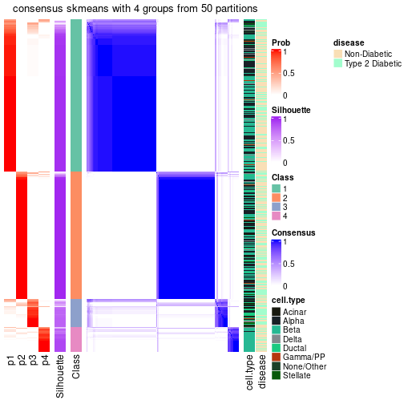</p>

</div>
</div>

Heatmaps for the membership of samples in all partitions to see how consistent they are:


<script>
$( function() {
	$( '#tabs-node-0-membership-heatmap' ).tabs();
} );
</script>
<div id='tabs-node-0-membership-heatmap'>
<ul>
<li><a href='#tab-node-0-membership-heatmap-1'>k = 2</a></li>
<li><a href='#tab-node-0-membership-heatmap-2'>k = 3</a></li>
<li><a href='#tab-node-0-membership-heatmap-3'>k = 4</a></li>
</ul>
<div id='tab-node-0-membership-heatmap-1'>
<pre><code class="r">membership_heatmap(res, k = 2)
</code></pre>

<p></p>

</div>
<div id='tab-node-0-membership-heatmap-2'>
<pre><code class="r">membership_heatmap(res, k = 3)
</code></pre>

<p></p>

</div>
<div id='tab-node-0-membership-heatmap-3'>
<pre><code class="r">membership_heatmap(res, k = 4)
</code></pre>

<p></p>

</div>
</div>

As soon as the classes for columns are determined, the signatures
that are significantly different between subgroups can be looked for. 
Following are the heatmaps for signatures.


Signature heatmaps where rows are scaled:


<script>
$( function() {
	$( '#tabs-node-0-get-signatures' ).tabs();
} );
</script>
<div id='tabs-node-0-get-signatures'>
<ul>
<li><a href='#tab-node-0-get-signatures-1'>k = 2</a></li>
<li><a href='#tab-node-0-get-signatures-2'>k = 3</a></li>
<li><a href='#tab-node-0-get-signatures-3'>k = 4</a></li>
</ul>
<div id='tab-node-0-get-signatures-1'>
<pre><code class="r">get_signatures(res, k = 2)
</code></pre>

<p></p>

</div>
<div id='tab-node-0-get-signatures-2'>
<pre><code class="r">get_signatures(res, k = 3)
</code></pre>

<p></p>

</div>
<div id='tab-node-0-get-signatures-3'>
<pre><code class="r">get_signatures(res, k = 4)
</code></pre>

<p></p>

</div>
</div>


Signature heatmaps where rows are not scaled:


<script>
$( function() {
	$( '#tabs-node-0-get-signatures-no-scale' ).tabs();
} );
</script>
<div id='tabs-node-0-get-signatures-no-scale'>
<ul>
<li><a href='#tab-node-0-get-signatures-no-scale-1'>k = 2</a></li>
<li><a href='#tab-node-0-get-signatures-no-scale-2'>k = 3</a></li>
<li><a href='#tab-node-0-get-signatures-no-scale-3'>k = 4</a></li>
</ul>
<div id='tab-node-0-get-signatures-no-scale-1'>
<pre><code class="r">get_signatures(res, k = 2, scale_rows = FALSE)
</code></pre>

<p></p>

</div>
<div id='tab-node-0-get-signatures-no-scale-2'>
<pre><code class="r">get_signatures(res, k = 3, scale_rows = FALSE)
</code></pre>

<p></p>

</div>
<div id='tab-node-0-get-signatures-no-scale-3'>
<pre><code class="r">get_signatures(res, k = 4, scale_rows = FALSE)
</code></pre>

<p>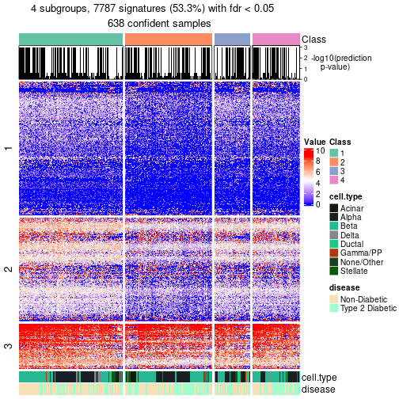</p>

</div>
</div>


Compare the overlap of signatures from different k:

```r
compare_signatures(res)
```


`get_signature()` returns a data frame invisibly. To get the list of signatures, the function
call should be assigned to a variable explicitly. In following code, if `plot` argument is set
to `FALSE`, no heatmap is plotted while only the differential analysis is performed.

```r
# code only for demonstration
tb = get_signature(res, k = ..., plot = FALSE)
```

An example of the output of `tb` is:

```
#>   which_row         fdr    mean_1    mean_2 scaled_mean_1 scaled_mean_2 km
#> 1        38 0.042760348  8.373488  9.131774    -0.5533452     0.5164555  1
#> 2        40 0.018707592  7.106213  8.469186    -0.6173731     0.5762149  1
#> 3        55 0.019134737 10.221463 11.207825    -0.6159697     0.5749050  1
#> 4        59 0.006059896  5.921854  7.869574    -0.6899429     0.6439467  1
#> 5        60 0.018055526  8.928898 10.211722    -0.6204761     0.5791110  1
#> 6        98 0.009384629 15.714769 14.887706     0.6635654    -0.6193277  2
...
```

The columns in `tb` are:

1. `which_row`: row indices corresponding to the input matrix.
2. `fdr`: FDR for the differential test. 
3. `mean_x`: The mean value in group x.
4. `scaled_mean_x`: The mean value in group x after rows are scaled.
5. `km`: Row groups if k-means clustering is applied to rows (which is done by automatically selecting number of clusters).

If there are too many signatures, `top_signatures = ...` can be set to only show the 
signatures with the highest FDRs:

```r
# code only for demonstration
# e.g. to show the top 500 most significant rows
tb = get_signature(res, k = ..., top_signatures = 500)
```

If the signatures are defined as these which are uniquely high in current group, `diff_method` argument
can be set to `"uniquely_high_in_one_group"`:

```r
# code only for demonstration
tb = get_signature(res, k = ..., diff_method = "uniquely_high_in_one_group")
```


UMAP plot which shows how samples are separated.


<script>
$( function() {
	$( '#tabs-node-0-dimension-reduction' ).tabs();
} );
</script>
<div id='tabs-node-0-dimension-reduction'>
<ul>
<li><a href='#tab-node-0-dimension-reduction-1'>k = 2</a></li>
<li><a href='#tab-node-0-dimension-reduction-2'>k = 3</a></li>
<li><a href='#tab-node-0-dimension-reduction-3'>k = 4</a></li>
</ul>
<div id='tab-node-0-dimension-reduction-1'>
<pre><code class="r">dimension_reduction(res, k = 2, method = &quot;UMAP&quot;)
</code></pre>

<p></p>

</div>
<div id='tab-node-0-dimension-reduction-2'>
<pre><code class="r">dimension_reduction(res, k = 3, method = &quot;UMAP&quot;)
</code></pre>

<p></p>

</div>
<div id='tab-node-0-dimension-reduction-3'>
<pre><code class="r">dimension_reduction(res, k = 4, method = &quot;UMAP&quot;)
</code></pre>

<p></p>

</div>
</div>


Following heatmap shows how subgroups are split when increasing `k`:

```r
collect_classes(res)
```


Test correlation between subgroups and known annotations. If the known
annotation is numeric, one-way ANOVA test is applied, and if the known
annotation is discrete, chi-squared contingency table test is applied.

```r
test_to_known_factors(res)
```

```
#>             n_sample cell.type(p-value) disease(p-value) k
#> ATC:skmeans      431           6.08e-03          0.01308 2
#> ATC:skmeans      298           1.72e-15          0.00263 3
#> ATC:skmeans      322           4.28e-17          0.15239 4
```


If matrix rows can be associated to genes, consider to use `functional_enrichment(res,
...)` to perform function enrichment for the signature genes. See [this vignette](https://jokergoo.github.io/cola_vignettes/functional_enrichment.html) for more detailed explanations.


 

---------------------------------------------------


### Node01


Parent node: [Node0](#Node0).
Child nodes: 
                [Node011](#Node011)
        ,
                [Node012](#Node012)
        ,
                [Node021](#Node021)
        ,
                [Node022](#Node022)
        ,
                [Node023](#Node023)
        ,
                Node024-leaf
        .


The object with results only for a single top-value method and a single partitioning method 
can be extracted as:

```r
res = res_rh["01"]
```

A summary of `res` and all the functions that can be applied to it:

```r
res
```

```
#> A 'ConsensusPartition' object with k = 2, 3, 4.
#>   On a matrix with 13874 rows and 377 columns.
#>   Top rows (1387) are extracted by 'ATC' method.
#>   Subgroups are detected by 'skmeans' method.
#>   Performed in total 150 partitions by row resampling.
#>   Best k for subgroups seems to be 4.
#> 
#> Following methods can be applied to this 'ConsensusPartition' object:
#>  [1] "cola_report"             "collect_classes"         "collect_plots"          
#>  [4] "collect_stats"           "colnames"                "compare_partitions"     
#>  [7] "compare_signatures"      "consensus_heatmap"       "dimension_reduction"    
#> [10] "functional_enrichment"   "get_anno_col"            "get_anno"               
#> [13] "get_classes"             "get_consensus"           "get_matrix"             
#> [16] "get_membership"          "get_param"               "get_signatures"         
#> [19] "get_stats"               "is_best_k"               "is_stable_k"            
#> [22] "membership_heatmap"      "ncol"                    "nrow"                   
#> [25] "plot_ecdf"               "predict_classes"         "rownames"               
#> [28] "select_partition_number" "show"                    "suggest_best_k"         
#> [31] "test_to_known_factors"   "top_rows_heatmap"
```

`collect_plots()` function collects all the plots made from `res` for all `k` (number of subgroups)
into one single page to provide an easy and fast comparison between different `k`.

```r
collect_plots(res)
```


The plots are:

- The first row: a plot of the eCDF (empirical cumulative distribution
  function) curves of the consensus matrix for each `k` and the heatmap of
  predicted classes for each `k`.
- The second row: heatmaps of the consensus matrix for each `k`.
- The third row: heatmaps of the membership matrix for each `k`.
- The fouth row: heatmaps of the signatures for each `k`.

All the plots in panels can be made by individual functions and they are
plotted later in this section.

`select_partition_number()` produces several plots showing different
statistics for choosing "optimized" `k`. There are following statistics:

- eCDF curves of the consensus matrix for each `k`;
- 1-PAC. [The PAC score](https://en.wikipedia.org/wiki/Consensus_clustering#Over-interpretation_potential_of_consensus_clustering)
  measures the proportion of the ambiguous subgrouping.
- Mean silhouette score.
- Concordance. The mean probability of fiting the consensus subgroup labels in all
  partitions.
- Area increased. Denote $A_k$ as the area under the eCDF curve for current
  `k`, the area increased is defined as $A_k - A_{k-1}$.
- Rand index. The percent of pairs of samples that are both in a same cluster
  or both are not in a same cluster in the partition of k and k-1.
- Jaccard index. The ratio of pairs of samples are both in a same cluster in
  the partition of k and k-1 and the pairs of samples are both in a same
  cluster in the partition k or k-1.

The detailed explanations of these statistics can be found in [the _cola_
vignette](https://jokergoo.github.io/cola_vignettes/cola.html#toc_13).

Generally speaking, higher 1-PAC score, higher mean silhouette score or higher
concordance corresponds to better partition. Rand index and Jaccard index
measure how similar the current partition is compared to partition with `k-1`.
If they are too similar, we won't accept `k` is better than `k-1`.

```r
select_partition_number(res)
```


The numeric values for all these statistics can be obtained by `get_stats()`.

```r
get_stats(res)
```

```
#>   k 1-PAC mean_silhouette concordance area_increased  Rand Jaccard
#> 2 2 1.000           0.979       0.991          0.498 0.503   0.503
#> 3 3 0.706           0.641       0.801          0.260 0.852   0.719
#> 4 4 0.978           0.938       0.969          0.154 0.800   0.544
```

`suggest_best_k()` suggests the best $k$ based on these statistics. The rules are as follows:

- All $k$ with Jaccard index larger than 0.95 are removed because increasing
  $k$ does not provide enough extra information. If all $k$ are removed, it is
  marked as no subgroup is detected.
- For all $k$ with 1-PAC score larger than 0.9, the maximal $k$ is taken as
  the best $k$, and other $k$ are marked as optional $k$.
- If it does not fit the second rule. The $k$ with the maximal vote of the
  highest 1-PAC score, highest mean silhouette, and highest concordance is
  taken as the best $k$.

```r
suggest_best_k(res)
```

```
#> [1] 4
#> attr(,"optional")
#> [1] 2
```

There is also optional best $k$ = 2 that is worth to check.

Following is the table of the partitions (You need to click the **show/hide
code output** link to see it). The membership matrix (columns with name `p*`)
is inferred by
[`clue::cl_consensus()`](https://www.rdocumentation.org/link/cl_consensus?package=clue)
function with the `SE` method. Basically the value in the membership matrix
represents the probability to belong to a certain group. The finall subgroup
label for an item is determined with the group with highest probability it
belongs to.

In `get_classes()` function, the entropy is calculated from the membership
matrix and the silhouette score is calculated from the consensus matrix.


<script>
$( function() {
	$( '#tabs-node-01-get-classes' ).tabs();
} );
</script>
<div id='tabs-node-01-get-classes'>
<ul>
<li><a href='#tab-node-01-get-classes-1'>k = 2</a></li>
<li><a href='#tab-node-01-get-classes-2'>k = 3</a></li>
<li><a href='#tab-node-01-get-classes-3'>k = 4</a></li>
</ul>

<div id='tab-node-01-get-classes-1'>
<p><a id='tab-node-01-get-classes-1-a' style='color:#0366d6' href='#'>show/hide code output</a></p>
<pre><code class="r">cbind(get_classes(res, k = 2), get_membership(res, k = 2))
</code></pre>

<pre><code>#&gt;               class entropy silhouette   p1   p2
#&gt; 10th_C10_S104     2   0.000      0.994 0.00 1.00
#&gt; 10th_C13_S61      1   0.000      0.989 1.00 0.00
#&gt; 10th_C14_S53      2   0.000      0.994 0.00 1.00
#&gt; 10th_C16_S105     2   0.000      0.994 0.00 1.00
#&gt; 10th_C19_S62      1   0.000      0.989 1.00 0.00
#&gt; 10th_C1_S59       2   0.000      0.994 0.00 1.00
#&gt; 10th_C20_S54      2   0.000      0.994 0.00 1.00
#&gt; 10th_C23_S98      2   0.000      0.994 0.00 1.00
#&gt; 10th_C24_S90      2   0.000      0.994 0.00 1.00
#&gt; 10th_C30_S107     2   0.000      0.994 0.00 1.00
#&gt; 10th_C31_S48      2   0.000      0.994 0.00 1.00
#&gt; 10th_C41_S101     2   0.000      0.994 0.00 1.00
#&gt; 10th_C45_S66      2   0.000      0.994 0.00 1.00
#&gt; 10th_C46_S94      2   0.000      0.994 0.00 1.00
#&gt; 10th_C4_S103      2   0.000      0.994 0.00 1.00
#&gt; 10th_C54_S124     2   0.000      0.994 0.00 1.00
#&gt; 10th_C56_S74      2   0.000      0.994 0.00 1.00
#&gt; 10th_C68_S75      2   0.000      0.994 0.00 1.00
#&gt; 10th_C73_S84      2   0.000      0.994 0.00 1.00
#&gt; 10th_C74_S76      2   0.000      0.994 0.00 1.00
#&gt; 10th_C76_S128     2   0.000      0.994 0.00 1.00
#&gt; 10th_C7_S60       2   0.000      0.994 0.00 1.00
#&gt; 10th_C81_S70      1   0.000      0.989 1.00 0.00
#&gt; 10th_C84_S115     1   0.000      0.989 1.00 0.00
#&gt; 10th_C85_S86      2   0.000      0.994 0.00 1.00
#&gt; 10th_C88_S130     2   0.000      0.994 0.00 1.00
#&gt; 10th_C8_S52       2   0.000      0.994 0.00 1.00
#&gt; 10th_C90_S116     2   0.000      0.994 0.00 1.00
#&gt; 10th_C96_S117     2   0.000      0.994 0.00 1.00
#&gt; 11th-C16_S64      2   0.000      0.994 0.00 1.00
#&gt; 11th-C24_S49      2   0.000      0.994 0.00 1.00
#&gt; 11th-C33_S20      2   0.000      0.994 0.00 1.00
#&gt; 11th-C36_S67      2   0.000      0.994 0.00 1.00
#&gt; 11th-C39_S21      2   0.000      0.994 0.00 1.00
#&gt; 11th-C40_S52      2   0.000      0.994 0.00 1.00
#&gt; 11th-C41_S60      1   0.000      0.989 1.00 0.00
#&gt; 11th-C44_S15      1   0.000      0.989 1.00 0.00
#&gt; 11th-C49_S23      1   0.000      0.989 1.00 0.00
#&gt; 11th-C51_S39      1   0.000      0.989 1.00 0.00
#&gt; 11th-C53_S78      1   0.327      0.931 0.94 0.06
#&gt; 11th-C58_S71      2   0.000      0.994 0.00 1.00
#&gt; 11th-C5_S54       2   0.000      0.994 0.00 1.00
#&gt; 11th-C61_S25      2   0.000      0.994 0.00 1.00
#&gt; 11th-C66_S88      1   0.000      0.989 1.00 0.00
#&gt; 11th-C68_S34      2   0.000      0.994 0.00 1.00
#&gt; 11th-C7_S16       1   0.000      0.989 1.00 0.00
#&gt; 12th-C11_S147     2   0.000      0.994 0.00 1.00
#&gt; 12th-C12_S139     2   0.000      0.994 0.00 1.00
#&gt; 12th-C14_S190     1   0.000      0.989 1.00 0.00
#&gt; 12th-C20_S191     2   0.000      0.994 0.00 1.00
#&gt; 12th-C24_S141     1   0.000      0.989 1.00 0.00
#&gt; 12th-C25_S185     2   0.000      0.994 0.00 1.00
#&gt; 12th-C26_S192     2   0.000      0.994 0.00 1.00
#&gt; 12th-C28_S142     2   0.000      0.994 0.00 1.00
#&gt; 12th-C29_S150     1   0.000      0.989 1.00 0.00
#&gt; 12th-C30_S157     2   0.000      0.994 0.00 1.00
#&gt; 12th-C33_S200     2   0.000      0.994 0.00 1.00
#&gt; 12th-C42_S159     1   0.000      0.989 1.00 0.00
#&gt; 12th-C46_S145     2   0.000      0.994 0.00 1.00
#&gt; 12th-C48_S160     2   0.000      0.994 0.00 1.00
#&gt; 12th-C51_S217     2   0.000      0.994 0.00 1.00
#&gt; 12th-C55_S203     1   0.000      0.989 1.00 0.00
#&gt; 12th-C58_S162     1   0.000      0.989 1.00 0.00
#&gt; 12th-C59_S169     1   0.000      0.989 1.00 0.00
#&gt; 12th-C60_S176     1   0.000      0.989 1.00 0.00
#&gt; 12th-C63_S219     2   0.000      0.994 0.00 1.00
#&gt; 12th-C64_S163     1   0.000      0.989 1.00 0.00
#&gt; 12th-C65_S170     1   0.000      0.989 1.00 0.00
#&gt; 12th-C69_S135     2   0.000      0.994 0.00 1.00
#&gt; 12th-C74_S214     1   0.000      0.989 1.00 0.00
#&gt; 12th-C76_S177     1   0.000      0.989 1.00 0.00
#&gt; 12th-C7_S196      1   0.000      0.989 1.00 0.00
#&gt; 12th-C80_S215     2   0.000      0.994 0.00 1.00
#&gt; 12th-C81_S207     2   0.000      0.994 0.00 1.00
#&gt; 12th-C84_S165     1   0.000      0.989 1.00 0.00
#&gt; 12th-C85_S137     2   0.000      0.994 0.00 1.00
#&gt; 12th-C90_S166     1   0.000      0.989 1.00 0.00
#&gt; 12th-C94_S180     2   0.000      0.994 0.00 1.00
#&gt; 12th-C95_S174     1   0.000      0.989 1.00 0.00
#&gt; 12th-C96_S167     1   0.000      0.989 1.00 0.00
#&gt; 13th_C12_S178     2   0.000      0.994 0.00 1.00
#&gt; 13th_C13_S149     2   0.000      0.994 0.00 1.00
#&gt; 13th_C16_S193     2   0.000      0.994 0.00 1.00
#&gt; 13th_C23_S187     2   0.000      0.994 0.00 1.00
#&gt; 13th_C34_S181     1   0.000      0.989 1.00 0.00
#&gt; 13th_C39_S153     2   0.000      0.994 0.00 1.00
#&gt; 13th_C60_S213     2   0.000      0.994 0.00 1.00
#&gt; 13th_C66_S214     1   0.000      0.989 1.00 0.00
#&gt; 13th_C76_S216     1   0.000      0.989 1.00 0.00
#&gt; 13th_C94_S219     2   0.000      0.994 0.00 1.00
#&gt; 13th_C96_S204     2   0.000      0.994 0.00 1.00
#&gt; 1st-61_S27        1   0.000      0.989 1.00 0.00
#&gt; 1st-C11_S58       1   0.000      0.989 1.00 0.00
#&gt; 1st-C19_S20       1   0.000      0.989 1.00 0.00
#&gt; 1st-C21_S4        2   0.000      0.994 0.00 1.00
#&gt; 1st-C32_S14       1   0.000      0.989 1.00 0.00
#&gt; 1st-C34_S54       2   0.000      0.994 0.00 1.00
#&gt; 1st-C42_S71       1   0.000      0.989 1.00 0.00
#&gt; 1st-C50_S33       1   0.000      0.989 1.00 0.00
#&gt; 1st-C56_S34       1   0.000      0.989 1.00 0.00
#&gt; 1st-C57_S42       1   0.000      0.989 1.00 0.00
#&gt; 1st-C58_S76       1   0.000      0.989 1.00 0.00
#&gt; 1st-C64_S79       1   0.000      0.989 1.00 0.00
#&gt; 1st-C68_S36       1   0.000      0.989 1.00 0.00
#&gt; 1st-C69_S44       2   0.000      0.994 0.00 1.00
#&gt; 1st-C71_S83       2   0.000      0.994 0.00 1.00
#&gt; 1st-C73_S45       1   0.000      0.989 1.00 0.00
#&gt; 1st-C75_S29       1   0.000      0.989 1.00 0.00
#&gt; 1st-C77_S86       1   0.000      0.989 1.00 0.00
#&gt; 1st-C78_S85       1   0.000      0.989 1.00 0.00
#&gt; 1st-C80_S38       1   0.000      0.989 1.00 0.00
#&gt; 1st-C90_S91       1   0.000      0.989 1.00 0.00
#&gt; 2nd-C11_S20       1   0.000      0.989 1.00 0.00
#&gt; 2nd-C15_S25       1   0.000      0.989 1.00 0.00
#&gt; 2nd-C16_S33       1   0.000      0.989 1.00 0.00
#&gt; 2nd-C17_S32       1   0.000      0.989 1.00 0.00
#&gt; 2nd-C21_S37       1   0.000      0.989 1.00 0.00
#&gt; 2nd-C25_S49       2   0.000      0.994 0.00 1.00
#&gt; 2nd-C26_S50       1   0.000      0.989 1.00 0.00
#&gt; 2nd-C29_S56       2   0.000      0.994 0.00 1.00
#&gt; 2nd-C31_S61       2   0.000      0.994 0.00 1.00
#&gt; 2nd-C32_S62       1   0.000      0.989 1.00 0.00
#&gt; 2nd-C38_S74       1   0.000      0.989 1.00 0.00
#&gt; 2nd-C39_S75       1   0.000      0.989 1.00 0.00
#&gt; 2nd-C47_S92       2   0.000      0.994 0.00 1.00
#&gt; 2nd-C54_S12       2   0.000      0.994 0.00 1.00
#&gt; 2nd-C57_S18       2   0.000      0.994 0.00 1.00
#&gt; 2nd-C62_S29       1   0.000      0.989 1.00 0.00
#&gt; 2nd-C67_S40       1   0.000      0.989 1.00 0.00
#&gt; 2nd-C6_S7         2   0.000      0.994 0.00 1.00
#&gt; 2nd-C72_S48       1   0.722      0.755 0.80 0.20
#&gt; 2nd-C74_S53       2   0.000      0.994 0.00 1.00
#&gt; 2nd-C75_S52       1   0.000      0.989 1.00 0.00
#&gt; 2nd-C76_S60       2   0.000      0.994 0.00 1.00
#&gt; 2nd-C77_S59       1   0.000      0.989 1.00 0.00
#&gt; 2nd-C80_S65       1   0.000      0.989 1.00 0.00
#&gt; 2nd-C81_S64       2   0.000      0.994 0.00 1.00
#&gt; 2nd-C83_S71       2   0.141      0.974 0.02 0.98
#&gt; 2nd-C86_S77       1   0.000      0.989 1.00 0.00
#&gt; 2nd-C88_S84       1   0.000      0.989 1.00 0.00
#&gt; 2nd-C8_S14        1   0.000      0.989 1.00 0.00
#&gt; 2nd-C93_S88       1   0.000      0.989 1.00 0.00
#&gt; 2nd-C95_S95       1   0.000      0.989 1.00 0.00
#&gt; 3rd-C11_S58       1   0.000      0.989 1.00 0.00
#&gt; 3rd-C12_S68       1   0.000      0.989 1.00 0.00
#&gt; 3rd-C18_S80       2   0.000      0.994 0.00 1.00
#&gt; 3rd-C1_S39        2   0.000      0.994 0.00 1.00
#&gt; 3rd-C20_S22       2   0.000      0.994 0.00 1.00
#&gt; 3rd-C21_S11       2   0.000      0.994 0.00 1.00
#&gt; 3rd-C26_S28       2   0.000      0.994 0.00 1.00
#&gt; 3rd-C27_S49       1   0.995      0.158 0.54 0.46
#&gt; 3rd-C33_S50       1   0.000      0.989 1.00 0.00
#&gt; 3rd-C35_S23       1   0.000      0.989 1.00 0.00
#&gt; 3rd-C36_S2        1   0.000      0.989 1.00 0.00
#&gt; 3rd-C40_S57       2   0.000      0.994 0.00 1.00
#&gt; 3rd-C42_S74       2   0.000      0.994 0.00 1.00
#&gt; 3rd-C46_S93       2   0.000      0.994 0.00 1.00
#&gt; 3rd-C47_S35       1   0.000      0.989 1.00 0.00
#&gt; 3rd-C49_S60       1   0.000      0.989 1.00 0.00
#&gt; 3rd-C4_S25        1   0.000      0.989 1.00 0.00
#&gt; 3rd-C53_S67       1   0.000      0.989 1.00 0.00
#&gt; 3rd-C57_S5        1   0.000      0.989 1.00 0.00
#&gt; 3rd-C58_S3        1   0.000      0.989 1.00 0.00
#&gt; 3rd-C59_S91       1   0.000      0.989 1.00 0.00
#&gt; 3rd-C65_S20       1   0.000      0.989 1.00 0.00
#&gt; 3rd-C67_S69       2   0.584      0.836 0.14 0.86
#&gt; 3rd-C68_S13       2   0.000      0.994 0.00 1.00
#&gt; 3rd-C6_S44        1   0.000      0.989 1.00 0.00
#&gt; 3rd-C71_S80       1   0.000      0.989 1.00 0.00
#&gt; 3rd-C76_S22       2   0.000      0.994 0.00 1.00
#&gt; 3rd-C79_S67       1   0.000      0.989 1.00 0.00
#&gt; 3rd-C82_S11       1   0.000      0.989 1.00 0.00
#&gt; 3rd-C84_S75       1   0.000      0.989 1.00 0.00
#&gt; 3rd-C85_S79       1   0.000      0.989 1.00 0.00
#&gt; 3rd-C86_S85       2   0.000      0.994 0.00 1.00
#&gt; 3rd-C87_S88       2   0.000      0.994 0.00 1.00
#&gt; 3rd-C88_S24       1   0.000      0.989 1.00 0.00
#&gt; 3rd-C91_S91       1   0.000      0.989 1.00 0.00
#&gt; 3rd-C92_S86       1   0.000      0.989 1.00 0.00
#&gt; 3rd-C95_S81       1   0.000      0.989 1.00 0.00
#&gt; 3rd-C9_S5         1   0.000      0.989 1.00 0.00
#&gt; 4th-61_S28        1   0.000      0.989 1.00 0.00
#&gt; 4th-C12_S19       2   0.000      0.994 0.00 1.00
#&gt; 4th-C14_S26       1   0.000      0.989 1.00 0.00
#&gt; 4th-C18_S31       1   0.141      0.970 0.98 0.02
#&gt; 4th-C23_S44       2   0.000      0.994 0.00 1.00
#&gt; 4th-C24_S43       1   0.000      0.989 1.00 0.00
#&gt; 4th-C26_S50       1   0.000      0.989 1.00 0.00
#&gt; 4th-C28_S55       2   0.000      0.994 0.00 1.00
#&gt; 4th-C29_S56       2   0.000      0.994 0.00 1.00
#&gt; 4th-C32_S62       2   0.000      0.994 0.00 1.00
#&gt; 4th-C33_S63       2   0.000      0.994 0.00 1.00
#&gt; 4th-C36_S69       1   0.000      0.989 1.00 0.00
#&gt; 4th-C40_S79       1   0.000      0.989 1.00 0.00
#&gt; 4th-C43_S85       2   0.000      0.994 0.00 1.00
#&gt; 4th-C49_S4        2   0.000      0.994 0.00 1.00
#&gt; 4th-C4_S9         1   0.000      0.989 1.00 0.00
#&gt; 4th-C51_S6        2   0.000      0.994 0.00 1.00
#&gt; 4th-C56_S17       1   0.000      0.989 1.00 0.00
#&gt; 4th-C59_S23       2   0.000      0.994 0.00 1.00
#&gt; 4th-C5_S8         1   0.000      0.989 1.00 0.00
#&gt; 4th-C62_S29       1   0.000      0.989 1.00 0.00
#&gt; 4th-C63_S30       2   0.000      0.994 0.00 1.00
#&gt; 4th-C64_S34       1   0.000      0.989 1.00 0.00
#&gt; 4th-C66_S36       1   0.000      0.989 1.00 0.00
#&gt; 4th-C67_S40       1   0.000      0.989 1.00 0.00
#&gt; 4th-C69_S42       2   0.000      0.994 0.00 1.00
#&gt; 4th-C70_S46       2   0.000      0.994 0.00 1.00
#&gt; 4th-C73_S54       1   0.000      0.989 1.00 0.00
#&gt; 4th-C75_S52       1   0.000      0.989 1.00 0.00
#&gt; 4th-C78_S58       2   0.000      0.994 0.00 1.00
#&gt; 4th-C79_S66       1   0.000      0.989 1.00 0.00
#&gt; 4th-C7_S15        1   0.000      0.989 1.00 0.00
#&gt; 4th-C80_S65       1   0.000      0.989 1.00 0.00
#&gt; 4th-C81_S64       2   0.000      0.994 0.00 1.00
#&gt; 4th-C82_S72       1   0.000      0.989 1.00 0.00
#&gt; 4th-C83_S71       1   0.000      0.989 1.00 0.00
#&gt; 4th-C85_S78       1   0.000      0.989 1.00 0.00
#&gt; 4th-C86_S77       1   0.000      0.989 1.00 0.00
#&gt; 4th-C87_S76       2   0.000      0.994 0.00 1.00
#&gt; 4th-C88_S84       1   0.000      0.989 1.00 0.00
#&gt; 4th-C89_S83       1   0.000      0.989 1.00 0.00
#&gt; 4th-C8_S14        2   0.000      0.994 0.00 1.00
#&gt; 4th-C92_S89       1   0.634      0.812 0.84 0.16
#&gt; 4th-C94_S96       1   0.000      0.989 1.00 0.00
#&gt; 4th-C95_S95       2   0.000      0.994 0.00 1.00
#&gt; 4th-C96_S94       1   0.000      0.989 1.00 0.00
#&gt; 5th-C12_S90       2   0.000      0.994 0.00 1.00
#&gt; 5th-C19_S104      2   0.000      0.994 0.00 1.00
#&gt; 5th-C21_S102      2   0.981      0.268 0.42 0.58
#&gt; 5th-C30_S105      2   0.000      0.994 0.00 1.00
#&gt; 5th-C34_S108      1   0.904      0.536 0.68 0.32
#&gt; 5th-C35_S109      1   0.000      0.989 1.00 0.00
#&gt; 5th-C47_S118      2   0.000      0.994 0.00 1.00
#&gt; 5th-C49_S89       1   0.000      0.989 1.00 0.00
#&gt; 5th-C50_S90       2   0.000      0.994 0.00 1.00
#&gt; 5th-C54_S89       2   0.000      0.994 0.00 1.00
#&gt; 5th-C57_S96       2   0.000      0.994 0.00 1.00
#&gt; 5th-C59_S94       2   0.000      0.994 0.00 1.00
#&gt; 5th-C5_S85        1   0.000      0.989 1.00 0.00
#&gt; 5th-C64_S99       2   0.000      0.994 0.00 1.00
#&gt; 5th-C66_S101      2   0.000      0.994 0.00 1.00
#&gt; 5th-C68_S106      2   0.000      0.994 0.00 1.00
#&gt; 5th-C69_S107      2   0.000      0.994 0.00 1.00
#&gt; 5th-C74_S110      2   0.000      0.994 0.00 1.00
#&gt; 5th-C77_S107      2   0.000      0.994 0.00 1.00
#&gt; 5th-C7_S93        1   0.000      0.989 1.00 0.00
#&gt; 5th-C90_S115      1   0.000      0.989 1.00 0.00
#&gt; 5th-C92_S124      2   0.000      0.994 0.00 1.00
#&gt; 5th-C9_S92        1   0.000      0.989 1.00 0.00
#&gt; 6th-C12_S18       1   0.000      0.989 1.00 0.00
#&gt; 6th-C16_S29       2   0.000      0.994 0.00 1.00
#&gt; 6th-C20_S34       1   0.000      0.989 1.00 0.00
#&gt; 6th-C21_S33       1   0.795      0.691 0.76 0.24
#&gt; 6th-C22_S39       1   0.000      0.989 1.00 0.00
#&gt; 6th-C23_S38       1   0.000      0.989 1.00 0.00
#&gt; 6th-C24_S37       1   0.000      0.989 1.00 0.00
#&gt; 6th-C29_S50       1   0.000      0.989 1.00 0.00
#&gt; 6th-C2_S2         1   0.000      0.989 1.00 0.00
#&gt; 6th-C30_S51       1   0.000      0.989 1.00 0.00
#&gt; 6th-C40_S73       1   0.000      0.989 1.00 0.00
#&gt; 6th-C42_S75       1   0.795      0.691 0.76 0.24
#&gt; 6th-C51_S6        1   0.000      0.989 1.00 0.00
#&gt; 6th-C53_S10       2   0.000      0.994 0.00 1.00
#&gt; 6th-C54_S11       1   0.000      0.989 1.00 0.00
#&gt; 6th-C59_S21       1   0.000      0.989 1.00 0.00
#&gt; 6th-C5_S8         2   0.000      0.994 0.00 1.00
#&gt; 6th-C63_S26       1   0.000      0.989 1.00 0.00
#&gt; 6th-C65_S31       2   0.000      0.994 0.00 1.00
#&gt; 6th-C66_S32       1   0.000      0.989 1.00 0.00
#&gt; 6th-C71_S41       1   0.000      0.989 1.00 0.00
#&gt; 6th-C73_S48       1   0.000      0.989 1.00 0.00
#&gt; 6th-C75_S46       1   0.000      0.989 1.00 0.00
#&gt; 6th-C77_S53       1   0.000      0.989 1.00 0.00
#&gt; 6th-C79_S60       1   0.000      0.989 1.00 0.00
#&gt; 6th-C80_S59       1   0.000      0.989 1.00 0.00
#&gt; 6th-C85_S72       1   0.000      0.989 1.00 0.00
#&gt; 6th-C87_S70       1   0.242      0.951 0.96 0.04
#&gt; 6th-C91_S84       2   0.000      0.994 0.00 1.00
#&gt; 6th-C93_S82       2   0.529      0.862 0.12 0.88
#&gt; 7th-C10_S19       1   0.000      0.989 1.00 0.00
#&gt; 7th-C11_S18       1   0.000      0.989 1.00 0.00
#&gt; 7th-C14_S24       1   0.000      0.989 1.00 0.00
#&gt; 7th-C15_S23       2   0.000      0.994 0.00 1.00
#&gt; 7th-C17_S29       2   0.000      0.994 0.00 1.00
#&gt; 7th-C24_S40       1   0.469      0.887 0.90 0.10
#&gt; 7th-C25_S43       1   0.000      0.989 1.00 0.00
#&gt; 7th-C31_S53       1   0.000      0.989 1.00 0.00
#&gt; 7th-C32_S54       2   0.000      0.994 0.00 1.00
#&gt; 7th-C34_S59       2   0.584      0.836 0.14 0.86
#&gt; 7th-C36_S61       1   0.000      0.989 1.00 0.00
#&gt; 7th-C40_S70       2   0.000      0.994 0.00 1.00
#&gt; 7th-C44_S76       2   0.000      0.994 0.00 1.00
#&gt; 7th-C45_S77       1   0.000      0.989 1.00 0.00
#&gt; 7th-C50_S5        1   0.000      0.989 1.00 0.00
#&gt; 7th-C53_S10       1   0.000      0.989 1.00 0.00
#&gt; 7th-C56_S15       2   0.000      0.994 0.00 1.00
#&gt; 7th-C58_S20       1   0.000      0.989 1.00 0.00
#&gt; 7th-C59_S21       1   0.000      0.989 1.00 0.00
#&gt; 7th-C62_S27       1   0.000      0.989 1.00 0.00
#&gt; 7th-C64_S31       1   0.000      0.989 1.00 0.00
#&gt; 7th-C66_S33       1   0.000      0.989 1.00 0.00
#&gt; 7th-C68_S38       2   0.000      0.994 0.00 1.00
#&gt; 7th-C69_S39       2   0.000      0.994 0.00 1.00
#&gt; 7th-C72_S42       2   0.634      0.808 0.16 0.84
#&gt; 7th-C73_S47       1   0.000      0.989 1.00 0.00
#&gt; 7th-C77_S51       1   0.000      0.989 1.00 0.00
#&gt; 7th-C79_S58       1   0.000      0.989 1.00 0.00
#&gt; 7th-C80_S57       1   0.000      0.989 1.00 0.00
#&gt; 7th-C82_S64       1   0.000      0.989 1.00 0.00
#&gt; 7th-C84_S62       1   0.000      0.989 1.00 0.00
#&gt; 7th-C88_S75       2   0.000      0.994 0.00 1.00
#&gt; 7th-C89_S74       1   0.000      0.989 1.00 0.00
#&gt; 7th-C8_S13        1   0.000      0.989 1.00 0.00
#&gt; 7th-C90_S73       1   0.000      0.989 1.00 0.00
#&gt; 7th-C96_S82       1   0.000      0.989 1.00 0.00
#&gt; 8th-C10_S100      1   0.000      0.989 1.00 0.00
#&gt; 8th-C11_S99       2   0.000      0.994 0.00 1.00
#&gt; 8th-C20_S116      2   0.000      0.994 0.00 1.00
#&gt; 8th-C24_S120      1   0.000      0.989 1.00 0.00
#&gt; 8th-C2_S85        1   0.000      0.989 1.00 0.00
#&gt; 8th-C34_S141      2   0.000      0.994 0.00 1.00
#&gt; 8th-C44_S155      1   0.000      0.989 1.00 0.00
#&gt; 8th-C55_S96       1   0.827      0.657 0.74 0.26
#&gt; 8th-C57_S98       1   0.000      0.989 1.00 0.00
#&gt; 8th-C58_S101      1   0.402      0.909 0.92 0.08
#&gt; 8th-C59_S102      2   0.000      0.994 0.00 1.00
#&gt; 8th-C61_S107      2   0.000      0.994 0.00 1.00
#&gt; 8th-C64_S112      2   0.000      0.994 0.00 1.00
#&gt; 8th-C65_S113      1   0.000      0.989 1.00 0.00
#&gt; 8th-C67_S117      1   0.000      0.989 1.00 0.00
#&gt; 8th-C6_S88        2   0.000      0.994 0.00 1.00
#&gt; 8th-C73_S130      2   0.000      0.994 0.00 1.00
#&gt; 8th-C74_S129      1   0.000      0.989 1.00 0.00
#&gt; 8th-C7_S95        2   0.000      0.994 0.00 1.00
#&gt; 8th-C85_S150      1   0.000      0.989 1.00 0.00
#&gt; 8th-C87_S148      1   0.000      0.989 1.00 0.00
#&gt; 8th-C92_S157      2   0.000      0.994 0.00 1.00
#&gt; 8th-C95_S161      2   0.000      0.994 0.00 1.00
#&gt; 9th-C10_S18       1   0.000      0.989 1.00 0.00
#&gt; 9th-C11_S17       1   0.000      0.989 1.00 0.00
#&gt; 9th-C15_S22       2   0.000      0.994 0.00 1.00
#&gt; 9th-C16_S30       2   0.000      0.994 0.00 1.00
#&gt; 9th-C17_S29       2   0.000      0.994 0.00 1.00
#&gt; 9th-C19_S36       2   0.000      0.994 0.00 1.00
#&gt; 9th-C1_S3         1   0.000      0.989 1.00 0.00
#&gt; 9th-C28_S50       2   0.000      0.994 0.00 1.00
#&gt; 9th-C29_S51       2   0.000      0.994 0.00 1.00
#&gt; 9th-C30_S52       2   0.000      0.994 0.00 1.00
#&gt; 9th-C36_S59       2   0.000      0.994 0.00 1.00
#&gt; 9th-C38_S64       1   0.000      0.989 1.00 0.00
#&gt; 9th-C3_S1         1   0.000      0.989 1.00 0.00
#&gt; 9th-C40_S69       2   0.000      0.994 0.00 1.00
#&gt; 9th-C41_S70       1   0.000      0.989 1.00 0.00
#&gt; 9th-C46_S79       1   0.000      0.989 1.00 0.00
#&gt; 9th-C57_S16       1   0.327      0.931 0.94 0.06
#&gt; 9th-C5_S8         2   0.000      0.994 0.00 1.00
#&gt; 9th-C61_S25       2   0.000      0.994 0.00 1.00
#&gt; 9th-C62_S26       2   0.000      0.994 0.00 1.00
#&gt; 9th-C64_S31       2   0.000      0.994 0.00 1.00
#&gt; 9th-C65_S32       2   0.000      0.994 0.00 1.00
#&gt; 9th-C66_S33       2   0.000      0.994 0.00 1.00
#&gt; 9th-C67_S37       2   0.000      0.994 0.00 1.00
#&gt; 9th-C6_S7         1   0.000      0.989 1.00 0.00
#&gt; 9th-C70_S42       1   0.000      0.989 1.00 0.00
#&gt; 9th-C74_S48       2   0.000      0.994 0.00 1.00
#&gt; 9th-C77_S53       2   0.000      0.994 0.00 1.00
#&gt; 9th-C80_S56       1   0.000      0.989 1.00 0.00
#&gt; 9th-C81_S55       1   0.000      0.989 1.00 0.00
#&gt; 9th-C83_S61       1   0.000      0.989 1.00 0.00
#&gt; 9th-C84_S60       2   0.000      0.994 0.00 1.00
#&gt; 9th-C86_S67       1   0.000      0.989 1.00 0.00
#&gt; 9th-C89_S72       1   0.000      0.989 1.00 0.00
#&gt; 9th-C8_S14        1   0.000      0.989 1.00 0.00
#&gt; 9th-C93_S76       1   0.000      0.989 1.00 0.00
#&gt; 9th-C96_S81       2   0.000      0.994 0.00 1.00
#&gt; 9th-C9_S13        1   0.469      0.887 0.90 0.10
</code></pre>

<script>
$('#tab-node-01-get-classes-1-a').parent().next().next().hide();
$('#tab-node-01-get-classes-1-a').click(function(){
  $('#tab-node-01-get-classes-1-a').parent().next().next().toggle();
  return(false);
});
</script>
</div>

<div id='tab-node-01-get-classes-2'>
<p><a id='tab-node-01-get-classes-2-a' style='color:#0366d6' href='#'>show/hide code output</a></p>
<pre><code class="r">cbind(get_classes(res, k = 3), get_membership(res, k = 3))
</code></pre>

<pre><code>#&gt;               class entropy silhouette   p1   p2   p3
#&gt; 10th_C10_S104     2  0.6280     0.7530 0.00 0.54 0.46
#&gt; 10th_C13_S61      1  0.6280     0.7963 0.54 0.46 0.00
#&gt; 10th_C14_S53      2  0.6280     0.7530 0.00 0.54 0.46
#&gt; 10th_C16_S105     2  0.6280     0.7530 0.00 0.54 0.46
#&gt; 10th_C19_S62      3  0.8853     0.3061 0.14 0.32 0.54
#&gt; 10th_C1_S59       2  0.6280     0.7530 0.00 0.54 0.46
#&gt; 10th_C20_S54      2  0.6280     0.7530 0.00 0.54 0.46
#&gt; 10th_C23_S98      2  0.6280     0.7530 0.00 0.54 0.46
#&gt; 10th_C24_S90      2  0.6280     0.7530 0.00 0.54 0.46
#&gt; 10th_C30_S107     2  0.6280     0.7530 0.00 0.54 0.46
#&gt; 10th_C31_S48      2  0.6280     0.7530 0.00 0.54 0.46
#&gt; 10th_C41_S101     2  0.6280     0.7530 0.00 0.54 0.46
#&gt; 10th_C45_S66      2  0.6280     0.7530 0.00 0.54 0.46
#&gt; 10th_C46_S94      3  0.0000     0.7287 0.00 0.00 1.00
#&gt; 10th_C4_S103      3  0.0000     0.7287 0.00 0.00 1.00
#&gt; 10th_C54_S124     2  0.6280     0.7530 0.00 0.54 0.46
#&gt; 10th_C56_S74      3  0.0000     0.7287 0.00 0.00 1.00
#&gt; 10th_C68_S75      2  0.6280     0.7530 0.00 0.54 0.46
#&gt; 10th_C73_S84      3  0.0000     0.7287 0.00 0.00 1.00
#&gt; 10th_C74_S76      2  0.6280     0.7530 0.00 0.54 0.46
#&gt; 10th_C76_S128     2  0.6280     0.7530 0.00 0.54 0.46
#&gt; 10th_C7_S60       3  0.0000     0.7287 0.00 0.00 1.00
#&gt; 10th_C81_S70      1  0.6280     0.7963 0.54 0.46 0.00
#&gt; 10th_C84_S115     1  0.6280     0.7963 0.54 0.46 0.00
#&gt; 10th_C85_S86      2  0.6280     0.7530 0.00 0.54 0.46
#&gt; 10th_C88_S130     3  0.0000     0.7287 0.00 0.00 1.00
#&gt; 10th_C8_S52       2  0.6280     0.7530 0.00 0.54 0.46
#&gt; 10th_C90_S116     2  0.6280     0.7530 0.00 0.54 0.46
#&gt; 10th_C96_S117     2  0.6280     0.3078 0.46 0.54 0.00
#&gt; 11th-C16_S64      2  0.6280     0.7530 0.00 0.54 0.46
#&gt; 11th-C24_S49      3  0.0000     0.7287 0.00 0.00 1.00
#&gt; 11th-C33_S20      2  0.6280     0.7530 0.00 0.54 0.46
#&gt; 11th-C36_S67      2  0.6280     0.7530 0.00 0.54 0.46
#&gt; 11th-C39_S21      2  0.6280     0.7530 0.00 0.54 0.46
#&gt; 11th-C40_S52      3  0.0000     0.7287 0.00 0.00 1.00
#&gt; 11th-C41_S60      1  0.6280     0.7963 0.54 0.46 0.00
#&gt; 11th-C44_S15      1  0.6280     0.7963 0.54 0.46 0.00
#&gt; 11th-C49_S23      1  0.6280     0.7963 0.54 0.46 0.00
#&gt; 11th-C51_S39      1  0.6280     0.7963 0.54 0.46 0.00
#&gt; 11th-C53_S78      2  0.7578    -0.7611 0.46 0.50 0.04
#&gt; 11th-C58_S71      3  0.0000     0.7287 0.00 0.00 1.00
#&gt; 11th-C5_S54       2  0.7029     0.7328 0.02 0.54 0.44
#&gt; 11th-C61_S25      2  0.6280     0.7530 0.00 0.54 0.46
#&gt; 11th-C66_S88      1  0.6280     0.7963 0.54 0.46 0.00
#&gt; 11th-C68_S34      3  0.6302    -0.6594 0.00 0.48 0.52
#&gt; 11th-C7_S16       3  0.8853     0.3061 0.14 0.32 0.54
#&gt; 12th-C11_S147     2  0.6280     0.7530 0.00 0.54 0.46
#&gt; 12th-C12_S139     2  0.6280     0.7530 0.00 0.54 0.46
#&gt; 12th-C14_S190     2  0.6309    -0.7871 0.50 0.50 0.00
#&gt; 12th-C20_S191     2  0.6280     0.7530 0.00 0.54 0.46
#&gt; 12th-C24_S141     1  0.6280     0.7963 0.54 0.46 0.00
#&gt; 12th-C25_S185     2  0.6280     0.7530 0.00 0.54 0.46
#&gt; 12th-C26_S192     2  0.6280     0.7530 0.00 0.54 0.46
#&gt; 12th-C28_S142     2  0.6280     0.3078 0.46 0.54 0.00
#&gt; 12th-C29_S150     1  0.0000     0.6005 1.00 0.00 0.00
#&gt; 12th-C30_S157     2  0.6244     0.7275 0.00 0.56 0.44
#&gt; 12th-C33_S200     2  0.5216     0.4663 0.00 0.74 0.26
#&gt; 12th-C42_S159     1  0.6280     0.7963 0.54 0.46 0.00
#&gt; 12th-C46_S145     3  0.0000     0.7287 0.00 0.00 1.00
#&gt; 12th-C48_S160     2  0.6280     0.7530 0.00 0.54 0.46
#&gt; 12th-C51_S217     2  0.6280     0.7530 0.00 0.54 0.46
#&gt; 12th-C55_S203     1  0.6280     0.7963 0.54 0.46 0.00
#&gt; 12th-C58_S162     1  0.0000     0.6005 1.00 0.00 0.00
#&gt; 12th-C59_S169     1  0.6280     0.7963 0.54 0.46 0.00
#&gt; 12th-C60_S176     1  0.6280     0.7963 0.54 0.46 0.00
#&gt; 12th-C63_S219     2  0.6280     0.7530 0.00 0.54 0.46
#&gt; 12th-C64_S163     1  0.6280     0.7963 0.54 0.46 0.00
#&gt; 12th-C65_S170     1  0.6280     0.7963 0.54 0.46 0.00
#&gt; 12th-C69_S135     3  0.0000     0.7287 0.00 0.00 1.00
#&gt; 12th-C74_S214     1  0.6280     0.7963 0.54 0.46 0.00
#&gt; 12th-C76_S177     1  0.6280     0.7963 0.54 0.46 0.00
#&gt; 12th-C7_S196      1  0.6280     0.7963 0.54 0.46 0.00
#&gt; 12th-C80_S215     3  0.2537     0.5821 0.00 0.08 0.92
#&gt; 12th-C81_S207     2  0.6280     0.7530 0.00 0.54 0.46
#&gt; 12th-C84_S165     1  0.6280     0.7963 0.54 0.46 0.00
#&gt; 12th-C85_S137     2  0.6280     0.7530 0.00 0.54 0.46
#&gt; 12th-C90_S166     1  0.6280     0.7963 0.54 0.46 0.00
#&gt; 12th-C94_S180     3  0.0000     0.7287 0.00 0.00 1.00
#&gt; 12th-C95_S174     1  0.0000     0.6005 1.00 0.00 0.00
#&gt; 12th-C96_S167     1  0.6280     0.7963 0.54 0.46 0.00
#&gt; 13th_C12_S178     2  0.5016     0.4371 0.00 0.76 0.24
#&gt; 13th_C13_S149     2  0.6280     0.7530 0.00 0.54 0.46
#&gt; 13th_C16_S193     2  0.6280     0.7530 0.00 0.54 0.46
#&gt; 13th_C23_S187     2  0.6280     0.7530 0.00 0.54 0.46
#&gt; 13th_C34_S181     1  0.6280     0.7963 0.54 0.46 0.00
#&gt; 13th_C39_S153     2  0.6280     0.7530 0.00 0.54 0.46
#&gt; 13th_C60_S213     2  0.6280     0.7530 0.00 0.54 0.46
#&gt; 13th_C66_S214     1  0.4002     0.6662 0.84 0.16 0.00
#&gt; 13th_C76_S216     1  0.0000     0.6005 1.00 0.00 0.00
#&gt; 13th_C94_S219     2  0.6280     0.7530 0.00 0.54 0.46
#&gt; 13th_C96_S204     2  0.6280     0.7530 0.00 0.54 0.46
#&gt; 1st-61_S27        1  0.6280     0.7963 0.54 0.46 0.00
#&gt; 1st-C11_S58       1  0.6280     0.7963 0.54 0.46 0.00
#&gt; 1st-C19_S20       1  0.0000     0.6005 1.00 0.00 0.00
#&gt; 1st-C21_S4        2  0.6280     0.3078 0.46 0.54 0.00
#&gt; 1st-C32_S14       1  0.6280     0.7963 0.54 0.46 0.00
#&gt; 1st-C34_S54       3  0.0000     0.7287 0.00 0.00 1.00
#&gt; 1st-C42_S71       3  0.7517     0.2211 0.04 0.42 0.54
#&gt; 1st-C50_S33       1  0.0000     0.6005 1.00 0.00 0.00
#&gt; 1st-C56_S34       1  0.0000     0.6005 1.00 0.00 0.00
#&gt; 1st-C57_S42       1  0.0000     0.6005 1.00 0.00 0.00
#&gt; 1st-C58_S76       1  0.6280     0.7963 0.54 0.46 0.00
#&gt; 1st-C64_S79       1  0.6280     0.7963 0.54 0.46 0.00
#&gt; 1st-C68_S36       1  0.0000     0.6005 1.00 0.00 0.00
#&gt; 1st-C69_S44       2  0.6280     0.7530 0.00 0.54 0.46
#&gt; 1st-C71_S83       2  0.6280     0.7530 0.00 0.54 0.46
#&gt; 1st-C73_S45       1  0.1529     0.5535 0.96 0.04 0.00
#&gt; 1st-C75_S29       1  0.6192     0.7801 0.58 0.42 0.00
#&gt; 1st-C77_S86       1  0.6280     0.7963 0.54 0.46 0.00
#&gt; 1st-C78_S85       1  0.0000     0.6005 1.00 0.00 0.00
#&gt; 1st-C80_S38       1  0.0000     0.6005 1.00 0.00 0.00
#&gt; 1st-C90_S91       1  0.6280     0.7963 0.54 0.46 0.00
#&gt; 2nd-C11_S20       1  0.0000     0.6005 1.00 0.00 0.00
#&gt; 2nd-C15_S25       1  0.6280     0.7963 0.54 0.46 0.00
#&gt; 2nd-C16_S33       1  0.0000     0.6005 1.00 0.00 0.00
#&gt; 2nd-C17_S32       1  0.6280     0.7963 0.54 0.46 0.00
#&gt; 2nd-C21_S37       1  0.6280     0.7963 0.54 0.46 0.00
#&gt; 2nd-C25_S49       2  0.6280     0.7530 0.00 0.54 0.46
#&gt; 2nd-C26_S50       1  0.0000     0.6005 1.00 0.00 0.00
#&gt; 2nd-C29_S56       2  0.6280     0.7530 0.00 0.54 0.46
#&gt; 2nd-C31_S61       2  0.6280     0.3078 0.46 0.54 0.00
#&gt; 2nd-C32_S62       1  0.6280     0.7963 0.54 0.46 0.00
#&gt; 2nd-C38_S74       1  0.6280     0.7963 0.54 0.46 0.00
#&gt; 2nd-C39_S75       1  0.0000     0.6005 1.00 0.00 0.00
#&gt; 2nd-C47_S92       2  0.6280     0.3078 0.46 0.54 0.00
#&gt; 2nd-C54_S12       3  0.0000     0.7287 0.00 0.00 1.00
#&gt; 2nd-C57_S18       2  0.7029     0.7327 0.02 0.54 0.44
#&gt; 2nd-C62_S29       1  0.6280     0.7963 0.54 0.46 0.00
#&gt; 2nd-C67_S40       1  0.0000     0.6005 1.00 0.00 0.00
#&gt; 2nd-C6_S7         2  0.7901     0.3517 0.40 0.54 0.06
#&gt; 2nd-C72_S48       2  0.2959    -0.0465 0.10 0.90 0.00
#&gt; 2nd-C74_S53       2  0.6280     0.3078 0.46 0.54 0.00
#&gt; 2nd-C75_S52       1  0.0000     0.6005 1.00 0.00 0.00
#&gt; 2nd-C76_S60       2  0.6280     0.7530 0.00 0.54 0.46
#&gt; 2nd-C77_S59       1  0.0000     0.6005 1.00 0.00 0.00
#&gt; 2nd-C80_S65       1  0.0000     0.6005 1.00 0.00 0.00
#&gt; 2nd-C81_S64       2  0.6280     0.7530 0.00 0.54 0.46
#&gt; 2nd-C83_S71       3  0.6280     0.3760 0.46 0.00 0.54
#&gt; 2nd-C86_S77       1  0.6280     0.7963 0.54 0.46 0.00
#&gt; 2nd-C88_S84       1  0.6280     0.7963 0.54 0.46 0.00
#&gt; 2nd-C8_S14        1  0.0000     0.6005 1.00 0.00 0.00
#&gt; 2nd-C93_S88       1  0.6280     0.7963 0.54 0.46 0.00
#&gt; 2nd-C95_S95       1  0.6280     0.7963 0.54 0.46 0.00
#&gt; 3rd-C11_S58       1  0.6280     0.7963 0.54 0.46 0.00
#&gt; 3rd-C12_S68       1  0.0000     0.6005 1.00 0.00 0.00
#&gt; 3rd-C18_S80       2  0.6280     0.7530 0.00 0.54 0.46
#&gt; 3rd-C1_S39        2  0.6280     0.7530 0.00 0.54 0.46
#&gt; 3rd-C20_S22       2  0.6280     0.7530 0.00 0.54 0.46
#&gt; 3rd-C21_S11       2  0.6280     0.3078 0.46 0.54 0.00
#&gt; 3rd-C26_S28       3  0.6280     0.3760 0.46 0.00 0.54
#&gt; 3rd-C27_S49       2  0.6280     0.3078 0.46 0.54 0.00
#&gt; 3rd-C33_S50       1  0.6280     0.7963 0.54 0.46 0.00
#&gt; 3rd-C35_S23       3  0.8853     0.3061 0.14 0.32 0.54
#&gt; 3rd-C36_S2        1  0.6280     0.7963 0.54 0.46 0.00
#&gt; 3rd-C40_S57       2  0.8985     0.5747 0.16 0.54 0.30
#&gt; 3rd-C42_S74       3  0.0000     0.7287 0.00 0.00 1.00
#&gt; 3rd-C46_S93       2  0.6280     0.7530 0.00 0.54 0.46
#&gt; 3rd-C47_S35       1  0.0000     0.6005 1.00 0.00 0.00
#&gt; 3rd-C49_S60       1  0.0000     0.6005 1.00 0.00 0.00
#&gt; 3rd-C4_S25        1  0.6280     0.7963 0.54 0.46 0.00
#&gt; 3rd-C53_S67       1  0.5397     0.7188 0.72 0.28 0.00
#&gt; 3rd-C57_S5        1  0.0000     0.6005 1.00 0.00 0.00
#&gt; 3rd-C58_S3        1  0.6280     0.7963 0.54 0.46 0.00
#&gt; 3rd-C59_S91       1  0.6280     0.7963 0.54 0.46 0.00
#&gt; 3rd-C65_S20       1  0.6280     0.7963 0.54 0.46 0.00
#&gt; 3rd-C67_S69       1  0.6302    -0.3964 0.52 0.48 0.00
#&gt; 3rd-C68_S13       2  0.6280     0.7530 0.00 0.54 0.46
#&gt; 3rd-C6_S44        1  0.6280     0.7963 0.54 0.46 0.00
#&gt; 3rd-C71_S80       1  0.6280     0.7963 0.54 0.46 0.00
#&gt; 3rd-C76_S22       2  0.6280     0.7530 0.00 0.54 0.46
#&gt; 3rd-C79_S67       1  0.0000     0.6005 1.00 0.00 0.00
#&gt; 3rd-C82_S11       1  0.6280     0.7963 0.54 0.46 0.00
#&gt; 3rd-C84_S75       1  0.6280     0.7963 0.54 0.46 0.00
#&gt; 3rd-C85_S79       1  0.0000     0.6005 1.00 0.00 0.00
#&gt; 3rd-C86_S85       2  0.6280     0.7530 0.00 0.54 0.46
#&gt; 3rd-C87_S88       2  0.6280     0.7530 0.00 0.54 0.46
#&gt; 3rd-C88_S24       1  0.6280     0.7963 0.54 0.46 0.00
#&gt; 3rd-C91_S91       1  0.0000     0.6005 1.00 0.00 0.00
#&gt; 3rd-C92_S86       1  0.6280     0.7963 0.54 0.46 0.00
#&gt; 3rd-C95_S81       1  0.0000     0.6005 1.00 0.00 0.00
#&gt; 3rd-C9_S5         1  0.0000     0.6005 1.00 0.00 0.00
#&gt; 4th-61_S28        1  0.6280     0.7963 0.54 0.46 0.00
#&gt; 4th-C12_S19       2  0.6280     0.3078 0.46 0.54 0.00
#&gt; 4th-C14_S26       1  0.6280     0.7963 0.54 0.46 0.00
#&gt; 4th-C18_S31       1  0.1529     0.5538 0.96 0.04 0.00
#&gt; 4th-C23_S44       2  0.6280     0.7530 0.00 0.54 0.46
#&gt; 4th-C24_S43       3  0.6280     0.1827 0.00 0.46 0.54
#&gt; 4th-C26_S50       1  0.6280     0.7963 0.54 0.46 0.00
#&gt; 4th-C28_S55       2  0.3686     0.2994 0.00 0.86 0.14
#&gt; 4th-C29_S56       2  0.6280     0.7530 0.00 0.54 0.46
#&gt; 4th-C32_S62       2  0.6280     0.7530 0.00 0.54 0.46
#&gt; 4th-C33_S63       2  0.7029     0.3231 0.44 0.54 0.02
#&gt; 4th-C36_S69       1  0.0000     0.6005 1.00 0.00 0.00
#&gt; 4th-C40_S79       1  0.0000     0.6005 1.00 0.00 0.00
#&gt; 4th-C43_S85       2  0.6280     0.7530 0.00 0.54 0.46
#&gt; 4th-C49_S4        2  0.6280     0.7530 0.00 0.54 0.46
#&gt; 4th-C4_S9         1  0.0000     0.6005 1.00 0.00 0.00
#&gt; 4th-C51_S6        2  0.7059     0.2845 0.46 0.52 0.02
#&gt; 4th-C56_S17       1  0.0000     0.6005 1.00 0.00 0.00
#&gt; 4th-C59_S23       2  0.6280     0.3078 0.46 0.54 0.00
#&gt; 4th-C5_S8         1  0.6280     0.7963 0.54 0.46 0.00
#&gt; 4th-C62_S29       1  0.0000     0.6005 1.00 0.00 0.00
#&gt; 4th-C63_S30       2  0.6280     0.7530 0.00 0.54 0.46
#&gt; 4th-C64_S34       1  0.0000     0.6005 1.00 0.00 0.00
#&gt; 4th-C66_S36       1  0.0000     0.6005 1.00 0.00 0.00
#&gt; 4th-C67_S40       1  0.6280     0.7963 0.54 0.46 0.00
#&gt; 4th-C69_S42       2  0.6280     0.7530 0.00 0.54 0.46
#&gt; 4th-C70_S46       2  0.6280     0.7530 0.00 0.54 0.46
#&gt; 4th-C73_S54       1  0.0000     0.6005 1.00 0.00 0.00
#&gt; 4th-C75_S52       1  0.0000     0.6005 1.00 0.00 0.00
#&gt; 4th-C78_S58       3  0.0000     0.7287 0.00 0.00 1.00
#&gt; 4th-C79_S66       1  0.0000     0.6005 1.00 0.00 0.00
#&gt; 4th-C7_S15        1  0.6280     0.7963 0.54 0.46 0.00
#&gt; 4th-C80_S65       1  0.0000     0.6005 1.00 0.00 0.00
#&gt; 4th-C81_S64       3  0.0000     0.7287 0.00 0.00 1.00
#&gt; 4th-C82_S72       1  0.0000     0.6005 1.00 0.00 0.00
#&gt; 4th-C83_S71       1  0.0000     0.6005 1.00 0.00 0.00
#&gt; 4th-C85_S78       1  0.6126     0.7712 0.60 0.40 0.00
#&gt; 4th-C86_S77       1  0.0000     0.6005 1.00 0.00 0.00
#&gt; 4th-C87_S76       2  0.6280     0.7530 0.00 0.54 0.46
#&gt; 4th-C88_S84       1  0.0000     0.6005 1.00 0.00 0.00
#&gt; 4th-C89_S83       1  0.6280     0.7963 0.54 0.46 0.00
#&gt; 4th-C8_S14        2  0.6045     0.6448 0.00 0.62 0.38
#&gt; 4th-C92_S89       1  0.6280    -0.3582 0.54 0.46 0.00
#&gt; 4th-C94_S96       1  0.0000     0.6005 1.00 0.00 0.00
#&gt; 4th-C95_S95       3  0.0000     0.7287 0.00 0.00 1.00
#&gt; 4th-C96_S94       1  0.0000     0.6005 1.00 0.00 0.00
#&gt; 5th-C12_S90       2  0.6280     0.7530 0.00 0.54 0.46
#&gt; 5th-C19_S104      3  0.0000     0.7287 0.00 0.00 1.00
#&gt; 5th-C21_S102      3  0.6280     0.3760 0.46 0.00 0.54
#&gt; 5th-C30_S105      3  0.0000     0.7287 0.00 0.00 1.00
#&gt; 5th-C34_S108      3  0.6280     0.3760 0.46 0.00 0.54
#&gt; 5th-C35_S109      1  0.0892     0.6084 0.98 0.02 0.00
#&gt; 5th-C47_S118      3  0.6192    -0.5336 0.00 0.42 0.58
#&gt; 5th-C49_S89       1  0.6280     0.7963 0.54 0.46 0.00
#&gt; 5th-C50_S90       3  0.0000     0.7287 0.00 0.00 1.00
#&gt; 5th-C54_S89       3  0.0000     0.7287 0.00 0.00 1.00
#&gt; 5th-C57_S96       3  0.0000     0.7287 0.00 0.00 1.00
#&gt; 5th-C59_S94       3  0.0000     0.7287 0.00 0.00 1.00
#&gt; 5th-C5_S85        1  0.6280     0.7963 0.54 0.46 0.00
#&gt; 5th-C64_S99       3  0.0000     0.7287 0.00 0.00 1.00
#&gt; 5th-C66_S101      3  0.0000     0.7287 0.00 0.00 1.00
#&gt; 5th-C68_S106      3  0.0000     0.7287 0.00 0.00 1.00
#&gt; 5th-C69_S107      3  0.0000     0.7287 0.00 0.00 1.00
#&gt; 5th-C74_S110      3  0.4291     0.3166 0.00 0.18 0.82
#&gt; 5th-C77_S107      3  0.0000     0.7287 0.00 0.00 1.00
#&gt; 5th-C7_S93        1  0.6280     0.7963 0.54 0.46 0.00
#&gt; 5th-C90_S115      3  0.6280     0.1827 0.00 0.46 0.54
#&gt; 5th-C92_S124      3  0.0000     0.7287 0.00 0.00 1.00
#&gt; 5th-C9_S92        1  0.0892     0.5797 0.98 0.00 0.02
#&gt; 6th-C12_S18       1  0.6280     0.7963 0.54 0.46 0.00
#&gt; 6th-C16_S29       2  0.6045     0.6451 0.00 0.62 0.38
#&gt; 6th-C20_S34       1  0.6280     0.7963 0.54 0.46 0.00
#&gt; 6th-C21_S33       1  0.6244    -0.3159 0.56 0.44 0.00
#&gt; 6th-C22_S39       1  0.6280     0.7963 0.54 0.46 0.00
#&gt; 6th-C23_S38       1  0.6280     0.7963 0.54 0.46 0.00
#&gt; 6th-C24_S37       1  0.6280     0.7963 0.54 0.46 0.00
#&gt; 6th-C29_S50       1  0.6280     0.7963 0.54 0.46 0.00
#&gt; 6th-C2_S2         1  0.6280     0.7963 0.54 0.46 0.00
#&gt; 6th-C30_S51       1  0.6280     0.7963 0.54 0.46 0.00
#&gt; 6th-C40_S73       1  0.6280     0.7963 0.54 0.46 0.00
#&gt; 6th-C42_S75       2  0.2537     0.0178 0.08 0.92 0.00
#&gt; 6th-C51_S6        1  0.6280     0.7963 0.54 0.46 0.00
#&gt; 6th-C53_S10       2  0.6280     0.7530 0.00 0.54 0.46
#&gt; 6th-C54_S11       1  0.6280     0.7963 0.54 0.46 0.00
#&gt; 6th-C59_S21       1  0.6280     0.7963 0.54 0.46 0.00
#&gt; 6th-C5_S8         2  0.7029     0.3238 0.44 0.54 0.02
#&gt; 6th-C63_S26       1  0.6280     0.7963 0.54 0.46 0.00
#&gt; 6th-C65_S31       2  0.6280     0.3078 0.46 0.54 0.00
#&gt; 6th-C66_S32       1  0.6280     0.7963 0.54 0.46 0.00
#&gt; 6th-C71_S41       1  0.6280     0.7963 0.54 0.46 0.00
#&gt; 6th-C73_S48       1  0.6280     0.7963 0.54 0.46 0.00
#&gt; 6th-C75_S46       1  0.6280     0.7963 0.54 0.46 0.00
#&gt; 6th-C77_S53       1  0.6280     0.7963 0.54 0.46 0.00
#&gt; 6th-C79_S60       1  0.6280     0.7963 0.54 0.46 0.00
#&gt; 6th-C80_S59       1  0.6280     0.7963 0.54 0.46 0.00
#&gt; 6th-C85_S72       1  0.6280     0.7963 0.54 0.46 0.00
#&gt; 6th-C87_S70       3  0.6280     0.3760 0.46 0.00 0.54
#&gt; 6th-C91_S84       2  0.6280     0.7530 0.00 0.54 0.46
#&gt; 6th-C93_S82       2  0.2537     0.2284 0.00 0.92 0.08
#&gt; 7th-C10_S19       1  0.6280     0.7963 0.54 0.46 0.00
#&gt; 7th-C11_S18       1  0.0000     0.6005 1.00 0.00 0.00
#&gt; 7th-C14_S24       1  0.0000     0.6005 1.00 0.00 0.00
#&gt; 7th-C15_S23       2  0.6280     0.7530 0.00 0.54 0.46
#&gt; 7th-C17_S29       2  0.6280     0.7530 0.00 0.54 0.46
#&gt; 7th-C24_S40       1  0.4291     0.3361 0.82 0.18 0.00
#&gt; 7th-C25_S43       1  0.6280     0.7963 0.54 0.46 0.00
#&gt; 7th-C31_S53       1  0.6280     0.7963 0.54 0.46 0.00
#&gt; 7th-C32_S54       2  0.8853     0.4143 0.32 0.54 0.14
#&gt; 7th-C34_S59       1  0.9583    -0.3333 0.48 0.26 0.26
#&gt; 7th-C36_S61       1  0.0000     0.6005 1.00 0.00 0.00
#&gt; 7th-C40_S70       3  0.0000     0.7287 0.00 0.00 1.00
#&gt; 7th-C44_S76       2  0.6280     0.7530 0.00 0.54 0.46
#&gt; 7th-C45_S77       1  0.6280     0.7963 0.54 0.46 0.00
#&gt; 7th-C50_S5        1  0.6280     0.7963 0.54 0.46 0.00
#&gt; 7th-C53_S10       1  0.6280     0.7963 0.54 0.46 0.00
#&gt; 7th-C56_S15       2  0.6280     0.7530 0.00 0.54 0.46
#&gt; 7th-C58_S20       1  0.0000     0.6005 1.00 0.00 0.00
#&gt; 7th-C59_S21       1  0.6280     0.7963 0.54 0.46 0.00
#&gt; 7th-C62_S27       1  0.6280     0.7963 0.54 0.46 0.00
#&gt; 7th-C64_S31       1  0.6280     0.7963 0.54 0.46 0.00
#&gt; 7th-C66_S33       1  0.6280     0.7963 0.54 0.46 0.00
#&gt; 7th-C68_S38       2  0.6280     0.7530 0.00 0.54 0.46
#&gt; 7th-C69_S39       2  0.6280     0.7530 0.00 0.54 0.46
#&gt; 7th-C72_S42       2  0.6924     0.6889 0.02 0.58 0.40
#&gt; 7th-C73_S47       1  0.6280     0.7963 0.54 0.46 0.00
#&gt; 7th-C77_S51       1  0.6280     0.7963 0.54 0.46 0.00
#&gt; 7th-C79_S58       1  0.0000     0.6005 1.00 0.00 0.00
#&gt; 7th-C80_S57       1  0.6280     0.7963 0.54 0.46 0.00
#&gt; 7th-C82_S64       1  0.6280     0.7963 0.54 0.46 0.00
#&gt; 7th-C84_S62       1  0.6280     0.7963 0.54 0.46 0.00
#&gt; 7th-C88_S75       2  0.6280     0.7530 0.00 0.54 0.46
#&gt; 7th-C89_S74       1  0.6280     0.7963 0.54 0.46 0.00
#&gt; 7th-C8_S13        1  0.6280     0.7963 0.54 0.46 0.00
#&gt; 7th-C90_S73       1  0.6280     0.7963 0.54 0.46 0.00
#&gt; 7th-C96_S82       1  0.6280     0.7963 0.54 0.46 0.00
#&gt; 8th-C10_S100      1  0.6280     0.7963 0.54 0.46 0.00
#&gt; 8th-C11_S99       2  0.7029     0.3238 0.44 0.54 0.02
#&gt; 8th-C20_S116      2  0.6280     0.7530 0.00 0.54 0.46
#&gt; 8th-C24_S120      1  0.6280     0.7963 0.54 0.46 0.00
#&gt; 8th-C2_S85        1  0.6280     0.7963 0.54 0.46 0.00
#&gt; 8th-C34_S141      2  0.6280     0.7530 0.00 0.54 0.46
#&gt; 8th-C44_S155      1  0.6280     0.7963 0.54 0.46 0.00
#&gt; 8th-C55_S96       1  0.6309    -0.4326 0.50 0.50 0.00
#&gt; 8th-C57_S98       1  0.2959     0.4701 0.90 0.10 0.00
#&gt; 8th-C58_S101      1  0.6192    -0.2708 0.58 0.42 0.00
#&gt; 8th-C59_S102      2  0.8215     0.3662 0.38 0.54 0.08
#&gt; 8th-C61_S107      2  0.6280     0.7530 0.00 0.54 0.46
#&gt; 8th-C64_S112      2  0.6280     0.7530 0.00 0.54 0.46
#&gt; 8th-C65_S113      2  0.6192    -0.7048 0.42 0.58 0.00
#&gt; 8th-C67_S117      3  0.8853     0.3061 0.14 0.32 0.54
#&gt; 8th-C6_S88        2  0.6280     0.7530 0.00 0.54 0.46
#&gt; 8th-C73_S130      3  0.0000     0.7287 0.00 0.00 1.00
#&gt; 8th-C74_S129      1  0.0000     0.6005 1.00 0.00 0.00
#&gt; 8th-C7_S95        2  0.6280     0.7530 0.00 0.54 0.46
#&gt; 8th-C85_S150      1  0.0000     0.6005 1.00 0.00 0.00
#&gt; 8th-C87_S148      1  0.6280     0.7963 0.54 0.46 0.00
#&gt; 8th-C92_S157      2  0.6280     0.7530 0.00 0.54 0.46
#&gt; 8th-C95_S161      2  0.6280     0.7530 0.00 0.54 0.46
#&gt; 9th-C10_S18       1  0.6280     0.7963 0.54 0.46 0.00
#&gt; 9th-C11_S17       1  0.6280     0.7963 0.54 0.46 0.00
#&gt; 9th-C15_S22       2  0.6280     0.7530 0.00 0.54 0.46
#&gt; 9th-C16_S30       2  0.6280     0.7530 0.00 0.54 0.46
#&gt; 9th-C17_S29       2  0.6280     0.7530 0.00 0.54 0.46
#&gt; 9th-C19_S36       2  0.6280     0.7530 0.00 0.54 0.46
#&gt; 9th-C1_S3         1  0.6280     0.7963 0.54 0.46 0.00
#&gt; 9th-C28_S50       2  0.6280     0.7530 0.00 0.54 0.46
#&gt; 9th-C29_S51       2  0.8472     0.6440 0.10 0.54 0.36
#&gt; 9th-C30_S52       2  0.7029     0.3238 0.44 0.54 0.02
#&gt; 9th-C36_S59       3  0.0000     0.7287 0.00 0.00 1.00
#&gt; 9th-C38_S64       1  0.6280     0.7963 0.54 0.46 0.00
#&gt; 9th-C3_S1         1  0.6280     0.7963 0.54 0.46 0.00
#&gt; 9th-C40_S69       2  0.6280     0.7530 0.00 0.54 0.46
#&gt; 9th-C41_S70       1  0.6280     0.7963 0.54 0.46 0.00
#&gt; 9th-C46_S79       1  0.6280     0.7963 0.54 0.46 0.00
#&gt; 9th-C57_S16       1  0.4035     0.4511 0.88 0.04 0.08
#&gt; 9th-C5_S8         2  0.7901     0.6892 0.06 0.54 0.40
#&gt; 9th-C61_S25       3  0.0000     0.7287 0.00 0.00 1.00
#&gt; 9th-C62_S26       2  0.7029     0.3238 0.44 0.54 0.02
#&gt; 9th-C64_S31       2  0.6280     0.7530 0.00 0.54 0.46
#&gt; 9th-C65_S32       2  0.6280     0.7530 0.00 0.54 0.46
#&gt; 9th-C66_S33       2  0.6280     0.7530 0.00 0.54 0.46
#&gt; 9th-C67_S37       2  0.6280     0.7530 0.00 0.54 0.46
#&gt; 9th-C6_S7         2  0.9602    -0.6375 0.32 0.46 0.22
#&gt; 9th-C70_S42       1  0.6280     0.7963 0.54 0.46 0.00
#&gt; 9th-C74_S48       2  0.6280     0.3078 0.46 0.54 0.00
#&gt; 9th-C77_S53       2  0.7029     0.3238 0.44 0.54 0.02
#&gt; 9th-C80_S56       1  0.0000     0.6005 1.00 0.00 0.00
#&gt; 9th-C81_S55       1  0.6280     0.7963 0.54 0.46 0.00
#&gt; 9th-C83_S61       1  0.0000     0.6005 1.00 0.00 0.00
#&gt; 9th-C84_S60       3  0.6302    -0.6585 0.00 0.48 0.52
#&gt; 9th-C86_S67       1  0.6280     0.7963 0.54 0.46 0.00
#&gt; 9th-C89_S72       1  0.6280     0.7963 0.54 0.46 0.00
#&gt; 9th-C8_S14        1  0.6280     0.7963 0.54 0.46 0.00
#&gt; 9th-C93_S76       1  0.6280     0.7963 0.54 0.46 0.00
#&gt; 9th-C96_S81       3  0.0000     0.7287 0.00 0.00 1.00
#&gt; 9th-C9_S13        1  0.5216     0.1794 0.74 0.26 0.00
</code></pre>

<script>
$('#tab-node-01-get-classes-2-a').parent().next().next().hide();
$('#tab-node-01-get-classes-2-a').click(function(){
  $('#tab-node-01-get-classes-2-a').parent().next().next().toggle();
  return(false);
});
</script>
</div>

<div id='tab-node-01-get-classes-3'>
<p><a id='tab-node-01-get-classes-3-a' style='color:#0366d6' href='#'>show/hide code output</a></p>
<pre><code class="r">cbind(get_classes(res, k = 4), get_membership(res, k = 4))
</code></pre>

<pre><code>#&gt;               class entropy silhouette   p1   p2   p3   p4
#&gt; 10th_C10_S104     2  0.0000     0.9763 0.00 1.00 0.00 0.00
#&gt; 10th_C13_S61      1  0.0000     0.9650 1.00 0.00 0.00 0.00
#&gt; 10th_C14_S53      2  0.1211     0.9479 0.04 0.96 0.00 0.00
#&gt; 10th_C16_S105     2  0.0000     0.9763 0.00 1.00 0.00 0.00
#&gt; 10th_C19_S62      3  0.0000     0.9822 0.00 0.00 1.00 0.00
#&gt; 10th_C1_S59       2  0.0707     0.9632 0.02 0.98 0.00 0.00
#&gt; 10th_C20_S54      2  0.0000     0.9763 0.00 1.00 0.00 0.00
#&gt; 10th_C23_S98      2  0.0000     0.9763 0.00 1.00 0.00 0.00
#&gt; 10th_C24_S90      2  0.0000     0.9763 0.00 1.00 0.00 0.00
#&gt; 10th_C30_S107     2  0.0000     0.9763 0.00 1.00 0.00 0.00
#&gt; 10th_C31_S48      2  0.0000     0.9763 0.00 1.00 0.00 0.00
#&gt; 10th_C41_S101     2  0.0000     0.9763 0.00 1.00 0.00 0.00
#&gt; 10th_C45_S66      2  0.0000     0.9763 0.00 1.00 0.00 0.00
#&gt; 10th_C46_S94      3  0.0000     0.9822 0.00 0.00 1.00 0.00
#&gt; 10th_C4_S103      3  0.0000     0.9822 0.00 0.00 1.00 0.00
#&gt; 10th_C54_S124     2  0.0000     0.9763 0.00 1.00 0.00 0.00
#&gt; 10th_C56_S74      3  0.0000     0.9822 0.00 0.00 1.00 0.00
#&gt; 10th_C68_S75      2  0.0000     0.9763 0.00 1.00 0.00 0.00
#&gt; 10th_C73_S84      3  0.0000     0.9822 0.00 0.00 1.00 0.00
#&gt; 10th_C74_S76      2  0.0000     0.9763 0.00 1.00 0.00 0.00
#&gt; 10th_C76_S128     2  0.0000     0.9763 0.00 1.00 0.00 0.00
#&gt; 10th_C7_S60       3  0.0000     0.9822 0.00 0.00 1.00 0.00
#&gt; 10th_C81_S70      1  0.0000     0.9650 1.00 0.00 0.00 0.00
#&gt; 10th_C84_S115     1  0.0000     0.9650 1.00 0.00 0.00 0.00
#&gt; 10th_C85_S86      2  0.0707     0.9632 0.02 0.98 0.00 0.00
#&gt; 10th_C88_S130     3  0.0000     0.9822 0.00 0.00 1.00 0.00
#&gt; 10th_C8_S52       2  0.0000     0.9763 0.00 1.00 0.00 0.00
#&gt; 10th_C90_S116     2  0.0000     0.9763 0.00 1.00 0.00 0.00
#&gt; 10th_C96_S117     4  0.1211     0.9075 0.00 0.04 0.00 0.96
#&gt; 11th-C16_S64      2  0.0000     0.9763 0.00 1.00 0.00 0.00
#&gt; 11th-C24_S49      3  0.0000     0.9822 0.00 0.00 1.00 0.00
#&gt; 11th-C33_S20      2  0.0000     0.9763 0.00 1.00 0.00 0.00
#&gt; 11th-C36_S67      2  0.0000     0.9763 0.00 1.00 0.00 0.00
#&gt; 11th-C39_S21      2  0.0000     0.9763 0.00 1.00 0.00 0.00
#&gt; 11th-C40_S52      3  0.0000     0.9822 0.00 0.00 1.00 0.00
#&gt; 11th-C41_S60      1  0.1211     0.9735 0.96 0.00 0.00 0.04
#&gt; 11th-C44_S15      1  0.0000     0.9650 1.00 0.00 0.00 0.00
#&gt; 11th-C49_S23      1  0.0707     0.9717 0.98 0.00 0.00 0.02
#&gt; 11th-C51_S39      1  0.0000     0.9650 1.00 0.00 0.00 0.00
#&gt; 11th-C53_S78      1  0.0000     0.9650 1.00 0.00 0.00 0.00
#&gt; 11th-C58_S71      3  0.0000     0.9822 0.00 0.00 1.00 0.00
#&gt; 11th-C5_S54       2  0.3172     0.7989 0.00 0.84 0.00 0.16
#&gt; 11th-C61_S25      2  0.0000     0.9763 0.00 1.00 0.00 0.00
#&gt; 11th-C66_S88      1  0.0000     0.9650 1.00 0.00 0.00 0.00
#&gt; 11th-C68_S34      2  0.0000     0.9763 0.00 1.00 0.00 0.00
#&gt; 11th-C7_S16       3  0.0000     0.9822 0.00 0.00 1.00 0.00
#&gt; 12th-C11_S147     2  0.0000     0.9763 0.00 1.00 0.00 0.00
#&gt; 12th-C12_S139     2  0.0000     0.9763 0.00 1.00 0.00 0.00
#&gt; 12th-C14_S190     1  0.0000     0.9650 1.00 0.00 0.00 0.00
#&gt; 12th-C20_S191     2  0.0000     0.9763 0.00 1.00 0.00 0.00
#&gt; 12th-C24_S141     1  0.0000     0.9650 1.00 0.00 0.00 0.00
#&gt; 12th-C25_S185     2  0.1211     0.9479 0.04 0.96 0.00 0.00
#&gt; 12th-C26_S192     2  0.1211     0.9479 0.04 0.96 0.00 0.00
#&gt; 12th-C28_S142     4  0.4406     0.6101 0.00 0.30 0.00 0.70
#&gt; 12th-C29_S150     4  0.0000     0.9378 0.00 0.00 0.00 1.00
#&gt; 12th-C30_S157     2  0.1211     0.9479 0.04 0.96 0.00 0.00
#&gt; 12th-C33_S200     2  0.2345     0.8805 0.10 0.90 0.00 0.00
#&gt; 12th-C42_S159     1  0.0000     0.9650 1.00 0.00 0.00 0.00
#&gt; 12th-C46_S145     3  0.0000     0.9822 0.00 0.00 1.00 0.00
#&gt; 12th-C48_S160     2  0.0707     0.9632 0.02 0.98 0.00 0.00
#&gt; 12th-C51_S217     2  0.0707     0.9632 0.02 0.98 0.00 0.00
#&gt; 12th-C55_S203     1  0.1211     0.9735 0.96 0.00 0.00 0.04
#&gt; 12th-C58_S162     4  0.0000     0.9378 0.00 0.00 0.00 1.00
#&gt; 12th-C59_S169     1  0.0000     0.9650 1.00 0.00 0.00 0.00
#&gt; 12th-C60_S176     1  0.0707     0.9717 0.98 0.00 0.00 0.02
#&gt; 12th-C63_S219     2  0.0000     0.9763 0.00 1.00 0.00 0.00
#&gt; 12th-C64_S163     1  0.0000     0.9650 1.00 0.00 0.00 0.00
#&gt; 12th-C65_S170     1  0.0707     0.9717 0.98 0.00 0.00 0.02
#&gt; 12th-C69_S135     3  0.0707     0.9634 0.00 0.02 0.98 0.00
#&gt; 12th-C74_S214     1  0.0000     0.9650 1.00 0.00 0.00 0.00
#&gt; 12th-C76_S177     1  0.1211     0.9735 0.96 0.00 0.00 0.04
#&gt; 12th-C7_S196      1  0.0000     0.9650 1.00 0.00 0.00 0.00
#&gt; 12th-C80_S215     3  0.2011     0.9023 0.00 0.08 0.92 0.00
#&gt; 12th-C81_S207     2  0.0000     0.9763 0.00 1.00 0.00 0.00
#&gt; 12th-C84_S165     1  0.0000     0.9650 1.00 0.00 0.00 0.00
#&gt; 12th-C85_S137     2  0.0000     0.9763 0.00 1.00 0.00 0.00
#&gt; 12th-C90_S166     1  0.0000     0.9650 1.00 0.00 0.00 0.00
#&gt; 12th-C94_S180     3  0.0000     0.9822 0.00 0.00 1.00 0.00
#&gt; 12th-C95_S174     4  0.0000     0.9378 0.00 0.00 0.00 1.00
#&gt; 12th-C96_S167     1  0.0707     0.9717 0.98 0.00 0.00 0.02
#&gt; 13th_C12_S178     2  0.2345     0.8825 0.10 0.90 0.00 0.00
#&gt; 13th_C13_S149     2  0.0000     0.9763 0.00 1.00 0.00 0.00
#&gt; 13th_C16_S193     2  0.0000     0.9763 0.00 1.00 0.00 0.00
#&gt; 13th_C23_S187     2  0.0000     0.9763 0.00 1.00 0.00 0.00
#&gt; 13th_C34_S181     1  0.0000     0.9650 1.00 0.00 0.00 0.00
#&gt; 13th_C39_S153     2  0.0000     0.9763 0.00 1.00 0.00 0.00
#&gt; 13th_C60_S213     2  0.0000     0.9763 0.00 1.00 0.00 0.00
#&gt; 13th_C66_S214     4  0.3400     0.7387 0.18 0.00 0.00 0.82
#&gt; 13th_C76_S216     4  0.0000     0.9378 0.00 0.00 0.00 1.00
#&gt; 13th_C94_S219     2  0.1211     0.9479 0.04 0.96 0.00 0.00
#&gt; 13th_C96_S204     2  0.0000     0.9763 0.00 1.00 0.00 0.00
#&gt; 1st-61_S27        1  0.1211     0.9735 0.96 0.00 0.00 0.04
#&gt; 1st-C11_S58       1  0.0000     0.9650 1.00 0.00 0.00 0.00
#&gt; 1st-C19_S20       4  0.0000     0.9378 0.00 0.00 0.00 1.00
#&gt; 1st-C21_S4        4  0.1211     0.9075 0.00 0.04 0.00 0.96
#&gt; 1st-C32_S14       1  0.1211     0.9735 0.96 0.00 0.00 0.04
#&gt; 1st-C34_S54       3  0.0000     0.9822 0.00 0.00 1.00 0.00
#&gt; 1st-C42_S71       3  0.0000     0.9822 0.00 0.00 1.00 0.00
#&gt; 1st-C50_S33       4  0.0000     0.9378 0.00 0.00 0.00 1.00
#&gt; 1st-C56_S34       4  0.0000     0.9378 0.00 0.00 0.00 1.00
#&gt; 1st-C57_S42       4  0.0000     0.9378 0.00 0.00 0.00 1.00
#&gt; 1st-C58_S76       1  0.1211     0.9735 0.96 0.00 0.00 0.04
#&gt; 1st-C64_S79       1  0.0707     0.9717 0.98 0.00 0.00 0.02
#&gt; 1st-C68_S36       4  0.0000     0.9378 0.00 0.00 0.00 1.00
#&gt; 1st-C69_S44       2  0.0000     0.9763 0.00 1.00 0.00 0.00
#&gt; 1st-C71_S83       2  0.0000     0.9763 0.00 1.00 0.00 0.00
#&gt; 1st-C73_S45       4  0.0000     0.9378 0.00 0.00 0.00 1.00
#&gt; 1st-C75_S29       1  0.3801     0.7625 0.78 0.00 0.00 0.22
#&gt; 1st-C77_S86       1  0.1211     0.9735 0.96 0.00 0.00 0.04
#&gt; 1st-C78_S85       4  0.0000     0.9378 0.00 0.00 0.00 1.00
#&gt; 1st-C80_S38       4  0.0000     0.9378 0.00 0.00 0.00 1.00
#&gt; 1st-C90_S91       1  0.0707     0.9717 0.98 0.00 0.00 0.02
#&gt; 2nd-C11_S20       4  0.0000     0.9378 0.00 0.00 0.00 1.00
#&gt; 2nd-C15_S25       1  0.1211     0.9735 0.96 0.00 0.00 0.04
#&gt; 2nd-C16_S33       4  0.0000     0.9378 0.00 0.00 0.00 1.00
#&gt; 2nd-C17_S32       1  0.0707     0.9717 0.98 0.00 0.00 0.02
#&gt; 2nd-C21_S37       1  0.1211     0.9735 0.96 0.00 0.00 0.04
#&gt; 2nd-C25_S49       2  0.0000     0.9763 0.00 1.00 0.00 0.00
#&gt; 2nd-C26_S50       4  0.0000     0.9378 0.00 0.00 0.00 1.00
#&gt; 2nd-C29_S56       2  0.0000     0.9763 0.00 1.00 0.00 0.00
#&gt; 2nd-C31_S61       4  0.1211     0.9075 0.00 0.04 0.00 0.96
#&gt; 2nd-C32_S62       1  0.0707     0.9717 0.98 0.00 0.00 0.02
#&gt; 2nd-C38_S74       1  0.0707     0.9717 0.98 0.00 0.00 0.02
#&gt; 2nd-C39_S75       4  0.0000     0.9378 0.00 0.00 0.00 1.00
#&gt; 2nd-C47_S92       4  0.2011     0.8740 0.00 0.08 0.00 0.92
#&gt; 2nd-C54_S12       3  0.0000     0.9822 0.00 0.00 1.00 0.00
#&gt; 2nd-C57_S18       2  0.0000     0.9763 0.00 1.00 0.00 0.00
#&gt; 2nd-C62_S29       1  0.1211     0.9735 0.96 0.00 0.00 0.04
#&gt; 2nd-C67_S40       4  0.0000     0.9378 0.00 0.00 0.00 1.00
#&gt; 2nd-C6_S7         2  0.3801     0.7014 0.00 0.78 0.00 0.22
#&gt; 2nd-C72_S48       1  0.0707     0.9501 0.98 0.02 0.00 0.00
#&gt; 2nd-C74_S53       4  0.5000     0.0762 0.00 0.50 0.00 0.50
#&gt; 2nd-C75_S52       4  0.0000     0.9378 0.00 0.00 0.00 1.00
#&gt; 2nd-C76_S60       2  0.0000     0.9763 0.00 1.00 0.00 0.00
#&gt; 2nd-C77_S59       4  0.0000     0.9378 0.00 0.00 0.00 1.00
#&gt; 2nd-C80_S65       4  0.0000     0.9378 0.00 0.00 0.00 1.00
#&gt; 2nd-C81_S64       2  0.0707     0.9632 0.02 0.98 0.00 0.00
#&gt; 2nd-C83_S71       4  0.1211     0.9054 0.00 0.00 0.04 0.96
#&gt; 2nd-C86_S77       1  0.1211     0.9735 0.96 0.00 0.00 0.04
#&gt; 2nd-C88_S84       1  0.1211     0.9735 0.96 0.00 0.00 0.04
#&gt; 2nd-C8_S14        4  0.0000     0.9378 0.00 0.00 0.00 1.00
#&gt; 2nd-C93_S88       1  0.1211     0.9735 0.96 0.00 0.00 0.04
#&gt; 2nd-C95_S95       1  0.1211     0.9735 0.96 0.00 0.00 0.04
#&gt; 3rd-C11_S58       1  0.1211     0.9735 0.96 0.00 0.00 0.04
#&gt; 3rd-C12_S68       4  0.0000     0.9378 0.00 0.00 0.00 1.00
#&gt; 3rd-C18_S80       2  0.0000     0.9763 0.00 1.00 0.00 0.00
#&gt; 3rd-C1_S39        2  0.0000     0.9763 0.00 1.00 0.00 0.00
#&gt; 3rd-C20_S22       2  0.0000     0.9763 0.00 1.00 0.00 0.00
#&gt; 3rd-C21_S11       4  0.4624     0.5319 0.00 0.34 0.00 0.66
#&gt; 3rd-C26_S28       4  0.1211     0.9054 0.00 0.00 0.04 0.96
#&gt; 3rd-C27_S49       4  0.1211     0.9075 0.00 0.04 0.00 0.96
#&gt; 3rd-C33_S50       1  0.1211     0.9735 0.96 0.00 0.00 0.04
#&gt; 3rd-C35_S23       3  0.0000     0.9822 0.00 0.00 1.00 0.00
#&gt; 3rd-C36_S2        1  0.1211     0.9735 0.96 0.00 0.00 0.04
#&gt; 3rd-C40_S57       2  0.0000     0.9763 0.00 1.00 0.00 0.00
#&gt; 3rd-C42_S74       3  0.0000     0.9822 0.00 0.00 1.00 0.00
#&gt; 3rd-C46_S93       2  0.0000     0.9763 0.00 1.00 0.00 0.00
#&gt; 3rd-C47_S35       4  0.0707     0.9192 0.02 0.00 0.00 0.98
#&gt; 3rd-C49_S60       4  0.0000     0.9378 0.00 0.00 0.00 1.00
#&gt; 3rd-C4_S25        1  0.1211     0.9735 0.96 0.00 0.00 0.04
#&gt; 3rd-C53_S67       1  0.4948     0.2915 0.56 0.00 0.00 0.44
#&gt; 3rd-C57_S5        4  0.0000     0.9378 0.00 0.00 0.00 1.00
#&gt; 3rd-C58_S3        1  0.1211     0.9735 0.96 0.00 0.00 0.04
#&gt; 3rd-C59_S91       1  0.1211     0.9735 0.96 0.00 0.00 0.04
#&gt; 3rd-C65_S20       1  0.1211     0.9735 0.96 0.00 0.00 0.04
#&gt; 3rd-C67_S69       4  0.0707     0.9241 0.00 0.02 0.00 0.98
#&gt; 3rd-C68_S13       2  0.0000     0.9763 0.00 1.00 0.00 0.00
#&gt; 3rd-C6_S44        1  0.1211     0.9735 0.96 0.00 0.00 0.04
#&gt; 3rd-C71_S80       1  0.1211     0.9735 0.96 0.00 0.00 0.04
#&gt; 3rd-C76_S22       2  0.0000     0.9763 0.00 1.00 0.00 0.00
#&gt; 3rd-C79_S67       4  0.0000     0.9378 0.00 0.00 0.00 1.00
#&gt; 3rd-C82_S11       1  0.1211     0.9735 0.96 0.00 0.00 0.04
#&gt; 3rd-C84_S75       1  0.1211     0.9735 0.96 0.00 0.00 0.04
#&gt; 3rd-C85_S79       4  0.0000     0.9378 0.00 0.00 0.00 1.00
#&gt; 3rd-C86_S85       2  0.0000     0.9763 0.00 1.00 0.00 0.00
#&gt; 3rd-C87_S88       2  0.0000     0.9763 0.00 1.00 0.00 0.00
#&gt; 3rd-C88_S24       1  0.1211     0.9735 0.96 0.00 0.00 0.04
#&gt; 3rd-C91_S91       4  0.0000     0.9378 0.00 0.00 0.00 1.00
#&gt; 3rd-C92_S86       1  0.1211     0.9735 0.96 0.00 0.00 0.04
#&gt; 3rd-C95_S81       4  0.0000     0.9378 0.00 0.00 0.00 1.00
#&gt; 3rd-C9_S5         4  0.0000     0.9378 0.00 0.00 0.00 1.00
#&gt; 4th-61_S28        1  0.1211     0.9735 0.96 0.00 0.00 0.04
#&gt; 4th-C12_S19       4  0.1211     0.9075 0.00 0.04 0.00 0.96
#&gt; 4th-C14_S26       1  0.1211     0.9735 0.96 0.00 0.00 0.04
#&gt; 4th-C18_S31       4  0.0000     0.9378 0.00 0.00 0.00 1.00
#&gt; 4th-C23_S44       2  0.0000     0.9763 0.00 1.00 0.00 0.00
#&gt; 4th-C24_S43       3  0.0000     0.9822 0.00 0.00 1.00 0.00
#&gt; 4th-C26_S50       1  0.1211     0.9735 0.96 0.00 0.00 0.04
#&gt; 4th-C28_S55       2  0.1211     0.9479 0.04 0.96 0.00 0.00
#&gt; 4th-C29_S56       2  0.0000     0.9763 0.00 1.00 0.00 0.00
#&gt; 4th-C32_S62       2  0.0000     0.9763 0.00 1.00 0.00 0.00
#&gt; 4th-C33_S63       4  0.4624     0.5326 0.00 0.34 0.00 0.66
#&gt; 4th-C36_S69       4  0.0000     0.9378 0.00 0.00 0.00 1.00
#&gt; 4th-C40_S79       4  0.0000     0.9378 0.00 0.00 0.00 1.00
#&gt; 4th-C43_S85       2  0.0000     0.9763 0.00 1.00 0.00 0.00
#&gt; 4th-C49_S4        2  0.0707     0.9632 0.02 0.98 0.00 0.00
#&gt; 4th-C4_S9         4  0.0000     0.9378 0.00 0.00 0.00 1.00
#&gt; 4th-C51_S6        4  0.1211     0.9075 0.00 0.04 0.00 0.96
#&gt; 4th-C56_S17       4  0.0000     0.9378 0.00 0.00 0.00 1.00
#&gt; 4th-C59_S23       4  0.3801     0.7272 0.00 0.22 0.00 0.78
#&gt; 4th-C5_S8         1  0.1211     0.9735 0.96 0.00 0.00 0.04
#&gt; 4th-C62_S29       4  0.0000     0.9378 0.00 0.00 0.00 1.00
#&gt; 4th-C63_S30       2  0.0000     0.9763 0.00 1.00 0.00 0.00
#&gt; 4th-C64_S34       4  0.0000     0.9378 0.00 0.00 0.00 1.00
#&gt; 4th-C66_S36       4  0.0000     0.9378 0.00 0.00 0.00 1.00
#&gt; 4th-C67_S40       1  0.0707     0.9717 0.98 0.00 0.00 0.02
#&gt; 4th-C69_S42       2  0.0000     0.9763 0.00 1.00 0.00 0.00
#&gt; 4th-C70_S46       2  0.0000     0.9763 0.00 1.00 0.00 0.00
#&gt; 4th-C73_S54       4  0.0000     0.9378 0.00 0.00 0.00 1.00
#&gt; 4th-C75_S52       4  0.0000     0.9378 0.00 0.00 0.00 1.00
#&gt; 4th-C78_S58       3  0.0000     0.9822 0.00 0.00 1.00 0.00
#&gt; 4th-C79_S66       4  0.0000     0.9378 0.00 0.00 0.00 1.00
#&gt; 4th-C7_S15        1  0.1211     0.9735 0.96 0.00 0.00 0.04
#&gt; 4th-C80_S65       4  0.0000     0.9378 0.00 0.00 0.00 1.00
#&gt; 4th-C81_S64       3  0.0000     0.9822 0.00 0.00 1.00 0.00
#&gt; 4th-C82_S72       4  0.0000     0.9378 0.00 0.00 0.00 1.00
#&gt; 4th-C83_S71       4  0.0000     0.9378 0.00 0.00 0.00 1.00
#&gt; 4th-C85_S78       1  0.4406     0.6268 0.70 0.00 0.00 0.30
#&gt; 4th-C86_S77       4  0.0000     0.9378 0.00 0.00 0.00 1.00
#&gt; 4th-C87_S76       2  0.0000     0.9763 0.00 1.00 0.00 0.00
#&gt; 4th-C88_S84       4  0.0000     0.9378 0.00 0.00 0.00 1.00
#&gt; 4th-C89_S83       1  0.0000     0.9650 1.00 0.00 0.00 0.00
#&gt; 4th-C8_S14        2  0.1211     0.9479 0.04 0.96 0.00 0.00
#&gt; 4th-C92_S89       4  0.0707     0.9241 0.00 0.02 0.00 0.98
#&gt; 4th-C94_S96       4  0.0000     0.9378 0.00 0.00 0.00 1.00
#&gt; 4th-C95_S95       3  0.0000     0.9822 0.00 0.00 1.00 0.00
#&gt; 4th-C96_S94       4  0.0000     0.9378 0.00 0.00 0.00 1.00
#&gt; 5th-C12_S90       2  0.0000     0.9763 0.00 1.00 0.00 0.00
#&gt; 5th-C19_S104      3  0.0000     0.9822 0.00 0.00 1.00 0.00
#&gt; 5th-C21_S102      3  0.0000     0.9822 0.00 0.00 1.00 0.00
#&gt; 5th-C30_S105      3  0.0000     0.9822 0.00 0.00 1.00 0.00
#&gt; 5th-C34_S108      3  0.3801     0.7096 0.00 0.00 0.78 0.22
#&gt; 5th-C35_S109      4  0.1211     0.8991 0.04 0.00 0.00 0.96
#&gt; 5th-C47_S118      2  0.4277     0.6131 0.00 0.72 0.28 0.00
#&gt; 5th-C49_S89       1  0.1211     0.9735 0.96 0.00 0.00 0.04
#&gt; 5th-C50_S90       3  0.0000     0.9822 0.00 0.00 1.00 0.00
#&gt; 5th-C54_S89       3  0.0000     0.9822 0.00 0.00 1.00 0.00
#&gt; 5th-C57_S96       3  0.0000     0.9822 0.00 0.00 1.00 0.00
#&gt; 5th-C59_S94       3  0.0000     0.9822 0.00 0.00 1.00 0.00
#&gt; 5th-C5_S85        1  0.1211     0.9735 0.96 0.00 0.00 0.04
#&gt; 5th-C64_S99       3  0.0000     0.9822 0.00 0.00 1.00 0.00
#&gt; 5th-C66_S101      3  0.0000     0.9822 0.00 0.00 1.00 0.00
#&gt; 5th-C68_S106      3  0.0000     0.9822 0.00 0.00 1.00 0.00
#&gt; 5th-C69_S107      3  0.0000     0.9822 0.00 0.00 1.00 0.00
#&gt; 5th-C74_S110      3  0.4713     0.4315 0.00 0.36 0.64 0.00
#&gt; 5th-C77_S107      3  0.1637     0.9238 0.00 0.06 0.94 0.00
#&gt; 5th-C7_S93        1  0.1211     0.9735 0.96 0.00 0.00 0.04
#&gt; 5th-C90_S115      3  0.0000     0.9822 0.00 0.00 1.00 0.00
#&gt; 5th-C92_S124      3  0.0000     0.9822 0.00 0.00 1.00 0.00
#&gt; 5th-C9_S92        4  0.0000     0.9378 0.00 0.00 0.00 1.00
#&gt; 6th-C12_S18       1  0.1211     0.9735 0.96 0.00 0.00 0.04
#&gt; 6th-C16_S29       2  0.1211     0.9479 0.04 0.96 0.00 0.00
#&gt; 6th-C20_S34       1  0.0707     0.9717 0.98 0.00 0.00 0.02
#&gt; 6th-C21_S33       4  0.0000     0.9378 0.00 0.00 0.00 1.00
#&gt; 6th-C22_S39       1  0.0707     0.9717 0.98 0.00 0.00 0.02
#&gt; 6th-C23_S38       1  0.1211     0.9735 0.96 0.00 0.00 0.04
#&gt; 6th-C24_S37       1  0.1211     0.9735 0.96 0.00 0.00 0.04
#&gt; 6th-C29_S50       1  0.0707     0.9717 0.98 0.00 0.00 0.02
#&gt; 6th-C2_S2         1  0.1211     0.9735 0.96 0.00 0.00 0.04
#&gt; 6th-C30_S51       1  0.1211     0.9735 0.96 0.00 0.00 0.04
#&gt; 6th-C40_S73       1  0.0000     0.9650 1.00 0.00 0.00 0.00
#&gt; 6th-C42_S75       1  0.3801     0.6852 0.78 0.22 0.00 0.00
#&gt; 6th-C51_S6        1  0.1211     0.9735 0.96 0.00 0.00 0.04
#&gt; 6th-C53_S10       2  0.0000     0.9763 0.00 1.00 0.00 0.00
#&gt; 6th-C54_S11       1  0.1211     0.9735 0.96 0.00 0.00 0.04
#&gt; 6th-C59_S21       1  0.1211     0.9735 0.96 0.00 0.00 0.04
#&gt; 6th-C5_S8         2  0.4406     0.5443 0.00 0.70 0.00 0.30
#&gt; 6th-C63_S26       1  0.1211     0.9735 0.96 0.00 0.00 0.04
#&gt; 6th-C65_S31       4  0.3975     0.7033 0.00 0.24 0.00 0.76
#&gt; 6th-C66_S32       1  0.0000     0.9650 1.00 0.00 0.00 0.00
#&gt; 6th-C71_S41       1  0.0000     0.9650 1.00 0.00 0.00 0.00
#&gt; 6th-C73_S48       1  0.1211     0.9735 0.96 0.00 0.00 0.04
#&gt; 6th-C75_S46       1  0.1211     0.9735 0.96 0.00 0.00 0.04
#&gt; 6th-C77_S53       1  0.1211     0.9735 0.96 0.00 0.00 0.04
#&gt; 6th-C79_S60       1  0.0000     0.9650 1.00 0.00 0.00 0.00
#&gt; 6th-C80_S59       1  0.0000     0.9650 1.00 0.00 0.00 0.00
#&gt; 6th-C85_S72       1  0.0000     0.9650 1.00 0.00 0.00 0.00
#&gt; 6th-C87_S70       4  0.0707     0.9228 0.00 0.00 0.02 0.98
#&gt; 6th-C91_S84       2  0.0000     0.9763 0.00 1.00 0.00 0.00
#&gt; 6th-C93_S82       2  0.3400     0.7703 0.18 0.82 0.00 0.00
#&gt; 7th-C10_S19       1  0.1211     0.9735 0.96 0.00 0.00 0.04
#&gt; 7th-C11_S18       4  0.0000     0.9378 0.00 0.00 0.00 1.00
#&gt; 7th-C14_S24       4  0.0000     0.9378 0.00 0.00 0.00 1.00
#&gt; 7th-C15_S23       2  0.0000     0.9763 0.00 1.00 0.00 0.00
#&gt; 7th-C17_S29       2  0.0000     0.9763 0.00 1.00 0.00 0.00
#&gt; 7th-C24_S40       4  0.3198     0.8410 0.04 0.08 0.00 0.88
#&gt; 7th-C25_S43       1  0.1211     0.9735 0.96 0.00 0.00 0.04
#&gt; 7th-C31_S53       1  0.0707     0.9717 0.98 0.00 0.00 0.02
#&gt; 7th-C32_S54       2  0.2011     0.8978 0.00 0.92 0.00 0.08
#&gt; 7th-C34_S59       4  0.0707     0.9228 0.00 0.00 0.02 0.98
#&gt; 7th-C36_S61       4  0.0000     0.9378 0.00 0.00 0.00 1.00
#&gt; 7th-C40_S70       3  0.0000     0.9822 0.00 0.00 1.00 0.00
#&gt; 7th-C44_S76       2  0.0000     0.9763 0.00 1.00 0.00 0.00
#&gt; 7th-C45_S77       1  0.1211     0.9735 0.96 0.00 0.00 0.04
#&gt; 7th-C50_S5        1  0.1211     0.9735 0.96 0.00 0.00 0.04
#&gt; 7th-C53_S10       1  0.1211     0.9735 0.96 0.00 0.00 0.04
#&gt; 7th-C56_S15       2  0.0000     0.9763 0.00 1.00 0.00 0.00
#&gt; 7th-C58_S20       4  0.0000     0.9378 0.00 0.00 0.00 1.00
#&gt; 7th-C59_S21       1  0.1211     0.9735 0.96 0.00 0.00 0.04
#&gt; 7th-C62_S27       1  0.1211     0.9735 0.96 0.00 0.00 0.04
#&gt; 7th-C64_S31       1  0.1211     0.9735 0.96 0.00 0.00 0.04
#&gt; 7th-C66_S33       1  0.0000     0.9650 1.00 0.00 0.00 0.00
#&gt; 7th-C68_S38       2  0.0000     0.9763 0.00 1.00 0.00 0.00
#&gt; 7th-C69_S39       2  0.0000     0.9763 0.00 1.00 0.00 0.00
#&gt; 7th-C72_S42       2  0.1211     0.9479 0.04 0.96 0.00 0.00
#&gt; 7th-C73_S47       1  0.1211     0.9735 0.96 0.00 0.00 0.04
#&gt; 7th-C77_S51       1  0.1211     0.9735 0.96 0.00 0.00 0.04
#&gt; 7th-C79_S58       4  0.0000     0.9378 0.00 0.00 0.00 1.00
#&gt; 7th-C80_S57       1  0.1211     0.9735 0.96 0.00 0.00 0.04
#&gt; 7th-C82_S64       1  0.1211     0.9631 0.96 0.00 0.00 0.04
#&gt; 7th-C84_S62       1  0.1211     0.9735 0.96 0.00 0.00 0.04
#&gt; 7th-C88_S75       2  0.0000     0.9763 0.00 1.00 0.00 0.00
#&gt; 7th-C89_S74       1  0.0707     0.9717 0.98 0.00 0.00 0.02
#&gt; 7th-C8_S13        1  0.1211     0.9735 0.96 0.00 0.00 0.04
#&gt; 7th-C90_S73       1  0.1211     0.9735 0.96 0.00 0.00 0.04
#&gt; 7th-C96_S82       1  0.1211     0.9735 0.96 0.00 0.00 0.04
#&gt; 8th-C10_S100      1  0.1211     0.9735 0.96 0.00 0.00 0.04
#&gt; 8th-C11_S99       4  0.4855     0.3936 0.00 0.40 0.00 0.60
#&gt; 8th-C20_S116      2  0.0000     0.9763 0.00 1.00 0.00 0.00
#&gt; 8th-C24_S120      1  0.0707     0.9717 0.98 0.00 0.00 0.02
#&gt; 8th-C2_S85        1  0.1211     0.9735 0.96 0.00 0.00 0.04
#&gt; 8th-C34_S141      2  0.0000     0.9763 0.00 1.00 0.00 0.00
#&gt; 8th-C44_S155      1  0.0000     0.9650 1.00 0.00 0.00 0.00
#&gt; 8th-C55_S96       4  0.0707     0.9241 0.00 0.02 0.00 0.98
#&gt; 8th-C57_S98       4  0.0707     0.9241 0.00 0.02 0.00 0.98
#&gt; 8th-C58_S101      4  0.0707     0.9241 0.00 0.02 0.00 0.98
#&gt; 8th-C59_S102      2  0.4277     0.5866 0.00 0.72 0.00 0.28
#&gt; 8th-C61_S107      2  0.0000     0.9763 0.00 1.00 0.00 0.00
#&gt; 8th-C64_S112      2  0.0000     0.9763 0.00 1.00 0.00 0.00
#&gt; 8th-C65_S113      1  0.0000     0.9650 1.00 0.00 0.00 0.00
#&gt; 8th-C67_S117      3  0.0000     0.9822 0.00 0.00 1.00 0.00
#&gt; 8th-C6_S88        2  0.0000     0.9763 0.00 1.00 0.00 0.00
#&gt; 8th-C73_S130      3  0.0000     0.9822 0.00 0.00 1.00 0.00
#&gt; 8th-C74_S129      4  0.0000     0.9378 0.00 0.00 0.00 1.00
#&gt; 8th-C7_S95        2  0.0000     0.9763 0.00 1.00 0.00 0.00
#&gt; 8th-C85_S150      4  0.0000     0.9378 0.00 0.00 0.00 1.00
#&gt; 8th-C87_S148      1  0.0707     0.9717 0.98 0.00 0.00 0.02
#&gt; 8th-C92_S157      2  0.0000     0.9763 0.00 1.00 0.00 0.00
#&gt; 8th-C95_S161      2  0.0000     0.9763 0.00 1.00 0.00 0.00
#&gt; 9th-C10_S18       1  0.0707     0.9717 0.98 0.00 0.00 0.02
#&gt; 9th-C11_S17       1  0.0000     0.9650 1.00 0.00 0.00 0.00
#&gt; 9th-C15_S22       2  0.0000     0.9763 0.00 1.00 0.00 0.00
#&gt; 9th-C16_S30       2  0.0000     0.9763 0.00 1.00 0.00 0.00
#&gt; 9th-C17_S29       2  0.0000     0.9763 0.00 1.00 0.00 0.00
#&gt; 9th-C19_S36       2  0.0000     0.9763 0.00 1.00 0.00 0.00
#&gt; 9th-C1_S3         1  0.0000     0.9650 1.00 0.00 0.00 0.00
#&gt; 9th-C28_S50       2  0.0000     0.9763 0.00 1.00 0.00 0.00
#&gt; 9th-C29_S51       2  0.1637     0.9203 0.00 0.94 0.00 0.06
#&gt; 9th-C30_S52       4  0.4134     0.6778 0.00 0.26 0.00 0.74
#&gt; 9th-C36_S59       3  0.0000     0.9822 0.00 0.00 1.00 0.00
#&gt; 9th-C38_S64       1  0.0000     0.9650 1.00 0.00 0.00 0.00
#&gt; 9th-C3_S1         1  0.0000     0.9650 1.00 0.00 0.00 0.00
#&gt; 9th-C40_S69       2  0.0000     0.9763 0.00 1.00 0.00 0.00
#&gt; 9th-C41_S70       1  0.0000     0.9650 1.00 0.00 0.00 0.00
#&gt; 9th-C46_S79       1  0.0000     0.9650 1.00 0.00 0.00 0.00
#&gt; 9th-C57_S16       4  0.0000     0.9378 0.00 0.00 0.00 1.00
#&gt; 9th-C5_S8         2  0.0707     0.9596 0.00 0.98 0.00 0.02
#&gt; 9th-C61_S25       3  0.0000     0.9822 0.00 0.00 1.00 0.00
#&gt; 9th-C62_S26       4  0.4948     0.2819 0.00 0.44 0.00 0.56
#&gt; 9th-C64_S31       2  0.0000     0.9763 0.00 1.00 0.00 0.00
#&gt; 9th-C65_S32       2  0.1211     0.9479 0.04 0.96 0.00 0.00
#&gt; 9th-C66_S33       2  0.0000     0.9763 0.00 1.00 0.00 0.00
#&gt; 9th-C67_S37       2  0.0000     0.9763 0.00 1.00 0.00 0.00
#&gt; 9th-C6_S7         1  0.0000     0.9650 1.00 0.00 0.00 0.00
#&gt; 9th-C70_S42       1  0.0000     0.9650 1.00 0.00 0.00 0.00
#&gt; 9th-C74_S48       4  0.3801     0.7260 0.00 0.22 0.00 0.78
#&gt; 9th-C77_S53       4  0.4855     0.3923 0.00 0.40 0.00 0.60
#&gt; 9th-C80_S56       4  0.0000     0.9378 0.00 0.00 0.00 1.00
#&gt; 9th-C81_S55       1  0.0707     0.9717 0.98 0.00 0.00 0.02
#&gt; 9th-C83_S61       4  0.0000     0.9378 0.00 0.00 0.00 1.00
#&gt; 9th-C84_S60       2  0.1211     0.9442 0.00 0.96 0.04 0.00
#&gt; 9th-C86_S67       1  0.0000     0.9650 1.00 0.00 0.00 0.00
#&gt; 9th-C89_S72       1  0.0000     0.9650 1.00 0.00 0.00 0.00
#&gt; 9th-C8_S14        1  0.0000     0.9650 1.00 0.00 0.00 0.00
#&gt; 9th-C93_S76       1  0.0707     0.9717 0.98 0.00 0.00 0.02
#&gt; 9th-C96_S81       3  0.0000     0.9822 0.00 0.00 1.00 0.00
#&gt; 9th-C9_S13        4  0.0000     0.9378 0.00 0.00 0.00 1.00
</code></pre>

<script>
$('#tab-node-01-get-classes-3-a').parent().next().next().hide();
$('#tab-node-01-get-classes-3-a').click(function(){
  $('#tab-node-01-get-classes-3-a').parent().next().next().toggle();
  return(false);
});
</script>
</div>
</div>

Heatmaps for the consensus matrix. It visualizes the probability of two
samples to be in a same group.


<script>
$( function() {
	$( '#tabs-node-01-consensus-heatmap' ).tabs();
} );
</script>
<div id='tabs-node-01-consensus-heatmap'>
<ul>
<li><a href='#tab-node-01-consensus-heatmap-1'>k = 2</a></li>
<li><a href='#tab-node-01-consensus-heatmap-2'>k = 3</a></li>
<li><a href='#tab-node-01-consensus-heatmap-3'>k = 4</a></li>
</ul>
<div id='tab-node-01-consensus-heatmap-1'>
<pre><code class="r">consensus_heatmap(res, k = 2)
</code></pre>

<p></p>

</div>
<div id='tab-node-01-consensus-heatmap-2'>
<pre><code class="r">consensus_heatmap(res, k = 3)
</code></pre>

<p></p>

</div>
<div id='tab-node-01-consensus-heatmap-3'>
<pre><code class="r">consensus_heatmap(res, k = 4)
</code></pre>

<p></p>

</div>
</div>

Heatmaps for the membership of samples in all partitions to see how consistent they are:


<script>
$( function() {
	$( '#tabs-node-01-membership-heatmap' ).tabs();
} );
</script>
<div id='tabs-node-01-membership-heatmap'>
<ul>
<li><a href='#tab-node-01-membership-heatmap-1'>k = 2</a></li>
<li><a href='#tab-node-01-membership-heatmap-2'>k = 3</a></li>
<li><a href='#tab-node-01-membership-heatmap-3'>k = 4</a></li>
</ul>
<div id='tab-node-01-membership-heatmap-1'>
<pre><code class="r">membership_heatmap(res, k = 2)
</code></pre>

<p></p>

</div>
<div id='tab-node-01-membership-heatmap-2'>
<pre><code class="r">membership_heatmap(res, k = 3)
</code></pre>

<p></p>

</div>
<div id='tab-node-01-membership-heatmap-3'>
<pre><code class="r">membership_heatmap(res, k = 4)
</code></pre>

<p></p>

</div>
</div>

As soon as the classes for columns are determined, the signatures
that are significantly different between subgroups can be looked for. 
Following are the heatmaps for signatures.


Signature heatmaps where rows are scaled:


<script>
$( function() {
	$( '#tabs-node-01-get-signatures' ).tabs();
} );
</script>
<div id='tabs-node-01-get-signatures'>
<ul>
<li><a href='#tab-node-01-get-signatures-1'>k = 2</a></li>
<li><a href='#tab-node-01-get-signatures-2'>k = 3</a></li>
<li><a href='#tab-node-01-get-signatures-3'>k = 4</a></li>
</ul>
<div id='tab-node-01-get-signatures-1'>
<pre><code class="r">get_signatures(res, k = 2)
</code></pre>

<p></p>

</div>
<div id='tab-node-01-get-signatures-2'>
<pre><code class="r">get_signatures(res, k = 3)
</code></pre>

<p></p>

</div>
<div id='tab-node-01-get-signatures-3'>
<pre><code class="r">get_signatures(res, k = 4)
</code></pre>

<p></p>

</div>
</div>


Signature heatmaps where rows are not scaled:


<script>
$( function() {
	$( '#tabs-node-01-get-signatures-no-scale' ).tabs();
} );
</script>
<div id='tabs-node-01-get-signatures-no-scale'>
<ul>
<li><a href='#tab-node-01-get-signatures-no-scale-1'>k = 2</a></li>
<li><a href='#tab-node-01-get-signatures-no-scale-2'>k = 3</a></li>
<li><a href='#tab-node-01-get-signatures-no-scale-3'>k = 4</a></li>
</ul>
<div id='tab-node-01-get-signatures-no-scale-1'>
<pre><code class="r">get_signatures(res, k = 2, scale_rows = FALSE)
</code></pre>

<p></p>

</div>
<div id='tab-node-01-get-signatures-no-scale-2'>
<pre><code class="r">get_signatures(res, k = 3, scale_rows = FALSE)
</code></pre>

<p></p>

</div>
<div id='tab-node-01-get-signatures-no-scale-3'>
<pre><code class="r">get_signatures(res, k = 4, scale_rows = FALSE)
</code></pre>

<p></p>

</div>
</div>


Compare the overlap of signatures from different k:

```r
compare_signatures(res)
```


`get_signature()` returns a data frame invisibly. To get the list of signatures, the function
call should be assigned to a variable explicitly. In following code, if `plot` argument is set
to `FALSE`, no heatmap is plotted while only the differential analysis is performed.

```r
# code only for demonstration
tb = get_signature(res, k = ..., plot = FALSE)
```

An example of the output of `tb` is:

```
#>   which_row         fdr    mean_1    mean_2 scaled_mean_1 scaled_mean_2 km
#> 1        38 0.042760348  8.373488  9.131774    -0.5533452     0.5164555  1
#> 2        40 0.018707592  7.106213  8.469186    -0.6173731     0.5762149  1
#> 3        55 0.019134737 10.221463 11.207825    -0.6159697     0.5749050  1
#> 4        59 0.006059896  5.921854  7.869574    -0.6899429     0.6439467  1
#> 5        60 0.018055526  8.928898 10.211722    -0.6204761     0.5791110  1
#> 6        98 0.009384629 15.714769 14.887706     0.6635654    -0.6193277  2
...
```

The columns in `tb` are:

1. `which_row`: row indices corresponding to the input matrix.
2. `fdr`: FDR for the differential test. 
3. `mean_x`: The mean value in group x.
4. `scaled_mean_x`: The mean value in group x after rows are scaled.
5. `km`: Row groups if k-means clustering is applied to rows (which is done by automatically selecting number of clusters).

If there are too many signatures, `top_signatures = ...` can be set to only show the 
signatures with the highest FDRs:

```r
# code only for demonstration
# e.g. to show the top 500 most significant rows
tb = get_signature(res, k = ..., top_signatures = 500)
```

If the signatures are defined as these which are uniquely high in current group, `diff_method` argument
can be set to `"uniquely_high_in_one_group"`:

```r
# code only for demonstration
tb = get_signature(res, k = ..., diff_method = "uniquely_high_in_one_group")
```


UMAP plot which shows how samples are separated.


<script>
$( function() {
	$( '#tabs-node-01-dimension-reduction' ).tabs();
} );
</script>
<div id='tabs-node-01-dimension-reduction'>
<ul>
<li><a href='#tab-node-01-dimension-reduction-1'>k = 2</a></li>
<li><a href='#tab-node-01-dimension-reduction-2'>k = 3</a></li>
<li><a href='#tab-node-01-dimension-reduction-3'>k = 4</a></li>
</ul>
<div id='tab-node-01-dimension-reduction-1'>
<pre><code class="r">dimension_reduction(res, k = 2, method = &quot;UMAP&quot;)
</code></pre>

<p></p>

</div>
<div id='tab-node-01-dimension-reduction-2'>
<pre><code class="r">dimension_reduction(res, k = 3, method = &quot;UMAP&quot;)
</code></pre>

<p></p>

</div>
<div id='tab-node-01-dimension-reduction-3'>
<pre><code class="r">dimension_reduction(res, k = 4, method = &quot;UMAP&quot;)
</code></pre>

<p>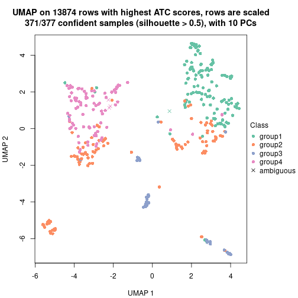</p>

</div>
</div>


Following heatmap shows how subgroups are split when increasing `k`:

```r
collect_classes(res)
```


Test correlation between subgroups and known annotations. If the known
annotation is numeric, one-way ANOVA test is applied, and if the known
annotation is discrete, chi-squared contingency table test is applied.

```r
test_to_known_factors(res)
```

```
#>             n_sample cell.type(p-value) disease(p-value) k
#> ATC:skmeans      375           4.18e-17         0.000682 2
#> ATC:skmeans      319           1.26e-37         0.000474 3
#> ATC:skmeans      371           1.24e-89         0.000614 4
```


If matrix rows can be associated to genes, consider to use `functional_enrichment(res,
...)` to perform function enrichment for the signature genes. See [this vignette](https://jokergoo.github.io/cola_vignettes/functional_enrichment.html) for more detailed explanations.


 

---------------------------------------------------


### Node011


Parent node: [Node01](#Node01).
Child nodes: 
                [Node0111](#Node0111)
        ,
                [Node0112](#Node0112)
        ,
                [Node0113](#Node0113)
        ,
                Node0121-leaf
        ,
                [Node0122](#Node0122)
        ,
                [Node0123](#Node0123)
        ,
                Node0124-leaf
        ,
                Node0211-leaf
        ,
                Node0212-leaf
        ,
                Node0221-leaf
        ,
                Node0222-leaf
        ,
                Node0231-leaf
        ,
                Node0232-leaf
        ,
                Node0233-leaf
        .


The object with results only for a single top-value method and a single partitioning method 
can be extracted as:

```r
res = res_rh["011"]
```

A summary of `res` and all the functions that can be applied to it:

```r
res
```

```
#> A 'ConsensusPartition' object with k = 2, 3, 4.
#>   On a matrix with 13873 rows and 207 columns.
#>   Top rows (1387) are extracted by 'ATC' method.
#>   Subgroups are detected by 'skmeans' method.
#>   Performed in total 150 partitions by row resampling.
#>   Best k for subgroups seems to be 4.
#> 
#> Following methods can be applied to this 'ConsensusPartition' object:
#>  [1] "cola_report"             "collect_classes"         "collect_plots"          
#>  [4] "collect_stats"           "colnames"                "compare_partitions"     
#>  [7] "compare_signatures"      "consensus_heatmap"       "dimension_reduction"    
#> [10] "functional_enrichment"   "get_anno_col"            "get_anno"               
#> [13] "get_classes"             "get_consensus"           "get_matrix"             
#> [16] "get_membership"          "get_param"               "get_signatures"         
#> [19] "get_stats"               "is_best_k"               "is_stable_k"            
#> [22] "membership_heatmap"      "ncol"                    "nrow"                   
#> [25] "plot_ecdf"               "predict_classes"         "rownames"               
#> [28] "select_partition_number" "show"                    "suggest_best_k"         
#> [31] "test_to_known_factors"   "top_rows_heatmap"
```

`collect_plots()` function collects all the plots made from `res` for all `k` (number of subgroups)
into one single page to provide an easy and fast comparison between different `k`.

```r
collect_plots(res)
```

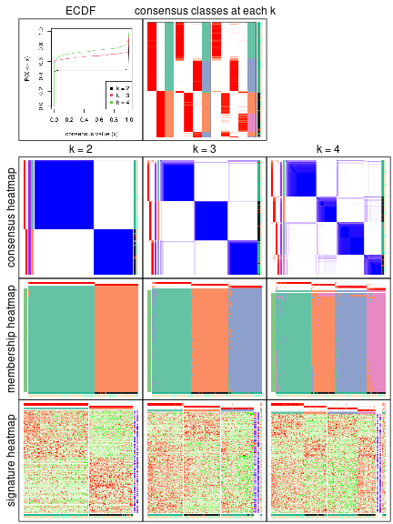

The plots are:

- The first row: a plot of the eCDF (empirical cumulative distribution
  function) curves of the consensus matrix for each `k` and the heatmap of
  predicted classes for each `k`.
- The second row: heatmaps of the consensus matrix for each `k`.
- The third row: heatmaps of the membership matrix for each `k`.
- The fouth row: heatmaps of the signatures for each `k`.

All the plots in panels can be made by individual functions and they are
plotted later in this section.

`select_partition_number()` produces several plots showing different
statistics for choosing "optimized" `k`. There are following statistics:

- eCDF curves of the consensus matrix for each `k`;
- 1-PAC. [The PAC score](https://en.wikipedia.org/wiki/Consensus_clustering#Over-interpretation_potential_of_consensus_clustering)
  measures the proportion of the ambiguous subgrouping.
- Mean silhouette score.
- Concordance. The mean probability of fiting the consensus subgroup labels in all
  partitions.
- Area increased. Denote $A_k$ as the area under the eCDF curve for current
  `k`, the area increased is defined as $A_k - A_{k-1}$.
- Rand index. The percent of pairs of samples that are both in a same cluster
  or both are not in a same cluster in the partition of k and k-1.
- Jaccard index. The ratio of pairs of samples are both in a same cluster in
  the partition of k and k-1 and the pairs of samples are both in a same
  cluster in the partition k or k-1.

The detailed explanations of these statistics can be found in [the _cola_
vignette](https://jokergoo.github.io/cola_vignettes/cola.html#toc_13).

Generally speaking, higher 1-PAC score, higher mean silhouette score or higher
concordance corresponds to better partition. Rand index and Jaccard index
measure how similar the current partition is compared to partition with `k-1`.
If they are too similar, we won't accept `k` is better than `k-1`.

```r
select_partition_number(res)
```


The numeric values for all these statistics can be obtained by `get_stats()`.

```r
get_stats(res)
```

```
#>   k 1-PAC mean_silhouette concordance area_increased  Rand Jaccard
#> 2 2 1.000           0.999       0.999          0.483 0.517   0.517
#> 3 3 0.980           0.953       0.980          0.385 0.749   0.543
#> 4 4 0.916           0.899       0.950          0.105 0.868   0.635
```

`suggest_best_k()` suggests the best $k$ based on these statistics. The rules are as follows:

- All $k$ with Jaccard index larger than 0.95 are removed because increasing
  $k$ does not provide enough extra information. If all $k$ are removed, it is
  marked as no subgroup is detected.
- For all $k$ with 1-PAC score larger than 0.9, the maximal $k$ is taken as
  the best $k$, and other $k$ are marked as optional $k$.
- If it does not fit the second rule. The $k$ with the maximal vote of the
  highest 1-PAC score, highest mean silhouette, and highest concordance is
  taken as the best $k$.

```r
suggest_best_k(res)
```

```
#> [1] 4
#> attr(,"optional")
#> [1] 2 3
```

There is also optional best $k$ = 2 3 that is worth to check.

Following is the table of the partitions (You need to click the **show/hide
code output** link to see it). The membership matrix (columns with name `p*`)
is inferred by
[`clue::cl_consensus()`](https://www.rdocumentation.org/link/cl_consensus?package=clue)
function with the `SE` method. Basically the value in the membership matrix
represents the probability to belong to a certain group. The finall subgroup
label for an item is determined with the group with highest probability it
belongs to.

In `get_classes()` function, the entropy is calculated from the membership
matrix and the silhouette score is calculated from the consensus matrix.


<script>
$( function() {
	$( '#tabs-node-011-get-classes' ).tabs();
} );
</script>
<div id='tabs-node-011-get-classes'>
<ul>
<li><a href='#tab-node-011-get-classes-1'>k = 2</a></li>
<li><a href='#tab-node-011-get-classes-2'>k = 3</a></li>
<li><a href='#tab-node-011-get-classes-3'>k = 4</a></li>
</ul>

<div id='tab-node-011-get-classes-1'>
<p><a id='tab-node-011-get-classes-1-a' style='color:#0366d6' href='#'>show/hide code output</a></p>
<pre><code class="r">cbind(get_classes(res, k = 2), get_membership(res, k = 2))
</code></pre>

<pre><code>#&gt;               class entropy silhouette   p1   p2
#&gt; 10th_C13_S61      1   0.000      0.999 1.00 0.00
#&gt; 10th_C19_S62      2   0.000      1.000 0.00 1.00
#&gt; 10th_C81_S70      1   0.000      0.999 1.00 0.00
#&gt; 10th_C84_S115     1   0.000      0.999 1.00 0.00
#&gt; 11th-C41_S60      1   0.000      0.999 1.00 0.00
#&gt; 11th-C44_S15      1   0.000      0.999 1.00 0.00
#&gt; 11th-C49_S23      1   0.000      0.999 1.00 0.00
#&gt; 11th-C51_S39      1   0.000      0.999 1.00 0.00
#&gt; 11th-C53_S78      1   0.000      0.999 1.00 0.00
#&gt; 11th-C66_S88      1   0.000      0.999 1.00 0.00
#&gt; 11th-C7_S16       2   0.000      1.000 0.00 1.00
#&gt; 12th-C14_S190     1   0.000      0.999 1.00 0.00
#&gt; 12th-C24_S141     1   0.000      0.999 1.00 0.00
#&gt; 12th-C29_S150     2   0.000      1.000 0.00 1.00
#&gt; 12th-C42_S159     1   0.000      0.999 1.00 0.00
#&gt; 12th-C55_S203     1   0.000      0.999 1.00 0.00
#&gt; 12th-C58_S162     2   0.000      1.000 0.00 1.00
#&gt; 12th-C59_S169     1   0.000      0.999 1.00 0.00
#&gt; 12th-C60_S176     1   0.000      0.999 1.00 0.00
#&gt; 12th-C64_S163     1   0.000      0.999 1.00 0.00
#&gt; 12th-C65_S170     1   0.000      0.999 1.00 0.00
#&gt; 12th-C74_S214     1   0.000      0.999 1.00 0.00
#&gt; 12th-C76_S177     1   0.000      0.999 1.00 0.00
#&gt; 12th-C7_S196      1   0.000      0.999 1.00 0.00
#&gt; 12th-C84_S165     1   0.000      0.999 1.00 0.00
#&gt; 12th-C90_S166     1   0.000      0.999 1.00 0.00
#&gt; 12th-C95_S174     2   0.000      1.000 0.00 1.00
#&gt; 12th-C96_S167     1   0.000      0.999 1.00 0.00
#&gt; 13th_C34_S181     1   0.000      0.999 1.00 0.00
#&gt; 13th_C66_S214     2   0.000      1.000 0.00 1.00
#&gt; 13th_C76_S216     2   0.000      1.000 0.00 1.00
#&gt; 1st-61_S27        1   0.000      0.999 1.00 0.00
#&gt; 1st-C11_S58       1   0.000      0.999 1.00 0.00
#&gt; 1st-C19_S20       2   0.000      1.000 0.00 1.00
#&gt; 1st-C32_S14       1   0.000      0.999 1.00 0.00
#&gt; 1st-C42_S71       2   0.000      1.000 0.00 1.00
#&gt; 1st-C50_S33       2   0.000      1.000 0.00 1.00
#&gt; 1st-C56_S34       2   0.000      1.000 0.00 1.00
#&gt; 1st-C57_S42       2   0.000      1.000 0.00 1.00
#&gt; 1st-C58_S76       1   0.000      0.999 1.00 0.00
#&gt; 1st-C64_S79       1   0.000      0.999 1.00 0.00
#&gt; 1st-C68_S36       2   0.000      1.000 0.00 1.00
#&gt; 1st-C73_S45       2   0.000      1.000 0.00 1.00
#&gt; 1st-C75_S29       2   0.000      1.000 0.00 1.00
#&gt; 1st-C77_S86       2   0.000      1.000 0.00 1.00
#&gt; 1st-C78_S85       2   0.000      1.000 0.00 1.00
#&gt; 1st-C80_S38       2   0.000      1.000 0.00 1.00
#&gt; 1st-C90_S91       1   0.000      0.999 1.00 0.00
#&gt; 2nd-C11_S20       2   0.000      1.000 0.00 1.00
#&gt; 2nd-C15_S25       1   0.000      0.999 1.00 0.00
#&gt; 2nd-C16_S33       2   0.000      1.000 0.00 1.00
#&gt; 2nd-C17_S32       1   0.000      0.999 1.00 0.00
#&gt; 2nd-C21_S37       1   0.000      0.999 1.00 0.00
#&gt; 2nd-C26_S50       2   0.000      1.000 0.00 1.00
#&gt; 2nd-C32_S62       1   0.000      0.999 1.00 0.00
#&gt; 2nd-C38_S74       1   0.000      0.999 1.00 0.00
#&gt; 2nd-C39_S75       2   0.000      1.000 0.00 1.00
#&gt; 2nd-C62_S29       1   0.000      0.999 1.00 0.00
#&gt; 2nd-C67_S40       2   0.000      1.000 0.00 1.00
#&gt; 2nd-C72_S48       1   0.000      0.999 1.00 0.00
#&gt; 2nd-C75_S52       2   0.000      1.000 0.00 1.00
#&gt; 2nd-C77_S59       2   0.000      1.000 0.00 1.00
#&gt; 2nd-C80_S65       2   0.000      1.000 0.00 1.00
#&gt; 2nd-C86_S77       1   0.000      0.999 1.00 0.00
#&gt; 2nd-C88_S84       1   0.000      0.999 1.00 0.00
#&gt; 2nd-C8_S14        2   0.000      1.000 0.00 1.00
#&gt; 2nd-C93_S88       1   0.000      0.999 1.00 0.00
#&gt; 2nd-C95_S95       1   0.000      0.999 1.00 0.00
#&gt; 3rd-C11_S58       1   0.000      0.999 1.00 0.00
#&gt; 3rd-C12_S68       2   0.000      1.000 0.00 1.00
#&gt; 3rd-C27_S49       2   0.000      1.000 0.00 1.00
#&gt; 3rd-C33_S50       1   0.000      0.999 1.00 0.00
#&gt; 3rd-C35_S23       2   0.000      1.000 0.00 1.00
#&gt; 3rd-C36_S2        1   0.000      0.999 1.00 0.00
#&gt; 3rd-C47_S35       2   0.000      1.000 0.00 1.00
#&gt; 3rd-C49_S60       2   0.000      1.000 0.00 1.00
#&gt; 3rd-C4_S25        1   0.000      0.999 1.00 0.00
#&gt; 3rd-C53_S67       2   0.000      1.000 0.00 1.00
#&gt; 3rd-C57_S5        2   0.000      1.000 0.00 1.00
#&gt; 3rd-C58_S3        1   0.000      0.999 1.00 0.00
#&gt; 3rd-C59_S91       1   0.000      0.999 1.00 0.00
#&gt; 3rd-C65_S20       1   0.000      0.999 1.00 0.00
#&gt; 3rd-C6_S44        2   0.141      0.980 0.02 0.98
#&gt; 3rd-C71_S80       1   0.000      0.999 1.00 0.00
#&gt; 3rd-C79_S67       2   0.000      1.000 0.00 1.00
#&gt; 3rd-C82_S11       1   0.000      0.999 1.00 0.00
#&gt; 3rd-C84_S75       1   0.000      0.999 1.00 0.00
#&gt; 3rd-C85_S79       2   0.000      1.000 0.00 1.00
#&gt; 3rd-C88_S24       1   0.000      0.999 1.00 0.00
#&gt; 3rd-C91_S91       2   0.000      1.000 0.00 1.00
#&gt; 3rd-C92_S86       1   0.000      0.999 1.00 0.00
#&gt; 3rd-C95_S81       2   0.000      1.000 0.00 1.00
#&gt; 3rd-C9_S5         2   0.000      1.000 0.00 1.00
#&gt; 4th-61_S28        1   0.000      0.999 1.00 0.00
#&gt; 4th-C14_S26       1   0.000      0.999 1.00 0.00
#&gt; 4th-C18_S31       2   0.000      1.000 0.00 1.00
#&gt; 4th-C24_S43       1   0.242      0.959 0.96 0.04
#&gt; 4th-C26_S50       1   0.000      0.999 1.00 0.00
#&gt; 4th-C36_S69       2   0.000      1.000 0.00 1.00
#&gt; 4th-C40_S79       2   0.000      1.000 0.00 1.00
#&gt; 4th-C4_S9         2   0.000      1.000 0.00 1.00
#&gt; 4th-C56_S17       2   0.000      1.000 0.00 1.00
#&gt; 4th-C5_S8         1   0.000      0.999 1.00 0.00
#&gt; 4th-C62_S29       2   0.000      1.000 0.00 1.00
#&gt; 4th-C64_S34       2   0.000      1.000 0.00 1.00
#&gt; 4th-C66_S36       2   0.000      1.000 0.00 1.00
#&gt; 4th-C67_S40       1   0.000      0.999 1.00 0.00
#&gt; 4th-C73_S54       2   0.000      1.000 0.00 1.00
#&gt; 4th-C75_S52       2   0.000      1.000 0.00 1.00
#&gt; 4th-C79_S66       2   0.000      1.000 0.00 1.00
#&gt; 4th-C7_S15        1   0.000      0.999 1.00 0.00
#&gt; 4th-C80_S65       2   0.000      1.000 0.00 1.00
#&gt; 4th-C82_S72       2   0.000      1.000 0.00 1.00
#&gt; 4th-C83_S71       2   0.000      1.000 0.00 1.00
#&gt; 4th-C85_S78       2   0.000      1.000 0.00 1.00
#&gt; 4th-C86_S77       2   0.000      1.000 0.00 1.00
#&gt; 4th-C88_S84       2   0.000      1.000 0.00 1.00
#&gt; 4th-C89_S83       1   0.000      0.999 1.00 0.00
#&gt; 4th-C92_S89       2   0.000      1.000 0.00 1.00
#&gt; 4th-C94_S96       2   0.000      1.000 0.00 1.00
#&gt; 4th-C96_S94       2   0.000      1.000 0.00 1.00
#&gt; 5th-C34_S108      2   0.000      1.000 0.00 1.00
#&gt; 5th-C35_S109      2   0.000      1.000 0.00 1.00
#&gt; 5th-C49_S89       1   0.000      0.999 1.00 0.00
#&gt; 5th-C5_S85        1   0.000      0.999 1.00 0.00
#&gt; 5th-C7_S93        2   0.000      1.000 0.00 1.00
#&gt; 5th-C90_S115      1   0.000      0.999 1.00 0.00
#&gt; 5th-C9_S92        2   0.000      1.000 0.00 1.00
#&gt; 6th-C12_S18       1   0.000      0.999 1.00 0.00
#&gt; 6th-C20_S34       1   0.000      0.999 1.00 0.00
#&gt; 6th-C21_S33       2   0.000      1.000 0.00 1.00
#&gt; 6th-C22_S39       1   0.000      0.999 1.00 0.00
#&gt; 6th-C23_S38       1   0.000      0.999 1.00 0.00
#&gt; 6th-C24_S37       1   0.327      0.937 0.94 0.06
#&gt; 6th-C29_S50       1   0.000      0.999 1.00 0.00
#&gt; 6th-C2_S2         1   0.000      0.999 1.00 0.00
#&gt; 6th-C30_S51       1   0.000      0.999 1.00 0.00
#&gt; 6th-C40_S73       1   0.000      0.999 1.00 0.00
#&gt; 6th-C42_S75       1   0.000      0.999 1.00 0.00
#&gt; 6th-C51_S6        1   0.000      0.999 1.00 0.00
#&gt; 6th-C54_S11       1   0.000      0.999 1.00 0.00
#&gt; 6th-C59_S21       1   0.000      0.999 1.00 0.00
#&gt; 6th-C63_S26       1   0.141      0.979 0.98 0.02
#&gt; 6th-C66_S32       1   0.000      0.999 1.00 0.00
#&gt; 6th-C71_S41       1   0.000      0.999 1.00 0.00
#&gt; 6th-C73_S48       1   0.000      0.999 1.00 0.00
#&gt; 6th-C75_S46       1   0.000      0.999 1.00 0.00
#&gt; 6th-C77_S53       1   0.000      0.999 1.00 0.00
#&gt; 6th-C79_S60       1   0.000      0.999 1.00 0.00
#&gt; 6th-C80_S59       1   0.000      0.999 1.00 0.00
#&gt; 6th-C85_S72       1   0.000      0.999 1.00 0.00
#&gt; 6th-C87_S70       2   0.000      1.000 0.00 1.00
#&gt; 7th-C10_S19       1   0.000      0.999 1.00 0.00
#&gt; 7th-C11_S18       2   0.000      1.000 0.00 1.00
#&gt; 7th-C14_S24       2   0.000      1.000 0.00 1.00
#&gt; 7th-C24_S40       2   0.000      1.000 0.00 1.00
#&gt; 7th-C25_S43       1   0.000      0.999 1.00 0.00
#&gt; 7th-C31_S53       1   0.000      0.999 1.00 0.00
#&gt; 7th-C36_S61       2   0.000      1.000 0.00 1.00
#&gt; 7th-C45_S77       1   0.000      0.999 1.00 0.00
#&gt; 7th-C50_S5        1   0.000      0.999 1.00 0.00
#&gt; 7th-C53_S10       1   0.000      0.999 1.00 0.00
#&gt; 7th-C58_S20       2   0.000      1.000 0.00 1.00
#&gt; 7th-C59_S21       1   0.000      0.999 1.00 0.00
#&gt; 7th-C62_S27       1   0.000      0.999 1.00 0.00
#&gt; 7th-C64_S31       1   0.000      0.999 1.00 0.00
#&gt; 7th-C66_S33       1   0.000      0.999 1.00 0.00
#&gt; 7th-C73_S47       1   0.000      0.999 1.00 0.00
#&gt; 7th-C77_S51       1   0.000      0.999 1.00 0.00
#&gt; 7th-C79_S58       2   0.000      1.000 0.00 1.00
#&gt; 7th-C80_S57       1   0.000      0.999 1.00 0.00
#&gt; 7th-C82_S64       2   0.000      1.000 0.00 1.00
#&gt; 7th-C84_S62       1   0.000      0.999 1.00 0.00
#&gt; 7th-C89_S74       1   0.000      0.999 1.00 0.00
#&gt; 7th-C8_S13        1   0.000      0.999 1.00 0.00
#&gt; 7th-C90_S73       1   0.000      0.999 1.00 0.00
#&gt; 7th-C96_S82       1   0.000      0.999 1.00 0.00
#&gt; 8th-C10_S100      1   0.000      0.999 1.00 0.00
#&gt; 8th-C24_S120      1   0.000      0.999 1.00 0.00
#&gt; 8th-C2_S85        1   0.000      0.999 1.00 0.00
#&gt; 8th-C44_S155      1   0.000      0.999 1.00 0.00
#&gt; 8th-C55_S96       2   0.000      1.000 0.00 1.00
#&gt; 8th-C57_S98       2   0.000      1.000 0.00 1.00
#&gt; 8th-C58_S101      2   0.000      1.000 0.00 1.00
#&gt; 8th-C65_S113      1   0.000      0.999 1.00 0.00
#&gt; 8th-C67_S117      2   0.000      1.000 0.00 1.00
#&gt; 8th-C74_S129      2   0.000      1.000 0.00 1.00
#&gt; 8th-C85_S150      2   0.000      1.000 0.00 1.00
#&gt; 8th-C87_S148      1   0.000      0.999 1.00 0.00
#&gt; 9th-C10_S18       1   0.000      0.999 1.00 0.00
#&gt; 9th-C11_S17       1   0.000      0.999 1.00 0.00
#&gt; 9th-C1_S3         1   0.000      0.999 1.00 0.00
#&gt; 9th-C38_S64       1   0.000      0.999 1.00 0.00
#&gt; 9th-C3_S1         1   0.000      0.999 1.00 0.00
#&gt; 9th-C41_S70       1   0.000      0.999 1.00 0.00
#&gt; 9th-C46_S79       1   0.000      0.999 1.00 0.00
#&gt; 9th-C57_S16       2   0.000      1.000 0.00 1.00
#&gt; 9th-C6_S7         1   0.000      0.999 1.00 0.00
#&gt; 9th-C70_S42       1   0.000      0.999 1.00 0.00
#&gt; 9th-C80_S56       2   0.000      1.000 0.00 1.00
#&gt; 9th-C81_S55       1   0.000      0.999 1.00 0.00
#&gt; 9th-C83_S61       2   0.000      1.000 0.00 1.00
#&gt; 9th-C86_S67       1   0.000      0.999 1.00 0.00
#&gt; 9th-C89_S72       1   0.000      0.999 1.00 0.00
#&gt; 9th-C8_S14        1   0.000      0.999 1.00 0.00
#&gt; 9th-C93_S76       1   0.000      0.999 1.00 0.00
#&gt; 9th-C9_S13        2   0.000      1.000 0.00 1.00
</code></pre>

<script>
$('#tab-node-011-get-classes-1-a').parent().next().next().hide();
$('#tab-node-011-get-classes-1-a').click(function(){
  $('#tab-node-011-get-classes-1-a').parent().next().next().toggle();
  return(false);
});
</script>
</div>

<div id='tab-node-011-get-classes-2'>
<p><a id='tab-node-011-get-classes-2-a' style='color:#0366d6' href='#'>show/hide code output</a></p>
<pre><code class="r">cbind(get_classes(res, k = 3), get_membership(res, k = 3))
</code></pre>

<pre><code>#&gt;               class entropy silhouette   p1   p2   p3
#&gt; 10th_C13_S61      1  0.0000     0.9658 1.00 0.00 0.00
#&gt; 10th_C19_S62      3  0.0000     0.9814 0.00 0.00 1.00
#&gt; 10th_C81_S70      3  0.0000     0.9814 0.00 0.00 1.00
#&gt; 10th_C84_S115     3  0.0000     0.9814 0.00 0.00 1.00
#&gt; 11th-C41_S60      3  0.0000     0.9814 0.00 0.00 1.00
#&gt; 11th-C44_S15      3  0.0000     0.9814 0.00 0.00 1.00
#&gt; 11th-C49_S23      3  0.0000     0.9814 0.00 0.00 1.00
#&gt; 11th-C51_S39      3  0.0000     0.9814 0.00 0.00 1.00
#&gt; 11th-C53_S78      3  0.0000     0.9814 0.00 0.00 1.00
#&gt; 11th-C66_S88      1  0.0000     0.9658 1.00 0.00 0.00
#&gt; 11th-C7_S16       3  0.3340     0.8575 0.00 0.12 0.88
#&gt; 12th-C14_S190     3  0.0000     0.9814 0.00 0.00 1.00
#&gt; 12th-C24_S141     3  0.0000     0.9814 0.00 0.00 1.00
#&gt; 12th-C29_S150     2  0.0000     0.9921 0.00 1.00 0.00
#&gt; 12th-C42_S159     3  0.0000     0.9814 0.00 0.00 1.00
#&gt; 12th-C55_S203     3  0.0000     0.9814 0.00 0.00 1.00
#&gt; 12th-C58_S162     2  0.0000     0.9921 0.00 1.00 0.00
#&gt; 12th-C59_S169     1  0.0000     0.9658 1.00 0.00 0.00
#&gt; 12th-C60_S176     1  0.4002     0.8021 0.84 0.00 0.16
#&gt; 12th-C64_S163     1  0.0000     0.9658 1.00 0.00 0.00
#&gt; 12th-C65_S170     3  0.0000     0.9814 0.00 0.00 1.00
#&gt; 12th-C74_S214     1  0.0000     0.9658 1.00 0.00 0.00
#&gt; 12th-C76_S177     1  0.0000     0.9658 1.00 0.00 0.00
#&gt; 12th-C7_S196      3  0.0000     0.9814 0.00 0.00 1.00
#&gt; 12th-C84_S165     1  0.0000     0.9658 1.00 0.00 0.00
#&gt; 12th-C90_S166     3  0.0000     0.9814 0.00 0.00 1.00
#&gt; 12th-C95_S174     2  0.0000     0.9921 0.00 1.00 0.00
#&gt; 12th-C96_S167     1  0.0000     0.9658 1.00 0.00 0.00
#&gt; 13th_C34_S181     3  0.0000     0.9814 0.00 0.00 1.00
#&gt; 13th_C66_S214     2  0.0000     0.9921 0.00 1.00 0.00
#&gt; 13th_C76_S216     2  0.0000     0.9921 0.00 1.00 0.00
#&gt; 1st-61_S27        1  0.0000     0.9658 1.00 0.00 0.00
#&gt; 1st-C11_S58       1  0.0000     0.9658 1.00 0.00 0.00
#&gt; 1st-C19_S20       2  0.0000     0.9921 0.00 1.00 0.00
#&gt; 1st-C32_S14       3  0.0000     0.9814 0.00 0.00 1.00
#&gt; 1st-C42_S71       3  0.5216     0.6511 0.00 0.26 0.74
#&gt; 1st-C50_S33       2  0.0000     0.9921 0.00 1.00 0.00
#&gt; 1st-C56_S34       2  0.0000     0.9921 0.00 1.00 0.00
#&gt; 1st-C57_S42       2  0.0000     0.9921 0.00 1.00 0.00
#&gt; 1st-C58_S76       1  0.0000     0.9658 1.00 0.00 0.00
#&gt; 1st-C64_S79       1  0.0000     0.9658 1.00 0.00 0.00
#&gt; 1st-C68_S36       2  0.0000     0.9921 0.00 1.00 0.00
#&gt; 1st-C73_S45       2  0.0000     0.9921 0.00 1.00 0.00
#&gt; 1st-C75_S29       2  0.0000     0.9921 0.00 1.00 0.00
#&gt; 1st-C77_S86       3  0.1529     0.9450 0.00 0.04 0.96
#&gt; 1st-C78_S85       2  0.0000     0.9921 0.00 1.00 0.00
#&gt; 1st-C80_S38       2  0.0000     0.9921 0.00 1.00 0.00
#&gt; 1st-C90_S91       1  0.0000     0.9658 1.00 0.00 0.00
#&gt; 2nd-C11_S20       2  0.0000     0.9921 0.00 1.00 0.00
#&gt; 2nd-C15_S25       1  0.0000     0.9658 1.00 0.00 0.00
#&gt; 2nd-C16_S33       2  0.0000     0.9921 0.00 1.00 0.00
#&gt; 2nd-C17_S32       1  0.0000     0.9658 1.00 0.00 0.00
#&gt; 2nd-C21_S37       3  0.0000     0.9814 0.00 0.00 1.00
#&gt; 2nd-C26_S50       2  0.0000     0.9921 0.00 1.00 0.00
#&gt; 2nd-C32_S62       1  0.0000     0.9658 1.00 0.00 0.00
#&gt; 2nd-C38_S74       1  0.0000     0.9658 1.00 0.00 0.00
#&gt; 2nd-C39_S75       2  0.0000     0.9921 0.00 1.00 0.00
#&gt; 2nd-C62_S29       1  0.0000     0.9658 1.00 0.00 0.00
#&gt; 2nd-C67_S40       2  0.0000     0.9921 0.00 1.00 0.00
#&gt; 2nd-C72_S48       1  0.5397     0.6201 0.72 0.00 0.28
#&gt; 2nd-C75_S52       2  0.0000     0.9921 0.00 1.00 0.00
#&gt; 2nd-C77_S59       2  0.0000     0.9921 0.00 1.00 0.00
#&gt; 2nd-C80_S65       2  0.0000     0.9921 0.00 1.00 0.00
#&gt; 2nd-C86_S77       3  0.0000     0.9814 0.00 0.00 1.00
#&gt; 2nd-C88_S84       1  0.6309     0.0335 0.50 0.00 0.50
#&gt; 2nd-C8_S14        2  0.0000     0.9921 0.00 1.00 0.00
#&gt; 2nd-C93_S88       1  0.0892     0.9489 0.98 0.00 0.02
#&gt; 2nd-C95_S95       3  0.0000     0.9814 0.00 0.00 1.00
#&gt; 3rd-C11_S58       1  0.0000     0.9658 1.00 0.00 0.00
#&gt; 3rd-C12_S68       2  0.0000     0.9921 0.00 1.00 0.00
#&gt; 3rd-C27_S49       2  0.0000     0.9921 0.00 1.00 0.00
#&gt; 3rd-C33_S50       1  0.0000     0.9658 1.00 0.00 0.00
#&gt; 3rd-C35_S23       3  0.0000     0.9814 0.00 0.00 1.00
#&gt; 3rd-C36_S2        1  0.0000     0.9658 1.00 0.00 0.00
#&gt; 3rd-C47_S35       2  0.0000     0.9921 0.00 1.00 0.00
#&gt; 3rd-C49_S60       2  0.0000     0.9921 0.00 1.00 0.00
#&gt; 3rd-C4_S25        1  0.0000     0.9658 1.00 0.00 0.00
#&gt; 3rd-C53_S67       1  0.6045     0.3862 0.62 0.38 0.00
#&gt; 3rd-C57_S5        2  0.0000     0.9921 0.00 1.00 0.00
#&gt; 3rd-C58_S3        1  0.0000     0.9658 1.00 0.00 0.00
#&gt; 3rd-C59_S91       1  0.0000     0.9658 1.00 0.00 0.00
#&gt; 3rd-C65_S20       3  0.0000     0.9814 0.00 0.00 1.00
#&gt; 3rd-C6_S44        3  0.0000     0.9814 0.00 0.00 1.00
#&gt; 3rd-C71_S80       1  0.0000     0.9658 1.00 0.00 0.00
#&gt; 3rd-C79_S67       2  0.0000     0.9921 0.00 1.00 0.00
#&gt; 3rd-C82_S11       1  0.0000     0.9658 1.00 0.00 0.00
#&gt; 3rd-C84_S75       1  0.0000     0.9658 1.00 0.00 0.00
#&gt; 3rd-C85_S79       2  0.0000     0.9921 0.00 1.00 0.00
#&gt; 3rd-C88_S24       1  0.0000     0.9658 1.00 0.00 0.00
#&gt; 3rd-C91_S91       2  0.0000     0.9921 0.00 1.00 0.00
#&gt; 3rd-C92_S86       1  0.4555     0.7500 0.80 0.00 0.20
#&gt; 3rd-C95_S81       2  0.0000     0.9921 0.00 1.00 0.00
#&gt; 3rd-C9_S5         3  0.0892     0.9637 0.00 0.02 0.98
#&gt; 4th-61_S28        1  0.0000     0.9658 1.00 0.00 0.00
#&gt; 4th-C14_S26       1  0.0000     0.9658 1.00 0.00 0.00
#&gt; 4th-C18_S31       2  0.0000     0.9921 0.00 1.00 0.00
#&gt; 4th-C24_S43       1  0.0000     0.9658 1.00 0.00 0.00
#&gt; 4th-C26_S50       1  0.0000     0.9658 1.00 0.00 0.00
#&gt; 4th-C36_S69       3  0.5560     0.5749 0.00 0.30 0.70
#&gt; 4th-C40_S79       2  0.0000     0.9921 0.00 1.00 0.00
#&gt; 4th-C4_S9         2  0.0000     0.9921 0.00 1.00 0.00
#&gt; 4th-C56_S17       2  0.3340     0.8620 0.00 0.88 0.12
#&gt; 4th-C5_S8         1  0.0000     0.9658 1.00 0.00 0.00
#&gt; 4th-C62_S29       2  0.0000     0.9921 0.00 1.00 0.00
#&gt; 4th-C64_S34       2  0.0000     0.9921 0.00 1.00 0.00
#&gt; 4th-C66_S36       2  0.0000     0.9921 0.00 1.00 0.00
#&gt; 4th-C67_S40       3  0.0000     0.9814 0.00 0.00 1.00
#&gt; 4th-C73_S54       2  0.0000     0.9921 0.00 1.00 0.00
#&gt; 4th-C75_S52       2  0.0000     0.9921 0.00 1.00 0.00
#&gt; 4th-C79_S66       2  0.0000     0.9921 0.00 1.00 0.00
#&gt; 4th-C7_S15        1  0.0000     0.9658 1.00 0.00 0.00
#&gt; 4th-C80_S65       2  0.0000     0.9921 0.00 1.00 0.00
#&gt; 4th-C82_S72       2  0.0000     0.9921 0.00 1.00 0.00
#&gt; 4th-C83_S71       2  0.0000     0.9921 0.00 1.00 0.00
#&gt; 4th-C85_S78       1  0.0000     0.9658 1.00 0.00 0.00
#&gt; 4th-C86_S77       2  0.0000     0.9921 0.00 1.00 0.00
#&gt; 4th-C88_S84       2  0.0000     0.9921 0.00 1.00 0.00
#&gt; 4th-C89_S83       1  0.0000     0.9658 1.00 0.00 0.00
#&gt; 4th-C92_S89       2  0.0000     0.9921 0.00 1.00 0.00
#&gt; 4th-C94_S96       2  0.4002     0.8092 0.00 0.84 0.16
#&gt; 4th-C96_S94       2  0.0000     0.9921 0.00 1.00 0.00
#&gt; 5th-C34_S108      2  0.0000     0.9921 0.00 1.00 0.00
#&gt; 5th-C35_S109      3  0.0000     0.9814 0.00 0.00 1.00
#&gt; 5th-C49_S89       1  0.0000     0.9658 1.00 0.00 0.00
#&gt; 5th-C5_S85        1  0.0000     0.9658 1.00 0.00 0.00
#&gt; 5th-C7_S93        1  0.0000     0.9658 1.00 0.00 0.00
#&gt; 5th-C90_S115      3  0.0000     0.9814 0.00 0.00 1.00
#&gt; 5th-C9_S92        2  0.0000     0.9921 0.00 1.00 0.00
#&gt; 6th-C12_S18       1  0.0000     0.9658 1.00 0.00 0.00
#&gt; 6th-C20_S34       3  0.0000     0.9814 0.00 0.00 1.00
#&gt; 6th-C21_S33       2  0.0000     0.9921 0.00 1.00 0.00
#&gt; 6th-C22_S39       3  0.0000     0.9814 0.00 0.00 1.00
#&gt; 6th-C23_S38       1  0.0000     0.9658 1.00 0.00 0.00
#&gt; 6th-C24_S37       3  0.0000     0.9814 0.00 0.00 1.00
#&gt; 6th-C29_S50       1  0.0000     0.9658 1.00 0.00 0.00
#&gt; 6th-C2_S2         3  0.0000     0.9814 0.00 0.00 1.00
#&gt; 6th-C30_S51       3  0.0000     0.9814 0.00 0.00 1.00
#&gt; 6th-C40_S73       3  0.0000     0.9814 0.00 0.00 1.00
#&gt; 6th-C42_S75       3  0.0000     0.9814 0.00 0.00 1.00
#&gt; 6th-C51_S6        3  0.0000     0.9814 0.00 0.00 1.00
#&gt; 6th-C54_S11       1  0.0000     0.9658 1.00 0.00 0.00
#&gt; 6th-C59_S21       1  0.0000     0.9658 1.00 0.00 0.00
#&gt; 6th-C63_S26       1  0.0000     0.9658 1.00 0.00 0.00
#&gt; 6th-C66_S32       3  0.0000     0.9814 0.00 0.00 1.00
#&gt; 6th-C71_S41       1  0.0000     0.9658 1.00 0.00 0.00
#&gt; 6th-C73_S48       3  0.0000     0.9814 0.00 0.00 1.00
#&gt; 6th-C75_S46       3  0.0000     0.9814 0.00 0.00 1.00
#&gt; 6th-C77_S53       1  0.0000     0.9658 1.00 0.00 0.00
#&gt; 6th-C79_S60       1  0.6192     0.3043 0.58 0.00 0.42
#&gt; 6th-C80_S59       3  0.0000     0.9814 0.00 0.00 1.00
#&gt; 6th-C85_S72       1  0.0000     0.9658 1.00 0.00 0.00
#&gt; 6th-C87_S70       2  0.0000     0.9921 0.00 1.00 0.00
#&gt; 7th-C10_S19       3  0.0000     0.9814 0.00 0.00 1.00
#&gt; 7th-C11_S18       2  0.0000     0.9921 0.00 1.00 0.00
#&gt; 7th-C14_S24       2  0.0000     0.9921 0.00 1.00 0.00
#&gt; 7th-C24_S40       2  0.0000     0.9921 0.00 1.00 0.00
#&gt; 7th-C25_S43       1  0.0000     0.9658 1.00 0.00 0.00
#&gt; 7th-C31_S53       3  0.0000     0.9814 0.00 0.00 1.00
#&gt; 7th-C36_S61       2  0.0000     0.9921 0.00 1.00 0.00
#&gt; 7th-C45_S77       1  0.0000     0.9658 1.00 0.00 0.00
#&gt; 7th-C50_S5        3  0.2537     0.8986 0.08 0.00 0.92
#&gt; 7th-C53_S10       1  0.0000     0.9658 1.00 0.00 0.00
#&gt; 7th-C58_S20       2  0.0000     0.9921 0.00 1.00 0.00
#&gt; 7th-C59_S21       1  0.0000     0.9658 1.00 0.00 0.00
#&gt; 7th-C62_S27       1  0.0000     0.9658 1.00 0.00 0.00
#&gt; 7th-C64_S31       1  0.0000     0.9658 1.00 0.00 0.00
#&gt; 7th-C66_S33       3  0.0000     0.9814 0.00 0.00 1.00
#&gt; 7th-C73_S47       3  0.0000     0.9814 0.00 0.00 1.00
#&gt; 7th-C77_S51       1  0.0000     0.9658 1.00 0.00 0.00
#&gt; 7th-C79_S58       2  0.0000     0.9921 0.00 1.00 0.00
#&gt; 7th-C80_S57       3  0.0000     0.9814 0.00 0.00 1.00
#&gt; 7th-C82_S64       2  0.0000     0.9921 0.00 1.00 0.00
#&gt; 7th-C84_S62       1  0.0000     0.9658 1.00 0.00 0.00
#&gt; 7th-C89_S74       3  0.0000     0.9814 0.00 0.00 1.00
#&gt; 7th-C8_S13        1  0.0000     0.9658 1.00 0.00 0.00
#&gt; 7th-C90_S73       1  0.0000     0.9658 1.00 0.00 0.00
#&gt; 7th-C96_S82       1  0.0000     0.9658 1.00 0.00 0.00
#&gt; 8th-C10_S100      1  0.0000     0.9658 1.00 0.00 0.00
#&gt; 8th-C24_S120      1  0.6045     0.4162 0.62 0.00 0.38
#&gt; 8th-C2_S85        1  0.0000     0.9658 1.00 0.00 0.00
#&gt; 8th-C44_S155      3  0.0000     0.9814 0.00 0.00 1.00
#&gt; 8th-C55_S96       2  0.0000     0.9921 0.00 1.00 0.00
#&gt; 8th-C57_S98       2  0.0000     0.9921 0.00 1.00 0.00
#&gt; 8th-C58_S101      2  0.0000     0.9921 0.00 1.00 0.00
#&gt; 8th-C65_S113      1  0.0000     0.9658 1.00 0.00 0.00
#&gt; 8th-C67_S117      2  0.0000     0.9921 0.00 1.00 0.00
#&gt; 8th-C74_S129      2  0.0000     0.9921 0.00 1.00 0.00
#&gt; 8th-C85_S150      2  0.0000     0.9921 0.00 1.00 0.00
#&gt; 8th-C87_S148      1  0.2537     0.8934 0.92 0.00 0.08
#&gt; 9th-C10_S18       3  0.0000     0.9814 0.00 0.00 1.00
#&gt; 9th-C11_S17       3  0.0000     0.9814 0.00 0.00 1.00
#&gt; 9th-C1_S3         3  0.0000     0.9814 0.00 0.00 1.00
#&gt; 9th-C38_S64       3  0.0000     0.9814 0.00 0.00 1.00
#&gt; 9th-C3_S1         3  0.0000     0.9814 0.00 0.00 1.00
#&gt; 9th-C41_S70       1  0.0000     0.9658 1.00 0.00 0.00
#&gt; 9th-C46_S79       3  0.0000     0.9814 0.00 0.00 1.00
#&gt; 9th-C57_S16       2  0.5216     0.6464 0.00 0.74 0.26
#&gt; 9th-C6_S7         3  0.0000     0.9814 0.00 0.00 1.00
#&gt; 9th-C70_S42       1  0.0000     0.9658 1.00 0.00 0.00
#&gt; 9th-C80_S56       2  0.0000     0.9921 0.00 1.00 0.00
#&gt; 9th-C81_S55       3  0.0000     0.9814 0.00 0.00 1.00
#&gt; 9th-C83_S61       2  0.0000     0.9921 0.00 1.00 0.00
#&gt; 9th-C86_S67       3  0.5397     0.5948 0.28 0.00 0.72
#&gt; 9th-C89_S72       3  0.0000     0.9814 0.00 0.00 1.00
#&gt; 9th-C8_S14        3  0.0000     0.9814 0.00 0.00 1.00
#&gt; 9th-C93_S76       3  0.0000     0.9814 0.00 0.00 1.00
#&gt; 9th-C9_S13        2  0.0000     0.9921 0.00 1.00 0.00
</code></pre>

<script>
$('#tab-node-011-get-classes-2-a').parent().next().next().hide();
$('#tab-node-011-get-classes-2-a').click(function(){
  $('#tab-node-011-get-classes-2-a').parent().next().next().toggle();
  return(false);
});
</script>
</div>

<div id='tab-node-011-get-classes-3'>
<p><a id='tab-node-011-get-classes-3-a' style='color:#0366d6' href='#'>show/hide code output</a></p>
<pre><code class="r">cbind(get_classes(res, k = 4), get_membership(res, k = 4))
</code></pre>

<pre><code>#&gt;               class entropy silhouette   p1   p2   p3   p4
#&gt; 10th_C13_S61      1  0.3606    0.81238 0.84 0.00 0.14 0.02
#&gt; 10th_C19_S62      2  0.3610    0.71904 0.00 0.80 0.20 0.00
#&gt; 10th_C81_S70      3  0.0000    0.95924 0.00 0.00 1.00 0.00
#&gt; 10th_C84_S115     3  0.0707    0.95556 0.00 0.00 0.98 0.02
#&gt; 11th-C41_S60      3  0.0707    0.95556 0.00 0.00 0.98 0.02
#&gt; 11th-C44_S15      3  0.0000    0.95924 0.00 0.00 1.00 0.00
#&gt; 11th-C49_S23      3  0.0000    0.95924 0.00 0.00 1.00 0.00
#&gt; 11th-C51_S39      3  0.0000    0.95924 0.00 0.00 1.00 0.00
#&gt; 11th-C53_S78      3  0.0707    0.95556 0.00 0.00 0.98 0.02
#&gt; 11th-C66_S88      1  0.0707    0.94926 0.98 0.00 0.00 0.02
#&gt; 11th-C7_S16       2  0.1637    0.88750 0.00 0.94 0.06 0.00
#&gt; 12th-C14_S190     3  0.0707    0.95556 0.00 0.00 0.98 0.02
#&gt; 12th-C24_S141     3  0.0707    0.95556 0.00 0.00 0.98 0.02
#&gt; 12th-C29_S150     2  0.0707    0.94197 0.00 0.98 0.00 0.02
#&gt; 12th-C42_S159     3  0.0000    0.95924 0.00 0.00 1.00 0.00
#&gt; 12th-C55_S203     3  0.0000    0.95924 0.00 0.00 1.00 0.00
#&gt; 12th-C58_S162     4  0.2345    0.88717 0.00 0.10 0.00 0.90
#&gt; 12th-C59_S169     1  0.0707    0.94904 0.98 0.00 0.00 0.02
#&gt; 12th-C60_S176     1  0.5570    0.17317 0.54 0.00 0.44 0.02
#&gt; 12th-C64_S163     1  0.0000    0.95961 1.00 0.00 0.00 0.00
#&gt; 12th-C65_S170     3  0.0000    0.95924 0.00 0.00 1.00 0.00
#&gt; 12th-C74_S214     1  0.1211    0.94101 0.96 0.00 0.00 0.04
#&gt; 12th-C76_S177     1  0.0707    0.94912 0.98 0.02 0.00 0.00
#&gt; 12th-C7_S196      3  0.0707    0.95556 0.00 0.00 0.98 0.02
#&gt; 12th-C84_S165     1  0.1211    0.94101 0.96 0.00 0.00 0.04
#&gt; 12th-C90_S166     3  0.0707    0.95556 0.00 0.00 0.98 0.02
#&gt; 12th-C95_S174     4  0.0707    0.92359 0.00 0.02 0.00 0.98
#&gt; 12th-C96_S167     1  0.0707    0.94926 0.98 0.00 0.00 0.02
#&gt; 13th_C34_S181     3  0.0000    0.95924 0.00 0.00 1.00 0.00
#&gt; 13th_C66_S214     2  0.5000   -0.16329 0.00 0.50 0.00 0.50
#&gt; 13th_C76_S216     2  0.0707    0.94197 0.00 0.98 0.00 0.02
#&gt; 1st-61_S27        1  0.0000    0.95961 1.00 0.00 0.00 0.00
#&gt; 1st-C11_S58       1  0.0000    0.95961 1.00 0.00 0.00 0.00
#&gt; 1st-C19_S20       2  0.0707    0.94197 0.00 0.98 0.00 0.02
#&gt; 1st-C32_S14       3  0.0000    0.95924 0.00 0.00 1.00 0.00
#&gt; 1st-C42_S71       2  0.1913    0.90245 0.00 0.94 0.02 0.04
#&gt; 1st-C50_S33       2  0.0707    0.94197 0.00 0.98 0.00 0.02
#&gt; 1st-C56_S34       4  0.0707    0.92359 0.00 0.02 0.00 0.98
#&gt; 1st-C57_S42       2  0.0707    0.94197 0.00 0.98 0.00 0.02
#&gt; 1st-C58_S76       1  0.1211    0.93052 0.96 0.00 0.04 0.00
#&gt; 1st-C64_S79       1  0.0000    0.95961 1.00 0.00 0.00 0.00
#&gt; 1st-C68_S36       4  0.4624    0.58720 0.00 0.34 0.00 0.66
#&gt; 1st-C73_S45       2  0.0707    0.94197 0.00 0.98 0.00 0.02
#&gt; 1st-C75_S29       4  0.2647    0.87319 0.00 0.12 0.00 0.88
#&gt; 1st-C77_S86       2  0.0707    0.91979 0.00 0.98 0.02 0.00
#&gt; 1st-C78_S85       2  0.0707    0.94197 0.00 0.98 0.00 0.02
#&gt; 1st-C80_S38       4  0.2345    0.88717 0.00 0.10 0.00 0.90
#&gt; 1st-C90_S91       1  0.0000    0.95961 1.00 0.00 0.00 0.00
#&gt; 2nd-C11_S20       4  0.1211    0.91762 0.00 0.04 0.00 0.96
#&gt; 2nd-C15_S25       1  0.0000    0.95961 1.00 0.00 0.00 0.00
#&gt; 2nd-C16_S33       4  0.0707    0.92359 0.00 0.02 0.00 0.98
#&gt; 2nd-C17_S32       1  0.0000    0.95961 1.00 0.00 0.00 0.00
#&gt; 2nd-C21_S37       3  0.0707    0.94754 0.00 0.02 0.98 0.00
#&gt; 2nd-C26_S50       4  0.3801    0.77933 0.00 0.22 0.00 0.78
#&gt; 2nd-C32_S62       1  0.0000    0.95961 1.00 0.00 0.00 0.00
#&gt; 2nd-C38_S74       1  0.0000    0.95961 1.00 0.00 0.00 0.00
#&gt; 2nd-C39_S75       4  0.0707    0.92359 0.00 0.02 0.00 0.98
#&gt; 2nd-C62_S29       1  0.0000    0.95961 1.00 0.00 0.00 0.00
#&gt; 2nd-C67_S40       2  0.3172    0.79691 0.00 0.84 0.00 0.16
#&gt; 2nd-C72_S48       3  0.5271    0.47687 0.34 0.00 0.64 0.02
#&gt; 2nd-C75_S52       4  0.0707    0.92359 0.00 0.02 0.00 0.98
#&gt; 2nd-C77_S59       2  0.0707    0.94197 0.00 0.98 0.00 0.02
#&gt; 2nd-C80_S65       4  0.0707    0.92359 0.00 0.02 0.00 0.98
#&gt; 2nd-C86_S77       3  0.0000    0.95924 0.00 0.00 1.00 0.00
#&gt; 2nd-C88_S84       3  0.4624    0.50262 0.34 0.00 0.66 0.00
#&gt; 2nd-C8_S14        2  0.0707    0.94197 0.00 0.98 0.00 0.02
#&gt; 2nd-C93_S88       1  0.2921    0.82525 0.86 0.00 0.14 0.00
#&gt; 2nd-C95_S95       3  0.0000    0.95924 0.00 0.00 1.00 0.00
#&gt; 3rd-C11_S58       1  0.0000    0.95961 1.00 0.00 0.00 0.00
#&gt; 3rd-C12_S68       2  0.0707    0.94197 0.00 0.98 0.00 0.02
#&gt; 3rd-C27_S49       2  0.0707    0.94197 0.00 0.98 0.00 0.02
#&gt; 3rd-C33_S50       1  0.0000    0.95961 1.00 0.00 0.00 0.00
#&gt; 3rd-C35_S23       2  0.4406    0.57124 0.00 0.70 0.30 0.00
#&gt; 3rd-C36_S2        1  0.0000    0.95961 1.00 0.00 0.00 0.00
#&gt; 3rd-C47_S35       2  0.0707    0.94197 0.00 0.98 0.00 0.02
#&gt; 3rd-C49_S60       2  0.0707    0.94197 0.00 0.98 0.00 0.02
#&gt; 3rd-C4_S25        1  0.0000    0.95961 1.00 0.00 0.00 0.00
#&gt; 3rd-C53_S67       4  0.1211    0.88433 0.04 0.00 0.00 0.96
#&gt; 3rd-C57_S5        4  0.4134    0.72440 0.00 0.26 0.00 0.74
#&gt; 3rd-C58_S3        1  0.0000    0.95961 1.00 0.00 0.00 0.00
#&gt; 3rd-C59_S91       1  0.0000    0.95961 1.00 0.00 0.00 0.00
#&gt; 3rd-C65_S20       3  0.0000    0.95924 0.00 0.00 1.00 0.00
#&gt; 3rd-C6_S44        3  0.1211    0.93169 0.00 0.04 0.96 0.00
#&gt; 3rd-C71_S80       1  0.0000    0.95961 1.00 0.00 0.00 0.00
#&gt; 3rd-C79_S67       4  0.3801    0.77813 0.00 0.22 0.00 0.78
#&gt; 3rd-C82_S11       1  0.0000    0.95961 1.00 0.00 0.00 0.00
#&gt; 3rd-C84_S75       1  0.0000    0.95961 1.00 0.00 0.00 0.00
#&gt; 3rd-C85_S79       4  0.1637    0.90870 0.00 0.06 0.00 0.94
#&gt; 3rd-C88_S24       1  0.0000    0.95961 1.00 0.00 0.00 0.00
#&gt; 3rd-C91_S91       4  0.1211    0.91762 0.00 0.04 0.00 0.96
#&gt; 3rd-C92_S86       3  0.5000    0.00753 0.50 0.00 0.50 0.00
#&gt; 3rd-C95_S81       4  0.3610    0.80027 0.00 0.20 0.00 0.80
#&gt; 3rd-C9_S5         2  0.0707    0.91979 0.00 0.98 0.02 0.00
#&gt; 4th-61_S28        1  0.0000    0.95961 1.00 0.00 0.00 0.00
#&gt; 4th-C14_S26       1  0.1637    0.91154 0.94 0.00 0.06 0.00
#&gt; 4th-C18_S31       2  0.0707    0.94197 0.00 0.98 0.00 0.02
#&gt; 4th-C24_S43       1  0.2345    0.88088 0.90 0.00 0.00 0.10
#&gt; 4th-C26_S50       1  0.0000    0.95961 1.00 0.00 0.00 0.00
#&gt; 4th-C36_S69       2  0.0707    0.91979 0.00 0.98 0.02 0.00
#&gt; 4th-C40_S79       4  0.0707    0.92359 0.00 0.02 0.00 0.98
#&gt; 4th-C4_S9         2  0.0707    0.94197 0.00 0.98 0.00 0.02
#&gt; 4th-C56_S17       2  0.0707    0.91979 0.00 0.98 0.02 0.00
#&gt; 4th-C5_S8         1  0.1211    0.93596 0.96 0.00 0.00 0.04
#&gt; 4th-C62_S29       4  0.0707    0.92359 0.00 0.02 0.00 0.98
#&gt; 4th-C64_S34       4  0.0707    0.92359 0.00 0.02 0.00 0.98
#&gt; 4th-C66_S36       4  0.0707    0.92359 0.00 0.02 0.00 0.98
#&gt; 4th-C67_S40       3  0.0000    0.95924 0.00 0.00 1.00 0.00
#&gt; 4th-C73_S54       2  0.0707    0.94197 0.00 0.98 0.00 0.02
#&gt; 4th-C75_S52       2  0.0707    0.94197 0.00 0.98 0.00 0.02
#&gt; 4th-C79_S66       2  0.0707    0.94197 0.00 0.98 0.00 0.02
#&gt; 4th-C7_S15        1  0.0000    0.95961 1.00 0.00 0.00 0.00
#&gt; 4th-C80_S65       4  0.0707    0.92359 0.00 0.02 0.00 0.98
#&gt; 4th-C82_S72       4  0.0707    0.92359 0.00 0.02 0.00 0.98
#&gt; 4th-C83_S71       2  0.0707    0.94197 0.00 0.98 0.00 0.02
#&gt; 4th-C85_S78       4  0.2011    0.84794 0.08 0.00 0.00 0.92
#&gt; 4th-C86_S77       4  0.0707    0.92359 0.00 0.02 0.00 0.98
#&gt; 4th-C88_S84       4  0.0707    0.92359 0.00 0.02 0.00 0.98
#&gt; 4th-C89_S83       1  0.1637    0.91992 0.94 0.00 0.00 0.06
#&gt; 4th-C92_S89       4  0.0707    0.92359 0.00 0.02 0.00 0.98
#&gt; 4th-C94_S96       2  0.0707    0.91979 0.00 0.98 0.02 0.00
#&gt; 4th-C96_S94       2  0.2011    0.89153 0.00 0.92 0.00 0.08
#&gt; 5th-C34_S108      4  0.0707    0.92359 0.00 0.02 0.00 0.98
#&gt; 5th-C35_S109      2  0.2647    0.82182 0.00 0.88 0.12 0.00
#&gt; 5th-C49_S89       1  0.0000    0.95961 1.00 0.00 0.00 0.00
#&gt; 5th-C5_S85        1  0.0000    0.95961 1.00 0.00 0.00 0.00
#&gt; 5th-C7_S93        1  0.4977    0.19575 0.54 0.00 0.00 0.46
#&gt; 5th-C90_S115      3  0.0000    0.95924 0.00 0.00 1.00 0.00
#&gt; 5th-C9_S92        4  0.0707    0.92359 0.00 0.02 0.00 0.98
#&gt; 6th-C12_S18       1  0.0000    0.95961 1.00 0.00 0.00 0.00
#&gt; 6th-C20_S34       3  0.0707    0.95556 0.00 0.00 0.98 0.02
#&gt; 6th-C21_S33       2  0.0707    0.94197 0.00 0.98 0.00 0.02
#&gt; 6th-C22_S39       3  0.0000    0.95924 0.00 0.00 1.00 0.00
#&gt; 6th-C23_S38       1  0.0000    0.95961 1.00 0.00 0.00 0.00
#&gt; 6th-C24_S37       3  0.1211    0.93265 0.00 0.04 0.96 0.00
#&gt; 6th-C29_S50       1  0.0707    0.94926 0.98 0.00 0.00 0.02
#&gt; 6th-C2_S2         3  0.0000    0.95924 0.00 0.00 1.00 0.00
#&gt; 6th-C30_S51       3  0.0000    0.95924 0.00 0.00 1.00 0.00
#&gt; 6th-C40_S73       3  0.0707    0.95556 0.00 0.00 0.98 0.02
#&gt; 6th-C42_S75       3  0.0707    0.95556 0.00 0.00 0.98 0.02
#&gt; 6th-C51_S6        3  0.0000    0.95924 0.00 0.00 1.00 0.00
#&gt; 6th-C54_S11       1  0.0000    0.95961 1.00 0.00 0.00 0.00
#&gt; 6th-C59_S21       1  0.0000    0.95961 1.00 0.00 0.00 0.00
#&gt; 6th-C63_S26       1  0.1637    0.91874 0.94 0.00 0.00 0.06
#&gt; 6th-C66_S32       3  0.0707    0.95556 0.00 0.00 0.98 0.02
#&gt; 6th-C71_S41       1  0.0000    0.95961 1.00 0.00 0.00 0.00
#&gt; 6th-C73_S48       3  0.0000    0.95924 0.00 0.00 1.00 0.00
#&gt; 6th-C75_S46       3  0.0000    0.95924 0.00 0.00 1.00 0.00
#&gt; 6th-C77_S53       1  0.0000    0.95961 1.00 0.00 0.00 0.00
#&gt; 6th-C79_S60       3  0.4642    0.67533 0.24 0.00 0.74 0.02
#&gt; 6th-C80_S59       3  0.0707    0.95556 0.00 0.00 0.98 0.02
#&gt; 6th-C85_S72       1  0.0707    0.94904 0.98 0.00 0.00 0.02
#&gt; 6th-C87_S70       2  0.3400    0.76642 0.00 0.82 0.00 0.18
#&gt; 7th-C10_S19       3  0.0000    0.95924 0.00 0.00 1.00 0.00
#&gt; 7th-C11_S18       2  0.0707    0.94197 0.00 0.98 0.00 0.02
#&gt; 7th-C14_S24       4  0.1211    0.91762 0.00 0.04 0.00 0.96
#&gt; 7th-C24_S40       4  0.0707    0.92359 0.00 0.02 0.00 0.98
#&gt; 7th-C25_S43       1  0.0000    0.95961 1.00 0.00 0.00 0.00
#&gt; 7th-C31_S53       3  0.0000    0.95924 0.00 0.00 1.00 0.00
#&gt; 7th-C36_S61       2  0.0707    0.94197 0.00 0.98 0.00 0.02
#&gt; 7th-C45_S77       1  0.0000    0.95961 1.00 0.00 0.00 0.00
#&gt; 7th-C50_S5        3  0.1411    0.94230 0.02 0.00 0.96 0.02
#&gt; 7th-C53_S10       1  0.0000    0.95961 1.00 0.00 0.00 0.00
#&gt; 7th-C58_S20       4  0.0707    0.92359 0.00 0.02 0.00 0.98
#&gt; 7th-C59_S21       1  0.0000    0.95961 1.00 0.00 0.00 0.00
#&gt; 7th-C62_S27       1  0.0000    0.95961 1.00 0.00 0.00 0.00
#&gt; 7th-C64_S31       1  0.0000    0.95961 1.00 0.00 0.00 0.00
#&gt; 7th-C66_S33       3  0.0707    0.95556 0.00 0.00 0.98 0.02
#&gt; 7th-C73_S47       3  0.0000    0.95924 0.00 0.00 1.00 0.00
#&gt; 7th-C77_S51       1  0.0000    0.95961 1.00 0.00 0.00 0.00
#&gt; 7th-C79_S58       2  0.0707    0.94197 0.00 0.98 0.00 0.02
#&gt; 7th-C80_S57       3  0.0000    0.95924 0.00 0.00 1.00 0.00
#&gt; 7th-C82_S64       4  0.3400    0.82428 0.00 0.18 0.00 0.82
#&gt; 7th-C84_S62       1  0.0000    0.95961 1.00 0.00 0.00 0.00
#&gt; 7th-C89_S74       3  0.0000    0.95924 0.00 0.00 1.00 0.00
#&gt; 7th-C8_S13        1  0.0000    0.95961 1.00 0.00 0.00 0.00
#&gt; 7th-C90_S73       1  0.0000    0.95961 1.00 0.00 0.00 0.00
#&gt; 7th-C96_S82       1  0.0000    0.95961 1.00 0.00 0.00 0.00
#&gt; 8th-C10_S100      1  0.0000    0.95961 1.00 0.00 0.00 0.00
#&gt; 8th-C24_S120      3  0.3606    0.81691 0.14 0.00 0.84 0.02
#&gt; 8th-C2_S85        1  0.0707    0.94904 0.98 0.00 0.00 0.02
#&gt; 8th-C44_S155      3  0.0000    0.95924 0.00 0.00 1.00 0.00
#&gt; 8th-C55_S96       2  0.0707    0.94197 0.00 0.98 0.00 0.02
#&gt; 8th-C57_S98       2  0.0707    0.94197 0.00 0.98 0.00 0.02
#&gt; 8th-C58_S101      4  0.4406    0.66068 0.00 0.30 0.00 0.70
#&gt; 8th-C65_S113      1  0.3198    0.86905 0.88 0.00 0.08 0.04
#&gt; 8th-C67_S117      2  0.1913    0.90245 0.00 0.94 0.02 0.04
#&gt; 8th-C74_S129      2  0.3172    0.79671 0.00 0.84 0.00 0.16
#&gt; 8th-C85_S150      2  0.1211    0.92732 0.00 0.96 0.00 0.04
#&gt; 8th-C87_S148      1  0.5594    0.07503 0.52 0.00 0.46 0.02
#&gt; 9th-C10_S18       3  0.0707    0.95556 0.00 0.00 0.98 0.02
#&gt; 9th-C11_S17       3  0.0707    0.95556 0.00 0.00 0.98 0.02
#&gt; 9th-C1_S3         3  0.0000    0.95924 0.00 0.00 1.00 0.00
#&gt; 9th-C38_S64       3  0.0707    0.95556 0.00 0.00 0.98 0.02
#&gt; 9th-C3_S1         3  0.0000    0.95924 0.00 0.00 1.00 0.00
#&gt; 9th-C41_S70       1  0.2335    0.89852 0.92 0.00 0.06 0.02
#&gt; 9th-C46_S79       3  0.0707    0.95556 0.00 0.00 0.98 0.02
#&gt; 9th-C57_S16       2  0.0707    0.91979 0.00 0.98 0.02 0.00
#&gt; 9th-C6_S7         3  0.0000    0.95924 0.00 0.00 1.00 0.00
#&gt; 9th-C70_S42       1  0.0707    0.94926 0.98 0.00 0.00 0.02
#&gt; 9th-C80_S56       2  0.0707    0.94197 0.00 0.98 0.00 0.02
#&gt; 9th-C81_S55       3  0.0000    0.95924 0.00 0.00 1.00 0.00
#&gt; 9th-C83_S61       4  0.4855    0.44275 0.00 0.40 0.00 0.60
#&gt; 9th-C86_S67       3  0.2706    0.88298 0.08 0.00 0.90 0.02
#&gt; 9th-C89_S72       3  0.0707    0.95556 0.00 0.00 0.98 0.02
#&gt; 9th-C8_S14        3  0.0707    0.95556 0.00 0.00 0.98 0.02
#&gt; 9th-C93_S76       3  0.0000    0.95924 0.00 0.00 1.00 0.00
#&gt; 9th-C9_S13        2  0.0707    0.94197 0.00 0.98 0.00 0.02
</code></pre>

<script>
$('#tab-node-011-get-classes-3-a').parent().next().next().hide();
$('#tab-node-011-get-classes-3-a').click(function(){
  $('#tab-node-011-get-classes-3-a').parent().next().next().toggle();
  return(false);
});
</script>
</div>
</div>

Heatmaps for the consensus matrix. It visualizes the probability of two
samples to be in a same group.


<script>
$( function() {
	$( '#tabs-node-011-consensus-heatmap' ).tabs();
} );
</script>
<div id='tabs-node-011-consensus-heatmap'>
<ul>
<li><a href='#tab-node-011-consensus-heatmap-1'>k = 2</a></li>
<li><a href='#tab-node-011-consensus-heatmap-2'>k = 3</a></li>
<li><a href='#tab-node-011-consensus-heatmap-3'>k = 4</a></li>
</ul>
<div id='tab-node-011-consensus-heatmap-1'>
<pre><code class="r">consensus_heatmap(res, k = 2)
</code></pre>

<p></p>

</div>
<div id='tab-node-011-consensus-heatmap-2'>
<pre><code class="r">consensus_heatmap(res, k = 3)
</code></pre>

<p></p>

</div>
<div id='tab-node-011-consensus-heatmap-3'>
<pre><code class="r">consensus_heatmap(res, k = 4)
</code></pre>

<p></p>

</div>
</div>

Heatmaps for the membership of samples in all partitions to see how consistent they are:


<script>
$( function() {
	$( '#tabs-node-011-membership-heatmap' ).tabs();
} );
</script>
<div id='tabs-node-011-membership-heatmap'>
<ul>
<li><a href='#tab-node-011-membership-heatmap-1'>k = 2</a></li>
<li><a href='#tab-node-011-membership-heatmap-2'>k = 3</a></li>
<li><a href='#tab-node-011-membership-heatmap-3'>k = 4</a></li>
</ul>
<div id='tab-node-011-membership-heatmap-1'>
<pre><code class="r">membership_heatmap(res, k = 2)
</code></pre>

<p></p>

</div>
<div id='tab-node-011-membership-heatmap-2'>
<pre><code class="r">membership_heatmap(res, k = 3)
</code></pre>

<p></p>

</div>
<div id='tab-node-011-membership-heatmap-3'>
<pre><code class="r">membership_heatmap(res, k = 4)
</code></pre>

<p></p>

</div>
</div>

As soon as the classes for columns are determined, the signatures
that are significantly different between subgroups can be looked for. 
Following are the heatmaps for signatures.


Signature heatmaps where rows are scaled:


<script>
$( function() {
	$( '#tabs-node-011-get-signatures' ).tabs();
} );
</script>
<div id='tabs-node-011-get-signatures'>
<ul>
<li><a href='#tab-node-011-get-signatures-1'>k = 2</a></li>
<li><a href='#tab-node-011-get-signatures-2'>k = 3</a></li>
<li><a href='#tab-node-011-get-signatures-3'>k = 4</a></li>
</ul>
<div id='tab-node-011-get-signatures-1'>
<pre><code class="r">get_signatures(res, k = 2)
</code></pre>

<p></p>

</div>
<div id='tab-node-011-get-signatures-2'>
<pre><code class="r">get_signatures(res, k = 3)
</code></pre>

<p></p>

</div>
<div id='tab-node-011-get-signatures-3'>
<pre><code class="r">get_signatures(res, k = 4)
</code></pre>

<p></p>

</div>
</div>


Signature heatmaps where rows are not scaled:


<script>
$( function() {
	$( '#tabs-node-011-get-signatures-no-scale' ).tabs();
} );
</script>
<div id='tabs-node-011-get-signatures-no-scale'>
<ul>
<li><a href='#tab-node-011-get-signatures-no-scale-1'>k = 2</a></li>
<li><a href='#tab-node-011-get-signatures-no-scale-2'>k = 3</a></li>
<li><a href='#tab-node-011-get-signatures-no-scale-3'>k = 4</a></li>
</ul>
<div id='tab-node-011-get-signatures-no-scale-1'>
<pre><code class="r">get_signatures(res, k = 2, scale_rows = FALSE)
</code></pre>

<p></p>

</div>
<div id='tab-node-011-get-signatures-no-scale-2'>
<pre><code class="r">get_signatures(res, k = 3, scale_rows = FALSE)
</code></pre>

<p></p>

</div>
<div id='tab-node-011-get-signatures-no-scale-3'>
<pre><code class="r">get_signatures(res, k = 4, scale_rows = FALSE)
</code></pre>

<p></p>

</div>
</div>


Compare the overlap of signatures from different k:

```r
compare_signatures(res)
```


`get_signature()` returns a data frame invisibly. To get the list of signatures, the function
call should be assigned to a variable explicitly. In following code, if `plot` argument is set
to `FALSE`, no heatmap is plotted while only the differential analysis is performed.

```r
# code only for demonstration
tb = get_signature(res, k = ..., plot = FALSE)
```

An example of the output of `tb` is:

```
#>   which_row         fdr    mean_1    mean_2 scaled_mean_1 scaled_mean_2 km
#> 1        38 0.042760348  8.373488  9.131774    -0.5533452     0.5164555  1
#> 2        40 0.018707592  7.106213  8.469186    -0.6173731     0.5762149  1
#> 3        55 0.019134737 10.221463 11.207825    -0.6159697     0.5749050  1
#> 4        59 0.006059896  5.921854  7.869574    -0.6899429     0.6439467  1
#> 5        60 0.018055526  8.928898 10.211722    -0.6204761     0.5791110  1
#> 6        98 0.009384629 15.714769 14.887706     0.6635654    -0.6193277  2
...
```

The columns in `tb` are:

1. `which_row`: row indices corresponding to the input matrix.
2. `fdr`: FDR for the differential test. 
3. `mean_x`: The mean value in group x.
4. `scaled_mean_x`: The mean value in group x after rows are scaled.
5. `km`: Row groups if k-means clustering is applied to rows (which is done by automatically selecting number of clusters).

If there are too many signatures, `top_signatures = ...` can be set to only show the 
signatures with the highest FDRs:

```r
# code only for demonstration
# e.g. to show the top 500 most significant rows
tb = get_signature(res, k = ..., top_signatures = 500)
```

If the signatures are defined as these which are uniquely high in current group, `diff_method` argument
can be set to `"uniquely_high_in_one_group"`:

```r
# code only for demonstration
tb = get_signature(res, k = ..., diff_method = "uniquely_high_in_one_group")
```


UMAP plot which shows how samples are separated.


<script>
$( function() {
	$( '#tabs-node-011-dimension-reduction' ).tabs();
} );
</script>
<div id='tabs-node-011-dimension-reduction'>
<ul>
<li><a href='#tab-node-011-dimension-reduction-1'>k = 2</a></li>
<li><a href='#tab-node-011-dimension-reduction-2'>k = 3</a></li>
<li><a href='#tab-node-011-dimension-reduction-3'>k = 4</a></li>
</ul>
<div id='tab-node-011-dimension-reduction-1'>
<pre><code class="r">dimension_reduction(res, k = 2, method = &quot;UMAP&quot;)
</code></pre>

<p></p>

</div>
<div id='tab-node-011-dimension-reduction-2'>
<pre><code class="r">dimension_reduction(res, k = 3, method = &quot;UMAP&quot;)
</code></pre>

<p></p>

</div>
<div id='tab-node-011-dimension-reduction-3'>
<pre><code class="r">dimension_reduction(res, k = 4, method = &quot;UMAP&quot;)
</code></pre>

<p></p>

</div>
</div>


Following heatmap shows how subgroups are split when increasing `k`:

```r
collect_classes(res)
```


Test correlation between subgroups and known annotations. If the known
annotation is numeric, one-way ANOVA test is applied, and if the known
annotation is discrete, chi-squared contingency table test is applied.

```r
test_to_known_factors(res)
```

```
#>             n_sample cell.type(p-value) disease(p-value) k
#> ATC:skmeans      207           9.33e-40            0.372 2
#> ATC:skmeans      203           2.32e-37            0.584 3
#> ATC:skmeans      200           9.66e-36            0.678 4
```


If matrix rows can be associated to genes, consider to use `functional_enrichment(res,
...)` to perform function enrichment for the signature genes. See [this vignette](https://jokergoo.github.io/cola_vignettes/functional_enrichment.html) for more detailed explanations.


 

---------------------------------------------------


### Node0111


Parent node: [Node011](#Node011).
Child nodes: 
                Node01111-leaf
        ,
                Node01112-leaf
        ,
                Node01121-leaf
        ,
                Node01122-leaf
        ,
                Node01131-leaf
        ,
                [Node01132](#Node01132)
        ,
                Node01221-leaf
        ,
                Node01222-leaf
        ,
                Node01223-leaf
        ,
                Node01231-leaf
        ,
                Node01232-leaf
        .


The object with results only for a single top-value method and a single partitioning method 
can be extracted as:

```r
res = res_rh["0111"]
```

A summary of `res` and all the functions that can be applied to it:

```r
res
```

```
#> A 'ConsensusPartition' object with k = 2, 3, 4.
#>   On a matrix with 13816 rows and 73 columns.
#>   Top rows (1382) are extracted by 'ATC' method.
#>   Subgroups are detected by 'skmeans' method.
#>   Performed in total 150 partitions by row resampling.
#>   Best k for subgroups seems to be 2.
#> 
#> Following methods can be applied to this 'ConsensusPartition' object:
#>  [1] "cola_report"             "collect_classes"         "collect_plots"          
#>  [4] "collect_stats"           "colnames"                "compare_partitions"     
#>  [7] "compare_signatures"      "consensus_heatmap"       "dimension_reduction"    
#> [10] "functional_enrichment"   "get_anno_col"            "get_anno"               
#> [13] "get_classes"             "get_consensus"           "get_matrix"             
#> [16] "get_membership"          "get_param"               "get_signatures"         
#> [19] "get_stats"               "is_best_k"               "is_stable_k"            
#> [22] "membership_heatmap"      "ncol"                    "nrow"                   
#> [25] "plot_ecdf"               "predict_classes"         "rownames"               
#> [28] "select_partition_number" "show"                    "suggest_best_k"         
#> [31] "test_to_known_factors"   "top_rows_heatmap"
```

`collect_plots()` function collects all the plots made from `res` for all `k` (number of subgroups)
into one single page to provide an easy and fast comparison between different `k`.

```r
collect_plots(res)
```


The plots are:

- The first row: a plot of the eCDF (empirical cumulative distribution
  function) curves of the consensus matrix for each `k` and the heatmap of
  predicted classes for each `k`.
- The second row: heatmaps of the consensus matrix for each `k`.
- The third row: heatmaps of the membership matrix for each `k`.
- The fouth row: heatmaps of the signatures for each `k`.

All the plots in panels can be made by individual functions and they are
plotted later in this section.

`select_partition_number()` produces several plots showing different
statistics for choosing "optimized" `k`. There are following statistics:

- eCDF curves of the consensus matrix for each `k`;
- 1-PAC. [The PAC score](https://en.wikipedia.org/wiki/Consensus_clustering#Over-interpretation_potential_of_consensus_clustering)
  measures the proportion of the ambiguous subgrouping.
- Mean silhouette score.
- Concordance. The mean probability of fiting the consensus subgroup labels in all
  partitions.
- Area increased. Denote $A_k$ as the area under the eCDF curve for current
  `k`, the area increased is defined as $A_k - A_{k-1}$.
- Rand index. The percent of pairs of samples that are both in a same cluster
  or both are not in a same cluster in the partition of k and k-1.
- Jaccard index. The ratio of pairs of samples are both in a same cluster in
  the partition of k and k-1 and the pairs of samples are both in a same
  cluster in the partition k or k-1.

The detailed explanations of these statistics can be found in [the _cola_
vignette](https://jokergoo.github.io/cola_vignettes/cola.html#toc_13).

Generally speaking, higher 1-PAC score, higher mean silhouette score or higher
concordance corresponds to better partition. Rand index and Jaccard index
measure how similar the current partition is compared to partition with `k-1`.
If they are too similar, we won't accept `k` is better than `k-1`.

```r
select_partition_number(res)
```


The numeric values for all these statistics can be obtained by `get_stats()`.

```r
get_stats(res)
```

```
#>   k 1-PAC mean_silhouette concordance area_increased  Rand Jaccard
#> 2 2 1.000           0.960       0.984          0.506 0.494   0.494
#> 3 3 0.731           0.764       0.891          0.278 0.809   0.632
#> 4 4 0.585           0.561       0.790          0.107 0.896   0.726
```

`suggest_best_k()` suggests the best $k$ based on these statistics. The rules are as follows:

- All $k$ with Jaccard index larger than 0.95 are removed because increasing
  $k$ does not provide enough extra information. If all $k$ are removed, it is
  marked as no subgroup is detected.
- For all $k$ with 1-PAC score larger than 0.9, the maximal $k$ is taken as
  the best $k$, and other $k$ are marked as optional $k$.
- If it does not fit the second rule. The $k$ with the maximal vote of the
  highest 1-PAC score, highest mean silhouette, and highest concordance is
  taken as the best $k$.

```r
suggest_best_k(res)
```

```
#> [1] 2
```


Following is the table of the partitions (You need to click the **show/hide
code output** link to see it). The membership matrix (columns with name `p*`)
is inferred by
[`clue::cl_consensus()`](https://www.rdocumentation.org/link/cl_consensus?package=clue)
function with the `SE` method. Basically the value in the membership matrix
represents the probability to belong to a certain group. The finall subgroup
label for an item is determined with the group with highest probability it
belongs to.

In `get_classes()` function, the entropy is calculated from the membership
matrix and the silhouette score is calculated from the consensus matrix.


<script>
$( function() {
	$( '#tabs-node-0111-get-classes' ).tabs();
} );
</script>
<div id='tabs-node-0111-get-classes'>
<ul>
<li><a href='#tab-node-0111-get-classes-1'>k = 2</a></li>
<li><a href='#tab-node-0111-get-classes-2'>k = 3</a></li>
<li><a href='#tab-node-0111-get-classes-3'>k = 4</a></li>
</ul>

<div id='tab-node-0111-get-classes-1'>
<p><a id='tab-node-0111-get-classes-1-a' style='color:#0366d6' href='#'>show/hide code output</a></p>
<pre><code class="r">cbind(get_classes(res, k = 2), get_membership(res, k = 2))
</code></pre>

<pre><code>#&gt;               class entropy silhouette   p1   p2
#&gt; 10th_C13_S61      2   0.000     0.9773 0.00 1.00
#&gt; 11th-C66_S88      2   0.000     0.9773 0.00 1.00
#&gt; 12th-C59_S169     2   0.000     0.9773 0.00 1.00
#&gt; 12th-C60_S176     2   0.000     0.9773 0.00 1.00
#&gt; 12th-C64_S163     2   0.000     0.9773 0.00 1.00
#&gt; 12th-C74_S214     2   0.000     0.9773 0.00 1.00
#&gt; 12th-C76_S177     2   0.000     0.9773 0.00 1.00
#&gt; 12th-C84_S165     2   0.000     0.9773 0.00 1.00
#&gt; 12th-C96_S167     2   0.000     0.9773 0.00 1.00
#&gt; 1st-61_S27        1   0.000     0.9889 1.00 0.00
#&gt; 1st-C11_S58       2   0.000     0.9773 0.00 1.00
#&gt; 1st-C58_S76       1   0.000     0.9889 1.00 0.00
#&gt; 1st-C64_S79       2   0.000     0.9773 0.00 1.00
#&gt; 1st-C90_S91       2   0.000     0.9773 0.00 1.00
#&gt; 2nd-C15_S25       2   0.795     0.6827 0.24 0.76
#&gt; 2nd-C17_S32       2   0.000     0.9773 0.00 1.00
#&gt; 2nd-C32_S62       2   0.000     0.9773 0.00 1.00
#&gt; 2nd-C38_S74       2   0.000     0.9773 0.00 1.00
#&gt; 2nd-C62_S29       1   0.000     0.9889 1.00 0.00
#&gt; 2nd-C72_S48       2   0.000     0.9773 0.00 1.00
#&gt; 2nd-C88_S84       2   0.000     0.9773 0.00 1.00
#&gt; 2nd-C93_S88       2   0.242     0.9400 0.04 0.96
#&gt; 3rd-C11_S58       1   0.000     0.9889 1.00 0.00
#&gt; 3rd-C33_S50       1   0.000     0.9889 1.00 0.00
#&gt; 3rd-C36_S2        1   0.000     0.9889 1.00 0.00
#&gt; 3rd-C4_S25        1   0.000     0.9889 1.00 0.00
#&gt; 3rd-C53_S67       2   0.000     0.9773 0.00 1.00
#&gt; 3rd-C58_S3        1   0.000     0.9889 1.00 0.00
#&gt; 3rd-C59_S91       1   0.000     0.9889 1.00 0.00
#&gt; 3rd-C71_S80       1   0.000     0.9889 1.00 0.00
#&gt; 3rd-C82_S11       1   0.469     0.8856 0.90 0.10
#&gt; 3rd-C84_S75       1   0.000     0.9889 1.00 0.00
#&gt; 3rd-C88_S24       1   0.000     0.9889 1.00 0.00
#&gt; 3rd-C92_S86       1   0.000     0.9889 1.00 0.00
#&gt; 4th-61_S28        1   0.000     0.9889 1.00 0.00
#&gt; 4th-C14_S26       1   0.000     0.9889 1.00 0.00
#&gt; 4th-C24_S43       2   0.000     0.9773 0.00 1.00
#&gt; 4th-C26_S50       1   0.000     0.9889 1.00 0.00
#&gt; 4th-C5_S8         2   0.000     0.9773 0.00 1.00
#&gt; 4th-C7_S15        1   0.141     0.9712 0.98 0.02
#&gt; 4th-C85_S78       2   0.000     0.9773 0.00 1.00
#&gt; 4th-C89_S83       2   0.000     0.9773 0.00 1.00
#&gt; 5th-C49_S89       1   0.000     0.9889 1.00 0.00
#&gt; 5th-C5_S85        1   0.795     0.6784 0.76 0.24
#&gt; 5th-C7_S93        1   0.000     0.9889 1.00 0.00
#&gt; 6th-C12_S18       1   0.000     0.9889 1.00 0.00
#&gt; 6th-C23_S38       1   0.000     0.9889 1.00 0.00
#&gt; 6th-C29_S50       2   0.000     0.9773 0.00 1.00
#&gt; 6th-C54_S11       1   0.000     0.9889 1.00 0.00
#&gt; 6th-C59_S21       1   0.000     0.9889 1.00 0.00
#&gt; 6th-C63_S26       1   0.000     0.9889 1.00 0.00
#&gt; 6th-C71_S41       2   0.000     0.9773 0.00 1.00
#&gt; 6th-C77_S53       1   0.000     0.9889 1.00 0.00
#&gt; 6th-C79_S60       2   0.000     0.9773 0.00 1.00
#&gt; 6th-C85_S72       2   0.000     0.9773 0.00 1.00
#&gt; 7th-C25_S43       1   0.000     0.9889 1.00 0.00
#&gt; 7th-C45_S77       2   0.999     0.0732 0.48 0.52
#&gt; 7th-C53_S10       1   0.000     0.9889 1.00 0.00
#&gt; 7th-C59_S21       1   0.000     0.9889 1.00 0.00
#&gt; 7th-C62_S27       2   0.000     0.9773 0.00 1.00
#&gt; 7th-C64_S31       1   0.000     0.9889 1.00 0.00
#&gt; 7th-C77_S51       1   0.000     0.9889 1.00 0.00
#&gt; 7th-C84_S62       1   0.000     0.9889 1.00 0.00
#&gt; 7th-C8_S13        1   0.000     0.9889 1.00 0.00
#&gt; 7th-C90_S73       1   0.000     0.9889 1.00 0.00
#&gt; 7th-C96_S82       1   0.000     0.9889 1.00 0.00
#&gt; 8th-C10_S100      1   0.000     0.9889 1.00 0.00
#&gt; 8th-C24_S120      2   0.000     0.9773 0.00 1.00
#&gt; 8th-C2_S85        1   0.242     0.9528 0.96 0.04
#&gt; 8th-C65_S113      2   0.000     0.9773 0.00 1.00
#&gt; 8th-C87_S148      2   0.000     0.9773 0.00 1.00
#&gt; 9th-C41_S70       2   0.000     0.9773 0.00 1.00
#&gt; 9th-C70_S42       2   0.000     0.9773 0.00 1.00
</code></pre>

<script>
$('#tab-node-0111-get-classes-1-a').parent().next().next().hide();
$('#tab-node-0111-get-classes-1-a').click(function(){
  $('#tab-node-0111-get-classes-1-a').parent().next().next().toggle();
  return(false);
});
</script>
</div>

<div id='tab-node-0111-get-classes-2'>
<p><a id='tab-node-0111-get-classes-2-a' style='color:#0366d6' href='#'>show/hide code output</a></p>
<pre><code class="r">cbind(get_classes(res, k = 3), get_membership(res, k = 3))
</code></pre>

<pre><code>#&gt;               class entropy silhouette   p1   p2   p3
#&gt; 10th_C13_S61      2  0.0892     0.9011 0.00 0.98 0.02
#&gt; 11th-C66_S88      2  0.0000     0.9120 0.00 1.00 0.00
#&gt; 12th-C59_S169     2  0.0000     0.9120 0.00 1.00 0.00
#&gt; 12th-C60_S176     3  0.6387     0.4432 0.02 0.30 0.68
#&gt; 12th-C64_S163     2  0.0000     0.9120 0.00 1.00 0.00
#&gt; 12th-C74_S214     2  0.1529     0.8888 0.00 0.96 0.04
#&gt; 12th-C76_S177     2  0.2959     0.8320 0.00 0.90 0.10
#&gt; 12th-C84_S165     2  0.0000     0.9120 0.00 1.00 0.00
#&gt; 12th-C96_S167     2  0.6192     0.2774 0.00 0.58 0.42
#&gt; 1st-61_S27        1  0.0892     0.9013 0.98 0.00 0.02
#&gt; 1st-C11_S58       2  0.0000     0.9120 0.00 1.00 0.00
#&gt; 1st-C58_S76       3  0.4555     0.6828 0.20 0.00 0.80
#&gt; 1st-C64_S79       2  0.6302     0.0880 0.00 0.52 0.48
#&gt; 1st-C90_S91       2  0.2066     0.8753 0.00 0.94 0.06
#&gt; 2nd-C15_S25       1  0.7523     0.3848 0.66 0.26 0.08
#&gt; 2nd-C17_S32       2  0.0000     0.9120 0.00 1.00 0.00
#&gt; 2nd-C32_S62       2  0.0892     0.9059 0.00 0.98 0.02
#&gt; 2nd-C38_S74       2  0.0892     0.9059 0.00 0.98 0.02
#&gt; 2nd-C62_S29       1  0.3340     0.8227 0.88 0.00 0.12
#&gt; 2nd-C72_S48       2  0.0000     0.9120 0.00 1.00 0.00
#&gt; 2nd-C88_S84       2  0.1529     0.8945 0.00 0.96 0.04
#&gt; 2nd-C93_S88       2  0.9444    -0.0540 0.38 0.44 0.18
#&gt; 3rd-C11_S58       1  0.0000     0.9138 1.00 0.00 0.00
#&gt; 3rd-C33_S50       1  0.0892     0.9188 0.98 0.00 0.02
#&gt; 3rd-C36_S2        1  0.0892     0.9068 0.98 0.00 0.02
#&gt; 3rd-C4_S25        1  0.0000     0.9138 1.00 0.00 0.00
#&gt; 3rd-C53_S67       2  0.0000     0.9120 0.00 1.00 0.00
#&gt; 3rd-C58_S3        1  0.0000     0.9138 1.00 0.00 0.00
#&gt; 3rd-C59_S91       1  0.0000     0.9138 1.00 0.00 0.00
#&gt; 3rd-C71_S80       1  0.0000     0.9138 1.00 0.00 0.00
#&gt; 3rd-C82_S11       3  0.0892     0.7158 0.00 0.02 0.98
#&gt; 3rd-C84_S75       1  0.1529     0.9069 0.96 0.00 0.04
#&gt; 3rd-C88_S24       1  0.0892     0.9188 0.98 0.00 0.02
#&gt; 3rd-C92_S86       1  0.2066     0.8672 0.94 0.00 0.06
#&gt; 4th-61_S28        3  0.4796     0.6771 0.22 0.00 0.78
#&gt; 4th-C14_S26       1  0.6984     0.0701 0.56 0.02 0.42
#&gt; 4th-C24_S43       2  0.0000     0.9120 0.00 1.00 0.00
#&gt; 4th-C26_S50       3  0.1529     0.7207 0.04 0.00 0.96
#&gt; 4th-C5_S8         3  0.6192     0.1983 0.00 0.42 0.58
#&gt; 4th-C7_S15        3  0.0892     0.7200 0.02 0.00 0.98
#&gt; 4th-C85_S78       2  0.6302     0.0624 0.00 0.52 0.48
#&gt; 4th-C89_S83       2  0.0000     0.9120 0.00 1.00 0.00
#&gt; 5th-C49_S89       3  0.5835     0.5433 0.34 0.00 0.66
#&gt; 5th-C5_S85        3  0.6109     0.7042 0.14 0.08 0.78
#&gt; 5th-C7_S93        3  0.6192     0.4009 0.42 0.00 0.58
#&gt; 6th-C12_S18       1  0.0892     0.9188 0.98 0.00 0.02
#&gt; 6th-C23_S38       1  0.5397     0.5545 0.72 0.00 0.28
#&gt; 6th-C29_S50       2  0.0892     0.9059 0.00 0.98 0.02
#&gt; 6th-C54_S11       1  0.0892     0.9188 0.98 0.00 0.02
#&gt; 6th-C59_S21       1  0.4291     0.7209 0.82 0.00 0.18
#&gt; 6th-C63_S26       3  0.5948     0.5194 0.36 0.00 0.64
#&gt; 6th-C71_S41       2  0.0892     0.9059 0.00 0.98 0.02
#&gt; 6th-C77_S53       1  0.0892     0.9188 0.98 0.00 0.02
#&gt; 6th-C79_S60       2  0.0000     0.9120 0.00 1.00 0.00
#&gt; 6th-C85_S72       2  0.0000     0.9120 0.00 1.00 0.00
#&gt; 7th-C25_S43       1  0.0892     0.9188 0.98 0.00 0.02
#&gt; 7th-C45_S77       3  0.9602     0.3800 0.22 0.32 0.46
#&gt; 7th-C53_S10       1  0.0892     0.9188 0.98 0.00 0.02
#&gt; 7th-C59_S21       1  0.0892     0.9188 0.98 0.00 0.02
#&gt; 7th-C62_S27       2  0.2414     0.8727 0.04 0.94 0.02
#&gt; 7th-C64_S31       1  0.0892     0.9188 0.98 0.00 0.02
#&gt; 7th-C77_S51       1  0.0892     0.9188 0.98 0.00 0.02
#&gt; 7th-C84_S62       1  0.1529     0.9069 0.96 0.00 0.04
#&gt; 7th-C8_S13        1  0.0000     0.9138 1.00 0.00 0.00
#&gt; 7th-C90_S73       3  0.4555     0.6873 0.20 0.00 0.80
#&gt; 7th-C96_S82       1  0.0892     0.9188 0.98 0.00 0.02
#&gt; 8th-C10_S100      3  0.6280     0.2603 0.46 0.00 0.54
#&gt; 8th-C24_S120      2  0.0892     0.9059 0.00 0.98 0.02
#&gt; 8th-C2_S85        3  0.0892     0.7200 0.02 0.00 0.98
#&gt; 8th-C65_S113      2  0.0000     0.9120 0.00 1.00 0.00
#&gt; 8th-C87_S148      2  0.0892     0.9059 0.00 0.98 0.02
#&gt; 9th-C41_S70       2  0.0000     0.9120 0.00 1.00 0.00
#&gt; 9th-C70_S42       2  0.0000     0.9120 0.00 1.00 0.00
</code></pre>

<script>
$('#tab-node-0111-get-classes-2-a').parent().next().next().hide();
$('#tab-node-0111-get-classes-2-a').click(function(){
  $('#tab-node-0111-get-classes-2-a').parent().next().next().toggle();
  return(false);
});
</script>
</div>

<div id='tab-node-0111-get-classes-3'>
<p><a id='tab-node-0111-get-classes-3-a' style='color:#0366d6' href='#'>show/hide code output</a></p>
<pre><code class="r">cbind(get_classes(res, k = 4), get_membership(res, k = 4))
</code></pre>

<pre><code>#&gt;               class entropy silhouette   p1   p2   p3   p4
#&gt; 10th_C13_S61      2  0.1913    0.74509 0.00 0.94 0.04 0.02
#&gt; 11th-C66_S88      2  0.0707    0.76616 0.00 0.98 0.00 0.02
#&gt; 12th-C59_S169     2  0.0000    0.76701 0.00 1.00 0.00 0.00
#&gt; 12th-C60_S176     3  0.7602    0.08817 0.00 0.38 0.42 0.20
#&gt; 12th-C64_S163     2  0.0707    0.76616 0.00 0.98 0.00 0.02
#&gt; 12th-C74_S214     2  0.1913    0.74487 0.00 0.94 0.04 0.02
#&gt; 12th-C76_S177     2  0.6714    0.24177 0.00 0.54 0.10 0.36
#&gt; 12th-C84_S165     2  0.0000    0.76701 0.00 1.00 0.00 0.00
#&gt; 12th-C96_S167     2  0.6110    0.40622 0.00 0.66 0.24 0.10
#&gt; 1st-61_S27        1  0.2921    0.80953 0.86 0.00 0.00 0.14
#&gt; 1st-C11_S58       2  0.1637    0.75502 0.00 0.94 0.00 0.06
#&gt; 1st-C58_S76       3  0.5383    0.49014 0.10 0.00 0.74 0.16
#&gt; 1st-C64_S79       2  0.7707   -0.06290 0.00 0.44 0.32 0.24
#&gt; 1st-C90_S91       2  0.4936    0.53753 0.00 0.70 0.02 0.28
#&gt; 2nd-C15_S25       4  0.6835    0.26283 0.38 0.06 0.02 0.54
#&gt; 2nd-C17_S32       2  0.2345    0.73798 0.00 0.90 0.00 0.10
#&gt; 2nd-C32_S62       2  0.4948    0.27986 0.00 0.56 0.00 0.44
#&gt; 2nd-C38_S74       2  0.4134    0.59615 0.00 0.74 0.00 0.26
#&gt; 2nd-C62_S29       1  0.2647    0.79470 0.88 0.00 0.12 0.00
#&gt; 2nd-C72_S48       2  0.0000    0.76701 0.00 1.00 0.00 0.00
#&gt; 2nd-C88_S84       4  0.4994   -0.24466 0.00 0.48 0.00 0.52
#&gt; 2nd-C93_S88       4  0.5284    0.33901 0.10 0.10 0.02 0.78
#&gt; 3rd-C11_S58       1  0.2706    0.82566 0.90 0.00 0.02 0.08
#&gt; 3rd-C33_S50       1  0.0707    0.85773 0.98 0.00 0.02 0.00
#&gt; 3rd-C36_S2        1  0.1411    0.85459 0.96 0.00 0.02 0.02
#&gt; 3rd-C4_S25        1  0.1211    0.85176 0.96 0.00 0.00 0.04
#&gt; 3rd-C53_S67       2  0.6005    0.16048 0.00 0.50 0.04 0.46
#&gt; 3rd-C58_S3        1  0.3606    0.77145 0.84 0.00 0.02 0.14
#&gt; 3rd-C59_S91       1  0.2335    0.83725 0.92 0.00 0.02 0.06
#&gt; 3rd-C71_S80       1  0.1211    0.85176 0.96 0.00 0.00 0.04
#&gt; 3rd-C82_S11       3  0.5765    0.47743 0.04 0.02 0.70 0.24
#&gt; 3rd-C84_S75       1  0.1211    0.84821 0.96 0.00 0.04 0.00
#&gt; 3rd-C88_S24       1  0.0000    0.85812 1.00 0.00 0.00 0.00
#&gt; 3rd-C92_S86       1  0.4948    0.20445 0.56 0.00 0.00 0.44
#&gt; 4th-61_S28        3  0.5489    0.46394 0.24 0.00 0.70 0.06
#&gt; 4th-C14_S26       4  0.7581   -0.04322 0.36 0.00 0.20 0.44
#&gt; 4th-C24_S43       2  0.1211    0.76104 0.00 0.96 0.00 0.04
#&gt; 4th-C26_S50       3  0.4079    0.52180 0.02 0.00 0.80 0.18
#&gt; 4th-C5_S8         3  0.7877    0.07650 0.00 0.36 0.36 0.28
#&gt; 4th-C7_S15        3  0.3030    0.54787 0.02 0.02 0.90 0.06
#&gt; 4th-C85_S78       3  0.7845    0.00461 0.00 0.32 0.40 0.28
#&gt; 4th-C89_S83       2  0.0707    0.76616 0.00 0.98 0.00 0.02
#&gt; 5th-C49_S89       3  0.6453    0.32727 0.36 0.00 0.56 0.08
#&gt; 5th-C5_S85        3  0.5422    0.50345 0.04 0.02 0.74 0.20
#&gt; 5th-C7_S93        1  0.5594    0.04408 0.52 0.00 0.46 0.02
#&gt; 6th-C12_S18       1  0.1913    0.84399 0.94 0.00 0.02 0.04
#&gt; 6th-C23_S38       1  0.6122    0.56911 0.68 0.00 0.16 0.16
#&gt; 6th-C29_S50       2  0.3801    0.64231 0.00 0.78 0.00 0.22
#&gt; 6th-C54_S11       1  0.1211    0.84903 0.96 0.00 0.04 0.00
#&gt; 6th-C59_S21       1  0.5256    0.57157 0.70 0.00 0.26 0.04
#&gt; 6th-C63_S26       3  0.6605    0.07907 0.44 0.00 0.48 0.08
#&gt; 6th-C71_S41       2  0.3975    0.62082 0.00 0.76 0.00 0.24
#&gt; 6th-C77_S53       1  0.0000    0.85812 1.00 0.00 0.00 0.00
#&gt; 6th-C79_S60       2  0.0000    0.76701 0.00 1.00 0.00 0.00
#&gt; 6th-C85_S72       2  0.1211    0.75864 0.00 0.96 0.00 0.04
#&gt; 7th-C25_S43       1  0.0000    0.85812 1.00 0.00 0.00 0.00
#&gt; 7th-C45_S77       4  0.9567    0.08100 0.14 0.22 0.26 0.38
#&gt; 7th-C53_S10       1  0.1913    0.85200 0.94 0.00 0.02 0.04
#&gt; 7th-C59_S21       1  0.0000    0.85812 1.00 0.00 0.00 0.00
#&gt; 7th-C62_S27       2  0.5570    0.23619 0.02 0.54 0.00 0.44
#&gt; 7th-C64_S31       1  0.0000    0.85812 1.00 0.00 0.00 0.00
#&gt; 7th-C77_S51       1  0.0707    0.85671 0.98 0.00 0.00 0.02
#&gt; 7th-C84_S62       1  0.1637    0.83946 0.94 0.00 0.06 0.00
#&gt; 7th-C8_S13        1  0.2011    0.84315 0.92 0.00 0.00 0.08
#&gt; 7th-C90_S73       3  0.5962    0.44622 0.26 0.00 0.66 0.08
#&gt; 7th-C96_S82       1  0.0707    0.85686 0.98 0.00 0.00 0.02
#&gt; 8th-C10_S100      1  0.7499   -0.10593 0.42 0.00 0.40 0.18
#&gt; 8th-C24_S120      2  0.3610    0.66186 0.00 0.80 0.00 0.20
#&gt; 8th-C2_S85        3  0.2335    0.54876 0.02 0.00 0.92 0.06
#&gt; 8th-C65_S113      2  0.0000    0.76701 0.00 1.00 0.00 0.00
#&gt; 8th-C87_S148      4  0.5594   -0.17090 0.00 0.46 0.02 0.52
#&gt; 9th-C41_S70       2  0.0707    0.76645 0.00 0.98 0.00 0.02
#&gt; 9th-C70_S42       2  0.3801    0.64202 0.00 0.78 0.00 0.22
</code></pre>

<script>
$('#tab-node-0111-get-classes-3-a').parent().next().next().hide();
$('#tab-node-0111-get-classes-3-a').click(function(){
  $('#tab-node-0111-get-classes-3-a').parent().next().next().toggle();
  return(false);
});
</script>
</div>
</div>

Heatmaps for the consensus matrix. It visualizes the probability of two
samples to be in a same group.


<script>
$( function() {
	$( '#tabs-node-0111-consensus-heatmap' ).tabs();
} );
</script>
<div id='tabs-node-0111-consensus-heatmap'>
<ul>
<li><a href='#tab-node-0111-consensus-heatmap-1'>k = 2</a></li>
<li><a href='#tab-node-0111-consensus-heatmap-2'>k = 3</a></li>
<li><a href='#tab-node-0111-consensus-heatmap-3'>k = 4</a></li>
</ul>
<div id='tab-node-0111-consensus-heatmap-1'>
<pre><code class="r">consensus_heatmap(res, k = 2)
</code></pre>

<p>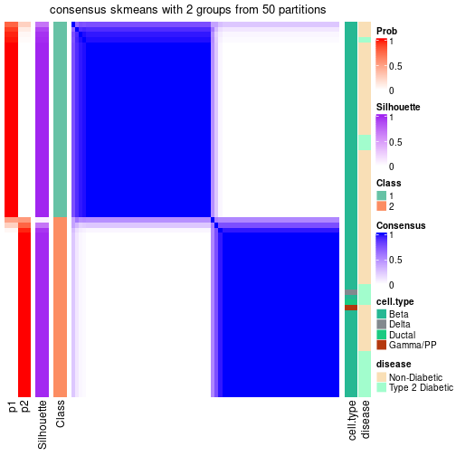</p>

</div>
<div id='tab-node-0111-consensus-heatmap-2'>
<pre><code class="r">consensus_heatmap(res, k = 3)
</code></pre>

<p>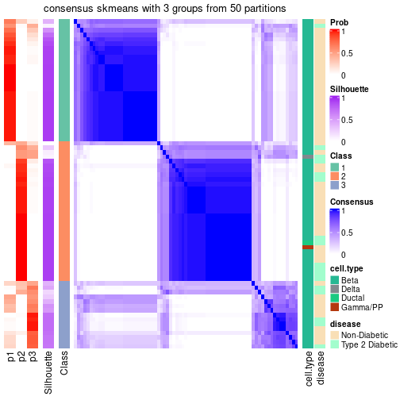</p>

</div>
<div id='tab-node-0111-consensus-heatmap-3'>
<pre><code class="r">consensus_heatmap(res, k = 4)
</code></pre>

<p></p>

</div>
</div>

Heatmaps for the membership of samples in all partitions to see how consistent they are:


<script>
$( function() {
	$( '#tabs-node-0111-membership-heatmap' ).tabs();
} );
</script>
<div id='tabs-node-0111-membership-heatmap'>
<ul>
<li><a href='#tab-node-0111-membership-heatmap-1'>k = 2</a></li>
<li><a href='#tab-node-0111-membership-heatmap-2'>k = 3</a></li>
<li><a href='#tab-node-0111-membership-heatmap-3'>k = 4</a></li>
</ul>
<div id='tab-node-0111-membership-heatmap-1'>
<pre><code class="r">membership_heatmap(res, k = 2)
</code></pre>

<p>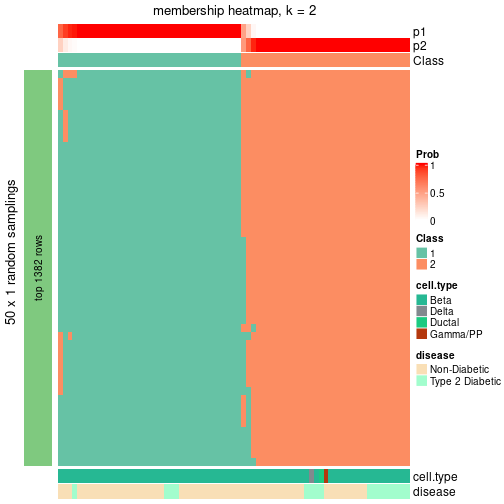</p>

</div>
<div id='tab-node-0111-membership-heatmap-2'>
<pre><code class="r">membership_heatmap(res, k = 3)
</code></pre>

<p></p>

</div>
<div id='tab-node-0111-membership-heatmap-3'>
<pre><code class="r">membership_heatmap(res, k = 4)
</code></pre>

<p></p>

</div>
</div>

As soon as the classes for columns are determined, the signatures
that are significantly different between subgroups can be looked for. 
Following are the heatmaps for signatures.


Signature heatmaps where rows are scaled:


<script>
$( function() {
	$( '#tabs-node-0111-get-signatures' ).tabs();
} );
</script>
<div id='tabs-node-0111-get-signatures'>
<ul>
<li><a href='#tab-node-0111-get-signatures-1'>k = 2</a></li>
<li><a href='#tab-node-0111-get-signatures-2'>k = 3</a></li>
<li><a href='#tab-node-0111-get-signatures-3'>k = 4</a></li>
</ul>
<div id='tab-node-0111-get-signatures-1'>
<pre><code class="r">get_signatures(res, k = 2)
</code></pre>

<p></p>

</div>
<div id='tab-node-0111-get-signatures-2'>
<pre><code class="r">get_signatures(res, k = 3)
</code></pre>

<p></p>

</div>
<div id='tab-node-0111-get-signatures-3'>
<pre><code class="r">get_signatures(res, k = 4)
</code></pre>

<p></p>

</div>
</div>


Signature heatmaps where rows are not scaled:


<script>
$( function() {
	$( '#tabs-node-0111-get-signatures-no-scale' ).tabs();
} );
</script>
<div id='tabs-node-0111-get-signatures-no-scale'>
<ul>
<li><a href='#tab-node-0111-get-signatures-no-scale-1'>k = 2</a></li>
<li><a href='#tab-node-0111-get-signatures-no-scale-2'>k = 3</a></li>
<li><a href='#tab-node-0111-get-signatures-no-scale-3'>k = 4</a></li>
</ul>
<div id='tab-node-0111-get-signatures-no-scale-1'>
<pre><code class="r">get_signatures(res, k = 2, scale_rows = FALSE)
</code></pre>

<p></p>

</div>
<div id='tab-node-0111-get-signatures-no-scale-2'>
<pre><code class="r">get_signatures(res, k = 3, scale_rows = FALSE)
</code></pre>

<p></p>

</div>
<div id='tab-node-0111-get-signatures-no-scale-3'>
<pre><code class="r">get_signatures(res, k = 4, scale_rows = FALSE)
</code></pre>

<p></p>

</div>
</div>


Compare the overlap of signatures from different k:

```r
compare_signatures(res)
```


`get_signature()` returns a data frame invisibly. To get the list of signatures, the function
call should be assigned to a variable explicitly. In following code, if `plot` argument is set
to `FALSE`, no heatmap is plotted while only the differential analysis is performed.

```r
# code only for demonstration
tb = get_signature(res, k = ..., plot = FALSE)
```

An example of the output of `tb` is:

```
#>   which_row         fdr    mean_1    mean_2 scaled_mean_1 scaled_mean_2 km
#> 1        38 0.042760348  8.373488  9.131774    -0.5533452     0.5164555  1
#> 2        40 0.018707592  7.106213  8.469186    -0.6173731     0.5762149  1
#> 3        55 0.019134737 10.221463 11.207825    -0.6159697     0.5749050  1
#> 4        59 0.006059896  5.921854  7.869574    -0.6899429     0.6439467  1
#> 5        60 0.018055526  8.928898 10.211722    -0.6204761     0.5791110  1
#> 6        98 0.009384629 15.714769 14.887706     0.6635654    -0.6193277  2
...
```

The columns in `tb` are:

1. `which_row`: row indices corresponding to the input matrix.
2. `fdr`: FDR for the differential test. 
3. `mean_x`: The mean value in group x.
4. `scaled_mean_x`: The mean value in group x after rows are scaled.
5. `km`: Row groups if k-means clustering is applied to rows (which is done by automatically selecting number of clusters).

If there are too many signatures, `top_signatures = ...` can be set to only show the 
signatures with the highest FDRs:

```r
# code only for demonstration
# e.g. to show the top 500 most significant rows
tb = get_signature(res, k = ..., top_signatures = 500)
```

If the signatures are defined as these which are uniquely high in current group, `diff_method` argument
can be set to `"uniquely_high_in_one_group"`:

```r
# code only for demonstration
tb = get_signature(res, k = ..., diff_method = "uniquely_high_in_one_group")
```


UMAP plot which shows how samples are separated.


<script>
$( function() {
	$( '#tabs-node-0111-dimension-reduction' ).tabs();
} );
</script>
<div id='tabs-node-0111-dimension-reduction'>
<ul>
<li><a href='#tab-node-0111-dimension-reduction-1'>k = 2</a></li>
<li><a href='#tab-node-0111-dimension-reduction-2'>k = 3</a></li>
<li><a href='#tab-node-0111-dimension-reduction-3'>k = 4</a></li>
</ul>
<div id='tab-node-0111-dimension-reduction-1'>
<pre><code class="r">dimension_reduction(res, k = 2, method = &quot;UMAP&quot;)
</code></pre>

<p></p>

</div>
<div id='tab-node-0111-dimension-reduction-2'>
<pre><code class="r">dimension_reduction(res, k = 3, method = &quot;UMAP&quot;)
</code></pre>

<p></p>

</div>
<div id='tab-node-0111-dimension-reduction-3'>
<pre><code class="r">dimension_reduction(res, k = 4, method = &quot;UMAP&quot;)
</code></pre>

<p></p>

</div>
</div>


Following heatmap shows how subgroups are split when increasing `k`:

```r
collect_classes(res)
```


Test correlation between subgroups and known annotations. If the known
annotation is numeric, one-way ANOVA test is applied, and if the known
annotation is discrete, chi-squared contingency table test is applied.

```r
test_to_known_factors(res)
```

```
#>             n_sample cell.type(p-value) disease(p-value) k
#> ATC:skmeans       72              0.321          0.01292 2
#> ATC:skmeans       62              0.613          0.00639 3
#> ATC:skmeans       49              0.506          0.00208 4
```


If matrix rows can be associated to genes, consider to use `functional_enrichment(res,
...)` to perform function enrichment for the signature genes. See [this vignette](https://jokergoo.github.io/cola_vignettes/functional_enrichment.html) for more detailed explanations.


 

---------------------------------------------------


### Node0112


Parent node: [Node011](#Node011).
Child nodes: 
                Node01111-leaf
        ,
                Node01112-leaf
        ,
                Node01121-leaf
        ,
                Node01122-leaf
        ,
                Node01131-leaf
        ,
                [Node01132](#Node01132)
        ,
                Node01221-leaf
        ,
                Node01222-leaf
        ,
                Node01223-leaf
        ,
                Node01231-leaf
        ,
                Node01232-leaf
        .


The object with results only for a single top-value method and a single partitioning method 
can be extracted as:

```r
res = res_rh["0112"]
```

A summary of `res` and all the functions that can be applied to it:

```r
res
```

```
#> A 'ConsensusPartition' object with k = 2, 3, 4.
#>   On a matrix with 13836 rows and 71 columns.
#>   Top rows (1384) are extracted by 'ATC' method.
#>   Subgroups are detected by 'skmeans' method.
#>   Performed in total 150 partitions by row resampling.
#>   Best k for subgroups seems to be 2.
#> 
#> Following methods can be applied to this 'ConsensusPartition' object:
#>  [1] "cola_report"             "collect_classes"         "collect_plots"          
#>  [4] "collect_stats"           "colnames"                "compare_partitions"     
#>  [7] "compare_signatures"      "consensus_heatmap"       "dimension_reduction"    
#> [10] "functional_enrichment"   "get_anno_col"            "get_anno"               
#> [13] "get_classes"             "get_consensus"           "get_matrix"             
#> [16] "get_membership"          "get_param"               "get_signatures"         
#> [19] "get_stats"               "is_best_k"               "is_stable_k"            
#> [22] "membership_heatmap"      "ncol"                    "nrow"                   
#> [25] "plot_ecdf"               "predict_classes"         "rownames"               
#> [28] "select_partition_number" "show"                    "suggest_best_k"         
#> [31] "test_to_known_factors"   "top_rows_heatmap"
```

`collect_plots()` function collects all the plots made from `res` for all `k` (number of subgroups)
into one single page to provide an easy and fast comparison between different `k`.

```r
collect_plots(res)
```


The plots are:

- The first row: a plot of the eCDF (empirical cumulative distribution
  function) curves of the consensus matrix for each `k` and the heatmap of
  predicted classes for each `k`.
- The second row: heatmaps of the consensus matrix for each `k`.
- The third row: heatmaps of the membership matrix for each `k`.
- The fouth row: heatmaps of the signatures for each `k`.

All the plots in panels can be made by individual functions and they are
plotted later in this section.

`select_partition_number()` produces several plots showing different
statistics for choosing "optimized" `k`. There are following statistics:

- eCDF curves of the consensus matrix for each `k`;
- 1-PAC. [The PAC score](https://en.wikipedia.org/wiki/Consensus_clustering#Over-interpretation_potential_of_consensus_clustering)
  measures the proportion of the ambiguous subgrouping.
- Mean silhouette score.
- Concordance. The mean probability of fiting the consensus subgroup labels in all
  partitions.
- Area increased. Denote $A_k$ as the area under the eCDF curve for current
  `k`, the area increased is defined as $A_k - A_{k-1}$.
- Rand index. The percent of pairs of samples that are both in a same cluster
  or both are not in a same cluster in the partition of k and k-1.
- Jaccard index. The ratio of pairs of samples are both in a same cluster in
  the partition of k and k-1 and the pairs of samples are both in a same
  cluster in the partition k or k-1.

The detailed explanations of these statistics can be found in [the _cola_
vignette](https://jokergoo.github.io/cola_vignettes/cola.html#toc_13).

Generally speaking, higher 1-PAC score, higher mean silhouette score or higher
concordance corresponds to better partition. Rand index and Jaccard index
measure how similar the current partition is compared to partition with `k-1`.
If they are too similar, we won't accept `k` is better than `k-1`.

```r
select_partition_number(res)
```


The numeric values for all these statistics can be obtained by `get_stats()`.

```r
get_stats(res)
```

```
#>   k 1-PAC mean_silhouette concordance area_increased  Rand Jaccard
#> 2 2 1.000           0.973       0.988          0.502 0.498   0.498
#> 3 3 0.629           0.775       0.875          0.257 0.854   0.712
#> 4 4 0.582           0.683       0.836          0.138 0.908   0.760
```

`suggest_best_k()` suggests the best $k$ based on these statistics. The rules are as follows:

- All $k$ with Jaccard index larger than 0.95 are removed because increasing
  $k$ does not provide enough extra information. If all $k$ are removed, it is
  marked as no subgroup is detected.
- For all $k$ with 1-PAC score larger than 0.9, the maximal $k$ is taken as
  the best $k$, and other $k$ are marked as optional $k$.
- If it does not fit the second rule. The $k$ with the maximal vote of the
  highest 1-PAC score, highest mean silhouette, and highest concordance is
  taken as the best $k$.

```r
suggest_best_k(res)
```

```
#> [1] 2
```


Following is the table of the partitions (You need to click the **show/hide
code output** link to see it). The membership matrix (columns with name `p*`)
is inferred by
[`clue::cl_consensus()`](https://www.rdocumentation.org/link/cl_consensus?package=clue)
function with the `SE` method. Basically the value in the membership matrix
represents the probability to belong to a certain group. The finall subgroup
label for an item is determined with the group with highest probability it
belongs to.

In `get_classes()` function, the entropy is calculated from the membership
matrix and the silhouette score is calculated from the consensus matrix.


<script>
$( function() {
	$( '#tabs-node-0112-get-classes' ).tabs();
} );
</script>
<div id='tabs-node-0112-get-classes'>
<ul>
<li><a href='#tab-node-0112-get-classes-1'>k = 2</a></li>
<li><a href='#tab-node-0112-get-classes-2'>k = 3</a></li>
<li><a href='#tab-node-0112-get-classes-3'>k = 4</a></li>
</ul>

<div id='tab-node-0112-get-classes-1'>
<p><a id='tab-node-0112-get-classes-1-a' style='color:#0366d6' href='#'>show/hide code output</a></p>
<pre><code class="r">cbind(get_classes(res, k = 2), get_membership(res, k = 2))
</code></pre>

<pre><code>#&gt;               class entropy silhouette   p1   p2
#&gt; 12th-C29_S150     2   0.000      0.992 0.00 1.00
#&gt; 12th-C58_S162     1   0.000      0.981 1.00 0.00
#&gt; 12th-C95_S174     1   0.000      0.981 1.00 0.00
#&gt; 13th_C66_S214     2   0.000      0.992 0.00 1.00
#&gt; 13th_C76_S216     2   0.000      0.992 0.00 1.00
#&gt; 1st-C19_S20       2   0.000      0.992 0.00 1.00
#&gt; 1st-C50_S33       2   0.000      0.992 0.00 1.00
#&gt; 1st-C56_S34       1   0.000      0.981 1.00 0.00
#&gt; 1st-C57_S42       2   0.000      0.992 0.00 1.00
#&gt; 1st-C68_S36       1   0.402      0.909 0.92 0.08
#&gt; 1st-C73_S45       2   0.000      0.992 0.00 1.00
#&gt; 1st-C75_S29       2   0.141      0.974 0.02 0.98
#&gt; 1st-C78_S85       2   0.000      0.992 0.00 1.00
#&gt; 1st-C80_S38       1   0.000      0.981 1.00 0.00
#&gt; 2nd-C11_S20       1   0.000      0.981 1.00 0.00
#&gt; 2nd-C16_S33       1   0.000      0.981 1.00 0.00
#&gt; 2nd-C26_S50       1   0.000      0.981 1.00 0.00
#&gt; 2nd-C39_S75       1   0.000      0.981 1.00 0.00
#&gt; 2nd-C67_S40       2   0.000      0.992 0.00 1.00
#&gt; 2nd-C75_S52       1   0.000      0.981 1.00 0.00
#&gt; 2nd-C77_S59       2   0.000      0.992 0.00 1.00
#&gt; 2nd-C80_S65       1   0.000      0.981 1.00 0.00
#&gt; 2nd-C8_S14        2   0.141      0.974 0.02 0.98
#&gt; 3rd-C12_S68       2   0.000      0.992 0.00 1.00
#&gt; 3rd-C27_S49       2   0.000      0.992 0.00 1.00
#&gt; 3rd-C47_S35       2   0.000      0.992 0.00 1.00
#&gt; 3rd-C49_S60       2   0.000      0.992 0.00 1.00
#&gt; 3rd-C57_S5        1   0.855      0.621 0.72 0.28
#&gt; 3rd-C79_S67       1   0.000      0.981 1.00 0.00
#&gt; 3rd-C85_S79       1   0.000      0.981 1.00 0.00
#&gt; 3rd-C91_S91       1   0.000      0.981 1.00 0.00
#&gt; 3rd-C95_S81       1   0.000      0.981 1.00 0.00
#&gt; 4th-C18_S31       2   0.000      0.992 0.00 1.00
#&gt; 4th-C40_S79       1   0.000      0.981 1.00 0.00
#&gt; 4th-C4_S9         2   0.000      0.992 0.00 1.00
#&gt; 4th-C56_S17       2   0.000      0.992 0.00 1.00
#&gt; 4th-C62_S29       1   0.000      0.981 1.00 0.00
#&gt; 4th-C64_S34       1   0.000      0.981 1.00 0.00
#&gt; 4th-C66_S36       1   0.000      0.981 1.00 0.00
#&gt; 4th-C73_S54       2   0.000      0.992 0.00 1.00
#&gt; 4th-C75_S52       2   0.000      0.992 0.00 1.00
#&gt; 4th-C79_S66       2   0.000      0.992 0.00 1.00
#&gt; 4th-C80_S65       1   0.000      0.981 1.00 0.00
#&gt; 4th-C82_S72       1   0.000      0.981 1.00 0.00
#&gt; 4th-C83_S71       2   0.000      0.992 0.00 1.00
#&gt; 4th-C86_S77       1   0.000      0.981 1.00 0.00
#&gt; 4th-C88_S84       1   0.000      0.981 1.00 0.00
#&gt; 4th-C92_S89       1   0.000      0.981 1.00 0.00
#&gt; 4th-C94_S96       2   0.000      0.992 0.00 1.00
#&gt; 4th-C96_S94       2   0.000      0.992 0.00 1.00
#&gt; 5th-C34_S108      1   0.000      0.981 1.00 0.00
#&gt; 5th-C9_S92        1   0.000      0.981 1.00 0.00
#&gt; 6th-C21_S33       2   0.000      0.992 0.00 1.00
#&gt; 6th-C87_S70       2   0.000      0.992 0.00 1.00
#&gt; 7th-C11_S18       2   0.000      0.992 0.00 1.00
#&gt; 7th-C14_S24       1   0.000      0.981 1.00 0.00
#&gt; 7th-C24_S40       1   0.634      0.812 0.84 0.16
#&gt; 7th-C36_S61       2   0.000      0.992 0.00 1.00
#&gt; 7th-C58_S20       1   0.000      0.981 1.00 0.00
#&gt; 7th-C79_S58       2   0.000      0.992 0.00 1.00
#&gt; 7th-C82_S64       2   0.141      0.974 0.02 0.98
#&gt; 8th-C55_S96       2   0.000      0.992 0.00 1.00
#&gt; 8th-C57_S98       2   0.000      0.992 0.00 1.00
#&gt; 8th-C58_S101      1   0.327      0.929 0.94 0.06
#&gt; 8th-C67_S117      2   0.795      0.681 0.24 0.76
#&gt; 8th-C74_S129      2   0.000      0.992 0.00 1.00
#&gt; 8th-C85_S150      2   0.000      0.992 0.00 1.00
#&gt; 9th-C57_S16       2   0.000      0.992 0.00 1.00
#&gt; 9th-C80_S56       2   0.000      0.992 0.00 1.00
#&gt; 9th-C83_S61       1   0.000      0.981 1.00 0.00
#&gt; 9th-C9_S13        2   0.000      0.992 0.00 1.00
</code></pre>

<script>
$('#tab-node-0112-get-classes-1-a').parent().next().next().hide();
$('#tab-node-0112-get-classes-1-a').click(function(){
  $('#tab-node-0112-get-classes-1-a').parent().next().next().toggle();
  return(false);
});
</script>
</div>

<div id='tab-node-0112-get-classes-2'>
<p><a id='tab-node-0112-get-classes-2-a' style='color:#0366d6' href='#'>show/hide code output</a></p>
<pre><code class="r">cbind(get_classes(res, k = 3), get_membership(res, k = 3))
</code></pre>

<pre><code>#&gt;               class entropy silhouette   p1   p2   p3
#&gt; 12th-C29_S150     3  0.6280      0.384 0.00 0.46 0.54
#&gt; 12th-C58_S162     1  0.5216      0.649 0.74 0.00 0.26
#&gt; 12th-C95_S174     1  0.0000      0.910 1.00 0.00 0.00
#&gt; 13th_C66_S214     3  0.5016      0.692 0.00 0.24 0.76
#&gt; 13th_C76_S216     2  0.2537      0.853 0.00 0.92 0.08
#&gt; 1st-C19_S20       2  0.0000      0.876 0.00 1.00 0.00
#&gt; 1st-C50_S33       2  0.5835      0.454 0.00 0.66 0.34
#&gt; 1st-C56_S34       1  0.1529      0.890 0.96 0.00 0.04
#&gt; 1st-C57_S42       2  0.5397      0.552 0.00 0.72 0.28
#&gt; 1st-C68_S36       3  0.9659      0.161 0.34 0.22 0.44
#&gt; 1st-C73_S45       2  0.2066      0.863 0.00 0.94 0.06
#&gt; 1st-C75_S29       3  0.4862      0.701 0.02 0.16 0.82
#&gt; 1st-C78_S85       2  0.0000      0.876 0.00 1.00 0.00
#&gt; 1st-C80_S38       1  0.5643      0.738 0.76 0.02 0.22
#&gt; 2nd-C11_S20       1  0.4291      0.791 0.82 0.00 0.18
#&gt; 2nd-C16_S33       1  0.0000      0.910 1.00 0.00 0.00
#&gt; 2nd-C26_S50       1  0.5216      0.721 0.74 0.00 0.26
#&gt; 2nd-C39_S75       1  0.0000      0.910 1.00 0.00 0.00
#&gt; 2nd-C67_S40       2  0.2959      0.831 0.00 0.90 0.10
#&gt; 2nd-C75_S52       1  0.0000      0.910 1.00 0.00 0.00
#&gt; 2nd-C77_S59       2  0.0000      0.876 0.00 1.00 0.00
#&gt; 2nd-C80_S65       1  0.0000      0.910 1.00 0.00 0.00
#&gt; 2nd-C8_S14        2  0.5397      0.552 0.00 0.72 0.28
#&gt; 3rd-C12_S68       2  0.5016      0.611 0.00 0.76 0.24
#&gt; 3rd-C27_S49       2  0.2066      0.863 0.00 0.94 0.06
#&gt; 3rd-C47_S35       3  0.5216      0.681 0.00 0.26 0.74
#&gt; 3rd-C49_S60       2  0.0000      0.876 0.00 1.00 0.00
#&gt; 3rd-C57_S5        3  0.8219      0.464 0.18 0.18 0.64
#&gt; 3rd-C79_S67       1  0.8859      0.204 0.48 0.12 0.40
#&gt; 3rd-C85_S79       1  0.6232      0.703 0.74 0.04 0.22
#&gt; 3rd-C91_S91       1  0.2066      0.874 0.94 0.00 0.06
#&gt; 3rd-C95_S81       1  0.4291      0.792 0.82 0.00 0.18
#&gt; 4th-C18_S31       2  0.1529      0.870 0.00 0.96 0.04
#&gt; 4th-C40_S79       1  0.0000      0.910 1.00 0.00 0.00
#&gt; 4th-C4_S9         2  0.0892      0.866 0.00 0.98 0.02
#&gt; 4th-C56_S17       2  0.1529      0.870 0.00 0.96 0.04
#&gt; 4th-C62_S29       1  0.0000      0.910 1.00 0.00 0.00
#&gt; 4th-C64_S34       1  0.0000      0.910 1.00 0.00 0.00
#&gt; 4th-C66_S36       1  0.0000      0.910 1.00 0.00 0.00
#&gt; 4th-C73_S54       2  0.0892      0.874 0.00 0.98 0.02
#&gt; 4th-C75_S52       2  0.2066      0.848 0.00 0.94 0.06
#&gt; 4th-C79_S66       2  0.1529      0.870 0.00 0.96 0.04
#&gt; 4th-C80_S65       1  0.0000      0.910 1.00 0.00 0.00
#&gt; 4th-C82_S72       1  0.0000      0.910 1.00 0.00 0.00
#&gt; 4th-C83_S71       2  0.0000      0.876 0.00 1.00 0.00
#&gt; 4th-C86_S77       1  0.0000      0.910 1.00 0.00 0.00
#&gt; 4th-C88_S84       1  0.0000      0.910 1.00 0.00 0.00
#&gt; 4th-C92_S89       1  0.0000      0.910 1.00 0.00 0.00
#&gt; 4th-C94_S96       2  0.0000      0.876 0.00 1.00 0.00
#&gt; 4th-C96_S94       2  0.4555      0.713 0.00 0.80 0.20
#&gt; 5th-C34_S108      1  0.5016      0.667 0.76 0.00 0.24
#&gt; 5th-C9_S92        1  0.0000      0.910 1.00 0.00 0.00
#&gt; 6th-C21_S33       2  0.2959      0.834 0.00 0.90 0.10
#&gt; 6th-C87_S70       3  0.6302      0.312 0.00 0.48 0.52
#&gt; 7th-C11_S18       2  0.2066      0.863 0.00 0.94 0.06
#&gt; 7th-C14_S24       1  0.0000      0.910 1.00 0.00 0.00
#&gt; 7th-C24_S40       3  0.7058      0.702 0.10 0.18 0.72
#&gt; 7th-C36_S61       2  0.0000      0.876 0.00 1.00 0.00
#&gt; 7th-C58_S20       1  0.0000      0.910 1.00 0.00 0.00
#&gt; 7th-C79_S58       2  0.0000      0.876 0.00 1.00 0.00
#&gt; 7th-C82_S64       3  0.6053      0.684 0.02 0.26 0.72
#&gt; 8th-C55_S96       2  0.5016      0.606 0.00 0.76 0.24
#&gt; 8th-C57_S98       2  0.2066      0.863 0.00 0.94 0.06
#&gt; 8th-C58_S101      3  0.8033      0.547 0.24 0.12 0.64
#&gt; 8th-C67_S117      3  0.6530      0.688 0.12 0.12 0.76
#&gt; 8th-C74_S129      2  0.5016      0.676 0.00 0.76 0.24
#&gt; 8th-C85_S150      2  0.4555      0.694 0.00 0.80 0.20
#&gt; 9th-C57_S16       2  0.2537      0.854 0.00 0.92 0.08
#&gt; 9th-C80_S56       2  0.0000      0.876 0.00 1.00 0.00
#&gt; 9th-C83_S61       1  0.2066      0.881 0.94 0.00 0.06
#&gt; 9th-C9_S13        2  0.0892      0.874 0.00 0.98 0.02
</code></pre>

<script>
$('#tab-node-0112-get-classes-2-a').parent().next().next().hide();
$('#tab-node-0112-get-classes-2-a').click(function(){
  $('#tab-node-0112-get-classes-2-a').parent().next().next().toggle();
  return(false);
});
</script>
</div>

<div id='tab-node-0112-get-classes-3'>
<p><a id='tab-node-0112-get-classes-3-a' style='color:#0366d6' href='#'>show/hide code output</a></p>
<pre><code class="r">cbind(get_classes(res, k = 4), get_membership(res, k = 4))
</code></pre>

<pre><code>#&gt;               class entropy silhouette   p1   p2   p3   p4
#&gt; 12th-C29_S150     3  0.6570     0.4800 0.00 0.32 0.58 0.10
#&gt; 12th-C58_S162     1  0.7021     0.1895 0.48 0.00 0.40 0.12
#&gt; 12th-C95_S174     1  0.0000     0.8392 1.00 0.00 0.00 0.00
#&gt; 13th_C66_S214     3  0.4731     0.6615 0.00 0.16 0.78 0.06
#&gt; 13th_C76_S216     2  0.2335     0.8604 0.00 0.92 0.02 0.06
#&gt; 1st-C19_S20       2  0.2921     0.8281 0.00 0.86 0.00 0.14
#&gt; 1st-C50_S33       4  0.3172     0.6249 0.00 0.16 0.00 0.84
#&gt; 1st-C56_S34       1  0.2647     0.7600 0.88 0.00 0.00 0.12
#&gt; 1st-C57_S42       4  0.3198     0.6305 0.00 0.08 0.04 0.88
#&gt; 1st-C68_S36       4  0.6767     0.4746 0.22 0.04 0.08 0.66
#&gt; 1st-C73_S45       2  0.0707     0.8578 0.00 0.98 0.02 0.00
#&gt; 1st-C75_S29       3  0.3525     0.6601 0.00 0.04 0.86 0.10
#&gt; 1st-C78_S85       2  0.2921     0.8353 0.00 0.86 0.00 0.14
#&gt; 1st-C80_S38       1  0.7493     0.1851 0.48 0.00 0.20 0.32
#&gt; 2nd-C11_S20       1  0.4790     0.4002 0.62 0.00 0.00 0.38
#&gt; 2nd-C16_S33       1  0.0000     0.8392 1.00 0.00 0.00 0.00
#&gt; 2nd-C26_S50       1  0.7430     0.2907 0.54 0.02 0.12 0.32
#&gt; 2nd-C39_S75       1  0.0000     0.8392 1.00 0.00 0.00 0.00
#&gt; 2nd-C67_S40       2  0.5902     0.6425 0.00 0.70 0.14 0.16
#&gt; 2nd-C75_S52       1  0.0000     0.8392 1.00 0.00 0.00 0.00
#&gt; 2nd-C77_S59       2  0.3037     0.8500 0.00 0.88 0.02 0.10
#&gt; 2nd-C80_S65       1  0.0000     0.8392 1.00 0.00 0.00 0.00
#&gt; 2nd-C8_S14        4  0.2011     0.6407 0.00 0.08 0.00 0.92
#&gt; 3rd-C12_S68       4  0.3610     0.5941 0.00 0.20 0.00 0.80
#&gt; 3rd-C27_S49       2  0.0707     0.8589 0.00 0.98 0.00 0.02
#&gt; 3rd-C47_S35       3  0.4284     0.6581 0.00 0.20 0.78 0.02
#&gt; 3rd-C49_S60       2  0.2011     0.8573 0.00 0.92 0.00 0.08
#&gt; 3rd-C57_S5        4  0.6208     0.5690 0.04 0.08 0.16 0.72
#&gt; 3rd-C79_S67       4  0.6439     0.5222 0.20 0.02 0.10 0.68
#&gt; 3rd-C85_S79       4  0.5860     0.1627 0.38 0.00 0.04 0.58
#&gt; 3rd-C91_S91       1  0.6700     0.5559 0.66 0.02 0.20 0.12
#&gt; 3rd-C95_S81       1  0.6011     0.0255 0.48 0.00 0.04 0.48
#&gt; 4th-C18_S31       2  0.0707     0.8549 0.00 0.98 0.02 0.00
#&gt; 4th-C40_S79       1  0.0000     0.8392 1.00 0.00 0.00 0.00
#&gt; 4th-C4_S9         2  0.5327     0.6910 0.00 0.72 0.06 0.22
#&gt; 4th-C56_S17       2  0.0000     0.8581 0.00 1.00 0.00 0.00
#&gt; 4th-C62_S29       1  0.0000     0.8392 1.00 0.00 0.00 0.00
#&gt; 4th-C64_S34       1  0.0000     0.8392 1.00 0.00 0.00 0.00
#&gt; 4th-C66_S36       1  0.0000     0.8392 1.00 0.00 0.00 0.00
#&gt; 4th-C73_S54       2  0.4610     0.7670 0.00 0.80 0.10 0.10
#&gt; 4th-C75_S52       2  0.5175     0.7257 0.00 0.76 0.12 0.12
#&gt; 4th-C79_S66       2  0.1411     0.8594 0.00 0.96 0.02 0.02
#&gt; 4th-C80_S65       1  0.0000     0.8392 1.00 0.00 0.00 0.00
#&gt; 4th-C82_S72       1  0.0000     0.8392 1.00 0.00 0.00 0.00
#&gt; 4th-C83_S71       2  0.4134     0.7016 0.00 0.74 0.00 0.26
#&gt; 4th-C86_S77       1  0.0000     0.8392 1.00 0.00 0.00 0.00
#&gt; 4th-C88_S84       1  0.0000     0.8392 1.00 0.00 0.00 0.00
#&gt; 4th-C92_S89       1  0.0000     0.8392 1.00 0.00 0.00 0.00
#&gt; 4th-C94_S96       2  0.2921     0.8240 0.00 0.86 0.00 0.14
#&gt; 4th-C96_S94       4  0.7047     0.0773 0.00 0.44 0.12 0.44
#&gt; 5th-C34_S108      1  0.4713     0.4681 0.64 0.00 0.36 0.00
#&gt; 5th-C9_S92        1  0.0000     0.8392 1.00 0.00 0.00 0.00
#&gt; 6th-C21_S33       2  0.1637     0.8510 0.00 0.94 0.06 0.00
#&gt; 6th-C87_S70       3  0.5487     0.3610 0.00 0.40 0.58 0.02
#&gt; 7th-C11_S18       2  0.1211     0.8615 0.00 0.96 0.00 0.04
#&gt; 7th-C14_S24       1  0.2411     0.7993 0.92 0.00 0.04 0.04
#&gt; 7th-C24_S40       3  0.0000     0.6785 0.00 0.00 1.00 0.00
#&gt; 7th-C36_S61       2  0.3606     0.8238 0.00 0.84 0.02 0.14
#&gt; 7th-C58_S20       1  0.0707     0.8285 0.98 0.00 0.00 0.02
#&gt; 7th-C79_S58       2  0.3400     0.8003 0.00 0.82 0.00 0.18
#&gt; 7th-C82_S64       3  0.0000     0.6785 0.00 0.00 1.00 0.00
#&gt; 8th-C55_S96       2  0.4755     0.6805 0.00 0.76 0.20 0.04
#&gt; 8th-C57_S98       2  0.0000     0.8581 0.00 1.00 0.00 0.00
#&gt; 8th-C58_S101      3  0.7885     0.4207 0.22 0.14 0.58 0.06
#&gt; 8th-C67_S117      3  0.4778     0.6473 0.08 0.04 0.82 0.06
#&gt; 8th-C74_S129      2  0.7121     0.2779 0.00 0.54 0.16 0.30
#&gt; 8th-C85_S150      2  0.2411     0.8473 0.00 0.92 0.04 0.04
#&gt; 9th-C57_S16       2  0.3037     0.8275 0.00 0.88 0.10 0.02
#&gt; 9th-C80_S56       2  0.0707     0.8588 0.00 0.98 0.02 0.00
#&gt; 9th-C83_S61       1  0.6299     0.4145 0.60 0.00 0.08 0.32
#&gt; 9th-C9_S13        2  0.0000     0.8581 0.00 1.00 0.00 0.00
</code></pre>

<script>
$('#tab-node-0112-get-classes-3-a').parent().next().next().hide();
$('#tab-node-0112-get-classes-3-a').click(function(){
  $('#tab-node-0112-get-classes-3-a').parent().next().next().toggle();
  return(false);
});
</script>
</div>
</div>

Heatmaps for the consensus matrix. It visualizes the probability of two
samples to be in a same group.


<script>
$( function() {
	$( '#tabs-node-0112-consensus-heatmap' ).tabs();
} );
</script>
<div id='tabs-node-0112-consensus-heatmap'>
<ul>
<li><a href='#tab-node-0112-consensus-heatmap-1'>k = 2</a></li>
<li><a href='#tab-node-0112-consensus-heatmap-2'>k = 3</a></li>
<li><a href='#tab-node-0112-consensus-heatmap-3'>k = 4</a></li>
</ul>
<div id='tab-node-0112-consensus-heatmap-1'>
<pre><code class="r">consensus_heatmap(res, k = 2)
</code></pre>

<p></p>

</div>
<div id='tab-node-0112-consensus-heatmap-2'>
<pre><code class="r">consensus_heatmap(res, k = 3)
</code></pre>

<p></p>

</div>
<div id='tab-node-0112-consensus-heatmap-3'>
<pre><code class="r">consensus_heatmap(res, k = 4)
</code></pre>

<p></p>

</div>
</div>

Heatmaps for the membership of samples in all partitions to see how consistent they are:


<script>
$( function() {
	$( '#tabs-node-0112-membership-heatmap' ).tabs();
} );
</script>
<div id='tabs-node-0112-membership-heatmap'>
<ul>
<li><a href='#tab-node-0112-membership-heatmap-1'>k = 2</a></li>
<li><a href='#tab-node-0112-membership-heatmap-2'>k = 3</a></li>
<li><a href='#tab-node-0112-membership-heatmap-3'>k = 4</a></li>
</ul>
<div id='tab-node-0112-membership-heatmap-1'>
<pre><code class="r">membership_heatmap(res, k = 2)
</code></pre>

<p></p>

</div>
<div id='tab-node-0112-membership-heatmap-2'>
<pre><code class="r">membership_heatmap(res, k = 3)
</code></pre>

<p></p>

</div>
<div id='tab-node-0112-membership-heatmap-3'>
<pre><code class="r">membership_heatmap(res, k = 4)
</code></pre>

<p>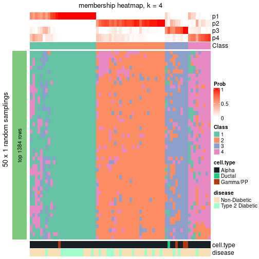</p>

</div>
</div>

As soon as the classes for columns are determined, the signatures
that are significantly different between subgroups can be looked for. 
Following are the heatmaps for signatures.


Signature heatmaps where rows are scaled:


<script>
$( function() {
	$( '#tabs-node-0112-get-signatures' ).tabs();
} );
</script>
<div id='tabs-node-0112-get-signatures'>
<ul>
<li><a href='#tab-node-0112-get-signatures-1'>k = 2</a></li>
<li><a href='#tab-node-0112-get-signatures-2'>k = 3</a></li>
<li><a href='#tab-node-0112-get-signatures-3'>k = 4</a></li>
</ul>
<div id='tab-node-0112-get-signatures-1'>
<pre><code class="r">get_signatures(res, k = 2)
</code></pre>

<p></p>

</div>
<div id='tab-node-0112-get-signatures-2'>
<pre><code class="r">get_signatures(res, k = 3)
</code></pre>

<p></p>

</div>
<div id='tab-node-0112-get-signatures-3'>
<pre><code class="r">get_signatures(res, k = 4)
</code></pre>

<p></p>

</div>
</div>


Signature heatmaps where rows are not scaled:


<script>
$( function() {
	$( '#tabs-node-0112-get-signatures-no-scale' ).tabs();
} );
</script>
<div id='tabs-node-0112-get-signatures-no-scale'>
<ul>
<li><a href='#tab-node-0112-get-signatures-no-scale-1'>k = 2</a></li>
<li><a href='#tab-node-0112-get-signatures-no-scale-2'>k = 3</a></li>
<li><a href='#tab-node-0112-get-signatures-no-scale-3'>k = 4</a></li>
</ul>
<div id='tab-node-0112-get-signatures-no-scale-1'>
<pre><code class="r">get_signatures(res, k = 2, scale_rows = FALSE)
</code></pre>

<p></p>

</div>
<div id='tab-node-0112-get-signatures-no-scale-2'>
<pre><code class="r">get_signatures(res, k = 3, scale_rows = FALSE)
</code></pre>

<p></p>

</div>
<div id='tab-node-0112-get-signatures-no-scale-3'>
<pre><code class="r">get_signatures(res, k = 4, scale_rows = FALSE)
</code></pre>

<p></p>

</div>
</div>


Compare the overlap of signatures from different k:

```r
compare_signatures(res)
```


`get_signature()` returns a data frame invisibly. To get the list of signatures, the function
call should be assigned to a variable explicitly. In following code, if `plot` argument is set
to `FALSE`, no heatmap is plotted while only the differential analysis is performed.

```r
# code only for demonstration
tb = get_signature(res, k = ..., plot = FALSE)
```

An example of the output of `tb` is:

```
#>   which_row         fdr    mean_1    mean_2 scaled_mean_1 scaled_mean_2 km
#> 1        38 0.042760348  8.373488  9.131774    -0.5533452     0.5164555  1
#> 2        40 0.018707592  7.106213  8.469186    -0.6173731     0.5762149  1
#> 3        55 0.019134737 10.221463 11.207825    -0.6159697     0.5749050  1
#> 4        59 0.006059896  5.921854  7.869574    -0.6899429     0.6439467  1
#> 5        60 0.018055526  8.928898 10.211722    -0.6204761     0.5791110  1
#> 6        98 0.009384629 15.714769 14.887706     0.6635654    -0.6193277  2
...
```

The columns in `tb` are:

1. `which_row`: row indices corresponding to the input matrix.
2. `fdr`: FDR for the differential test. 
3. `mean_x`: The mean value in group x.
4. `scaled_mean_x`: The mean value in group x after rows are scaled.
5. `km`: Row groups if k-means clustering is applied to rows (which is done by automatically selecting number of clusters).

If there are too many signatures, `top_signatures = ...` can be set to only show the 
signatures with the highest FDRs:

```r
# code only for demonstration
# e.g. to show the top 500 most significant rows
tb = get_signature(res, k = ..., top_signatures = 500)
```

If the signatures are defined as these which are uniquely high in current group, `diff_method` argument
can be set to `"uniquely_high_in_one_group"`:

```r
# code only for demonstration
tb = get_signature(res, k = ..., diff_method = "uniquely_high_in_one_group")
```


UMAP plot which shows how samples are separated.


<script>
$( function() {
	$( '#tabs-node-0112-dimension-reduction' ).tabs();
} );
</script>
<div id='tabs-node-0112-dimension-reduction'>
<ul>
<li><a href='#tab-node-0112-dimension-reduction-1'>k = 2</a></li>
<li><a href='#tab-node-0112-dimension-reduction-2'>k = 3</a></li>
<li><a href='#tab-node-0112-dimension-reduction-3'>k = 4</a></li>
</ul>
<div id='tab-node-0112-dimension-reduction-1'>
<pre><code class="r">dimension_reduction(res, k = 2, method = &quot;UMAP&quot;)
</code></pre>

<p></p>

</div>
<div id='tab-node-0112-dimension-reduction-2'>
<pre><code class="r">dimension_reduction(res, k = 3, method = &quot;UMAP&quot;)
</code></pre>

<p></p>

</div>
<div id='tab-node-0112-dimension-reduction-3'>
<pre><code class="r">dimension_reduction(res, k = 4, method = &quot;UMAP&quot;)
</code></pre>

<p></p>

</div>
</div>


Following heatmap shows how subgroups are split when increasing `k`:

```r
collect_classes(res)
```


Test correlation between subgroups and known annotations. If the known
annotation is numeric, one-way ANOVA test is applied, and if the known
annotation is discrete, chi-squared contingency table test is applied.

```r
test_to_known_factors(res)
```

```
#>             n_sample cell.type(p-value) disease(p-value) k
#> ATC:skmeans       71           6.49e-01           0.9456 2
#> ATC:skmeans       65           1.32e-05           0.4057 3
#> ATC:skmeans       57           5.76e-05           0.0818 4
```


If matrix rows can be associated to genes, consider to use `functional_enrichment(res,
...)` to perform function enrichment for the signature genes. See [this vignette](https://jokergoo.github.io/cola_vignettes/functional_enrichment.html) for more detailed explanations.


 

---------------------------------------------------


### Node0113


Parent node: [Node011](#Node011).
Child nodes: 
                Node01111-leaf
        ,
                Node01112-leaf
        ,
                Node01121-leaf
        ,
                Node01122-leaf
        ,
                Node01131-leaf
        ,
                [Node01132](#Node01132)
        ,
                Node01221-leaf
        ,
                Node01222-leaf
        ,
                Node01223-leaf
        ,
                Node01231-leaf
        ,
                Node01232-leaf
        .


The object with results only for a single top-value method and a single partitioning method 
can be extracted as:

```r
res = res_rh["0113"]
```

A summary of `res` and all the functions that can be applied to it:

```r
res
```

```
#> A 'ConsensusPartition' object with k = 2, 3, 4.
#>   On a matrix with 13819 rows and 63 columns.
#>   Top rows (1269) are extracted by 'ATC' method.
#>   Subgroups are detected by 'skmeans' method.
#>   Performed in total 150 partitions by row resampling.
#>   Best k for subgroups seems to be 2.
#> 
#> Following methods can be applied to this 'ConsensusPartition' object:
#>  [1] "cola_report"             "collect_classes"         "collect_plots"          
#>  [4] "collect_stats"           "colnames"                "compare_partitions"     
#>  [7] "compare_signatures"      "consensus_heatmap"       "dimension_reduction"    
#> [10] "functional_enrichment"   "get_anno_col"            "get_anno"               
#> [13] "get_classes"             "get_consensus"           "get_matrix"             
#> [16] "get_membership"          "get_param"               "get_signatures"         
#> [19] "get_stats"               "is_best_k"               "is_stable_k"            
#> [22] "membership_heatmap"      "ncol"                    "nrow"                   
#> [25] "plot_ecdf"               "predict_classes"         "rownames"               
#> [28] "select_partition_number" "show"                    "suggest_best_k"         
#> [31] "test_to_known_factors"   "top_rows_heatmap"
```

`collect_plots()` function collects all the plots made from `res` for all `k` (number of subgroups)
into one single page to provide an easy and fast comparison between different `k`.

```r
collect_plots(res)
```


The plots are:

- The first row: a plot of the eCDF (empirical cumulative distribution
  function) curves of the consensus matrix for each `k` and the heatmap of
  predicted classes for each `k`.
- The second row: heatmaps of the consensus matrix for each `k`.
- The third row: heatmaps of the membership matrix for each `k`.
- The fouth row: heatmaps of the signatures for each `k`.

All the plots in panels can be made by individual functions and they are
plotted later in this section.

`select_partition_number()` produces several plots showing different
statistics for choosing "optimized" `k`. There are following statistics:

- eCDF curves of the consensus matrix for each `k`;
- 1-PAC. [The PAC score](https://en.wikipedia.org/wiki/Consensus_clustering#Over-interpretation_potential_of_consensus_clustering)
  measures the proportion of the ambiguous subgrouping.
- Mean silhouette score.
- Concordance. The mean probability of fiting the consensus subgroup labels in all
  partitions.
- Area increased. Denote $A_k$ as the area under the eCDF curve for current
  `k`, the area increased is defined as $A_k - A_{k-1}$.
- Rand index. The percent of pairs of samples that are both in a same cluster
  or both are not in a same cluster in the partition of k and k-1.
- Jaccard index. The ratio of pairs of samples are both in a same cluster in
  the partition of k and k-1 and the pairs of samples are both in a same
  cluster in the partition k or k-1.

The detailed explanations of these statistics can be found in [the _cola_
vignette](https://jokergoo.github.io/cola_vignettes/cola.html#toc_13).

Generally speaking, higher 1-PAC score, higher mean silhouette score or higher
concordance corresponds to better partition. Rand index and Jaccard index
measure how similar the current partition is compared to partition with `k-1`.
If they are too similar, we won't accept `k` is better than `k-1`.

```r
select_partition_number(res)
```


The numeric values for all these statistics can be obtained by `get_stats()`.

```r
get_stats(res)
```

```
#>   k 1-PAC mean_silhouette concordance area_increased  Rand Jaccard
#> 2 2 1.000           0.986       0.995          0.477 0.521   0.521
#> 3 3 0.885           0.871       0.941          0.245 0.855   0.731
#> 4 4 0.564           0.608       0.807          0.224 0.803   0.560
```

`suggest_best_k()` suggests the best $k$ based on these statistics. The rules are as follows:

- All $k$ with Jaccard index larger than 0.95 are removed because increasing
  $k$ does not provide enough extra information. If all $k$ are removed, it is
  marked as no subgroup is detected.
- For all $k$ with 1-PAC score larger than 0.9, the maximal $k$ is taken as
  the best $k$, and other $k$ are marked as optional $k$.
- If it does not fit the second rule. The $k$ with the maximal vote of the
  highest 1-PAC score, highest mean silhouette, and highest concordance is
  taken as the best $k$.

```r
suggest_best_k(res)
```

```
#> [1] 2
```


Following is the table of the partitions (You need to click the **show/hide
code output** link to see it). The membership matrix (columns with name `p*`)
is inferred by
[`clue::cl_consensus()`](https://www.rdocumentation.org/link/cl_consensus?package=clue)
function with the `SE` method. Basically the value in the membership matrix
represents the probability to belong to a certain group. The finall subgroup
label for an item is determined with the group with highest probability it
belongs to.

In `get_classes()` function, the entropy is calculated from the membership
matrix and the silhouette score is calculated from the consensus matrix.


<script>
$( function() {
	$( '#tabs-node-0113-get-classes' ).tabs();
} );
</script>
<div id='tabs-node-0113-get-classes'>
<ul>
<li><a href='#tab-node-0113-get-classes-1'>k = 2</a></li>
<li><a href='#tab-node-0113-get-classes-2'>k = 3</a></li>
<li><a href='#tab-node-0113-get-classes-3'>k = 4</a></li>
</ul>

<div id='tab-node-0113-get-classes-1'>
<p><a id='tab-node-0113-get-classes-1-a' style='color:#0366d6' href='#'>show/hide code output</a></p>
<pre><code class="r">cbind(get_classes(res, k = 2), get_membership(res, k = 2))
</code></pre>

<pre><code>#&gt;               class entropy silhouette   p1   p2
#&gt; 10th_C19_S62      2   0.000      0.985 0.00 1.00
#&gt; 10th_C81_S70      1   0.000      1.000 1.00 0.00
#&gt; 10th_C84_S115     1   0.000      1.000 1.00 0.00
#&gt; 11th-C41_S60      2   0.000      0.985 0.00 1.00
#&gt; 11th-C44_S15      1   0.000      1.000 1.00 0.00
#&gt; 11th-C49_S23      1   0.000      1.000 1.00 0.00
#&gt; 11th-C51_S39      1   0.000      1.000 1.00 0.00
#&gt; 11th-C53_S78      1   0.000      1.000 1.00 0.00
#&gt; 11th-C7_S16       2   0.000      0.985 0.00 1.00
#&gt; 12th-C14_S190     1   0.000      1.000 1.00 0.00
#&gt; 12th-C24_S141     1   0.000      1.000 1.00 0.00
#&gt; 12th-C42_S159     1   0.000      1.000 1.00 0.00
#&gt; 12th-C55_S203     2   0.000      0.985 0.00 1.00
#&gt; 12th-C65_S170     1   0.000      1.000 1.00 0.00
#&gt; 12th-C7_S196      1   0.000      1.000 1.00 0.00
#&gt; 12th-C90_S166     1   0.000      1.000 1.00 0.00
#&gt; 13th_C34_S181     1   0.000      1.000 1.00 0.00
#&gt; 1st-C32_S14       2   0.000      0.985 0.00 1.00
#&gt; 1st-C42_S71       2   0.000      0.985 0.00 1.00
#&gt; 1st-C77_S86       2   0.000      0.985 0.00 1.00
#&gt; 2nd-C21_S37       2   0.000      0.985 0.00 1.00
#&gt; 2nd-C86_S77       2   0.000      0.985 0.00 1.00
#&gt; 2nd-C95_S95       2   0.000      0.985 0.00 1.00
#&gt; 3rd-C35_S23       2   0.000      0.985 0.00 1.00
#&gt; 3rd-C65_S20       2   0.000      0.985 0.00 1.00
#&gt; 3rd-C6_S44        2   0.000      0.985 0.00 1.00
#&gt; 3rd-C9_S5         2   0.000      0.985 0.00 1.00
#&gt; 4th-C36_S69       2   0.000      0.985 0.00 1.00
#&gt; 4th-C67_S40       1   0.000      1.000 1.00 0.00
#&gt; 5th-C35_S109      1   0.000      1.000 1.00 0.00
#&gt; 5th-C90_S115      1   0.000      1.000 1.00 0.00
#&gt; 6th-C20_S34       1   0.000      1.000 1.00 0.00
#&gt; 6th-C22_S39       1   0.000      1.000 1.00 0.00
#&gt; 6th-C24_S37       2   0.000      0.985 0.00 1.00
#&gt; 6th-C2_S2         2   0.000      0.985 0.00 1.00
#&gt; 6th-C30_S51       2   0.000      0.985 0.00 1.00
#&gt; 6th-C40_S73       1   0.000      1.000 1.00 0.00
#&gt; 6th-C42_S75       1   0.000      1.000 1.00 0.00
#&gt; 6th-C51_S6        2   0.925      0.485 0.34 0.66
#&gt; 6th-C66_S32       1   0.000      1.000 1.00 0.00
#&gt; 6th-C73_S48       2   0.000      0.985 0.00 1.00
#&gt; 6th-C75_S46       2   0.000      0.985 0.00 1.00
#&gt; 6th-C80_S59       1   0.000      1.000 1.00 0.00
#&gt; 7th-C10_S19       2   0.000      0.985 0.00 1.00
#&gt; 7th-C31_S53       1   0.000      1.000 1.00 0.00
#&gt; 7th-C50_S5        1   0.000      1.000 1.00 0.00
#&gt; 7th-C66_S33       1   0.000      1.000 1.00 0.00
#&gt; 7th-C73_S47       2   0.000      0.985 0.00 1.00
#&gt; 7th-C80_S57       2   0.000      0.985 0.00 1.00
#&gt; 7th-C89_S74       1   0.000      1.000 1.00 0.00
#&gt; 8th-C44_S155      1   0.000      1.000 1.00 0.00
#&gt; 9th-C10_S18       1   0.000      1.000 1.00 0.00
#&gt; 9th-C11_S17       1   0.000      1.000 1.00 0.00
#&gt; 9th-C1_S3         1   0.000      1.000 1.00 0.00
#&gt; 9th-C38_S64       1   0.000      1.000 1.00 0.00
#&gt; 9th-C3_S1         1   0.000      1.000 1.00 0.00
#&gt; 9th-C46_S79       1   0.000      1.000 1.00 0.00
#&gt; 9th-C6_S7         1   0.000      1.000 1.00 0.00
#&gt; 9th-C81_S55       1   0.000      1.000 1.00 0.00
#&gt; 9th-C86_S67       1   0.000      1.000 1.00 0.00
#&gt; 9th-C89_S72       1   0.000      1.000 1.00 0.00
#&gt; 9th-C8_S14        1   0.000      1.000 1.00 0.00
#&gt; 9th-C93_S76       1   0.000      1.000 1.00 0.00
</code></pre>

<script>
$('#tab-node-0113-get-classes-1-a').parent().next().next().hide();
$('#tab-node-0113-get-classes-1-a').click(function(){
  $('#tab-node-0113-get-classes-1-a').parent().next().next().toggle();
  return(false);
});
</script>
</div>

<div id='tab-node-0113-get-classes-2'>
<p><a id='tab-node-0113-get-classes-2-a' style='color:#0366d6' href='#'>show/hide code output</a></p>
<pre><code class="r">cbind(get_classes(res, k = 3), get_membership(res, k = 3))
</code></pre>

<pre><code>#&gt;               class entropy silhouette   p1   p2   p3
#&gt; 10th_C19_S62      3  0.1529      0.905 0.00 0.04 0.96
#&gt; 10th_C81_S70      1  0.0000      0.947 1.00 0.00 0.00
#&gt; 10th_C84_S115     1  0.0000      0.947 1.00 0.00 0.00
#&gt; 11th-C41_S60      2  0.0000      0.925 0.00 1.00 0.00
#&gt; 11th-C44_S15      1  0.0892      0.947 0.98 0.00 0.02
#&gt; 11th-C49_S23      1  0.6244      0.153 0.56 0.44 0.00
#&gt; 11th-C51_S39      1  0.0000      0.947 1.00 0.00 0.00
#&gt; 11th-C53_S78      1  0.0000      0.947 1.00 0.00 0.00
#&gt; 11th-C7_S16       3  0.1529      0.905 0.00 0.04 0.96
#&gt; 12th-C14_S190     1  0.1529      0.945 0.96 0.00 0.04
#&gt; 12th-C24_S141     1  0.1529      0.945 0.96 0.00 0.04
#&gt; 12th-C42_S159     1  0.0000      0.947 1.00 0.00 0.00
#&gt; 12th-C55_S203     2  0.0000      0.925 0.00 1.00 0.00
#&gt; 12th-C65_S170     1  0.1781      0.936 0.96 0.02 0.02
#&gt; 12th-C7_S196      1  0.1529      0.945 0.96 0.00 0.04
#&gt; 12th-C90_S166     1  0.1529      0.945 0.96 0.00 0.04
#&gt; 13th_C34_S181     2  0.6633      0.543 0.26 0.70 0.04
#&gt; 1st-C32_S14       2  0.0000      0.925 0.00 1.00 0.00
#&gt; 1st-C42_S71       3  0.1529      0.905 0.00 0.04 0.96
#&gt; 1st-C77_S86       3  0.6244      0.229 0.00 0.44 0.56
#&gt; 2nd-C21_S37       3  0.1529      0.905 0.00 0.04 0.96
#&gt; 2nd-C86_S77       2  0.0000      0.925 0.00 1.00 0.00
#&gt; 2nd-C95_S95       2  0.0000      0.925 0.00 1.00 0.00
#&gt; 3rd-C35_S23       3  0.1529      0.905 0.00 0.04 0.96
#&gt; 3rd-C65_S20       2  0.0892      0.912 0.02 0.98 0.00
#&gt; 3rd-C6_S44        3  0.1781      0.887 0.02 0.02 0.96
#&gt; 3rd-C9_S5         3  0.1529      0.905 0.00 0.04 0.96
#&gt; 4th-C36_S69       3  0.1529      0.905 0.00 0.04 0.96
#&gt; 4th-C67_S40       1  0.0000      0.947 1.00 0.00 0.00
#&gt; 5th-C35_S109      3  0.5216      0.597 0.26 0.00 0.74
#&gt; 5th-C90_S115      1  0.6192      0.243 0.58 0.00 0.42
#&gt; 6th-C20_S34       1  0.1529      0.945 0.96 0.00 0.04
#&gt; 6th-C22_S39       1  0.1529      0.945 0.96 0.00 0.04
#&gt; 6th-C24_S37       2  0.5706      0.454 0.00 0.68 0.32
#&gt; 6th-C2_S2         2  0.0000      0.925 0.00 1.00 0.00
#&gt; 6th-C30_S51       2  0.0892      0.912 0.02 0.98 0.00
#&gt; 6th-C40_S73       1  0.1529      0.945 0.96 0.00 0.04
#&gt; 6th-C42_S75       1  0.0892      0.947 0.98 0.00 0.02
#&gt; 6th-C51_S6        2  0.0892      0.912 0.02 0.98 0.00
#&gt; 6th-C66_S32       1  0.1529      0.945 0.96 0.00 0.04
#&gt; 6th-C73_S48       2  0.0000      0.925 0.00 1.00 0.00
#&gt; 6th-C75_S46       2  0.0000      0.925 0.00 1.00 0.00
#&gt; 6th-C80_S59       1  0.1529      0.945 0.96 0.00 0.04
#&gt; 7th-C10_S19       2  0.0000      0.925 0.00 1.00 0.00
#&gt; 7th-C31_S53       2  0.5746      0.666 0.18 0.78 0.04
#&gt; 7th-C50_S5        1  0.2414      0.919 0.94 0.04 0.02
#&gt; 7th-C66_S33       1  0.1529      0.945 0.96 0.00 0.04
#&gt; 7th-C73_S47       2  0.0000      0.925 0.00 1.00 0.00
#&gt; 7th-C80_S57       2  0.0000      0.925 0.00 1.00 0.00
#&gt; 7th-C89_S74       1  0.0000      0.947 1.00 0.00 0.00
#&gt; 8th-C44_S155      1  0.0000      0.947 1.00 0.00 0.00
#&gt; 9th-C10_S18       1  0.3572      0.898 0.90 0.06 0.04
#&gt; 9th-C11_S17       1  0.0000      0.947 1.00 0.00 0.00
#&gt; 9th-C1_S3         1  0.0892      0.947 0.98 0.00 0.02
#&gt; 9th-C38_S64       1  0.1529      0.945 0.96 0.00 0.04
#&gt; 9th-C3_S1         1  0.0000      0.947 1.00 0.00 0.00
#&gt; 9th-C46_S79       1  0.0000      0.947 1.00 0.00 0.00
#&gt; 9th-C6_S7         1  0.0000      0.947 1.00 0.00 0.00
#&gt; 9th-C81_S55       1  0.0000      0.947 1.00 0.00 0.00
#&gt; 9th-C86_S67       1  0.0892      0.947 0.98 0.00 0.02
#&gt; 9th-C89_S72       1  0.1529      0.945 0.96 0.00 0.04
#&gt; 9th-C8_S14        1  0.0000      0.947 1.00 0.00 0.00
#&gt; 9th-C93_S76       1  0.4555      0.725 0.80 0.00 0.20
</code></pre>

<script>
$('#tab-node-0113-get-classes-2-a').parent().next().next().hide();
$('#tab-node-0113-get-classes-2-a').click(function(){
  $('#tab-node-0113-get-classes-2-a').parent().next().next().toggle();
  return(false);
});
</script>
</div>

<div id='tab-node-0113-get-classes-3'>
<p><a id='tab-node-0113-get-classes-3-a' style='color:#0366d6' href='#'>show/hide code output</a></p>
<pre><code class="r">cbind(get_classes(res, k = 4), get_membership(res, k = 4))
</code></pre>

<pre><code>#&gt;               class entropy silhouette   p1   p2   p3   p4
#&gt; 10th_C19_S62      3  0.0000     0.9967 0.00 0.00 1.00 0.00
#&gt; 10th_C81_S70      1  0.2345     0.6283 0.90 0.00 0.00 0.10
#&gt; 10th_C84_S115     1  0.3172     0.6149 0.84 0.00 0.00 0.16
#&gt; 11th-C41_S60      2  0.6731     0.5253 0.02 0.62 0.08 0.28
#&gt; 11th-C44_S15      1  0.4713     0.3872 0.64 0.00 0.00 0.36
#&gt; 11th-C49_S23      4  0.6805     0.0849 0.40 0.10 0.00 0.50
#&gt; 11th-C51_S39      1  0.3610     0.6053 0.80 0.00 0.00 0.20
#&gt; 11th-C53_S78      1  0.1211     0.6518 0.96 0.00 0.00 0.04
#&gt; 11th-C7_S16       3  0.0000     0.9967 0.00 0.00 1.00 0.00
#&gt; 12th-C14_S190     1  0.3801     0.5501 0.78 0.00 0.00 0.22
#&gt; 12th-C24_S141     1  0.4624     0.3513 0.66 0.00 0.00 0.34
#&gt; 12th-C42_S159     1  0.2011     0.6448 0.92 0.00 0.00 0.08
#&gt; 12th-C55_S203     2  0.1637     0.8736 0.00 0.94 0.00 0.06
#&gt; 12th-C65_S170     4  0.4936     0.5094 0.28 0.02 0.00 0.70
#&gt; 12th-C7_S196      1  0.4522     0.4391 0.68 0.00 0.00 0.32
#&gt; 12th-C90_S166     4  0.4994     0.0719 0.48 0.00 0.00 0.52
#&gt; 13th_C34_S181     4  0.5291     0.4467 0.08 0.18 0.00 0.74
#&gt; 1st-C32_S14       2  0.0000     0.9050 0.00 1.00 0.00 0.00
#&gt; 1st-C42_S71       3  0.0000     0.9967 0.00 0.00 1.00 0.00
#&gt; 1st-C77_S86       2  0.4855     0.3729 0.00 0.60 0.40 0.00
#&gt; 2nd-C21_S37       3  0.0000     0.9967 0.00 0.00 1.00 0.00
#&gt; 2nd-C86_S77       2  0.0000     0.9050 0.00 1.00 0.00 0.00
#&gt; 2nd-C95_S95       2  0.0000     0.9050 0.00 1.00 0.00 0.00
#&gt; 3rd-C35_S23       3  0.0000     0.9967 0.00 0.00 1.00 0.00
#&gt; 3rd-C65_S20       2  0.2345     0.8485 0.00 0.90 0.00 0.10
#&gt; 3rd-C6_S44        3  0.0000     0.9967 0.00 0.00 1.00 0.00
#&gt; 3rd-C9_S5         3  0.0707     0.9768 0.00 0.02 0.98 0.00
#&gt; 4th-C36_S69       3  0.0000     0.9967 0.00 0.00 1.00 0.00
#&gt; 4th-C67_S40       1  0.4624     0.3273 0.66 0.00 0.00 0.34
#&gt; 5th-C35_S109      1  0.7365     0.0765 0.44 0.00 0.40 0.16
#&gt; 5th-C90_S115      1  0.5820     0.4103 0.68 0.00 0.24 0.08
#&gt; 6th-C20_S34       4  0.4522     0.5156 0.32 0.00 0.00 0.68
#&gt; 6th-C22_S39       4  0.4406     0.5099 0.30 0.00 0.00 0.70
#&gt; 6th-C24_S37       2  0.3172     0.7808 0.00 0.84 0.16 0.00
#&gt; 6th-C2_S2         2  0.0000     0.9050 0.00 1.00 0.00 0.00
#&gt; 6th-C30_S51       2  0.1211     0.8870 0.00 0.96 0.00 0.04
#&gt; 6th-C40_S73       1  0.4624     0.2431 0.66 0.00 0.00 0.34
#&gt; 6th-C42_S75       1  0.3400     0.5923 0.82 0.00 0.00 0.18
#&gt; 6th-C51_S6        2  0.4134     0.6654 0.00 0.74 0.00 0.26
#&gt; 6th-C66_S32       4  0.4406     0.5121 0.30 0.00 0.00 0.70
#&gt; 6th-C73_S48       2  0.0000     0.9050 0.00 1.00 0.00 0.00
#&gt; 6th-C75_S46       2  0.0000     0.9050 0.00 1.00 0.00 0.00
#&gt; 6th-C80_S59       4  0.4522     0.5168 0.32 0.00 0.00 0.68
#&gt; 7th-C10_S19       2  0.0000     0.9050 0.00 1.00 0.00 0.00
#&gt; 7th-C31_S53       4  0.5986     0.3028 0.06 0.32 0.00 0.62
#&gt; 7th-C50_S5        4  0.6150     0.3902 0.36 0.06 0.00 0.58
#&gt; 7th-C66_S33       4  0.4977     0.3614 0.46 0.00 0.00 0.54
#&gt; 7th-C73_S47       2  0.0000     0.9050 0.00 1.00 0.00 0.00
#&gt; 7th-C80_S57       2  0.0000     0.9050 0.00 1.00 0.00 0.00
#&gt; 7th-C89_S74       4  0.4790     0.4060 0.38 0.00 0.00 0.62
#&gt; 8th-C44_S155      1  0.4994     0.0188 0.52 0.00 0.00 0.48
#&gt; 9th-C10_S18       4  0.5355     0.2959 0.36 0.02 0.00 0.62
#&gt; 9th-C11_S17       1  0.4406     0.5019 0.70 0.00 0.00 0.30
#&gt; 9th-C1_S3         1  0.1637     0.6424 0.94 0.00 0.00 0.06
#&gt; 9th-C38_S64       1  0.1637     0.6482 0.94 0.00 0.00 0.06
#&gt; 9th-C3_S1         1  0.1637     0.6479 0.94 0.00 0.00 0.06
#&gt; 9th-C46_S79       1  0.3801     0.5204 0.78 0.00 0.00 0.22
#&gt; 9th-C6_S7         1  0.2345     0.6232 0.90 0.00 0.00 0.10
#&gt; 9th-C81_S55       1  0.4977    -0.1593 0.54 0.00 0.00 0.46
#&gt; 9th-C86_S67       1  0.2921     0.6096 0.86 0.00 0.00 0.14
#&gt; 9th-C89_S72       1  0.3610     0.5977 0.80 0.00 0.00 0.20
#&gt; 9th-C8_S14        1  0.2647     0.6251 0.88 0.00 0.00 0.12
#&gt; 9th-C93_S76       1  0.5383     0.5336 0.74 0.00 0.10 0.16
</code></pre>

<script>
$('#tab-node-0113-get-classes-3-a').parent().next().next().hide();
$('#tab-node-0113-get-classes-3-a').click(function(){
  $('#tab-node-0113-get-classes-3-a').parent().next().next().toggle();
  return(false);
});
</script>
</div>
</div>

Heatmaps for the consensus matrix. It visualizes the probability of two
samples to be in a same group.


<script>
$( function() {
	$( '#tabs-node-0113-consensus-heatmap' ).tabs();
} );
</script>
<div id='tabs-node-0113-consensus-heatmap'>
<ul>
<li><a href='#tab-node-0113-consensus-heatmap-1'>k = 2</a></li>
<li><a href='#tab-node-0113-consensus-heatmap-2'>k = 3</a></li>
<li><a href='#tab-node-0113-consensus-heatmap-3'>k = 4</a></li>
</ul>
<div id='tab-node-0113-consensus-heatmap-1'>
<pre><code class="r">consensus_heatmap(res, k = 2)
</code></pre>

<p></p>

</div>
<div id='tab-node-0113-consensus-heatmap-2'>
<pre><code class="r">consensus_heatmap(res, k = 3)
</code></pre>

<p></p>

</div>
<div id='tab-node-0113-consensus-heatmap-3'>
<pre><code class="r">consensus_heatmap(res, k = 4)
</code></pre>

<p></p>

</div>
</div>

Heatmaps for the membership of samples in all partitions to see how consistent they are:


<script>
$( function() {
	$( '#tabs-node-0113-membership-heatmap' ).tabs();
} );
</script>
<div id='tabs-node-0113-membership-heatmap'>
<ul>
<li><a href='#tab-node-0113-membership-heatmap-1'>k = 2</a></li>
<li><a href='#tab-node-0113-membership-heatmap-2'>k = 3</a></li>
<li><a href='#tab-node-0113-membership-heatmap-3'>k = 4</a></li>
</ul>
<div id='tab-node-0113-membership-heatmap-1'>
<pre><code class="r">membership_heatmap(res, k = 2)
</code></pre>

<p></p>

</div>
<div id='tab-node-0113-membership-heatmap-2'>
<pre><code class="r">membership_heatmap(res, k = 3)
</code></pre>

<p></p>

</div>
<div id='tab-node-0113-membership-heatmap-3'>
<pre><code class="r">membership_heatmap(res, k = 4)
</code></pre>

<p></p>

</div>
</div>

As soon as the classes for columns are determined, the signatures
that are significantly different between subgroups can be looked for. 
Following are the heatmaps for signatures.


Signature heatmaps where rows are scaled:


<script>
$( function() {
	$( '#tabs-node-0113-get-signatures' ).tabs();
} );
</script>
<div id='tabs-node-0113-get-signatures'>
<ul>
<li><a href='#tab-node-0113-get-signatures-1'>k = 2</a></li>
<li><a href='#tab-node-0113-get-signatures-2'>k = 3</a></li>
<li><a href='#tab-node-0113-get-signatures-3'>k = 4</a></li>
</ul>
<div id='tab-node-0113-get-signatures-1'>
<pre><code class="r">get_signatures(res, k = 2)
</code></pre>

<p></p>

</div>
<div id='tab-node-0113-get-signatures-2'>
<pre><code class="r">get_signatures(res, k = 3)
</code></pre>

<p></p>

</div>
<div id='tab-node-0113-get-signatures-3'>
<pre><code class="r">get_signatures(res, k = 4)
</code></pre>

<p></p>

</div>
</div>


Signature heatmaps where rows are not scaled:


<script>
$( function() {
	$( '#tabs-node-0113-get-signatures-no-scale' ).tabs();
} );
</script>
<div id='tabs-node-0113-get-signatures-no-scale'>
<ul>
<li><a href='#tab-node-0113-get-signatures-no-scale-1'>k = 2</a></li>
<li><a href='#tab-node-0113-get-signatures-no-scale-2'>k = 3</a></li>
<li><a href='#tab-node-0113-get-signatures-no-scale-3'>k = 4</a></li>
</ul>
<div id='tab-node-0113-get-signatures-no-scale-1'>
<pre><code class="r">get_signatures(res, k = 2, scale_rows = FALSE)
</code></pre>

<p></p>

</div>
<div id='tab-node-0113-get-signatures-no-scale-2'>
<pre><code class="r">get_signatures(res, k = 3, scale_rows = FALSE)
</code></pre>

<p></p>

</div>
<div id='tab-node-0113-get-signatures-no-scale-3'>
<pre><code class="r">get_signatures(res, k = 4, scale_rows = FALSE)
</code></pre>

<p></p>

</div>
</div>


Compare the overlap of signatures from different k:

```r
compare_signatures(res)
```


`get_signature()` returns a data frame invisibly. To get the list of signatures, the function
call should be assigned to a variable explicitly. In following code, if `plot` argument is set
to `FALSE`, no heatmap is plotted while only the differential analysis is performed.

```r
# code only for demonstration
tb = get_signature(res, k = ..., plot = FALSE)
```

An example of the output of `tb` is:

```
#>   which_row         fdr    mean_1    mean_2 scaled_mean_1 scaled_mean_2 km
#> 1        38 0.042760348  8.373488  9.131774    -0.5533452     0.5164555  1
#> 2        40 0.018707592  7.106213  8.469186    -0.6173731     0.5762149  1
#> 3        55 0.019134737 10.221463 11.207825    -0.6159697     0.5749050  1
#> 4        59 0.006059896  5.921854  7.869574    -0.6899429     0.6439467  1
#> 5        60 0.018055526  8.928898 10.211722    -0.6204761     0.5791110  1
#> 6        98 0.009384629 15.714769 14.887706     0.6635654    -0.6193277  2
...
```

The columns in `tb` are:

1. `which_row`: row indices corresponding to the input matrix.
2. `fdr`: FDR for the differential test. 
3. `mean_x`: The mean value in group x.
4. `scaled_mean_x`: The mean value in group x after rows are scaled.
5. `km`: Row groups if k-means clustering is applied to rows (which is done by automatically selecting number of clusters).

If there are too many signatures, `top_signatures = ...` can be set to only show the 
signatures with the highest FDRs:

```r
# code only for demonstration
# e.g. to show the top 500 most significant rows
tb = get_signature(res, k = ..., top_signatures = 500)
```

If the signatures are defined as these which are uniquely high in current group, `diff_method` argument
can be set to `"uniquely_high_in_one_group"`:

```r
# code only for demonstration
tb = get_signature(res, k = ..., diff_method = "uniquely_high_in_one_group")
```


UMAP plot which shows how samples are separated.


<script>
$( function() {
	$( '#tabs-node-0113-dimension-reduction' ).tabs();
} );
</script>
<div id='tabs-node-0113-dimension-reduction'>
<ul>
<li><a href='#tab-node-0113-dimension-reduction-1'>k = 2</a></li>
<li><a href='#tab-node-0113-dimension-reduction-2'>k = 3</a></li>
<li><a href='#tab-node-0113-dimension-reduction-3'>k = 4</a></li>
</ul>
<div id='tab-node-0113-dimension-reduction-1'>
<pre><code class="r">dimension_reduction(res, k = 2, method = &quot;UMAP&quot;)
</code></pre>

<p></p>

</div>
<div id='tab-node-0113-dimension-reduction-2'>
<pre><code class="r">dimension_reduction(res, k = 3, method = &quot;UMAP&quot;)
</code></pre>

<p></p>

</div>
<div id='tab-node-0113-dimension-reduction-3'>
<pre><code class="r">dimension_reduction(res, k = 4, method = &quot;UMAP&quot;)
</code></pre>

<p></p>

</div>
</div>


Following heatmap shows how subgroups are split when increasing `k`:

```r
collect_classes(res)
```


Test correlation between subgroups and known annotations. If the known
annotation is numeric, one-way ANOVA test is applied, and if the known
annotation is discrete, chi-squared contingency table test is applied.

```r
test_to_known_factors(res)
```

```
#>             n_sample cell.type(p-value) disease(p-value) k
#> ATC:skmeans       62           1.10e-02            0.377 2
#> ATC:skmeans       59           2.18e-08            0.486 3
#> ATC:skmeans       45           3.41e-04            0.457 4
```


If matrix rows can be associated to genes, consider to use `functional_enrichment(res,
...)` to perform function enrichment for the signature genes. See [this vignette](https://jokergoo.github.io/cola_vignettes/functional_enrichment.html) for more detailed explanations.


 

---------------------------------------------------


### Node01132


Parent node: [Node0113](#Node0113).
Child nodes: 
                Node011321-leaf
        ,
                Node011322-leaf
        .


The object with results only for a single top-value method and a single partitioning method 
can be extracted as:

```r
res = res_rh["01132"]
```

A summary of `res` and all the functions that can be applied to it:

```r
res
```

```
#> A 'ConsensusPartition' object with k = 2, 3, 4.
#>   On a matrix with 13633 rows and 24 columns.
#>   Top rows (1363) are extracted by 'ATC' method.
#>   Subgroups are detected by 'skmeans' method.
#>   Performed in total 150 partitions by row resampling.
#>   Best k for subgroups seems to be 2.
#> 
#> Following methods can be applied to this 'ConsensusPartition' object:
#>  [1] "cola_report"             "collect_classes"         "collect_plots"          
#>  [4] "collect_stats"           "colnames"                "compare_partitions"     
#>  [7] "compare_signatures"      "consensus_heatmap"       "dimension_reduction"    
#> [10] "functional_enrichment"   "get_anno_col"            "get_anno"               
#> [13] "get_classes"             "get_consensus"           "get_matrix"             
#> [16] "get_membership"          "get_param"               "get_signatures"         
#> [19] "get_stats"               "is_best_k"               "is_stable_k"            
#> [22] "membership_heatmap"      "ncol"                    "nrow"                   
#> [25] "plot_ecdf"               "predict_classes"         "rownames"               
#> [28] "select_partition_number" "show"                    "suggest_best_k"         
#> [31] "test_to_known_factors"   "top_rows_heatmap"
```

`collect_plots()` function collects all the plots made from `res` for all `k` (number of subgroups)
into one single page to provide an easy and fast comparison between different `k`.

```r
collect_plots(res)
```


The plots are:

- The first row: a plot of the eCDF (empirical cumulative distribution
  function) curves of the consensus matrix for each `k` and the heatmap of
  predicted classes for each `k`.
- The second row: heatmaps of the consensus matrix for each `k`.
- The third row: heatmaps of the membership matrix for each `k`.
- The fouth row: heatmaps of the signatures for each `k`.

All the plots in panels can be made by individual functions and they are
plotted later in this section.

`select_partition_number()` produces several plots showing different
statistics for choosing "optimized" `k`. There are following statistics:

- eCDF curves of the consensus matrix for each `k`;
- 1-PAC. [The PAC score](https://en.wikipedia.org/wiki/Consensus_clustering#Over-interpretation_potential_of_consensus_clustering)
  measures the proportion of the ambiguous subgrouping.
- Mean silhouette score.
- Concordance. The mean probability of fiting the consensus subgroup labels in all
  partitions.
- Area increased. Denote $A_k$ as the area under the eCDF curve for current
  `k`, the area increased is defined as $A_k - A_{k-1}$.
- Rand index. The percent of pairs of samples that are both in a same cluster
  or both are not in a same cluster in the partition of k and k-1.
- Jaccard index. The ratio of pairs of samples are both in a same cluster in
  the partition of k and k-1 and the pairs of samples are both in a same
  cluster in the partition k or k-1.

The detailed explanations of these statistics can be found in [the _cola_
vignette](https://jokergoo.github.io/cola_vignettes/cola.html#toc_13).

Generally speaking, higher 1-PAC score, higher mean silhouette score or higher
concordance corresponds to better partition. Rand index and Jaccard index
measure how similar the current partition is compared to partition with `k-1`.
If they are too similar, we won't accept `k` is better than `k-1`.

```r
select_partition_number(res)
```


The numeric values for all these statistics can be obtained by `get_stats()`.

```r
get_stats(res)
```

```
#>   k 1-PAC mean_silhouette concordance area_increased  Rand Jaccard
#> 2 2 1.000           0.991       0.996          0.467 0.536   0.536
#> 3 3 0.727           0.889       0.932          0.293 0.822   0.682
#> 4 4 0.606           0.589       0.820          0.184 0.891   0.735
```

`suggest_best_k()` suggests the best $k$ based on these statistics. The rules are as follows:

- All $k$ with Jaccard index larger than 0.95 are removed because increasing
  $k$ does not provide enough extra information. If all $k$ are removed, it is
  marked as no subgroup is detected.
- For all $k$ with 1-PAC score larger than 0.9, the maximal $k$ is taken as
  the best $k$, and other $k$ are marked as optional $k$.
- If it does not fit the second rule. The $k$ with the maximal vote of the
  highest 1-PAC score, highest mean silhouette, and highest concordance is
  taken as the best $k$.

```r
suggest_best_k(res)
```

```
#> [1] 2
```


Following is the table of the partitions (You need to click the **show/hide
code output** link to see it). The membership matrix (columns with name `p*`)
is inferred by
[`clue::cl_consensus()`](https://www.rdocumentation.org/link/cl_consensus?package=clue)
function with the `SE` method. Basically the value in the membership matrix
represents the probability to belong to a certain group. The finall subgroup
label for an item is determined with the group with highest probability it
belongs to.

In `get_classes()` function, the entropy is calculated from the membership
matrix and the silhouette score is calculated from the consensus matrix.


<script>
$( function() {
	$( '#tabs-node-01132-get-classes' ).tabs();
} );
</script>
<div id='tabs-node-01132-get-classes'>
<ul>
<li><a href='#tab-node-01132-get-classes-1'>k = 2</a></li>
<li><a href='#tab-node-01132-get-classes-2'>k = 3</a></li>
<li><a href='#tab-node-01132-get-classes-3'>k = 4</a></li>
</ul>

<div id='tab-node-01132-get-classes-1'>
<p><a id='tab-node-01132-get-classes-1-a' style='color:#0366d6' href='#'>show/hide code output</a></p>
<pre><code class="r">cbind(get_classes(res, k = 2), get_membership(res, k = 2))
</code></pre>

<pre><code>#&gt;               class entropy silhouette  p1  p2
#&gt; 10th_C19_S62      2   0.000      1.000 0.0 1.0
#&gt; 11th-C41_S60      1   0.000      0.993 1.0 0.0
#&gt; 11th-C7_S16       2   0.000      1.000 0.0 1.0
#&gt; 12th-C55_S203     1   0.000      0.993 1.0 0.0
#&gt; 1st-C32_S14       1   0.000      0.993 1.0 0.0
#&gt; 1st-C42_S71       2   0.000      1.000 0.0 1.0
#&gt; 1st-C77_S86       1   0.469      0.889 0.9 0.1
#&gt; 2nd-C21_S37       2   0.000      1.000 0.0 1.0
#&gt; 2nd-C86_S77       1   0.000      0.993 1.0 0.0
#&gt; 2nd-C95_S95       1   0.000      0.993 1.0 0.0
#&gt; 3rd-C35_S23       2   0.000      1.000 0.0 1.0
#&gt; 3rd-C65_S20       1   0.000      0.993 1.0 0.0
#&gt; 3rd-C6_S44        2   0.000      1.000 0.0 1.0
#&gt; 3rd-C9_S5         2   0.000      1.000 0.0 1.0
#&gt; 4th-C36_S69       2   0.000      1.000 0.0 1.0
#&gt; 6th-C24_S37       1   0.000      0.993 1.0 0.0
#&gt; 6th-C2_S2         1   0.000      0.993 1.0 0.0
#&gt; 6th-C30_S51       1   0.000      0.993 1.0 0.0
#&gt; 6th-C51_S6        1   0.000      0.993 1.0 0.0
#&gt; 6th-C73_S48       1   0.000      0.993 1.0 0.0
#&gt; 6th-C75_S46       1   0.000      0.993 1.0 0.0
#&gt; 7th-C10_S19       1   0.000      0.993 1.0 0.0
#&gt; 7th-C73_S47       1   0.000      0.993 1.0 0.0
#&gt; 7th-C80_S57       1   0.000      0.993 1.0 0.0
</code></pre>

<script>
$('#tab-node-01132-get-classes-1-a').parent().next().next().hide();
$('#tab-node-01132-get-classes-1-a').click(function(){
  $('#tab-node-01132-get-classes-1-a').parent().next().next().toggle();
  return(false);
});
</script>
</div>

<div id='tab-node-01132-get-classes-2'>
<p><a id='tab-node-01132-get-classes-2-a' style='color:#0366d6' href='#'>show/hide code output</a></p>
<pre><code class="r">cbind(get_classes(res, k = 3), get_membership(res, k = 3))
</code></pre>

<pre><code>#&gt;               class entropy silhouette   p1   p2   p3
#&gt; 10th_C19_S62      2  0.0000      1.000 0.00 1.00 0.00
#&gt; 11th-C41_S60      1  0.2959      0.910 0.90 0.00 0.10
#&gt; 11th-C7_S16       2  0.0000      1.000 0.00 1.00 0.00
#&gt; 12th-C55_S203     1  0.0892      0.951 0.98 0.00 0.02
#&gt; 1st-C32_S14       1  0.2959      0.896 0.90 0.00 0.10
#&gt; 1st-C42_S71       2  0.0000      1.000 0.00 1.00 0.00
#&gt; 1st-C77_S86       3  0.3572      0.727 0.06 0.04 0.90
#&gt; 2nd-C21_S37       2  0.0000      1.000 0.00 1.00 0.00
#&gt; 2nd-C86_S77       1  0.0000      0.956 1.00 0.00 0.00
#&gt; 2nd-C95_S95       1  0.0000      0.956 1.00 0.00 0.00
#&gt; 3rd-C35_S23       2  0.0000      1.000 0.00 1.00 0.00
#&gt; 3rd-C65_S20       1  0.4291      0.831 0.82 0.00 0.18
#&gt; 3rd-C6_S44        3  0.5560      0.626 0.00 0.30 0.70
#&gt; 3rd-C9_S5         3  0.2537      0.738 0.00 0.08 0.92
#&gt; 4th-C36_S69       3  0.5948      0.544 0.00 0.36 0.64
#&gt; 6th-C24_S37       3  0.4002      0.646 0.16 0.00 0.84
#&gt; 6th-C2_S2         1  0.0892      0.951 0.98 0.00 0.02
#&gt; 6th-C30_S51       1  0.2066      0.937 0.94 0.00 0.06
#&gt; 6th-C51_S6        1  0.3686      0.880 0.86 0.00 0.14
#&gt; 6th-C73_S48       1  0.0000      0.956 1.00 0.00 0.00
#&gt; 6th-C75_S46       1  0.0000      0.956 1.00 0.00 0.00
#&gt; 7th-C10_S19       1  0.0000      0.956 1.00 0.00 0.00
#&gt; 7th-C73_S47       1  0.0000      0.956 1.00 0.00 0.00
#&gt; 7th-C80_S57       1  0.0000      0.956 1.00 0.00 0.00
</code></pre>

<script>
$('#tab-node-01132-get-classes-2-a').parent().next().next().hide();
$('#tab-node-01132-get-classes-2-a').click(function(){
  $('#tab-node-01132-get-classes-2-a').parent().next().next().toggle();
  return(false);
});
</script>
</div>

<div id='tab-node-01132-get-classes-3'>
<p><a id='tab-node-01132-get-classes-3-a' style='color:#0366d6' href='#'>show/hide code output</a></p>
<pre><code class="r">cbind(get_classes(res, k = 4), get_membership(res, k = 4))
</code></pre>

<pre><code>#&gt;               class entropy silhouette   p1   p2   p3   p4
#&gt; 10th_C19_S62      2  0.0000     0.9941 0.00 1.00 0.00 0.00
#&gt; 11th-C41_S60      4  0.5173     0.1874 0.32 0.00 0.02 0.66
#&gt; 11th-C7_S16       2  0.0000     0.9941 0.00 1.00 0.00 0.00
#&gt; 12th-C55_S203     1  0.4624     0.4539 0.66 0.00 0.00 0.34
#&gt; 1st-C32_S14       1  0.5173     0.3937 0.66 0.00 0.02 0.32
#&gt; 1st-C42_S71       2  0.0000     0.9941 0.00 1.00 0.00 0.00
#&gt; 1st-C77_S86       3  0.7347     0.3687 0.12 0.02 0.56 0.30
#&gt; 2nd-C21_S37       2  0.0707     0.9763 0.00 0.98 0.02 0.00
#&gt; 2nd-C86_S77       1  0.2921     0.6688 0.86 0.00 0.00 0.14
#&gt; 2nd-C95_S95       1  0.0707     0.7170 0.98 0.00 0.00 0.02
#&gt; 3rd-C35_S23       2  0.0000     0.9941 0.00 1.00 0.00 0.00
#&gt; 3rd-C65_S20       4  0.5987     0.0299 0.44 0.00 0.04 0.52
#&gt; 3rd-C6_S44        3  0.3821     0.7517 0.00 0.12 0.84 0.04
#&gt; 3rd-C9_S5         3  0.1211     0.7607 0.00 0.04 0.96 0.00
#&gt; 4th-C36_S69       3  0.3335     0.7641 0.00 0.12 0.86 0.02
#&gt; 6th-C24_S37       4  0.6299    -0.1967 0.06 0.00 0.42 0.52
#&gt; 6th-C2_S2         1  0.4713     0.4141 0.64 0.00 0.00 0.36
#&gt; 6th-C30_S51       1  0.5487     0.1775 0.58 0.00 0.02 0.40
#&gt; 6th-C51_S6        1  0.5487     0.1365 0.58 0.00 0.02 0.40
#&gt; 6th-C73_S48       1  0.2345     0.6909 0.90 0.00 0.00 0.10
#&gt; 6th-C75_S46       1  0.1211     0.7152 0.96 0.00 0.00 0.04
#&gt; 7th-C10_S19       1  0.0707     0.7176 0.98 0.00 0.00 0.02
#&gt; 7th-C73_S47       1  0.0000     0.7187 1.00 0.00 0.00 0.00
#&gt; 7th-C80_S57       1  0.0707     0.7176 0.98 0.00 0.00 0.02
</code></pre>

<script>
$('#tab-node-01132-get-classes-3-a').parent().next().next().hide();
$('#tab-node-01132-get-classes-3-a').click(function(){
  $('#tab-node-01132-get-classes-3-a').parent().next().next().toggle();
  return(false);
});
</script>
</div>
</div>

Heatmaps for the consensus matrix. It visualizes the probability of two
samples to be in a same group.


<script>
$( function() {
	$( '#tabs-node-01132-consensus-heatmap' ).tabs();
} );
</script>
<div id='tabs-node-01132-consensus-heatmap'>
<ul>
<li><a href='#tab-node-01132-consensus-heatmap-1'>k = 2</a></li>
<li><a href='#tab-node-01132-consensus-heatmap-2'>k = 3</a></li>
<li><a href='#tab-node-01132-consensus-heatmap-3'>k = 4</a></li>
</ul>
<div id='tab-node-01132-consensus-heatmap-1'>
<pre><code class="r">consensus_heatmap(res, k = 2)
</code></pre>

<p></p>

</div>
<div id='tab-node-01132-consensus-heatmap-2'>
<pre><code class="r">consensus_heatmap(res, k = 3)
</code></pre>

<p></p>

</div>
<div id='tab-node-01132-consensus-heatmap-3'>
<pre><code class="r">consensus_heatmap(res, k = 4)
</code></pre>

<p></p>

</div>
</div>

Heatmaps for the membership of samples in all partitions to see how consistent they are:


<script>
$( function() {
	$( '#tabs-node-01132-membership-heatmap' ).tabs();
} );
</script>
<div id='tabs-node-01132-membership-heatmap'>
<ul>
<li><a href='#tab-node-01132-membership-heatmap-1'>k = 2</a></li>
<li><a href='#tab-node-01132-membership-heatmap-2'>k = 3</a></li>
<li><a href='#tab-node-01132-membership-heatmap-3'>k = 4</a></li>
</ul>
<div id='tab-node-01132-membership-heatmap-1'>
<pre><code class="r">membership_heatmap(res, k = 2)
</code></pre>

<p></p>

</div>
<div id='tab-node-01132-membership-heatmap-2'>
<pre><code class="r">membership_heatmap(res, k = 3)
</code></pre>

<p></p>

</div>
<div id='tab-node-01132-membership-heatmap-3'>
<pre><code class="r">membership_heatmap(res, k = 4)
</code></pre>

<p></p>

</div>
</div>

As soon as the classes for columns are determined, the signatures
that are significantly different between subgroups can be looked for. 
Following are the heatmaps for signatures.


Signature heatmaps where rows are scaled:


<script>
$( function() {
	$( '#tabs-node-01132-get-signatures' ).tabs();
} );
</script>
<div id='tabs-node-01132-get-signatures'>
<ul>
<li><a href='#tab-node-01132-get-signatures-1'>k = 2</a></li>
<li><a href='#tab-node-01132-get-signatures-2'>k = 3</a></li>
<li><a href='#tab-node-01132-get-signatures-3'>k = 4</a></li>
</ul>
<div id='tab-node-01132-get-signatures-1'>
<pre><code class="r">get_signatures(res, k = 2)
</code></pre>

<p></p>

</div>
<div id='tab-node-01132-get-signatures-2'>
<pre><code class="r">get_signatures(res, k = 3)
</code></pre>

<p></p>

</div>
<div id='tab-node-01132-get-signatures-3'>
<pre><code class="r">get_signatures(res, k = 4)
</code></pre>

<p></p>

</div>
</div>


Signature heatmaps where rows are not scaled:


<script>
$( function() {
	$( '#tabs-node-01132-get-signatures-no-scale' ).tabs();
} );
</script>
<div id='tabs-node-01132-get-signatures-no-scale'>
<ul>
<li><a href='#tab-node-01132-get-signatures-no-scale-1'>k = 2</a></li>
<li><a href='#tab-node-01132-get-signatures-no-scale-2'>k = 3</a></li>
<li><a href='#tab-node-01132-get-signatures-no-scale-3'>k = 4</a></li>
</ul>
<div id='tab-node-01132-get-signatures-no-scale-1'>
<pre><code class="r">get_signatures(res, k = 2, scale_rows = FALSE)
</code></pre>

<p></p>

</div>
<div id='tab-node-01132-get-signatures-no-scale-2'>
<pre><code class="r">get_signatures(res, k = 3, scale_rows = FALSE)
</code></pre>

<p></p>

</div>
<div id='tab-node-01132-get-signatures-no-scale-3'>
<pre><code class="r">get_signatures(res, k = 4, scale_rows = FALSE)
</code></pre>

<p></p>

</div>
</div>


Compare the overlap of signatures from different k:

```r
compare_signatures(res)
```


`get_signature()` returns a data frame invisibly. To get the list of signatures, the function
call should be assigned to a variable explicitly. In following code, if `plot` argument is set
to `FALSE`, no heatmap is plotted while only the differential analysis is performed.

```r
# code only for demonstration
tb = get_signature(res, k = ..., plot = FALSE)
```

An example of the output of `tb` is:

```
#>   which_row         fdr    mean_1    mean_2 scaled_mean_1 scaled_mean_2 km
#> 1        38 0.042760348  8.373488  9.131774    -0.5533452     0.5164555  1
#> 2        40 0.018707592  7.106213  8.469186    -0.6173731     0.5762149  1
#> 3        55 0.019134737 10.221463 11.207825    -0.6159697     0.5749050  1
#> 4        59 0.006059896  5.921854  7.869574    -0.6899429     0.6439467  1
#> 5        60 0.018055526  8.928898 10.211722    -0.6204761     0.5791110  1
#> 6        98 0.009384629 15.714769 14.887706     0.6635654    -0.6193277  2
...
```

The columns in `tb` are:

1. `which_row`: row indices corresponding to the input matrix.
2. `fdr`: FDR for the differential test. 
3. `mean_x`: The mean value in group x.
4. `scaled_mean_x`: The mean value in group x after rows are scaled.
5. `km`: Row groups if k-means clustering is applied to rows (which is done by automatically selecting number of clusters).

If there are too many signatures, `top_signatures = ...` can be set to only show the 
signatures with the highest FDRs:

```r
# code only for demonstration
# e.g. to show the top 500 most significant rows
tb = get_signature(res, k = ..., top_signatures = 500)
```

If the signatures are defined as these which are uniquely high in current group, `diff_method` argument
can be set to `"uniquely_high_in_one_group"`:

```r
# code only for demonstration
tb = get_signature(res, k = ..., diff_method = "uniquely_high_in_one_group")
```


UMAP plot which shows how samples are separated.


<script>
$( function() {
	$( '#tabs-node-01132-dimension-reduction' ).tabs();
} );
</script>
<div id='tabs-node-01132-dimension-reduction'>
<ul>
<li><a href='#tab-node-01132-dimension-reduction-1'>k = 2</a></li>
<li><a href='#tab-node-01132-dimension-reduction-2'>k = 3</a></li>
<li><a href='#tab-node-01132-dimension-reduction-3'>k = 4</a></li>
</ul>
<div id='tab-node-01132-dimension-reduction-1'>
<pre><code class="r">dimension_reduction(res, k = 2, method = &quot;UMAP&quot;)
</code></pre>

<p></p>

</div>
<div id='tab-node-01132-dimension-reduction-2'>
<pre><code class="r">dimension_reduction(res, k = 3, method = &quot;UMAP&quot;)
</code></pre>

<p></p>

</div>
<div id='tab-node-01132-dimension-reduction-3'>
<pre><code class="r">dimension_reduction(res, k = 4, method = &quot;UMAP&quot;)
</code></pre>

<p></p>

</div>
</div>


Following heatmap shows how subgroups are split when increasing `k`:

```r
collect_classes(res)
```


Test correlation between subgroups and known annotations. If the known
annotation is numeric, one-way ANOVA test is applied, and if the known
annotation is discrete, chi-squared contingency table test is applied.

```r
test_to_known_factors(res)
```

```
#>             n_sample cell.type(p-value) disease(p-value) k
#> ATC:skmeans       24           1.52e-03            0.374 2
#> ATC:skmeans       24           1.76e-05            0.477 3
#> ATC:skmeans       15           1.28e-03            0.189 4
```


If matrix rows can be associated to genes, consider to use `functional_enrichment(res,
...)` to perform function enrichment for the signature genes. See [this vignette](https://jokergoo.github.io/cola_vignettes/functional_enrichment.html) for more detailed explanations.


 

---------------------------------------------------


### Node012


Parent node: [Node01](#Node01).
Child nodes: 
                [Node0111](#Node0111)
        ,
                [Node0112](#Node0112)
        ,
                [Node0113](#Node0113)
        ,
                Node0121-leaf
        ,
                [Node0122](#Node0122)
        ,
                [Node0123](#Node0123)
        ,
                Node0124-leaf
        ,
                Node0211-leaf
        ,
                Node0212-leaf
        ,
                Node0221-leaf
        ,
                Node0222-leaf
        ,
                Node0231-leaf
        ,
                Node0232-leaf
        ,
                Node0233-leaf
        .


The object with results only for a single top-value method and a single partitioning method 
can be extracted as:

```r
res = res_rh["012"]
```

A summary of `res` and all the functions that can be applied to it:

```r
res
```

```
#> A 'ConsensusPartition' object with k = 2, 3, 4.
#>   On a matrix with 13871 rows and 170 columns.
#>   Top rows (1387) are extracted by 'ATC' method.
#>   Subgroups are detected by 'skmeans' method.
#>   Performed in total 150 partitions by row resampling.
#>   Best k for subgroups seems to be 4.
#> 
#> Following methods can be applied to this 'ConsensusPartition' object:
#>  [1] "cola_report"             "collect_classes"         "collect_plots"          
#>  [4] "collect_stats"           "colnames"                "compare_partitions"     
#>  [7] "compare_signatures"      "consensus_heatmap"       "dimension_reduction"    
#> [10] "functional_enrichment"   "get_anno_col"            "get_anno"               
#> [13] "get_classes"             "get_consensus"           "get_matrix"             
#> [16] "get_membership"          "get_param"               "get_signatures"         
#> [19] "get_stats"               "is_best_k"               "is_stable_k"            
#> [22] "membership_heatmap"      "ncol"                    "nrow"                   
#> [25] "plot_ecdf"               "predict_classes"         "rownames"               
#> [28] "select_partition_number" "show"                    "suggest_best_k"         
#> [31] "test_to_known_factors"   "top_rows_heatmap"
```

`collect_plots()` function collects all the plots made from `res` for all `k` (number of subgroups)
into one single page to provide an easy and fast comparison between different `k`.

```r
collect_plots(res)
```


The plots are:

- The first row: a plot of the eCDF (empirical cumulative distribution
  function) curves of the consensus matrix for each `k` and the heatmap of
  predicted classes for each `k`.
- The second row: heatmaps of the consensus matrix for each `k`.
- The third row: heatmaps of the membership matrix for each `k`.
- The fouth row: heatmaps of the signatures for each `k`.

All the plots in panels can be made by individual functions and they are
plotted later in this section.

`select_partition_number()` produces several plots showing different
statistics for choosing "optimized" `k`. There are following statistics:

- eCDF curves of the consensus matrix for each `k`;
- 1-PAC. [The PAC score](https://en.wikipedia.org/wiki/Consensus_clustering#Over-interpretation_potential_of_consensus_clustering)
  measures the proportion of the ambiguous subgrouping.
- Mean silhouette score.
- Concordance. The mean probability of fiting the consensus subgroup labels in all
  partitions.
- Area increased. Denote $A_k$ as the area under the eCDF curve for current
  `k`, the area increased is defined as $A_k - A_{k-1}$.
- Rand index. The percent of pairs of samples that are both in a same cluster
  or both are not in a same cluster in the partition of k and k-1.
- Jaccard index. The ratio of pairs of samples are both in a same cluster in
  the partition of k and k-1 and the pairs of samples are both in a same
  cluster in the partition k or k-1.

The detailed explanations of these statistics can be found in [the _cola_
vignette](https://jokergoo.github.io/cola_vignettes/cola.html#toc_13).

Generally speaking, higher 1-PAC score, higher mean silhouette score or higher
concordance corresponds to better partition. Rand index and Jaccard index
measure how similar the current partition is compared to partition with `k-1`.
If they are too similar, we won't accept `k` is better than `k-1`.

```r
select_partition_number(res)
```


The numeric values for all these statistics can be obtained by `get_stats()`.

```r
get_stats(res)
```

```
#>   k 1-PAC mean_silhouette concordance area_increased  Rand Jaccard
#> 2 2     1           0.970       0.988          0.455 0.544   0.544
#> 3 3     1           0.994       0.997          0.374 0.755   0.579
#> 4 4     1           0.976       0.991          0.185 0.849   0.615
```

`suggest_best_k()` suggests the best $k$ based on these statistics. The rules are as follows:

- All $k$ with Jaccard index larger than 0.95 are removed because increasing
  $k$ does not provide enough extra information. If all $k$ are removed, it is
  marked as no subgroup is detected.
- For all $k$ with 1-PAC score larger than 0.9, the maximal $k$ is taken as
  the best $k$, and other $k$ are marked as optional $k$.
- If it does not fit the second rule. The $k$ with the maximal vote of the
  highest 1-PAC score, highest mean silhouette, and highest concordance is
  taken as the best $k$.

```r
suggest_best_k(res)
```

```
#> [1] 4
#> attr(,"optional")
#> [1] 2 3
```

There is also optional best $k$ = 2 3 that is worth to check.

Following is the table of the partitions (You need to click the **show/hide
code output** link to see it). The membership matrix (columns with name `p*`)
is inferred by
[`clue::cl_consensus()`](https://www.rdocumentation.org/link/cl_consensus?package=clue)
function with the `SE` method. Basically the value in the membership matrix
represents the probability to belong to a certain group. The finall subgroup
label for an item is determined with the group with highest probability it
belongs to.

In `get_classes()` function, the entropy is calculated from the membership
matrix and the silhouette score is calculated from the consensus matrix.


<script>
$( function() {
	$( '#tabs-node-012-get-classes' ).tabs();
} );
</script>
<div id='tabs-node-012-get-classes'>
<ul>
<li><a href='#tab-node-012-get-classes-1'>k = 2</a></li>
<li><a href='#tab-node-012-get-classes-2'>k = 3</a></li>
<li><a href='#tab-node-012-get-classes-3'>k = 4</a></li>
</ul>

<div id='tab-node-012-get-classes-1'>
<p><a id='tab-node-012-get-classes-1-a' style='color:#0366d6' href='#'>show/hide code output</a></p>
<pre><code class="r">cbind(get_classes(res, k = 2), get_membership(res, k = 2))
</code></pre>

<pre><code>#&gt;               class entropy silhouette   p1   p2
#&gt; 10th_C10_S104     2   0.000      0.978 0.00 1.00
#&gt; 10th_C14_S53      1   0.000      0.992 1.00 0.00
#&gt; 10th_C16_S105     2   0.000      0.978 0.00 1.00
#&gt; 10th_C1_S59       1   0.000      0.992 1.00 0.00
#&gt; 10th_C20_S54      1   0.000      0.992 1.00 0.00
#&gt; 10th_C23_S98      1   0.000      0.992 1.00 0.00
#&gt; 10th_C24_S90      2   0.000      0.978 0.00 1.00
#&gt; 10th_C30_S107     1   0.000      0.992 1.00 0.00
#&gt; 10th_C31_S48      1   0.000      0.992 1.00 0.00
#&gt; 10th_C41_S101     1   0.000      0.992 1.00 0.00
#&gt; 10th_C45_S66      1   0.000      0.992 1.00 0.00
#&gt; 10th_C46_S94      2   0.000      0.978 0.00 1.00
#&gt; 10th_C4_S103      2   0.000      0.978 0.00 1.00
#&gt; 10th_C54_S124     2   0.000      0.978 0.00 1.00
#&gt; 10th_C56_S74      2   0.000      0.978 0.00 1.00
#&gt; 10th_C68_S75      2   0.000      0.978 0.00 1.00
#&gt; 10th_C73_S84      2   0.000      0.978 0.00 1.00
#&gt; 10th_C74_S76      1   0.000      0.992 1.00 0.00
#&gt; 10th_C76_S128     1   0.000      0.992 1.00 0.00
#&gt; 10th_C7_S60       2   0.000      0.978 0.00 1.00
#&gt; 10th_C85_S86      1   0.000      0.992 1.00 0.00
#&gt; 10th_C88_S130     2   0.000      0.978 0.00 1.00
#&gt; 10th_C8_S52       1   0.000      0.992 1.00 0.00
#&gt; 10th_C90_S116     1   0.000      0.992 1.00 0.00
#&gt; 10th_C96_S117     1   0.000      0.992 1.00 0.00
#&gt; 11th-C16_S64      2   0.000      0.978 0.00 1.00
#&gt; 11th-C24_S49      2   0.000      0.978 0.00 1.00
#&gt; 11th-C33_S20      2   0.000      0.978 0.00 1.00
#&gt; 11th-C36_S67      2   0.000      0.978 0.00 1.00
#&gt; 11th-C39_S21      1   0.000      0.992 1.00 0.00
#&gt; 11th-C40_S52      2   0.000      0.978 0.00 1.00
#&gt; 11th-C58_S71      2   0.000      0.978 0.00 1.00
#&gt; 11th-C5_S54       1   0.000      0.992 1.00 0.00
#&gt; 11th-C61_S25      1   0.000      0.992 1.00 0.00
#&gt; 11th-C68_S34      2   0.000      0.978 0.00 1.00
#&gt; 12th-C11_S147     1   0.000      0.992 1.00 0.00
#&gt; 12th-C12_S139     1   0.000      0.992 1.00 0.00
#&gt; 12th-C20_S191     1   0.000      0.992 1.00 0.00
#&gt; 12th-C25_S185     1   0.000      0.992 1.00 0.00
#&gt; 12th-C26_S192     1   0.000      0.992 1.00 0.00
#&gt; 12th-C28_S142     1   0.000      0.992 1.00 0.00
#&gt; 12th-C30_S157     1   0.000      0.992 1.00 0.00
#&gt; 12th-C33_S200     1   0.000      0.992 1.00 0.00
#&gt; 12th-C46_S145     2   0.000      0.978 0.00 1.00
#&gt; 12th-C48_S160     1   0.000      0.992 1.00 0.00
#&gt; 12th-C51_S217     1   0.000      0.992 1.00 0.00
#&gt; 12th-C63_S219     1   0.000      0.992 1.00 0.00
#&gt; 12th-C69_S135     2   0.000      0.978 0.00 1.00
#&gt; 12th-C80_S215     1   0.000      0.992 1.00 0.00
#&gt; 12th-C81_S207     1   0.000      0.992 1.00 0.00
#&gt; 12th-C85_S137     1   0.000      0.992 1.00 0.00
#&gt; 12th-C94_S180     2   0.000      0.978 0.00 1.00
#&gt; 13th_C12_S178     1   0.000      0.992 1.00 0.00
#&gt; 13th_C13_S149     1   0.000      0.992 1.00 0.00
#&gt; 13th_C16_S193     1   0.000      0.992 1.00 0.00
#&gt; 13th_C23_S187     2   0.000      0.978 0.00 1.00
#&gt; 13th_C39_S153     1   0.000      0.992 1.00 0.00
#&gt; 13th_C60_S213     1   0.000      0.992 1.00 0.00
#&gt; 13th_C94_S219     1   0.000      0.992 1.00 0.00
#&gt; 13th_C96_S204     1   0.000      0.992 1.00 0.00
#&gt; 1st-C21_S4        1   0.000      0.992 1.00 0.00
#&gt; 1st-C34_S54       2   0.000      0.978 0.00 1.00
#&gt; 1st-C69_S44       1   0.000      0.992 1.00 0.00
#&gt; 1st-C71_S83       1   0.000      0.992 1.00 0.00
#&gt; 2nd-C25_S49       2   0.981      0.283 0.42 0.58
#&gt; 2nd-C29_S56       1   0.000      0.992 1.00 0.00
#&gt; 2nd-C31_S61       1   0.000      0.992 1.00 0.00
#&gt; 2nd-C47_S92       1   0.000      0.992 1.00 0.00
#&gt; 2nd-C54_S12       2   0.000      0.978 0.00 1.00
#&gt; 2nd-C57_S18       1   0.000      0.992 1.00 0.00
#&gt; 2nd-C6_S7         1   0.000      0.992 1.00 0.00
#&gt; 2nd-C74_S53       1   0.000      0.992 1.00 0.00
#&gt; 2nd-C76_S60       1   0.000      0.992 1.00 0.00
#&gt; 2nd-C81_S64       1   0.000      0.992 1.00 0.00
#&gt; 2nd-C83_S71       1   0.000      0.992 1.00 0.00
#&gt; 3rd-C18_S80       1   0.000      0.992 1.00 0.00
#&gt; 3rd-C1_S39        1   0.584      0.832 0.86 0.14
#&gt; 3rd-C20_S22       2   0.000      0.978 0.00 1.00
#&gt; 3rd-C21_S11       1   0.000      0.992 1.00 0.00
#&gt; 3rd-C26_S28       1   0.000      0.992 1.00 0.00
#&gt; 3rd-C40_S57       1   0.000      0.992 1.00 0.00
#&gt; 3rd-C42_S74       2   0.000      0.978 0.00 1.00
#&gt; 3rd-C46_S93       1   0.000      0.992 1.00 0.00
#&gt; 3rd-C67_S69       1   0.000      0.992 1.00 0.00
#&gt; 3rd-C68_S13       1   0.000      0.992 1.00 0.00
#&gt; 3rd-C76_S22       1   0.000      0.992 1.00 0.00
#&gt; 3rd-C86_S85       1   0.000      0.992 1.00 0.00
#&gt; 3rd-C87_S88       1   0.000      0.992 1.00 0.00
#&gt; 4th-C12_S19       1   0.000      0.992 1.00 0.00
#&gt; 4th-C23_S44       1   0.000      0.992 1.00 0.00
#&gt; 4th-C28_S55       1   0.000      0.992 1.00 0.00
#&gt; 4th-C29_S56       1   0.000      0.992 1.00 0.00
#&gt; 4th-C32_S62       1   0.000      0.992 1.00 0.00
#&gt; 4th-C33_S63       1   0.000      0.992 1.00 0.00
#&gt; 4th-C43_S85       2   0.000      0.978 0.00 1.00
#&gt; 4th-C49_S4        1   0.000      0.992 1.00 0.00
#&gt; 4th-C51_S6        1   0.000      0.992 1.00 0.00
#&gt; 4th-C59_S23       1   0.000      0.992 1.00 0.00
#&gt; 4th-C63_S30       1   0.000      0.992 1.00 0.00
#&gt; 4th-C69_S42       1   0.000      0.992 1.00 0.00
#&gt; 4th-C70_S46       2   0.000      0.978 0.00 1.00
#&gt; 4th-C78_S58       2   0.000      0.978 0.00 1.00
#&gt; 4th-C81_S64       2   0.000      0.978 0.00 1.00
#&gt; 4th-C87_S76       1   0.000      0.992 1.00 0.00
#&gt; 4th-C8_S14        1   0.000      0.992 1.00 0.00
#&gt; 4th-C95_S95       2   0.000      0.978 0.00 1.00
#&gt; 5th-C12_S90       2   0.000      0.978 0.00 1.00
#&gt; 5th-C19_S104      2   0.000      0.978 0.00 1.00
#&gt; 5th-C21_S102      1   0.000      0.992 1.00 0.00
#&gt; 5th-C30_S105      2   0.000      0.978 0.00 1.00
#&gt; 5th-C47_S118      2   0.000      0.978 0.00 1.00
#&gt; 5th-C50_S90       2   0.000      0.978 0.00 1.00
#&gt; 5th-C54_S89       2   0.000      0.978 0.00 1.00
#&gt; 5th-C57_S96       2   0.000      0.978 0.00 1.00
#&gt; 5th-C59_S94       2   0.000      0.978 0.00 1.00
#&gt; 5th-C64_S99       2   0.000      0.978 0.00 1.00
#&gt; 5th-C66_S101      2   0.529      0.858 0.12 0.88
#&gt; 5th-C68_S106      2   0.722      0.756 0.20 0.80
#&gt; 5th-C69_S107      2   0.855      0.624 0.28 0.72
#&gt; 5th-C74_S110      1   0.943      0.419 0.64 0.36
#&gt; 5th-C77_S107      2   0.760      0.726 0.22 0.78
#&gt; 5th-C92_S124      2   0.000      0.978 0.00 1.00
#&gt; 6th-C16_S29       1   0.000      0.992 1.00 0.00
#&gt; 6th-C53_S10       2   0.000      0.978 0.00 1.00
#&gt; 6th-C5_S8         1   0.000      0.992 1.00 0.00
#&gt; 6th-C65_S31       1   0.000      0.992 1.00 0.00
#&gt; 6th-C91_S84       1   0.000      0.992 1.00 0.00
#&gt; 6th-C93_S82       1   0.000      0.992 1.00 0.00
#&gt; 7th-C15_S23       1   0.000      0.992 1.00 0.00
#&gt; 7th-C17_S29       2   0.000      0.978 0.00 1.00
#&gt; 7th-C32_S54       1   0.000      0.992 1.00 0.00
#&gt; 7th-C34_S59       1   0.000      0.992 1.00 0.00
#&gt; 7th-C40_S70       2   0.000      0.978 0.00 1.00
#&gt; 7th-C44_S76       2   0.000      0.978 0.00 1.00
#&gt; 7th-C56_S15       2   0.000      0.978 0.00 1.00
#&gt; 7th-C68_S38       2   0.000      0.978 0.00 1.00
#&gt; 7th-C69_S39       1   0.000      0.992 1.00 0.00
#&gt; 7th-C72_S42       1   0.000      0.992 1.00 0.00
#&gt; 7th-C88_S75       2   0.000      0.978 0.00 1.00
#&gt; 8th-C11_S99       1   0.000      0.992 1.00 0.00
#&gt; 8th-C20_S116      1   0.000      0.992 1.00 0.00
#&gt; 8th-C34_S141      1   0.000      0.992 1.00 0.00
#&gt; 8th-C59_S102      1   0.000      0.992 1.00 0.00
#&gt; 8th-C61_S107      1   0.000      0.992 1.00 0.00
#&gt; 8th-C64_S112      1   0.000      0.992 1.00 0.00
#&gt; 8th-C6_S88        1   0.000      0.992 1.00 0.00
#&gt; 8th-C73_S130      2   0.000      0.978 0.00 1.00
#&gt; 8th-C7_S95        1   0.000      0.992 1.00 0.00
#&gt; 8th-C92_S157      1   0.943      0.426 0.64 0.36
#&gt; 8th-C95_S161      1   0.000      0.992 1.00 0.00
#&gt; 9th-C15_S22       1   0.000      0.992 1.00 0.00
#&gt; 9th-C16_S30       1   0.000      0.992 1.00 0.00
#&gt; 9th-C17_S29       1   0.000      0.992 1.00 0.00
#&gt; 9th-C19_S36       1   0.000      0.992 1.00 0.00
#&gt; 9th-C28_S50       1   0.000      0.992 1.00 0.00
#&gt; 9th-C29_S51       1   0.000      0.992 1.00 0.00
#&gt; 9th-C30_S52       1   0.000      0.992 1.00 0.00
#&gt; 9th-C36_S59       2   0.000      0.978 0.00 1.00
#&gt; 9th-C40_S69       2   0.000      0.978 0.00 1.00
#&gt; 9th-C5_S8         1   0.000      0.992 1.00 0.00
#&gt; 9th-C61_S25       2   0.000      0.978 0.00 1.00
#&gt; 9th-C62_S26       1   0.000      0.992 1.00 0.00
#&gt; 9th-C64_S31       1   0.000      0.992 1.00 0.00
#&gt; 9th-C65_S32       1   0.000      0.992 1.00 0.00
#&gt; 9th-C66_S33       1   0.141      0.972 0.98 0.02
#&gt; 9th-C67_S37       1   0.000      0.992 1.00 0.00
#&gt; 9th-C74_S48       1   0.000      0.992 1.00 0.00
#&gt; 9th-C77_S53       1   0.000      0.992 1.00 0.00
#&gt; 9th-C84_S60       2   0.000      0.978 0.00 1.00
#&gt; 9th-C96_S81       2   0.000      0.978 0.00 1.00
</code></pre>

<script>
$('#tab-node-012-get-classes-1-a').parent().next().next().hide();
$('#tab-node-012-get-classes-1-a').click(function(){
  $('#tab-node-012-get-classes-1-a').parent().next().next().toggle();
  return(false);
});
</script>
</div>

<div id='tab-node-012-get-classes-2'>
<p><a id='tab-node-012-get-classes-2-a' style='color:#0366d6' href='#'>show/hide code output</a></p>
<pre><code class="r">cbind(get_classes(res, k = 3), get_membership(res, k = 3))
</code></pre>

<pre><code>#&gt;               class entropy silhouette   p1   p2   p3
#&gt; 10th_C10_S104     3  0.0000      0.989 0.00 0.00 1.00
#&gt; 10th_C14_S53      1  0.0000      1.000 1.00 0.00 0.00
#&gt; 10th_C16_S105     3  0.0000      0.989 0.00 0.00 1.00
#&gt; 10th_C1_S59       1  0.0000      1.000 1.00 0.00 0.00
#&gt; 10th_C20_S54      3  0.0000      0.989 0.00 0.00 1.00
#&gt; 10th_C23_S98      3  0.0000      0.989 0.00 0.00 1.00
#&gt; 10th_C24_S90      3  0.0000      0.989 0.00 0.00 1.00
#&gt; 10th_C30_S107     1  0.0000      1.000 1.00 0.00 0.00
#&gt; 10th_C31_S48      1  0.0000      1.000 1.00 0.00 0.00
#&gt; 10th_C41_S101     3  0.2537      0.897 0.08 0.00 0.92
#&gt; 10th_C45_S66      1  0.0000      1.000 1.00 0.00 0.00
#&gt; 10th_C46_S94      2  0.0000      0.999 0.00 1.00 0.00
#&gt; 10th_C4_S103      2  0.0000      0.999 0.00 1.00 0.00
#&gt; 10th_C54_S124     3  0.0000      0.989 0.00 0.00 1.00
#&gt; 10th_C56_S74      2  0.0000      0.999 0.00 1.00 0.00
#&gt; 10th_C68_S75      3  0.0000      0.989 0.00 0.00 1.00
#&gt; 10th_C73_S84      2  0.0000      0.999 0.00 1.00 0.00
#&gt; 10th_C74_S76      1  0.0000      1.000 1.00 0.00 0.00
#&gt; 10th_C76_S128     3  0.0000      0.989 0.00 0.00 1.00
#&gt; 10th_C7_S60       2  0.0000      0.999 0.00 1.00 0.00
#&gt; 10th_C85_S86      1  0.0000      1.000 1.00 0.00 0.00
#&gt; 10th_C88_S130     2  0.0000      0.999 0.00 1.00 0.00
#&gt; 10th_C8_S52       3  0.0000      0.989 0.00 0.00 1.00
#&gt; 10th_C90_S116     1  0.0000      1.000 1.00 0.00 0.00
#&gt; 10th_C96_S117     1  0.0000      1.000 1.00 0.00 0.00
#&gt; 11th-C16_S64      3  0.4002      0.809 0.00 0.16 0.84
#&gt; 11th-C24_S49      2  0.0000      0.999 0.00 1.00 0.00
#&gt; 11th-C33_S20      3  0.0000      0.989 0.00 0.00 1.00
#&gt; 11th-C36_S67      3  0.0000      0.989 0.00 0.00 1.00
#&gt; 11th-C39_S21      3  0.0000      0.989 0.00 0.00 1.00
#&gt; 11th-C40_S52      2  0.0000      0.999 0.00 1.00 0.00
#&gt; 11th-C58_S71      2  0.0000      0.999 0.00 1.00 0.00
#&gt; 11th-C5_S54       1  0.0000      1.000 1.00 0.00 0.00
#&gt; 11th-C61_S25      3  0.0000      0.989 0.00 0.00 1.00
#&gt; 11th-C68_S34      2  0.0000      0.999 0.00 1.00 0.00
#&gt; 12th-C11_S147     1  0.0000      1.000 1.00 0.00 0.00
#&gt; 12th-C12_S139     3  0.0000      0.989 0.00 0.00 1.00
#&gt; 12th-C20_S191     3  0.0000      0.989 0.00 0.00 1.00
#&gt; 12th-C25_S185     1  0.0000      1.000 1.00 0.00 0.00
#&gt; 12th-C26_S192     1  0.0000      1.000 1.00 0.00 0.00
#&gt; 12th-C28_S142     1  0.0000      1.000 1.00 0.00 0.00
#&gt; 12th-C30_S157     1  0.0000      1.000 1.00 0.00 0.00
#&gt; 12th-C33_S200     1  0.0000      1.000 1.00 0.00 0.00
#&gt; 12th-C46_S145     2  0.0000      0.999 0.00 1.00 0.00
#&gt; 12th-C48_S160     1  0.0000      1.000 1.00 0.00 0.00
#&gt; 12th-C51_S217     1  0.0000      1.000 1.00 0.00 0.00
#&gt; 12th-C63_S219     1  0.0000      1.000 1.00 0.00 0.00
#&gt; 12th-C69_S135     2  0.0000      0.999 0.00 1.00 0.00
#&gt; 12th-C80_S215     1  0.0000      1.000 1.00 0.00 0.00
#&gt; 12th-C81_S207     1  0.0000      1.000 1.00 0.00 0.00
#&gt; 12th-C85_S137     3  0.0000      0.989 0.00 0.00 1.00
#&gt; 12th-C94_S180     2  0.0000      0.999 0.00 1.00 0.00
#&gt; 13th_C12_S178     1  0.0000      1.000 1.00 0.00 0.00
#&gt; 13th_C13_S149     1  0.0000      1.000 1.00 0.00 0.00
#&gt; 13th_C16_S193     1  0.0000      1.000 1.00 0.00 0.00
#&gt; 13th_C23_S187     2  0.0000      0.999 0.00 1.00 0.00
#&gt; 13th_C39_S153     3  0.0000      0.989 0.00 0.00 1.00
#&gt; 13th_C60_S213     1  0.0000      1.000 1.00 0.00 0.00
#&gt; 13th_C94_S219     1  0.0000      1.000 1.00 0.00 0.00
#&gt; 13th_C96_S204     1  0.0000      1.000 1.00 0.00 0.00
#&gt; 1st-C21_S4        1  0.0000      1.000 1.00 0.00 0.00
#&gt; 1st-C34_S54       2  0.0000      0.999 0.00 1.00 0.00
#&gt; 1st-C69_S44       1  0.0000      1.000 1.00 0.00 0.00
#&gt; 1st-C71_S83       1  0.0000      1.000 1.00 0.00 0.00
#&gt; 2nd-C25_S49       3  0.0000      0.989 0.00 0.00 1.00
#&gt; 2nd-C29_S56       1  0.0000      1.000 1.00 0.00 0.00
#&gt; 2nd-C31_S61       1  0.0000      1.000 1.00 0.00 0.00
#&gt; 2nd-C47_S92       1  0.0000      1.000 1.00 0.00 0.00
#&gt; 2nd-C54_S12       2  0.0000      0.999 0.00 1.00 0.00
#&gt; 2nd-C57_S18       1  0.0000      1.000 1.00 0.00 0.00
#&gt; 2nd-C6_S7         1  0.0000      1.000 1.00 0.00 0.00
#&gt; 2nd-C74_S53       1  0.0000      1.000 1.00 0.00 0.00
#&gt; 2nd-C76_S60       3  0.0000      0.989 0.00 0.00 1.00
#&gt; 2nd-C81_S64       1  0.0000      1.000 1.00 0.00 0.00
#&gt; 2nd-C83_S71       1  0.0000      1.000 1.00 0.00 0.00
#&gt; 3rd-C18_S80       1  0.0000      1.000 1.00 0.00 0.00
#&gt; 3rd-C1_S39        3  0.0000      0.989 0.00 0.00 1.00
#&gt; 3rd-C20_S22       3  0.0000      0.989 0.00 0.00 1.00
#&gt; 3rd-C21_S11       1  0.0000      1.000 1.00 0.00 0.00
#&gt; 3rd-C26_S28       1  0.0000      1.000 1.00 0.00 0.00
#&gt; 3rd-C40_S57       1  0.0000      1.000 1.00 0.00 0.00
#&gt; 3rd-C42_S74       2  0.0000      0.999 0.00 1.00 0.00
#&gt; 3rd-C46_S93       3  0.0000      0.989 0.00 0.00 1.00
#&gt; 3rd-C67_S69       1  0.0000      1.000 1.00 0.00 0.00
#&gt; 3rd-C68_S13       3  0.0892      0.967 0.02 0.00 0.98
#&gt; 3rd-C76_S22       1  0.0000      1.000 1.00 0.00 0.00
#&gt; 3rd-C86_S85       1  0.0000      1.000 1.00 0.00 0.00
#&gt; 3rd-C87_S88       3  0.0000      0.989 0.00 0.00 1.00
#&gt; 4th-C12_S19       1  0.0000      1.000 1.00 0.00 0.00
#&gt; 4th-C23_S44       1  0.0000      1.000 1.00 0.00 0.00
#&gt; 4th-C28_S55       1  0.0000      1.000 1.00 0.00 0.00
#&gt; 4th-C29_S56       1  0.0000      1.000 1.00 0.00 0.00
#&gt; 4th-C32_S62       1  0.0000      1.000 1.00 0.00 0.00
#&gt; 4th-C33_S63       1  0.0000      1.000 1.00 0.00 0.00
#&gt; 4th-C43_S85       3  0.0000      0.989 0.00 0.00 1.00
#&gt; 4th-C49_S4        1  0.0000      1.000 1.00 0.00 0.00
#&gt; 4th-C51_S6        1  0.0000      1.000 1.00 0.00 0.00
#&gt; 4th-C59_S23       1  0.0000      1.000 1.00 0.00 0.00
#&gt; 4th-C63_S30       1  0.0000      1.000 1.00 0.00 0.00
#&gt; 4th-C69_S42       1  0.0000      1.000 1.00 0.00 0.00
#&gt; 4th-C70_S46       3  0.0000      0.989 0.00 0.00 1.00
#&gt; 4th-C78_S58       2  0.0000      0.999 0.00 1.00 0.00
#&gt; 4th-C81_S64       2  0.0000      0.999 0.00 1.00 0.00
#&gt; 4th-C87_S76       1  0.0000      1.000 1.00 0.00 0.00
#&gt; 4th-C8_S14        1  0.0000      1.000 1.00 0.00 0.00
#&gt; 4th-C95_S95       2  0.0000      0.999 0.00 1.00 0.00
#&gt; 5th-C12_S90       3  0.0000      0.989 0.00 0.00 1.00
#&gt; 5th-C19_S104      2  0.0000      0.999 0.00 1.00 0.00
#&gt; 5th-C21_S102      2  0.1529      0.949 0.04 0.96 0.00
#&gt; 5th-C30_S105      2  0.0000      0.999 0.00 1.00 0.00
#&gt; 5th-C47_S118      2  0.0000      0.999 0.00 1.00 0.00
#&gt; 5th-C50_S90       2  0.0000      0.999 0.00 1.00 0.00
#&gt; 5th-C54_S89       2  0.0000      0.999 0.00 1.00 0.00
#&gt; 5th-C57_S96       2  0.0000      0.999 0.00 1.00 0.00
#&gt; 5th-C59_S94       2  0.0000      0.999 0.00 1.00 0.00
#&gt; 5th-C64_S99       2  0.0000      0.999 0.00 1.00 0.00
#&gt; 5th-C66_S101      2  0.0000      0.999 0.00 1.00 0.00
#&gt; 5th-C68_S106      2  0.0000      0.999 0.00 1.00 0.00
#&gt; 5th-C69_S107      2  0.0000      0.999 0.00 1.00 0.00
#&gt; 5th-C74_S110      2  0.0000      0.999 0.00 1.00 0.00
#&gt; 5th-C77_S107      2  0.0000      0.999 0.00 1.00 0.00
#&gt; 5th-C92_S124      2  0.0000      0.999 0.00 1.00 0.00
#&gt; 6th-C16_S29       1  0.0000      1.000 1.00 0.00 0.00
#&gt; 6th-C53_S10       3  0.0000      0.989 0.00 0.00 1.00
#&gt; 6th-C5_S8         1  0.0000      1.000 1.00 0.00 0.00
#&gt; 6th-C65_S31       1  0.0000      1.000 1.00 0.00 0.00
#&gt; 6th-C91_S84       3  0.0000      0.989 0.00 0.00 1.00
#&gt; 6th-C93_S82       1  0.0000      1.000 1.00 0.00 0.00
#&gt; 7th-C15_S23       1  0.0000      1.000 1.00 0.00 0.00
#&gt; 7th-C17_S29       3  0.0000      0.989 0.00 0.00 1.00
#&gt; 7th-C32_S54       1  0.0000      1.000 1.00 0.00 0.00
#&gt; 7th-C34_S59       1  0.0000      1.000 1.00 0.00 0.00
#&gt; 7th-C40_S70       2  0.0000      0.999 0.00 1.00 0.00
#&gt; 7th-C44_S76       3  0.0000      0.989 0.00 0.00 1.00
#&gt; 7th-C56_S15       3  0.0000      0.989 0.00 0.00 1.00
#&gt; 7th-C68_S38       3  0.0000      0.989 0.00 0.00 1.00
#&gt; 7th-C69_S39       1  0.0000      1.000 1.00 0.00 0.00
#&gt; 7th-C72_S42       1  0.0000      1.000 1.00 0.00 0.00
#&gt; 7th-C88_S75       3  0.0000      0.989 0.00 0.00 1.00
#&gt; 8th-C11_S99       1  0.0000      1.000 1.00 0.00 0.00
#&gt; 8th-C20_S116      3  0.0000      0.989 0.00 0.00 1.00
#&gt; 8th-C34_S141      1  0.0000      1.000 1.00 0.00 0.00
#&gt; 8th-C59_S102      1  0.0000      1.000 1.00 0.00 0.00
#&gt; 8th-C61_S107      1  0.0000      1.000 1.00 0.00 0.00
#&gt; 8th-C64_S112      1  0.0000      1.000 1.00 0.00 0.00
#&gt; 8th-C6_S88        3  0.0000      0.989 0.00 0.00 1.00
#&gt; 8th-C73_S130      2  0.0000      0.999 0.00 1.00 0.00
#&gt; 8th-C7_S95        1  0.0000      1.000 1.00 0.00 0.00
#&gt; 8th-C92_S157      3  0.0000      0.989 0.00 0.00 1.00
#&gt; 8th-C95_S161      1  0.0000      1.000 1.00 0.00 0.00
#&gt; 9th-C15_S22       1  0.0000      1.000 1.00 0.00 0.00
#&gt; 9th-C16_S30       3  0.3686      0.819 0.14 0.00 0.86
#&gt; 9th-C17_S29       1  0.0000      1.000 1.00 0.00 0.00
#&gt; 9th-C19_S36       1  0.0892      0.979 0.98 0.00 0.02
#&gt; 9th-C28_S50       3  0.0000      0.989 0.00 0.00 1.00
#&gt; 9th-C29_S51       1  0.0000      1.000 1.00 0.00 0.00
#&gt; 9th-C30_S52       1  0.0000      1.000 1.00 0.00 0.00
#&gt; 9th-C36_S59       2  0.0000      0.999 0.00 1.00 0.00
#&gt; 9th-C40_S69       3  0.0000      0.989 0.00 0.00 1.00
#&gt; 9th-C5_S8         1  0.0000      1.000 1.00 0.00 0.00
#&gt; 9th-C61_S25       2  0.0000      0.999 0.00 1.00 0.00
#&gt; 9th-C62_S26       1  0.0000      1.000 1.00 0.00 0.00
#&gt; 9th-C64_S31       1  0.0000      1.000 1.00 0.00 0.00
#&gt; 9th-C65_S32       1  0.0000      1.000 1.00 0.00 0.00
#&gt; 9th-C66_S33       3  0.0000      0.989 0.00 0.00 1.00
#&gt; 9th-C67_S37       1  0.0000      1.000 1.00 0.00 0.00
#&gt; 9th-C74_S48       1  0.0000      1.000 1.00 0.00 0.00
#&gt; 9th-C77_S53       1  0.0000      1.000 1.00 0.00 0.00
#&gt; 9th-C84_S60       2  0.0000      0.999 0.00 1.00 0.00
#&gt; 9th-C96_S81       2  0.0000      0.999 0.00 1.00 0.00
</code></pre>

<script>
$('#tab-node-012-get-classes-2-a').parent().next().next().hide();
$('#tab-node-012-get-classes-2-a').click(function(){
  $('#tab-node-012-get-classes-2-a').parent().next().next().toggle();
  return(false);
});
</script>
</div>

<div id='tab-node-012-get-classes-3'>
<p><a id='tab-node-012-get-classes-3-a' style='color:#0366d6' href='#'>show/hide code output</a></p>
<pre><code class="r">cbind(get_classes(res, k = 4), get_membership(res, k = 4))
</code></pre>

<pre><code>#&gt;               class entropy silhouette   p1   p2   p3   p4
#&gt; 10th_C10_S104     3  0.0000    0.97383 0.00 0.00 1.00 0.00
#&gt; 10th_C14_S53      4  0.0000    0.99158 0.00 0.00 0.00 1.00
#&gt; 10th_C16_S105     3  0.0000    0.97383 0.00 0.00 1.00 0.00
#&gt; 10th_C1_S59       4  0.0000    0.99158 0.00 0.00 0.00 1.00
#&gt; 10th_C20_S54      4  0.0000    0.99158 0.00 0.00 0.00 1.00
#&gt; 10th_C23_S98      3  0.0000    0.97383 0.00 0.00 1.00 0.00
#&gt; 10th_C24_S90      3  0.0000    0.97383 0.00 0.00 1.00 0.00
#&gt; 10th_C30_S107     1  0.0000    0.99420 1.00 0.00 0.00 0.00
#&gt; 10th_C31_S48      1  0.0000    0.99420 1.00 0.00 0.00 0.00
#&gt; 10th_C41_S101     3  0.5000    0.00379 0.50 0.00 0.50 0.00
#&gt; 10th_C45_S66      1  0.0000    0.99420 1.00 0.00 0.00 0.00
#&gt; 10th_C46_S94      2  0.0000    0.99611 0.00 1.00 0.00 0.00
#&gt; 10th_C4_S103      2  0.0000    0.99611 0.00 1.00 0.00 0.00
#&gt; 10th_C54_S124     3  0.0000    0.97383 0.00 0.00 1.00 0.00
#&gt; 10th_C56_S74      2  0.0000    0.99611 0.00 1.00 0.00 0.00
#&gt; 10th_C68_S75      3  0.0000    0.97383 0.00 0.00 1.00 0.00
#&gt; 10th_C73_S84      2  0.0000    0.99611 0.00 1.00 0.00 0.00
#&gt; 10th_C74_S76      1  0.0000    0.99420 1.00 0.00 0.00 0.00
#&gt; 10th_C76_S128     4  0.0000    0.99158 0.00 0.00 0.00 1.00
#&gt; 10th_C7_S60       2  0.0000    0.99611 0.00 1.00 0.00 0.00
#&gt; 10th_C85_S86      4  0.0000    0.99158 0.00 0.00 0.00 1.00
#&gt; 10th_C88_S130     2  0.0000    0.99611 0.00 1.00 0.00 0.00
#&gt; 10th_C8_S52       3  0.0000    0.97383 0.00 0.00 1.00 0.00
#&gt; 10th_C90_S116     1  0.0000    0.99420 1.00 0.00 0.00 0.00
#&gt; 10th_C96_S117     1  0.0000    0.99420 1.00 0.00 0.00 0.00
#&gt; 11th-C16_S64      3  0.0707    0.95511 0.00 0.02 0.98 0.00
#&gt; 11th-C24_S49      2  0.0000    0.99611 0.00 1.00 0.00 0.00
#&gt; 11th-C33_S20      3  0.0000    0.97383 0.00 0.00 1.00 0.00
#&gt; 11th-C36_S67      3  0.0000    0.97383 0.00 0.00 1.00 0.00
#&gt; 11th-C39_S21      3  0.0000    0.97383 0.00 0.00 1.00 0.00
#&gt; 11th-C40_S52      2  0.0000    0.99611 0.00 1.00 0.00 0.00
#&gt; 11th-C58_S71      2  0.0000    0.99611 0.00 1.00 0.00 0.00
#&gt; 11th-C5_S54       1  0.0000    0.99420 1.00 0.00 0.00 0.00
#&gt; 11th-C61_S25      3  0.0000    0.97383 0.00 0.00 1.00 0.00
#&gt; 11th-C68_S34      2  0.0000    0.99611 0.00 1.00 0.00 0.00
#&gt; 12th-C11_S147     1  0.0000    0.99420 1.00 0.00 0.00 0.00
#&gt; 12th-C12_S139     4  0.0000    0.99158 0.00 0.00 0.00 1.00
#&gt; 12th-C20_S191     3  0.0000    0.97383 0.00 0.00 1.00 0.00
#&gt; 12th-C25_S185     4  0.0000    0.99158 0.00 0.00 0.00 1.00
#&gt; 12th-C26_S192     4  0.0000    0.99158 0.00 0.00 0.00 1.00
#&gt; 12th-C28_S142     1  0.0000    0.99420 1.00 0.00 0.00 0.00
#&gt; 12th-C30_S157     4  0.0000    0.99158 0.00 0.00 0.00 1.00
#&gt; 12th-C33_S200     4  0.0000    0.99158 0.00 0.00 0.00 1.00
#&gt; 12th-C46_S145     2  0.0000    0.99611 0.00 1.00 0.00 0.00
#&gt; 12th-C48_S160     4  0.0000    0.99158 0.00 0.00 0.00 1.00
#&gt; 12th-C51_S217     4  0.0000    0.99158 0.00 0.00 0.00 1.00
#&gt; 12th-C63_S219     1  0.0000    0.99420 1.00 0.00 0.00 0.00
#&gt; 12th-C69_S135     2  0.0000    0.99611 0.00 1.00 0.00 0.00
#&gt; 12th-C80_S215     1  0.0000    0.99420 1.00 0.00 0.00 0.00
#&gt; 12th-C81_S207     1  0.0000    0.99420 1.00 0.00 0.00 0.00
#&gt; 12th-C85_S137     3  0.2921    0.82507 0.00 0.00 0.86 0.14
#&gt; 12th-C94_S180     2  0.0000    0.99611 0.00 1.00 0.00 0.00
#&gt; 13th_C12_S178     4  0.0000    0.99158 0.00 0.00 0.00 1.00
#&gt; 13th_C13_S149     1  0.0000    0.99420 1.00 0.00 0.00 0.00
#&gt; 13th_C16_S193     4  0.0000    0.99158 0.00 0.00 0.00 1.00
#&gt; 13th_C23_S187     2  0.0000    0.99611 0.00 1.00 0.00 0.00
#&gt; 13th_C39_S153     4  0.0000    0.99158 0.00 0.00 0.00 1.00
#&gt; 13th_C60_S213     1  0.0000    0.99420 1.00 0.00 0.00 0.00
#&gt; 13th_C94_S219     4  0.0000    0.99158 0.00 0.00 0.00 1.00
#&gt; 13th_C96_S204     4  0.0000    0.99158 0.00 0.00 0.00 1.00
#&gt; 1st-C21_S4        1  0.0000    0.99420 1.00 0.00 0.00 0.00
#&gt; 1st-C34_S54       2  0.0000    0.99611 0.00 1.00 0.00 0.00
#&gt; 1st-C69_S44       4  0.0000    0.99158 0.00 0.00 0.00 1.00
#&gt; 1st-C71_S83       1  0.0000    0.99420 1.00 0.00 0.00 0.00
#&gt; 2nd-C25_S49       3  0.0000    0.97383 0.00 0.00 1.00 0.00
#&gt; 2nd-C29_S56       1  0.0000    0.99420 1.00 0.00 0.00 0.00
#&gt; 2nd-C31_S61       1  0.0000    0.99420 1.00 0.00 0.00 0.00
#&gt; 2nd-C47_S92       1  0.0000    0.99420 1.00 0.00 0.00 0.00
#&gt; 2nd-C54_S12       2  0.0000    0.99611 0.00 1.00 0.00 0.00
#&gt; 2nd-C57_S18       1  0.0000    0.99420 1.00 0.00 0.00 0.00
#&gt; 2nd-C6_S7         1  0.0000    0.99420 1.00 0.00 0.00 0.00
#&gt; 2nd-C74_S53       1  0.0000    0.99420 1.00 0.00 0.00 0.00
#&gt; 2nd-C76_S60       3  0.0000    0.97383 0.00 0.00 1.00 0.00
#&gt; 2nd-C81_S64       4  0.0000    0.99158 0.00 0.00 0.00 1.00
#&gt; 2nd-C83_S71       1  0.0000    0.99420 1.00 0.00 0.00 0.00
#&gt; 3rd-C18_S80       1  0.0000    0.99420 1.00 0.00 0.00 0.00
#&gt; 3rd-C1_S39        3  0.0000    0.97383 0.00 0.00 1.00 0.00
#&gt; 3rd-C20_S22       3  0.0000    0.97383 0.00 0.00 1.00 0.00
#&gt; 3rd-C21_S11       1  0.0000    0.99420 1.00 0.00 0.00 0.00
#&gt; 3rd-C26_S28       1  0.0000    0.99420 1.00 0.00 0.00 0.00
#&gt; 3rd-C40_S57       4  0.0000    0.99158 0.00 0.00 0.00 1.00
#&gt; 3rd-C42_S74       2  0.0000    0.99611 0.00 1.00 0.00 0.00
#&gt; 3rd-C46_S93       3  0.0000    0.97383 0.00 0.00 1.00 0.00
#&gt; 3rd-C67_S69       1  0.0000    0.99420 1.00 0.00 0.00 0.00
#&gt; 3rd-C68_S13       4  0.0000    0.99158 0.00 0.00 0.00 1.00
#&gt; 3rd-C76_S22       1  0.0000    0.99420 1.00 0.00 0.00 0.00
#&gt; 3rd-C86_S85       4  0.0000    0.99158 0.00 0.00 0.00 1.00
#&gt; 3rd-C87_S88       3  0.0000    0.97383 0.00 0.00 1.00 0.00
#&gt; 4th-C12_S19       1  0.0000    0.99420 1.00 0.00 0.00 0.00
#&gt; 4th-C23_S44       1  0.0000    0.99420 1.00 0.00 0.00 0.00
#&gt; 4th-C28_S55       4  0.0000    0.99158 0.00 0.00 0.00 1.00
#&gt; 4th-C29_S56       1  0.0000    0.99420 1.00 0.00 0.00 0.00
#&gt; 4th-C32_S62       4  0.0000    0.99158 0.00 0.00 0.00 1.00
#&gt; 4th-C33_S63       1  0.0000    0.99420 1.00 0.00 0.00 0.00
#&gt; 4th-C43_S85       3  0.0000    0.97383 0.00 0.00 1.00 0.00
#&gt; 4th-C49_S4        4  0.0000    0.99158 0.00 0.00 0.00 1.00
#&gt; 4th-C51_S6        1  0.0000    0.99420 1.00 0.00 0.00 0.00
#&gt; 4th-C59_S23       1  0.0000    0.99420 1.00 0.00 0.00 0.00
#&gt; 4th-C63_S30       1  0.0000    0.99420 1.00 0.00 0.00 0.00
#&gt; 4th-C69_S42       1  0.0000    0.99420 1.00 0.00 0.00 0.00
#&gt; 4th-C70_S46       3  0.0000    0.97383 0.00 0.00 1.00 0.00
#&gt; 4th-C78_S58       2  0.0000    0.99611 0.00 1.00 0.00 0.00
#&gt; 4th-C81_S64       2  0.0000    0.99611 0.00 1.00 0.00 0.00
#&gt; 4th-C87_S76       4  0.0000    0.99158 0.00 0.00 0.00 1.00
#&gt; 4th-C8_S14        4  0.0000    0.99158 0.00 0.00 0.00 1.00
#&gt; 4th-C95_S95       2  0.0000    0.99611 0.00 1.00 0.00 0.00
#&gt; 5th-C12_S90       3  0.0000    0.97383 0.00 0.00 1.00 0.00
#&gt; 5th-C19_S104      2  0.0000    0.99611 0.00 1.00 0.00 0.00
#&gt; 5th-C21_S102      1  0.4522    0.52601 0.68 0.32 0.00 0.00
#&gt; 5th-C30_S105      2  0.0000    0.99611 0.00 1.00 0.00 0.00
#&gt; 5th-C47_S118      2  0.0000    0.99611 0.00 1.00 0.00 0.00
#&gt; 5th-C50_S90       2  0.0000    0.99611 0.00 1.00 0.00 0.00
#&gt; 5th-C54_S89       2  0.0000    0.99611 0.00 1.00 0.00 0.00
#&gt; 5th-C57_S96       2  0.0000    0.99611 0.00 1.00 0.00 0.00
#&gt; 5th-C59_S94       2  0.0000    0.99611 0.00 1.00 0.00 0.00
#&gt; 5th-C64_S99       2  0.1637    0.93681 0.00 0.94 0.00 0.06
#&gt; 5th-C66_S101      2  0.0000    0.99611 0.00 1.00 0.00 0.00
#&gt; 5th-C68_S106      2  0.0000    0.99611 0.00 1.00 0.00 0.00
#&gt; 5th-C69_S107      2  0.0000    0.99611 0.00 1.00 0.00 0.00
#&gt; 5th-C74_S110      2  0.1211    0.95379 0.04 0.96 0.00 0.00
#&gt; 5th-C77_S107      2  0.1211    0.95379 0.04 0.96 0.00 0.00
#&gt; 5th-C92_S124      2  0.0000    0.99611 0.00 1.00 0.00 0.00
#&gt; 6th-C16_S29       4  0.0000    0.99158 0.00 0.00 0.00 1.00
#&gt; 6th-C53_S10       3  0.0000    0.97383 0.00 0.00 1.00 0.00
#&gt; 6th-C5_S8         1  0.0000    0.99420 1.00 0.00 0.00 0.00
#&gt; 6th-C65_S31       1  0.0000    0.99420 1.00 0.00 0.00 0.00
#&gt; 6th-C91_S84       4  0.4277    0.60336 0.00 0.00 0.28 0.72
#&gt; 6th-C93_S82       4  0.0000    0.99158 0.00 0.00 0.00 1.00
#&gt; 7th-C15_S23       4  0.0000    0.99158 0.00 0.00 0.00 1.00
#&gt; 7th-C17_S29       3  0.0000    0.97383 0.00 0.00 1.00 0.00
#&gt; 7th-C32_S54       1  0.0000    0.99420 1.00 0.00 0.00 0.00
#&gt; 7th-C34_S59       1  0.0000    0.99420 1.00 0.00 0.00 0.00
#&gt; 7th-C40_S70       2  0.0000    0.99611 0.00 1.00 0.00 0.00
#&gt; 7th-C44_S76       3  0.0000    0.97383 0.00 0.00 1.00 0.00
#&gt; 7th-C56_S15       3  0.0000    0.97383 0.00 0.00 1.00 0.00
#&gt; 7th-C68_S38       3  0.0000    0.97383 0.00 0.00 1.00 0.00
#&gt; 7th-C69_S39       1  0.0000    0.99420 1.00 0.00 0.00 0.00
#&gt; 7th-C72_S42       4  0.0000    0.99158 0.00 0.00 0.00 1.00
#&gt; 7th-C88_S75       3  0.0000    0.97383 0.00 0.00 1.00 0.00
#&gt; 8th-C11_S99       1  0.0000    0.99420 1.00 0.00 0.00 0.00
#&gt; 8th-C20_S116      3  0.0000    0.97383 0.00 0.00 1.00 0.00
#&gt; 8th-C34_S141      1  0.0000    0.99420 1.00 0.00 0.00 0.00
#&gt; 8th-C59_S102      1  0.0000    0.99420 1.00 0.00 0.00 0.00
#&gt; 8th-C61_S107      4  0.0000    0.99158 0.00 0.00 0.00 1.00
#&gt; 8th-C64_S112      1  0.0000    0.99420 1.00 0.00 0.00 0.00
#&gt; 8th-C6_S88        3  0.3172    0.79778 0.00 0.00 0.84 0.16
#&gt; 8th-C73_S130      2  0.0000    0.99611 0.00 1.00 0.00 0.00
#&gt; 8th-C7_S95        1  0.0000    0.99420 1.00 0.00 0.00 0.00
#&gt; 8th-C92_S157      3  0.0000    0.97383 0.00 0.00 1.00 0.00
#&gt; 8th-C95_S161      1  0.0000    0.99420 1.00 0.00 0.00 0.00
#&gt; 9th-C15_S22       1  0.0000    0.99420 1.00 0.00 0.00 0.00
#&gt; 9th-C16_S30       4  0.0000    0.99158 0.00 0.00 0.00 1.00
#&gt; 9th-C17_S29       1  0.0000    0.99420 1.00 0.00 0.00 0.00
#&gt; 9th-C19_S36       1  0.0000    0.99420 1.00 0.00 0.00 0.00
#&gt; 9th-C28_S50       3  0.0000    0.97383 0.00 0.00 1.00 0.00
#&gt; 9th-C29_S51       1  0.0000    0.99420 1.00 0.00 0.00 0.00
#&gt; 9th-C30_S52       1  0.0000    0.99420 1.00 0.00 0.00 0.00
#&gt; 9th-C36_S59       2  0.0000    0.99611 0.00 1.00 0.00 0.00
#&gt; 9th-C40_S69       3  0.0000    0.97383 0.00 0.00 1.00 0.00
#&gt; 9th-C5_S8         1  0.0000    0.99420 1.00 0.00 0.00 0.00
#&gt; 9th-C61_S25       2  0.0000    0.99611 0.00 1.00 0.00 0.00
#&gt; 9th-C62_S26       1  0.0000    0.99420 1.00 0.00 0.00 0.00
#&gt; 9th-C64_S31       1  0.0000    0.99420 1.00 0.00 0.00 0.00
#&gt; 9th-C65_S32       4  0.0000    0.99158 0.00 0.00 0.00 1.00
#&gt; 9th-C66_S33       3  0.0000    0.97383 0.00 0.00 1.00 0.00
#&gt; 9th-C67_S37       1  0.0000    0.99420 1.00 0.00 0.00 0.00
#&gt; 9th-C74_S48       1  0.0000    0.99420 1.00 0.00 0.00 0.00
#&gt; 9th-C77_S53       1  0.0000    0.99420 1.00 0.00 0.00 0.00
#&gt; 9th-C84_S60       2  0.0000    0.99611 0.00 1.00 0.00 0.00
#&gt; 9th-C96_S81       2  0.0000    0.99611 0.00 1.00 0.00 0.00
</code></pre>

<script>
$('#tab-node-012-get-classes-3-a').parent().next().next().hide();
$('#tab-node-012-get-classes-3-a').click(function(){
  $('#tab-node-012-get-classes-3-a').parent().next().next().toggle();
  return(false);
});
</script>
</div>
</div>

Heatmaps for the consensus matrix. It visualizes the probability of two
samples to be in a same group.


<script>
$( function() {
	$( '#tabs-node-012-consensus-heatmap' ).tabs();
} );
</script>
<div id='tabs-node-012-consensus-heatmap'>
<ul>
<li><a href='#tab-node-012-consensus-heatmap-1'>k = 2</a></li>
<li><a href='#tab-node-012-consensus-heatmap-2'>k = 3</a></li>
<li><a href='#tab-node-012-consensus-heatmap-3'>k = 4</a></li>
</ul>
<div id='tab-node-012-consensus-heatmap-1'>
<pre><code class="r">consensus_heatmap(res, k = 2)
</code></pre>

<p></p>

</div>
<div id='tab-node-012-consensus-heatmap-2'>
<pre><code class="r">consensus_heatmap(res, k = 3)
</code></pre>

<p></p>

</div>
<div id='tab-node-012-consensus-heatmap-3'>
<pre><code class="r">consensus_heatmap(res, k = 4)
</code></pre>

<p></p>

</div>
</div>

Heatmaps for the membership of samples in all partitions to see how consistent they are:


<script>
$( function() {
	$( '#tabs-node-012-membership-heatmap' ).tabs();
} );
</script>
<div id='tabs-node-012-membership-heatmap'>
<ul>
<li><a href='#tab-node-012-membership-heatmap-1'>k = 2</a></li>
<li><a href='#tab-node-012-membership-heatmap-2'>k = 3</a></li>
<li><a href='#tab-node-012-membership-heatmap-3'>k = 4</a></li>
</ul>
<div id='tab-node-012-membership-heatmap-1'>
<pre><code class="r">membership_heatmap(res, k = 2)
</code></pre>

<p></p>

</div>
<div id='tab-node-012-membership-heatmap-2'>
<pre><code class="r">membership_heatmap(res, k = 3)
</code></pre>

<p></p>

</div>
<div id='tab-node-012-membership-heatmap-3'>
<pre><code class="r">membership_heatmap(res, k = 4)
</code></pre>

<p></p>

</div>
</div>

As soon as the classes for columns are determined, the signatures
that are significantly different between subgroups can be looked for. 
Following are the heatmaps for signatures.


Signature heatmaps where rows are scaled:


<script>
$( function() {
	$( '#tabs-node-012-get-signatures' ).tabs();
} );
</script>
<div id='tabs-node-012-get-signatures'>
<ul>
<li><a href='#tab-node-012-get-signatures-1'>k = 2</a></li>
<li><a href='#tab-node-012-get-signatures-2'>k = 3</a></li>
<li><a href='#tab-node-012-get-signatures-3'>k = 4</a></li>
</ul>
<div id='tab-node-012-get-signatures-1'>
<pre><code class="r">get_signatures(res, k = 2)
</code></pre>

<p></p>

</div>
<div id='tab-node-012-get-signatures-2'>
<pre><code class="r">get_signatures(res, k = 3)
</code></pre>

<p></p>

</div>
<div id='tab-node-012-get-signatures-3'>
<pre><code class="r">get_signatures(res, k = 4)
</code></pre>

<p></p>

</div>
</div>


Signature heatmaps where rows are not scaled:


<script>
$( function() {
	$( '#tabs-node-012-get-signatures-no-scale' ).tabs();
} );
</script>
<div id='tabs-node-012-get-signatures-no-scale'>
<ul>
<li><a href='#tab-node-012-get-signatures-no-scale-1'>k = 2</a></li>
<li><a href='#tab-node-012-get-signatures-no-scale-2'>k = 3</a></li>
<li><a href='#tab-node-012-get-signatures-no-scale-3'>k = 4</a></li>
</ul>
<div id='tab-node-012-get-signatures-no-scale-1'>
<pre><code class="r">get_signatures(res, k = 2, scale_rows = FALSE)
</code></pre>

<p></p>

</div>
<div id='tab-node-012-get-signatures-no-scale-2'>
<pre><code class="r">get_signatures(res, k = 3, scale_rows = FALSE)
</code></pre>

<p></p>

</div>
<div id='tab-node-012-get-signatures-no-scale-3'>
<pre><code class="r">get_signatures(res, k = 4, scale_rows = FALSE)
</code></pre>

<p></p>

</div>
</div>


Compare the overlap of signatures from different k:

```r
compare_signatures(res)
```


`get_signature()` returns a data frame invisibly. To get the list of signatures, the function
call should be assigned to a variable explicitly. In following code, if `plot` argument is set
to `FALSE`, no heatmap is plotted while only the differential analysis is performed.

```r
# code only for demonstration
tb = get_signature(res, k = ..., plot = FALSE)
```

An example of the output of `tb` is:

```
#>   which_row         fdr    mean_1    mean_2 scaled_mean_1 scaled_mean_2 km
#> 1        38 0.042760348  8.373488  9.131774    -0.5533452     0.5164555  1
#> 2        40 0.018707592  7.106213  8.469186    -0.6173731     0.5762149  1
#> 3        55 0.019134737 10.221463 11.207825    -0.6159697     0.5749050  1
#> 4        59 0.006059896  5.921854  7.869574    -0.6899429     0.6439467  1
#> 5        60 0.018055526  8.928898 10.211722    -0.6204761     0.5791110  1
#> 6        98 0.009384629 15.714769 14.887706     0.6635654    -0.6193277  2
...
```

The columns in `tb` are:

1. `which_row`: row indices corresponding to the input matrix.
2. `fdr`: FDR for the differential test. 
3. `mean_x`: The mean value in group x.
4. `scaled_mean_x`: The mean value in group x after rows are scaled.
5. `km`: Row groups if k-means clustering is applied to rows (which is done by automatically selecting number of clusters).

If there are too many signatures, `top_signatures = ...` can be set to only show the 
signatures with the highest FDRs:

```r
# code only for demonstration
# e.g. to show the top 500 most significant rows
tb = get_signature(res, k = ..., top_signatures = 500)
```

If the signatures are defined as these which are uniquely high in current group, `diff_method` argument
can be set to `"uniquely_high_in_one_group"`:

```r
# code only for demonstration
tb = get_signature(res, k = ..., diff_method = "uniquely_high_in_one_group")
```


UMAP plot which shows how samples are separated.


<script>
$( function() {
	$( '#tabs-node-012-dimension-reduction' ).tabs();
} );
</script>
<div id='tabs-node-012-dimension-reduction'>
<ul>
<li><a href='#tab-node-012-dimension-reduction-1'>k = 2</a></li>
<li><a href='#tab-node-012-dimension-reduction-2'>k = 3</a></li>
<li><a href='#tab-node-012-dimension-reduction-3'>k = 4</a></li>
</ul>
<div id='tab-node-012-dimension-reduction-1'>
<pre><code class="r">dimension_reduction(res, k = 2, method = &quot;UMAP&quot;)
</code></pre>

<p></p>

</div>
<div id='tab-node-012-dimension-reduction-2'>
<pre><code class="r">dimension_reduction(res, k = 3, method = &quot;UMAP&quot;)
</code></pre>

<p></p>

</div>
<div id='tab-node-012-dimension-reduction-3'>
<pre><code class="r">dimension_reduction(res, k = 4, method = &quot;UMAP&quot;)
</code></pre>

<p></p>

</div>
</div>


Following heatmap shows how subgroups are split when increasing `k`:

```r
collect_classes(res)
```


Test correlation between subgroups and known annotations. If the known
annotation is numeric, one-way ANOVA test is applied, and if the known
annotation is discrete, chi-squared contingency table test is applied.

```r
test_to_known_factors(res)
```

```
#>             n_sample cell.type(p-value) disease(p-value) k
#> ATC:skmeans      167           1.48e-21            1.000 2
#> ATC:skmeans      170           4.64e-18            0.784 3
#> ATC:skmeans      169           2.25e-41            0.112 4
```


If matrix rows can be associated to genes, consider to use `functional_enrichment(res,
...)` to perform function enrichment for the signature genes. See [this vignette](https://jokergoo.github.io/cola_vignettes/functional_enrichment.html) for more detailed explanations.


 

---------------------------------------------------


### Node0122


Parent node: [Node012](#Node012).
Child nodes: 
                Node01111-leaf
        ,
                Node01112-leaf
        ,
                Node01121-leaf
        ,
                Node01122-leaf
        ,
                Node01131-leaf
        ,
                [Node01132](#Node01132)
        ,
                Node01221-leaf
        ,
                Node01222-leaf
        ,
                Node01223-leaf
        ,
                Node01231-leaf
        ,
                Node01232-leaf
        .


The object with results only for a single top-value method and a single partitioning method 
can be extracted as:

```r
res = res_rh["0122"]
```

A summary of `res` and all the functions that can be applied to it:

```r
res
```

```
#> A 'ConsensusPartition' object with k = 2, 3, 4.
#>   On a matrix with 13596 rows and 40 columns.
#>   Top rows (1360) are extracted by 'ATC' method.
#>   Subgroups are detected by 'skmeans' method.
#>   Performed in total 150 partitions by row resampling.
#>   Best k for subgroups seems to be 3.
#> 
#> Following methods can be applied to this 'ConsensusPartition' object:
#>  [1] "cola_report"             "collect_classes"         "collect_plots"          
#>  [4] "collect_stats"           "colnames"                "compare_partitions"     
#>  [7] "compare_signatures"      "consensus_heatmap"       "dimension_reduction"    
#> [10] "functional_enrichment"   "get_anno_col"            "get_anno"               
#> [13] "get_classes"             "get_consensus"           "get_matrix"             
#> [16] "get_membership"          "get_param"               "get_signatures"         
#> [19] "get_stats"               "is_best_k"               "is_stable_k"            
#> [22] "membership_heatmap"      "ncol"                    "nrow"                   
#> [25] "plot_ecdf"               "predict_classes"         "rownames"               
#> [28] "select_partition_number" "show"                    "suggest_best_k"         
#> [31] "test_to_known_factors"   "top_rows_heatmap"
```

`collect_plots()` function collects all the plots made from `res` for all `k` (number of subgroups)
into one single page to provide an easy and fast comparison between different `k`.

```r
collect_plots(res)
```


The plots are:

- The first row: a plot of the eCDF (empirical cumulative distribution
  function) curves of the consensus matrix for each `k` and the heatmap of
  predicted classes for each `k`.
- The second row: heatmaps of the consensus matrix for each `k`.
- The third row: heatmaps of the membership matrix for each `k`.
- The fouth row: heatmaps of the signatures for each `k`.

All the plots in panels can be made by individual functions and they are
plotted later in this section.

`select_partition_number()` produces several plots showing different
statistics for choosing "optimized" `k`. There are following statistics:

- eCDF curves of the consensus matrix for each `k`;
- 1-PAC. [The PAC score](https://en.wikipedia.org/wiki/Consensus_clustering#Over-interpretation_potential_of_consensus_clustering)
  measures the proportion of the ambiguous subgrouping.
- Mean silhouette score.
- Concordance. The mean probability of fiting the consensus subgroup labels in all
  partitions.
- Area increased. Denote $A_k$ as the area under the eCDF curve for current
  `k`, the area increased is defined as $A_k - A_{k-1}$.
- Rand index. The percent of pairs of samples that are both in a same cluster
  or both are not in a same cluster in the partition of k and k-1.
- Jaccard index. The ratio of pairs of samples are both in a same cluster in
  the partition of k and k-1 and the pairs of samples are both in a same
  cluster in the partition k or k-1.

The detailed explanations of these statistics can be found in [the _cola_
vignette](https://jokergoo.github.io/cola_vignettes/cola.html#toc_13).

Generally speaking, higher 1-PAC score, higher mean silhouette score or higher
concordance corresponds to better partition. Rand index and Jaccard index
measure how similar the current partition is compared to partition with `k-1`.
If they are too similar, we won't accept `k` is better than `k-1`.

```r
select_partition_number(res)
```


The numeric values for all these statistics can be obtained by `get_stats()`.

```r
get_stats(res)
```

```
#>   k 1-PAC mean_silhouette concordance area_increased  Rand Jaccard
#> 2 2 1.000           0.975       0.982          0.492 0.508   0.508
#> 3 3 1.000           0.973       0.990          0.373 0.796   0.607
#> 4 4 0.811           0.708       0.868          0.103 0.912   0.735
```

`suggest_best_k()` suggests the best $k$ based on these statistics. The rules are as follows:

- All $k$ with Jaccard index larger than 0.95 are removed because increasing
  $k$ does not provide enough extra information. If all $k$ are removed, it is
  marked as no subgroup is detected.
- For all $k$ with 1-PAC score larger than 0.9, the maximal $k$ is taken as
  the best $k$, and other $k$ are marked as optional $k$.
- If it does not fit the second rule. The $k$ with the maximal vote of the
  highest 1-PAC score, highest mean silhouette, and highest concordance is
  taken as the best $k$.

```r
suggest_best_k(res)
```

```
#> [1] 3
#> attr(,"optional")
#> [1] 2
```

There is also optional best $k$ = 2 that is worth to check.

Following is the table of the partitions (You need to click the **show/hide
code output** link to see it). The membership matrix (columns with name `p*`)
is inferred by
[`clue::cl_consensus()`](https://www.rdocumentation.org/link/cl_consensus?package=clue)
function with the `SE` method. Basically the value in the membership matrix
represents the probability to belong to a certain group. The finall subgroup
label for an item is determined with the group with highest probability it
belongs to.

In `get_classes()` function, the entropy is calculated from the membership
matrix and the silhouette score is calculated from the consensus matrix.


<script>
$( function() {
	$( '#tabs-node-0122-get-classes' ).tabs();
} );
</script>
<div id='tabs-node-0122-get-classes'>
<ul>
<li><a href='#tab-node-0122-get-classes-1'>k = 2</a></li>
<li><a href='#tab-node-0122-get-classes-2'>k = 3</a></li>
<li><a href='#tab-node-0122-get-classes-3'>k = 4</a></li>
</ul>

<div id='tab-node-0122-get-classes-1'>
<p><a id='tab-node-0122-get-classes-1-a' style='color:#0366d6' href='#'>show/hide code output</a></p>
<pre><code class="r">cbind(get_classes(res, k = 2), get_membership(res, k = 2))
</code></pre>

<pre><code>#&gt;               class entropy silhouette   p1   p2
#&gt; 10th_C46_S94      2   0.000      0.968 0.00 1.00
#&gt; 10th_C4_S103      1   0.000      1.000 1.00 0.00
#&gt; 10th_C56_S74      2   0.000      0.968 0.00 1.00
#&gt; 10th_C73_S84      1   0.000      1.000 1.00 0.00
#&gt; 10th_C7_S60       1   0.000      1.000 1.00 0.00
#&gt; 10th_C88_S130     1   0.000      1.000 1.00 0.00
#&gt; 11th-C24_S49      1   0.000      1.000 1.00 0.00
#&gt; 11th-C40_S52      2   0.000      0.968 0.00 1.00
#&gt; 11th-C58_S71      1   0.000      1.000 1.00 0.00
#&gt; 11th-C68_S34      1   0.000      1.000 1.00 0.00
#&gt; 12th-C46_S145     2   0.000      0.968 0.00 1.00
#&gt; 12th-C69_S135     2   0.000      0.968 0.00 1.00
#&gt; 12th-C94_S180     2   0.000      0.968 0.00 1.00
#&gt; 13th_C23_S187     2   0.000      0.968 0.00 1.00
#&gt; 1st-C34_S54       2   0.000      0.968 0.00 1.00
#&gt; 2nd-C54_S12       2   0.000      0.968 0.00 1.00
#&gt; 3rd-C42_S74       2   0.000      0.968 0.00 1.00
#&gt; 4th-C78_S58       2   0.000      0.968 0.00 1.00
#&gt; 4th-C81_S64       1   0.000      1.000 1.00 0.00
#&gt; 4th-C95_S95       1   0.000      1.000 1.00 0.00
#&gt; 5th-C19_S104      1   0.000      1.000 1.00 0.00
#&gt; 5th-C30_S105      1   0.000      1.000 1.00 0.00
#&gt; 5th-C47_S118      2   0.000      0.968 0.00 1.00
#&gt; 5th-C50_S90       1   0.000      1.000 1.00 0.00
#&gt; 5th-C54_S89       1   0.000      1.000 1.00 0.00
#&gt; 5th-C57_S96       1   0.000      1.000 1.00 0.00
#&gt; 5th-C59_S94       2   0.402      0.943 0.08 0.92
#&gt; 5th-C64_S99       2   0.402      0.943 0.08 0.92
#&gt; 5th-C66_S101      2   0.402      0.943 0.08 0.92
#&gt; 5th-C68_S106      2   0.402      0.943 0.08 0.92
#&gt; 5th-C69_S107      2   0.402      0.943 0.08 0.92
#&gt; 5th-C74_S110      2   0.402      0.943 0.08 0.92
#&gt; 5th-C77_S107      2   0.402      0.943 0.08 0.92
#&gt; 5th-C92_S124      2   0.402      0.943 0.08 0.92
#&gt; 7th-C40_S70       2   0.000      0.968 0.00 1.00
#&gt; 8th-C73_S130      1   0.000      1.000 1.00 0.00
#&gt; 9th-C36_S59       2   0.000      0.968 0.00 1.00
#&gt; 9th-C61_S25       1   0.000      1.000 1.00 0.00
#&gt; 9th-C84_S60       2   0.402      0.943 0.08 0.92
#&gt; 9th-C96_S81       2   0.000      0.968 0.00 1.00
</code></pre>

<script>
$('#tab-node-0122-get-classes-1-a').parent().next().next().hide();
$('#tab-node-0122-get-classes-1-a').click(function(){
  $('#tab-node-0122-get-classes-1-a').parent().next().next().toggle();
  return(false);
});
</script>
</div>

<div id='tab-node-0122-get-classes-2'>
<p><a id='tab-node-0122-get-classes-2-a' style='color:#0366d6' href='#'>show/hide code output</a></p>
<pre><code class="r">cbind(get_classes(res, k = 3), get_membership(res, k = 3))
</code></pre>

<pre><code>#&gt;               class entropy silhouette p1  p2  p3
#&gt; 10th_C46_S94      2   0.000      0.971  0 1.0 0.0
#&gt; 10th_C4_S103      1   0.000      1.000  1 0.0 0.0
#&gt; 10th_C56_S74      2   0.000      0.971  0 1.0 0.0
#&gt; 10th_C73_S84      1   0.000      1.000  1 0.0 0.0
#&gt; 10th_C7_S60       1   0.000      1.000  1 0.0 0.0
#&gt; 10th_C88_S130     1   0.000      1.000  1 0.0 0.0
#&gt; 11th-C24_S49      1   0.000      1.000  1 0.0 0.0
#&gt; 11th-C40_S52      2   0.000      0.971  0 1.0 0.0
#&gt; 11th-C58_S71      1   0.000      1.000  1 0.0 0.0
#&gt; 11th-C68_S34      1   0.000      1.000  1 0.0 0.0
#&gt; 12th-C46_S145     2   0.000      0.971  0 1.0 0.0
#&gt; 12th-C69_S135     2   0.000      0.971  0 1.0 0.0
#&gt; 12th-C94_S180     2   0.000      0.971  0 1.0 0.0
#&gt; 13th_C23_S187     2   0.000      0.971  0 1.0 0.0
#&gt; 1st-C34_S54       2   0.000      0.971  0 1.0 0.0
#&gt; 2nd-C54_S12       2   0.000      0.971  0 1.0 0.0
#&gt; 3rd-C42_S74       2   0.000      0.971  0 1.0 0.0
#&gt; 4th-C78_S58       2   0.000      0.971  0 1.0 0.0
#&gt; 4th-C81_S64       1   0.000      1.000  1 0.0 0.0
#&gt; 4th-C95_S95       1   0.000      1.000  1 0.0 0.0
#&gt; 5th-C19_S104      1   0.000      1.000  1 0.0 0.0
#&gt; 5th-C30_S105      1   0.000      1.000  1 0.0 0.0
#&gt; 5th-C47_S118      2   0.613      0.333  0 0.6 0.4
#&gt; 5th-C50_S90       1   0.000      1.000  1 0.0 0.0
#&gt; 5th-C54_S89       1   0.000      1.000  1 0.0 0.0
#&gt; 5th-C57_S96       3   0.000      1.000  0 0.0 1.0
#&gt; 5th-C59_S94       3   0.000      1.000  0 0.0 1.0
#&gt; 5th-C64_S99       3   0.000      1.000  0 0.0 1.0
#&gt; 5th-C66_S101      3   0.000      1.000  0 0.0 1.0
#&gt; 5th-C68_S106      3   0.000      1.000  0 0.0 1.0
#&gt; 5th-C69_S107      3   0.000      1.000  0 0.0 1.0
#&gt; 5th-C74_S110      3   0.000      1.000  0 0.0 1.0
#&gt; 5th-C77_S107      3   0.000      1.000  0 0.0 1.0
#&gt; 5th-C92_S124      3   0.000      1.000  0 0.0 1.0
#&gt; 7th-C40_S70       2   0.000      0.971  0 1.0 0.0
#&gt; 8th-C73_S130      1   0.000      1.000  1 0.0 0.0
#&gt; 9th-C36_S59       2   0.000      0.971  0 1.0 0.0
#&gt; 9th-C61_S25       1   0.000      1.000  1 0.0 0.0
#&gt; 9th-C84_S60       3   0.000      1.000  0 0.0 1.0
#&gt; 9th-C96_S81       2   0.000      0.971  0 1.0 0.0
</code></pre>

<script>
$('#tab-node-0122-get-classes-2-a').parent().next().next().hide();
$('#tab-node-0122-get-classes-2-a').click(function(){
  $('#tab-node-0122-get-classes-2-a').parent().next().next().toggle();
  return(false);
});
</script>
</div>

<div id='tab-node-0122-get-classes-3'>
<p><a id='tab-node-0122-get-classes-3-a' style='color:#0366d6' href='#'>show/hide code output</a></p>
<pre><code class="r">cbind(get_classes(res, k = 4), get_membership(res, k = 4))
</code></pre>

<pre><code>#&gt;               class entropy silhouette   p1   p2   p3   p4
#&gt; 10th_C46_S94      4   0.499    0.03846 0.00 0.48 0.00 0.52
#&gt; 10th_C4_S103      1   0.000    0.87573 1.00 0.00 0.00 0.00
#&gt; 10th_C56_S74      2   0.000    0.77016 0.00 1.00 0.00 0.00
#&gt; 10th_C73_S84      1   0.428    0.81515 0.72 0.00 0.00 0.28
#&gt; 10th_C7_S60       1   0.000    0.87573 1.00 0.00 0.00 0.00
#&gt; 10th_C88_S130     1   0.000    0.87573 1.00 0.00 0.00 0.00
#&gt; 11th-C24_S49      1   0.000    0.87573 1.00 0.00 0.00 0.00
#&gt; 11th-C40_S52      2   0.000    0.77016 0.00 1.00 0.00 0.00
#&gt; 11th-C58_S71      1   0.000    0.87573 1.00 0.00 0.00 0.00
#&gt; 11th-C68_S34      4   0.500   -0.59264 0.50 0.00 0.00 0.50
#&gt; 12th-C46_S145     2   0.000    0.77016 0.00 1.00 0.00 0.00
#&gt; 12th-C69_S135     4   0.452    0.48404 0.00 0.32 0.00 0.68
#&gt; 12th-C94_S180     2   0.000    0.77016 0.00 1.00 0.00 0.00
#&gt; 13th_C23_S187     4   0.428    0.51107 0.00 0.28 0.00 0.72
#&gt; 1st-C34_S54       2   0.000    0.77016 0.00 1.00 0.00 0.00
#&gt; 2nd-C54_S12       2   0.000    0.77016 0.00 1.00 0.00 0.00
#&gt; 3rd-C42_S74       2   0.000    0.77016 0.00 1.00 0.00 0.00
#&gt; 4th-C78_S58       2   0.499   -0.12686 0.00 0.52 0.00 0.48
#&gt; 4th-C81_S64       1   0.000    0.87573 1.00 0.00 0.00 0.00
#&gt; 4th-C95_S95       1   0.428    0.81515 0.72 0.00 0.00 0.28
#&gt; 5th-C19_S104      1   0.428    0.81515 0.72 0.00 0.00 0.28
#&gt; 5th-C30_S105      1   0.447    0.82472 0.76 0.00 0.02 0.22
#&gt; 5th-C47_S118      4   0.559    0.46023 0.00 0.18 0.10 0.72
#&gt; 5th-C50_S90       1   0.428    0.81515 0.72 0.00 0.00 0.28
#&gt; 5th-C54_S89       1   0.428    0.81515 0.72 0.00 0.00 0.28
#&gt; 5th-C57_S96       3   0.000    0.98929 0.00 0.00 1.00 0.00
#&gt; 5th-C59_S94       3   0.000    0.98929 0.00 0.00 1.00 0.00
#&gt; 5th-C64_S99       3   0.000    0.98929 0.00 0.00 1.00 0.00
#&gt; 5th-C66_S101      3   0.000    0.98929 0.00 0.00 1.00 0.00
#&gt; 5th-C68_S106      3   0.000    0.98929 0.00 0.00 1.00 0.00
#&gt; 5th-C69_S107      3   0.000    0.98929 0.00 0.00 1.00 0.00
#&gt; 5th-C74_S110      3   0.000    0.98929 0.00 0.00 1.00 0.00
#&gt; 5th-C77_S107      3   0.234    0.89643 0.00 0.00 0.90 0.10
#&gt; 5th-C92_S124      3   0.000    0.98929 0.00 0.00 1.00 0.00
#&gt; 7th-C40_S70       4   0.452    0.49071 0.00 0.32 0.00 0.68
#&gt; 8th-C73_S130      1   0.000    0.87573 1.00 0.00 0.00 0.00
#&gt; 9th-C36_S59       2   0.495    0.00639 0.00 0.56 0.00 0.44
#&gt; 9th-C61_S25       1   0.000    0.87573 1.00 0.00 0.00 0.00
#&gt; 9th-C84_S60       3   0.000    0.98929 0.00 0.00 1.00 0.00
#&gt; 9th-C96_S81       2   0.498   -0.05693 0.00 0.54 0.00 0.46
</code></pre>

<script>
$('#tab-node-0122-get-classes-3-a').parent().next().next().hide();
$('#tab-node-0122-get-classes-3-a').click(function(){
  $('#tab-node-0122-get-classes-3-a').parent().next().next().toggle();
  return(false);
});
</script>
</div>
</div>

Heatmaps for the consensus matrix. It visualizes the probability of two
samples to be in a same group.


<script>
$( function() {
	$( '#tabs-node-0122-consensus-heatmap' ).tabs();
} );
</script>
<div id='tabs-node-0122-consensus-heatmap'>
<ul>
<li><a href='#tab-node-0122-consensus-heatmap-1'>k = 2</a></li>
<li><a href='#tab-node-0122-consensus-heatmap-2'>k = 3</a></li>
<li><a href='#tab-node-0122-consensus-heatmap-3'>k = 4</a></li>
</ul>
<div id='tab-node-0122-consensus-heatmap-1'>
<pre><code class="r">consensus_heatmap(res, k = 2)
</code></pre>

<p></p>

</div>
<div id='tab-node-0122-consensus-heatmap-2'>
<pre><code class="r">consensus_heatmap(res, k = 3)
</code></pre>

<p></p>

</div>
<div id='tab-node-0122-consensus-heatmap-3'>
<pre><code class="r">consensus_heatmap(res, k = 4)
</code></pre>

<p></p>

</div>
</div>

Heatmaps for the membership of samples in all partitions to see how consistent they are:


<script>
$( function() {
	$( '#tabs-node-0122-membership-heatmap' ).tabs();
} );
</script>
<div id='tabs-node-0122-membership-heatmap'>
<ul>
<li><a href='#tab-node-0122-membership-heatmap-1'>k = 2</a></li>
<li><a href='#tab-node-0122-membership-heatmap-2'>k = 3</a></li>
<li><a href='#tab-node-0122-membership-heatmap-3'>k = 4</a></li>
</ul>
<div id='tab-node-0122-membership-heatmap-1'>
<pre><code class="r">membership_heatmap(res, k = 2)
</code></pre>

<p></p>

</div>
<div id='tab-node-0122-membership-heatmap-2'>
<pre><code class="r">membership_heatmap(res, k = 3)
</code></pre>

<p></p>

</div>
<div id='tab-node-0122-membership-heatmap-3'>
<pre><code class="r">membership_heatmap(res, k = 4)
</code></pre>

<p></p>

</div>
</div>

As soon as the classes for columns are determined, the signatures
that are significantly different between subgroups can be looked for. 
Following are the heatmaps for signatures.


Signature heatmaps where rows are scaled:


<script>
$( function() {
	$( '#tabs-node-0122-get-signatures' ).tabs();
} );
</script>
<div id='tabs-node-0122-get-signatures'>
<ul>
<li><a href='#tab-node-0122-get-signatures-1'>k = 2</a></li>
<li><a href='#tab-node-0122-get-signatures-2'>k = 3</a></li>
<li><a href='#tab-node-0122-get-signatures-3'>k = 4</a></li>
</ul>
<div id='tab-node-0122-get-signatures-1'>
<pre><code class="r">get_signatures(res, k = 2)
</code></pre>

<p></p>

</div>
<div id='tab-node-0122-get-signatures-2'>
<pre><code class="r">get_signatures(res, k = 3)
</code></pre>

<p></p>

</div>
<div id='tab-node-0122-get-signatures-3'>
<pre><code class="r">get_signatures(res, k = 4)
</code></pre>

<p></p>

</div>
</div>


Signature heatmaps where rows are not scaled:


<script>
$( function() {
	$( '#tabs-node-0122-get-signatures-no-scale' ).tabs();
} );
</script>
<div id='tabs-node-0122-get-signatures-no-scale'>
<ul>
<li><a href='#tab-node-0122-get-signatures-no-scale-1'>k = 2</a></li>
<li><a href='#tab-node-0122-get-signatures-no-scale-2'>k = 3</a></li>
<li><a href='#tab-node-0122-get-signatures-no-scale-3'>k = 4</a></li>
</ul>
<div id='tab-node-0122-get-signatures-no-scale-1'>
<pre><code class="r">get_signatures(res, k = 2, scale_rows = FALSE)
</code></pre>

<p></p>

</div>
<div id='tab-node-0122-get-signatures-no-scale-2'>
<pre><code class="r">get_signatures(res, k = 3, scale_rows = FALSE)
</code></pre>

<p>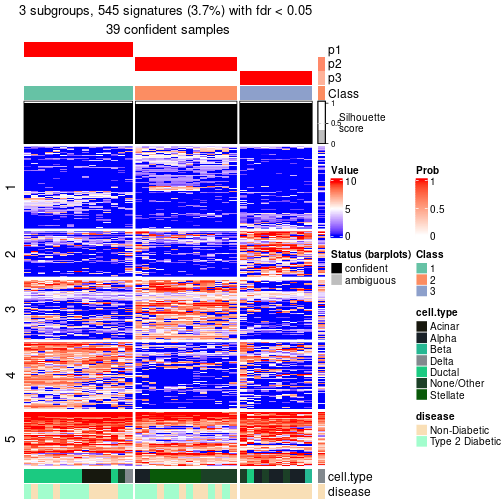</p>

</div>
<div id='tab-node-0122-get-signatures-no-scale-3'>
<pre><code class="r">get_signatures(res, k = 4, scale_rows = FALSE)
</code></pre>

<p></p>

</div>
</div>


Compare the overlap of signatures from different k:

```r
compare_signatures(res)
```


`get_signature()` returns a data frame invisibly. To get the list of signatures, the function
call should be assigned to a variable explicitly. In following code, if `plot` argument is set
to `FALSE`, no heatmap is plotted while only the differential analysis is performed.

```r
# code only for demonstration
tb = get_signature(res, k = ..., plot = FALSE)
```

An example of the output of `tb` is:

```
#>   which_row         fdr    mean_1    mean_2 scaled_mean_1 scaled_mean_2 km
#> 1        38 0.042760348  8.373488  9.131774    -0.5533452     0.5164555  1
#> 2        40 0.018707592  7.106213  8.469186    -0.6173731     0.5762149  1
#> 3        55 0.019134737 10.221463 11.207825    -0.6159697     0.5749050  1
#> 4        59 0.006059896  5.921854  7.869574    -0.6899429     0.6439467  1
#> 5        60 0.018055526  8.928898 10.211722    -0.6204761     0.5791110  1
#> 6        98 0.009384629 15.714769 14.887706     0.6635654    -0.6193277  2
...
```

The columns in `tb` are:

1. `which_row`: row indices corresponding to the input matrix.
2. `fdr`: FDR for the differential test. 
3. `mean_x`: The mean value in group x.
4. `scaled_mean_x`: The mean value in group x after rows are scaled.
5. `km`: Row groups if k-means clustering is applied to rows (which is done by automatically selecting number of clusters).

If there are too many signatures, `top_signatures = ...` can be set to only show the 
signatures with the highest FDRs:

```r
# code only for demonstration
# e.g. to show the top 500 most significant rows
tb = get_signature(res, k = ..., top_signatures = 500)
```

If the signatures are defined as these which are uniquely high in current group, `diff_method` argument
can be set to `"uniquely_high_in_one_group"`:

```r
# code only for demonstration
tb = get_signature(res, k = ..., diff_method = "uniquely_high_in_one_group")
```


UMAP plot which shows how samples are separated.


<script>
$( function() {
	$( '#tabs-node-0122-dimension-reduction' ).tabs();
} );
</script>
<div id='tabs-node-0122-dimension-reduction'>
<ul>
<li><a href='#tab-node-0122-dimension-reduction-1'>k = 2</a></li>
<li><a href='#tab-node-0122-dimension-reduction-2'>k = 3</a></li>
<li><a href='#tab-node-0122-dimension-reduction-3'>k = 4</a></li>
</ul>
<div id='tab-node-0122-dimension-reduction-1'>
<pre><code class="r">dimension_reduction(res, k = 2, method = &quot;UMAP&quot;)
</code></pre>

<p></p>

</div>
<div id='tab-node-0122-dimension-reduction-2'>
<pre><code class="r">dimension_reduction(res, k = 3, method = &quot;UMAP&quot;)
</code></pre>

<p></p>

</div>
<div id='tab-node-0122-dimension-reduction-3'>
<pre><code class="r">dimension_reduction(res, k = 4, method = &quot;UMAP&quot;)
</code></pre>

<p></p>

</div>
</div>


Following heatmap shows how subgroups are split when increasing `k`:

```r
collect_classes(res)
```


Test correlation between subgroups and known annotations. If the known
annotation is numeric, one-way ANOVA test is applied, and if the known
annotation is discrete, chi-squared contingency table test is applied.

```r
test_to_known_factors(res)
```

```
#>             n_sample cell.type(p-value) disease(p-value) k
#> ATC:skmeans       40           1.08e-04          0.26704 2
#> ATC:skmeans       39           6.17e-06          0.00547 3
#> ATC:skmeans       32           6.45e-07          0.01359 4
```


If matrix rows can be associated to genes, consider to use `functional_enrichment(res,
...)` to perform function enrichment for the signature genes. See [this vignette](https://jokergoo.github.io/cola_vignettes/functional_enrichment.html) for more detailed explanations.


 

---------------------------------------------------


### Node0123


Parent node: [Node012](#Node012).
Child nodes: 
                Node01111-leaf
        ,
                Node01112-leaf
        ,
                Node01121-leaf
        ,
                Node01122-leaf
        ,
                Node01131-leaf
        ,
                [Node01132](#Node01132)
        ,
                Node01221-leaf
        ,
                Node01222-leaf
        ,
                Node01223-leaf
        ,
                Node01231-leaf
        ,
                Node01232-leaf
        .


The object with results only for a single top-value method and a single partitioning method 
can be extracted as:

```r
res = res_rh["0123"]
```

A summary of `res` and all the functions that can be applied to it:

```r
res
```

```
#> A 'ConsensusPartition' object with k = 2, 3, 4.
#>   On a matrix with 13411 rows and 36 columns.
#>   Top rows (1324) are extracted by 'ATC' method.
#>   Subgroups are detected by 'skmeans' method.
#>   Performed in total 150 partitions by row resampling.
#>   Best k for subgroups seems to be 4.
#> 
#> Following methods can be applied to this 'ConsensusPartition' object:
#>  [1] "cola_report"             "collect_classes"         "collect_plots"          
#>  [4] "collect_stats"           "colnames"                "compare_partitions"     
#>  [7] "compare_signatures"      "consensus_heatmap"       "dimension_reduction"    
#> [10] "functional_enrichment"   "get_anno_col"            "get_anno"               
#> [13] "get_classes"             "get_consensus"           "get_matrix"             
#> [16] "get_membership"          "get_param"               "get_signatures"         
#> [19] "get_stats"               "is_best_k"               "is_stable_k"            
#> [22] "membership_heatmap"      "ncol"                    "nrow"                   
#> [25] "plot_ecdf"               "predict_classes"         "rownames"               
#> [28] "select_partition_number" "show"                    "suggest_best_k"         
#> [31] "test_to_known_factors"   "top_rows_heatmap"
```

`collect_plots()` function collects all the plots made from `res` for all `k` (number of subgroups)
into one single page to provide an easy and fast comparison between different `k`.

```r
collect_plots(res)
```


The plots are:

- The first row: a plot of the eCDF (empirical cumulative distribution
  function) curves of the consensus matrix for each `k` and the heatmap of
  predicted classes for each `k`.
- The second row: heatmaps of the consensus matrix for each `k`.
- The third row: heatmaps of the membership matrix for each `k`.
- The fouth row: heatmaps of the signatures for each `k`.

All the plots in panels can be made by individual functions and they are
plotted later in this section.

`select_partition_number()` produces several plots showing different
statistics for choosing "optimized" `k`. There are following statistics:

- eCDF curves of the consensus matrix for each `k`;
- 1-PAC. [The PAC score](https://en.wikipedia.org/wiki/Consensus_clustering#Over-interpretation_potential_of_consensus_clustering)
  measures the proportion of the ambiguous subgrouping.
- Mean silhouette score.
- Concordance. The mean probability of fiting the consensus subgroup labels in all
  partitions.
- Area increased. Denote $A_k$ as the area under the eCDF curve for current
  `k`, the area increased is defined as $A_k - A_{k-1}$.
- Rand index. The percent of pairs of samples that are both in a same cluster
  or both are not in a same cluster in the partition of k and k-1.
- Jaccard index. The ratio of pairs of samples are both in a same cluster in
  the partition of k and k-1 and the pairs of samples are both in a same
  cluster in the partition k or k-1.

The detailed explanations of these statistics can be found in [the _cola_
vignette](https://jokergoo.github.io/cola_vignettes/cola.html#toc_13).

Generally speaking, higher 1-PAC score, higher mean silhouette score or higher
concordance corresponds to better partition. Rand index and Jaccard index
measure how similar the current partition is compared to partition with `k-1`.
If they are too similar, we won't accept `k` is better than `k-1`.

```r
select_partition_number(res)
```


The numeric values for all these statistics can be obtained by `get_stats()`.

```r
get_stats(res)
```

```
#>   k 1-PAC mean_silhouette concordance area_increased  Rand Jaccard
#> 2 2 1.000           1.000       1.000          0.515 0.486   0.486
#> 3 3 1.000           0.934       0.977          0.252 0.833   0.669
#> 4 4 0.968           0.949       0.970          0.183 0.854   0.603
```

`suggest_best_k()` suggests the best $k$ based on these statistics. The rules are as follows:

- All $k$ with Jaccard index larger than 0.95 are removed because increasing
  $k$ does not provide enough extra information. If all $k$ are removed, it is
  marked as no subgroup is detected.
- For all $k$ with 1-PAC score larger than 0.9, the maximal $k$ is taken as
  the best $k$, and other $k$ are marked as optional $k$.
- If it does not fit the second rule. The $k$ with the maximal vote of the
  highest 1-PAC score, highest mean silhouette, and highest concordance is
  taken as the best $k$.

```r
suggest_best_k(res)
```

```
#> [1] 4
#> attr(,"optional")
#> [1] 2 3
```

There is also optional best $k$ = 2 3 that is worth to check.

Following is the table of the partitions (You need to click the **show/hide
code output** link to see it). The membership matrix (columns with name `p*`)
is inferred by
[`clue::cl_consensus()`](https://www.rdocumentation.org/link/cl_consensus?package=clue)
function with the `SE` method. Basically the value in the membership matrix
represents the probability to belong to a certain group. The finall subgroup
label for an item is determined with the group with highest probability it
belongs to.

In `get_classes()` function, the entropy is calculated from the membership
matrix and the silhouette score is calculated from the consensus matrix.


<script>
$( function() {
	$( '#tabs-node-0123-get-classes' ).tabs();
} );
</script>
<div id='tabs-node-0123-get-classes'>
<ul>
<li><a href='#tab-node-0123-get-classes-1'>k = 2</a></li>
<li><a href='#tab-node-0123-get-classes-2'>k = 3</a></li>
<li><a href='#tab-node-0123-get-classes-3'>k = 4</a></li>
</ul>

<div id='tab-node-0123-get-classes-1'>
<p><a id='tab-node-0123-get-classes-1-a' style='color:#0366d6' href='#'>show/hide code output</a></p>
<pre><code class="r">cbind(get_classes(res, k = 2), get_membership(res, k = 2))
</code></pre>

<pre><code>#&gt;               class entropy silhouette p1 p2
#&gt; 10th_C10_S104     1       0          1  1  0
#&gt; 10th_C16_S105     1       0          1  1  0
#&gt; 10th_C23_S98      2       0          1  0  1
#&gt; 10th_C24_S90      1       0          1  1  0
#&gt; 10th_C41_S101     2       0          1  0  1
#&gt; 10th_C54_S124     1       0          1  1  0
#&gt; 10th_C68_S75      1       0          1  1  0
#&gt; 10th_C8_S52       2       0          1  0  1
#&gt; 11th-C16_S64      1       0          1  1  0
#&gt; 11th-C33_S20      1       0          1  1  0
#&gt; 11th-C36_S67      2       0          1  0  1
#&gt; 11th-C39_S21      2       0          1  0  1
#&gt; 11th-C61_S25      2       0          1  0  1
#&gt; 12th-C20_S191     2       0          1  0  1
#&gt; 12th-C85_S137     2       0          1  0  1
#&gt; 2nd-C25_S49       2       0          1  0  1
#&gt; 2nd-C76_S60       2       0          1  0  1
#&gt; 3rd-C1_S39        2       0          1  0  1
#&gt; 3rd-C20_S22       1       0          1  1  0
#&gt; 3rd-C46_S93       2       0          1  0  1
#&gt; 3rd-C87_S88       2       0          1  0  1
#&gt; 4th-C43_S85       1       0          1  1  0
#&gt; 4th-C70_S46       1       0          1  1  0
#&gt; 5th-C12_S90       1       0          1  1  0
#&gt; 6th-C53_S10       1       0          1  1  0
#&gt; 7th-C17_S29       1       0          1  1  0
#&gt; 7th-C44_S76       1       0          1  1  0
#&gt; 7th-C56_S15       1       0          1  1  0
#&gt; 7th-C68_S38       1       0          1  1  0
#&gt; 7th-C88_S75       1       0          1  1  0
#&gt; 8th-C20_S116      2       0          1  0  1
#&gt; 8th-C6_S88        2       0          1  0  1
#&gt; 8th-C92_S157      2       0          1  0  1
#&gt; 9th-C28_S50       2       0          1  0  1
#&gt; 9th-C40_S69       1       0          1  1  0
#&gt; 9th-C66_S33       2       0          1  0  1
</code></pre>

<script>
$('#tab-node-0123-get-classes-1-a').parent().next().next().hide();
$('#tab-node-0123-get-classes-1-a').click(function(){
  $('#tab-node-0123-get-classes-1-a').parent().next().next().toggle();
  return(false);
});
</script>
</div>

<div id='tab-node-0123-get-classes-2'>
<p><a id='tab-node-0123-get-classes-2-a' style='color:#0366d6' href='#'>show/hide code output</a></p>
<pre><code class="r">cbind(get_classes(res, k = 3), get_membership(res, k = 3))
</code></pre>

<pre><code>#&gt;               class entropy silhouette   p1   p2   p3
#&gt; 10th_C10_S104     1  0.0000      0.910 1.00 0.00 0.00
#&gt; 10th_C16_S105     1  0.0000      0.910 1.00 0.00 0.00
#&gt; 10th_C23_S98      2  0.0000      1.000 0.00 1.00 0.00
#&gt; 10th_C24_S90      1  0.0000      0.910 1.00 0.00 0.00
#&gt; 10th_C41_S101     2  0.0000      1.000 0.00 1.00 0.00
#&gt; 10th_C54_S124     1  0.5948      0.401 0.64 0.00 0.36
#&gt; 10th_C68_S75      1  0.0000      0.910 1.00 0.00 0.00
#&gt; 10th_C8_S52       2  0.0000      1.000 0.00 1.00 0.00
#&gt; 11th-C16_S64      3  0.0000      1.000 0.00 0.00 1.00
#&gt; 11th-C33_S20      1  0.0000      0.910 1.00 0.00 0.00
#&gt; 11th-C36_S67      1  0.6280      0.142 0.54 0.46 0.00
#&gt; 11th-C39_S21      2  0.0000      1.000 0.00 1.00 0.00
#&gt; 11th-C61_S25      2  0.0000      1.000 0.00 1.00 0.00
#&gt; 12th-C20_S191     2  0.0000      1.000 0.00 1.00 0.00
#&gt; 12th-C85_S137     2  0.0000      1.000 0.00 1.00 0.00
#&gt; 2nd-C25_S49       2  0.0000      1.000 0.00 1.00 0.00
#&gt; 2nd-C76_S60       2  0.0000      1.000 0.00 1.00 0.00
#&gt; 3rd-C1_S39        2  0.0000      1.000 0.00 1.00 0.00
#&gt; 3rd-C20_S22       3  0.0000      1.000 0.00 0.00 1.00
#&gt; 3rd-C46_S93       2  0.0000      1.000 0.00 1.00 0.00
#&gt; 3rd-C87_S88       2  0.0000      1.000 0.00 1.00 0.00
#&gt; 4th-C43_S85       1  0.0892      0.895 0.98 0.00 0.02
#&gt; 4th-C70_S46       3  0.0000      1.000 0.00 0.00 1.00
#&gt; 5th-C12_S90       1  0.0000      0.910 1.00 0.00 0.00
#&gt; 6th-C53_S10       3  0.0000      1.000 0.00 0.00 1.00
#&gt; 7th-C17_S29       3  0.0000      1.000 0.00 0.00 1.00
#&gt; 7th-C44_S76       1  0.0000      0.910 1.00 0.00 0.00
#&gt; 7th-C56_S15       1  0.0000      0.910 1.00 0.00 0.00
#&gt; 7th-C68_S38       3  0.0000      1.000 0.00 0.00 1.00
#&gt; 7th-C88_S75       3  0.0000      1.000 0.00 0.00 1.00
#&gt; 8th-C20_S116      2  0.0000      1.000 0.00 1.00 0.00
#&gt; 8th-C6_S88        2  0.0000      1.000 0.00 1.00 0.00
#&gt; 8th-C92_S157      2  0.0000      1.000 0.00 1.00 0.00
#&gt; 9th-C28_S50       2  0.0000      1.000 0.00 1.00 0.00
#&gt; 9th-C40_S69       1  0.0000      0.910 1.00 0.00 0.00
#&gt; 9th-C66_S33       2  0.0000      1.000 0.00 1.00 0.00
</code></pre>

<script>
$('#tab-node-0123-get-classes-2-a').parent().next().next().hide();
$('#tab-node-0123-get-classes-2-a').click(function(){
  $('#tab-node-0123-get-classes-2-a').parent().next().next().toggle();
  return(false);
});
</script>
</div>

<div id='tab-node-0123-get-classes-3'>
<p><a id='tab-node-0123-get-classes-3-a' style='color:#0366d6' href='#'>show/hide code output</a></p>
<pre><code class="r">cbind(get_classes(res, k = 4), get_membership(res, k = 4))
</code></pre>

<pre><code>#&gt;               class entropy silhouette   p1   p2   p3   p4
#&gt; 10th_C10_S104     1  0.0000      0.970 1.00 0.00 0.00 0.00
#&gt; 10th_C16_S105     1  0.0000      0.970 1.00 0.00 0.00 0.00
#&gt; 10th_C23_S98      2  0.0000      0.946 0.00 1.00 0.00 0.00
#&gt; 10th_C24_S90      1  0.0000      0.970 1.00 0.00 0.00 0.00
#&gt; 10th_C41_S101     2  0.0707      0.942 0.00 0.98 0.00 0.02
#&gt; 10th_C54_S124     1  0.3975      0.679 0.76 0.00 0.24 0.00
#&gt; 10th_C68_S75      1  0.0000      0.970 1.00 0.00 0.00 0.00
#&gt; 10th_C8_S52       2  0.0000      0.946 0.00 1.00 0.00 0.00
#&gt; 11th-C16_S64      3  0.0000      0.989 0.00 0.00 1.00 0.00
#&gt; 11th-C33_S20      1  0.0000      0.970 1.00 0.00 0.00 0.00
#&gt; 11th-C36_S67      2  0.5744      0.718 0.16 0.74 0.02 0.08
#&gt; 11th-C39_S21      4  0.0707      0.988 0.00 0.02 0.00 0.98
#&gt; 11th-C61_S25      2  0.2647      0.856 0.00 0.88 0.00 0.12
#&gt; 12th-C20_S191     4  0.1637      0.960 0.00 0.06 0.00 0.94
#&gt; 12th-C85_S137     2  0.0000      0.946 0.00 1.00 0.00 0.00
#&gt; 2nd-C25_S49       4  0.0707      0.988 0.00 0.02 0.00 0.98
#&gt; 2nd-C76_S60       2  0.1637      0.912 0.00 0.94 0.00 0.06
#&gt; 3rd-C1_S39        4  0.0707      0.988 0.00 0.02 0.00 0.98
#&gt; 3rd-C20_S22       3  0.0000      0.989 0.00 0.00 1.00 0.00
#&gt; 3rd-C46_S93       2  0.0707      0.942 0.00 0.98 0.00 0.02
#&gt; 3rd-C87_S88       2  0.0000      0.946 0.00 1.00 0.00 0.00
#&gt; 4th-C43_S85       1  0.0707      0.959 0.98 0.00 0.00 0.02
#&gt; 4th-C70_S46       3  0.0000      0.989 0.00 0.00 1.00 0.00
#&gt; 5th-C12_S90       1  0.0000      0.970 1.00 0.00 0.00 0.00
#&gt; 6th-C53_S10       3  0.1637      0.934 0.06 0.00 0.94 0.00
#&gt; 7th-C17_S29       3  0.0000      0.989 0.00 0.00 1.00 0.00
#&gt; 7th-C44_S76       1  0.0000      0.970 1.00 0.00 0.00 0.00
#&gt; 7th-C56_S15       1  0.1411      0.945 0.96 0.02 0.00 0.02
#&gt; 7th-C68_S38       3  0.0000      0.989 0.00 0.00 1.00 0.00
#&gt; 7th-C88_S75       3  0.0000      0.989 0.00 0.00 1.00 0.00
#&gt; 8th-C20_S116      4  0.1637      0.960 0.00 0.06 0.00 0.94
#&gt; 8th-C6_S88        4  0.0707      0.988 0.00 0.02 0.00 0.98
#&gt; 8th-C92_S157      4  0.0707      0.988 0.00 0.02 0.00 0.98
#&gt; 9th-C28_S50       4  0.0707      0.988 0.00 0.02 0.00 0.98
#&gt; 9th-C40_S69       1  0.0000      0.970 1.00 0.00 0.00 0.00
#&gt; 9th-C66_S33       2  0.0000      0.946 0.00 1.00 0.00 0.00
</code></pre>

<script>
$('#tab-node-0123-get-classes-3-a').parent().next().next().hide();
$('#tab-node-0123-get-classes-3-a').click(function(){
  $('#tab-node-0123-get-classes-3-a').parent().next().next().toggle();
  return(false);
});
</script>
</div>
</div>

Heatmaps for the consensus matrix. It visualizes the probability of two
samples to be in a same group.


<script>
$( function() {
	$( '#tabs-node-0123-consensus-heatmap' ).tabs();
} );
</script>
<div id='tabs-node-0123-consensus-heatmap'>
<ul>
<li><a href='#tab-node-0123-consensus-heatmap-1'>k = 2</a></li>
<li><a href='#tab-node-0123-consensus-heatmap-2'>k = 3</a></li>
<li><a href='#tab-node-0123-consensus-heatmap-3'>k = 4</a></li>
</ul>
<div id='tab-node-0123-consensus-heatmap-1'>
<pre><code class="r">consensus_heatmap(res, k = 2)
</code></pre>

<p></p>

</div>
<div id='tab-node-0123-consensus-heatmap-2'>
<pre><code class="r">consensus_heatmap(res, k = 3)
</code></pre>

<p></p>

</div>
<div id='tab-node-0123-consensus-heatmap-3'>
<pre><code class="r">consensus_heatmap(res, k = 4)
</code></pre>

<p></p>

</div>
</div>

Heatmaps for the membership of samples in all partitions to see how consistent they are:


<script>
$( function() {
	$( '#tabs-node-0123-membership-heatmap' ).tabs();
} );
</script>
<div id='tabs-node-0123-membership-heatmap'>
<ul>
<li><a href='#tab-node-0123-membership-heatmap-1'>k = 2</a></li>
<li><a href='#tab-node-0123-membership-heatmap-2'>k = 3</a></li>
<li><a href='#tab-node-0123-membership-heatmap-3'>k = 4</a></li>
</ul>
<div id='tab-node-0123-membership-heatmap-1'>
<pre><code class="r">membership_heatmap(res, k = 2)
</code></pre>

<p></p>

</div>
<div id='tab-node-0123-membership-heatmap-2'>
<pre><code class="r">membership_heatmap(res, k = 3)
</code></pre>

<p></p>

</div>
<div id='tab-node-0123-membership-heatmap-3'>
<pre><code class="r">membership_heatmap(res, k = 4)
</code></pre>

<p></p>

</div>
</div>

As soon as the classes for columns are determined, the signatures
that are significantly different between subgroups can be looked for. 
Following are the heatmaps for signatures.


Signature heatmaps where rows are scaled:


<script>
$( function() {
	$( '#tabs-node-0123-get-signatures' ).tabs();
} );
</script>
<div id='tabs-node-0123-get-signatures'>
<ul>
<li><a href='#tab-node-0123-get-signatures-1'>k = 2</a></li>
<li><a href='#tab-node-0123-get-signatures-2'>k = 3</a></li>
<li><a href='#tab-node-0123-get-signatures-3'>k = 4</a></li>
</ul>
<div id='tab-node-0123-get-signatures-1'>
<pre><code class="r">get_signatures(res, k = 2)
</code></pre>

<p></p>

</div>
<div id='tab-node-0123-get-signatures-2'>
<pre><code class="r">get_signatures(res, k = 3)
</code></pre>

<p></p>

</div>
<div id='tab-node-0123-get-signatures-3'>
<pre><code class="r">get_signatures(res, k = 4)
</code></pre>

<p></p>

</div>
</div>


Signature heatmaps where rows are not scaled:


<script>
$( function() {
	$( '#tabs-node-0123-get-signatures-no-scale' ).tabs();
} );
</script>
<div id='tabs-node-0123-get-signatures-no-scale'>
<ul>
<li><a href='#tab-node-0123-get-signatures-no-scale-1'>k = 2</a></li>
<li><a href='#tab-node-0123-get-signatures-no-scale-2'>k = 3</a></li>
<li><a href='#tab-node-0123-get-signatures-no-scale-3'>k = 4</a></li>
</ul>
<div id='tab-node-0123-get-signatures-no-scale-1'>
<pre><code class="r">get_signatures(res, k = 2, scale_rows = FALSE)
</code></pre>

<p></p>

</div>
<div id='tab-node-0123-get-signatures-no-scale-2'>
<pre><code class="r">get_signatures(res, k = 3, scale_rows = FALSE)
</code></pre>

<p></p>

</div>
<div id='tab-node-0123-get-signatures-no-scale-3'>
<pre><code class="r">get_signatures(res, k = 4, scale_rows = FALSE)
</code></pre>

<p></p>

</div>
</div>


Compare the overlap of signatures from different k:

```r
compare_signatures(res)
```


`get_signature()` returns a data frame invisibly. To get the list of signatures, the function
call should be assigned to a variable explicitly. In following code, if `plot` argument is set
to `FALSE`, no heatmap is plotted while only the differential analysis is performed.

```r
# code only for demonstration
tb = get_signature(res, k = ..., plot = FALSE)
```

An example of the output of `tb` is:

```
#>   which_row         fdr    mean_1    mean_2 scaled_mean_1 scaled_mean_2 km
#> 1        38 0.042760348  8.373488  9.131774    -0.5533452     0.5164555  1
#> 2        40 0.018707592  7.106213  8.469186    -0.6173731     0.5762149  1
#> 3        55 0.019134737 10.221463 11.207825    -0.6159697     0.5749050  1
#> 4        59 0.006059896  5.921854  7.869574    -0.6899429     0.6439467  1
#> 5        60 0.018055526  8.928898 10.211722    -0.6204761     0.5791110  1
#> 6        98 0.009384629 15.714769 14.887706     0.6635654    -0.6193277  2
...
```

The columns in `tb` are:

1. `which_row`: row indices corresponding to the input matrix.
2. `fdr`: FDR for the differential test. 
3. `mean_x`: The mean value in group x.
4. `scaled_mean_x`: The mean value in group x after rows are scaled.
5. `km`: Row groups if k-means clustering is applied to rows (which is done by automatically selecting number of clusters).

If there are too many signatures, `top_signatures = ...` can be set to only show the 
signatures with the highest FDRs:

```r
# code only for demonstration
# e.g. to show the top 500 most significant rows
tb = get_signature(res, k = ..., top_signatures = 500)
```

If the signatures are defined as these which are uniquely high in current group, `diff_method` argument
can be set to `"uniquely_high_in_one_group"`:

```r
# code only for demonstration
tb = get_signature(res, k = ..., diff_method = "uniquely_high_in_one_group")
```


UMAP plot which shows how samples are separated.


<script>
$( function() {
	$( '#tabs-node-0123-dimension-reduction' ).tabs();
} );
</script>
<div id='tabs-node-0123-dimension-reduction'>
<ul>
<li><a href='#tab-node-0123-dimension-reduction-1'>k = 2</a></li>
<li><a href='#tab-node-0123-dimension-reduction-2'>k = 3</a></li>
<li><a href='#tab-node-0123-dimension-reduction-3'>k = 4</a></li>
</ul>
<div id='tab-node-0123-dimension-reduction-1'>
<pre><code class="r">dimension_reduction(res, k = 2, method = &quot;UMAP&quot;)
</code></pre>

<p></p>

</div>
<div id='tab-node-0123-dimension-reduction-2'>
<pre><code class="r">dimension_reduction(res, k = 3, method = &quot;UMAP&quot;)
</code></pre>

<p></p>

</div>
<div id='tab-node-0123-dimension-reduction-3'>
<pre><code class="r">dimension_reduction(res, k = 4, method = &quot;UMAP&quot;)
</code></pre>

<p></p>

</div>
</div>


Following heatmap shows how subgroups are split when increasing `k`:

```r
collect_classes(res)
```


Test correlation between subgroups and known annotations. If the known
annotation is numeric, one-way ANOVA test is applied, and if the known
annotation is discrete, chi-squared contingency table test is applied.

```r
test_to_known_factors(res)
```

```
#>             n_sample cell.type(p-value) disease(p-value) k
#> ATC:skmeans       36            0.00120            1.000 2
#> ATC:skmeans       34            0.00973            0.413 3
#> ATC:skmeans       36            0.00133            0.221 4
```


If matrix rows can be associated to genes, consider to use `functional_enrichment(res,
...)` to perform function enrichment for the signature genes. See [this vignette](https://jokergoo.github.io/cola_vignettes/functional_enrichment.html) for more detailed explanations.


 

---------------------------------------------------


### Node02


Parent node: [Node0](#Node0).
Child nodes: 
                [Node011](#Node011)
        ,
                [Node012](#Node012)
        ,
                [Node021](#Node021)
        ,
                [Node022](#Node022)
        ,
                [Node023](#Node023)
        ,
                Node024-leaf
        .


The object with results only for a single top-value method and a single partitioning method 
can be extracted as:

```r
res = res_rh["02"]
```

A summary of `res` and all the functions that can be applied to it:

```r
res
```

```
#> A 'ConsensusPartition' object with k = 2, 3, 4.
#>   On a matrix with 13873 rows and 261 columns.
#>   Top rows (1387) are extracted by 'ATC' method.
#>   Subgroups are detected by 'skmeans' method.
#>   Performed in total 150 partitions by row resampling.
#>   Best k for subgroups seems to be 4.
#> 
#> Following methods can be applied to this 'ConsensusPartition' object:
#>  [1] "cola_report"             "collect_classes"         "collect_plots"          
#>  [4] "collect_stats"           "colnames"                "compare_partitions"     
#>  [7] "compare_signatures"      "consensus_heatmap"       "dimension_reduction"    
#> [10] "functional_enrichment"   "get_anno_col"            "get_anno"               
#> [13] "get_classes"             "get_consensus"           "get_matrix"             
#> [16] "get_membership"          "get_param"               "get_signatures"         
#> [19] "get_stats"               "is_best_k"               "is_stable_k"            
#> [22] "membership_heatmap"      "ncol"                    "nrow"                   
#> [25] "plot_ecdf"               "predict_classes"         "rownames"               
#> [28] "select_partition_number" "show"                    "suggest_best_k"         
#> [31] "test_to_known_factors"   "top_rows_heatmap"
```

`collect_plots()` function collects all the plots made from `res` for all `k` (number of subgroups)
into one single page to provide an easy and fast comparison between different `k`.

```r
collect_plots(res)
```


The plots are:

- The first row: a plot of the eCDF (empirical cumulative distribution
  function) curves of the consensus matrix for each `k` and the heatmap of
  predicted classes for each `k`.
- The second row: heatmaps of the consensus matrix for each `k`.
- The third row: heatmaps of the membership matrix for each `k`.
- The fouth row: heatmaps of the signatures for each `k`.

All the plots in panels can be made by individual functions and they are
plotted later in this section.

`select_partition_number()` produces several plots showing different
statistics for choosing "optimized" `k`. There are following statistics:

- eCDF curves of the consensus matrix for each `k`;
- 1-PAC. [The PAC score](https://en.wikipedia.org/wiki/Consensus_clustering#Over-interpretation_potential_of_consensus_clustering)
  measures the proportion of the ambiguous subgrouping.
- Mean silhouette score.
- Concordance. The mean probability of fiting the consensus subgroup labels in all
  partitions.
- Area increased. Denote $A_k$ as the area under the eCDF curve for current
  `k`, the area increased is defined as $A_k - A_{k-1}$.
- Rand index. The percent of pairs of samples that are both in a same cluster
  or both are not in a same cluster in the partition of k and k-1.
- Jaccard index. The ratio of pairs of samples are both in a same cluster in
  the partition of k and k-1 and the pairs of samples are both in a same
  cluster in the partition k or k-1.

The detailed explanations of these statistics can be found in [the _cola_
vignette](https://jokergoo.github.io/cola_vignettes/cola.html#toc_13).

Generally speaking, higher 1-PAC score, higher mean silhouette score or higher
concordance corresponds to better partition. Rand index and Jaccard index
measure how similar the current partition is compared to partition with `k-1`.
If they are too similar, we won't accept `k` is better than `k-1`.

```r
select_partition_number(res)
```


The numeric values for all these statistics can be obtained by `get_stats()`.

```r
get_stats(res)
```

```
#>   k 1-PAC mean_silhouette concordance area_increased  Rand Jaccard
#> 2 2 0.771           0.939       0.969          0.499 0.503   0.503
#> 3 3 0.982           0.972       0.988          0.272 0.811   0.642
#> 4 4 1.000           0.979       0.991          0.155 0.856   0.631
```

`suggest_best_k()` suggests the best $k$ based on these statistics. The rules are as follows:

- All $k$ with Jaccard index larger than 0.95 are removed because increasing
  $k$ does not provide enough extra information. If all $k$ are removed, it is
  marked as no subgroup is detected.
- For all $k$ with 1-PAC score larger than 0.9, the maximal $k$ is taken as
  the best $k$, and other $k$ are marked as optional $k$.
- If it does not fit the second rule. The $k$ with the maximal vote of the
  highest 1-PAC score, highest mean silhouette, and highest concordance is
  taken as the best $k$.

```r
suggest_best_k(res)
```

```
#> [1] 4
#> attr(,"optional")
#> [1] 3
```

There is also optional best $k$ = 3 that is worth to check.

Following is the table of the partitions (You need to click the **show/hide
code output** link to see it). The membership matrix (columns with name `p*`)
is inferred by
[`clue::cl_consensus()`](https://www.rdocumentation.org/link/cl_consensus?package=clue)
function with the `SE` method. Basically the value in the membership matrix
represents the probability to belong to a certain group. The finall subgroup
label for an item is determined with the group with highest probability it
belongs to.

In `get_classes()` function, the entropy is calculated from the membership
matrix and the silhouette score is calculated from the consensus matrix.


<script>
$( function() {
	$( '#tabs-node-02-get-classes' ).tabs();
} );
</script>
<div id='tabs-node-02-get-classes'>
<ul>
<li><a href='#tab-node-02-get-classes-1'>k = 2</a></li>
<li><a href='#tab-node-02-get-classes-2'>k = 3</a></li>
<li><a href='#tab-node-02-get-classes-3'>k = 4</a></li>
</ul>

<div id='tab-node-02-get-classes-1'>
<p><a id='tab-node-02-get-classes-1-a' style='color:#0366d6' href='#'>show/hide code output</a></p>
<pre><code class="r">cbind(get_classes(res, k = 2), get_membership(res, k = 2))
</code></pre>

<pre><code>#&gt;               class entropy silhouette   p1   p2
#&gt; 10th_C11_S96      1   0.000      0.979 1.00 0.00
#&gt; 10th_C17_S97      1   0.000      0.979 1.00 0.00
#&gt; 10th_C28_S91      2   0.000      0.957 0.00 1.00
#&gt; 10th_C32_S56      1   0.000      0.979 1.00 0.00
#&gt; 10th_C33_S64      1   0.000      0.979 1.00 0.00
#&gt; 10th_C34_S92      2   0.000      0.957 0.00 1.00
#&gt; 10th_C37_S49      1   0.000      0.979 1.00 0.00
#&gt; 10th_C42_S109     2   0.634      0.842 0.16 0.84
#&gt; 10th_C43_S50      2   0.000      0.957 0.00 1.00
#&gt; 10th_C50_S73      2   0.000      0.957 0.00 1.00
#&gt; 10th_C51_S80      2   0.904      0.523 0.32 0.68
#&gt; 10th_C52_S110     2   0.000      0.957 0.00 1.00
#&gt; 10th_C53_S118     2   0.000      0.957 0.00 1.00
#&gt; 10th_C57_S81      2   0.000      0.957 0.00 1.00
#&gt; 10th_C58_S111     2   0.000      0.957 0.00 1.00
#&gt; 10th_C5_S95       2   0.000      0.957 0.00 1.00
#&gt; 10th_C61_S68      1   0.000      0.979 1.00 0.00
#&gt; 10th_C63_S82      2   0.242      0.934 0.04 0.96
#&gt; 10th_C64_S112     1   0.000      0.979 1.00 0.00
#&gt; 10th_C66_S126     1   0.000      0.979 1.00 0.00
#&gt; 10th_C6_S88       2   0.000      0.957 0.00 1.00
#&gt; 10th_C77_S120     2   0.634      0.842 0.16 0.84
#&gt; 10th_C78_S114     2   0.000      0.957 0.00 1.00
#&gt; 10th_C80_S77      2   0.634      0.842 0.16 0.84
#&gt; 10th_C86_S78      2   0.634      0.842 0.16 0.84
#&gt; 10th_C87_S71      2   0.634      0.842 0.16 0.84
#&gt; 10th_C95_S123     2   0.000      0.957 0.00 1.00
#&gt; 11th-C10_S63      2   0.000      0.957 0.00 1.00
#&gt; 11th-C12_S47      2   0.327      0.921 0.06 0.94
#&gt; 11th-C21_S4       1   0.000      0.979 1.00 0.00
#&gt; 11th-C22_S65      1   0.000      0.979 1.00 0.00
#&gt; 11th-C26_S12      2   0.242      0.934 0.04 0.96
#&gt; 11th-C27_S19      1   0.000      0.979 1.00 0.00
#&gt; 11th-C2_S8        2   0.634      0.842 0.16 0.84
#&gt; 11th-C30_S66      2   0.000      0.957 0.00 1.00
#&gt; 11th-C37_S6       2   0.000      0.957 0.00 1.00
#&gt; 11th-C43_S7       2   0.000      0.957 0.00 1.00
#&gt; 11th-C4_S62       2   0.000      0.957 0.00 1.00
#&gt; 11th-C54_S86      1   0.000      0.979 1.00 0.00
#&gt; 11th-C55_S24      2   0.000      0.957 0.00 1.00
#&gt; 11th-C56_S32      2   0.000      0.957 0.00 1.00
#&gt; 11th-C57_S40      1   0.634      0.821 0.84 0.16
#&gt; 11th-C62_S33      2   0.000      0.957 0.00 1.00
#&gt; 11th-C64_S72      2   0.634      0.842 0.16 0.84
#&gt; 11th-C67_S26      2   0.000      0.957 0.00 1.00
#&gt; 11th-C77_S82      2   0.634      0.842 0.16 0.84
#&gt; 11th-C93_S30      2   0.000      0.957 0.00 1.00
#&gt; 12th-C10_S155     1   0.000      0.979 1.00 0.00
#&gt; 12th-C15_S183     1   0.000      0.979 1.00 0.00
#&gt; 12th-C1_S195      2   0.000      0.957 0.00 1.00
#&gt; 12th-C21_S184     1   0.584      0.843 0.86 0.14
#&gt; 12th-C23_S149     2   0.000      0.957 0.00 1.00
#&gt; 12th-C35_S151     1   0.000      0.979 1.00 0.00
#&gt; 12th-C36_S158     2   0.634      0.842 0.16 0.84
#&gt; 12th-C37_S187     2   0.000      0.957 0.00 1.00
#&gt; 12th-C38_S194     1   0.000      0.979 1.00 0.00
#&gt; 12th-C39_S201     2   0.000      0.957 0.00 1.00
#&gt; 12th-C3_S181      1   0.000      0.979 1.00 0.00
#&gt; 12th-C40_S144     2   0.000      0.957 0.00 1.00
#&gt; 12th-C47_S153     1   0.000      0.979 1.00 0.00
#&gt; 12th-C4_S154      2   0.000      0.957 0.00 1.00
#&gt; 12th-C50_S210     2   0.000      0.957 0.00 1.00
#&gt; 12th-C53_S168     2   0.634      0.842 0.16 0.84
#&gt; 12th-C56_S211     2   0.634      0.842 0.16 0.84
#&gt; 12th-C57_S218     1   0.000      0.979 1.00 0.00
#&gt; 12th-C67_S205     1   0.584      0.845 0.86 0.14
#&gt; 12th-C71_S171     2   0.000      0.957 0.00 1.00
#&gt; 12th-C75_S206     2   0.000      0.957 0.00 1.00
#&gt; 12th-C8_S189      2   0.000      0.957 0.00 1.00
#&gt; 12th-C93_S209     1   0.000      0.979 1.00 0.00
#&gt; 13th_C15_S134     1   0.000      0.979 1.00 0.00
#&gt; 13th_C17_S186     2   0.000      0.957 0.00 1.00
#&gt; 13th_C18_S179     2   0.000      0.957 0.00 1.00
#&gt; 13th_C1_S147      2   0.000      0.957 0.00 1.00
#&gt; 13th_C20_S142     2   0.000      0.957 0.00 1.00
#&gt; 13th_C21_S135     2   0.000      0.957 0.00 1.00
#&gt; 13th_C27_S151     2   0.634      0.842 0.16 0.84
#&gt; 13th_C29_S188     2   0.000      0.957 0.00 1.00
#&gt; 13th_C31_S137     2   0.000      0.957 0.00 1.00
#&gt; 13th_C36_S196     2   0.634      0.842 0.16 0.84
#&gt; 13th_C38_S145     1   0.827      0.683 0.74 0.26
#&gt; 13th_C3_S132      2   0.000      0.957 0.00 1.00
#&gt; 13th_C46_S183     2   0.000      0.957 0.00 1.00
#&gt; 13th_C49_S155     2   0.000      0.957 0.00 1.00
#&gt; 13th_C4_S191      2   0.000      0.957 0.00 1.00
#&gt; 13th_C51_S170     2   0.000      0.957 0.00 1.00
#&gt; 13th_C52_S198     2   0.000      0.957 0.00 1.00
#&gt; 13th_C53_S205     2   0.000      0.957 0.00 1.00
#&gt; 13th_C54_S212     2   0.000      0.957 0.00 1.00
#&gt; 13th_C55_S156     2   0.000      0.957 0.00 1.00
#&gt; 13th_C57_S171     1   0.000      0.979 1.00 0.00
#&gt; 13th_C5_S184      2   0.000      0.957 0.00 1.00
#&gt; 13th_C63_S172     2   0.000      0.957 0.00 1.00
#&gt; 13th_C68_S165     2   0.000      0.957 0.00 1.00
#&gt; 13th_C69_S173     2   0.000      0.957 0.00 1.00
#&gt; 13th_C6_S177      2   0.000      0.957 0.00 1.00
#&gt; 13th_C70_S201     1   0.925      0.529 0.66 0.34
#&gt; 13th_C71_S208     1   0.634      0.821 0.84 0.16
#&gt; 13th_C72_S215     2   0.827      0.711 0.26 0.74
#&gt; 13th_C75_S159     1   0.000      0.979 1.00 0.00
#&gt; 13th_C77_S209     2   0.000      0.957 0.00 1.00
#&gt; 13th_C79_S174     2   0.000      0.957 0.00 1.00
#&gt; 13th_C80_S167     1   0.000      0.979 1.00 0.00
#&gt; 13th_C81_S160     1   0.529      0.867 0.88 0.12
#&gt; 13th_C86_S168     2   0.000      0.957 0.00 1.00
#&gt; 13th_C88_S218     2   0.000      0.957 0.00 1.00
#&gt; 13th_C89_S211     2   0.402      0.895 0.08 0.92
#&gt; 13th_C8_S140      2   0.141      0.946 0.02 0.98
#&gt; 13th_C92_S169     2   0.000      0.957 0.00 1.00
#&gt; 13th_C93_S162     2   0.000      0.957 0.00 1.00
#&gt; 1st-C13_S19       1   0.000      0.979 1.00 0.00
#&gt; 1st-C15_S3        2   0.000      0.957 0.00 1.00
#&gt; 1st-C18_S51       1   0.000      0.979 1.00 0.00
#&gt; 1st-C20_S12       1   0.242      0.947 0.96 0.04
#&gt; 1st-C39_S23       1   0.000      0.979 1.00 0.00
#&gt; 1st-C51_S41       1   0.634      0.821 0.84 0.16
#&gt; 1st-C53_S74       2   0.000      0.957 0.00 1.00
#&gt; 1st-C59_S77       1   0.141      0.964 0.98 0.02
#&gt; 1st-C62_S35       1   0.141      0.964 0.98 0.02
#&gt; 1st-C74_S37       2   0.000      0.957 0.00 1.00
#&gt; 1st-C79_S46       1   0.000      0.979 1.00 0.00
#&gt; 1st-C8_S10        2   0.000      0.957 0.00 1.00
#&gt; 1st-C96_S94       1   0.000      0.979 1.00 0.00
#&gt; 2nd-C19_S39       1   0.000      0.979 1.00 0.00
#&gt; 2nd-C1_S3         2   0.000      0.957 0.00 1.00
#&gt; 2nd-C27_S51       1   0.000      0.979 1.00 0.00
#&gt; 2nd-C28_S55       2   0.000      0.957 0.00 1.00
#&gt; 2nd-C2_S2         2   0.722      0.797 0.20 0.80
#&gt; 2nd-C36_S69       1   0.141      0.964 0.98 0.02
#&gt; 2nd-C37_S73       1   0.000      0.979 1.00 0.00
#&gt; 2nd-C3_S1         2   0.000      0.957 0.00 1.00
#&gt; 2nd-C49_S4        1   0.000      0.979 1.00 0.00
#&gt; 2nd-C4_S9         2   0.760      0.719 0.22 0.78
#&gt; 2nd-C51_S6        1   0.000      0.979 1.00 0.00
#&gt; 2nd-C52_S10       1   0.000      0.979 1.00 0.00
#&gt; 2nd-C58_S22       1   0.141      0.964 0.98 0.02
#&gt; 2nd-C5_S8         1   0.000      0.979 1.00 0.00
#&gt; 2nd-C69_S42       2   0.000      0.957 0.00 1.00
#&gt; 2nd-C7_S15        1   0.000      0.979 1.00 0.00
#&gt; 2nd-C87_S76       1   0.000      0.979 1.00 0.00
#&gt; 2nd-C94_S96       2   0.000      0.957 0.00 1.00
#&gt; 3rd-C23_S94       2   0.000      0.957 0.00 1.00
#&gt; 3rd-C25_S15       1   0.000      0.979 1.00 0.00
#&gt; 3rd-C32_S31       1   0.634      0.821 0.84 0.16
#&gt; 3rd-C3_S2         1   0.141      0.964 0.98 0.02
#&gt; 3rd-C44_S32       1   0.000      0.979 1.00 0.00
#&gt; 3rd-C51_S87       1   0.000      0.979 1.00 0.00
#&gt; 3rd-C52_S86       1   0.000      0.979 1.00 0.00
#&gt; 3rd-C56_S90       1   0.000      0.979 1.00 0.00
#&gt; 3rd-C60_S10       1   0.000      0.979 1.00 0.00
#&gt; 3rd-C61_S64       1   0.000      0.979 1.00 0.00
#&gt; 3rd-C63_S54       1   0.000      0.979 1.00 0.00
#&gt; 3rd-C69_S78       2   0.141      0.944 0.02 0.98
#&gt; 3rd-C7_S40        1   0.242      0.947 0.96 0.04
#&gt; 3rd-C85_S83       2   0.000      0.957 0.00 1.00
#&gt; 3rd-C96_S79       1   0.000      0.979 1.00 0.00
#&gt; 4th-C22_S45       2   0.000      0.957 0.00 1.00
#&gt; 4th-C27_S51       2   0.000      0.957 0.00 1.00
#&gt; 4th-C35_S68       2   0.000      0.957 0.00 1.00
#&gt; 4th-C37_S73       1   0.141      0.964 0.98 0.02
#&gt; 4th-C3_S1         2   0.680      0.821 0.18 0.82
#&gt; 4th-C45_S87       1   0.000      0.979 1.00 0.00
#&gt; 4th-C50_S5        2   0.000      0.957 0.00 1.00
#&gt; 4th-C57_S18       2   0.000      0.957 0.00 1.00
#&gt; 4th-C68_S41       2   0.000      0.957 0.00 1.00
#&gt; 4th-C93_S88       1   0.000      0.979 1.00 0.00
#&gt; 4th-C9_S13        2   0.000      0.957 0.00 1.00
#&gt; 5th-C10_S92       2   0.634      0.842 0.16 0.84
#&gt; 5th-C11_S91       2   0.634      0.842 0.16 0.84
#&gt; 5th-C14_S97       1   0.000      0.979 1.00 0.00
#&gt; 5th-C16_S98       2   0.827      0.712 0.26 0.74
#&gt; 5th-C18_S96       1   0.000      0.979 1.00 0.00
#&gt; 5th-C25_S108      2   0.469      0.891 0.10 0.90
#&gt; 5th-C40_S112      2   0.000      0.957 0.00 1.00
#&gt; 5th-C41_S113      2   0.000      0.957 0.00 1.00
#&gt; 5th-C42_S114      2   0.634      0.842 0.16 0.84
#&gt; 5th-C43_S121      2   0.000      0.957 0.00 1.00
#&gt; 5th-C45_S123      2   0.634      0.842 0.16 0.84
#&gt; 5th-C56_S95       2   0.634      0.842 0.16 0.84
#&gt; 5th-C58_S93       2   0.000      0.957 0.00 1.00
#&gt; 5th-C67_S105      2   0.634      0.842 0.16 0.84
#&gt; 5th-C6_S84        2   0.000      0.957 0.00 1.00
#&gt; 5th-C70_S103      2   0.141      0.946 0.02 0.98
#&gt; 5th-C73_S111      2   0.634      0.842 0.16 0.84
#&gt; 5th-C80_S116      1   0.000      0.979 1.00 0.00
#&gt; 5th-C81_S115      2   0.634      0.842 0.16 0.84
#&gt; 5th-C83_S111      2   0.000      0.957 0.00 1.00
#&gt; 5th-C87_S119      2   0.000      0.957 0.00 1.00
#&gt; 5th-C88_S117      2   0.634      0.842 0.16 0.84
#&gt; 6th-C15_S22       1   0.000      0.979 1.00 0.00
#&gt; 6th-C19_S35       1   0.000      0.979 1.00 0.00
#&gt; 6th-C1_S3         1   0.000      0.979 1.00 0.00
#&gt; 6th-C25_S43       1   0.000      0.979 1.00 0.00
#&gt; 6th-C28_S49       1   0.000      0.979 1.00 0.00
#&gt; 6th-C34_S61       2   0.000      0.957 0.00 1.00
#&gt; 6th-C45_S81       2   0.000      0.957 0.00 1.00
#&gt; 6th-C57_S17       1   0.000      0.979 1.00 0.00
#&gt; 6th-C58_S20       1   0.000      0.979 1.00 0.00
#&gt; 6th-C62_S25       1   0.000      0.979 1.00 0.00
#&gt; 6th-C64_S30       1   0.000      0.979 1.00 0.00
#&gt; 6th-C67_S36       1   0.000      0.979 1.00 0.00
#&gt; 6th-C82_S66       1   0.000      0.979 1.00 0.00
#&gt; 6th-C83_S65       2   0.000      0.957 0.00 1.00
#&gt; 6th-C84_S64       1   0.000      0.979 1.00 0.00
#&gt; 6th-C89_S77       1   0.000      0.979 1.00 0.00
#&gt; 6th-C90_S76       1   0.000      0.979 1.00 0.00
#&gt; 6th-C9_S12        2   0.000      0.957 0.00 1.00
#&gt; 7th-C12_S17       1   0.000      0.979 1.00 0.00
#&gt; 7th-C19_S36       1   0.000      0.979 1.00 0.00
#&gt; 7th-C1_S3         1   0.000      0.979 1.00 0.00
#&gt; 7th-C20_S35       1   0.000      0.979 1.00 0.00
#&gt; 7th-C21_S34       1   0.000      0.979 1.00 0.00
#&gt; 7th-C28_S48       1   0.000      0.979 1.00 0.00
#&gt; 7th-C2_S2         1   0.000      0.979 1.00 0.00
#&gt; 7th-C3_S1         1   0.000      0.979 1.00 0.00
#&gt; 7th-C47_S81       2   0.000      0.957 0.00 1.00
#&gt; 7th-C49_S4        2   0.000      0.957 0.00 1.00
#&gt; 7th-C4_S8         1   0.000      0.979 1.00 0.00
#&gt; 7th-C52_S9        1   0.000      0.979 1.00 0.00
#&gt; 7th-C57_S16       1   0.000      0.979 1.00 0.00
#&gt; 7th-C60_S22       1   0.000      0.979 1.00 0.00
#&gt; 7th-C65_S32       1   0.000      0.979 1.00 0.00
#&gt; 7th-C76_S52       1   0.000      0.979 1.00 0.00
#&gt; 7th-C81_S56       2   0.000      0.957 0.00 1.00
#&gt; 7th-C85_S69       2   0.000      0.957 0.00 1.00
#&gt; 7th-C94_S83       1   0.000      0.979 1.00 0.00
#&gt; 8th-C18_S110      2   0.000      0.957 0.00 1.00
#&gt; 8th-C21_S115      2   0.000      0.957 0.00 1.00
#&gt; 8th-C23_S121      1   0.634      0.821 0.84 0.16
#&gt; 8th-C26_S126      2   0.000      0.957 0.00 1.00
#&gt; 8th-C28_S131      2   0.925      0.478 0.34 0.66
#&gt; 8th-C37_S146      2   0.000      0.957 0.00 1.00
#&gt; 8th-C38_S147      1   0.402      0.908 0.92 0.08
#&gt; 8th-C47_S160      1   0.000      0.979 1.00 0.00
#&gt; 8th-C69_S119      2   0.000      0.957 0.00 1.00
#&gt; 8th-C70_S123      1   0.000      0.979 1.00 0.00
#&gt; 8th-C75_S128      1   0.000      0.979 1.00 0.00
#&gt; 8th-C79_S140      2   0.000      0.957 0.00 1.00
#&gt; 8th-C84_S143      1   0.000      0.979 1.00 0.00
#&gt; 8th-C90_S152      2   0.000      0.957 0.00 1.00
#&gt; 8th-C91_S158      2   0.000      0.957 0.00 1.00
#&gt; 8th-C94_S162      1   0.634      0.821 0.84 0.16
#&gt; 9th-C13_S24       1   0.000      0.979 1.00 0.00
#&gt; 9th-C14_S23       1   0.000      0.979 1.00 0.00
#&gt; 9th-C20_S35       2   0.000      0.957 0.00 1.00
#&gt; 9th-C22_S41       2   0.000      0.957 0.00 1.00
#&gt; 9th-C25_S45       1   0.000      0.979 1.00 0.00
#&gt; 9th-C2_S2         2   0.634      0.842 0.16 0.84
#&gt; 9th-C49_S4        1   0.000      0.979 1.00 0.00
#&gt; 9th-C51_S6        1   0.000      0.979 1.00 0.00
#&gt; 9th-C52_S10       2   0.000      0.957 0.00 1.00
#&gt; 9th-C59_S20       1   0.000      0.979 1.00 0.00
#&gt; 9th-C69_S39       1   0.000      0.979 1.00 0.00
#&gt; 9th-C75_S47       1   0.000      0.979 1.00 0.00
#&gt; 9th-C79_S57       1   0.402      0.908 0.92 0.08
#&gt; 9th-C85_S68       2   0.000      0.957 0.00 1.00
#&gt; 9th-C87_S66       2   0.000      0.957 0.00 1.00
#&gt; 9th-C88_S73       1   0.000      0.979 1.00 0.00
#&gt; 9th-C91_S78       1   0.000      0.979 1.00 0.00
#&gt; 9th-C92_S77       2   0.000      0.957 0.00 1.00
#&gt; 9th-C94_S83       1   0.000      0.979 1.00 0.00
</code></pre>

<script>
$('#tab-node-02-get-classes-1-a').parent().next().next().hide();
$('#tab-node-02-get-classes-1-a').click(function(){
  $('#tab-node-02-get-classes-1-a').parent().next().next().toggle();
  return(false);
});
</script>
</div>

<div id='tab-node-02-get-classes-2'>
<p><a id='tab-node-02-get-classes-2-a' style='color:#0366d6' href='#'>show/hide code output</a></p>
<pre><code class="r">cbind(get_classes(res, k = 3), get_membership(res, k = 3))
</code></pre>

<pre><code>#&gt;               class entropy silhouette   p1   p2   p3
#&gt; 10th_C11_S96      1  0.0000      0.979 1.00 0.00 0.00
#&gt; 10th_C17_S97      1  0.0000      0.979 1.00 0.00 0.00
#&gt; 10th_C28_S91      2  0.0000      0.992 0.00 1.00 0.00
#&gt; 10th_C32_S56      1  0.0892      0.961 0.98 0.00 0.02
#&gt; 10th_C33_S64      1  0.0000      0.979 1.00 0.00 0.00
#&gt; 10th_C34_S92      2  0.0000      0.992 0.00 1.00 0.00
#&gt; 10th_C37_S49      1  0.0000      0.979 1.00 0.00 0.00
#&gt; 10th_C42_S109     3  0.0000      0.990 0.00 0.00 1.00
#&gt; 10th_C43_S50      2  0.0000      0.992 0.00 1.00 0.00
#&gt; 10th_C50_S73      2  0.0000      0.992 0.00 1.00 0.00
#&gt; 10th_C51_S80      2  0.0892      0.970 0.02 0.98 0.00
#&gt; 10th_C52_S110     2  0.0000      0.992 0.00 1.00 0.00
#&gt; 10th_C53_S118     2  0.0000      0.992 0.00 1.00 0.00
#&gt; 10th_C57_S81      2  0.0000      0.992 0.00 1.00 0.00
#&gt; 10th_C58_S111     2  0.0000      0.992 0.00 1.00 0.00
#&gt; 10th_C5_S95       2  0.0000      0.992 0.00 1.00 0.00
#&gt; 10th_C61_S68      1  0.0000      0.979 1.00 0.00 0.00
#&gt; 10th_C63_S82      3  0.0000      0.990 0.00 0.00 1.00
#&gt; 10th_C64_S112     1  0.0000      0.979 1.00 0.00 0.00
#&gt; 10th_C66_S126     1  0.0000      0.979 1.00 0.00 0.00
#&gt; 10th_C6_S88       2  0.0000      0.992 0.00 1.00 0.00
#&gt; 10th_C77_S120     3  0.0000      0.990 0.00 0.00 1.00
#&gt; 10th_C78_S114     2  0.0000      0.992 0.00 1.00 0.00
#&gt; 10th_C80_S77      3  0.0000      0.990 0.00 0.00 1.00
#&gt; 10th_C86_S78      3  0.0000      0.990 0.00 0.00 1.00
#&gt; 10th_C87_S71      3  0.0000      0.990 0.00 0.00 1.00
#&gt; 10th_C95_S123     2  0.0000      0.992 0.00 1.00 0.00
#&gt; 11th-C10_S63      2  0.0000      0.992 0.00 1.00 0.00
#&gt; 11th-C12_S47      2  0.4002      0.808 0.00 0.84 0.16
#&gt; 11th-C21_S4       1  0.0000      0.979 1.00 0.00 0.00
#&gt; 11th-C22_S65      1  0.0000      0.979 1.00 0.00 0.00
#&gt; 11th-C26_S12      3  0.0000      0.990 0.00 0.00 1.00
#&gt; 11th-C27_S19      1  0.0000      0.979 1.00 0.00 0.00
#&gt; 11th-C2_S8        3  0.0000      0.990 0.00 0.00 1.00
#&gt; 11th-C30_S66      2  0.0000      0.992 0.00 1.00 0.00
#&gt; 11th-C37_S6       2  0.0000      0.992 0.00 1.00 0.00
#&gt; 11th-C43_S7       3  0.0000      0.990 0.00 0.00 1.00
#&gt; 11th-C4_S62       3  0.0000      0.990 0.00 0.00 1.00
#&gt; 11th-C54_S86      1  0.0000      0.979 1.00 0.00 0.00
#&gt; 11th-C55_S24      3  0.0000      0.990 0.00 0.00 1.00
#&gt; 11th-C56_S32      3  0.0000      0.990 0.00 0.00 1.00
#&gt; 11th-C57_S40      2  0.0000      0.992 0.00 1.00 0.00
#&gt; 11th-C62_S33      2  0.0000      0.992 0.00 1.00 0.00
#&gt; 11th-C64_S72      3  0.0000      0.990 0.00 0.00 1.00
#&gt; 11th-C67_S26      2  0.0000      0.992 0.00 1.00 0.00
#&gt; 11th-C77_S82      3  0.0000      0.990 0.00 0.00 1.00
#&gt; 11th-C93_S30      2  0.0000      0.992 0.00 1.00 0.00
#&gt; 12th-C10_S155     1  0.0000      0.979 1.00 0.00 0.00
#&gt; 12th-C15_S183     1  0.0000      0.979 1.00 0.00 0.00
#&gt; 12th-C1_S195      2  0.0000      0.992 0.00 1.00 0.00
#&gt; 12th-C21_S184     1  0.4796      0.713 0.78 0.22 0.00
#&gt; 12th-C23_S149     2  0.0000      0.992 0.00 1.00 0.00
#&gt; 12th-C35_S151     1  0.0000      0.979 1.00 0.00 0.00
#&gt; 12th-C36_S158     3  0.0000      0.990 0.00 0.00 1.00
#&gt; 12th-C37_S187     2  0.0000      0.992 0.00 1.00 0.00
#&gt; 12th-C38_S194     1  0.0000      0.979 1.00 0.00 0.00
#&gt; 12th-C39_S201     2  0.0000      0.992 0.00 1.00 0.00
#&gt; 12th-C3_S181      1  0.0000      0.979 1.00 0.00 0.00
#&gt; 12th-C40_S144     2  0.0000      0.992 0.00 1.00 0.00
#&gt; 12th-C47_S153     1  0.0000      0.979 1.00 0.00 0.00
#&gt; 12th-C4_S154      2  0.0000      0.992 0.00 1.00 0.00
#&gt; 12th-C50_S210     2  0.0000      0.992 0.00 1.00 0.00
#&gt; 12th-C53_S168     3  0.0000      0.990 0.00 0.00 1.00
#&gt; 12th-C56_S211     3  0.0000      0.990 0.00 0.00 1.00
#&gt; 12th-C57_S218     1  0.0000      0.979 1.00 0.00 0.00
#&gt; 12th-C67_S205     1  0.0000      0.979 1.00 0.00 0.00
#&gt; 12th-C71_S171     2  0.0000      0.992 0.00 1.00 0.00
#&gt; 12th-C75_S206     2  0.0000      0.992 0.00 1.00 0.00
#&gt; 12th-C8_S189      2  0.0000      0.992 0.00 1.00 0.00
#&gt; 12th-C93_S209     1  0.0000      0.979 1.00 0.00 0.00
#&gt; 13th_C15_S134     1  0.0000      0.979 1.00 0.00 0.00
#&gt; 13th_C17_S186     2  0.0000      0.992 0.00 1.00 0.00
#&gt; 13th_C18_S179     2  0.0000      0.992 0.00 1.00 0.00
#&gt; 13th_C1_S147      2  0.0000      0.992 0.00 1.00 0.00
#&gt; 13th_C20_S142     2  0.0000      0.992 0.00 1.00 0.00
#&gt; 13th_C21_S135     2  0.0000      0.992 0.00 1.00 0.00
#&gt; 13th_C27_S151     3  0.0000      0.990 0.00 0.00 1.00
#&gt; 13th_C29_S188     2  0.0000      0.992 0.00 1.00 0.00
#&gt; 13th_C31_S137     2  0.0000      0.992 0.00 1.00 0.00
#&gt; 13th_C36_S196     3  0.0000      0.990 0.00 0.00 1.00
#&gt; 13th_C38_S145     2  0.1529      0.946 0.04 0.96 0.00
#&gt; 13th_C3_S132      2  0.0000      0.992 0.00 1.00 0.00
#&gt; 13th_C46_S183     2  0.0000      0.992 0.00 1.00 0.00
#&gt; 13th_C49_S155     3  0.0000      0.990 0.00 0.00 1.00
#&gt; 13th_C4_S191      2  0.0000      0.992 0.00 1.00 0.00
#&gt; 13th_C51_S170     2  0.0000      0.992 0.00 1.00 0.00
#&gt; 13th_C52_S198     2  0.0000      0.992 0.00 1.00 0.00
#&gt; 13th_C53_S205     2  0.0000      0.992 0.00 1.00 0.00
#&gt; 13th_C54_S212     2  0.0000      0.992 0.00 1.00 0.00
#&gt; 13th_C55_S156     2  0.0000      0.992 0.00 1.00 0.00
#&gt; 13th_C57_S171     1  0.0000      0.979 1.00 0.00 0.00
#&gt; 13th_C5_S184      2  0.0000      0.992 0.00 1.00 0.00
#&gt; 13th_C63_S172     2  0.0000      0.992 0.00 1.00 0.00
#&gt; 13th_C68_S165     2  0.0000      0.992 0.00 1.00 0.00
#&gt; 13th_C69_S173     2  0.0000      0.992 0.00 1.00 0.00
#&gt; 13th_C6_S177      2  0.0000      0.992 0.00 1.00 0.00
#&gt; 13th_C70_S201     2  0.0000      0.992 0.00 1.00 0.00
#&gt; 13th_C71_S208     2  0.4002      0.792 0.16 0.84 0.00
#&gt; 13th_C72_S215     3  0.0000      0.990 0.00 0.00 1.00
#&gt; 13th_C75_S159     1  0.0000      0.979 1.00 0.00 0.00
#&gt; 13th_C77_S209     2  0.0000      0.992 0.00 1.00 0.00
#&gt; 13th_C79_S174     2  0.0000      0.992 0.00 1.00 0.00
#&gt; 13th_C80_S167     1  0.0000      0.979 1.00 0.00 0.00
#&gt; 13th_C81_S160     1  0.0000      0.979 1.00 0.00 0.00
#&gt; 13th_C86_S168     2  0.0000      0.992 0.00 1.00 0.00
#&gt; 13th_C88_S218     2  0.0000      0.992 0.00 1.00 0.00
#&gt; 13th_C89_S211     2  0.0000      0.992 0.00 1.00 0.00
#&gt; 13th_C8_S140      3  0.0000      0.990 0.00 0.00 1.00
#&gt; 13th_C92_S169     2  0.0000      0.992 0.00 1.00 0.00
#&gt; 13th_C93_S162     2  0.0000      0.992 0.00 1.00 0.00
#&gt; 1st-C13_S19       1  0.0000      0.979 1.00 0.00 0.00
#&gt; 1st-C15_S3        2  0.0000      0.992 0.00 1.00 0.00
#&gt; 1st-C18_S51       1  0.0000      0.979 1.00 0.00 0.00
#&gt; 1st-C20_S12       1  0.5016      0.696 0.76 0.24 0.00
#&gt; 1st-C39_S23       1  0.0000      0.979 1.00 0.00 0.00
#&gt; 1st-C51_S41       2  0.0892      0.970 0.02 0.98 0.00
#&gt; 1st-C53_S74       2  0.0000      0.992 0.00 1.00 0.00
#&gt; 1st-C59_S77       1  0.3686      0.828 0.86 0.14 0.00
#&gt; 1st-C62_S35       1  0.3686      0.828 0.86 0.14 0.00
#&gt; 1st-C74_S37       2  0.0000      0.992 0.00 1.00 0.00
#&gt; 1st-C79_S46       1  0.0000      0.979 1.00 0.00 0.00
#&gt; 1st-C8_S10        2  0.0000      0.992 0.00 1.00 0.00
#&gt; 1st-C96_S94       1  0.0000      0.979 1.00 0.00 0.00
#&gt; 2nd-C19_S39       1  0.0000      0.979 1.00 0.00 0.00
#&gt; 2nd-C1_S3         2  0.0000      0.992 0.00 1.00 0.00
#&gt; 2nd-C27_S51       1  0.0000      0.979 1.00 0.00 0.00
#&gt; 2nd-C28_S55       2  0.0000      0.992 0.00 1.00 0.00
#&gt; 2nd-C2_S2         3  0.0000      0.990 0.00 0.00 1.00
#&gt; 2nd-C36_S69       1  0.3686      0.828 0.86 0.14 0.00
#&gt; 2nd-C37_S73       1  0.0000      0.979 1.00 0.00 0.00
#&gt; 2nd-C3_S1         2  0.0000      0.992 0.00 1.00 0.00
#&gt; 2nd-C49_S4        1  0.0000      0.979 1.00 0.00 0.00
#&gt; 2nd-C4_S9         2  0.0000      0.992 0.00 1.00 0.00
#&gt; 2nd-C51_S6        1  0.0000      0.979 1.00 0.00 0.00
#&gt; 2nd-C52_S10       1  0.0000      0.979 1.00 0.00 0.00
#&gt; 2nd-C58_S22       1  0.2959      0.875 0.90 0.10 0.00
#&gt; 2nd-C5_S8         1  0.0000      0.979 1.00 0.00 0.00
#&gt; 2nd-C69_S42       2  0.0000      0.992 0.00 1.00 0.00
#&gt; 2nd-C7_S15        1  0.0000      0.979 1.00 0.00 0.00
#&gt; 2nd-C87_S76       1  0.0000      0.979 1.00 0.00 0.00
#&gt; 2nd-C94_S96       2  0.0000      0.992 0.00 1.00 0.00
#&gt; 3rd-C23_S94       2  0.0000      0.992 0.00 1.00 0.00
#&gt; 3rd-C25_S15       1  0.0000      0.979 1.00 0.00 0.00
#&gt; 3rd-C32_S31       2  0.0000      0.992 0.00 1.00 0.00
#&gt; 3rd-C3_S2         1  0.2959      0.875 0.90 0.10 0.00
#&gt; 3rd-C44_S32       1  0.0000      0.979 1.00 0.00 0.00
#&gt; 3rd-C51_S87       3  0.0000      0.990 0.00 0.00 1.00
#&gt; 3rd-C52_S86       1  0.0000      0.979 1.00 0.00 0.00
#&gt; 3rd-C56_S90       1  0.0000      0.979 1.00 0.00 0.00
#&gt; 3rd-C60_S10       1  0.0000      0.979 1.00 0.00 0.00
#&gt; 3rd-C61_S64       1  0.0000      0.979 1.00 0.00 0.00
#&gt; 3rd-C63_S54       1  0.0000      0.979 1.00 0.00 0.00
#&gt; 3rd-C69_S78       2  0.0000      0.992 0.00 1.00 0.00
#&gt; 3rd-C7_S40        1  0.5706      0.555 0.68 0.32 0.00
#&gt; 3rd-C85_S83       2  0.0000      0.992 0.00 1.00 0.00
#&gt; 3rd-C96_S79       1  0.0000      0.979 1.00 0.00 0.00
#&gt; 4th-C22_S45       2  0.0000      0.992 0.00 1.00 0.00
#&gt; 4th-C27_S51       3  0.0000      0.990 0.00 0.00 1.00
#&gt; 4th-C35_S68       2  0.0000      0.992 0.00 1.00 0.00
#&gt; 4th-C37_S73       1  0.4002      0.804 0.84 0.16 0.00
#&gt; 4th-C3_S1         3  0.0000      0.990 0.00 0.00 1.00
#&gt; 4th-C45_S87       1  0.0000      0.979 1.00 0.00 0.00
#&gt; 4th-C50_S5        2  0.0000      0.992 0.00 1.00 0.00
#&gt; 4th-C57_S18       3  0.4291      0.782 0.00 0.18 0.82
#&gt; 4th-C68_S41       2  0.0000      0.992 0.00 1.00 0.00
#&gt; 4th-C93_S88       1  0.0000      0.979 1.00 0.00 0.00
#&gt; 4th-C9_S13        2  0.0000      0.992 0.00 1.00 0.00
#&gt; 5th-C10_S92       3  0.0000      0.990 0.00 0.00 1.00
#&gt; 5th-C11_S91       3  0.0000      0.990 0.00 0.00 1.00
#&gt; 5th-C14_S97       1  0.0000      0.979 1.00 0.00 0.00
#&gt; 5th-C16_S98       3  0.0000      0.990 0.00 0.00 1.00
#&gt; 5th-C18_S96       1  0.0000      0.979 1.00 0.00 0.00
#&gt; 5th-C25_S108      3  0.0000      0.990 0.00 0.00 1.00
#&gt; 5th-C40_S112      3  0.0000      0.990 0.00 0.00 1.00
#&gt; 5th-C41_S113      2  0.3340      0.859 0.00 0.88 0.12
#&gt; 5th-C42_S114      3  0.0000      0.990 0.00 0.00 1.00
#&gt; 5th-C43_S121      3  0.0000      0.990 0.00 0.00 1.00
#&gt; 5th-C45_S123      3  0.0000      0.990 0.00 0.00 1.00
#&gt; 5th-C56_S95       3  0.0000      0.990 0.00 0.00 1.00
#&gt; 5th-C58_S93       3  0.0000      0.990 0.00 0.00 1.00
#&gt; 5th-C67_S105      3  0.0000      0.990 0.00 0.00 1.00
#&gt; 5th-C6_S84        2  0.5706      0.528 0.00 0.68 0.32
#&gt; 5th-C70_S103      3  0.1529      0.952 0.00 0.04 0.96
#&gt; 5th-C73_S111      3  0.0000      0.990 0.00 0.00 1.00
#&gt; 5th-C80_S116      1  0.0000      0.979 1.00 0.00 0.00
#&gt; 5th-C81_S115      3  0.0000      0.990 0.00 0.00 1.00
#&gt; 5th-C83_S111      3  0.4796      0.720 0.00 0.22 0.78
#&gt; 5th-C87_S119      2  0.0000      0.992 0.00 1.00 0.00
#&gt; 5th-C88_S117      3  0.0000      0.990 0.00 0.00 1.00
#&gt; 6th-C15_S22       1  0.0000      0.979 1.00 0.00 0.00
#&gt; 6th-C19_S35       1  0.0000      0.979 1.00 0.00 0.00
#&gt; 6th-C1_S3         1  0.0000      0.979 1.00 0.00 0.00
#&gt; 6th-C25_S43       1  0.0000      0.979 1.00 0.00 0.00
#&gt; 6th-C28_S49       1  0.0000      0.979 1.00 0.00 0.00
#&gt; 6th-C34_S61       2  0.0000      0.992 0.00 1.00 0.00
#&gt; 6th-C45_S81       2  0.0000      0.992 0.00 1.00 0.00
#&gt; 6th-C57_S17       1  0.0000      0.979 1.00 0.00 0.00
#&gt; 6th-C58_S20       1  0.0000      0.979 1.00 0.00 0.00
#&gt; 6th-C62_S25       1  0.0000      0.979 1.00 0.00 0.00
#&gt; 6th-C64_S30       1  0.0000      0.979 1.00 0.00 0.00
#&gt; 6th-C67_S36       1  0.0000      0.979 1.00 0.00 0.00
#&gt; 6th-C82_S66       1  0.0000      0.979 1.00 0.00 0.00
#&gt; 6th-C83_S65       2  0.0000      0.992 0.00 1.00 0.00
#&gt; 6th-C84_S64       1  0.0000      0.979 1.00 0.00 0.00
#&gt; 6th-C89_S77       1  0.0000      0.979 1.00 0.00 0.00
#&gt; 6th-C90_S76       1  0.0000      0.979 1.00 0.00 0.00
#&gt; 6th-C9_S12        2  0.0000      0.992 0.00 1.00 0.00
#&gt; 7th-C12_S17       1  0.0000      0.979 1.00 0.00 0.00
#&gt; 7th-C19_S36       1  0.0000      0.979 1.00 0.00 0.00
#&gt; 7th-C1_S3         1  0.0000      0.979 1.00 0.00 0.00
#&gt; 7th-C20_S35       1  0.0000      0.979 1.00 0.00 0.00
#&gt; 7th-C21_S34       1  0.0000      0.979 1.00 0.00 0.00
#&gt; 7th-C28_S48       1  0.0000      0.979 1.00 0.00 0.00
#&gt; 7th-C2_S2         1  0.0000      0.979 1.00 0.00 0.00
#&gt; 7th-C3_S1         1  0.0000      0.979 1.00 0.00 0.00
#&gt; 7th-C47_S81       2  0.0000      0.992 0.00 1.00 0.00
#&gt; 7th-C49_S4        2  0.0000      0.992 0.00 1.00 0.00
#&gt; 7th-C4_S8         1  0.0000      0.979 1.00 0.00 0.00
#&gt; 7th-C52_S9        1  0.0000      0.979 1.00 0.00 0.00
#&gt; 7th-C57_S16       1  0.0000      0.979 1.00 0.00 0.00
#&gt; 7th-C60_S22       1  0.0000      0.979 1.00 0.00 0.00
#&gt; 7th-C65_S32       1  0.0000      0.979 1.00 0.00 0.00
#&gt; 7th-C76_S52       3  0.0000      0.990 0.00 0.00 1.00
#&gt; 7th-C81_S56       3  0.0000      0.990 0.00 0.00 1.00
#&gt; 7th-C85_S69       2  0.0000      0.992 0.00 1.00 0.00
#&gt; 7th-C94_S83       1  0.0000      0.979 1.00 0.00 0.00
#&gt; 8th-C18_S110      2  0.0000      0.992 0.00 1.00 0.00
#&gt; 8th-C21_S115      2  0.0000      0.992 0.00 1.00 0.00
#&gt; 8th-C23_S121      2  0.0000      0.992 0.00 1.00 0.00
#&gt; 8th-C26_S126      2  0.0000      0.992 0.00 1.00 0.00
#&gt; 8th-C28_S131      2  0.0000      0.992 0.00 1.00 0.00
#&gt; 8th-C37_S146      2  0.0000      0.992 0.00 1.00 0.00
#&gt; 8th-C38_S147      1  0.0000      0.979 1.00 0.00 0.00
#&gt; 8th-C47_S160      1  0.0000      0.979 1.00 0.00 0.00
#&gt; 8th-C69_S119      2  0.0000      0.992 0.00 1.00 0.00
#&gt; 8th-C70_S123      1  0.0000      0.979 1.00 0.00 0.00
#&gt; 8th-C75_S128      1  0.0000      0.979 1.00 0.00 0.00
#&gt; 8th-C79_S140      2  0.0000      0.992 0.00 1.00 0.00
#&gt; 8th-C84_S143      1  0.0000      0.979 1.00 0.00 0.00
#&gt; 8th-C90_S152      2  0.0000      0.992 0.00 1.00 0.00
#&gt; 8th-C91_S158      2  0.0000      0.992 0.00 1.00 0.00
#&gt; 8th-C94_S162      2  0.0000      0.992 0.00 1.00 0.00
#&gt; 9th-C13_S24       1  0.0000      0.979 1.00 0.00 0.00
#&gt; 9th-C14_S23       1  0.0000      0.979 1.00 0.00 0.00
#&gt; 9th-C20_S35       2  0.0000      0.992 0.00 1.00 0.00
#&gt; 9th-C22_S41       3  0.0000      0.990 0.00 0.00 1.00
#&gt; 9th-C25_S45       1  0.0000      0.979 1.00 0.00 0.00
#&gt; 9th-C2_S2         3  0.0000      0.990 0.00 0.00 1.00
#&gt; 9th-C49_S4        1  0.0000      0.979 1.00 0.00 0.00
#&gt; 9th-C51_S6        1  0.0000      0.979 1.00 0.00 0.00
#&gt; 9th-C52_S10       2  0.0000      0.992 0.00 1.00 0.00
#&gt; 9th-C59_S20       1  0.0000      0.979 1.00 0.00 0.00
#&gt; 9th-C69_S39       1  0.0000      0.979 1.00 0.00 0.00
#&gt; 9th-C75_S47       1  0.0000      0.979 1.00 0.00 0.00
#&gt; 9th-C79_S57       1  0.5397      0.632 0.72 0.28 0.00
#&gt; 9th-C85_S68       2  0.0000      0.992 0.00 1.00 0.00
#&gt; 9th-C87_S66       2  0.0000      0.992 0.00 1.00 0.00
#&gt; 9th-C88_S73       1  0.0000      0.979 1.00 0.00 0.00
#&gt; 9th-C91_S78       1  0.0000      0.979 1.00 0.00 0.00
#&gt; 9th-C92_S77       2  0.0000      0.992 0.00 1.00 0.00
#&gt; 9th-C94_S83       1  0.0000      0.979 1.00 0.00 0.00
</code></pre>

<script>
$('#tab-node-02-get-classes-2-a').parent().next().next().hide();
$('#tab-node-02-get-classes-2-a').click(function(){
  $('#tab-node-02-get-classes-2-a').parent().next().next().toggle();
  return(false);
});
</script>
</div>

<div id='tab-node-02-get-classes-3'>
<p><a id='tab-node-02-get-classes-3-a' style='color:#0366d6' href='#'>show/hide code output</a></p>
<pre><code class="r">cbind(get_classes(res, k = 4), get_membership(res, k = 4))
</code></pre>

<pre><code>#&gt;               class entropy silhouette   p1   p2   p3   p4
#&gt; 10th_C11_S96      1  0.0000      0.993 1.00 0.00 0.00 0.00
#&gt; 10th_C17_S97      1  0.0000      0.993 1.00 0.00 0.00 0.00
#&gt; 10th_C28_S91      2  0.0000      0.991 0.00 1.00 0.00 0.00
#&gt; 10th_C32_S56      1  0.0707      0.974 0.98 0.00 0.02 0.00
#&gt; 10th_C33_S64      1  0.0000      0.993 1.00 0.00 0.00 0.00
#&gt; 10th_C34_S92      4  0.0000      0.977 0.00 0.00 0.00 1.00
#&gt; 10th_C37_S49      1  0.0000      0.993 1.00 0.00 0.00 0.00
#&gt; 10th_C42_S109     3  0.0000      0.999 0.00 0.00 1.00 0.00
#&gt; 10th_C43_S50      2  0.0000      0.991 0.00 1.00 0.00 0.00
#&gt; 10th_C50_S73      4  0.0000      0.977 0.00 0.00 0.00 1.00
#&gt; 10th_C51_S80      2  0.0000      0.991 0.00 1.00 0.00 0.00
#&gt; 10th_C52_S110     4  0.3172      0.806 0.00 0.16 0.00 0.84
#&gt; 10th_C53_S118     2  0.0000      0.991 0.00 1.00 0.00 0.00
#&gt; 10th_C57_S81      2  0.0000      0.991 0.00 1.00 0.00 0.00
#&gt; 10th_C58_S111     2  0.0000      0.991 0.00 1.00 0.00 0.00
#&gt; 10th_C5_S95       2  0.0000      0.991 0.00 1.00 0.00 0.00
#&gt; 10th_C61_S68      1  0.0000      0.993 1.00 0.00 0.00 0.00
#&gt; 10th_C63_S82      3  0.0000      0.999 0.00 0.00 1.00 0.00
#&gt; 10th_C64_S112     1  0.0000      0.993 1.00 0.00 0.00 0.00
#&gt; 10th_C66_S126     1  0.0000      0.993 1.00 0.00 0.00 0.00
#&gt; 10th_C6_S88       2  0.0000      0.991 0.00 1.00 0.00 0.00
#&gt; 10th_C77_S120     3  0.0000      0.999 0.00 0.00 1.00 0.00
#&gt; 10th_C78_S114     2  0.0000      0.991 0.00 1.00 0.00 0.00
#&gt; 10th_C80_S77      3  0.0000      0.999 0.00 0.00 1.00 0.00
#&gt; 10th_C86_S78      3  0.0000      0.999 0.00 0.00 1.00 0.00
#&gt; 10th_C87_S71      3  0.0000      0.999 0.00 0.00 1.00 0.00
#&gt; 10th_C95_S123     4  0.0000      0.977 0.00 0.00 0.00 1.00
#&gt; 11th-C10_S63      2  0.0000      0.991 0.00 1.00 0.00 0.00
#&gt; 11th-C12_S47      4  0.0000      0.977 0.00 0.00 0.00 1.00
#&gt; 11th-C21_S4       1  0.0000      0.993 1.00 0.00 0.00 0.00
#&gt; 11th-C22_S65      1  0.0000      0.993 1.00 0.00 0.00 0.00
#&gt; 11th-C26_S12      3  0.0000      0.999 0.00 0.00 1.00 0.00
#&gt; 11th-C27_S19      1  0.0000      0.993 1.00 0.00 0.00 0.00
#&gt; 11th-C2_S8        3  0.0000      0.999 0.00 0.00 1.00 0.00
#&gt; 11th-C30_S66      2  0.0000      0.991 0.00 1.00 0.00 0.00
#&gt; 11th-C37_S6       2  0.1637      0.934 0.00 0.94 0.00 0.06
#&gt; 11th-C43_S7       3  0.0000      0.999 0.00 0.00 1.00 0.00
#&gt; 11th-C4_S62       3  0.0000      0.999 0.00 0.00 1.00 0.00
#&gt; 11th-C54_S86      1  0.0000      0.993 1.00 0.00 0.00 0.00
#&gt; 11th-C55_S24      3  0.0000      0.999 0.00 0.00 1.00 0.00
#&gt; 11th-C56_S32      3  0.0000      0.999 0.00 0.00 1.00 0.00
#&gt; 11th-C57_S40      4  0.0000      0.977 0.00 0.00 0.00 1.00
#&gt; 11th-C62_S33      2  0.0000      0.991 0.00 1.00 0.00 0.00
#&gt; 11th-C64_S72      3  0.0000      0.999 0.00 0.00 1.00 0.00
#&gt; 11th-C67_S26      2  0.0000      0.991 0.00 1.00 0.00 0.00
#&gt; 11th-C77_S82      3  0.0000      0.999 0.00 0.00 1.00 0.00
#&gt; 11th-C93_S30      2  0.0000      0.991 0.00 1.00 0.00 0.00
#&gt; 12th-C10_S155     1  0.0000      0.993 1.00 0.00 0.00 0.00
#&gt; 12th-C15_S183     1  0.0000      0.993 1.00 0.00 0.00 0.00
#&gt; 12th-C1_S195      2  0.0000      0.991 0.00 1.00 0.00 0.00
#&gt; 12th-C21_S184     1  0.4713      0.440 0.64 0.36 0.00 0.00
#&gt; 12th-C23_S149     2  0.0000      0.991 0.00 1.00 0.00 0.00
#&gt; 12th-C35_S151     1  0.0000      0.993 1.00 0.00 0.00 0.00
#&gt; 12th-C36_S158     3  0.0000      0.999 0.00 0.00 1.00 0.00
#&gt; 12th-C37_S187     2  0.0000      0.991 0.00 1.00 0.00 0.00
#&gt; 12th-C38_S194     1  0.0000      0.993 1.00 0.00 0.00 0.00
#&gt; 12th-C39_S201     2  0.0000      0.991 0.00 1.00 0.00 0.00
#&gt; 12th-C3_S181      1  0.0000      0.993 1.00 0.00 0.00 0.00
#&gt; 12th-C40_S144     2  0.0000      0.991 0.00 1.00 0.00 0.00
#&gt; 12th-C47_S153     1  0.0000      0.993 1.00 0.00 0.00 0.00
#&gt; 12th-C4_S154      2  0.0000      0.991 0.00 1.00 0.00 0.00
#&gt; 12th-C50_S210     4  0.4134      0.654 0.00 0.26 0.00 0.74
#&gt; 12th-C53_S168     3  0.0000      0.999 0.00 0.00 1.00 0.00
#&gt; 12th-C56_S211     3  0.0000      0.999 0.00 0.00 1.00 0.00
#&gt; 12th-C57_S218     4  0.0000      0.977 0.00 0.00 0.00 1.00
#&gt; 12th-C67_S205     1  0.2921      0.830 0.86 0.14 0.00 0.00
#&gt; 12th-C71_S171     2  0.2921      0.839 0.00 0.86 0.00 0.14
#&gt; 12th-C75_S206     2  0.0000      0.991 0.00 1.00 0.00 0.00
#&gt; 12th-C8_S189      2  0.0000      0.991 0.00 1.00 0.00 0.00
#&gt; 12th-C93_S209     1  0.0000      0.993 1.00 0.00 0.00 0.00
#&gt; 13th_C15_S134     1  0.0000      0.993 1.00 0.00 0.00 0.00
#&gt; 13th_C17_S186     2  0.0000      0.991 0.00 1.00 0.00 0.00
#&gt; 13th_C18_S179     2  0.0000      0.991 0.00 1.00 0.00 0.00
#&gt; 13th_C1_S147      2  0.0000      0.991 0.00 1.00 0.00 0.00
#&gt; 13th_C20_S142     2  0.0000      0.991 0.00 1.00 0.00 0.00
#&gt; 13th_C21_S135     2  0.0000      0.991 0.00 1.00 0.00 0.00
#&gt; 13th_C27_S151     3  0.0000      0.999 0.00 0.00 1.00 0.00
#&gt; 13th_C29_S188     2  0.0000      0.991 0.00 1.00 0.00 0.00
#&gt; 13th_C31_S137     2  0.0000      0.991 0.00 1.00 0.00 0.00
#&gt; 13th_C36_S196     3  0.0000      0.999 0.00 0.00 1.00 0.00
#&gt; 13th_C38_S145     2  0.0000      0.991 0.00 1.00 0.00 0.00
#&gt; 13th_C3_S132      2  0.0000      0.991 0.00 1.00 0.00 0.00
#&gt; 13th_C46_S183     2  0.0000      0.991 0.00 1.00 0.00 0.00
#&gt; 13th_C49_S155     3  0.0000      0.999 0.00 0.00 1.00 0.00
#&gt; 13th_C4_S191      2  0.0000      0.991 0.00 1.00 0.00 0.00
#&gt; 13th_C51_S170     2  0.0000      0.991 0.00 1.00 0.00 0.00
#&gt; 13th_C52_S198     2  0.0000      0.991 0.00 1.00 0.00 0.00
#&gt; 13th_C53_S205     2  0.0000      0.991 0.00 1.00 0.00 0.00
#&gt; 13th_C54_S212     2  0.0000      0.991 0.00 1.00 0.00 0.00
#&gt; 13th_C55_S156     2  0.1411      0.958 0.00 0.96 0.02 0.02
#&gt; 13th_C57_S171     1  0.0000      0.993 1.00 0.00 0.00 0.00
#&gt; 13th_C5_S184      2  0.0000      0.991 0.00 1.00 0.00 0.00
#&gt; 13th_C63_S172     2  0.0000      0.991 0.00 1.00 0.00 0.00
#&gt; 13th_C68_S165     2  0.0000      0.991 0.00 1.00 0.00 0.00
#&gt; 13th_C69_S173     2  0.0000      0.991 0.00 1.00 0.00 0.00
#&gt; 13th_C6_S177      2  0.0000      0.991 0.00 1.00 0.00 0.00
#&gt; 13th_C70_S201     2  0.0000      0.991 0.00 1.00 0.00 0.00
#&gt; 13th_C71_S208     2  0.0000      0.991 0.00 1.00 0.00 0.00
#&gt; 13th_C72_S215     3  0.0000      0.999 0.00 0.00 1.00 0.00
#&gt; 13th_C75_S159     1  0.0000      0.993 1.00 0.00 0.00 0.00
#&gt; 13th_C77_S209     2  0.0000      0.991 0.00 1.00 0.00 0.00
#&gt; 13th_C79_S174     2  0.0000      0.991 0.00 1.00 0.00 0.00
#&gt; 13th_C80_S167     1  0.0000      0.993 1.00 0.00 0.00 0.00
#&gt; 13th_C81_S160     1  0.1211      0.950 0.96 0.04 0.00 0.00
#&gt; 13th_C86_S168     2  0.0000      0.991 0.00 1.00 0.00 0.00
#&gt; 13th_C88_S218     2  0.0000      0.991 0.00 1.00 0.00 0.00
#&gt; 13th_C89_S211     2  0.0000      0.991 0.00 1.00 0.00 0.00
#&gt; 13th_C8_S140      3  0.0000      0.999 0.00 0.00 1.00 0.00
#&gt; 13th_C92_S169     2  0.0000      0.991 0.00 1.00 0.00 0.00
#&gt; 13th_C93_S162     2  0.0000      0.991 0.00 1.00 0.00 0.00
#&gt; 1st-C13_S19       1  0.0000      0.993 1.00 0.00 0.00 0.00
#&gt; 1st-C15_S3        2  0.0000      0.991 0.00 1.00 0.00 0.00
#&gt; 1st-C18_S51       4  0.0000      0.977 0.00 0.00 0.00 1.00
#&gt; 1st-C20_S12       4  0.0000      0.977 0.00 0.00 0.00 1.00
#&gt; 1st-C39_S23       1  0.0000      0.993 1.00 0.00 0.00 0.00
#&gt; 1st-C51_S41       4  0.0000      0.977 0.00 0.00 0.00 1.00
#&gt; 1st-C53_S74       4  0.0000      0.977 0.00 0.00 0.00 1.00
#&gt; 1st-C59_S77       4  0.0000      0.977 0.00 0.00 0.00 1.00
#&gt; 1st-C62_S35       4  0.0000      0.977 0.00 0.00 0.00 1.00
#&gt; 1st-C74_S37       4  0.0000      0.977 0.00 0.00 0.00 1.00
#&gt; 1st-C79_S46       1  0.0000      0.993 1.00 0.00 0.00 0.00
#&gt; 1st-C8_S10        4  0.0000      0.977 0.00 0.00 0.00 1.00
#&gt; 1st-C96_S94       1  0.0000      0.993 1.00 0.00 0.00 0.00
#&gt; 2nd-C19_S39       1  0.0000      0.993 1.00 0.00 0.00 0.00
#&gt; 2nd-C1_S3         2  0.0000      0.991 0.00 1.00 0.00 0.00
#&gt; 2nd-C27_S51       1  0.0000      0.993 1.00 0.00 0.00 0.00
#&gt; 2nd-C28_S55       4  0.0000      0.977 0.00 0.00 0.00 1.00
#&gt; 2nd-C2_S2         3  0.0000      0.999 0.00 0.00 1.00 0.00
#&gt; 2nd-C36_S69       4  0.0000      0.977 0.00 0.00 0.00 1.00
#&gt; 2nd-C37_S73       1  0.0000      0.993 1.00 0.00 0.00 0.00
#&gt; 2nd-C3_S1         4  0.0000      0.977 0.00 0.00 0.00 1.00
#&gt; 2nd-C49_S4        1  0.0000      0.993 1.00 0.00 0.00 0.00
#&gt; 2nd-C4_S9         4  0.0000      0.977 0.00 0.00 0.00 1.00
#&gt; 2nd-C51_S6        1  0.0000      0.993 1.00 0.00 0.00 0.00
#&gt; 2nd-C52_S10       1  0.0000      0.993 1.00 0.00 0.00 0.00
#&gt; 2nd-C58_S22       4  0.0000      0.977 0.00 0.00 0.00 1.00
#&gt; 2nd-C5_S8         1  0.0000      0.993 1.00 0.00 0.00 0.00
#&gt; 2nd-C69_S42       2  0.0000      0.991 0.00 1.00 0.00 0.00
#&gt; 2nd-C7_S15        1  0.0000      0.993 1.00 0.00 0.00 0.00
#&gt; 2nd-C87_S76       1  0.0000      0.993 1.00 0.00 0.00 0.00
#&gt; 2nd-C94_S96       2  0.0000      0.991 0.00 1.00 0.00 0.00
#&gt; 3rd-C23_S94       4  0.2921      0.830 0.00 0.14 0.00 0.86
#&gt; 3rd-C25_S15       1  0.0000      0.993 1.00 0.00 0.00 0.00
#&gt; 3rd-C32_S31       4  0.0000      0.977 0.00 0.00 0.00 1.00
#&gt; 3rd-C3_S2         4  0.0000      0.977 0.00 0.00 0.00 1.00
#&gt; 3rd-C44_S32       4  0.0000      0.977 0.00 0.00 0.00 1.00
#&gt; 3rd-C51_S87       3  0.0000      0.999 0.00 0.00 1.00 0.00
#&gt; 3rd-C52_S86       4  0.0000      0.977 0.00 0.00 0.00 1.00
#&gt; 3rd-C56_S90       1  0.0000      0.993 1.00 0.00 0.00 0.00
#&gt; 3rd-C60_S10       1  0.0000      0.993 1.00 0.00 0.00 0.00
#&gt; 3rd-C61_S64       4  0.0000      0.977 0.00 0.00 0.00 1.00
#&gt; 3rd-C63_S54       4  0.0000      0.977 0.00 0.00 0.00 1.00
#&gt; 3rd-C69_S78       4  0.0000      0.977 0.00 0.00 0.00 1.00
#&gt; 3rd-C7_S40        4  0.0000      0.977 0.00 0.00 0.00 1.00
#&gt; 3rd-C85_S83       4  0.0000      0.977 0.00 0.00 0.00 1.00
#&gt; 3rd-C96_S79       1  0.0000      0.993 1.00 0.00 0.00 0.00
#&gt; 4th-C22_S45       4  0.2921      0.830 0.00 0.14 0.00 0.86
#&gt; 4th-C27_S51       3  0.0000      0.999 0.00 0.00 1.00 0.00
#&gt; 4th-C35_S68       4  0.0000      0.977 0.00 0.00 0.00 1.00
#&gt; 4th-C37_S73       4  0.0000      0.977 0.00 0.00 0.00 1.00
#&gt; 4th-C3_S1         4  0.4624      0.486 0.00 0.00 0.34 0.66
#&gt; 4th-C45_S87       1  0.0000      0.993 1.00 0.00 0.00 0.00
#&gt; 4th-C50_S5        4  0.0000      0.977 0.00 0.00 0.00 1.00
#&gt; 4th-C57_S18       4  0.0000      0.977 0.00 0.00 0.00 1.00
#&gt; 4th-C68_S41       2  0.0000      0.991 0.00 1.00 0.00 0.00
#&gt; 4th-C93_S88       1  0.0000      0.993 1.00 0.00 0.00 0.00
#&gt; 4th-C9_S13        4  0.0000      0.977 0.00 0.00 0.00 1.00
#&gt; 5th-C10_S92       3  0.0000      0.999 0.00 0.00 1.00 0.00
#&gt; 5th-C11_S91       3  0.0000      0.999 0.00 0.00 1.00 0.00
#&gt; 5th-C14_S97       1  0.0000      0.993 1.00 0.00 0.00 0.00
#&gt; 5th-C16_S98       3  0.1211      0.958 0.00 0.00 0.96 0.04
#&gt; 5th-C18_S96       1  0.0000      0.993 1.00 0.00 0.00 0.00
#&gt; 5th-C25_S108      3  0.0000      0.999 0.00 0.00 1.00 0.00
#&gt; 5th-C40_S112      3  0.0000      0.999 0.00 0.00 1.00 0.00
#&gt; 5th-C41_S113      2  0.0000      0.991 0.00 1.00 0.00 0.00
#&gt; 5th-C42_S114      3  0.0000      0.999 0.00 0.00 1.00 0.00
#&gt; 5th-C43_S121      3  0.0000      0.999 0.00 0.00 1.00 0.00
#&gt; 5th-C45_S123      3  0.0000      0.999 0.00 0.00 1.00 0.00
#&gt; 5th-C56_S95       3  0.0000      0.999 0.00 0.00 1.00 0.00
#&gt; 5th-C58_S93       3  0.0000      0.999 0.00 0.00 1.00 0.00
#&gt; 5th-C67_S105      3  0.0000      0.999 0.00 0.00 1.00 0.00
#&gt; 5th-C6_S84        4  0.0000      0.977 0.00 0.00 0.00 1.00
#&gt; 5th-C70_S103      4  0.0000      0.977 0.00 0.00 0.00 1.00
#&gt; 5th-C73_S111      3  0.0000      0.999 0.00 0.00 1.00 0.00
#&gt; 5th-C80_S116      1  0.0000      0.993 1.00 0.00 0.00 0.00
#&gt; 5th-C81_S115      3  0.0000      0.999 0.00 0.00 1.00 0.00
#&gt; 5th-C83_S111      2  0.3172      0.811 0.00 0.84 0.16 0.00
#&gt; 5th-C87_S119      4  0.0000      0.977 0.00 0.00 0.00 1.00
#&gt; 5th-C88_S117      3  0.0000      0.999 0.00 0.00 1.00 0.00
#&gt; 6th-C15_S22       1  0.0000      0.993 1.00 0.00 0.00 0.00
#&gt; 6th-C19_S35       1  0.0000      0.993 1.00 0.00 0.00 0.00
#&gt; 6th-C1_S3         1  0.0000      0.993 1.00 0.00 0.00 0.00
#&gt; 6th-C25_S43       1  0.0000      0.993 1.00 0.00 0.00 0.00
#&gt; 6th-C28_S49       1  0.0000      0.993 1.00 0.00 0.00 0.00
#&gt; 6th-C34_S61       2  0.0000      0.991 0.00 1.00 0.00 0.00
#&gt; 6th-C45_S81       2  0.0000      0.991 0.00 1.00 0.00 0.00
#&gt; 6th-C57_S17       1  0.0000      0.993 1.00 0.00 0.00 0.00
#&gt; 6th-C58_S20       1  0.0000      0.993 1.00 0.00 0.00 0.00
#&gt; 6th-C62_S25       1  0.0000      0.993 1.00 0.00 0.00 0.00
#&gt; 6th-C64_S30       1  0.0000      0.993 1.00 0.00 0.00 0.00
#&gt; 6th-C67_S36       1  0.0000      0.993 1.00 0.00 0.00 0.00
#&gt; 6th-C82_S66       1  0.0000      0.993 1.00 0.00 0.00 0.00
#&gt; 6th-C83_S65       4  0.0000      0.977 0.00 0.00 0.00 1.00
#&gt; 6th-C84_S64       1  0.0000      0.993 1.00 0.00 0.00 0.00
#&gt; 6th-C89_S77       1  0.0000      0.993 1.00 0.00 0.00 0.00
#&gt; 6th-C90_S76       1  0.0000      0.993 1.00 0.00 0.00 0.00
#&gt; 6th-C9_S12        2  0.0000      0.991 0.00 1.00 0.00 0.00
#&gt; 7th-C12_S17       1  0.0000      0.993 1.00 0.00 0.00 0.00
#&gt; 7th-C19_S36       1  0.0000      0.993 1.00 0.00 0.00 0.00
#&gt; 7th-C1_S3         1  0.0000      0.993 1.00 0.00 0.00 0.00
#&gt; 7th-C20_S35       1  0.0000      0.993 1.00 0.00 0.00 0.00
#&gt; 7th-C21_S34       1  0.0000      0.993 1.00 0.00 0.00 0.00
#&gt; 7th-C28_S48       1  0.0000      0.993 1.00 0.00 0.00 0.00
#&gt; 7th-C2_S2         1  0.0000      0.993 1.00 0.00 0.00 0.00
#&gt; 7th-C3_S1         1  0.0000      0.993 1.00 0.00 0.00 0.00
#&gt; 7th-C47_S81       2  0.0000      0.991 0.00 1.00 0.00 0.00
#&gt; 7th-C49_S4        2  0.0000      0.991 0.00 1.00 0.00 0.00
#&gt; 7th-C4_S8         1  0.0000      0.993 1.00 0.00 0.00 0.00
#&gt; 7th-C52_S9        1  0.0000      0.993 1.00 0.00 0.00 0.00
#&gt; 7th-C57_S16       1  0.0000      0.993 1.00 0.00 0.00 0.00
#&gt; 7th-C60_S22       1  0.0000      0.993 1.00 0.00 0.00 0.00
#&gt; 7th-C65_S32       1  0.0000      0.993 1.00 0.00 0.00 0.00
#&gt; 7th-C76_S52       3  0.0000      0.999 0.00 0.00 1.00 0.00
#&gt; 7th-C81_S56       3  0.0000      0.999 0.00 0.00 1.00 0.00
#&gt; 7th-C85_S69       2  0.0000      0.991 0.00 1.00 0.00 0.00
#&gt; 7th-C94_S83       1  0.0000      0.993 1.00 0.00 0.00 0.00
#&gt; 8th-C18_S110      2  0.0000      0.991 0.00 1.00 0.00 0.00
#&gt; 8th-C21_S115      2  0.2345      0.889 0.00 0.90 0.00 0.10
#&gt; 8th-C23_S121      4  0.0000      0.977 0.00 0.00 0.00 1.00
#&gt; 8th-C26_S126      2  0.0000      0.991 0.00 1.00 0.00 0.00
#&gt; 8th-C28_S131      4  0.0000      0.977 0.00 0.00 0.00 1.00
#&gt; 8th-C37_S146      2  0.3400      0.782 0.00 0.82 0.00 0.18
#&gt; 8th-C38_S147      1  0.0000      0.993 1.00 0.00 0.00 0.00
#&gt; 8th-C47_S160      1  0.0000      0.993 1.00 0.00 0.00 0.00
#&gt; 8th-C69_S119      2  0.0000      0.991 0.00 1.00 0.00 0.00
#&gt; 8th-C70_S123      1  0.0000      0.993 1.00 0.00 0.00 0.00
#&gt; 8th-C75_S128      1  0.0000      0.993 1.00 0.00 0.00 0.00
#&gt; 8th-C79_S140      4  0.0000      0.977 0.00 0.00 0.00 1.00
#&gt; 8th-C84_S143      1  0.0707      0.974 0.98 0.00 0.00 0.02
#&gt; 8th-C90_S152      4  0.0000      0.977 0.00 0.00 0.00 1.00
#&gt; 8th-C91_S158      2  0.0000      0.991 0.00 1.00 0.00 0.00
#&gt; 8th-C94_S162      4  0.0000      0.977 0.00 0.00 0.00 1.00
#&gt; 9th-C13_S24       1  0.0000      0.993 1.00 0.00 0.00 0.00
#&gt; 9th-C14_S23       1  0.0000      0.993 1.00 0.00 0.00 0.00
#&gt; 9th-C20_S35       2  0.0000      0.991 0.00 1.00 0.00 0.00
#&gt; 9th-C22_S41       3  0.0000      0.999 0.00 0.00 1.00 0.00
#&gt; 9th-C25_S45       1  0.0000      0.993 1.00 0.00 0.00 0.00
#&gt; 9th-C2_S2         3  0.0000      0.999 0.00 0.00 1.00 0.00
#&gt; 9th-C49_S4        4  0.0000      0.977 0.00 0.00 0.00 1.00
#&gt; 9th-C51_S6        1  0.0000      0.993 1.00 0.00 0.00 0.00
#&gt; 9th-C52_S10       4  0.0000      0.977 0.00 0.00 0.00 1.00
#&gt; 9th-C59_S20       1  0.0000      0.993 1.00 0.00 0.00 0.00
#&gt; 9th-C69_S39       1  0.0000      0.993 1.00 0.00 0.00 0.00
#&gt; 9th-C75_S47       4  0.0000      0.977 0.00 0.00 0.00 1.00
#&gt; 9th-C79_S57       4  0.0000      0.977 0.00 0.00 0.00 1.00
#&gt; 9th-C85_S68       2  0.0707      0.973 0.00 0.98 0.00 0.02
#&gt; 9th-C87_S66       2  0.0000      0.991 0.00 1.00 0.00 0.00
#&gt; 9th-C88_S73       1  0.0000      0.993 1.00 0.00 0.00 0.00
#&gt; 9th-C91_S78       1  0.0000      0.993 1.00 0.00 0.00 0.00
#&gt; 9th-C92_S77       4  0.0000      0.977 0.00 0.00 0.00 1.00
#&gt; 9th-C94_S83       1  0.0000      0.993 1.00 0.00 0.00 0.00
</code></pre>

<script>
$('#tab-node-02-get-classes-3-a').parent().next().next().hide();
$('#tab-node-02-get-classes-3-a').click(function(){
  $('#tab-node-02-get-classes-3-a').parent().next().next().toggle();
  return(false);
});
</script>
</div>
</div>

Heatmaps for the consensus matrix. It visualizes the probability of two
samples to be in a same group.


<script>
$( function() {
	$( '#tabs-node-02-consensus-heatmap' ).tabs();
} );
</script>
<div id='tabs-node-02-consensus-heatmap'>
<ul>
<li><a href='#tab-node-02-consensus-heatmap-1'>k = 2</a></li>
<li><a href='#tab-node-02-consensus-heatmap-2'>k = 3</a></li>
<li><a href='#tab-node-02-consensus-heatmap-3'>k = 4</a></li>
</ul>
<div id='tab-node-02-consensus-heatmap-1'>
<pre><code class="r">consensus_heatmap(res, k = 2)
</code></pre>

<p></p>

</div>
<div id='tab-node-02-consensus-heatmap-2'>
<pre><code class="r">consensus_heatmap(res, k = 3)
</code></pre>

<p></p>

</div>
<div id='tab-node-02-consensus-heatmap-3'>
<pre><code class="r">consensus_heatmap(res, k = 4)
</code></pre>

<p></p>

</div>
</div>

Heatmaps for the membership of samples in all partitions to see how consistent they are:


<script>
$( function() {
	$( '#tabs-node-02-membership-heatmap' ).tabs();
} );
</script>
<div id='tabs-node-02-membership-heatmap'>
<ul>
<li><a href='#tab-node-02-membership-heatmap-1'>k = 2</a></li>
<li><a href='#tab-node-02-membership-heatmap-2'>k = 3</a></li>
<li><a href='#tab-node-02-membership-heatmap-3'>k = 4</a></li>
</ul>
<div id='tab-node-02-membership-heatmap-1'>
<pre><code class="r">membership_heatmap(res, k = 2)
</code></pre>

<p>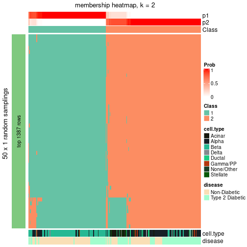</p>

</div>
<div id='tab-node-02-membership-heatmap-2'>
<pre><code class="r">membership_heatmap(res, k = 3)
</code></pre>

<p></p>

</div>
<div id='tab-node-02-membership-heatmap-3'>
<pre><code class="r">membership_heatmap(res, k = 4)
</code></pre>

<p></p>

</div>
</div>

As soon as the classes for columns are determined, the signatures
that are significantly different between subgroups can be looked for. 
Following are the heatmaps for signatures.


Signature heatmaps where rows are scaled:


<script>
$( function() {
	$( '#tabs-node-02-get-signatures' ).tabs();
} );
</script>
<div id='tabs-node-02-get-signatures'>
<ul>
<li><a href='#tab-node-02-get-signatures-1'>k = 2</a></li>
<li><a href='#tab-node-02-get-signatures-2'>k = 3</a></li>
<li><a href='#tab-node-02-get-signatures-3'>k = 4</a></li>
</ul>
<div id='tab-node-02-get-signatures-1'>
<pre><code class="r">get_signatures(res, k = 2)
</code></pre>

<p></p>

</div>
<div id='tab-node-02-get-signatures-2'>
<pre><code class="r">get_signatures(res, k = 3)
</code></pre>

<p></p>

</div>
<div id='tab-node-02-get-signatures-3'>
<pre><code class="r">get_signatures(res, k = 4)
</code></pre>

<p></p>

</div>
</div>


Signature heatmaps where rows are not scaled:


<script>
$( function() {
	$( '#tabs-node-02-get-signatures-no-scale' ).tabs();
} );
</script>
<div id='tabs-node-02-get-signatures-no-scale'>
<ul>
<li><a href='#tab-node-02-get-signatures-no-scale-1'>k = 2</a></li>
<li><a href='#tab-node-02-get-signatures-no-scale-2'>k = 3</a></li>
<li><a href='#tab-node-02-get-signatures-no-scale-3'>k = 4</a></li>
</ul>
<div id='tab-node-02-get-signatures-no-scale-1'>
<pre><code class="r">get_signatures(res, k = 2, scale_rows = FALSE)
</code></pre>

<p></p>

</div>
<div id='tab-node-02-get-signatures-no-scale-2'>
<pre><code class="r">get_signatures(res, k = 3, scale_rows = FALSE)
</code></pre>

<p></p>

</div>
<div id='tab-node-02-get-signatures-no-scale-3'>
<pre><code class="r">get_signatures(res, k = 4, scale_rows = FALSE)
</code></pre>

<p></p>

</div>
</div>


Compare the overlap of signatures from different k:

```r
compare_signatures(res)
```


`get_signature()` returns a data frame invisibly. To get the list of signatures, the function
call should be assigned to a variable explicitly. In following code, if `plot` argument is set
to `FALSE`, no heatmap is plotted while only the differential analysis is performed.

```r
# code only for demonstration
tb = get_signature(res, k = ..., plot = FALSE)
```

An example of the output of `tb` is:

```
#>   which_row         fdr    mean_1    mean_2 scaled_mean_1 scaled_mean_2 km
#> 1        38 0.042760348  8.373488  9.131774    -0.5533452     0.5164555  1
#> 2        40 0.018707592  7.106213  8.469186    -0.6173731     0.5762149  1
#> 3        55 0.019134737 10.221463 11.207825    -0.6159697     0.5749050  1
#> 4        59 0.006059896  5.921854  7.869574    -0.6899429     0.6439467  1
#> 5        60 0.018055526  8.928898 10.211722    -0.6204761     0.5791110  1
#> 6        98 0.009384629 15.714769 14.887706     0.6635654    -0.6193277  2
...
```

The columns in `tb` are:

1. `which_row`: row indices corresponding to the input matrix.
2. `fdr`: FDR for the differential test. 
3. `mean_x`: The mean value in group x.
4. `scaled_mean_x`: The mean value in group x after rows are scaled.
5. `km`: Row groups if k-means clustering is applied to rows (which is done by automatically selecting number of clusters).

If there are too many signatures, `top_signatures = ...` can be set to only show the 
signatures with the highest FDRs:

```r
# code only for demonstration
# e.g. to show the top 500 most significant rows
tb = get_signature(res, k = ..., top_signatures = 500)
```

If the signatures are defined as these which are uniquely high in current group, `diff_method` argument
can be set to `"uniquely_high_in_one_group"`:

```r
# code only for demonstration
tb = get_signature(res, k = ..., diff_method = "uniquely_high_in_one_group")
```


UMAP plot which shows how samples are separated.


<script>
$( function() {
	$( '#tabs-node-02-dimension-reduction' ).tabs();
} );
</script>
<div id='tabs-node-02-dimension-reduction'>
<ul>
<li><a href='#tab-node-02-dimension-reduction-1'>k = 2</a></li>
<li><a href='#tab-node-02-dimension-reduction-2'>k = 3</a></li>
<li><a href='#tab-node-02-dimension-reduction-3'>k = 4</a></li>
</ul>
<div id='tab-node-02-dimension-reduction-1'>
<pre><code class="r">dimension_reduction(res, k = 2, method = &quot;UMAP&quot;)
</code></pre>

<p></p>

</div>
<div id='tab-node-02-dimension-reduction-2'>
<pre><code class="r">dimension_reduction(res, k = 3, method = &quot;UMAP&quot;)
</code></pre>

<p>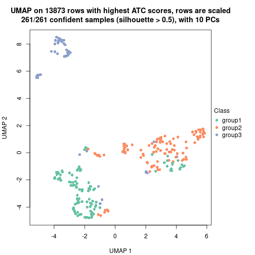</p>

</div>
<div id='tab-node-02-dimension-reduction-3'>
<pre><code class="r">dimension_reduction(res, k = 4, method = &quot;UMAP&quot;)
</code></pre>

<p></p>

</div>
</div>


Following heatmap shows how subgroups are split when increasing `k`:

```r
collect_classes(res)
```


Test correlation between subgroups and known annotations. If the known
annotation is numeric, one-way ANOVA test is applied, and if the known
annotation is discrete, chi-squared contingency table test is applied.

```r
test_to_known_factors(res)
```

```
#>             n_sample cell.type(p-value) disease(p-value) k
#> ATC:skmeans      260           1.19e-22         6.17e-07 2
#> ATC:skmeans      261           6.80e-57         3.01e-06 3
#> ATC:skmeans      259           6.20e-72         2.69e-08 4
```


If matrix rows can be associated to genes, consider to use `functional_enrichment(res,
...)` to perform function enrichment for the signature genes. See [this vignette](https://jokergoo.github.io/cola_vignettes/functional_enrichment.html) for more detailed explanations.


 

---------------------------------------------------


### Node021


Parent node: [Node02](#Node02).
Child nodes: 
                [Node0111](#Node0111)
        ,
                [Node0112](#Node0112)
        ,
                [Node0113](#Node0113)
        ,
                Node0121-leaf
        ,
                [Node0122](#Node0122)
        ,
                [Node0123](#Node0123)
        ,
                Node0124-leaf
        ,
                Node0211-leaf
        ,
                Node0212-leaf
        ,
                Node0221-leaf
        ,
                Node0222-leaf
        ,
                Node0231-leaf
        ,
                Node0232-leaf
        ,
                Node0233-leaf
        .


The object with results only for a single top-value method and a single partitioning method 
can be extracted as:

```r
res = res_rh["021"]
```

A summary of `res` and all the functions that can be applied to it:

```r
res
```

```
#> A 'ConsensusPartition' object with k = 2, 3, 4.
#>   On a matrix with 13804 rows and 90 columns.
#>   Top rows (1290) are extracted by 'ATC' method.
#>   Subgroups are detected by 'skmeans' method.
#>   Performed in total 150 partitions by row resampling.
#>   Best k for subgroups seems to be 2.
#> 
#> Following methods can be applied to this 'ConsensusPartition' object:
#>  [1] "cola_report"             "collect_classes"         "collect_plots"          
#>  [4] "collect_stats"           "colnames"                "compare_partitions"     
#>  [7] "compare_signatures"      "consensus_heatmap"       "dimension_reduction"    
#> [10] "functional_enrichment"   "get_anno_col"            "get_anno"               
#> [13] "get_classes"             "get_consensus"           "get_matrix"             
#> [16] "get_membership"          "get_param"               "get_signatures"         
#> [19] "get_stats"               "is_best_k"               "is_stable_k"            
#> [22] "membership_heatmap"      "ncol"                    "nrow"                   
#> [25] "plot_ecdf"               "predict_classes"         "rownames"               
#> [28] "select_partition_number" "show"                    "suggest_best_k"         
#> [31] "test_to_known_factors"   "top_rows_heatmap"
```

`collect_plots()` function collects all the plots made from `res` for all `k` (number of subgroups)
into one single page to provide an easy and fast comparison between different `k`.

```r
collect_plots(res)
```


The plots are:

- The first row: a plot of the eCDF (empirical cumulative distribution
  function) curves of the consensus matrix for each `k` and the heatmap of
  predicted classes for each `k`.
- The second row: heatmaps of the consensus matrix for each `k`.
- The third row: heatmaps of the membership matrix for each `k`.
- The fouth row: heatmaps of the signatures for each `k`.

All the plots in panels can be made by individual functions and they are
plotted later in this section.

`select_partition_number()` produces several plots showing different
statistics for choosing "optimized" `k`. There are following statistics:

- eCDF curves of the consensus matrix for each `k`;
- 1-PAC. [The PAC score](https://en.wikipedia.org/wiki/Consensus_clustering#Over-interpretation_potential_of_consensus_clustering)
  measures the proportion of the ambiguous subgrouping.
- Mean silhouette score.
- Concordance. The mean probability of fiting the consensus subgroup labels in all
  partitions.
- Area increased. Denote $A_k$ as the area under the eCDF curve for current
  `k`, the area increased is defined as $A_k - A_{k-1}$.
- Rand index. The percent of pairs of samples that are both in a same cluster
  or both are not in a same cluster in the partition of k and k-1.
- Jaccard index. The ratio of pairs of samples are both in a same cluster in
  the partition of k and k-1 and the pairs of samples are both in a same
  cluster in the partition k or k-1.

The detailed explanations of these statistics can be found in [the _cola_
vignette](https://jokergoo.github.io/cola_vignettes/cola.html#toc_13).

Generally speaking, higher 1-PAC score, higher mean silhouette score or higher
concordance corresponds to better partition. Rand index and Jaccard index
measure how similar the current partition is compared to partition with `k-1`.
If they are too similar, we won't accept `k` is better than `k-1`.

```r
select_partition_number(res)
```

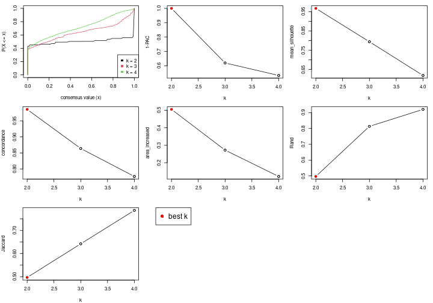

The numeric values for all these statistics can be obtained by `get_stats()`.

```r
get_stats(res)
```

```
#>   k 1-PAC mean_silhouette concordance area_increased  Rand Jaccard
#> 2 2 1.000           0.967       0.986          0.505 0.497   0.497
#> 3 3 0.620           0.794       0.864          0.272 0.813   0.642
#> 4 4 0.532           0.619       0.777          0.122 0.921   0.786
```

`suggest_best_k()` suggests the best $k$ based on these statistics. The rules are as follows:

- All $k$ with Jaccard index larger than 0.95 are removed because increasing
  $k$ does not provide enough extra information. If all $k$ are removed, it is
  marked as no subgroup is detected.
- For all $k$ with 1-PAC score larger than 0.9, the maximal $k$ is taken as
  the best $k$, and other $k$ are marked as optional $k$.
- If it does not fit the second rule. The $k$ with the maximal vote of the
  highest 1-PAC score, highest mean silhouette, and highest concordance is
  taken as the best $k$.

```r
suggest_best_k(res)
```

```
#> [1] 2
```


Following is the table of the partitions (You need to click the **show/hide
code output** link to see it). The membership matrix (columns with name `p*`)
is inferred by
[`clue::cl_consensus()`](https://www.rdocumentation.org/link/cl_consensus?package=clue)
function with the `SE` method. Basically the value in the membership matrix
represents the probability to belong to a certain group. The finall subgroup
label for an item is determined with the group with highest probability it
belongs to.

In `get_classes()` function, the entropy is calculated from the membership
matrix and the silhouette score is calculated from the consensus matrix.


<script>
$( function() {
	$( '#tabs-node-021-get-classes' ).tabs();
} );
</script>
<div id='tabs-node-021-get-classes'>
<ul>
<li><a href='#tab-node-021-get-classes-1'>k = 2</a></li>
<li><a href='#tab-node-021-get-classes-2'>k = 3</a></li>
<li><a href='#tab-node-021-get-classes-3'>k = 4</a></li>
</ul>

<div id='tab-node-021-get-classes-1'>
<p><a id='tab-node-021-get-classes-1-a' style='color:#0366d6' href='#'>show/hide code output</a></p>
<pre><code class="r">cbind(get_classes(res, k = 2), get_membership(res, k = 2))
</code></pre>

<pre><code>#&gt;               class entropy silhouette   p1   p2
#&gt; 10th_C11_S96      1   0.000      0.978 1.00 0.00
#&gt; 10th_C17_S97      1   0.000      0.978 1.00 0.00
#&gt; 10th_C32_S56      1   0.000      0.978 1.00 0.00
#&gt; 10th_C33_S64      1   0.000      0.978 1.00 0.00
#&gt; 10th_C37_S49      1   0.000      0.978 1.00 0.00
#&gt; 10th_C61_S68      1   0.000      0.978 1.00 0.00
#&gt; 10th_C64_S112     1   0.000      0.978 1.00 0.00
#&gt; 10th_C66_S126     1   0.000      0.978 1.00 0.00
#&gt; 11th-C21_S4       2   0.000      0.993 0.00 1.00
#&gt; 11th-C22_S65      1   0.827      0.659 0.74 0.26
#&gt; 11th-C27_S19      2   0.000      0.993 0.00 1.00
#&gt; 11th-C54_S86      2   0.000      0.993 0.00 1.00
#&gt; 12th-C10_S155     1   0.000      0.978 1.00 0.00
#&gt; 12th-C15_S183     1   0.000      0.978 1.00 0.00
#&gt; 12th-C21_S184     1   0.000      0.978 1.00 0.00
#&gt; 12th-C35_S151     1   0.000      0.978 1.00 0.00
#&gt; 12th-C38_S194     1   0.000      0.978 1.00 0.00
#&gt; 12th-C3_S181      1   0.000      0.978 1.00 0.00
#&gt; 12th-C47_S153     1   0.000      0.978 1.00 0.00
#&gt; 12th-C67_S205     2   0.000      0.993 0.00 1.00
#&gt; 12th-C93_S209     2   0.000      0.993 0.00 1.00
#&gt; 13th_C15_S134     2   0.000      0.993 0.00 1.00
#&gt; 13th_C57_S171     1   0.000      0.978 1.00 0.00
#&gt; 13th_C75_S159     1   0.000      0.978 1.00 0.00
#&gt; 13th_C80_S167     2   0.000      0.993 0.00 1.00
#&gt; 13th_C81_S160     2   0.000      0.993 0.00 1.00
#&gt; 1st-C13_S19       2   0.000      0.993 0.00 1.00
#&gt; 1st-C39_S23       2   0.000      0.993 0.00 1.00
#&gt; 1st-C79_S46       2   0.000      0.993 0.00 1.00
#&gt; 1st-C96_S94       1   0.141      0.961 0.98 0.02
#&gt; 2nd-C19_S39       2   0.000      0.993 0.00 1.00
#&gt; 2nd-C27_S51       2   0.000      0.993 0.00 1.00
#&gt; 2nd-C37_S73       1   0.000      0.978 1.00 0.00
#&gt; 2nd-C49_S4        1   0.000      0.978 1.00 0.00
#&gt; 2nd-C51_S6        2   0.000      0.993 0.00 1.00
#&gt; 2nd-C52_S10       2   0.000      0.993 0.00 1.00
#&gt; 2nd-C5_S8         2   0.000      0.993 0.00 1.00
#&gt; 2nd-C7_S15        2   0.000      0.993 0.00 1.00
#&gt; 2nd-C87_S76       1   0.958      0.399 0.62 0.38
#&gt; 3rd-C25_S15       2   0.000      0.993 0.00 1.00
#&gt; 3rd-C56_S90       2   0.000      0.993 0.00 1.00
#&gt; 3rd-C60_S10       1   0.529      0.858 0.88 0.12
#&gt; 3rd-C96_S79       2   0.000      0.993 0.00 1.00
#&gt; 4th-C45_S87       2   0.000      0.993 0.00 1.00
#&gt; 4th-C93_S88       2   0.000      0.993 0.00 1.00
#&gt; 5th-C14_S97       1   0.000      0.978 1.00 0.00
#&gt; 5th-C18_S96       1   0.000      0.978 1.00 0.00
#&gt; 5th-C80_S116      2   0.000      0.993 0.00 1.00
#&gt; 6th-C15_S22       1   0.000      0.978 1.00 0.00
#&gt; 6th-C19_S35       2   0.000      0.993 0.00 1.00
#&gt; 6th-C1_S3         1   0.000      0.978 1.00 0.00
#&gt; 6th-C25_S43       2   0.000      0.993 0.00 1.00
#&gt; 6th-C28_S49       2   0.000      0.993 0.00 1.00
#&gt; 6th-C57_S17       1   0.000      0.978 1.00 0.00
#&gt; 6th-C58_S20       1   0.000      0.978 1.00 0.00
#&gt; 6th-C62_S25       2   0.000      0.993 0.00 1.00
#&gt; 6th-C64_S30       1   0.000      0.978 1.00 0.00
#&gt; 6th-C67_S36       2   0.000      0.993 0.00 1.00
#&gt; 6th-C82_S66       1   0.000      0.978 1.00 0.00
#&gt; 6th-C84_S64       1   0.000      0.978 1.00 0.00
#&gt; 6th-C89_S77       2   0.000      0.993 0.00 1.00
#&gt; 6th-C90_S76       1   0.000      0.978 1.00 0.00
#&gt; 7th-C12_S17       2   0.000      0.993 0.00 1.00
#&gt; 7th-C19_S36       1   0.000      0.978 1.00 0.00
#&gt; 7th-C1_S3         1   0.000      0.978 1.00 0.00
#&gt; 7th-C20_S35       2   0.141      0.973 0.02 0.98
#&gt; 7th-C21_S34       1   0.000      0.978 1.00 0.00
#&gt; 7th-C28_S48       2   0.000      0.993 0.00 1.00
#&gt; 7th-C2_S2         2   0.000      0.993 0.00 1.00
#&gt; 7th-C3_S1         2   0.000      0.993 0.00 1.00
#&gt; 7th-C4_S8         2   0.000      0.993 0.00 1.00
#&gt; 7th-C52_S9        2   0.000      0.993 0.00 1.00
#&gt; 7th-C57_S16       2   0.000      0.993 0.00 1.00
#&gt; 7th-C60_S22       2   0.000      0.993 0.00 1.00
#&gt; 7th-C65_S32       1   0.000      0.978 1.00 0.00
#&gt; 7th-C94_S83       1   0.000      0.978 1.00 0.00
#&gt; 8th-C38_S147      1   0.000      0.978 1.00 0.00
#&gt; 8th-C47_S160      1   0.000      0.978 1.00 0.00
#&gt; 8th-C70_S123      1   0.000      0.978 1.00 0.00
#&gt; 8th-C75_S128      1   0.000      0.978 1.00 0.00
#&gt; 8th-C84_S143      1   0.760      0.725 0.78 0.22
#&gt; 9th-C13_S24       1   0.000      0.978 1.00 0.00
#&gt; 9th-C14_S23       1   0.000      0.978 1.00 0.00
#&gt; 9th-C25_S45       1   0.000      0.978 1.00 0.00
#&gt; 9th-C51_S6        1   0.000      0.978 1.00 0.00
#&gt; 9th-C59_S20       2   0.000      0.993 0.00 1.00
#&gt; 9th-C69_S39       2   0.000      0.993 0.00 1.00
#&gt; 9th-C88_S73       1   0.000      0.978 1.00 0.00
#&gt; 9th-C91_S78       2   0.000      0.993 0.00 1.00
#&gt; 9th-C94_S83       2   0.827      0.640 0.26 0.74
</code></pre>

<script>
$('#tab-node-021-get-classes-1-a').parent().next().next().hide();
$('#tab-node-021-get-classes-1-a').click(function(){
  $('#tab-node-021-get-classes-1-a').parent().next().next().toggle();
  return(false);
});
</script>
</div>

<div id='tab-node-021-get-classes-2'>
<p><a id='tab-node-021-get-classes-2-a' style='color:#0366d6' href='#'>show/hide code output</a></p>
<pre><code class="r">cbind(get_classes(res, k = 3), get_membership(res, k = 3))
</code></pre>

<pre><code>#&gt;               class entropy silhouette   p1   p2   p3
#&gt; 10th_C11_S96      1  0.2066      0.887 0.94 0.00 0.06
#&gt; 10th_C17_S97      1  0.0000      0.904 1.00 0.00 0.00
#&gt; 10th_C32_S56      1  0.4291      0.837 0.82 0.00 0.18
#&gt; 10th_C33_S64      1  0.3340      0.876 0.88 0.00 0.12
#&gt; 10th_C37_S49      1  0.0892      0.903 0.98 0.00 0.02
#&gt; 10th_C61_S68      1  0.6192      0.473 0.58 0.00 0.42
#&gt; 10th_C64_S112     3  0.5397      0.384 0.28 0.00 0.72
#&gt; 10th_C66_S126     1  0.0000      0.904 1.00 0.00 0.00
#&gt; 11th-C21_S4       3  0.5835      0.818 0.00 0.34 0.66
#&gt; 11th-C22_S65      3  0.5416      0.654 0.08 0.10 0.82
#&gt; 11th-C27_S19      2  0.5560      0.397 0.00 0.70 0.30
#&gt; 11th-C54_S86      3  0.5835      0.818 0.00 0.34 0.66
#&gt; 12th-C10_S155     1  0.7029      0.390 0.54 0.02 0.44
#&gt; 12th-C15_S183     1  0.0892      0.901 0.98 0.00 0.02
#&gt; 12th-C21_S184     1  0.2959      0.885 0.90 0.00 0.10
#&gt; 12th-C35_S151     1  0.3340      0.876 0.88 0.00 0.12
#&gt; 12th-C38_S194     1  0.2959      0.885 0.90 0.00 0.10
#&gt; 12th-C3_S181      1  0.0000      0.904 1.00 0.00 0.00
#&gt; 12th-C47_S153     1  0.4002      0.852 0.84 0.00 0.16
#&gt; 12th-C67_S205     3  0.5835      0.818 0.00 0.34 0.66
#&gt; 12th-C93_S209     2  0.2537      0.844 0.00 0.92 0.08
#&gt; 13th_C15_S134     3  0.5835      0.818 0.00 0.34 0.66
#&gt; 13th_C57_S171     1  0.0000      0.904 1.00 0.00 0.00
#&gt; 13th_C75_S159     3  0.6045      0.101 0.38 0.00 0.62
#&gt; 13th_C80_S167     3  0.5835      0.818 0.00 0.34 0.66
#&gt; 13th_C81_S160     3  0.5835      0.818 0.00 0.34 0.66
#&gt; 1st-C13_S19       3  0.6309      0.501 0.00 0.50 0.50
#&gt; 1st-C39_S23       2  0.3340      0.832 0.00 0.88 0.12
#&gt; 1st-C79_S46       2  0.2537      0.772 0.00 0.92 0.08
#&gt; 1st-C96_S94       1  0.8853      0.475 0.54 0.14 0.32
#&gt; 2nd-C19_S39       3  0.6045      0.764 0.00 0.38 0.62
#&gt; 2nd-C27_S51       2  0.2959      0.840 0.00 0.90 0.10
#&gt; 2nd-C37_S73       1  0.2959      0.885 0.90 0.00 0.10
#&gt; 2nd-C49_S4        1  0.3340      0.876 0.88 0.00 0.12
#&gt; 2nd-C51_S6        2  0.0892      0.849 0.00 0.98 0.02
#&gt; 2nd-C52_S10       2  0.3340      0.708 0.00 0.88 0.12
#&gt; 2nd-C5_S8         2  0.0000      0.846 0.00 1.00 0.00
#&gt; 2nd-C7_S15        2  0.2066      0.848 0.00 0.94 0.06
#&gt; 2nd-C87_S76       3  0.7398      0.588 0.18 0.12 0.70
#&gt; 3rd-C25_S15       2  0.0000      0.846 0.00 1.00 0.00
#&gt; 3rd-C56_S90       2  0.0892      0.849 0.00 0.98 0.02
#&gt; 3rd-C60_S10       2  0.8631      0.532 0.22 0.60 0.18
#&gt; 3rd-C96_S79       3  0.5835      0.818 0.00 0.34 0.66
#&gt; 4th-C45_S87       2  0.4002      0.806 0.00 0.84 0.16
#&gt; 4th-C93_S88       2  0.0892      0.834 0.00 0.98 0.02
#&gt; 5th-C14_S97       1  0.0892      0.901 0.98 0.00 0.02
#&gt; 5th-C18_S96       1  0.0892      0.901 0.98 0.00 0.02
#&gt; 5th-C80_S116      2  0.0892      0.834 0.00 0.98 0.02
#&gt; 6th-C15_S22       1  0.1529      0.897 0.96 0.00 0.04
#&gt; 6th-C19_S35       3  0.5835      0.818 0.00 0.34 0.66
#&gt; 6th-C1_S3         1  0.3340      0.855 0.88 0.00 0.12
#&gt; 6th-C25_S43       3  0.5835      0.818 0.00 0.34 0.66
#&gt; 6th-C28_S49       2  0.0000      0.846 0.00 1.00 0.00
#&gt; 6th-C57_S17       1  0.1529      0.897 0.96 0.00 0.04
#&gt; 6th-C58_S20       1  0.0892      0.901 0.98 0.00 0.02
#&gt; 6th-C62_S25       2  0.0000      0.846 0.00 1.00 0.00
#&gt; 6th-C64_S30       1  0.1529      0.900 0.96 0.00 0.04
#&gt; 6th-C67_S36       3  0.5835      0.818 0.00 0.34 0.66
#&gt; 6th-C82_S66       1  0.1529      0.897 0.96 0.00 0.04
#&gt; 6th-C84_S64       1  0.9083      0.263 0.54 0.28 0.18
#&gt; 6th-C89_S77       2  0.3340      0.820 0.00 0.88 0.12
#&gt; 6th-C90_S76       1  0.2537      0.892 0.92 0.00 0.08
#&gt; 7th-C12_S17       2  0.0000      0.846 0.00 1.00 0.00
#&gt; 7th-C19_S36       1  0.1529      0.897 0.96 0.00 0.04
#&gt; 7th-C1_S3         1  0.1529      0.897 0.96 0.00 0.04
#&gt; 7th-C20_S35       2  0.7058      0.684 0.10 0.72 0.18
#&gt; 7th-C21_S34       1  0.1529      0.897 0.96 0.00 0.04
#&gt; 7th-C28_S48       2  0.0000      0.846 0.00 1.00 0.00
#&gt; 7th-C2_S2         2  0.3340      0.836 0.00 0.88 0.12
#&gt; 7th-C3_S1         2  0.7058      0.684 0.10 0.72 0.18
#&gt; 7th-C4_S8         2  0.3340      0.832 0.00 0.88 0.12
#&gt; 7th-C52_S9        2  0.3340      0.831 0.00 0.88 0.12
#&gt; 7th-C57_S16       2  0.1529      0.844 0.00 0.96 0.04
#&gt; 7th-C60_S22       2  0.3686      0.819 0.00 0.86 0.14
#&gt; 7th-C65_S32       1  0.1529      0.897 0.96 0.00 0.04
#&gt; 7th-C94_S83       1  0.1529      0.897 0.96 0.00 0.04
#&gt; 8th-C38_S147      1  0.1529      0.901 0.96 0.00 0.04
#&gt; 8th-C47_S160      1  0.2066      0.896 0.94 0.00 0.06
#&gt; 8th-C70_S123      1  0.0000      0.904 1.00 0.00 0.00
#&gt; 8th-C75_S128      1  0.0000      0.904 1.00 0.00 0.00
#&gt; 8th-C84_S143      3  0.5012      0.651 0.08 0.08 0.84
#&gt; 9th-C13_S24       1  0.3340      0.876 0.88 0.00 0.12
#&gt; 9th-C14_S23       1  0.3686      0.865 0.86 0.00 0.14
#&gt; 9th-C25_S45       1  0.4002      0.852 0.84 0.00 0.16
#&gt; 9th-C51_S6        1  0.2959      0.886 0.90 0.00 0.10
#&gt; 9th-C59_S20       3  0.5835      0.818 0.00 0.34 0.66
#&gt; 9th-C69_S39       2  0.2537      0.774 0.00 0.92 0.08
#&gt; 9th-C88_S73       1  0.1529      0.897 0.96 0.00 0.04
#&gt; 9th-C91_S78       3  0.5835      0.818 0.00 0.34 0.66
#&gt; 9th-C94_S83       2  0.9147      0.455 0.20 0.54 0.26
</code></pre>

<script>
$('#tab-node-021-get-classes-2-a').parent().next().next().hide();
$('#tab-node-021-get-classes-2-a').click(function(){
  $('#tab-node-021-get-classes-2-a').parent().next().next().toggle();
  return(false);
});
</script>
</div>

<div id='tab-node-021-get-classes-3'>
<p><a id='tab-node-021-get-classes-3-a' style='color:#0366d6' href='#'>show/hide code output</a></p>
<pre><code class="r">cbind(get_classes(res, k = 4), get_membership(res, k = 4))
</code></pre>

<pre><code>#&gt;               class entropy silhouette   p1   p2   p3   p4
#&gt; 10th_C11_S96      1  0.5489     0.6108 0.70 0.06 0.00 0.24
#&gt; 10th_C17_S97      1  0.0707     0.7463 0.98 0.00 0.00 0.02
#&gt; 10th_C32_S56      4  0.4855     0.1764 0.40 0.00 0.00 0.60
#&gt; 10th_C33_S64      1  0.4277     0.5769 0.72 0.00 0.00 0.28
#&gt; 10th_C37_S49      1  0.2647     0.7200 0.88 0.00 0.00 0.12
#&gt; 10th_C61_S68      4  0.5106     0.4988 0.24 0.00 0.04 0.72
#&gt; 10th_C64_S112     4  0.6104     0.5833 0.18 0.00 0.14 0.68
#&gt; 10th_C66_S126     1  0.0707     0.7446 0.98 0.00 0.00 0.02
#&gt; 11th-C21_S4       3  0.0707     0.8479 0.00 0.00 0.98 0.02
#&gt; 11th-C22_S65      4  0.6766     0.4549 0.10 0.00 0.38 0.52
#&gt; 11th-C27_S19      3  0.6988    -0.1664 0.00 0.38 0.50 0.12
#&gt; 11th-C54_S86      3  0.0000     0.8674 0.00 0.00 1.00 0.00
#&gt; 12th-C10_S155     1  0.7677     0.1506 0.56 0.04 0.12 0.28
#&gt; 12th-C15_S183     1  0.1211     0.7450 0.96 0.00 0.00 0.04
#&gt; 12th-C21_S184     1  0.4522     0.5327 0.68 0.00 0.00 0.32
#&gt; 12th-C35_S151     1  0.4522     0.5389 0.68 0.00 0.00 0.32
#&gt; 12th-C38_S194     1  0.4277     0.5861 0.72 0.00 0.00 0.28
#&gt; 12th-C3_S181      1  0.0000     0.7464 1.00 0.00 0.00 0.00
#&gt; 12th-C47_S153     1  0.4713     0.4624 0.64 0.00 0.00 0.36
#&gt; 12th-C67_S205     3  0.0000     0.8674 0.00 0.00 1.00 0.00
#&gt; 12th-C93_S209     2  0.5636     0.6317 0.00 0.68 0.26 0.06
#&gt; 13th_C15_S134     3  0.0707     0.8599 0.00 0.02 0.98 0.00
#&gt; 13th_C57_S171     1  0.0000     0.7464 1.00 0.00 0.00 0.00
#&gt; 13th_C75_S159     4  0.6216     0.5485 0.22 0.00 0.12 0.66
#&gt; 13th_C80_S167     3  0.0000     0.8674 0.00 0.00 1.00 0.00
#&gt; 13th_C81_S160     3  0.0000     0.8674 0.00 0.00 1.00 0.00
#&gt; 1st-C13_S19       3  0.6797     0.4413 0.00 0.24 0.60 0.16
#&gt; 1st-C39_S23       2  0.4949     0.7417 0.00 0.76 0.18 0.06
#&gt; 1st-C79_S46       2  0.5000     0.3412 0.00 0.50 0.50 0.00
#&gt; 1st-C96_S94       4  0.9032     0.2735 0.30 0.12 0.14 0.44
#&gt; 2nd-C19_S39       3  0.3935     0.7532 0.00 0.10 0.84 0.06
#&gt; 2nd-C27_S51       2  0.2830     0.6980 0.00 0.90 0.06 0.04
#&gt; 2nd-C37_S73       1  0.2921     0.7139 0.86 0.00 0.00 0.14
#&gt; 2nd-C49_S4        1  0.4406     0.5560 0.70 0.00 0.00 0.30
#&gt; 2nd-C51_S6        2  0.4079     0.7535 0.00 0.80 0.18 0.02
#&gt; 2nd-C52_S10       3  0.4907    -0.1299 0.00 0.42 0.58 0.00
#&gt; 2nd-C5_S8         2  0.3610     0.7501 0.00 0.80 0.20 0.00
#&gt; 2nd-C7_S15        2  0.5915     0.5810 0.00 0.56 0.40 0.04
#&gt; 2nd-C87_S76       4  0.8306     0.3921 0.10 0.08 0.34 0.48
#&gt; 3rd-C25_S15       2  0.4624     0.6663 0.00 0.66 0.34 0.00
#&gt; 3rd-C56_S90       2  0.4277     0.7194 0.00 0.72 0.28 0.00
#&gt; 3rd-C60_S10       2  0.7095     0.0923 0.18 0.56 0.00 0.26
#&gt; 3rd-C96_S79       3  0.0000     0.8674 0.00 0.00 1.00 0.00
#&gt; 4th-C45_S87       2  0.2335     0.6863 0.00 0.92 0.02 0.06
#&gt; 4th-C93_S88       2  0.4855     0.5914 0.00 0.60 0.40 0.00
#&gt; 5th-C14_S97       1  0.1211     0.7450 0.96 0.00 0.00 0.04
#&gt; 5th-C18_S96       1  0.2647     0.7244 0.88 0.00 0.00 0.12
#&gt; 5th-C80_S116      2  0.4948     0.5206 0.00 0.56 0.44 0.00
#&gt; 6th-C15_S22       1  0.3400     0.6844 0.82 0.00 0.00 0.18
#&gt; 6th-C19_S35       3  0.0707     0.8599 0.00 0.02 0.98 0.00
#&gt; 6th-C1_S3         1  0.4731     0.6641 0.78 0.06 0.00 0.16
#&gt; 6th-C25_S43       3  0.0000     0.8674 0.00 0.00 1.00 0.00
#&gt; 6th-C28_S49       2  0.4277     0.7172 0.00 0.72 0.28 0.00
#&gt; 6th-C57_S17       1  0.2647     0.7212 0.88 0.00 0.00 0.12
#&gt; 6th-C58_S20       1  0.3975     0.7007 0.76 0.00 0.00 0.24
#&gt; 6th-C62_S25       2  0.3801     0.7472 0.00 0.78 0.22 0.00
#&gt; 6th-C64_S30       1  0.4277     0.6479 0.72 0.00 0.00 0.28
#&gt; 6th-C67_S36       3  0.0707     0.8599 0.00 0.02 0.98 0.00
#&gt; 6th-C82_S66       1  0.3400     0.6844 0.82 0.00 0.00 0.18
#&gt; 6th-C84_S64       1  0.7738     0.0921 0.44 0.26 0.00 0.30
#&gt; 6th-C89_S77       2  0.5077     0.6560 0.00 0.76 0.16 0.08
#&gt; 6th-C90_S76       1  0.3610     0.7119 0.80 0.00 0.00 0.20
#&gt; 7th-C12_S17       2  0.3975     0.7393 0.00 0.76 0.24 0.00
#&gt; 7th-C19_S36       1  0.3801     0.6506 0.78 0.00 0.00 0.22
#&gt; 7th-C1_S3         1  0.3172     0.6989 0.84 0.00 0.00 0.16
#&gt; 7th-C20_S35       2  0.3400     0.5766 0.00 0.82 0.00 0.18
#&gt; 7th-C21_S34       1  0.2647     0.7212 0.88 0.00 0.00 0.12
#&gt; 7th-C28_S48       2  0.4134     0.7291 0.00 0.74 0.26 0.00
#&gt; 7th-C2_S2         2  0.4079     0.7330 0.00 0.80 0.18 0.02
#&gt; 7th-C3_S1         2  0.4905     0.6545 0.02 0.80 0.06 0.12
#&gt; 7th-C4_S8         2  0.2706     0.7302 0.00 0.90 0.08 0.02
#&gt; 7th-C52_S9        2  0.2921     0.7506 0.00 0.86 0.14 0.00
#&gt; 7th-C57_S16       2  0.3975     0.7424 0.00 0.76 0.24 0.00
#&gt; 7th-C60_S22       2  0.1211     0.6813 0.00 0.96 0.00 0.04
#&gt; 7th-C65_S32       1  0.2345     0.7301 0.90 0.00 0.00 0.10
#&gt; 7th-C94_S83       1  0.4553     0.7162 0.78 0.04 0.00 0.18
#&gt; 8th-C38_S147      1  0.2345     0.7271 0.90 0.00 0.00 0.10
#&gt; 8th-C47_S160      1  0.2921     0.7075 0.86 0.00 0.00 0.14
#&gt; 8th-C70_S123      1  0.2647     0.7357 0.88 0.00 0.00 0.12
#&gt; 8th-C75_S128      1  0.0000     0.7464 1.00 0.00 0.00 0.00
#&gt; 8th-C84_S143      4  0.5594     0.2929 0.02 0.00 0.46 0.52
#&gt; 9th-C13_S24       1  0.3172     0.7010 0.84 0.00 0.00 0.16
#&gt; 9th-C14_S23       1  0.4907     0.3390 0.58 0.00 0.00 0.42
#&gt; 9th-C25_S45       1  0.4948     0.2717 0.56 0.00 0.00 0.44
#&gt; 9th-C51_S6        1  0.4624     0.4564 0.66 0.00 0.00 0.34
#&gt; 9th-C59_S20       3  0.0707     0.8495 0.00 0.00 0.98 0.02
#&gt; 9th-C69_S39       2  0.5000     0.3818 0.00 0.50 0.50 0.00
#&gt; 9th-C88_S73       1  0.2647     0.7220 0.88 0.00 0.00 0.12
#&gt; 9th-C91_S78       3  0.0000     0.8674 0.00 0.00 1.00 0.00
#&gt; 9th-C94_S83       4  0.9034     0.1568 0.16 0.32 0.10 0.42
</code></pre>

<script>
$('#tab-node-021-get-classes-3-a').parent().next().next().hide();
$('#tab-node-021-get-classes-3-a').click(function(){
  $('#tab-node-021-get-classes-3-a').parent().next().next().toggle();
  return(false);
});
</script>
</div>
</div>

Heatmaps for the consensus matrix. It visualizes the probability of two
samples to be in a same group.


<script>
$( function() {
	$( '#tabs-node-021-consensus-heatmap' ).tabs();
} );
</script>
<div id='tabs-node-021-consensus-heatmap'>
<ul>
<li><a href='#tab-node-021-consensus-heatmap-1'>k = 2</a></li>
<li><a href='#tab-node-021-consensus-heatmap-2'>k = 3</a></li>
<li><a href='#tab-node-021-consensus-heatmap-3'>k = 4</a></li>
</ul>
<div id='tab-node-021-consensus-heatmap-1'>
<pre><code class="r">consensus_heatmap(res, k = 2)
</code></pre>

<p></p>

</div>
<div id='tab-node-021-consensus-heatmap-2'>
<pre><code class="r">consensus_heatmap(res, k = 3)
</code></pre>

<p></p>

</div>
<div id='tab-node-021-consensus-heatmap-3'>
<pre><code class="r">consensus_heatmap(res, k = 4)
</code></pre>

<p></p>

</div>
</div>

Heatmaps for the membership of samples in all partitions to see how consistent they are:


<script>
$( function() {
	$( '#tabs-node-021-membership-heatmap' ).tabs();
} );
</script>
<div id='tabs-node-021-membership-heatmap'>
<ul>
<li><a href='#tab-node-021-membership-heatmap-1'>k = 2</a></li>
<li><a href='#tab-node-021-membership-heatmap-2'>k = 3</a></li>
<li><a href='#tab-node-021-membership-heatmap-3'>k = 4</a></li>
</ul>
<div id='tab-node-021-membership-heatmap-1'>
<pre><code class="r">membership_heatmap(res, k = 2)
</code></pre>

<p></p>

</div>
<div id='tab-node-021-membership-heatmap-2'>
<pre><code class="r">membership_heatmap(res, k = 3)
</code></pre>

<p>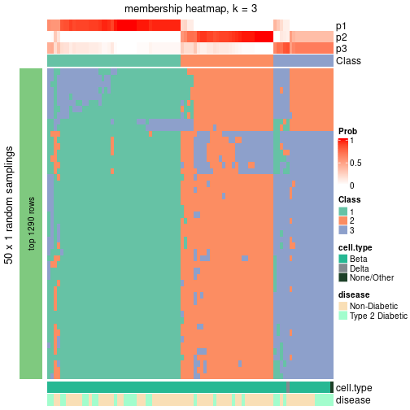</p>

</div>
<div id='tab-node-021-membership-heatmap-3'>
<pre><code class="r">membership_heatmap(res, k = 4)
</code></pre>

<p></p>

</div>
</div>

As soon as the classes for columns are determined, the signatures
that are significantly different between subgroups can be looked for. 
Following are the heatmaps for signatures.


Signature heatmaps where rows are scaled:


<script>
$( function() {
	$( '#tabs-node-021-get-signatures' ).tabs();
} );
</script>
<div id='tabs-node-021-get-signatures'>
<ul>
<li><a href='#tab-node-021-get-signatures-1'>k = 2</a></li>
<li><a href='#tab-node-021-get-signatures-2'>k = 3</a></li>
<li><a href='#tab-node-021-get-signatures-3'>k = 4</a></li>
</ul>
<div id='tab-node-021-get-signatures-1'>
<pre><code class="r">get_signatures(res, k = 2)
</code></pre>

<p></p>

</div>
<div id='tab-node-021-get-signatures-2'>
<pre><code class="r">get_signatures(res, k = 3)
</code></pre>

<p></p>

</div>
<div id='tab-node-021-get-signatures-3'>
<pre><code class="r">get_signatures(res, k = 4)
</code></pre>

<p></p>

</div>
</div>


Signature heatmaps where rows are not scaled:


<script>
$( function() {
	$( '#tabs-node-021-get-signatures-no-scale' ).tabs();
} );
</script>
<div id='tabs-node-021-get-signatures-no-scale'>
<ul>
<li><a href='#tab-node-021-get-signatures-no-scale-1'>k = 2</a></li>
<li><a href='#tab-node-021-get-signatures-no-scale-2'>k = 3</a></li>
<li><a href='#tab-node-021-get-signatures-no-scale-3'>k = 4</a></li>
</ul>
<div id='tab-node-021-get-signatures-no-scale-1'>
<pre><code class="r">get_signatures(res, k = 2, scale_rows = FALSE)
</code></pre>

<p>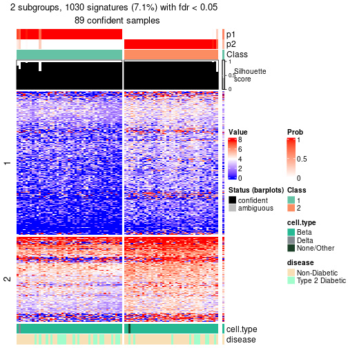</p>

</div>
<div id='tab-node-021-get-signatures-no-scale-2'>
<pre><code class="r">get_signatures(res, k = 3, scale_rows = FALSE)
</code></pre>

<p></p>

</div>
<div id='tab-node-021-get-signatures-no-scale-3'>
<pre><code class="r">get_signatures(res, k = 4, scale_rows = FALSE)
</code></pre>

<p></p>

</div>
</div>


Compare the overlap of signatures from different k:

```r
compare_signatures(res)
```


`get_signature()` returns a data frame invisibly. To get the list of signatures, the function
call should be assigned to a variable explicitly. In following code, if `plot` argument is set
to `FALSE`, no heatmap is plotted while only the differential analysis is performed.

```r
# code only for demonstration
tb = get_signature(res, k = ..., plot = FALSE)
```

An example of the output of `tb` is:

```
#>   which_row         fdr    mean_1    mean_2 scaled_mean_1 scaled_mean_2 km
#> 1        38 0.042760348  8.373488  9.131774    -0.5533452     0.5164555  1
#> 2        40 0.018707592  7.106213  8.469186    -0.6173731     0.5762149  1
#> 3        55 0.019134737 10.221463 11.207825    -0.6159697     0.5749050  1
#> 4        59 0.006059896  5.921854  7.869574    -0.6899429     0.6439467  1
#> 5        60 0.018055526  8.928898 10.211722    -0.6204761     0.5791110  1
#> 6        98 0.009384629 15.714769 14.887706     0.6635654    -0.6193277  2
...
```

The columns in `tb` are:

1. `which_row`: row indices corresponding to the input matrix.
2. `fdr`: FDR for the differential test. 
3. `mean_x`: The mean value in group x.
4. `scaled_mean_x`: The mean value in group x after rows are scaled.
5. `km`: Row groups if k-means clustering is applied to rows (which is done by automatically selecting number of clusters).

If there are too many signatures, `top_signatures = ...` can be set to only show the 
signatures with the highest FDRs:

```r
# code only for demonstration
# e.g. to show the top 500 most significant rows
tb = get_signature(res, k = ..., top_signatures = 500)
```

If the signatures are defined as these which are uniquely high in current group, `diff_method` argument
can be set to `"uniquely_high_in_one_group"`:

```r
# code only for demonstration
tb = get_signature(res, k = ..., diff_method = "uniquely_high_in_one_group")
```


UMAP plot which shows how samples are separated.


<script>
$( function() {
	$( '#tabs-node-021-dimension-reduction' ).tabs();
} );
</script>
<div id='tabs-node-021-dimension-reduction'>
<ul>
<li><a href='#tab-node-021-dimension-reduction-1'>k = 2</a></li>
<li><a href='#tab-node-021-dimension-reduction-2'>k = 3</a></li>
<li><a href='#tab-node-021-dimension-reduction-3'>k = 4</a></li>
</ul>
<div id='tab-node-021-dimension-reduction-1'>
<pre><code class="r">dimension_reduction(res, k = 2, method = &quot;UMAP&quot;)
</code></pre>

<p></p>

</div>
<div id='tab-node-021-dimension-reduction-2'>
<pre><code class="r">dimension_reduction(res, k = 3, method = &quot;UMAP&quot;)
</code></pre>

<p></p>

</div>
<div id='tab-node-021-dimension-reduction-3'>
<pre><code class="r">dimension_reduction(res, k = 4, method = &quot;UMAP&quot;)
</code></pre>

<p>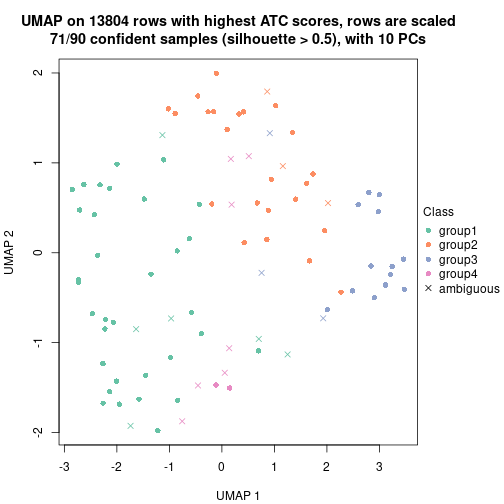</p>

</div>
</div>


Following heatmap shows how subgroups are split when increasing `k`:

```r
collect_classes(res)
```


Test correlation between subgroups and known annotations. If the known
annotation is numeric, one-way ANOVA test is applied, and if the known
annotation is discrete, chi-squared contingency table test is applied.

```r
test_to_known_factors(res)
```

```
#>             n_sample cell.type(p-value) disease(p-value) k
#> ATC:skmeans       89             0.3655           0.2147 2
#> ATC:skmeans       82             0.0977           0.0497 3
#> ATC:skmeans       71             0.2100           0.0244 4
```


If matrix rows can be associated to genes, consider to use `functional_enrichment(res,
...)` to perform function enrichment for the signature genes. See [this vignette](https://jokergoo.github.io/cola_vignettes/functional_enrichment.html) for more detailed explanations.


 

---------------------------------------------------


### Node022


Parent node: [Node02](#Node02).
Child nodes: 
                [Node0111](#Node0111)
        ,
                [Node0112](#Node0112)
        ,
                [Node0113](#Node0113)
        ,
                Node0121-leaf
        ,
                [Node0122](#Node0122)
        ,
                [Node0123](#Node0123)
        ,
                Node0124-leaf
        ,
                Node0211-leaf
        ,
                Node0212-leaf
        ,
                Node0221-leaf
        ,
                Node0222-leaf
        ,
                Node0231-leaf
        ,
                Node0232-leaf
        ,
                Node0233-leaf
        .


The object with results only for a single top-value method and a single partitioning method 
can be extracted as:

```r
res = res_rh["022"]
```

A summary of `res` and all the functions that can be applied to it:

```r
res
```

```
#> A 'ConsensusPartition' object with k = 2, 3, 4.
#>   On a matrix with 13810 rows and 76 columns.
#>   Top rows (1381) are extracted by 'ATC' method.
#>   Subgroups are detected by 'skmeans' method.
#>   Performed in total 150 partitions by row resampling.
#>   Best k for subgroups seems to be 2.
#> 
#> Following methods can be applied to this 'ConsensusPartition' object:
#>  [1] "cola_report"             "collect_classes"         "collect_plots"          
#>  [4] "collect_stats"           "colnames"                "compare_partitions"     
#>  [7] "compare_signatures"      "consensus_heatmap"       "dimension_reduction"    
#> [10] "functional_enrichment"   "get_anno_col"            "get_anno"               
#> [13] "get_classes"             "get_consensus"           "get_matrix"             
#> [16] "get_membership"          "get_param"               "get_signatures"         
#> [19] "get_stats"               "is_best_k"               "is_stable_k"            
#> [22] "membership_heatmap"      "ncol"                    "nrow"                   
#> [25] "plot_ecdf"               "predict_classes"         "rownames"               
#> [28] "select_partition_number" "show"                    "suggest_best_k"         
#> [31] "test_to_known_factors"   "top_rows_heatmap"
```

`collect_plots()` function collects all the plots made from `res` for all `k` (number of subgroups)
into one single page to provide an easy and fast comparison between different `k`.

```r
collect_plots(res)
```

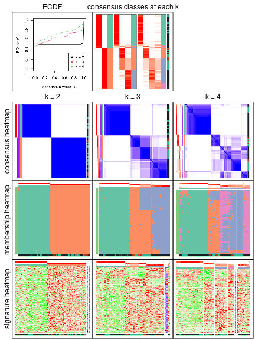

The plots are:

- The first row: a plot of the eCDF (empirical cumulative distribution
  function) curves of the consensus matrix for each `k` and the heatmap of
  predicted classes for each `k`.
- The second row: heatmaps of the consensus matrix for each `k`.
- The third row: heatmaps of the membership matrix for each `k`.
- The fouth row: heatmaps of the signatures for each `k`.

All the plots in panels can be made by individual functions and they are
plotted later in this section.

`select_partition_number()` produces several plots showing different
statistics for choosing "optimized" `k`. There are following statistics:

- eCDF curves of the consensus matrix for each `k`;
- 1-PAC. [The PAC score](https://en.wikipedia.org/wiki/Consensus_clustering#Over-interpretation_potential_of_consensus_clustering)
  measures the proportion of the ambiguous subgrouping.
- Mean silhouette score.
- Concordance. The mean probability of fiting the consensus subgroup labels in all
  partitions.
- Area increased. Denote $A_k$ as the area under the eCDF curve for current
  `k`, the area increased is defined as $A_k - A_{k-1}$.
- Rand index. The percent of pairs of samples that are both in a same cluster
  or both are not in a same cluster in the partition of k and k-1.
- Jaccard index. The ratio of pairs of samples are both in a same cluster in
  the partition of k and k-1 and the pairs of samples are both in a same
  cluster in the partition k or k-1.

The detailed explanations of these statistics can be found in [the _cola_
vignette](https://jokergoo.github.io/cola_vignettes/cola.html#toc_13).

Generally speaking, higher 1-PAC score, higher mean silhouette score or higher
concordance corresponds to better partition. Rand index and Jaccard index
measure how similar the current partition is compared to partition with `k-1`.
If they are too similar, we won't accept `k` is better than `k-1`.

```r
select_partition_number(res)
```


The numeric values for all these statistics can be obtained by `get_stats()`.

```r
get_stats(res)
```

```
#>   k 1-PAC mean_silhouette concordance area_increased  Rand Jaccard
#> 2 2 1.000           0.997       0.998          0.502 0.499   0.499
#> 3 3 0.791           0.841       0.913          0.300 0.809   0.628
#> 4 4 0.705           0.671       0.822          0.106 0.849   0.619
```

`suggest_best_k()` suggests the best $k$ based on these statistics. The rules are as follows:

- All $k$ with Jaccard index larger than 0.95 are removed because increasing
  $k$ does not provide enough extra information. If all $k$ are removed, it is
  marked as no subgroup is detected.
- For all $k$ with 1-PAC score larger than 0.9, the maximal $k$ is taken as
  the best $k$, and other $k$ are marked as optional $k$.
- If it does not fit the second rule. The $k$ with the maximal vote of the
  highest 1-PAC score, highest mean silhouette, and highest concordance is
  taken as the best $k$.

```r
suggest_best_k(res)
```

```
#> [1] 2
```


Following is the table of the partitions (You need to click the **show/hide
code output** link to see it). The membership matrix (columns with name `p*`)
is inferred by
[`clue::cl_consensus()`](https://www.rdocumentation.org/link/cl_consensus?package=clue)
function with the `SE` method. Basically the value in the membership matrix
represents the probability to belong to a certain group. The finall subgroup
label for an item is determined with the group with highest probability it
belongs to.

In `get_classes()` function, the entropy is calculated from the membership
matrix and the silhouette score is calculated from the consensus matrix.


<script>
$( function() {
	$( '#tabs-node-022-get-classes' ).tabs();
} );
</script>
<div id='tabs-node-022-get-classes'>
<ul>
<li><a href='#tab-node-022-get-classes-1'>k = 2</a></li>
<li><a href='#tab-node-022-get-classes-2'>k = 3</a></li>
<li><a href='#tab-node-022-get-classes-3'>k = 4</a></li>
</ul>

<div id='tab-node-022-get-classes-1'>
<p><a id='tab-node-022-get-classes-1-a' style='color:#0366d6' href='#'>show/hide code output</a></p>
<pre><code class="r">cbind(get_classes(res, k = 2), get_membership(res, k = 2))
</code></pre>

<pre><code>#&gt;               class entropy silhouette   p1   p2
#&gt; 10th_C28_S91      2   0.000      0.999 0.00 1.00
#&gt; 10th_C43_S50      1   0.000      0.998 1.00 0.00
#&gt; 10th_C51_S80      1   0.000      0.998 1.00 0.00
#&gt; 10th_C53_S118     1   0.000      0.998 1.00 0.00
#&gt; 10th_C57_S81      2   0.000      0.999 0.00 1.00
#&gt; 10th_C58_S111     2   0.000      0.999 0.00 1.00
#&gt; 10th_C5_S95       1   0.000      0.998 1.00 0.00
#&gt; 10th_C6_S88       2   0.000      0.999 0.00 1.00
#&gt; 10th_C78_S114     2   0.000      0.999 0.00 1.00
#&gt; 11th-C10_S63      2   0.000      0.999 0.00 1.00
#&gt; 11th-C30_S66      2   0.000      0.999 0.00 1.00
#&gt; 11th-C37_S6       1   0.000      0.998 1.00 0.00
#&gt; 11th-C62_S33      2   0.000      0.999 0.00 1.00
#&gt; 11th-C67_S26      1   0.000      0.998 1.00 0.00
#&gt; 11th-C93_S30      2   0.000      0.999 0.00 1.00
#&gt; 12th-C1_S195      1   0.000      0.998 1.00 0.00
#&gt; 12th-C23_S149     1   0.000      0.998 1.00 0.00
#&gt; 12th-C37_S187     2   0.000      0.999 0.00 1.00
#&gt; 12th-C39_S201     1   0.000      0.998 1.00 0.00
#&gt; 12th-C40_S144     1   0.000      0.998 1.00 0.00
#&gt; 12th-C4_S154      1   0.000      0.998 1.00 0.00
#&gt; 12th-C71_S171     1   0.000      0.998 1.00 0.00
#&gt; 12th-C75_S206     1   0.000      0.998 1.00 0.00
#&gt; 12th-C8_S189      1   0.000      0.998 1.00 0.00
#&gt; 13th_C17_S186     2   0.000      0.999 0.00 1.00
#&gt; 13th_C18_S179     2   0.000      0.999 0.00 1.00
#&gt; 13th_C1_S147      1   0.000      0.998 1.00 0.00
#&gt; 13th_C20_S142     1   0.000      0.998 1.00 0.00
#&gt; 13th_C21_S135     2   0.000      0.999 0.00 1.00
#&gt; 13th_C29_S188     1   0.000      0.998 1.00 0.00
#&gt; 13th_C31_S137     2   0.000      0.999 0.00 1.00
#&gt; 13th_C38_S145     1   0.000      0.998 1.00 0.00
#&gt; 13th_C3_S132      1   0.000      0.998 1.00 0.00
#&gt; 13th_C46_S183     1   0.000      0.998 1.00 0.00
#&gt; 13th_C4_S191      1   0.000      0.998 1.00 0.00
#&gt; 13th_C51_S170     2   0.000      0.999 0.00 1.00
#&gt; 13th_C52_S198     2   0.000      0.999 0.00 1.00
#&gt; 13th_C53_S205     1   0.327      0.936 0.94 0.06
#&gt; 13th_C54_S212     1   0.000      0.998 1.00 0.00
#&gt; 13th_C55_S156     2   0.000      0.999 0.00 1.00
#&gt; 13th_C5_S184      2   0.000      0.999 0.00 1.00
#&gt; 13th_C63_S172     2   0.000      0.999 0.00 1.00
#&gt; 13th_C68_S165     2   0.000      0.999 0.00 1.00
#&gt; 13th_C69_S173     2   0.000      0.999 0.00 1.00
#&gt; 13th_C6_S177      1   0.000      0.998 1.00 0.00
#&gt; 13th_C70_S201     2   0.000      0.999 0.00 1.00
#&gt; 13th_C71_S208     2   0.000      0.999 0.00 1.00
#&gt; 13th_C77_S209     1   0.000      0.998 1.00 0.00
#&gt; 13th_C79_S174     2   0.000      0.999 0.00 1.00
#&gt; 13th_C86_S168     1   0.000      0.998 1.00 0.00
#&gt; 13th_C88_S218     2   0.000      0.999 0.00 1.00
#&gt; 13th_C89_S211     2   0.000      0.999 0.00 1.00
#&gt; 13th_C92_S169     1   0.000      0.998 1.00 0.00
#&gt; 13th_C93_S162     1   0.000      0.998 1.00 0.00
#&gt; 1st-C15_S3        2   0.000      0.999 0.00 1.00
#&gt; 2nd-C1_S3         2   0.000      0.999 0.00 1.00
#&gt; 2nd-C69_S42       2   0.000      0.999 0.00 1.00
#&gt; 2nd-C94_S96       2   0.000      0.999 0.00 1.00
#&gt; 4th-C68_S41       2   0.000      0.999 0.00 1.00
#&gt; 5th-C41_S113      2   0.000      0.999 0.00 1.00
#&gt; 5th-C83_S111      2   0.000      0.999 0.00 1.00
#&gt; 6th-C34_S61       1   0.000      0.998 1.00 0.00
#&gt; 6th-C45_S81       1   0.000      0.998 1.00 0.00
#&gt; 6th-C9_S12        1   0.000      0.998 1.00 0.00
#&gt; 7th-C47_S81       2   0.000      0.999 0.00 1.00
#&gt; 7th-C49_S4        2   0.000      0.999 0.00 1.00
#&gt; 7th-C85_S69       1   0.000      0.998 1.00 0.00
#&gt; 8th-C18_S110      2   0.000      0.999 0.00 1.00
#&gt; 8th-C21_S115      2   0.000      0.999 0.00 1.00
#&gt; 8th-C26_S126      1   0.000      0.998 1.00 0.00
#&gt; 8th-C37_S146      2   0.327      0.936 0.06 0.94
#&gt; 8th-C69_S119      2   0.000      0.999 0.00 1.00
#&gt; 8th-C91_S158      2   0.000      0.999 0.00 1.00
#&gt; 9th-C20_S35       2   0.000      0.999 0.00 1.00
#&gt; 9th-C85_S68       2   0.000      0.999 0.00 1.00
#&gt; 9th-C87_S66       1   0.000      0.998 1.00 0.00
</code></pre>

<script>
$('#tab-node-022-get-classes-1-a').parent().next().next().hide();
$('#tab-node-022-get-classes-1-a').click(function(){
  $('#tab-node-022-get-classes-1-a').parent().next().next().toggle();
  return(false);
});
</script>
</div>

<div id='tab-node-022-get-classes-2'>
<p><a id='tab-node-022-get-classes-2-a' style='color:#0366d6' href='#'>show/hide code output</a></p>
<pre><code class="r">cbind(get_classes(res, k = 3), get_membership(res, k = 3))
</code></pre>

<pre><code>#&gt;               class entropy silhouette   p1   p2   p3
#&gt; 10th_C28_S91      3  0.2537      0.856 0.00 0.08 0.92
#&gt; 10th_C43_S50      1  0.0892      0.970 0.98 0.00 0.02
#&gt; 10th_C51_S80      1  0.0000      0.984 1.00 0.00 0.00
#&gt; 10th_C53_S118     1  0.0000      0.984 1.00 0.00 0.00
#&gt; 10th_C57_S81      3  0.0000      0.886 0.00 0.00 1.00
#&gt; 10th_C58_S111     2  0.0892      0.748 0.00 0.98 0.02
#&gt; 10th_C5_S95       1  0.0000      0.984 1.00 0.00 0.00
#&gt; 10th_C6_S88       2  0.5835      0.682 0.00 0.66 0.34
#&gt; 10th_C78_S114     2  0.5835      0.682 0.00 0.66 0.34
#&gt; 11th-C10_S63      2  0.0000      0.745 0.00 1.00 0.00
#&gt; 11th-C30_S66      2  0.0000      0.745 0.00 1.00 0.00
#&gt; 11th-C37_S6       1  0.0000      0.984 1.00 0.00 0.00
#&gt; 11th-C62_S33      2  0.2066      0.714 0.00 0.94 0.06
#&gt; 11th-C67_S26      3  0.5643      0.584 0.22 0.02 0.76
#&gt; 11th-C93_S30      3  0.0892      0.876 0.00 0.02 0.98
#&gt; 12th-C1_S195      1  0.0000      0.984 1.00 0.00 0.00
#&gt; 12th-C23_S149     1  0.0000      0.984 1.00 0.00 0.00
#&gt; 12th-C37_S187     3  0.4002      0.782 0.00 0.16 0.84
#&gt; 12th-C39_S201     1  0.0000      0.984 1.00 0.00 0.00
#&gt; 12th-C40_S144     1  0.0000      0.984 1.00 0.00 0.00
#&gt; 12th-C4_S154      1  0.0892      0.970 0.98 0.02 0.00
#&gt; 12th-C71_S171     1  0.0000      0.984 1.00 0.00 0.00
#&gt; 12th-C75_S206     1  0.0000      0.984 1.00 0.00 0.00
#&gt; 12th-C8_S189      1  0.0000      0.984 1.00 0.00 0.00
#&gt; 13th_C17_S186     2  0.5706      0.711 0.00 0.68 0.32
#&gt; 13th_C18_S179     3  0.0000      0.886 0.00 0.00 1.00
#&gt; 13th_C1_S147      1  0.0000      0.984 1.00 0.00 0.00
#&gt; 13th_C20_S142     1  0.0000      0.984 1.00 0.00 0.00
#&gt; 13th_C21_S135     2  0.5706      0.711 0.00 0.68 0.32
#&gt; 13th_C29_S188     1  0.0000      0.984 1.00 0.00 0.00
#&gt; 13th_C31_S137     3  0.2537      0.856 0.00 0.08 0.92
#&gt; 13th_C38_S145     1  0.0000      0.984 1.00 0.00 0.00
#&gt; 13th_C3_S132      1  0.0000      0.984 1.00 0.00 0.00
#&gt; 13th_C46_S183     1  0.0892      0.970 0.98 0.02 0.00
#&gt; 13th_C4_S191      1  0.0000      0.984 1.00 0.00 0.00
#&gt; 13th_C51_S170     2  0.5706      0.711 0.00 0.68 0.32
#&gt; 13th_C52_S198     2  0.0000      0.745 0.00 1.00 0.00
#&gt; 13th_C53_S205     2  0.8483      0.307 0.26 0.60 0.14
#&gt; 13th_C54_S212     1  0.0000      0.984 1.00 0.00 0.00
#&gt; 13th_C55_S156     3  0.5835      0.322 0.00 0.34 0.66
#&gt; 13th_C5_S184      2  0.5706      0.711 0.00 0.68 0.32
#&gt; 13th_C63_S172     2  0.5706      0.711 0.00 0.68 0.32
#&gt; 13th_C68_S165     2  0.5706      0.711 0.00 0.68 0.32
#&gt; 13th_C69_S173     3  0.5016      0.612 0.00 0.24 0.76
#&gt; 13th_C6_S177      1  0.0000      0.984 1.00 0.00 0.00
#&gt; 13th_C70_S201     2  0.5706      0.711 0.00 0.68 0.32
#&gt; 13th_C71_S208     2  0.5706      0.711 0.00 0.68 0.32
#&gt; 13th_C77_S209     1  0.0000      0.984 1.00 0.00 0.00
#&gt; 13th_C79_S174     3  0.2066      0.867 0.00 0.06 0.94
#&gt; 13th_C86_S168     1  0.0000      0.984 1.00 0.00 0.00
#&gt; 13th_C88_S218     3  0.2537      0.856 0.00 0.08 0.92
#&gt; 13th_C89_S211     2  0.5706      0.711 0.00 0.68 0.32
#&gt; 13th_C92_S169     1  0.0000      0.984 1.00 0.00 0.00
#&gt; 13th_C93_S162     1  0.0000      0.984 1.00 0.00 0.00
#&gt; 1st-C15_S3        3  0.0000      0.886 0.00 0.00 1.00
#&gt; 2nd-C1_S3         3  0.2959      0.805 0.00 0.10 0.90
#&gt; 2nd-C69_S42       3  0.2959      0.837 0.00 0.10 0.90
#&gt; 2nd-C94_S96       3  0.0000      0.886 0.00 0.00 1.00
#&gt; 4th-C68_S41       2  0.4002      0.620 0.00 0.84 0.16
#&gt; 5th-C41_S113      2  0.0000      0.745 0.00 1.00 0.00
#&gt; 5th-C83_S111      2  0.5706      0.711 0.00 0.68 0.32
#&gt; 6th-C34_S61       1  0.6927      0.634 0.70 0.06 0.24
#&gt; 6th-C45_S81       1  0.0892      0.970 0.98 0.02 0.00
#&gt; 6th-C9_S12        1  0.1529      0.953 0.96 0.00 0.04
#&gt; 7th-C47_S81       2  0.0000      0.745 0.00 1.00 0.00
#&gt; 7th-C49_S4        3  0.0000      0.886 0.00 0.00 1.00
#&gt; 7th-C85_S69       1  0.0000      0.984 1.00 0.00 0.00
#&gt; 8th-C18_S110      2  0.0000      0.745 0.00 1.00 0.00
#&gt; 8th-C21_S115      3  0.0000      0.886 0.00 0.00 1.00
#&gt; 8th-C26_S126      1  0.0000      0.984 1.00 0.00 0.00
#&gt; 8th-C37_S146      3  0.0000      0.886 0.00 0.00 1.00
#&gt; 8th-C69_S119      2  0.0000      0.745 0.00 1.00 0.00
#&gt; 8th-C91_S158      2  0.0892      0.748 0.00 0.98 0.02
#&gt; 9th-C20_S35       3  0.2066      0.847 0.00 0.06 0.94
#&gt; 9th-C85_S68       3  0.0000      0.886 0.00 0.00 1.00
#&gt; 9th-C87_S66       1  0.3832      0.879 0.88 0.02 0.10
</code></pre>

<script>
$('#tab-node-022-get-classes-2-a').parent().next().next().hide();
$('#tab-node-022-get-classes-2-a').click(function(){
  $('#tab-node-022-get-classes-2-a').parent().next().next().toggle();
  return(false);
});
</script>
</div>

<div id='tab-node-022-get-classes-3'>
<p><a id='tab-node-022-get-classes-3-a' style='color:#0366d6' href='#'>show/hide code output</a></p>
<pre><code class="r">cbind(get_classes(res, k = 4), get_membership(res, k = 4))
</code></pre>

<pre><code>#&gt;               class entropy silhouette   p1   p2   p3   p4
#&gt; 10th_C28_S91      3  0.1913     0.3956 0.00 0.02 0.94 0.04
#&gt; 10th_C43_S50      1  0.3801     0.7633 0.78 0.00 0.00 0.22
#&gt; 10th_C51_S80      1  0.2345     0.8890 0.90 0.00 0.00 0.10
#&gt; 10th_C53_S118     1  0.0000     0.9368 1.00 0.00 0.00 0.00
#&gt; 10th_C57_S81      3  0.4624    -0.4785 0.00 0.00 0.66 0.34
#&gt; 10th_C58_S111     2  0.3935     0.7662 0.00 0.84 0.10 0.06
#&gt; 10th_C5_S95       1  0.1637     0.9033 0.94 0.00 0.00 0.06
#&gt; 10th_C6_S88       3  0.7148     0.5774 0.00 0.22 0.56 0.22
#&gt; 10th_C78_S114     3  0.6840     0.5877 0.00 0.18 0.60 0.22
#&gt; 11th-C10_S63      2  0.1913     0.8817 0.00 0.94 0.04 0.02
#&gt; 11th-C30_S66      2  0.2345     0.8608 0.00 0.90 0.00 0.10
#&gt; 11th-C37_S6       1  0.0707     0.9279 0.98 0.00 0.00 0.02
#&gt; 11th-C62_S33      2  0.1637     0.8665 0.00 0.94 0.06 0.00
#&gt; 11th-C67_S26      4  0.6159     0.7291 0.04 0.02 0.30 0.64
#&gt; 11th-C93_S30      4  0.4977     0.7938 0.00 0.00 0.46 0.54
#&gt; 12th-C1_S195      1  0.0000     0.9368 1.00 0.00 0.00 0.00
#&gt; 12th-C23_S149     1  0.0000     0.9368 1.00 0.00 0.00 0.00
#&gt; 12th-C37_S187     3  0.6921     0.3408 0.00 0.26 0.58 0.16
#&gt; 12th-C39_S201     1  0.0000     0.9368 1.00 0.00 0.00 0.00
#&gt; 12th-C40_S144     1  0.2345     0.8890 0.90 0.00 0.00 0.10
#&gt; 12th-C4_S154      1  0.3935     0.8411 0.84 0.06 0.00 0.10
#&gt; 12th-C71_S171     1  0.0000     0.9368 1.00 0.00 0.00 0.00
#&gt; 12th-C75_S206     1  0.0000     0.9368 1.00 0.00 0.00 0.00
#&gt; 12th-C8_S189      1  0.2345     0.8890 0.90 0.00 0.00 0.10
#&gt; 13th_C17_S186     3  0.7346     0.5913 0.00 0.20 0.52 0.28
#&gt; 13th_C18_S179     3  0.2921     0.0548 0.00 0.00 0.86 0.14
#&gt; 13th_C1_S147      1  0.0000     0.9368 1.00 0.00 0.00 0.00
#&gt; 13th_C20_S142     1  0.0000     0.9368 1.00 0.00 0.00 0.00
#&gt; 13th_C21_S135     3  0.7346     0.5913 0.00 0.20 0.52 0.28
#&gt; 13th_C29_S188     1  0.0000     0.9368 1.00 0.00 0.00 0.00
#&gt; 13th_C31_S137     3  0.1211     0.3065 0.00 0.00 0.96 0.04
#&gt; 13th_C38_S145     1  0.1637     0.9107 0.94 0.00 0.00 0.06
#&gt; 13th_C3_S132      1  0.0707     0.9279 0.98 0.00 0.00 0.02
#&gt; 13th_C46_S183     1  0.4088     0.8226 0.82 0.04 0.00 0.14
#&gt; 13th_C4_S191      1  0.0000     0.9368 1.00 0.00 0.00 0.00
#&gt; 13th_C51_S170     3  0.7474     0.5752 0.00 0.22 0.50 0.28
#&gt; 13th_C52_S198     2  0.1211     0.8930 0.00 0.96 0.00 0.04
#&gt; 13th_C53_S205     2  0.4211     0.7728 0.04 0.84 0.02 0.10
#&gt; 13th_C54_S212     1  0.0000     0.9368 1.00 0.00 0.00 0.00
#&gt; 13th_C55_S156     3  0.3853     0.5223 0.00 0.16 0.82 0.02
#&gt; 13th_C5_S184      3  0.7346     0.5913 0.00 0.20 0.52 0.28
#&gt; 13th_C63_S172     3  0.7346     0.5913 0.00 0.20 0.52 0.28
#&gt; 13th_C68_S165     3  0.7346     0.5913 0.00 0.20 0.52 0.28
#&gt; 13th_C69_S173     3  0.5902     0.5920 0.00 0.16 0.70 0.14
#&gt; 13th_C6_S177      1  0.0000     0.9368 1.00 0.00 0.00 0.00
#&gt; 13th_C70_S201     3  0.7346     0.5913 0.00 0.20 0.52 0.28
#&gt; 13th_C71_S208     3  0.7346     0.5913 0.00 0.20 0.52 0.28
#&gt; 13th_C77_S209     1  0.0000     0.9368 1.00 0.00 0.00 0.00
#&gt; 13th_C79_S174     3  0.0707     0.3411 0.00 0.00 0.98 0.02
#&gt; 13th_C86_S168     1  0.0000     0.9368 1.00 0.00 0.00 0.00
#&gt; 13th_C88_S218     3  0.1211     0.3704 0.00 0.00 0.96 0.04
#&gt; 13th_C89_S211     3  0.7285     0.5904 0.00 0.18 0.52 0.30
#&gt; 13th_C92_S169     1  0.0000     0.9368 1.00 0.00 0.00 0.00
#&gt; 13th_C93_S162     1  0.0000     0.9368 1.00 0.00 0.00 0.00
#&gt; 1st-C15_S3        4  0.4994     0.7845 0.00 0.00 0.48 0.52
#&gt; 2nd-C1_S3         4  0.6843     0.6997 0.00 0.10 0.44 0.46
#&gt; 2nd-C69_S42       3  0.3247     0.4671 0.00 0.06 0.88 0.06
#&gt; 2nd-C94_S96       4  0.4994     0.7827 0.00 0.00 0.48 0.52
#&gt; 4th-C68_S41       2  0.2706     0.8265 0.00 0.90 0.08 0.02
#&gt; 5th-C41_S113      2  0.0000     0.8946 0.00 1.00 0.00 0.00
#&gt; 5th-C83_S111      3  0.7427     0.5730 0.00 0.20 0.50 0.30
#&gt; 6th-C34_S61       4  0.8073     0.2132 0.36 0.10 0.06 0.48
#&gt; 6th-C45_S81       1  0.1913     0.9078 0.94 0.04 0.00 0.02
#&gt; 6th-C9_S12        1  0.5820     0.5510 0.68 0.00 0.08 0.24
#&gt; 7th-C47_S81       2  0.0000     0.8946 0.00 1.00 0.00 0.00
#&gt; 7th-C49_S4        4  0.4855     0.7905 0.00 0.00 0.40 0.60
#&gt; 7th-C85_S69       1  0.0000     0.9368 1.00 0.00 0.00 0.00
#&gt; 8th-C18_S110      2  0.1637     0.8871 0.00 0.94 0.00 0.06
#&gt; 8th-C21_S115      3  0.4948    -0.7291 0.00 0.00 0.56 0.44
#&gt; 8th-C26_S126      1  0.0000     0.9368 1.00 0.00 0.00 0.00
#&gt; 8th-C37_S146      4  0.4948     0.7983 0.00 0.00 0.44 0.56
#&gt; 8th-C69_S119      2  0.0707     0.8954 0.00 0.98 0.00 0.02
#&gt; 8th-C91_S158      2  0.4610     0.7860 0.00 0.80 0.10 0.10
#&gt; 9th-C20_S35       3  0.6840    -0.3160 0.00 0.18 0.60 0.22
#&gt; 9th-C85_S68       3  0.4994    -0.7516 0.00 0.00 0.52 0.48
#&gt; 9th-C87_S66       1  0.8165    -0.0894 0.44 0.08 0.08 0.40
</code></pre>

<script>
$('#tab-node-022-get-classes-3-a').parent().next().next().hide();
$('#tab-node-022-get-classes-3-a').click(function(){
  $('#tab-node-022-get-classes-3-a').parent().next().next().toggle();
  return(false);
});
</script>
</div>
</div>

Heatmaps for the consensus matrix. It visualizes the probability of two
samples to be in a same group.


<script>
$( function() {
	$( '#tabs-node-022-consensus-heatmap' ).tabs();
} );
</script>
<div id='tabs-node-022-consensus-heatmap'>
<ul>
<li><a href='#tab-node-022-consensus-heatmap-1'>k = 2</a></li>
<li><a href='#tab-node-022-consensus-heatmap-2'>k = 3</a></li>
<li><a href='#tab-node-022-consensus-heatmap-3'>k = 4</a></li>
</ul>
<div id='tab-node-022-consensus-heatmap-1'>
<pre><code class="r">consensus_heatmap(res, k = 2)
</code></pre>

<p></p>

</div>
<div id='tab-node-022-consensus-heatmap-2'>
<pre><code class="r">consensus_heatmap(res, k = 3)
</code></pre>

<p></p>

</div>
<div id='tab-node-022-consensus-heatmap-3'>
<pre><code class="r">consensus_heatmap(res, k = 4)
</code></pre>

<p></p>

</div>
</div>

Heatmaps for the membership of samples in all partitions to see how consistent they are:


<script>
$( function() {
	$( '#tabs-node-022-membership-heatmap' ).tabs();
} );
</script>
<div id='tabs-node-022-membership-heatmap'>
<ul>
<li><a href='#tab-node-022-membership-heatmap-1'>k = 2</a></li>
<li><a href='#tab-node-022-membership-heatmap-2'>k = 3</a></li>
<li><a href='#tab-node-022-membership-heatmap-3'>k = 4</a></li>
</ul>
<div id='tab-node-022-membership-heatmap-1'>
<pre><code class="r">membership_heatmap(res, k = 2)
</code></pre>

<p></p>

</div>
<div id='tab-node-022-membership-heatmap-2'>
<pre><code class="r">membership_heatmap(res, k = 3)
</code></pre>

<p></p>

</div>
<div id='tab-node-022-membership-heatmap-3'>
<pre><code class="r">membership_heatmap(res, k = 4)
</code></pre>

<p></p>

</div>
</div>

As soon as the classes for columns are determined, the signatures
that are significantly different between subgroups can be looked for. 
Following are the heatmaps for signatures.


Signature heatmaps where rows are scaled:


<script>
$( function() {
	$( '#tabs-node-022-get-signatures' ).tabs();
} );
</script>
<div id='tabs-node-022-get-signatures'>
<ul>
<li><a href='#tab-node-022-get-signatures-1'>k = 2</a></li>
<li><a href='#tab-node-022-get-signatures-2'>k = 3</a></li>
<li><a href='#tab-node-022-get-signatures-3'>k = 4</a></li>
</ul>
<div id='tab-node-022-get-signatures-1'>
<pre><code class="r">get_signatures(res, k = 2)
</code></pre>

<p></p>

</div>
<div id='tab-node-022-get-signatures-2'>
<pre><code class="r">get_signatures(res, k = 3)
</code></pre>

<p></p>

</div>
<div id='tab-node-022-get-signatures-3'>
<pre><code class="r">get_signatures(res, k = 4)
</code></pre>

<p></p>

</div>
</div>


Signature heatmaps where rows are not scaled:


<script>
$( function() {
	$( '#tabs-node-022-get-signatures-no-scale' ).tabs();
} );
</script>
<div id='tabs-node-022-get-signatures-no-scale'>
<ul>
<li><a href='#tab-node-022-get-signatures-no-scale-1'>k = 2</a></li>
<li><a href='#tab-node-022-get-signatures-no-scale-2'>k = 3</a></li>
<li><a href='#tab-node-022-get-signatures-no-scale-3'>k = 4</a></li>
</ul>
<div id='tab-node-022-get-signatures-no-scale-1'>
<pre><code class="r">get_signatures(res, k = 2, scale_rows = FALSE)
</code></pre>

<p></p>

</div>
<div id='tab-node-022-get-signatures-no-scale-2'>
<pre><code class="r">get_signatures(res, k = 3, scale_rows = FALSE)
</code></pre>

<p></p>

</div>
<div id='tab-node-022-get-signatures-no-scale-3'>
<pre><code class="r">get_signatures(res, k = 4, scale_rows = FALSE)
</code></pre>

<p></p>

</div>
</div>


Compare the overlap of signatures from different k:

```r
compare_signatures(res)
```


`get_signature()` returns a data frame invisibly. To get the list of signatures, the function
call should be assigned to a variable explicitly. In following code, if `plot` argument is set
to `FALSE`, no heatmap is plotted while only the differential analysis is performed.

```r
# code only for demonstration
tb = get_signature(res, k = ..., plot = FALSE)
```

An example of the output of `tb` is:

```
#>   which_row         fdr    mean_1    mean_2 scaled_mean_1 scaled_mean_2 km
#> 1        38 0.042760348  8.373488  9.131774    -0.5533452     0.5164555  1
#> 2        40 0.018707592  7.106213  8.469186    -0.6173731     0.5762149  1
#> 3        55 0.019134737 10.221463 11.207825    -0.6159697     0.5749050  1
#> 4        59 0.006059896  5.921854  7.869574    -0.6899429     0.6439467  1
#> 5        60 0.018055526  8.928898 10.211722    -0.6204761     0.5791110  1
#> 6        98 0.009384629 15.714769 14.887706     0.6635654    -0.6193277  2
...
```

The columns in `tb` are:

1. `which_row`: row indices corresponding to the input matrix.
2. `fdr`: FDR for the differential test. 
3. `mean_x`: The mean value in group x.
4. `scaled_mean_x`: The mean value in group x after rows are scaled.
5. `km`: Row groups if k-means clustering is applied to rows (which is done by automatically selecting number of clusters).

If there are too many signatures, `top_signatures = ...` can be set to only show the 
signatures with the highest FDRs:

```r
# code only for demonstration
# e.g. to show the top 500 most significant rows
tb = get_signature(res, k = ..., top_signatures = 500)
```

If the signatures are defined as these which are uniquely high in current group, `diff_method` argument
can be set to `"uniquely_high_in_one_group"`:

```r
# code only for demonstration
tb = get_signature(res, k = ..., diff_method = "uniquely_high_in_one_group")
```


UMAP plot which shows how samples are separated.


<script>
$( function() {
	$( '#tabs-node-022-dimension-reduction' ).tabs();
} );
</script>
<div id='tabs-node-022-dimension-reduction'>
<ul>
<li><a href='#tab-node-022-dimension-reduction-1'>k = 2</a></li>
<li><a href='#tab-node-022-dimension-reduction-2'>k = 3</a></li>
<li><a href='#tab-node-022-dimension-reduction-3'>k = 4</a></li>
</ul>
<div id='tab-node-022-dimension-reduction-1'>
<pre><code class="r">dimension_reduction(res, k = 2, method = &quot;UMAP&quot;)
</code></pre>

<p></p>

</div>
<div id='tab-node-022-dimension-reduction-2'>
<pre><code class="r">dimension_reduction(res, k = 3, method = &quot;UMAP&quot;)
</code></pre>

<p></p>

</div>
<div id='tab-node-022-dimension-reduction-3'>
<pre><code class="r">dimension_reduction(res, k = 4, method = &quot;UMAP&quot;)
</code></pre>

<p></p>

</div>
</div>


Following heatmap shows how subgroups are split when increasing `k`:

```r
collect_classes(res)
```


Test correlation between subgroups and known annotations. If the known
annotation is numeric, one-way ANOVA test is applied, and if the known
annotation is discrete, chi-squared contingency table test is applied.

```r
test_to_known_factors(res)
```

```
#>             n_sample cell.type(p-value) disease(p-value) k
#> ATC:skmeans       76           1.92e-02          0.13533 2
#> ATC:skmeans       74           5.28e-08          0.08672 3
#> ATC:skmeans       63           9.05e-06          0.00198 4
```


If matrix rows can be associated to genes, consider to use `functional_enrichment(res,
...)` to perform function enrichment for the signature genes. See [this vignette](https://jokergoo.github.io/cola_vignettes/functional_enrichment.html) for more detailed explanations.


 

---------------------------------------------------


### Node023


Parent node: [Node02](#Node02).
Child nodes: 
                [Node0111](#Node0111)
        ,
                [Node0112](#Node0112)
        ,
                [Node0113](#Node0113)
        ,
                Node0121-leaf
        ,
                [Node0122](#Node0122)
        ,
                [Node0123](#Node0123)
        ,
                Node0124-leaf
        ,
                Node0211-leaf
        ,
                Node0212-leaf
        ,
                Node0221-leaf
        ,
                Node0222-leaf
        ,
                Node0231-leaf
        ,
                Node0232-leaf
        ,
                Node0233-leaf
        .


The object with results only for a single top-value method and a single partitioning method 
can be extracted as:

```r
res = res_rh["023"]
```

A summary of `res` and all the functions that can be applied to it:

```r
res
```

```
#> A 'ConsensusPartition' object with k = 2, 3, 4.
#>   On a matrix with 13549 rows and 43 columns.
#>   Top rows (1355) are extracted by 'ATC' method.
#>   Subgroups are detected by 'skmeans' method.
#>   Performed in total 150 partitions by row resampling.
#>   Best k for subgroups seems to be 3.
#> 
#> Following methods can be applied to this 'ConsensusPartition' object:
#>  [1] "cola_report"             "collect_classes"         "collect_plots"          
#>  [4] "collect_stats"           "colnames"                "compare_partitions"     
#>  [7] "compare_signatures"      "consensus_heatmap"       "dimension_reduction"    
#> [10] "functional_enrichment"   "get_anno_col"            "get_anno"               
#> [13] "get_classes"             "get_consensus"           "get_matrix"             
#> [16] "get_membership"          "get_param"               "get_signatures"         
#> [19] "get_stats"               "is_best_k"               "is_stable_k"            
#> [22] "membership_heatmap"      "ncol"                    "nrow"                   
#> [25] "plot_ecdf"               "predict_classes"         "rownames"               
#> [28] "select_partition_number" "show"                    "suggest_best_k"         
#> [31] "test_to_known_factors"   "top_rows_heatmap"
```

`collect_plots()` function collects all the plots made from `res` for all `k` (number of subgroups)
into one single page to provide an easy and fast comparison between different `k`.

```r
collect_plots(res)
```


The plots are:

- The first row: a plot of the eCDF (empirical cumulative distribution
  function) curves of the consensus matrix for each `k` and the heatmap of
  predicted classes for each `k`.
- The second row: heatmaps of the consensus matrix for each `k`.
- The third row: heatmaps of the membership matrix for each `k`.
- The fouth row: heatmaps of the signatures for each `k`.

All the plots in panels can be made by individual functions and they are
plotted later in this section.

`select_partition_number()` produces several plots showing different
statistics for choosing "optimized" `k`. There are following statistics:

- eCDF curves of the consensus matrix for each `k`;
- 1-PAC. [The PAC score](https://en.wikipedia.org/wiki/Consensus_clustering#Over-interpretation_potential_of_consensus_clustering)
  measures the proportion of the ambiguous subgrouping.
- Mean silhouette score.
- Concordance. The mean probability of fiting the consensus subgroup labels in all
  partitions.
- Area increased. Denote $A_k$ as the area under the eCDF curve for current
  `k`, the area increased is defined as $A_k - A_{k-1}$.
- Rand index. The percent of pairs of samples that are both in a same cluster
  or both are not in a same cluster in the partition of k and k-1.
- Jaccard index. The ratio of pairs of samples are both in a same cluster in
  the partition of k and k-1 and the pairs of samples are both in a same
  cluster in the partition k or k-1.

The detailed explanations of these statistics can be found in [the _cola_
vignette](https://jokergoo.github.io/cola_vignettes/cola.html#toc_13).

Generally speaking, higher 1-PAC score, higher mean silhouette score or higher
concordance corresponds to better partition. Rand index and Jaccard index
measure how similar the current partition is compared to partition with `k-1`.
If they are too similar, we won't accept `k` is better than `k-1`.

```r
select_partition_number(res)
```


The numeric values for all these statistics can be obtained by `get_stats()`.

```r
get_stats(res)
```

```
#>   k 1-PAC mean_silhouette concordance area_increased  Rand Jaccard
#> 2 2 1.000           0.984       0.993          0.475 0.522   0.522
#> 3 3 0.937           0.961       0.982          0.423 0.683   0.455
#> 4 4 0.699           0.607       0.825          0.106 0.874   0.640
```

`suggest_best_k()` suggests the best $k$ based on these statistics. The rules are as follows:

- All $k$ with Jaccard index larger than 0.95 are removed because increasing
  $k$ does not provide enough extra information. If all $k$ are removed, it is
  marked as no subgroup is detected.
- For all $k$ with 1-PAC score larger than 0.9, the maximal $k$ is taken as
  the best $k$, and other $k$ are marked as optional $k$.
- If it does not fit the second rule. The $k$ with the maximal vote of the
  highest 1-PAC score, highest mean silhouette, and highest concordance is
  taken as the best $k$.

```r
suggest_best_k(res)
```

```
#> [1] 3
#> attr(,"optional")
#> [1] 2
```

There is also optional best $k$ = 2 that is worth to check.

Following is the table of the partitions (You need to click the **show/hide
code output** link to see it). The membership matrix (columns with name `p*`)
is inferred by
[`clue::cl_consensus()`](https://www.rdocumentation.org/link/cl_consensus?package=clue)
function with the `SE` method. Basically the value in the membership matrix
represents the probability to belong to a certain group. The finall subgroup
label for an item is determined with the group with highest probability it
belongs to.

In `get_classes()` function, the entropy is calculated from the membership
matrix and the silhouette score is calculated from the consensus matrix.


<script>
$( function() {
	$( '#tabs-node-023-get-classes' ).tabs();
} );
</script>
<div id='tabs-node-023-get-classes'>
<ul>
<li><a href='#tab-node-023-get-classes-1'>k = 2</a></li>
<li><a href='#tab-node-023-get-classes-2'>k = 3</a></li>
<li><a href='#tab-node-023-get-classes-3'>k = 4</a></li>
</ul>

<div id='tab-node-023-get-classes-1'>
<p><a id='tab-node-023-get-classes-1-a' style='color:#0366d6' href='#'>show/hide code output</a></p>
<pre><code class="r">cbind(get_classes(res, k = 2), get_membership(res, k = 2))
</code></pre>

<pre><code>#&gt;               class entropy silhouette   p1   p2
#&gt; 10th_C42_S109     1   0.000      1.000 1.00 0.00
#&gt; 10th_C63_S82      1   0.000      1.000 1.00 0.00
#&gt; 10th_C77_S120     2   0.000      0.981 0.00 1.00
#&gt; 10th_C80_S77      1   0.000      1.000 1.00 0.00
#&gt; 10th_C86_S78      1   0.000      1.000 1.00 0.00
#&gt; 10th_C87_S71      1   0.000      1.000 1.00 0.00
#&gt; 11th-C26_S12      1   0.000      1.000 1.00 0.00
#&gt; 11th-C2_S8        2   0.000      0.981 0.00 1.00
#&gt; 11th-C43_S7       1   0.000      1.000 1.00 0.00
#&gt; 11th-C4_S62       1   0.000      1.000 1.00 0.00
#&gt; 11th-C55_S24      1   0.000      1.000 1.00 0.00
#&gt; 11th-C56_S32      2   0.000      0.981 0.00 1.00
#&gt; 11th-C64_S72      1   0.000      1.000 1.00 0.00
#&gt; 11th-C77_S82      2   0.000      0.981 0.00 1.00
#&gt; 12th-C36_S158     2   0.000      0.981 0.00 1.00
#&gt; 12th-C53_S168     1   0.000      1.000 1.00 0.00
#&gt; 12th-C56_S211     1   0.000      1.000 1.00 0.00
#&gt; 13th_C27_S151     1   0.000      1.000 1.00 0.00
#&gt; 13th_C36_S196     2   0.000      0.981 0.00 1.00
#&gt; 13th_C49_S155     1   0.000      1.000 1.00 0.00
#&gt; 13th_C72_S215     2   0.000      0.981 0.00 1.00
#&gt; 13th_C8_S140      1   0.000      1.000 1.00 0.00
#&gt; 2nd-C2_S2         2   0.000      0.981 0.00 1.00
#&gt; 3rd-C51_S87       2   0.000      0.981 0.00 1.00
#&gt; 4th-C27_S51       1   0.000      1.000 1.00 0.00
#&gt; 5th-C10_S92       1   0.000      1.000 1.00 0.00
#&gt; 5th-C11_S91       2   0.855      0.611 0.28 0.72
#&gt; 5th-C16_S98       2   0.000      0.981 0.00 1.00
#&gt; 5th-C25_S108      1   0.000      1.000 1.00 0.00
#&gt; 5th-C40_S112      1   0.000      1.000 1.00 0.00
#&gt; 5th-C42_S114      2   0.000      0.981 0.00 1.00
#&gt; 5th-C43_S121      1   0.000      1.000 1.00 0.00
#&gt; 5th-C45_S123      1   0.000      1.000 1.00 0.00
#&gt; 5th-C56_S95       1   0.000      1.000 1.00 0.00
#&gt; 5th-C58_S93       1   0.000      1.000 1.00 0.00
#&gt; 5th-C67_S105      2   0.000      0.981 0.00 1.00
#&gt; 5th-C73_S111      1   0.000      1.000 1.00 0.00
#&gt; 5th-C81_S115      1   0.000      1.000 1.00 0.00
#&gt; 5th-C88_S117      1   0.000      1.000 1.00 0.00
#&gt; 7th-C76_S52       2   0.000      0.981 0.00 1.00
#&gt; 7th-C81_S56       1   0.000      1.000 1.00 0.00
#&gt; 9th-C22_S41       2   0.000      0.981 0.00 1.00
#&gt; 9th-C2_S2         2   0.000      0.981 0.00 1.00
</code></pre>

<script>
$('#tab-node-023-get-classes-1-a').parent().next().next().hide();
$('#tab-node-023-get-classes-1-a').click(function(){
  $('#tab-node-023-get-classes-1-a').parent().next().next().toggle();
  return(false);
});
</script>
</div>

<div id='tab-node-023-get-classes-2'>
<p><a id='tab-node-023-get-classes-2-a' style='color:#0366d6' href='#'>show/hide code output</a></p>
<pre><code class="r">cbind(get_classes(res, k = 3), get_membership(res, k = 3))
</code></pre>

<pre><code>#&gt;               class entropy silhouette   p1   p2   p3
#&gt; 10th_C42_S109     1   0.000      0.976 1.00 0.00 0.00
#&gt; 10th_C63_S82      1   0.000      0.976 1.00 0.00 0.00
#&gt; 10th_C77_S120     2   0.000      0.985 0.00 1.00 0.00
#&gt; 10th_C80_S77      3   0.000      0.980 0.00 0.00 1.00
#&gt; 10th_C86_S78      1   0.000      0.976 1.00 0.00 0.00
#&gt; 10th_C87_S71      1   0.000      0.976 1.00 0.00 0.00
#&gt; 11th-C26_S12      3   0.000      0.980 0.00 0.00 1.00
#&gt; 11th-C2_S8        2   0.000      0.985 0.00 1.00 0.00
#&gt; 11th-C43_S7       3   0.000      0.980 0.00 0.00 1.00
#&gt; 11th-C4_S62       3   0.000      0.980 0.00 0.00 1.00
#&gt; 11th-C55_S24      3   0.000      0.980 0.00 0.00 1.00
#&gt; 11th-C56_S32      2   0.000      0.985 0.00 1.00 0.00
#&gt; 11th-C64_S72      1   0.000      0.976 1.00 0.00 0.00
#&gt; 11th-C77_S82      2   0.000      0.985 0.00 1.00 0.00
#&gt; 12th-C36_S158     2   0.000      0.985 0.00 1.00 0.00
#&gt; 12th-C53_S168     1   0.000      0.976 1.00 0.00 0.00
#&gt; 12th-C56_S211     3   0.000      0.980 0.00 0.00 1.00
#&gt; 13th_C27_S151     1   0.000      0.976 1.00 0.00 0.00
#&gt; 13th_C36_S196     2   0.000      0.985 0.00 1.00 0.00
#&gt; 13th_C49_S155     3   0.000      0.980 0.00 0.00 1.00
#&gt; 13th_C72_S215     2   0.400      0.805 0.00 0.84 0.16
#&gt; 13th_C8_S140      3   0.000      0.980 0.00 0.00 1.00
#&gt; 2nd-C2_S2         2   0.000      0.985 0.00 1.00 0.00
#&gt; 3rd-C51_S87       2   0.000      0.985 0.00 1.00 0.00
#&gt; 4th-C27_S51       3   0.369      0.835 0.14 0.00 0.86
#&gt; 5th-C10_S92       1   0.000      0.976 1.00 0.00 0.00
#&gt; 5th-C11_S91       1   0.207      0.927 0.94 0.06 0.00
#&gt; 5th-C16_S98       3   0.296      0.882 0.00 0.10 0.90
#&gt; 5th-C25_S108      3   0.000      0.980 0.00 0.00 1.00
#&gt; 5th-C40_S112      1   0.455      0.744 0.80 0.00 0.20
#&gt; 5th-C42_S114      1   0.334      0.865 0.88 0.12 0.00
#&gt; 5th-C43_S121      3   0.000      0.980 0.00 0.00 1.00
#&gt; 5th-C45_S123      1   0.000      0.976 1.00 0.00 0.00
#&gt; 5th-C56_S95       1   0.000      0.976 1.00 0.00 0.00
#&gt; 5th-C58_S93       1   0.000      0.976 1.00 0.00 0.00
#&gt; 5th-C67_S105      2   0.000      0.985 0.00 1.00 0.00
#&gt; 5th-C73_S111      1   0.000      0.976 1.00 0.00 0.00
#&gt; 5th-C81_S115      1   0.000      0.976 1.00 0.00 0.00
#&gt; 5th-C88_S117      1   0.000      0.976 1.00 0.00 0.00
#&gt; 7th-C76_S52       2   0.000      0.985 0.00 1.00 0.00
#&gt; 7th-C81_S56       3   0.000      0.980 0.00 0.00 1.00
#&gt; 9th-C22_S41       3   0.000      0.980 0.00 0.00 1.00
#&gt; 9th-C2_S2         2   0.000      0.985 0.00 1.00 0.00
</code></pre>

<script>
$('#tab-node-023-get-classes-2-a').parent().next().next().hide();
$('#tab-node-023-get-classes-2-a').click(function(){
  $('#tab-node-023-get-classes-2-a').parent().next().next().toggle();
  return(false);
});
</script>
</div>

<div id='tab-node-023-get-classes-3'>
<p><a id='tab-node-023-get-classes-3-a' style='color:#0366d6' href='#'>show/hide code output</a></p>
<pre><code class="r">cbind(get_classes(res, k = 4), get_membership(res, k = 4))
</code></pre>

<pre><code>#&gt;               class entropy silhouette   p1   p2   p3   p4
#&gt; 10th_C42_S109     1  0.3610     0.7898 0.80 0.00 0.20 0.00
#&gt; 10th_C63_S82      1  0.1913     0.8771 0.94 0.00 0.02 0.04
#&gt; 10th_C77_S120     2  0.0000     0.8746 0.00 1.00 0.00 0.00
#&gt; 10th_C80_S77      3  0.0000     0.4887 0.00 0.00 1.00 0.00
#&gt; 10th_C86_S78      1  0.4522     0.6433 0.68 0.00 0.32 0.00
#&gt; 10th_C87_S71      1  0.0000     0.8997 1.00 0.00 0.00 0.00
#&gt; 11th-C26_S12      3  0.1211     0.4791 0.00 0.00 0.96 0.04
#&gt; 11th-C2_S8        2  0.0000     0.8746 0.00 1.00 0.00 0.00
#&gt; 11th-C43_S7       4  0.4948     0.4587 0.00 0.00 0.44 0.56
#&gt; 11th-C4_S62       4  0.4977     0.3588 0.00 0.00 0.46 0.54
#&gt; 11th-C55_S24      3  0.4948    -0.3056 0.00 0.00 0.56 0.44
#&gt; 11th-C56_S32      2  0.2830     0.8212 0.00 0.90 0.04 0.06
#&gt; 11th-C64_S72      1  0.0000     0.8997 1.00 0.00 0.00 0.00
#&gt; 11th-C77_S82      2  0.1211     0.8682 0.00 0.96 0.00 0.04
#&gt; 12th-C36_S158     2  0.0000     0.8746 0.00 1.00 0.00 0.00
#&gt; 12th-C53_S168     1  0.0000     0.8997 1.00 0.00 0.00 0.00
#&gt; 12th-C56_S211     4  0.4948     0.4587 0.00 0.00 0.44 0.56
#&gt; 13th_C27_S151     1  0.0707     0.8945 0.98 0.00 0.02 0.00
#&gt; 13th_C36_S196     2  0.4994     0.3974 0.00 0.52 0.00 0.48
#&gt; 13th_C49_S155     4  0.4948     0.4587 0.00 0.00 0.44 0.56
#&gt; 13th_C72_S215     4  0.1211     0.3558 0.00 0.04 0.00 0.96
#&gt; 13th_C8_S140      3  0.4948    -0.3082 0.00 0.00 0.56 0.44
#&gt; 2nd-C2_S2         2  0.1211     0.8682 0.00 0.96 0.00 0.04
#&gt; 3rd-C51_S87       2  0.0000     0.8746 0.00 1.00 0.00 0.00
#&gt; 4th-C27_S51       3  0.7888    -0.0835 0.32 0.00 0.38 0.30
#&gt; 5th-C10_S92       1  0.1637     0.8830 0.94 0.00 0.06 0.00
#&gt; 5th-C11_S91       1  0.6797     0.4216 0.60 0.24 0.00 0.16
#&gt; 5th-C16_S98       4  0.0000     0.3748 0.00 0.00 0.00 1.00
#&gt; 5th-C25_S108      3  0.4277     0.3602 0.00 0.00 0.72 0.28
#&gt; 5th-C40_S112      4  0.4797     0.1453 0.26 0.00 0.02 0.72
#&gt; 5th-C42_S114      2  0.5570     0.1826 0.44 0.54 0.02 0.00
#&gt; 5th-C43_S121      4  0.4855     0.4544 0.00 0.00 0.40 0.60
#&gt; 5th-C45_S123      1  0.0000     0.8997 1.00 0.00 0.00 0.00
#&gt; 5th-C56_S95       1  0.0000     0.8997 1.00 0.00 0.00 0.00
#&gt; 5th-C58_S93       1  0.3821     0.8216 0.84 0.00 0.12 0.04
#&gt; 5th-C67_S105      2  0.2611     0.8473 0.04 0.92 0.02 0.02
#&gt; 5th-C73_S111      1  0.0000     0.8997 1.00 0.00 0.00 0.00
#&gt; 5th-C81_S115      1  0.0000     0.8997 1.00 0.00 0.00 0.00
#&gt; 5th-C88_S117      1  0.3400     0.8086 0.82 0.00 0.18 0.00
#&gt; 7th-C76_S52       2  0.3821     0.8077 0.04 0.84 0.00 0.12
#&gt; 7th-C81_S56       3  0.0707     0.4884 0.00 0.00 0.98 0.02
#&gt; 9th-C22_S41       3  0.6720     0.2985 0.00 0.12 0.58 0.30
#&gt; 9th-C2_S2         2  0.0000     0.8746 0.00 1.00 0.00 0.00
</code></pre>

<script>
$('#tab-node-023-get-classes-3-a').parent().next().next().hide();
$('#tab-node-023-get-classes-3-a').click(function(){
  $('#tab-node-023-get-classes-3-a').parent().next().next().toggle();
  return(false);
});
</script>
</div>
</div>

Heatmaps for the consensus matrix. It visualizes the probability of two
samples to be in a same group.


<script>
$( function() {
	$( '#tabs-node-023-consensus-heatmap' ).tabs();
} );
</script>
<div id='tabs-node-023-consensus-heatmap'>
<ul>
<li><a href='#tab-node-023-consensus-heatmap-1'>k = 2</a></li>
<li><a href='#tab-node-023-consensus-heatmap-2'>k = 3</a></li>
<li><a href='#tab-node-023-consensus-heatmap-3'>k = 4</a></li>
</ul>
<div id='tab-node-023-consensus-heatmap-1'>
<pre><code class="r">consensus_heatmap(res, k = 2)
</code></pre>

<p></p>

</div>
<div id='tab-node-023-consensus-heatmap-2'>
<pre><code class="r">consensus_heatmap(res, k = 3)
</code></pre>

<p></p>

</div>
<div id='tab-node-023-consensus-heatmap-3'>
<pre><code class="r">consensus_heatmap(res, k = 4)
</code></pre>

<p>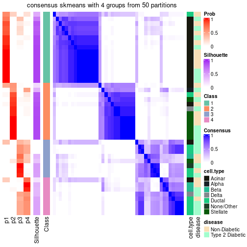</p>

</div>
</div>

Heatmaps for the membership of samples in all partitions to see how consistent they are:


<script>
$( function() {
	$( '#tabs-node-023-membership-heatmap' ).tabs();
} );
</script>
<div id='tabs-node-023-membership-heatmap'>
<ul>
<li><a href='#tab-node-023-membership-heatmap-1'>k = 2</a></li>
<li><a href='#tab-node-023-membership-heatmap-2'>k = 3</a></li>
<li><a href='#tab-node-023-membership-heatmap-3'>k = 4</a></li>
</ul>
<div id='tab-node-023-membership-heatmap-1'>
<pre><code class="r">membership_heatmap(res, k = 2)
</code></pre>

<p>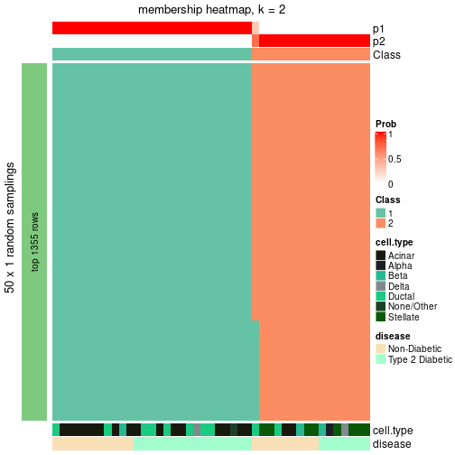</p>

</div>
<div id='tab-node-023-membership-heatmap-2'>
<pre><code class="r">membership_heatmap(res, k = 3)
</code></pre>

<p></p>

</div>
<div id='tab-node-023-membership-heatmap-3'>
<pre><code class="r">membership_heatmap(res, k = 4)
</code></pre>

<p></p>

</div>
</div>

As soon as the classes for columns are determined, the signatures
that are significantly different between subgroups can be looked for. 
Following are the heatmaps for signatures.


Signature heatmaps where rows are scaled:


<script>
$( function() {
	$( '#tabs-node-023-get-signatures' ).tabs();
} );
</script>
<div id='tabs-node-023-get-signatures'>
<ul>
<li><a href='#tab-node-023-get-signatures-1'>k = 2</a></li>
<li><a href='#tab-node-023-get-signatures-2'>k = 3</a></li>
<li><a href='#tab-node-023-get-signatures-3'>k = 4</a></li>
</ul>
<div id='tab-node-023-get-signatures-1'>
<pre><code class="r">get_signatures(res, k = 2)
</code></pre>

<p></p>

</div>
<div id='tab-node-023-get-signatures-2'>
<pre><code class="r">get_signatures(res, k = 3)
</code></pre>

<p></p>

</div>
<div id='tab-node-023-get-signatures-3'>
<pre><code class="r">get_signatures(res, k = 4)
</code></pre>

<p></p>

</div>
</div>


Signature heatmaps where rows are not scaled:


<script>
$( function() {
	$( '#tabs-node-023-get-signatures-no-scale' ).tabs();
} );
</script>
<div id='tabs-node-023-get-signatures-no-scale'>
<ul>
<li><a href='#tab-node-023-get-signatures-no-scale-1'>k = 2</a></li>
<li><a href='#tab-node-023-get-signatures-no-scale-2'>k = 3</a></li>
<li><a href='#tab-node-023-get-signatures-no-scale-3'>k = 4</a></li>
</ul>
<div id='tab-node-023-get-signatures-no-scale-1'>
<pre><code class="r">get_signatures(res, k = 2, scale_rows = FALSE)
</code></pre>

<p></p>

</div>
<div id='tab-node-023-get-signatures-no-scale-2'>
<pre><code class="r">get_signatures(res, k = 3, scale_rows = FALSE)
</code></pre>

<p></p>

</div>
<div id='tab-node-023-get-signatures-no-scale-3'>
<pre><code class="r">get_signatures(res, k = 4, scale_rows = FALSE)
</code></pre>

<p></p>

</div>
</div>


Compare the overlap of signatures from different k:

```r
compare_signatures(res)
```


`get_signature()` returns a data frame invisibly. To get the list of signatures, the function
call should be assigned to a variable explicitly. In following code, if `plot` argument is set
to `FALSE`, no heatmap is plotted while only the differential analysis is performed.

```r
# code only for demonstration
tb = get_signature(res, k = ..., plot = FALSE)
```

An example of the output of `tb` is:

```
#>   which_row         fdr    mean_1    mean_2 scaled_mean_1 scaled_mean_2 km
#> 1        38 0.042760348  8.373488  9.131774    -0.5533452     0.5164555  1
#> 2        40 0.018707592  7.106213  8.469186    -0.6173731     0.5762149  1
#> 3        55 0.019134737 10.221463 11.207825    -0.6159697     0.5749050  1
#> 4        59 0.006059896  5.921854  7.869574    -0.6899429     0.6439467  1
#> 5        60 0.018055526  8.928898 10.211722    -0.6204761     0.5791110  1
#> 6        98 0.009384629 15.714769 14.887706     0.6635654    -0.6193277  2
...
```

The columns in `tb` are:

1. `which_row`: row indices corresponding to the input matrix.
2. `fdr`: FDR for the differential test. 
3. `mean_x`: The mean value in group x.
4. `scaled_mean_x`: The mean value in group x after rows are scaled.
5. `km`: Row groups if k-means clustering is applied to rows (which is done by automatically selecting number of clusters).

If there are too many signatures, `top_signatures = ...` can be set to only show the 
signatures with the highest FDRs:

```r
# code only for demonstration
# e.g. to show the top 500 most significant rows
tb = get_signature(res, k = ..., top_signatures = 500)
```

If the signatures are defined as these which are uniquely high in current group, `diff_method` argument
can be set to `"uniquely_high_in_one_group"`:

```r
# code only for demonstration
tb = get_signature(res, k = ..., diff_method = "uniquely_high_in_one_group")
```


UMAP plot which shows how samples are separated.


<script>
$( function() {
	$( '#tabs-node-023-dimension-reduction' ).tabs();
} );
</script>
<div id='tabs-node-023-dimension-reduction'>
<ul>
<li><a href='#tab-node-023-dimension-reduction-1'>k = 2</a></li>
<li><a href='#tab-node-023-dimension-reduction-2'>k = 3</a></li>
<li><a href='#tab-node-023-dimension-reduction-3'>k = 4</a></li>
</ul>
<div id='tab-node-023-dimension-reduction-1'>
<pre><code class="r">dimension_reduction(res, k = 2, method = &quot;UMAP&quot;)
</code></pre>

<p></p>

</div>
<div id='tab-node-023-dimension-reduction-2'>
<pre><code class="r">dimension_reduction(res, k = 3, method = &quot;UMAP&quot;)
</code></pre>

<p></p>

</div>
<div id='tab-node-023-dimension-reduction-3'>
<pre><code class="r">dimension_reduction(res, k = 4, method = &quot;UMAP&quot;)
</code></pre>

<p></p>

</div>
</div>


Following heatmap shows how subgroups are split when increasing `k`:

```r
collect_classes(res)
```


Test correlation between subgroups and known annotations. If the known
annotation is numeric, one-way ANOVA test is applied, and if the known
annotation is discrete, chi-squared contingency table test is applied.

```r
test_to_known_factors(res)
```

```
#>             n_sample cell.type(p-value) disease(p-value) k
#> ATC:skmeans       43           6.32e-04            0.503 2
#> ATC:skmeans       43           8.53e-07            0.406 3
#> ATC:skmeans       24           1.57e-04            1.000 4
```


If matrix rows can be associated to genes, consider to use `functional_enrichment(res,
...)` to perform function enrichment for the signature genes. See [this vignette](https://jokergoo.github.io/cola_vignettes/functional_enrichment.html) for more detailed explanations.


 

## Session info


```r
sessionInfo()
```

```
#> R version 4.1.0 (2021-05-18)
#> Platform: x86_64-pc-linux-gnu (64-bit)
#> Running under: CentOS Linux 7 (Core)
#> 
#> Matrix products: default
#> BLAS/LAPACK: /usr/lib64/libopenblas-r0.3.3.so
#> 
#> locale:
#>  [1] LC_CTYPE=en_US.UTF-8       LC_NUMERIC=C               LC_TIME=en_US.UTF-8       
#>  [4] LC_COLLATE=en_US.UTF-8     LC_MONETARY=en_US.UTF-8    LC_MESSAGES=en_US.UTF-8   
#>  [7] LC_PAPER=en_US.UTF-8       LC_NAME=C                  LC_ADDRESS=C              
#> [10] LC_TELEPHONE=C             LC_MEASUREMENT=en_US.UTF-8 LC_IDENTIFICATION=C       
#> 
#> attached base packages:
#>  [1] grid      parallel  stats4    stats     graphics  grDevices utils     datasets  methods  
#> [10] base     
#> 
#> other attached packages:
#>  [1] genefilter_1.74.0           ComplexHeatmap_2.8.0        markdown_1.1               
#>  [4] knitr_1.33                  scRNAseq_2.6.1              SingleCellExperiment_1.14.1
#>  [7] SummarizedExperiment_1.22.0 Biobase_2.52.0              GenomicRanges_1.44.0       
#> [10] GenomeInfoDb_1.28.1         IRanges_2.26.0              S4Vectors_0.30.0           
#> [13] BiocGenerics_0.38.0         MatrixGenerics_1.4.0        matrixStats_0.59.0         
#> [16] cola_1.9.4                 
#> 
#> loaded via a namespace (and not attached):
#>   [1] circlize_0.4.13               AnnotationHub_3.0.1           BiocFileCache_2.0.0          
#>   [4] lazyeval_0.2.2                polylabelr_0.2.0              splines_4.1.0                
#>   [7] Polychrome_1.3.1              BiocParallel_1.26.1           ggplot2_3.3.5                
#>  [10] digest_0.6.27                 foreach_1.5.1                 ensembldb_2.16.3             
#>  [13] htmltools_0.5.1.1             viridis_0.6.1                 fansi_0.5.0                  
#>  [16] magrittr_2.0.1                memoise_2.0.0                 cluster_2.1.2                
#>  [19] doParallel_1.0.16             Biostrings_2.60.1             annotate_1.70.0              
#>  [22] askpass_1.1                   prettyunits_1.1.1             colorspace_2.0-2             
#>  [25] blob_1.2.1                    rappdirs_0.3.3                xfun_0.24                    
#>  [28] dplyr_1.0.7                   crayon_1.4.1                  RCurl_1.98-1.3               
#>  [31] microbenchmark_1.4-7          jsonlite_1.7.2                impute_1.66.0                
#>  [34] brew_1.0-6                    survival_3.2-11               iterators_1.0.13             
#>  [37] glue_1.4.2                    polyclip_1.10-0               gtable_0.3.0                 
#>  [40] zlibbioc_1.38.0               XVector_0.32.0                GetoptLong_1.0.5             
#>  [43] DelayedArray_0.18.0           shape_1.4.6                   scales_1.1.1                 
#>  [46] data.tree_1.0.0               DBI_1.1.1                     Rcpp_1.0.7                   
#>  [49] viridisLite_0.4.0             xtable_1.8-4                  progress_1.2.2               
#>  [52] clue_0.3-59                   reticulate_1.20               bit_4.0.4                    
#>  [55] mclust_5.4.7                  umap_0.2.7.0                  httr_1.4.2                   
#>  [58] RColorBrewer_1.1-2            ellipsis_0.3.2                pkgconfig_2.0.3              
#>  [61] XML_3.99-0.6                  dbplyr_2.1.1                  utf8_1.2.1                   
#>  [64] tidyselect_1.1.1              rlang_0.4.11                  later_1.2.0                  
#>  [67] AnnotationDbi_1.54.1          munsell_0.5.0                 BiocVersion_3.13.1           
#>  [70] tools_4.1.0                   cachem_1.0.5                  generics_0.1.0               
#>  [73] RSQLite_2.2.7                 ExperimentHub_2.0.0           evaluate_0.14                
#>  [76] stringr_1.4.0                 fastmap_1.1.0                 yaml_2.2.1                   
#>  [79] bit64_4.0.5                   purrr_0.3.4                   dendextend_1.15.1            
#>  [82] KEGGREST_1.32.0               AnnotationFilter_1.16.0       mime_0.11                    
#>  [85] slam_0.1-48                   xml2_1.3.2                    biomaRt_2.48.2               
#>  [88] compiler_4.1.0                rstudioapi_0.13               filelock_1.0.2               
#>  [91] curl_4.3.2                    png_0.1-7                     interactiveDisplayBase_1.30.0
#>  [94] tibble_3.1.2                  stringi_1.7.3                 highr_0.9                    
#>  [97] GenomicFeatures_1.44.0        RSpectra_0.16-0               lattice_0.20-44              
#> [100] ProtGenerics_1.24.0           Matrix_1.3-4                  vctrs_0.3.8                  
#> [103] pillar_1.6.1                  lifecycle_1.0.0               BiocManager_1.30.16          
#> [106] eulerr_6.1.0                  GlobalOptions_0.1.2           bitops_1.0-7                 
#> [109] irlba_2.3.3                   httpuv_1.6.1                  rtracklayer_1.52.0           
#> [112] R6_2.5.0                      BiocIO_1.2.0                  promises_1.2.0.1             
#> [115] gridExtra_2.3                 codetools_0.2-18              assertthat_0.2.1             
#> [118] openssl_1.4.4                 rjson_0.2.20                  GenomicAlignments_1.28.0     
#> [121] Rsamtools_2.8.0               GenomeInfoDbData_1.2.6        hms_1.1.0                    
#> [124] skmeans_0.2-13                Cairo_1.5-12.2                scatterplot3d_0.3-41         
#> [127] shiny_1.6.0                   restfulr_0.0.13
```


